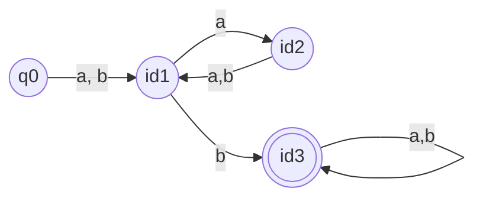

## Esercizio 1: 
>DFA parole con almeno una b in posizione pari



## Esercizio 2: 
>Complemento es.1

$\upvarepsilon + ((a+b) \cdot (a \cdot(a + b))^*)$

## Esercizio 3: 
>Grammatica Contex-Free $L(M)$ $\cup$ {$b^n a^n | n>0$}

$$S \to X \space | \space bta $$
$$X \to  aY \space | \space bY$$
$$Y \to aX \space | \space bZ$$
$$Z \to aZ | bZ | a | b$$
$$T \to bTa | \upvarepsilon$$

## Esercizio 4: 
>Dimostrare che mcm(x,y) è r.p.

$$
f^{-1}(x) = \begin{cases} min_{t \lesssim xy}(x |t \land y|t) & \text{se }xy \not= 0\\ 0 & \text{altrimenti} \end{cases}
$$


## Esercizio 5: 
>Data $f(x)$ calcolabile, definire se $$f^{-1}(x) = \begin{cases} y & \text{se } \exists y : f(y) = x \\ \uparrow & \text{altrimenti} \end{cases}$$

``` S-Programm
[A] Z₂ ← f(Z₁)
    Z₃ ← x
    IF Z₃ == Z₂ GOTO B
    Z₁ ← Z₁ + 1
    GOTO A
[B] Y ← Z₁
```

## Esercizio 6:
>Definito $P$ predicato binario calcolabile,  definire se $S$ è ricorsivo enumerabile 
>$$S = \{[x_1, x_2, x_3] \in \mathbb{N} \lvert  x_1 \in \mathbb{K} \land P(x_2, x_3) \}$$>

$$
S = \{[x_1, x_2, x_3] \in \mathbb{N} \space | \space \phi(x_1, x_1) \downarrow \land P(x_2, x_3) \}
$$
