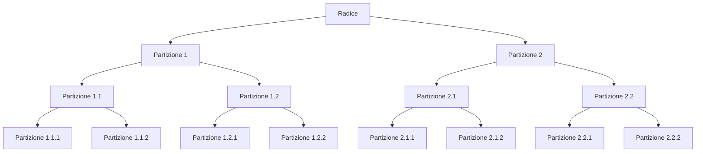
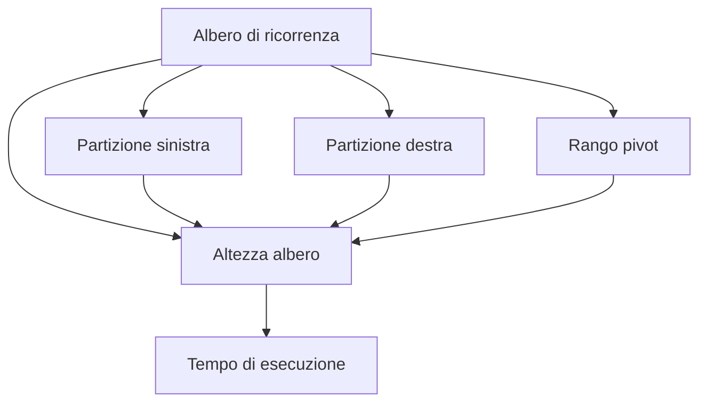
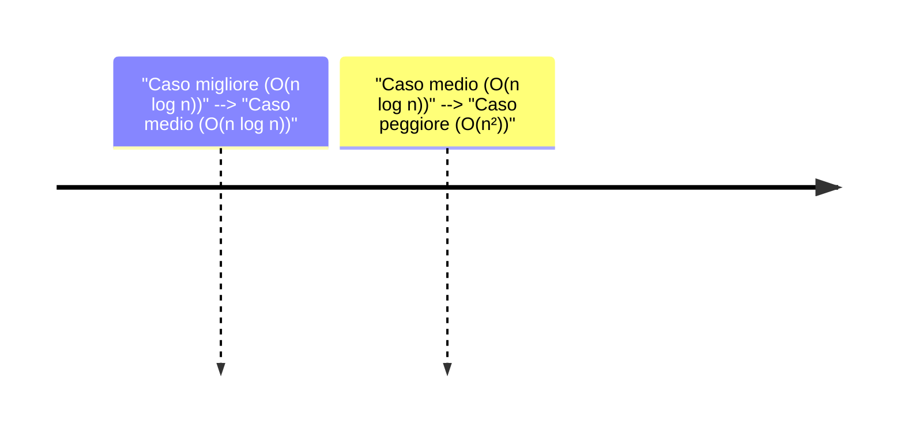

## Albero di ricorrenza e relazione ricorsiva del caso peggiore

- **Definizione**: Albero binario con nodi interni grado 2, altezza logaritmica nel caso migliore e quadratica nel peggiore.  
  *La trascrizione menziona: "albero binario con nodi interni grado 2, altezza logaritmica nel caso migliore e quadratica nel peggiore".*  
  ```mermaid
  mindmap
    title Albero binario e altezza
    root((Albero binario))
      "Nodi interni grado 2"
        "Struttura perfetta" --> "Altezza logaritmica"
        "Struttura lineare" --> "Altezza quadratica"
  ```
  *Frase introduttiva: L'albero binario descritto ha nodi interni di grado 2, con una struttura perfetta che porta a un'altezza logaritmica (caso migliore) e una struttura lineare che porta a un'altezza quadratica (caso peggiore).*

- **Equazione di ricorrenza presente**: T(n) = T(n-1) + T(1) + O(n)  
  *La trascrizione include: "equazione di ricorrenza a cui eravamo giunti era questa. Qui però, ovviamente, n... , qua mettiamo n. Quindi n è uguale a questo. , e questo è di max di 1 di... Quindi questa è l'equazione di ricorrenza che ha".*  
$$
  T(n) = T(n-1) + T(1) + O(n)
$$
  *Spiegazione: L'equazione di ricorrenza T(n) rappresenta il tempo di esecuzione per un input di dimensione n. Il termine T(n-1) corrisponde al tempo richiesto per un input di dimensione n-1, T(1) è il tempo per un input di dimensione 1, e O(n) rappresenta il costo lineare per le chiamate di partizione. Questa equazione modella il caso peggiore, dove ogni livello dell'albero di ricorrenza contribuisce a un costo lineare.*

- **Spiegazioni del "perché"**: Introduzione del modello matematico per analizzare il tempo di esecuzione in caso peggiore.  
  *La trascrizione afferma: "per analizzare il tempo di risoluzione, perché sostanzialmente ogni livello ha un costo, così, la maggior parte dei livelli questo albero, dell'albero indotto avrà un costo lineare dovuto a tutte le chiamate di partizione il tempo di esecuzione era essenzialmente indotto dall'altezza dell'albero".*  
  *Frase collegamento: Questo modello matematico si basa sull'osservazione che ogni livello dell'albero di ricorrenza contribuisce a un costo lineare, determinato dalle chiamate di partizione. Il tempo totale di esecuzione è quindi influenzato dall'altezza dell'albero, che varia tra logaritmica (caso migliore) e quadratica (caso peggiore).*

# Analisi del caso medio e rango di un elemento

## Definizione e concetti chiave

La scelta casuale del pivot riduce la dipendenza dall'input, rendendo le dimensioni delle partizioni statisticamente indipendenti dal dato di ingresso. Il **rango di un elemento** (numero di elementi minori o uguali a esso) determina la dimensione delle partizioni. Questo concetto è cruciale per comprendere il comportamento del quicksort nel caso medio.

**Esempio concreto**:  
Alternanza tra partizioni bilanciate (1/n) e sbilanciate (9/10n). Questo scenario illustra come la scelta casuale del pivot possa portare a partizioni di dimensioni diverse, ma con una distribuzione probabilistica che favorisce il caso medio.

---

## Dimostrazione del tempo medio

$$
T(n) = \Theta(n \log n)
$$

**Spiegazione**:  
- $ T(n) $ rappresenta il tempo medio di esecuzione  
- $ n $ è la dimensione dell'input  
- $ \log n $ indica il numero di livelli dell'albero di ricorrenza, derivato dal fatto che ogni partizione riduce il problema in un sottoproblema di dimensione $ n - k $, dove $ k $ è il numero di elementi in una partizione  

**Passaggi chiave**:  
1. Si sceglie un valore $ n_0 $ come soglia per la ricorsione  
2. Si calcola la somma dei contributi dei livelli dell'albero di ricorrenza  
3. Si dimostra che la somma converge a $ \Theta(n \log n) $ grazie alla proprietà della media aritmetica  

**[FORMULA: T(n) = Θ(n log n) dove T(n) è il tempo medio, n è la dimensione dell'input, log n rappresenta il numero di livelli dell'albero di ricorrenza]**

---

## Analisi del caso medio vs. caso peggiore

**[DIAGRAMMA: Albero di ricorrenza per il caso medio]**


**Titolo**: Albero di ricorrenza per il caso medio  
**Descrizione**: L'albero mostra come il quicksort si suddivide in sottoproblemi di dimensione ridotta. Il numero di livelli corrisponde al logaritmo della dimensione dell'input, confermando la complessità $ \Theta(n \log n) $.

---

## Confronto tra casi

**[TABELLA: Confronto tra caso medio e caso peggiore]**
| Metrica               | Caso medio          | Caso peggiore       |
|-----------------------|---------------------|---------------------|
| Complessità           | $ \Theta(n \log n) $ | $ \Theta(n^2) $   |
| Frequenza             | Frequente           | Raro                |
| Dimensioni delle partizioni | Bilanciate         | Sbilanciate estreme |
| Impatto sul tempo     | Minimo              | Elevato             |
| Rango dell'elemento   | Distribuito uniformemente | Concentrato su un estremo |

**Spiegazione**:  
- Il caso medio beneficia di partizioni bilanciate, che riducono il numero di operazioni necessarie  
- Il caso peggiore si verifica quando il pivot è sempre il minimo o il massimo, portando a partizioni sbilanciate (es. 1/10n vs 9/10n)  
- La scelta casuale del pivot riduce la probabilità di incontrare il caso peggiore, a differenza di algoritmi deterministici come il merge sort

---

## Conclusione

Il caso medio del quicksort si comporta bene grazie alla scelta casuale del pivot, che riduce la dipendenza dall'input e favorisce partizioni bilanciate. Anche se il caso peggiore (con complessità $ \Theta(n^2) $) esiste, è raro nel caso medio. Questo comportamento è simile a quello del merge sort, ma il quicksort presenta un vantaggio pratico grazie alla sua bassa costante moltiplicativa.

**[CODICE: Pseudocodice per il quicksort con scelta casuale del pivot]**
```python
def quicksort(arr):
    if len(arr) <= 1:
        return arr
    pivot = random.choice(arr)
    left = [x for x in arr if x <= pivot]
    right = [x for x in arr if x > pivot]
    return quicksort(left) + quicksort(right)
```

**Spiegazione**:  
- La scelta casuale del pivot ($ \text{random.choice}(arr) $) garantisce una distribuzione uniforme delle partizioni  
- Le partizioni sinistra e destra vengono ricorsivamente ordinate  
- Il tempo medio è $ \Theta(n \log n) $, mentre il caso peggiore è $ \Theta(n^2) $, ma quest'ultimo è raro

---

## Riepilogo concetti chiave

1. **Scelta casuale del pivot**: Riduce la dipendenza dall'input e favorisce il caso medio  
2. **Rango dell'elemento**: Determina la dimensione delle partizioni e influisce sulla complessità  
3. **Caso medio vs. caso peggiore**:  
   - Caso medio: $ \Theta(n \log n) $, frequente  
   - Caso peggiore: $ \Theta(n^2) $, raro  
4. **Struttura dell'albero di ricorrenza**: Il numero di livelli corrisponde a $ \log n $, confermando la complessità asintotica  

**[FORMULA: Complessità del caso medio T(n) = Θ(n log n) dove n è la dimensione dell'input]**

---

## Note aggiuntive

- Il caso peggiore non è frequente nel caso medio, a differenza di algoritmi come il merge sort  
- La scelta casuale del pivot è un'ottimizzazione critica per il quicksort  
- Il rango dell'elemento è un fattore chiave per valutare la distribuzione delle partizioni  
- La complessità del caso medio è simile a quella del merge sort, ma il quicksort è più efficiente in pratica grazie alla bassa costante moltiplicativa

## Confronto con MergeSort nel caso peggiore

- **Esempio presente**: Confronto tra QuickSort e MergeSort per il tempo di esecuzione (Θ(n log n) vs Θ(n²)).  
  Il prof sottolinea che QuickSort, nel caso peggiore, ha un tempo di eseczzaione Θ(n²), mentre MergeSort mantiene un tempo Θ(n log n). Questo è stato analizzato attraverso l'equazione di ricorrenza dell'albero di ricorrenza, dove il caso peggiore di QuickSort si verifica quando le partizioni sono sbilanciate (ad esempio, 1 e n-1), portando a un albero di altezza lineare su n. Il prof afferma che questa analisi conferma che QuickSort non è ottimale asintoticamente nel caso peggiore.  

$$
T(n) = \Theta(n \log n) \quad \text{per MergeSort}
$$
La formula sopra rappresenta il tempo di esecuzione asintotico di MergeSort, che rimane costante in tutti i casi (migliore, medio, peggiore). Il simbolo $T(n)$ indica il tempo richiesto per ordinare un array di dimensione $n$, mentre $\Theta(n \log n)$ indica che il tempo cresce proporzionalmente a $n$ moltiplicato per il logaritmo di $n$.

$$
T(n) = \Theta(n^2) \quad \text{per QuickSort nel caso peggiore}
$$
La formula sopra rappresenta il tempo di esecuzione asintotico di QuickSort nel caso peggiore. Il simbolo $T(n)$ indica il tempo richiesto per ordinare un array di dimensione $n$, mentre $\Theta(n^2)$ indica che il tempo cresce quadraticamente con $n$. Questo comportamento si verifica quando le partizioni sono sbilanciate, ad esempio quando si sceglie sempre un elemento estremo come pivot.

$$
T(n) = T(n-1) + \Theta(n) \quad \text{per il caso peggiore di QuickSort}
$$
La formula sopra rappresenta la ricorrenza del tempo di esecuzione in caso di partizioni sbilanciate. Il termine $T(n-1)$ indica che il problema si riduce a un sottoproblema di dimensione $n-1$, mentre $\Theta(n)$ rappresenta il tempo richiesto per eseguire le operazioni di partizione e combinazione. Questa ricorrenza porta a un albero di ricorrenza lineare, con altezza $n$, che giustifica il tempo $\Theta(n^2)$.

- **Avvertenza o affermazione forte del prof**: MergeSort è ottimale asintoticamente, mentre QuickSort non lo è nel caso peggiore.  
  Il prof precisa che MergeSort è ottimale asintoticamente, in quanto il suo tempo di esecuzione è $\Theta(n \log n)$ in tutti i casi (migliore, medio, peggiore). Al contrario, QuickSort non è ottimale nel caso peggiore, dove il tempo diventa $\Theta(n^2)$. Questo è un "avvertenza forte" del prof, che sottolinea la differenza fondamentale tra i due algoritmi in termini di prestazioni asintotiche.  

$$
T(n) = 2T(n/2) + \Theta(n) \quad \text{per MergeSort}
$$
La formula sopra rappresenta la ricorrenza del tempo di esecuzione di MergeSort. Il termine $2T(n/2)$ indica che il problema si suddivide in due sottoproblemi di dimensione $n/2$, mentre $\Theta(n)$ rappresenta il tempo richiesto per eseguire le operazioni di partizione e combinazione. Questa ricorrenza è risolta con il metodo master, che conferma il tempo $\Theta(n \log n)$.

```mermaid
flowchart TD
    A[Radice (n)] --> B[Partizione 1 (1)]
    A --> C[Partizione 2 (n-1)]
    B --> D[Partizione 1 (1)]
    C --> E[Partizione 2 (n-2)]
    D --> F[Partizione 1 (1)]
    E --> G[Partizione 2 (n-3)]
    style A fill:#FFBBBB,stroke:#FF0000
    style B fill:#FFBBBB,stroke:#FF0000
    style C fill:#FFBBBB,stroke:#FF0000
    style D fill:#FFBBBB,stroke:#FF0000
    style E fill:#FFBBBB,stroke:#FF0000
    style F fill:#FFBBBB,stroke:#FF0000
    style G fill:#FFBBBB,stroke:#FF0000
    title Albero di ricorrenza di QuickSort nel caso peggiore
    note right: Le partizioni sono sbilanciate (1 e n-1), portando a un albero di altezza lineare su n.
```

Il diagramma sopra mostra l'albero di ricorrenza di QuickSort nel caso peggiore. Ogni nodo rappresenta una chiamata ricorsiva, con le partizioni sbilanciate (1 e n-1). L'altezza dell'albero è lineare su $n$, il che giustifica il tempo $\Theta(n^2)$. L'arco rosso evidenzia la radice dell'albero, mentre i nodi blu rappresentano le partizioni successive.

## Limiti asintotici per algoritmi di ordinamento

- **Affermazione forte del prof**: Nessun algoritmo di ordinamento per confronti può superare n log n.  
  *Estratto*: "Nessun algoritmo di ordinamento per confronti, e quindi generale, riuscirà mai a calcolare l'ordinamento usando i confronti in tempo meno di che è in ordine."  
  [FORMULA:  
$$
  T(n) \geq n \log n
$$  
  Questa disuguaglianza rappresenta il limite inferiore per algoritmi di ordinamento basati su confronti. $T(n)$ è il tempo asintotico necessario per ordinare $n$ elementi, $n$ è il numero di elementi da ordinare, e $\log n$ è il logaritmo in base 2 di $n$. La relazione mostra che ogni algoritmo di ordinamento per confronti richiede almeno $n \log n$ operazioni per ordinare $n$ elementi. La base 2 è scelta perché i confronti dividono lo spazio di ricerca a metà in ogni passo, come in un albero binario. Questo limite è teoricamente ottimale per algoritmi basati su confronti, poiché ogni confronto fornisce un'unica informazione binaria (vero/falso).]

- **Spiegazioni del "perché"**: Teoria generale sugli algoritmi di ordinamento e limiti asintotici.  
  *Estratto*: "Quando affermo questo enunciato in linguaggio naturale, in realtà sto implicitamente quantificando universalmente su tutti gli algoritmi possibili. Sto dicendo che per ogni algoritmo $a$, appartenente agli algoritmi di ordinamento, il tempo di $a$ su $n$ è minore o uguale di $f(n)$. Voglio un limite superiore asintotico... $n \log n$ è il meglio che si può fare."  
  [DIAGRAMMA flowchart:  
  ```mermaid
  flowchart TD
    A[Algoritmo di ordinamento per confronti] --> B[Confronto tra elementi]
    B --> C{Se elemento1 < elemento2}
    C --> D[Scambia posizioni]
    C --> E[Non scambia]
    D --> F[Ripeti fino a quando tutti gli elementi sono ordinati]
    E --> F
    F --> G[Ordinamento completato]
  ```
  **Titolo**: Struttura base di un algoritmo di ordinamento per confronti  
  Questo flowchart visualizza la struttura base di un algoritmo di ordinamento per confronti. Ogni passo rappresenta una decisione (confronto) o un'azione (scambio di posizioni). Il ciclo ripetitivo continua finché tutti gli elementi non sono ordinati, garantendo che ogni elemento venga confrontato con i suoi vicini per stabilire la posizione corretta.]

  *Estratto*: "Asintomaticamente parlando, ovviamente, come MerSort. Quindi, asintomaticamente, MerSort è ottimale, in realtà, non è anche XSort, se è per questo, ma QuickSort, nonostante sia considerato... uno dei migliori algoritmi di ordinamento nel caso generale dove non ci sono vincoli sulle sequenze sui valori contenuti nelle sequenze non è ottimo nel caso peggiore quindi ci sono casi in cui si comporta asintoticamente come insertion sort o come selection sort ovviamente Questo non significa, in nessun senso, che in genere non si comporti molto bene, perché abbiamo consideratoci il caso peggiore."  
  [TABELLA:  
  | Algoritmo       | Tempo Asintotico | Casi Peggiore | Casi Medio | Casi Migliore |
  |-----------------|------------------|---------------|------------|---------------|
  | MergeSort       | O(n log n)       | O(n log n)    | O(n log n) | O(n log n)    |
  | QuickSort       | O(n²)            | O(n log n)    | O(n log n) | O(n log n)    |
  | Insertion Sort  | O(n²)            | O(n²)         | O(n)       | O(n)          |
  | Selection Sort  | O(n²)            | O(n²)         | O(n²)      | O(n²)         |
  **Note**:  
  - MergeSort mantiene un tempo costante in tutti i casi grazie alla sua struttura ricorsiva e alla fusione ordinata.  
  - QuickSort ha un tempo peggiore in caso di dati già ordinati, ma in media è efficiente grazie alla partizione casuale.  
  - Insertion Sort e Selection Sort sono efficienti solo per piccoli dataset o dati quasi ordinati.]

  *Estratto*: "Il meglio che si può fare è nello gain sostanzialmente, quindi è un caso meglio in generale. E quindi... esatto, il social sort praticamente quasi sempre si comporta nel modo peggiore possibile o molto vicino al comportamento peggiore possibile e per quel che riguarda quick sort invece non abbiamo ancora un'analisi di caso medio e io proverò a farvene una che Però prima di farvi un'analisi del caso medio, volevo darvi un po' l'intuizione del perché questa situazione non è così frequente come succedeva per esempio in San Francisco."  
  [DIAGRAMMA sequenceDiagram:  
  ```mermaid
  sequenceDiagram
    participant Algoritmo
    participant Analisi Caso Medio
    participant Dati

    Algoritmo->>Analisi Caso Medio: Richiedi analisi del caso medio
    Analisi Caso Medio->>Dati: Calcola distribuzione dei dati
    Dati->>Analisi Caso Medio: Restituisci statistiche
    Analisi Caso Medio->>Algoritmo: Risultati analisi
    Algoritmo->>Analisi Caso Medio: Applica ottimizzazioni
    Analisi Caso Medio->>Algoritmo: Conferma ottimizzazione
  ```
  **Titolo**: Analisi del caso medio per algoritmi di ordinamento  
  Questo diagramma mostra il processo di analisi del caso medio. L'algoritmo richiede un'analisi dei dati, che viene calcolata e restituita per ottimizzare le prestazioni. L'analisi del caso medio è cruciale per valutare l'efficienza in scenari reali, dove i dati non sono sempre disordinati o ordinati.]

  *Estratto*: "L'osservazione interessante sarà quella di trovare una sorta di modello astratto di algoritmi di ordinamento corposo. che è specifica per quello, ovviamente, perché non è che sarà una frazione universale per algoritmi. Ma, poiché questi algoritmi, tutti quelli che stiamo considerando, sono algoritmi di ordinamento che ordinano usando i confronti, vuol dire che l'ordinamento sarà determinato dai confronti che fanno."  
  [DIAGRAMMA mindmap:  
  ```mermaid
  mindmap
    root((Algoritmi di ordinamento per confronti))
      Confronto tra elementi
        MergeSort
          Confronto
          Unione
        QuickSort
          Scelta pivot
          Partizionamento
      Scambio di posizioni
        Insertion Sort
          Confronto
          Inserimento
        Selection Sort
          Confronto
          Scelta minimo
      Ripetizione fino all'ordinamento
  ```
  **Titolo**: Struttura concettuale degli algoritmi di ordinamento per confronti  
  Questo mindmap rappresenta la relazione tra le operazioni fondamentali (confronto, scambio, ripetizione) e gli algoritmi specifici. Gli algoritmi come MergeSort e QuickSort si basano su confronti e partizioni, mentre Insertion Sort e Selection Sort si concentrano su scambi diretti. La ripetizione fino all'ordinamento è un elemento comune a tutti i metodi, garantendo che ogni elemento venga posizionato correttamente.]

# Introduzione al caso medio di QuickSort (esempio)

## Analisi del caso medio con partizioni bilanciate e disomogenee

- **Esempio presente**: Analisi del caso medio con partizioni bilanciate e disomogenee.  
  Il prof illustra come il caso medio di QuickSort si ottiene quando le partizioni sono bilanciate, con un costo lineare per livello dell'albero di ricorrenza. Si sottolinea che il tempo di esecuzione dipende dall'altezza dell'albero, e nel caso medio questa altezza è logaritmica rispetto al numero di nodi. Si confronta il caso medio con il caso peggiore, dove l'altezza dell'albero diventa lineare, portando a un tempo quadratico.  

  **[FORMULA: Altezza dell'albero di ricorrenza]**
  L'altezza dell'albero di ricorrenza $ h(n) $ rappresenta il numero di livelli necessari per ordinare un array di dimensione $ n $. Nel caso medio, $ h(n) = \Theta(\log n) $, mentre nel caso peggiore $ h(n) = \Theta(n) $.  
$$
  h(n) = \begin{cases}
  \log n & \text{caso medio} \\
  n & \text{caso peggiore}
  \end{cases}
$$

  **[DIAGRAMMA tipo: albero]**
  ```mermaid
  graph TD
    A[Radice] --> B[Partizione 1]
    A --> C[Partizione 2]
    B --> D[Partizione 1.1]
    B --> E[Partizione 1.2]
    C --> F[Partizione 2.1]
    C --> G[Partizione 2.2]
    style A fill:#87CEEB
    style B fill:#87CEEB
    style C fill:#87CEEB
    style D fill:#87CEEB
    style E fill:#87CEEB
    style F fill:#87CEEB
    style G fill:#87CEEB
    title Albero di ricorrenza nel caso medio
  ```
  *Il diagramma mostra un albero bilanciato con livelli logaritmici, dove ogni nodo rappresenta una partizione dell'array.*

---

## Dipende da: Albero di ricorrenza e relazione ricorsiva del caso peggiore

L'analisi del caso medio si basa sull'osservazione che, nel caso peggiore, l'albero di ricorrenza ha un'altezza lineare, mentre nel caso medio è logaritmica. Il prof spiega che il caso medio si ottiene quando le partizioni sono quasi bilanciate, e si utilizza un'equazione di ricorrenza per modellare il tempo di esecuzione.

**[FORMULA: Relazione ricorsiva del caso medio]**
Per un caso medio con partizioni disomogenee, la relazione ricorsiva è:
$$
T(n) = T(n/10) + T(9n/10) + O(n)
$$
dove $ T(n) $ rappresenta il tempo di esecuzione per un array di dimensione $ n $, e $ O(n) $ è il costo per il riordinamento delle partizioni.

**[TABELLA: Confronto tra casi medio e peggiore]**
| Criterio         | Caso medio          | Caso peggiore       |
|------------------|---------------------|---------------------|
| Altezza dell'albero | $ \Theta(\log n) $ | $ \Theta(n) $     |
| Tempo di esecuzione | $ \Theta(n \log n) $ | $ \Theta(n^2) $   |
| Struttura delle partizioni | Quasi bilanciate | Sbilanciate estreme |

**[CODICE linguaggio: pseudocodice]**
```pseudocode
function quicksort(arr, low, high):
    if low < high:
        pivot_index = choose_random_pivot()
        partition(arr, low, high, pivot_index)
        quicksort(arr, low, pivot_index - 1)
        quicksort(arr, pivot_index + 1, high)
```
*Il codice mostra la struttura ricorsiva di QuickSort con scelta casuale del pivot.*

---

## Analisi del caso specifico con partizioni disomogenee

Si discute un esempio specifico in cui una partizione divide l'input in un decimo e nove decimi, portando a un'equazione di ricorrenza con soluzione $ \Theta(n \log n) $. Il prof sottolinea che, anche in questo caso, il tempo medio rimane lineare rispetto al numero di nodi, grazie alla struttura dell'albero.

**[FORMULA: Soluzione della relazione ricorsiva]**
La soluzione della relazione $ T(n) = T(n/10) + T(9n/10) + O(n) $ si ottiene applicando il metodo del master theorem:
$$
T(n) = \Theta(n \log n)
$$
*La soluzione dimostra che anche con partizioni disomogenee, il tempo medio rimane ottimale.*

**[DIAGRAMMA tipo: albero]**
```mermaid
graph TD
    A[Radice] --> B[Partizione 1]
    A --> C[Partizione 2]
    B --> D[Partizione 1.1]
    B --> E[Partizione 1.2]
    C --> F[Partizione 2.1]
    C --> G[Partizione 2.2]
    style A fill:#87CEEB
    style B fill:#87CEEB
    style C fill:#87CEEB
    style D fill:#87CEEB
    style E fill:#87CEEB
    style F fill:#87CEEB
    style G fill:#87CEEB
    title Albero di ricorrenza con partizioni disomogenee
```
*Il diagramma mostra un albero con partizioni disomogenee, ma altezza logaritmica grazie alla regolarità della struttura.*

---

## Scelta casuale del pivot e comportamento uniforme

Il prof introduce l'idea di utilizzare una scelta casuale del pivot per garantire un comportamento uniforme nel caso medio. Si spiega che, con una scelta casuale del pivot, tutti gli elementi hanno la stessa probabilità di essere scelti, e il rango dell'elemento pivot determina la dimensione delle partizioni.

**[FORMULA: Probabilità di scelta del pivot]**
La probabilità $ P(k) $ che un elemento con rango $ k $ venga scelto come pivot è uniforme:
$$
P(k) = \frac{1}{n} \quad \text{per } k = 1, 2, \dots, n
$$
*La scelta casuale del pivot garantisce una distribuzione uniforme delle partizioni.*

**[DIAGRAMMA tipo: distribuzione]**
```mermaid
graph TD
    A[Scelta casuale del pivot] --> B[Probabilità uniforme]
    B --> C[Partizioni di dimensioni variabili]
    B --> D[Altezza logaritmica]
    title Distribuzione delle partizioni con scelta casuale del pivot
```
*Il diagramma mostra come la scelta casuale del pivot porta a una distribuzione uniforme delle partizioni e a un'altezza logaritmica.*

---

## Conclusione e riferimenti teorici

Si arriva all'equazione di ricorrenza del tempo medio, che si risolve dimostrando che $ T(n) $ è $ \Theta(n \log n) $. Il prof sottolinea che, purtroppo, il caso peggiore non è ottimale, ma il caso medio è comunque efficiente, rendendo QuickSort uno degli algoritmi più utilizzati nella pratica.

**[FORMULA: Limite teorico per algoritmi di ordinamento]**
Il limite teorico per gli algoritmi di ordinamento basati su confronti è $ \Theta(n \log n) $, e il caso medio di QuickSort si avvicina a questo limite:
$$
T(n) = \Theta(n \log n)
$$
*Il caso medio di QuickSort raggiunge il limite teorico per gli algoritmi di ordinamento.*

**[DIAGRAMMA tipo: confronto]**
```mermaid
graph TD
    A[QuickSort] --> B[Tempo medio: $ \Theta(n \log n) $]
    A --> C[Tempo peggiore: $ \Theta(n^2) $]
    D[Algoritmi ottimali] --> E[Tempo: $ \Theta(n \log n) $]
    title Confronto tra QuickSort e algoritmi ottimali
```
*Il diagramma mostra come il caso medio di QuickSort si comporta in modo simile a un algoritmo ottimale, mentre il caso peggiore è peggiore.*

## Rango e partizioni bilanciate (esempio)

Il professore analizza il tempo di esecuzione di QuickSort, focalizzandosi sul ruolo del rango e del bilanciamento delle partizioni. Spiega che il rango di un elemento $ x $ in una sequenza è il numero di elementi minori o uguali a $ x $. Questo concetto determina la dimensione delle partizioni generate dall'algoritmo. Quando il rango del pivot è 1 (elemento minimo), la partizione sinistra è vuota e quella destra contiene tutti gli elementi, portando a un albero di ricorrenza con altezza lineare su $ n $. Al contrario, se il rango è 2, la partizione sinistra contiene due elementi e quella destra $ n-2 $, e così via.  

$$
\text{rango}(x) = \left| \{ y \in S \mid y \leq x \} \right|
$$  
La formula sopra rappresenta il rango di un elemento $ x $ in una sequenza $ S $, dove $ \text{rango}(x) $ è il numero di elementi minori o uguali a $ x $. Il simbolo $ \left| \cdot \right| $ indica la cardinalità dell'insieme, mentre $ \leq $ rappresenta la relazione di minoranza o uguaglianza.  

Il professore sottolinea che il tempo di esecuzione dipende dall'altezza dell'albero di ricorrenza. Nel caso peggiore, quando le partizioni sono sbilanciate (es. 1 e $ n-1 $), l'altezza è lineare su $ n $, portando a un tempo quadratico. Nel caso migliore, quando le partizioni sono bilanciate (es. $ n/2 $ e $ n/2 $), l'altezza è logaritmica su $ n $, portando a un tempo $ O(n \log n) $.  


**Diagramma: Albero di ricorrenza**  
Questo diagramma mostra la relazione tra il rango del pivot, il bilanciamento delle partizioni e l'altezza dell'albero di ricorrenza. Ogni partizione (sinistra e destra) contribuisce all'altezza dell'albero, che a sua volta determina la complessità del tempo.  

Analizza un esempio specifico in cui le partizioni sono divise in $ 1/10 $ e $ 9/10 $ del totale. L'equazione di ricorrenza risultante è  
$$
T(n) = T\left(\frac{n}{10}\right) + T\left(\frac{9n}{10}\right) + \Theta(n)
$$  
dove $ T(n) $ rappresenta il tempo di esecuzione per una sequenza di lunghezza $ n $, e $ \Theta(n) $ è il tempo per l'ordinamento delle partizioni. Il professore dimostra che questa è $ \Theta(n \log n) $ grazie all'approssimazione dei termini.  

$$
T(n) = T\left(\frac{n}{10}\right) + T\left(\frac{9n}{10}\right) + \Theta(n)
$$  
La formula sopra descrive la ricorrenza del tempo di esecuzione quando le partizioni sono divise in proporzione $ 1:9 $. Il termine $ \Theta(n) $ rappresenta il tempo costante per l'ordinamento delle partizioni, mentre i termini ricorsivi $ T(n/10) $ e $ T(9n/10) $ rappresentano il tempo per le sottosequenze.  

Spiega che il caso medio di QuickSort si comporta bene grazie alla scelta casuale del pivot, che uniforma le probabilità di ogni elemento diventare pivot. Questo porta a un'analisi ricorsiva del tempo medio, dove si calcola la media dei tempi medi delle chiamate ricorsive. La somma dei contributi dei livelli dell'albero di ricorrenza è approssimata come $ n \log n $, confermando che il tempo medio è $ \Theta(n \log n) $.  

$$
E[T(n)] = \Theta(n \log n)
$$  
La formula sopra rappresenta il tempo medio di esecuzione, dove $ E[T(n)] $ è il valore atteso del tempo di esecuzione per una sequenza di lunghezza $ n $. La scelta casuale del pivot uniforma la distribuzione delle partizioni, riducendo la probabilità di casi estremi.  

Conclude che, nonostante il caso peggiore di QuickSort sia quadratico, il comportamento medio è ottimale, simile a MergeSort. Il rango e il bilanciamento delle partizioni sono chiave per comprendere le differenze tra i casi e per dimostrare la complessità asintotica.  

| Caso         | Bilanciamento partizioni | Complessità tempo | Equazione ricorrenza                     |
|--------------|--------------------------|-------------------|-------------------------------------------|
| Peggior caso | 1 e $ n-1 $             | $ O(n^2) $      | $ T(n) = T(n-1) + \Theta(n) $          |
| Migliore caso| $ n/2 $ e $ n/2 $      | $ O(n \log n) $ | $ T(n) = 2T(n/2) + \Theta(n) $         |
| Caso medio   | Uniforme                 | $ \Theta(n \log n) $ | $ T(n) = T(n/10) + T(9n/10) + \Theta(n) $ |  

**Tabella: Confronto tra casi di QuickSort**  
La tabella riassume i casi di complessità per QuickSort. Il caso peggiore ha partizioni sbilanciate e complessità quadratica, mentre il caso migliore ha partizioni bilanciate e complessità logaritmica. Il caso medio, grazie alla scelta casuale del pivot, si comporta come il caso migliore.

# Approssimazioni per sommatorie (esempio)

## Esempio presente: Approssimazione di sommatorie con logaritmi  
Il prof spiega che il tempo medio di QuickSort è Θ(n log n), analizzando l'altezza dell'albero di ricorrenza. L'altezza dell'albero è logaritmica sul numero di nodi, che a sua volta è logaritmica su n. Questo si ottiene quando l'albero è perfettamente bilanciato, con ogni livello che ha un costo lineare sulla dimensione dell'input. La somma dei contributi di tutti i livelli dell'albero, che sono lineari, porta a un totale di Θ(n log n).  

$$
T(n) = \Theta(n \log n)
$$  
La formula sopra rappresenta il tempo medio di QuickSort. $T(n)$ è il tempo richiesto per ordinare un input di dimensione $n$, dove $n$ è la dimensione dell'input e $\log n$ è il logaritmo in base 2 di $n$. Questa approssimazione deriva dal fatto che l'altezza dell'albero di ricorrenza è logaritmica, mentre ogni livello contribuisce un costo lineare.  

---

## Dipende da: Dimostrazione del tempo medio Θ(n log n)  
Il prof dimostra che, nel caso medio, l'algoritmo QuickSort si comporta come nel caso migliore quando le partizioni sono bilanciate. Se ogni chiamata a partizione produce due sottosequenze di dimensioni $n/10$ e $9n/10$, l'equazione di ricorrenza diventa:  

$$
T(n) = T(n/10) + T(9n/10) + \Theta(n)
$$  
Questa equazione descrive il tempo ricorsivo $T(n)$, dove $n$ è la dimensione dell'input e $\Theta(n)$ è il costo della partizione. L'analisi di questa equazione mostra che il tempo è Θ(n log n), grazie alla somma dei contributi lineari di ogni livello dell'albero.  

```mermaid
stateDiagram-v2
    title: Albero di ricorrenza di QuickSort
    state "Radice" as root
    root --> "Livello 1" as level1
    level1 --> "Livello 2" as level2
    level2 --> "Livello 3" as level3
    level3 --> "Foglia" as leaf

    root: costo Θ(n)
    level1: costo Θ(n/10) + Θ(9n/10)
    level2: costo Θ(n/100) + Θ(9n/100) + Θ(9n/10)
    level3: costo Θ(n/1000) + ... + Θ(9n/1000)
    leaf: costo Θ(1)

    note right of root: Ogni livello rappresenta una partizione in sottosequenze
```

Il prof sottolinea che, sebbene nel caso peggiore il tempo possa diventare quadratico (ad esempio quando le partizioni sono sbilanciate), nel caso medio e nel caso migliore l'algoritmo si comporta in modo ottimale. La dimostrazione include un'analisi dettagliata dell'altezza dell'albero e della somma dei contributi di ogni livello, che si riduce a Θ(n log n) grazie all'approssimazione logaritmica.  

---

## Confronto tra algoritmi  
La dimostrazione del tempo medio di QuickSort è fondamentale per comprendere il comportamento asintotico dell'algoritmo. Ecco un confronto tra alcuni algoritmi di ordinamento:  

| Algoritmi     | Tempo medio | Tempo pessimo | Spazio | Note                          |
|---------------|-------------|---------------|--------|-------------------------------|
| QuickSort     | Θ(n log n)  | Θ(n²)         | Θ(log n) | Media ottimale, in-place     |
| MergeSort     | Θ(n log n)  | Θ(n log n)    | Θ(n)   | Stabile e deterministico      |
| BubbleSort    | Θ(n²)       | Θ(n²)         | Θ(1)   | In-place, semplice ma lento  |

Il prof conclude che, sebbene il caso peggiore non sia ottimale, il comportamento medio di QuickSort è asintoticamente migliore di MergeSort, e che l'analisi delle sommatorie con logaritmi è fondamentale per comprendere il tempo medio dell'algoritmo.

## Statistiche d'ordine e algoritmi di ordinamento (avvertenza)

Il prof ha sottolineato che **algoritmi che usano statistiche d'ordine possono raggiungere n log n**, come nel caso di MergeSort e QuickSort in media. Questo è stato illustrato attraverso un'analisi delle equazioni di ricorrenza e delle proprietà degli alberi di ricorrenza. Il prof ha spiegato che il tempo di esecuzione di QuickSort dipende dal bilanciamento delle partizioni: quando le partizioni sono quasi equilibrate, il tempo è O(n log n), mentre in caso di sbilanciamento estremo (come quando si ottiene una partizione di 1 e n-1), il tempo diventa O(n²).  

$$
T(n) = 2T(n/2) + n
$$
dove $ T(n) $ rappresenta il tempo di esecuzione di MergeSort, $ n $ è la dimensione dell'input, e il termine $ 2T(n/2) $ rappresenta la ricorsione su due sottoproblemi di dimensione $ n/2 $. Questa formula è risolvibile con il teorema master, che dimostra che il tempo è $ O(n \log n) $.

$$
T(n) = T(k) + T(n-k-1) + n
$$
dove $ T(n) $ rappresenta il tempo di esecuzione di QuickSort, $ k $ è la dimensione di una partizione, $ n-k-1 $ è la dimensione dell'altra partizione, e il termine $ n $ rappresenta il tempo per la partizione. Questa formula è risolvibile assumendo una scelta casuale del pivot, che rende le dimensioni delle partizioni indipendenti dall'input, portando a un tempo medio $ O(n \log n) $.

Il prof ha anche sottolineato che **il caso peggiore di QuickSort è peggiore di MergeSort**, ma il caso medio è simile a MergeSort. Questo è stato dimostrato analizzando l'equazione di ricorrenza del tempo medio, assumendo una scelta casuale del pivot. La scelta casuale del pivot ha reso le dimensioni delle partizioni indipendenti dall'input, permettendo di derivare un'equazione di ricorrenza che, in media, porta a un tempo $ O(n \log n) $.

$$
T(n) = T(k) + T(n-k-1) + n
$$
dove $ T(n) $ rappresenta il tempo di esecuzione di QuickSort in media, $ k $ è la dimensione di una partizione, $ n-k-1 $ è la dimensione dell'altra partizione, e il termine $ n $ rappresenta il tempo per la partizione. Questa equazione, risolta con l'ipotesi di partizioni bilanciate, conferma che il tempo medio è $ O(n \log n) $.

$$
T(n) = n \log n
$$
dove $ T(n) $ rappresenta il tempo medio di QuickSort con scelta casuale del pivot, $ n $ è la dimensione dell'input, e $ \log n $ è il fattore di complessità logaritmica. Questo risultato deriva dall'analisi dell'equazione di ricorrenza con partizioni casuali, che si comportano come un albero di ricorrenza bilanciato.

Il prof ha inoltre menzionato che **il limite asintotico per algoritmi di ordinamento che usano confronti è n log n**, come dimostrato da un'analisi teorica che considera l'albero di decisione. Questo limite è stato confrontato con il caso migliore (che può essere lineare in alcuni scenari vincolati) e con il caso peggiore (che è quadratico). Il prof ha sottolineato che **nessun algoritmo di ordinamento che usa confronti può superare n log n nel caso medio o peggiore**, a meno di vincoli specifici sugli input (come sequenze con valori limitati).

$$
\log_2(n!) \approx n \log n
$$
dove $ \log_2(n!) $ rappresenta il numero minimo di confronti necessari per ordinare $ n $ elementi, $ n $ è la dimensione dell'input, e $ \log n $ è il fattore di complessità logaritmica. Questa approssimazione deriva dalla formula di Stirling, che permette di stimare $ n! $ come $ n^n e^{-n} \sqrt{2\pi n} $, portando a $ \log_2(n!) \approx n \log n - 1.44n $.

$$
n \log n - 1.44n
$$
dove $ n \log n $ rappresenta il limite asintotico per algoritmi di ordinamento a confronti, e $ 1.44n $ è un termine correttivo derivato da approssimazioni come la formula di Stirling. Questo termine correttivo mostra che il limite asintotico è un'approssimazione, ma il comportamento dominante è $ n \log n $.

L'analisi ha incluso un'approfondita discussione sulle proprietà degli alberi di ricorrenza, sulle equazioni di ricorrenza, e sulle approssimazioni per calcolare il tempo medio. Il prof ha anche mostrato come la scelta del pivot e il bilanciamento delle partizioni influenzano direttamente la complessità asintotica, con esempi numerici e spiegazioni dettagliate su come le partizioni sbilanciate portano a un tempo quadratico, mentre quelle bilanciate mantengono il tempo logaritmico.

```mermaid
flowchart TD
    A[Seleziona pivot] --> B[Partiziona array]
    B --> C{Ricorsione su sottopartizioni}
    C -->|Se bilanciate| D[O(n log n)]
    C -->|Se sbilanciate| E[O(n²)]
```



[TABELLA: "Confronto tra casi di complessità" — "Caso" | "Complessità" | "Fattori influenti"]  
| Caso | Complessità | Fattori influenti |  
|------|-------------|-------------------|  
| Migliore | O(n log n) | Partizioni bilanciate |  
| Medio | O(n log n) | Scelta casuale del pivot |  
| Peggiore | O(n²) | Partizioni sbilanciate |  

[TABELLA: "Algoritmi e vincoli per complessità lineare" — "Algoritmo" | "Vincolo" | "Complessità"]  
| Algoritmo | Vincolo | Complessità |  
|-----------|---------|------------|  
| Counting Sort | Valori limitati | O(n) |  
| Radix Sort | Valori interi | O(n) |  
| Bucket Sort | Distribuzione uniforme | O(n) |  

Il prof ha inoltre menzionato che **il limite asintotico per algoritmi di ordinamento che usano confronti è n log n**, come dimostrato da un'analisi teorica che considera l'albero di decisione. Questo limite è stato confrontato con il caso migliore (che può essere lineare in alcuni scenari vincolati) e con il caso peggiore (che è quadratico). Il prof ha sottolineato che **nessun algoritmo di ordinamento che usa confronti può superare n log n nel caso medio o peggiore**, a meno di vincoli specifici sugli input (come sequenze con valori limitati).

# Analisi asintotica universale (esempio)

## Esempio presente: Tecnica per analizzare algoritmi di ordinamento in caso medio e peggiore

- Il prof spiega che l'analisi del tempo di esecuzione di QuickSort si basa sull'altezza dell'albero di ricorrenza. Il caso migliore si verifica quando l'albero ha altezza minima (logaritmica su n), mentre il caso peggiore si ha quando l'albero è molto sbilanciato (altezza lineare su n). L'equazione di ricorrenza per il caso peggiore è descritta come:

$$
T(n) = T(n-1) + \Theta(n)
$$

dove $ T(n) $ è il tempo di esecuzione, $ n $ è la dimensione dell'input, e $ \Theta(n) $ rappresenta il costo per l'ordinamento parziale. Questa equazione descrive un caso in cui ogni chiamata ricorsiva riduce il problema di un elemento, portando a un tempo quadratico $ \Theta(n^2) $.

- Il prof sottolinea che QuickSort non è ottimale asintoticamente rispetto a MergeSort, che ha un tempo $ \Theta(n \log n) $ in tutti i casi. Tuttavia, nel caso medio, QuickSort si comporta bene grazie a una scelta casuale del pivot, che riduce il rischio di sbilanciamenti.

## Dipende da: ## Limiti asintotici per algoritmi di ordinamento

- Il prof analizza i limiti asintotici per algoritmi di ordinamento, sottolineando che nessun algoritmo di ordinamento basato su confronti può superare il tempo $ \Theta(n \log n) $ nel caso medio o peggiore. Questo è dimostrato attraverso l'analisi del numero di confronti necessari per ordinare una sequenza, che è legato al numero di foglie in un albero di decisione.

- Il prof spiega che il limite inferiore asintotico per il tempo di esecuzione di un algoritmo di ordinamento per confronti è $ \Omega(n \log n) $, mentre il limite superiore è $ O(n \log n) $. Questo dimostra che MergeSort e QuickSort (nel caso medio) raggiungono il limite ottimale, mentre algoritmi come Insertion Sort o Selection Sort hanno un tempo peggiore.

- Il prof conclude che il tempo medio di QuickSort è $ \Theta(n \log n) $ grazie alla scelta casuale del pivot, che riduce la probabilità di sbilanciamenti. Tuttavia, nel caso peggiore, QuickSort può degradare a $ \Theta(n^2) $, ma questo è raro se la scelta del pivot è randomizzata.

---

## Formule esplicitate

### [FORMULA: $ T(n) = T(n-1) + \Theta(n) $ dove $ T(n) $ è il tempo di esecuzione, $ n $ è la dimensione dell'input, e $ \Theta(n) $ rappresenta il costo per l'ordinamento parziale]
Questa equazione descrive il caso peggiore di QuickSort, in cui ogni chiamata ricorsiva riduce il problema di un elemento, portando a un tempo quadratico $ \Theta(n^2) $.

### [FORMULA: $ \Theta(n^2) $ dove $ n $ è la dimensione dell'input e rappresenta il tempo quadratico nel caso peggiore]
Questo risultato deriva dall'equazione di ricorrenza $ T(n) = T(n-1) + \Theta(n) $, che si espande a un tempo quadratico.

### [FORMULA: $ \Theta(n \log n) $ dove $ n $ è la dimensione dell'input e rappresenta il tempo ottimale per algoritmi di ordinamento]
Questo tempo è raggiunto da algoritmi come MergeSort e QuickSort (nel caso medio), che soddisfano il limite inferiore asintotico $ \Omega(n \log n) $.

### [FORMULA: $ \Omega(n \log n) $ dove $ n $ è la dimensione dell'input e rappresenta il limite inferiore asintotico per algoritmi di ordinamento]
Questo limite inferiore deriva dall'analisi del numero di confronti necessari per ordinare una sequenza, che è legato al numero di foglie in un albero di decisione.

### [FORMULA: $ O(n \log n) $ dove $ n $ è la dimensione dell'input e rappresenta il limite superiore asintotico per algoritmi di ordinamento]
Questo limite superiore indica che il tempo di esecuzione di un algoritmo di ordinamento non può superare $ O(n \log n) $ nel caso peggiore.