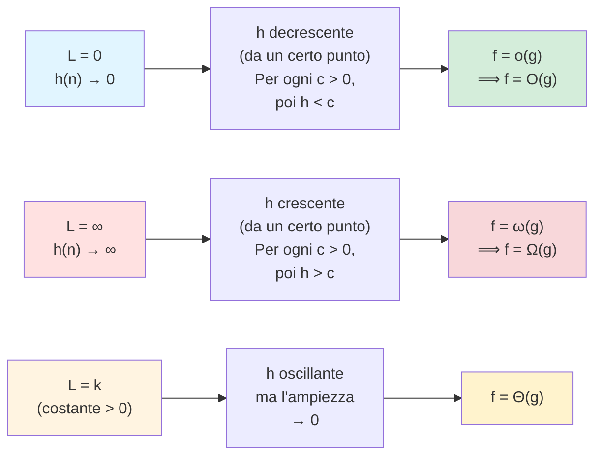

# Lezione 1: Dimostrazioni Asintotiche e Problema della Sottosequenza Massima

---

## Argomenti trattati
- Dimostrazione dell'equivalenza $\Theta = O \cap \Omega$ con scelta dell'$n_0$ comune
- Transitività di $O$, $\Omega$, $\Theta$ e struttura di relazione di equivalenza
- Metodo dei limiti: giustificazione formale e applicazioni
- Esempi: polinomi, logaritmi, esponenziali; applicazione di De L'Hôpital
- Proprietà del logaritmo rispetto a $\Theta$ (e perché l'esponenziale non la condivide)
- Problema della sottosequenza contigua di somma massima — algoritmo cubico

---

## Ripasso: le tre notazioni asintotiche

Le definizioni formali, introdotte nella lezione precedente, sono:
$$f(n) = O(g(n)) \iff \exists\, c > 0,\; \exists\, n_0 > 0 \;:\; \forall n \geq n_0,\quad f(n) \leq c \cdot g(n)$$
$$f(n) = \Omega(g(n)) \iff \exists\, c > 0,\; \exists\, n_0 > 0 \;:\; \forall n \geq n_0,\quad f(n) \geq c \cdot g(n)$$
$$f(n) = \Theta(g(n)) \iff \exists\, c_1, c_2 > 0,\; \exists\, n_0 > 0 \;:\; \forall n \geq n_0,\quad c_1 \cdot g(n) \leq f(n) \leq c_2 \cdot g(n)$$
---

## Dimostrazione: $\Theta = O \cap \Omega$

> [!abstract] Teorema
> $f(n) = \Theta(g(n))$ se e solo se $f(n) = O(g(n))$ **e** $f(n) = \Omega(g(n))$.

### Verso facile ($\Rightarrow$): da $\Theta$ a $O$ e $\Omega$

Se vale $\Theta$, esistono $c_1, $c_2$, n_0$ tali che $c_1 \cdot g(n) \leq f(n) \leq c_2 \cdot g(n)$ per ogni $n \geq n_0$.

- Per dimostrare $O$: scelgo lo **stesso** $n_0$ e $c = c_2$ → la disuguaglianza $f(n) \leq c_2 \cdot g(n)$ vale già.
- Per dimostrare $\Omega$: scelgo lo **stesso** $n_0$ e $c = c_1$ → la disuguaglianza $f(n) \geq c_1 \cdot g(n)$ vale già.

### Verso difficile ($\Leftarrow$): da $O$ e $\Omega$ a $\Theta$

> [!warning] Il problema dell'$n_0$ comune
> Sappiamo che esistono $n_{0,1}$ (per $O$) e $n_{0,2}$ (per $\Omega$), ma **non sappiamo se coincidono**. Non posso usare solo uno dei due, perché la definizione di $\Theta$ richiede che entrambe le disuguaglianze valgano **contemporaneamente** dallo stesso punto in poi.

**Soluzione:** scelgo $n_0 = \max(n_{0,1},\, n_{0,2})$.

Da questo punto in poi, sia la condizione $O$ che quella $\Omega$ sono soddisfatte. Le costanti $c_1$ e $c_2$ si scelgono come le rispettive costanti di $\Omega$ e $O$.

```
		     n_{0,1}                                     n_{0,2} = n_0
─────────────┬───────────────┬──────────────────►  n
				 │                                          │
	             │  solo O vale                      │  O e Ω valgono entrambi
```

> [!note]
> Se $n_{0,2} > n_{0,1}$, c'è un intervallo $[n_{0,1}, n_{0,2})$ in cui vale solo $O$ ma non $\Omega$. Prendendo il massimo, si elimina questo problema.

---

## Interpretazione: $O$, $o$, $\Omega$, $\omega$, $\Theta$

| Notazione       | Significato intuitivo                         | Analogia   |
| --------------- | --------------------------------------------- | ---------- |
| $f = O(g)$      | $f$ non cresce più velocemente di $g$         | $f \leq g$ |
| $f = o(g)$      | $f$ cresce **strettamente** più lento di $g$  | $f < g$    |
| $f = \Omega(g)$ | $f$ non cresce più lentamente di $g$          | $f \geq g$ |
| $f = \omega(g)$ | $f$ cresce **strettamente** più veloce di $g$ | $f > g$    |
| $f = \Theta(g)$ | $f$ e $g$ crescono alla stessa velocità       | $f = g$    |

> [!abstract] Definizione: $o$ piccolo
> $f(n) = o(g(n))$ se e solo se **per ogni** costante $c > 0$ (non solo per qualcuna), esiste $n_0$ tale che $f(n) \leq c \cdot g(n)$ per ogni $n \geq n_0$.
>
> Intuitivamente: qualunque costante positiva scelga, prima o poi il rapporto $f/g$ va sotto quella costante. Ovvero: $f$ viene **superata** da $g$ moltiplicata per qualsiasi costante, per quanto piccola.

> [!warning] $O$ vs $o$: la differenza è nel quantificatore
> - $O$: **esiste** una costante $c$ che funziona → include il caso $f = \Theta(g)$
> - $o$: **per ogni** costante $c$ → esclude il caso $f = \Theta(g)$
>
> Quindi: $f = o(g) \Rightarrow f = O(g)$, ma **non** viceversa.

---

## Metodo dei Limiti: giustificazione formale

Calcoliamo $L = \lim_{n \to \infty} \frac{T_A(n)}{T_B(n)}$ e osserviamo la funzione $h(n) = \frac{T_A(n)}{T_B(n)}$.

Poiché $T_A$ e $T_B$ sono funzioni di tempo (non decrescenti e asintoticamente positive), $h$ sarà positiva da un certo punto in poi.



> [!note] Perché funziona quando $L = k$ (costante)
> Se $h$ tende a $k$ da sopra o da sotto, le oscillazioni diventano irrilevanti rispetto a costanti opportunamente scelte. Si trovano $c_1 < k < c_2$ tali che, da un certo $n_0$ in poi, $c_1 \leq h(n) \leq c_2$, ovvero $c_1 \cdot g(n) \leq f(n) \leq c_2 \cdot g(n)$ → definizione di $\Theta$.

> [!tip] Quando usare De L'Hôpital
> Quando il limite del rapporto ha forma indeterminata $\frac{\infty}{\infty}$ o $\frac{0}{0}$, si applica De L'Hôpital: il limite del rapporto è uguale al limite del rapporto delle derivate. Le ipotesi (continuità, ecc.) sono quasi sempre soddisfatte nel nostro contesto.

---

## Esempi di calcolo asintotico

### Esempio 1: polinomio vs polinomio

Vogliamo confrontare $f(n) = 4n^2 + 10n$ con $g(n) = n^2$.
$$L = \lim_{n \to \infty} \frac{4n^2 + 10n}{n^2} = \lim_{n \to \infty} \left(4 + \frac{10}{n}\right) = 4$$
$L$ è una costante positiva finita → $f(n) = \Theta($n^2$)$.

> [!note] Proprietà generale sui polinomi
> Per qualsiasi polinomio $f(n)$ di grado $d$ con coefficiente principale positivo:
> $$f(n) = \Theta(n^d)$$
> La dimostrazione è una generalizzazione diretta: tutti i termini di grado inferiore producono termini $\to 0$ nel rapporto con $n^d$.

### Esempio 2: confronto tra due polinomi tramite transitività

Vogliamo confrontare $f(n) = 4n^2 + 10n$ con $g(n) = 5n^2 - 20n$.

Calcolare direttamente il limite del rapporto è meno immediato. **Strategia migliore:**

1. Dimostrare $f(n) = \Theta($n^2$)$ (visto sopra)
2. Dimostrare $g(n) = \Theta($n^2$)$ (stesso metodo)
3. Usare la **transitività** di $\Theta$ → $f(n) = \Theta(g(n))$

> [!tip] Strategia generale
> Quando si confrontano due funzioni complesse, conviene ridurle entrambe a una forma canonica semplice (es. $n^d$, $\log n$, $2^n$), e poi usare la transitività.

### Esempio 3: logaritmo vs polinomio (De L'Hôpital)

Vogliamo confrontare $f(n) = 15n \log_2 n + 10^{-5} n$ con $g(n) = n^2$.
$$L = \lim_{n \to \infty} \frac{15n \log_2 n + 10^{-5} n}{n^2} = \lim_{n \to \infty} \frac{15 \log_2 n}{n} + \frac{10^{-5}}{n}$$
Il secondo termine va a 0 ovviamente. Per il primo, forma $\frac{\infty}{\infty}$ → De L'Hôpital:
$$\lim_{n \to \infty} \frac{\log_2 n}{n} = \lim_{n \to \infty} \frac{\frac{d}{dn}\log_2 n}{\frac{d}{dn} n} = \lim_{n \to \infty} \frac{\frac{1}{n \ln 2}}{1} = \lim_{n \to \infty} \frac{1}{n \ln 2} = 0$$
$L = 0$ → $f(n) = o($n^2$)$, ovvero $f(n) = O($n^2$)$ ma $f(n) \neq \Omega($n^2$)$.

### Esempio 4: esponenziali

Confrontare $f(n) = 2^n$ con $g(n) = 4^n = 2^{2n}$.
$$\frac{f(n)}{g(n)} = \frac{2^n}{2^{2n}} = \frac{1}{2^n} = \left(\frac{1}{2}\right)^n \xrightarrow{n \to \infty} 0$$
$L = 0$ → $f(n) = o(g(n))$, cioè $2^n$ cresce **strettamente** più lento di $4^n$.

> [!example] Teta tra funzioni con stessa base
> $f(n) = 10^3 \cdot \log_2 n^{100}$ vs $g(n) = \log_4 n$:
>
> $\log_2 n^{100} = 100 \log_2 n$ e $\log_4 n = \frac{\log_2 n}{\log_2 4} = \frac{\log_2 n}{2}$
>
> Il rapporto è: $\frac{10^3 \cdot 100 \log_2 n}{\frac{\log_2 n}{2}} = 10^3 \cdot 100 \cdot 2 = 2 \times 10^5$ → costante → $f(n) = \Theta(g(n))$.

---

## Transitività di $O$, $\Omega$, $\Theta$

> [!abstract] Teorema: $\Theta$ è una relazione di equivalenza
> La relazione $f \sim g \iff f(n) = \Theta(g(n))$ è riflessiva, simmetrica e transitiva.

### Dimostrazione della transitività di $O$

Vogliamo dimostrare: se $f = O(g)$ e $g = O(h)$, allora $f = O(h)$.

**Ipotesi:**
- $\exists\, n_1 > 0,\; c_1 > 0 \;:\; \forall n \geq n_1,\quad f(n) \leq c_1 \cdot g(n)$
- $\exists\, n_2 > 0,\; c_2 > 0 \;:\; \forall n \geq n_2,\quad g(n) \leq c_2 \cdot h(n)$

**Costruzione:** scelgo $n_3 = \max($n_1$, $n_2$)$. Da $n_3$ in poi valgono **entrambe** le ipotesi.

Per $n \geq n_3$:
$$f(n) \leq c_1 \cdot g(n) \leq c_1 \cdot c_2 \cdot h(n)$$
Scelgo $c_3 = c_1 \cdot c_2 > 0$ (prodotto di positivi). Ho dimostrato $f = O(h)$. $\square$

> [!note] Stessa dimostrazione per $\Omega$ e $\Theta$
> Il ragionamento è identico per $\Omega$. Per $\Theta$, si combina transitività di $O$ e $\Omega$.

---

## Proprietà del Logaritmo rispetto a $\Theta$

> [!abstract] Teorema
> Se $f(n) = \Theta(g(n))$, allora $\log f(n) = \Theta(\log g(n))$.

> [!warning] L'esponenziale NON ha questa proprietà
> Se $f(n) = \Theta(g(n))$, **non** è detto che $2^{f(n)} = \Theta(2^{g(n)})$.
>
> **Controesempio:** $f(n) = n$ e $g(n) = 2n$ sono in $\Theta$ tra loro? No! Ma il punto è:
> $n^2$ e $n^3$ non sono in $\Theta$, ma $\log($n^2$) = 2\log n$ e $\log($n^3$) = 3\log n$ sono in $\Theta$ tra loro.
> Viceversa, $2^{n^2}$ e $2^{n^3}$ **non** sono in $\Theta$ (il rapporto è $2^{$n^3$ - n^2} \to \infty$).

### Dimostrazione intuitiva (dalla definizione)

Sappiamo che $\exists\, $c_1$, $c_2$, n_0$ tali che per $n \geq n_0$:
$$c_1 \cdot g(n) \leq f(n) \leq c_2 \cdot g(n)$$
Per la **monotonicità** del logaritmo, possiamo applicarlo a tutta la catena:
$$\log(c_1 \cdot g(n)) \leq \log f(n) \leq \log(c_2 \cdot g(n))$$
Espandendo con la proprietà del prodotto $\log(ab) = \log a + \log b$:
$$\log c_1 + \log g(n) \leq \log f(n) \leq \log c_2 + \log g(n)$$
Ora $\log c_1$ e $\log c_2$ sono **costanti** (anche potenzialmente negative, ma questo non è un problema):
$$\frac{\log g(n) + \log c_1}{\log g(n)} \leq \frac{\log f(n)}{\log g(n)} \leq \frac{\log g(n) + \log c_2}{\log g(n)}$$
I due lati tendono entrambi a 1 (poiché $\log g(n) \to \infty$ e le costanti sommative diventano irrilevanti) → per il metodo dei limiti, il rapporto tende a una costante positiva → $\Theta$.

> [!quote]
> *"Il punto chiave è questo: una costante moltiplicativa, prendendo il logaritmo, diventa una costante additiva, e le costanti additive sono irrilevanti rispetto a funzioni che crescono all'infinito. Con l'esponenziale è il contrario: una costante moltiplicativa nell'esponente diventa un fattore moltiplicativo esponenziale, e quello non è più trascurabile."*

> [!note] Generalizzazione: torri di esponenziali
> Il logaritmo "taglia" un solo livello di esponenziale. Per confrontare $2^{2^n}$ e $2^{4^n}$ bisognerebbe applicare il logaritmo due volte ($\log \log$). La torre degli esponenziali ha come inversa la torre dei logaritmi.

---

## Problema: Sottosequenza Contigua di Somma Massima

### Definizione del problema

> [!abstract] Definizione
> Data una sequenza $A[0 \ldots n-1]$ di $n$ numeri interi (positivi, negativi, nulli), una **sottosequenza contigua** (o *infisso*) è un sottoinsieme di elementi consecutivi della sequenza, identificato da una coppia di indici $(i, j)$ con $0 \leq i \leq j \leq n-1$.
>
> Per ogni sottosequenza contigua $X = [i, j]$, si definisce la sua **somma**:
> $$S(X) = \sum_{k=i}^{j} A[k]$$
>
> **Obiettivo:** trovare il valore massimo di $S(X)$ tra tutte le possibili sottosequenze contigue.

> [!example] Esempio concreto
> ```
> Indici:  0    1    2     3    4   5  6   7
> Array:  [3,  -1,   8,  -10,  20,  2, 5, -3]
> ```
> La sottosequenza $X = [2, 4]$ dà $S = 8 + (-10) + 20 = 18$.
> La sottosequenza $X = [4, 6]$ dà $S = 20 + 2 + 5 = 27$.
>
> Senza il vincolo di contiguità, basterebbe sommare tutti i valori non negativi. **Il vincolo di contiguità rende il problema non banale.**

> [!note] Gestione del caso "tutti negativi"
> Se tutti i valori sono negativi, la sottosequenza ottimale è quella **vuota**, con somma 0. Per questo l'algoritmo parte con $\text{somma\_massima} = 0$ — se non trova niente di meglio, la risposta sarà 0.

### Quante sono le sottosequenze contigue?

Le sottosequenze contigue non vuote corrispondono biunivocamente alle **coppie di indici** $(i, j)$ con $0 \leq i \leq j \leq n-1$.

Abbiamo già dimostrato nella lezione precedente che queste sono:
$$\frac{n(n+1)}{2} = \Theta(n^2)$$
Questo è molto meglio dell'esponenziale $2^n$ delle sottosequenze generali (non contigue). Il vincolo di contiguità riduce drasticamente lo spazio di ricerca.

### Algoritmo 1: Forza bruta — $O($n^3$)$

**Idea:** generare tutte le coppie $(i, j)$, calcolare la somma di ogni sottosequenza, tenere il massimo.

```python
def max_subarray_cubic(A):
    n = len(A)
    max_sum = 0  # sottosequenza vuota ha somma 0

    for i in range(n):          # inizio sottosequenza
        for j in range(i, n):   # fine sottosequenza
            x = 0
            for k in range(i, j + 1):   # calcolo somma
                x = x + A[k]
            if x > max_sum:
                max_sum = x

    return max_sum
```

### Analisi della complessità dell'algoritmo cubico

Le istruzioni dominanti sono quelle nel ciclo più interno. Il numero di esecuzioni dell'istruzione `x = x + A[k]` è:
$$T(n) = \sum_{i=0}^{n-1} \sum_{j=i}^{n-1} \sum_{k=i}^{j} 1 = \sum_{i=1}^{n} \sum_{j=i}^{n} (j - i + 1)$$
**Primo passo:** calcolare la sommatoria interna. Fissato $i$, al variare di $j$ da $i$ a $n-1$, i termini $(j - i + 1)$ assumono i valori $1, 2, \ldots, n-i$:
$$\sum_{j=i}^{n-1} (j - i + 1) = \sum_{l=1}^{n-i} l = \frac{(n-i)(n-i+1)}{2}$$
**Secondo passo:** sostituendo e sommando su $i$:
$$T(n) = \sum_{i=0}^{n-1} \frac{(n-i)(n-i+1)}{2}$$
Sviluppando $(n-i)(n-i+1) = $n^2$ - 2ni + $i^2$ + n - i$, il termine dominante è $i^2$, la cui sommatoria è:
$$\sum_{i=1}^{n} i^2 = \frac{n(n+1)(2n+1)}{6} = \Theta(n^3)$$
$$\boxed{T(n) = \Theta(n^3)}$$
---

## Anticipazione: verso l'algoritmo quadratico

> [!note] *(Verrà approfondito nella prossima lezione)*

Il ciclo interno fa **lavoro inutile**: ogni volta che $j$ avanza di 1, ricalcola da zero l'intera somma $\sum_{k=i}^{j} A[k]$, che era già stata calcolata al passo precedente!

**Osservazione chiave:** se conosco $S([i, j])$, allora:
$$S([i, j+1]) = S([i, j]) + A[j+1]$$
cioè posso estendere la sottosequenza a destra in **tempo costante**, senza ricalcolare tutto. Questo elimina il ciclo `k`, abbassando la complessità da $O($n^3$)$ a $O($n^2$)$.

> [!note] *(Verrà approfondito nelle lezioni successive)*

Abbassare ulteriormente da $O($n^2$)$ a $O(n)$ richiede di **non analizzare tutte le sottosequenze**, scartandone alcune con la garanzia formale che non possono contenere la soluzione ottima.

> [!quote]
> *"Il numero di sottosequenze contigue è quadratico, quindi l'unico modo di abbassare rispetto al quadratico è non analizzare tutte le sottosequenze — devo avere un modo di scartarle con la certezza di non perdere quella buona."*

---

> [!summary] Punti chiave della lezione
> 1. **$\Theta = O \cap \Omega$**: la dimostrazione del verso non banale richiede di scegliere $n_0 = \max(n_{0,1}, n_{0,2})$ per garantire che entrambe le condizioni valgano contemporaneamente.
> 2. **Transitività**: $O$, $\Omega$ e $\Theta$ sono transitive; la costante si ottiene come prodotto $c_3 = c_1 \cdot c_2$.
> 3. **Metodo dei limiti**: $L=0 \Rightarrow o$; $L=\infty \Rightarrow \omega$; $L=k>0 \Rightarrow \Theta$. Utile De L'Hôpital per forme indeterminate.
> 4. **Logaritmo e $\Theta$**: $f = \Theta(g) \Rightarrow \log f = \Theta(\log g)$, perché una costante moltiplicativa diventa additiva. **Non vale per l'esponenziale**: la costante moltiplicativa diventa esponenziale.
> 5. **Sottosequenza massima — algoritmo cubico**: le sottosequenze contigue sono $\Theta($n^2$)$; calcolare la somma di ciascuna costa $O(n)$; totale $\Theta($n^3$)$.

---

## Prossimi argomenti
- [ ] Algoritmo quadratico per la sottosequenza massima (eliminazione del ciclo interno)
- [ ] Algoritmo lineare: proprietà che permettono di scartare sottosequenze senza perdersi la soluzione ottima
- [ ] Dimostrazione formale della correttezza dell'algoritmo lineare tramite invariante di ciclo

---

#APA #notazione-asintotica #O-grande #theta #limiti #De-L-Hopital #transitività #sottosequenza-massima #algoritmo-cubico