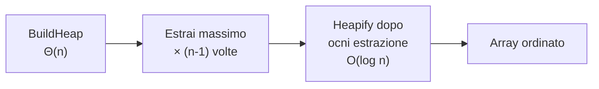

# APA — Lezione 5: Selection Sort, Struttura Heap e HeapSort

**Corso:** Analisi e Progettazione di Algoritmi | **CFU:** 6 | **Data:** 19/03/2026

---

## Argomenti trattati

- Ripasso Insertion Sort e Merge Sort: approcci incrementale vs divide-et-impera
- Selection Sort: definizione, dualità con Insertion Sort, pseudocodice, analisi $\Theta(n^2)$
- Motivazione a migliorare Selection Sort: il ruolo della memoria
- Struttura dati Heap: definizione, proprietà di ordinamento parziale
- Implementazione heap come array: corrispondenza nodo ↔ indice, funzioni figlio/padre
- Procedura `Heapify` (sift-down): pseudocodice e analisi $O(h)$
- Costruzione dello heap: `BuildHeap`, analisi sorprendente $\Theta(n)$
- HeapSort: pseudocodice, analisi $O(n \log n)$ superiore e inferiore

---

## Ripasso: Insertion Sort vs Merge Sort

I due algoritmi di ordinamento visti finora seguono approcci radicalmente diversi:

| Algoritmo | Approccio | Caso migliore | Caso peggiore |
|---|---|---|---|
| Insertion Sort | Incrementale (estende la parte ordinata di 1) | $\Theta(n)$ | $\Theta(n^2)$ |
| Merge Sort | Divide-et-impera (ricorsivo, poi fonde) | $\Theta(n \log n)$ | $\Theta(n \log n)$ |

---

## Selection Sort

### Idea intuitiva: il duale di Insertion Sort

Insertion Sort seleziona l'elemento (il prossimo nella sequenza non ordinata) e cerca la posizione corretta. Selection Sort fa l'opposto: **seleziona la posizione** e va a cercare l'elemento che deve occuparla.

Concretamente, Selection Sort seleziona le posizioni dall'ultima verso la prima. Per ciascuna posizione $i$, cerca il massimo tra gli elementi in $A[1 \ldots i]$ (la porzione ancora non ordinata) e lo scambia con $A[i]$. Così la parte ordinata cresce dalla fine.

> [!abstract] Definizione: Selection Sort
> Per ogni posizione $i$ da $n$ scendendo a $2$, si trova il massimo dell'array $A[1 \ldots i]$ e lo si scambia con $A[i]$. Al termine, $A$ è ordinato in modo crescente.

### Pseudocodice

```python
def selection_sort(A, n):
    for i in range(n, 1, -1):          # i da n a 2
        j = find_max(A, i)             # posizione del massimo in A[1..i]
        swap(A, i, j)                  # scambia A[i] con A[j]

def find_max(A, n):
    r = 1
    for p in range(2, n + 1):
        if A[p] > A[r]:
            r = p
    return r
```

### Analisi della complessità

Le istruzioni di `swap` e della testa del ciclo `for` esterno costano $\Theta(n)$ complessivamente. Il costo dominante è `find_max`, chiamata $n-1$ volte con input di dimensione via via decrescente:

$$T(n) = \sum_{i=2}^{n} T_{\text{findmax}}(i) = \sum_{i=2}^{n} \Theta(i) = \Theta\!\left(\sum_{i=2}^{n} i\right) = \Theta\!\left(\frac{n(n+1)}{2}\right) = \Theta(n^2)$$

> [!warning] Nessun caso migliore diverso
> A differenza di Insertion Sort, Selection Sort ha sempre complessità $\Theta(n^2)$, indipendentemente dall'input. Anche se l'array fosse già ordinato, `find_max` deve comunque scorrere tutta la sequenza perché non sa dove si trova il massimo.

---

## Verso HeapSort: l'idea della memoria

Il problema di Selection Sort è che ogni chiamata a `find_max` parte da zero, dimenticando tutto quello che ha visto nelle chiamate precedenti. Eppure, durante la ricerca del massimo, l'algoritmo fa confronti e acquisisce informazioni sulle relazioni di ordine tra elementi — che vengono poi dimenticate.

> [!tip] Parole del Professore
> > [!quote]
> > "Se il nostro algoritmo ricordasse le cose che ha già visto, potrebbe evitare di fare confronti inutili nelle ricerche successive. La prima ricerca del massimo sarà sempre $\Theta(n)$ — non c'è modo di evitarlo su input arbitrario. Ma le ricerche successive potrebbero costare molto meno, se disponessimo dell'informazione accumulata in precedenza."

L'idea è mantenere una struttura dati che rappresenta un **ordinamento parziale** tra gli elementi: non sappiamo l'ordinamento totale, ma conosciamo alcune relazioni tra coppie. Questa struttura ha naturalmente forma di albero.

---

## Struttura Dati Heap (Binary Heap)

### Definizione

> [!abstract] Definizione: Heap (max-heap)
> Un **heap** è una struttura dati che consiste di:
> 1. Un **albero binario completo**: tutti i livelli sono pieni tranne eventualmente l'ultimo, che viene riempito da sinistra a destra.
> 2. La **proprietà heap**: per ogni nodo $x$ con figli $y$ e $z$:
>    $$A[x] \geq A[y] \quad \text{e} \quad A[x] \geq A[z]$$
>    ovvero ogni nodo è **maggiore o uguale** dei propri figli.

La proprietà heap è una relazione di **ordinamento parziale**: tra nodi in sottoalberi diversi non sappiamo niente, tra un nodo e i suoi discendenti (per transitività) sappiamo che il nodo è il più grande.

> [!tip] Conseguenza fondamentale
> Il massimo dell'intero heap si trova **sempre nella radice** (posizione 1 nell'array).

### Differenza rispetto all'albero binario di ricerca

| Proprietà | Heap | BST |
|---|---|---|
| Relazione d'ordine | Parziale (nodo ≥ figli) | Totale (sx < nodo < dx) |
| Ricerca del massimo | $O(1)$ (è la radice) | $O(\log n)$ (nodo più a destra) |
| Ricerca di un elemento | $O(n)$ | $O(\log n)$ |
| Costo di costruzione | $\Theta(n)$ | $\Theta(n \log n)$ |

Un heap è molto più debole di un BST, ma proprio per questo è molto più efficiente da costruire.

---

## Implementazione dell'Heap come Array

Un albero binario completo si può rappresentare implicitamente all'interno di un array, senza puntatori espliciti, attraverso la seguente corrispondenza posizionale.

La **numerazione in ampiezza** (livello per livello, da sinistra a destra) assegna l'indice $1$ alla radice, $2$ e $3$ ai figli della radice, $4$–$7$ al secondo livello, e così via:

```
        1
      /   \
    2       3
   / \     / \
  4   5   6   7
 / \
8   9
```

Da questa corrispondenza si ricavano le funzioni di navigazione dell'albero (con indici che partono da 1):

$$\text{FiglioSinistro}(i) = 2i \qquad \text{FiglioDestra}(i) = 2i + 1 \qquad \text{Padre}(i) = \lfloor i/2 \rfloor$$

> [!info] Proprietà strutturali dell'array
> - I **nodi interni** (quelli con almeno un figlio) occupano le posizioni $1$ a $\lfloor n/2 \rfloor$.
> - Le **foglie** occupano le posizioni $\lfloor n/2 \rfloor + 1$ a $n$.
> - Ogni array di lunghezza $n$ corrisponde implicitamente a un albero binario completo.

La proprietà heap si traduce in: per ogni $i \in \{1, \ldots, \lfloor n/2 \rfloor\}$ (nodo interno):

$$A[i] \geq A[2i] \quad \text{e} \quad A[i] \geq A[2i+1] \quad \text{(se esiste)}$$

---

## Procedura `Heapify` (Sift-Down)

### Problema che risolve

Dato un array in cui i due sottoalberi del nodo $i$ sono già heap validi, ma il nodo $i$ stesso potrebbe violare la proprietà (perché ci è stato messo un elemento che potrebbe essere più piccolo dei suoi figli), `Heapify` **ripristina la proprietà heap** nell'intero albero radicato in $i$.

> [!warning] Precondizione fondamentale
> `Heapify(A, i)` funziona correttamente **solo se** i sottoalberi sinistro e destro di $i$ sono già degli heap. Se questa condizione non è soddisfatta, il risultato è impredicibile.

### Pseudocodice

```python
def heapify(A, i, heap_size):
    # trova il massimo tra il nodo i e i suoi figli
    max_idx = i
    left  = 2 * i
    right = 2 * i + 1

    if left <= heap_size and A[left] > A[max_idx]:
        max_idx = left
    if right <= heap_size and A[right] > A[max_idx]:
        max_idx = right

    # se il massimo non è i, scambia e continua ricorsivamente
    if max_idx != i:
        swap(A, i, max_idx)
        heapify(A, max_idx, heap_size)
```

### Funzionamento

L'algoritmo confronta il nodo $i$ con i suoi due figli. Il massimo dei tre viene portato in posizione $i$ (se non ci era già). Se è stato fatto uno scambio, il nodo problematico è sceso di un livello: si richiama ricorsivamente `Heapify` su quel sottoalbero, che ora ha una violazione solo nella radice. Il processo si ripete finché o la posizione è corretta o si raggiunge una foglia.

### Analisi

Ogni chiamata ricorsiva scende di un livello. Il numero massimo di scambi è l'altezza dell'albero. Su un albero di altezza $h$:

$$T_{\text{heapify}}(h) = O(h)$$

Poiché un heap completo con $n$ nodi ha altezza $h = \lfloor \log_2 n \rfloor$:

$$T_{\text{heapify}}(n) = O(\log n)$$

---

## Costruzione dello Heap: `BuildHeap`

### Idea

Dato un array arbitrario, vogliamo trasformarlo in un heap. Non possiamo applicare `Heapify` alla radice subito, perché la precondizione richiede che i sottoalberi siano già heap. La strategia è applicare `Heapify` **dal basso verso l'alto**.

Le foglie (posizioni $\lfloor n/2 \rfloor + 1$ a $n$) sono heap triviali: un albero con un solo nodo soddisfa automaticamente la proprietà heap. Poi si applica `Heapify` partendo dall'ultimo nodo interno $\lfloor n/2 \rfloor$ e risalendo fino alla radice.

```python
def build_heap(A, n):
    heap_size = n
    for i in range(n // 2, 0, -1):   # da floor(n/2) a 1
        heapify(A, i, heap_size)
```

### Analisi: limite superiore ingenuo

Applicando `Heapify` $\lfloor n/2 \rfloor$ volte, ciascuna con costo $O(\log n)$:

$$T_{\text{build}}(n) = \frac{n}{2} \cdot O(\log n) = O(n \log n)$$

### Analisi precisa: il risultato è $\Theta(n)$

L'analisi ingenua è troppo pessimista: i nodi vicini alle foglie hanno altezze piccole, e la maggior parte dei nodi è vicina alle foglie.

Denotiamo con $h$ l'altezza di un nodo. Il costo di `Heapify` su un nodo di altezza $h$ è $O(h)$. In un albero completo con $n$ nodi, ci sono al massimo $\lceil n/2^{h+1} \rceil$ nodi di altezza $h$. Quindi il costo totale di `BuildHeap` è:

$$T_{\text{build}}(n) = \sum_{h=0}^{\lfloor \log n \rfloor} \left\lceil \frac{n}{2^{h+1}} \right\rceil \cdot O(h) = O\!\left(n \sum_{h=0}^{\infty} \frac{h}{2^h}\right) = O(n)$$

dove si usa il fatto che $\sum_{h=0}^{\infty} h/2^h = 2$ (serie nota).

$$\boxed{T_{\text{build}}(n) = \Theta(n)}$$

> [!warning] Risultato sorprendente
> Costruire uno heap da un array arbitrario costa $\Theta(n)$, non $\Theta(n \log n)$. L'analisi ingenue sovrastimava perché la maggioranza dei nodi ha altezza piccola (vicino alle foglie) e `Heapify` su di essi costa $O(1)$.

---

## HeapSort

### Algoritmo

HeapSort combina la costruzione dello heap con la sua distruzione sistematica per estrarre il massimo in ordine:

```python
def heap_sort(A, n):
    # Fase 1: costruisce il max-heap in A[1..n] in Theta(n)
    build_heap(A, n)
    heap_size = n

    # Fase 2: estrae il massimo n-1 volte
    for i in range(n, 1, -1):
        swap(A, 1, i)          # porta il massimo in A[i]
        heap_size -= 1         # elimina A[i] dallo heap
        heapify(A, 1, heap_size)  # ripristina la proprietà
```

### Funzionamento

Dopo `BuildHeap`, il massimo si trova in $A[1]$. Si scambia con l'ultima posizione $A[n]$: il massimo è ora al suo posto definitivo. Si riduce la dimensione dello heap di 1 ed si applica `Heapify` sulla nuova radice (che potrebbe violare la proprietà) per ripristinare lo heap sui rimanenti $n-1$ elementi. Si ripete $n-1$ volte.



### Analisi

- **Fase 1** (`BuildHeap`): $\Theta(n)$
- **Fase 2** (`n-1` iterazioni, ciascuna con `Heapify` a costo $O(\log n)$): $O(n \log n)$

Totale: $T(n) = \Theta(n) + O(n \log n) = O(n \log n)$

> [!info] Il costo è esattamente $\Theta(n \log n)$, non solo $O(n \log n)$
> Il limite inferiore $\Omega(n \log n)$ deriva dal **Teorema degli Alberi di Decisione** (che verrà dimostrato più avanti): nessun algoritmo di ordinamento basato su confronti può fare meglio di $\Omega(n \log n)$. Quindi HeapSort è asintoticamente ottimale.

### Confronto finale

| Algoritmo | Caso migliore | Caso medio | Caso peggiore | Memoria aggiuntiva |
|---|---|---|---|---|
| Insertion Sort | $\Theta(n)$ | $\Theta(n^2)$ | $\Theta(n^2)$ | $O(1)$ |
| Merge Sort | $\Theta(n \log n)$ | $\Theta(n \log n)$ | $\Theta(n \log n)$ | $O(n)$ |
| HeapSort | $\Theta(n \log n)$ | $\Theta(n \log n)$ | $\Theta(n \log n)$ | $O(1)$ |

HeapSort combina i vantaggi di Merge Sort (complessità garantita $\Theta(n \log n)$) e di Insertion Sort (ordinamento in-place, $O(1)$ memoria aggiuntiva).

---

> [!abstract] Punti chiave della lezione
> - **Selection Sort** è il duale di Insertion Sort: seleziona le posizioni e cerca l'elemento. Ha sempre costo $\Theta(n^2)$ perché `find_max` è ottimale ma non ha memoria.
> - **HeapSort** nasce dall'idea di memorizzare le relazioni d'ordine viste durante la prima ricerca del massimo in una struttura dati (lo heap), evitando lavoro ridondante nelle ricerche successive.
> - Uno **heap** è un albero binario completo con la proprietà che ogni nodo è ≥ dei suoi figli. Il massimo è sempre in radice.
> - L'implementazione come array usa la corrispondenza $\text{figlio\_sinistro}(i) = 2i$, $\text{figlio\_destro}(i) = 2i+1$.
> - **`Heapify`** ripristina la proprietà heap in $O(h)$ dove $h$ è l'altezza del nodo. **Precondizione**: i sottoalberi figli devono già essere heap.
> - **`BuildHeap`** applica `Heapify` dall'ultimo nodo interno verso la radice: costo sorprendentemente $\Theta(n)$ (non $O(n \log n)$).
> - **HeapSort** è $\Theta(n \log n)$ in tutti i casi e ordina in-place.

## Prossimi argomenti

- [ ] Dimostrazione precisa che `BuildHeap` è $\Theta(n)$
- [ ] Analisi comparativa HeapSort vs Merge Sort in pratica
- [ ] Limite inferiore $\Omega(n \log n)$ per il problema dell'ordinamento (Teorema degli Alberi di Decisione)
- [ ] Algoritmi di ordinamento in tempo lineare (non basati su confronti)

#APA #selection-sort #heap #heapify #heapsort #albero-binario #ordinamento #analisi-complessità
