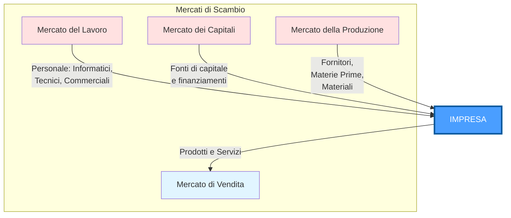

# EOA — Lezione 1: L'Impresa quale Sistema

**Corso:** Economia dell'Organizzazione e dell'Azienda  

**Docente:** Prof. Giuseppe Piccirillo

**Programma:** Laurea Triennale in Informatica — II Semestre 2025–2026

---

## Definizione di Impresa

> [!info] **Definizione: Impresa**
> Organizzazione economica che mediante l'impiego di un complesso differenziato di risorse, svolge processi di acquisizione e di produzione di beni o servizi da scambiare con entità esterne al fine di conseguire un reddito.

### Elementi costitutivi dell'impresa

L'impresa si caratterizza per un insieme di elementi fondamentali che ne definiscono la natura e il funzionamento:

**Contenuto economico delle attività:** tutte le operazioni svolte dall'impresa hanno rilevanza economica e contribuiscono alla creazione di valore.

**Utilizzo di risorse:** l'impresa impiega un mix diversificato di risorse:
- Uomini con le loro conoscenze
- Capitali finanziari
- Impianti e attrezzature
- Materiali e materie prime

**Obiettivi economici:** messa a frutto delle risorse scarse attraverso:
- **Creazione di ricchezza:** accrescere il valore delle risorse utilizzate attraverso operazioni di trasformazione
- **Produzione di utile** dallo scambio per:
  1. Coprire il costo delle risorse impiegate
  2. Ripagare chi ha investito capitali
  3. Creare le condizioni per lo sviluppo delle attività d'impresa in linea con le evoluzioni dell'ambiente in cui l'impresa opera

---

## L'Impresa come Sistema

### Concetto di Sistema

> [!info] **Definizione: Sistema**
> Un sistema è una totalità nella quale diverse parti sono in relazione reciproca. Nessuna di queste parti può mancare, pena l'annullamento del carattere del sistema.
>
> Un sistema si caratterizza per:
> - **Molteplicità di parti componenti**
> - **Interrelazione delle parti** rispetto all'obiettivo da raggiungere
> - **Legame funzionale con un ambiente esterno**
> - **Dinamismo** del suo funzionamento

### Caratteristiche della visione sistemica dell'impresa

L'impresa è un sistema caratterizzato da:

**Obiettivi noti e definiti:** gli scopi dell'impresa sono chiari e comunicati a tutte le parti.

**Identificazione delle singole parti:** il sistema è composto da componenti specifiche e riconoscibili (dipartimenti, funzioni, risorse).

**Relazioni interne:** esistono rapporti definiti tra le varie parti componenti che descrivono come interagiscono tra loro.

**Interazione con l'ambiente esterno:** l'impresa acquisisce input dall'esterno (risorse, informazioni, capitali) e restituisce output (prodotti, servizi, reddito).

**Variazione quali-quantitativa:** il sistema è caratterizzato da dinamismo; le parti e le risorse che lo caratterizzano cambiano nel tempo.

**Trasformazione:** l'impresa acquista input dall'ambiente esterno, li trasforma e restituisce output all'ambiente stesso.

---

## La Concezione Sistemica dell'Impresa

L'impresa è un **insieme di individui che interagiscono** (sistema sociale) con l'esterno, acquisendo input e offrendo output. Le macchine e le tecnologie sono parti irrinunciabili del sistema (sistema socio-tecnico), e le loro relazioni interne ed esterne assumono sensi e significati variabili ed evolutivi in funzione delle finalità delle singole parti e del sistema nella sua interezza.

### Caratteristiche distintive dell'impresa

L'impresa si configura come un sistema con quattro proprietà fondamentali:

**Sistema Socio-Tecnico:** è un sistema sociale poiché il suo funzionamento dipende dall'operare coordinato di una molteplicità di gruppi, interni o esterni all'organizzazione, tra i quali si stabiliscono relazioni di cooperazione e conflitto. È un sistema tecnico poiché necessita di strumenti (impianti, attrezzature, ecc.) che incorporano tecnologie.

**Sistema Aperto:** per vivere deve intrattenere continue relazioni di scambio con altri sistemi o entità esterne. Queste relazioni sono di due tipi:
- **Input (ingresso):** approvvigionamento di risorse necessarie per l'alimentazione del sistema
- **Output (uscita):** cessione a terzi del prodotto del funzionamento

**Sistema Conoscitivo:** la vera ricchezza dell'impresa non è costituita solo dal suo patrimonio materiale o tangibile (impianti, attrezzature, fabbricati, ecc.), ma anche dalle risorse immateriali, in particolare dalle **conoscenze** che si sono sedimentate nell'organizzazione o che giacciono nella mente di coloro che operano nell'organizzazione.

**Sistema Complesso:** l'impresa è un insieme di elementi interagenti di natura eterogenea che si intrecciano secondo un disegno finalizzato alla produzione e diffusione di valore.

---

## L'Impresa come Sistema Cognitivo

> [!info] **Definizione: Impresa quale Sistema Cognitivo**
> L'impresa è un insieme di conoscenze atte a produrre nuova conoscenza. È un sistema di risorse che, attraverso processi di apprendimento, trasforma l'esperienza in conoscenza accumulata e innovazione.

### Metafore interpretative

**Metafora biologica (corpo e mente):** l'impresa funziona come un sistema di conoscenze atto a produrre nuova conoscenza. Analogamente al corpo umano che incorpora una mente, l'organizzazione incorpora sia risorse tangibili (impianti, capitali) che intangibili (competenze, saperi).

**Metafora connessionista:** si distingue tra:
- **Hardware:** la struttura materiale (impianti, infrastrutture, sistemi informatici)
- **Software:** le procedure, i processi, le metodologie
- **Conoscenze codificate ed esplicite:** documentate, formalizzate e trasferibili
- **Conoscenze tacite e implicite:** insite nelle persone, difficilmente trasferibili, acquisite attraverso l'esperienza

Questa architettura crea il contesto per l'auto-organizzazione e l'emergere di innovazione.

### Meccanismi di accumulo e evoluzione della conoscenza

L'impresa si organizza secondo due criteri fondamentali:

**Specializzazione in funzioni di gestione:** le conoscenze simili o contigue sotto il profilo logico-concettuale vengono combinate per favorire l'apprendimento. Emerge così una struttura per funzioni (commerciale, finanziaria, produttiva, ecc.).

**Combinazione in processi:** le attività si configurano per contiguità temporale e operativa, favorendo il funzionamento e la coordinazione.

### Processi di apprendimento organizzativo

La struttura evolve per effetto dell'apprendimento, grazie a:

- **Accumulo di conoscenza:** sedimentazione progressiva di saperi individuali e condivisi
- **Learning by doing:** apprendimento attraverso l'esperienza pratica e la sperimentazione
- **Routine organizzative:** pattern di comportamento che si consolidano e facilitano l'esecuzione di compiti complessi
- **Conoscenze inglobate:** nelle macchine (generalmente statiche) e negli uomini (sistemi in apprendimento costante e dinamici)

---

## Sistema degli Scambi nell'Impresa

L'impresa interagisce con l'ambiente esterno attraverso quattro principali **mercati di scambio**:

**Mercato del Lavoro:** l'impresa acquisisce risorse umane con competenze specifiche (informatici, tecnici, commerciali, ecc.).

**Mercato dei Capitali:** l'impresa si procura fonti di finanziamento e capitale per finanziare le proprie attività.

**Mercato della Produzione:** l'impresa si approvvigiona di fornitori, materie prime e materiali necessari per la trasformazione produttiva.

**Mercato di Vendita:** l'impresa offre i propri prodotti e servizi ai clienti, competendo con i propri competitor.

---

## I Rapporti Impresa-Ambiente

L'impresa non opera in isolamento, ma si inserisce all'interno di un sistema ambientale complesso. Sono identificabili quattro principali subsistemi ambientali:

### Sistema Politico-Istituzionale

Il contesto normativo, giuridico e politico in cui l'impresa opera esercita un'influenza determinante sulle sue strategie e sulla sua sopravvivenza. Fattori come la qualità delle istituzioni, la stabilità politica, il regime fiscale e le regolamentazioni industriali sono critici.

**Caso di studio:** Se Steve Jobs fosse nato a Napoli anziché in California, avrebbe potuto costruire Apple come la conosciamo? La risposta evidenzia come il contesto istituzionale (infrastrutture, ecosistema di innovazione, accesso al capitale di rischio, cultura imprenditoriale) sia fondamentale.

**Approfondimenti normativi:**
- Apple e il sistema fiscale: controversie sul regime fiscale favorevole in Irlanda
- Questioni di tassazione per le multinazionali digitali secondo le proposte OCSE

### Sistema Socio-Demografico

Le caratteristiche della popolazione, i comportamenti dei consumatori, le questioni di welfare e sostenibilità sociale influenzano le strategie dell'impresa.

**Il caso Foxconn:** la fabbrica di componenti per Apple in Cina ha registrato numerosi suicidi tra i lavoratori, evidenziando problematiche critiche nel sistema socio-demografico e nei diritti dei lavoratori.

**Questioni critiche:**

- Cambio nei profili demografici dei consumatori
- Impatto positivo e negativo del lavoro sull'ambiente e sulla società
- Sostenibilità sociale e responsabilità d'impresa

### Sistema Culturale-Tecnologico

L'innovazione tecnologica rappresenta sia un'opportunità che una minaccia per l'impresa. L'evoluzione della tecnologia crea discontinuità che rivoluzionano i mercati.

**Caso Apple — iPhone 2007:** un momento di rottura tecnologica che ha ridisegnato l'industria della telefonia mobile e dei servizi di comunicazione.

**Innovazione disruptive:** esempi di tecnologie che hanno distrutto settori consolidati:
- **Smartphone:** ha minacciato (e soppiantato in parte) i telefoni fissi, le fotocamere digitali, i lettori di musica portatili
- **Streaming (Netflix):** ha destabilizzato l'industria del noleggio video (Blockbuster)
- **E-commerce:** ha trasformato il retail tradizionale
- **Internet:** ha rivoluzionato la comunicazione e il commercio

**Lezione storica — Polaroid e Kodak:** pur inventando la tecnologia digitale, Kodak non è riuscita a gestire la transizione dal film alla fotografia digitale, fallendo nonostante il potenziale innovativo interno.

### Sistema Economico

L'assetto economico globale, il livello di sviluppo, l'integrazione commerciale e le dinamiche di mercato definiscono le opportunità e i vincoli per l'impresa.

**Globalizzazione e Internazionalizzazione:**

- Apple nel mercato cinese: una delle maggiori opportunità di crescita, ma anche fonte di complessità geopolitica
- Guerra commerciale USA-Cina: impatto diretto su supply chain e profittabilità
- **Big Tech e Antitrust:** le grandi aziende tecnologiche affrontano pressioni normative crescenti per la regolazione dei monopoli digitali
- **Nuove norme fiscali:** OCSE e UE propongono revisioni fiscali per le multinazionali digitali

**Best Global Brands 2019:** Apple si posiziona come uno dei brand globali più forti, testimonianza della sua capacità di navigare il sistema economico globale.

---

## Implicazioni per la Gestione Aziendale

La visione sistemica dell'impresa implica che:

1. **Nessuna decisione è isolata:** le scelte in un'area impattano tutte le altre parti del sistema
2. **L'apprendimento è cruciale:** la capacità di accumulare e trasformare la conoscenza determina la sostenibilità competitiva
3. **L'adattamento all'ambiente è essenziale:** l'impresa deve monitorare e rispondere ai cambiamenti nei quattro subsistemi ambientali
4. **L'integrazione delle risorse è fondamentale:** tangibili e intangibili devono lavorare in armonia verso obiettivi comuni
5. **La complessità è intrinseca:** la gestione richiede strumenti e competenze per governare sistemi complessi, aperti e in continua evoluzione

---

## 📌 Sintesi Concettuale

L'impresa è un **sistema socio-tecnico complesso, aperto e cognitivo**. Non è solo un'aggregazione di risorse materiali, ma un'organizzazione di conoscenze finalizzata alla creazione di valore. Operando all'interno di quattro mercati di scambio (lavoro, capitali, produzione, vendita) e sottoposta a quattro subsistemi ambientali (politico-istituzionale, socio-demografico, culturale-tecnologico, economico), l'impresa deve continuamente apprendere, adattarsi e innovare per sopravvivere e prosperare in un contesto dinamico e complesso.