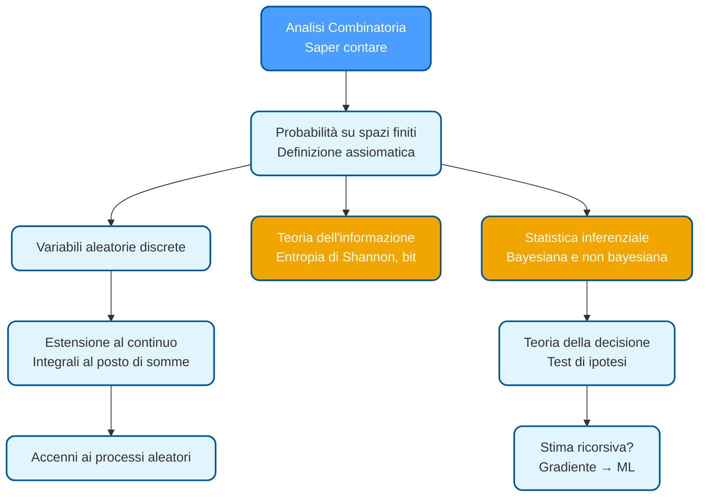

# Metodi Statistici dell'Informazione

## Fondamenti di Probabilità e Analisi Combinatoria

### Introduzione al corso

Il corso tratta di **probabilità e statistica inferenziale**, con un focus particolare su come l'informazione viene trasmessa nello spazio (telecomunicazioni) e nel tempo (memorizzazione, compressione, correzione degli errori). L'idea chiave è che intrinseco nel concetto di **informazione** c'è l'**incertezza**: se non c'è incertezza su ciò che viene trasmesso, non c'è informazione da trasmettere.

La probabilità è lo strumento formale per modellare questa incertezza. Tutto ciò che rientra sotto il nome di *machine learning*, *statistical learning*, *deep learning* e reti neurali è costruito su questa base teorica.

#### Testi di riferimento

Per la teoria della probabilità: **Ernesto Conte, *Fenomeni aleatori*** — molto didattico ma richiede una guida (quella del corso).

Per la statistica inferenziale: **Sheldon Ross, *Introduction to Probability and Statistics for Engineers and Scientists***.

#### Modalità d'esame

L'esame prevede una **prova scritta** seguita da un **colloquio orale**. Il corso è da 6 CFU, senza progetti.

---

## Analisi Combinatoria: il fondamento del conteggio

Quando lo spazio dei campioni è **finito** e gli eventi sono **equiprobabili**, il calcolo della probabilità di un evento si riduce a:

$$P(A) = \frac{|A|}{|\Omega|}$$

dove $|A|$ è la cardinalità dell'evento (numero di esiti favorevoli) e $|\Omega|$ è la cardinalità dello spazio campionario. Il problema centrale diventa quindi **saper contare** gli elementi in modo efficiente. Questo è il dominio dell'analisi combinatoria.

### Principio fondamentale: il prodotto cartesiano

Dati $k$ insiemi $A_1, A_2, \ldots, A_k$ con cardinalità $|A_i| = n_i$, il numero di $k$-uple ordinate $(a_1, a_2, \ldots, a_k)$ con $a_i \in A_i$ è il prodotto delle cardinalità:

$$|A_1 \times A_2 \times \cdots \times A_k| = \prod_{i=1}^{k} n_i$$

Questa è la **formula base** dalla quale si derivano tutti i risultati di analisi combinatoria.

### k-uple ordinate: tre casi fondamentali

Consideriamo il problema di estrarre $k$ elementi da un insieme di $n$ elementi. A seconda che la **ripetizione sia ammessa** e se **l'ordine conti**, otteniamo tre categorie distinte.

#### Caso 1: con ripetizione ammessa

Se ogni estrazione può restituire uno qualsiasi degli $n$ elementi (il precedente non viene rimosso), il primo elemento si sceglie in $n$ modi, il secondo ancora in $n$ modi, e così via fino al $k$-esimo. Per il principio del prodotto:

$$\text{k-uple ordinate con ripetizione} = n^k$$

> [!example]
> Stringhe binarie di lunghezza 5: ogni posizione può essere 0 o 1, quindi $2^5 = 32$ stringhe totali.

#### Caso 2: senza ripetizione (disposizioni)

Se ogni elemento estratto non può più essere scelto nelle successive estrazioni, il primo elemento si sceglie in $n$ modi, il secondo in $n-1$, il terzo in $n-2$, fino al $k$-esimo in $n-k+1$ modi:

$$D(n, k) = n \cdot (n-1) \cdot (n-2) \cdots (n-k+1) = \frac{n!}{(n-k)!}$$

Questo è il numero di **disposizioni semplici** di $n$ elementi presi $k$ alla volta.

#### Caso 3: permutazioni (quando $k = n$)

Un caso speciale importante è quando estraiamo **tutti** gli $n$ elementi uno dopo l'altro, senza ripetizione. Il numero di ordini diversi è:

$$P(n) = n! = n \cdot (n-1) \cdot (n-2) \cdots 1$$

Le permutazioni di $n$ elementi sono il numero di modi di ordinarli tutti.

### k-uple non ordinate: combinazioni

Spesso l'ordine non importa: un'estrazione **senza ordine** è semplicemente un **sottoinsieme** di cardinalità $k$ dell'insieme originale di $n$ elementi. Quante sono le $k$-uple non ordinate?

Il ragionamento è il seguente: tra tutte le **disposizioni semplici** $D(n,k)$ (che contano sequenze ordinate), ogni gruppo di $k$ elementi identici (ordinati in tutte le possibili $k!$ permutazioni) corrisponde a una **sola combinazione**. Quindi:

$$C(n, k) = \binom{n}{k} = \frac{n!}{k! \cdot (n-k)!}$$

Questa è la formula del **coefficiente binomiale**, e rappresenta il numero di sottoinsiemi di dimensione $k$ scelti da un insieme di $n$ elementi.

> [!info] **Definizione: Coefficiente binomiale**
> $$\binom{n}{k} = \frac{n!}{k!(n-k)!}$$
> Rappresenta il numero di modi di scegliere $k$ elementi (non ordinati) da un insieme di $n$ elementi, oppure equivalentemente il numero di sequenze binarie di lunghezza $n$ con esattamente $k$ uni.

### Riepilogo delle formule

| Tipo | Formula | Nome |
|------|---------|------|
| k-uple ordinate **con** ripetizione | $n^k$ | — |
| k-uple ordinate **senza** ripetizione | $\frac{n!}{(n-k)!}$ | Disposizioni semplici |
| k-uple ordinate, $k=n$, senza ripetizione | $n!$ | Permutazioni |
| k-uple **non** ordinate senza ripetizione | $\binom{n}{k} = \frac{n!}{k!(n-k)!}$ | Combinazioni / Coefficiente binomiale |

### Interpretazione combinatoria: sequenze binarie

Un'interpretazione potente del coefficiente binomiale è la seguente: $\binom{n}{k}$ conta il numero di **sequenze binarie di lunghezza $n$ con esattamente $k$ uni** (e conseguentemente $n-k$ zeri).

Per vederlo, note che una sequenza binaria è un vettore $(x_1, x_2, \ldots, x_n)$ con $x_i \in \{0, 1\}$. Dire che contiene esattamente $k$ uni significa scegliere **quali $k$ posizioni** contenernno gli uni — questo è esattamente un problema di combinazione. Quindi:

$$|\{(x_1, \ldots, x_n) : x_i \in \{0,1\}, \sum_i x_i = k\}| = \binom{n}{k}$$

### Il Binomio di Newton

Applicando il ragionamento combinatorio, si dimostra facilmente il **Binomio di Newton**:

$$(a + b)^n = \sum_{k=0}^{n} \binom{n}{k} a^k b^{n-k}$$

Infatti, sviluppando il prodotto $(a+b)^n = (a+b)(a+b)\cdots(a+b)$ ($n$ volte), ogni termine del risultato è un prodotto di $k$ fattori $a$ e $(n-k)$ fattori $b$. Il numero di modi di scegliere quali $k$ fattori contribuiscono la $a$ è esattamente $\binom{n}{k}$.

### Applicazione al cardinalità dell'insieme delle parti

Dato un insieme $A$ di $m$ elementi, l'insieme delle parti $\mathcal{P}(A)$ (l'insieme di tutti i sottoinsiemi di $A$, inclusi $\emptyset$ e $A$ stesso) ha cardinalità:

$$|\mathcal{P}(A)| = 2^m$$

Questo segue sommando su tutti i possibili $k$ (da 0 a $m$) il numero di sottoinsiemi di cardinalità $k$:

$$|\mathcal{P}(A)| = \sum_{k=0}^{m} \binom{m}{k} = \sum_{k=0}^{m} \binom{m}{k} 1^k \cdot 1^{m-k} = (1+1)^m = 2^m$$

dove l'uguaglianza centrale è il Binomio di Newton con $a = b = 1$.

---

## Spazio dei campioni, eventi e operazioni

### Esperimento e spazio campionario

> [!info] **Definizione: Esperimento**
> Un esperimento è un'operazione (o insieme di operazioni) che conduce a uno tra molti risultati possibili.

> [!info] **Definizione: Spazio dei campioni**
> Lo spazio dei campioni (o *sample space*) è l'insieme di tutti i possibili risultati di un esperimento, indicato con $\Omega$.
> $$\Omega = \{\omega_1, \omega_2, \ldots\}$$
> Può essere finito, numerabilmente infinito, o continuo (non numerabile).

**Esempi**: lancio di un dado — $\Omega = \{1,2,3,4,5,6\}$ (finito); numero di pacchetti in coda — $\Omega = \mathbb{N}_0$ (infinito numerabile); tensione di rumore ai capi di una resistenza — $\Omega = \mathbb{R}$ (continuo).

### Eventi

> [!info] **Definizione: Evento**
> Un evento è un sottoinsieme di $\Omega$ definito da una proposizione. Un evento elementare è un singolo elemento di $\Omega$.

La caratteristica importante è che un evento è univocamente determinato dai suoi elementi, ma la proposizione che lo descrive **non è univoca**. Diverse descrizioni in linguaggio naturale possono rappresentare lo stesso insieme di esiti. Saper **riformulare la proposizione** in modo conveniente è spesso la chiave per risolvere esercizi.

> [!example]
> Considerando $\Omega = \{1, 2, 3, 4, 5\}$ (denari in tasca), l'evento $\{1, 3, 5\}$ può essere descritto come:
> - "ho un numero dispari di euro"
> - "non ho un numero pari di euro"
> - "ho 1 o 3 o 5 euro"
>
> Tutte e tre le proposizioni descrivono lo stesso evento.

### Nomenclatura degli eventi

| Nome | Definizione | Notazione |
|------|-------------|-----------|
| **Evento certo** | Lo spazio $\Omega$ stesso | $\Omega$ |
| **Evento impossibile** | L'insieme vuoto | $\emptyset$ |
| **Evento complementare** | Gli elementi di $\Omega$ non in $A$ | $A^c$ o $\bar{A}$ |
| **Eventi incompatibili** | $A \cap B = \emptyset$ | — |
| **$A$ implica $B$** | $A \subseteq B$ | $A \subseteq B$ |

L'ultimo concetto merita chiarimento: se $A \subseteq B$, allora il verificarsi di $A$ **implica necessariamente** il verificarsi di $B$, ma non viceversa.

> [!example]
> Nel lancio di un dado, sia $A$ = "esce 2" e $B$ = "esce un numero pari". Allora $A \subseteq B$: se esce 2, certamente è uscito un pari. Ma il contrario non è vero: un pari potrebbe essere 4 o 6.

### Operazioni su eventi

Gli eventi si combinano mediante operazioni insiemistiche: unione, intersezione, complemento, differenza.

| Operazione | Definizione | Simbolo |
|------------|-------------|---------|
| **Unione** | Elementi in $A_1$ oppure in $A_2$ | $A_1 \cup A_2$ |
| **Intersezione** | Elementi in $A_1$ e in $A_2$ | $A_1 \cap A_2$ |
| **Complemento** | Elementi non in $A_1$ | $A_1^c$ |
| **Differenza** | Elementi in $A_1$ ma non in $A_2$ | $A_1 \setminus A_2$ |

Alcune proprietà fondamentali:

- **Doppio complemento**: $(A^c)^c = A$
- **Complemento di $\Omega$**: $\Omega^c = \emptyset$
- **Unione con complementare**: $A \cup A^c = \Omega$
- **Leggi di De Morgan**: $(A \cup B)^c = A^c \cap B^c$ e $(A \cap B)^c = A^c \cup B^c$

---

## Definizione frequentistica di probabilità

### La frequenza di successo

> [!info] **Definizione: Frequenza di successo**
> Dati $n$ esperimenti indipendenti, la frequenza di successo dell'evento $A$ su $n$ prove è:
> $$f_n(A) = \frac{N_A}{n}$$
> dove $N_A$ è il numero di volte in cui si verifica $A$.

Per un dado onesto (eventi elementari equiprobabili):

$$\lim_{n \to \infty} f_n(A) = \frac{|A|}{|\Omega|}$$

> [!warning]
> La definizione frequentistica usa implicitamente il concetto di **indipendenza**, che è esso stesso un concetto probabilistico. È una definizione leggermente circolare: per definire la probabilità si chiede che le prove siano indipendenti, ma l'indipendenza è un concetto probabilistico. L'approccio formale assiomatico risolve questa circolarità, come vedremo in seguito.

### Proprietà derivate dalla frequenza

Tutte le seguenti proprietà seguono naturalmente dalla definizione frequentistica, trattando la probabilità come una **misura** sugli insiemi.

**Evento complementare**: su $n$ prove, il numero di fallimenti di $A$ è $n - N_A$, quindi:

$$P(A^c) = 1 - P(A)$$

**Unione di eventi (subadditività)**: il numero di prove in cui si verifica $A \cup B$ è $N_A + N_B - N_{A \cap B}$ (si sottrae l'intersezione per non contarla due volte):

$$P(A \cup B) = P(A) + P(B) - P(A \cap B)$$

Nel caso di eventi **incompatibili** ($A \cap B = \emptyset$), la formula si semplifica:

$$P(A \cup B) = P(A) + P(B)$$

**Differenza di eventi**: il numero di prove in cui $A$ si verifica ma non $B$ è $N_A - N_{A \cap B}$:

$$P(A \setminus B) = P(A) - P(A \cap B)$$

**Evento certo e impossibile**:

$$P(\Omega) = 1 \qquad P(\emptyset) = 0$$

> [!warning]
> Una probabilità nulla non implica che l'evento sia impossibile. Un evento di probabilità 0 può comunque verificarsi infinitamente di volte, ma con una frequenza che tende a 0. Si dice allora che l'evento si verifica **quasi certamente** (quasi ovunque, nel linguaggio della teoria della misura).

---

## Probabilità condizionata e indipendenza

### Probabilità condizionata

Supponiamo di sapere che un evento $B$ si è verificato, e vogliamo calcolare la probabilità di un evento $A$ alla luce di questa informazione. L'idea è di restringere lo spazio campionario ai soli esiti compatibili con $B$.

> [!info] **Definizione: Probabilità condizionata**
> $$P(A \mid B) = \frac{P(A \cap B)}{P(B)}, \quad P(B) > 0$$
> "La probabilità che si verifichi $A$, dato che si è verificato $B$, è il rapporto tra la probabilità che si verifichino entrambi e la probabilità di $B$."

Dalla definizione segue la **legge della probabilità composta**:

$$P(A \cap B) = P(A) \cdot P(B \mid A) = P(B) \cdot P(A \mid B)$$

Da questa, invertendo il condizionamento, si ricava la **Legge di Bayes**:

$$P(B \mid A) = \frac{P(A \mid B) \cdot P(B)}{P(A)}$$

Questa formula consente di aggiornare la conoscenza *a priori* di un fenomeno ($P(B)$) alla luce di nuove evidenze sperimentali ($A$), determinando la probabilità *a posteriori* ($P(B \mid A)$). È il fondamento dell'inferenza bayesiana.

### Indipendenza stocastica

> [!info] **Definizione: Indipendenza stocastica**
> Due eventi $A$ e $B$ sono statisticamente indipendenti se e solo se:
> $$P(A \cap B) = P(A) \cdot P(B)$$
> Equivalentemente: $P(B \mid A) = P(B)$ (sapere che $A$ si è verificato non modifica la probabilità di $B$).

Se $A$ e $B$ sono indipendenti, allora anche i loro complementari sono indipendenti: $P(A^c \cap B^c) = P(A^c) \cdot P(B^c)$. Questo segue dalle leggi di De Morgan e dalla proprietà di addittività.

### Indipendenza di più eventi

> [!info] **Definizione: Indipendenza di n eventi**
> Una n-upla di eventi $A_1, A_2, \ldots, A_n$ è indipendente se per ogni sottoinsieme di cardinalità $k \leq n$:
> $$P(A_{i_1} \cap A_{i_2} \cap \cdots \cap A_{i_k}) = P(A_{i_1}) \cdot P(A_{i_2}) \cdots P(A_{i_k})$$

Attenzione: l'indipendenza a coppie non implica l'indipendenza congiunta. Un classico controesempio è il **bit di parità**.

> [!example] **Il bit di parità**
> Siano $X_1$ e $X_2$ due bit equiprobabili e indipendenti, e si definisca $X_3 = X_1 \oplus X_2$ (somma modulo 2, operazione XOR). Allora:
> - $X_1$ e $X_2$ sono indipendenti (per ipotesi)
> - $X_1$ e $X_3$ sono indipendenti (si verifica calcolando le probabilità)
> - $X_2$ e $X_3$ sono indipendenti (per simmetria)
> - **ma** la terna $(X_1, X_2, X_3)$ non è indipendente, perché conoscendo due qualsiasi bit si conosce completamente il terzo: $X_3 = X_1 \oplus X_2$.

### Legge della probabilità totale

> [!info] **Definizione: Partizione**
> Una partizione di $\Omega$ è una collezione di eventi $\{E_1, E_2, \ldots, E_m\}$ tali che:
> 1. sono a due a due disgiunti: $E_i \cap E_j = \emptyset$ per $i \neq j$
> 2. la loro unione è lo spazio intero: $\bigcup_{i=1}^{m} E_i = \Omega$

**Esempio geometrico**: i piastrelli del pavimento di una stanza formano una partizione: coprono interamente la stanza e non si sovrappongono.

Dato un evento $A$ qualsiasi e una partizione dello spazio campionario, si può scrivere:

$$A = A \cap \Omega = A \cap \left(\bigcup_{i=1}^{m} E_i\right) = \bigcup_{i=1}^{m} (A \cap E_i)$$

Gli insiemi $A \cap E_i$ sono a due a due disgiunti (perché gli $E_i$ lo sono), quindi per l'additività:

$$P(A) = \sum_{i=1}^{m} P(A \cap E_i) = \sum_{i=1}^{m} P(A \mid E_i) \cdot P(E_i)$$

> [!info] **Legge della probabilità totale**
> $$P(A) = \sum_{i=1}^{m} P(A \mid E_i) \cdot P(E_i)$$
> La probabilità di un evento $A$ si decompone condizionando rispetto a una partizione dello spazio dei campioni.

Questa legge è fondamentale: appare in quasi tutti i calcoli probabilistici perché spesso calcolare direttamente $P(A)$ è difficile, ma condizionando rispetto a certi eventi il calcolo diventa accessibile.

---

## Teoria formale: Spazio di probabilità e assiomi di Kolmogorov

### Algebra e σ-algebra di eventi

La definizione frequentistica, seppur intuitiva, presenta ambiguità: la convergenza della frequenza non è precisata formalmente, e l'indipendenza è circolarmente definita in termini probabilistici. La teoria assiomatica risolve questi problemi definendo la probabilità come una funzione che soddisfa certi assiomi, e poi dimostra che la frequenza converge a essa.

> [!info] **Definizione: Algebra di eventi**
> Una collezione $\mathcal{E}$ di sottoinsiemi di $\Omega$ è un'algebra se:
> 1. è chiusa rispetto all'unione: se $A_i, A_j \in \mathcal{E}$, allora $A_i \cup A_j \in \mathcal{E}$
> 2. è chiusa rispetto alla complementazione: se $A_i \in \mathcal{E}$, allora $A_i^c \in \mathcal{E}$

Dalla chiusura rispetto a complementazione e unione seguono anche chiusura per intersezione e differenza (per le leggi di De Morgan). Questa struttura garantisce che tutte le operazioni insiemistiche tra eventi rimangono nel dominio su cui è definita la funzione di probabilità.

> [!info] **Definizione: σ-algebra**
> Un'algebra $\mathcal{E}$ è una σ-algebra se è chiusa anche rispetto a **unioni numerabili** (infinite ma contabili):
> $$A_1, A_2, A_3, \ldots \in \mathcal{E} \quad \Longrightarrow \quad \bigcup_{i=1}^{\infty} A_i \in \mathcal{E}$$

La σ-algebra diventa necessaria quando lo spazio campionario è infinito numerabile: è necessario poter fare unioni infinite di eventi.

### Spazio di probabilità e assiomi di Kolmogorov

> [!info] **Definizione: Spazio di probabilità**
> Una terna $(\Omega, \mathcal{E}, P)$ dove $\Omega$ è uno spazio campionario, $\mathcal{E}$ è una σ-algebra di sottoinsiemi di $\Omega$, e $P$ è una funzione $P : \mathcal{E} \to [0,1]$ soddisfacente gli assiomi di Kolmogorov, è uno **spazio di probabilità**.

> [!info] **Assiomi di Kolmogorov**
> Una legge di probabilità deve soddisfare:
> - **Assioma 1 — Non negatività**: $P(A) \geq 0$ per ogni $A \in \mathcal{E}$
> - **Assioma 2 — Normalizzazione**: $P(\Omega) = 1$
> - **Assioma 3 — σ-additività**: Se $\{A_i\}_{i=1}^{\infty}$ è una successione di eventi a due a due disgiunti:
> $$P\!\left(\bigcup_{i=1}^{\infty} A_i\right) = \sum_{i=1}^{\infty} P(A_i)$$

L'assioma 3 generalizza l'additività finita a somme infinite numerabili. Per somme finite è un caso speciale.

### Derivazione rigorosa delle proprietà dagli assiomi

Tutte le proprietà ricavate intuitivamente dalla definizione frequentistica si possono ora dimostrare rigorosamente dai soli assiomi.

**Proprietà dell'evento complementare**: gli eventi $A$ e $A^c$ sono disgiunti e la loro unione è $\Omega$:

$$P(A) + P(A^c) = P(A \cup A^c) = P(\Omega) = 1$$

quindi $P(A^c) = 1 - P(A)$.

**Proprietà dell'unione**: scrivendo $A \cup B = A \cup (B \setminus A)$ come unione disgiunta:

$$P(A \cup B) = P(A) + P(B \setminus A) = P(A) + P(B) - P(A \cap B)$$

**Evento impossibile**: $P(\emptyset) = 1 - P(\Omega) = 0$.

---

## Variabili aleatorie discrete

### Definizione

Una variabile aleatoria è un'applicazione che associa a ogni esito dello spazio campionario un valore numerico. Questo consente di trattare in modo unificato esperimenti che hanno strutture probabilistiche simili.

> [!info] **Definizione: Variabile aleatoria discreta**
> Dato uno spazio di probabilità $(\Omega, \mathcal{E}, P)$ discreto, una variabile aleatoria è un'applicazione:
> $$X : \Omega \to \mathcal{X}$$
> dove $\mathcal{X}$ è un insieme numerabile di numeri reali, chiamato **alfabeto** di $X$. La funzione $X$ associa a ogni esito $\omega$ un valore numerico $X(\omega) \in \mathcal{X}$.

La probabilità di un evento concernente $X$ si calcola come:

$$P(X = x) = P\!\big(\{\omega \in \Omega : X(\omega) = x\}\big)$$

### PMF: Probability Mass Function

> [!info] **Definizione: PMF**
> Data una variabile aleatoria discreta $X$ con alfabeto $\mathcal{X} = \{x_1, x_2, \ldots, x_m\}$, la Probability Mass Function è la sequenza:
> $$p_X(x_i) = P(X = x_i), \quad i = 1, 2, \ldots, m$$
> Una sequenza di numeri è una PMF valida se e solo se:
> 1. $p_X(x_i) \geq 0$ per ogni $i$ (non negatività)
> 2. $\sum_{i=1}^{m} p_X(x_i) = 1$ (normalizzazione)

---

## Distribuzioni notevoli discrete

### Distribuzione di Bernoulli

> [!info] **Definizione: Distribuzione di Bernoulli**
> Una variabile aleatoria $X$ segue una distribuzione di Bernoulli di parametro $p \in [0,1]$, scritta $X \sim \text{Ber}(p)$, se:
> - Alfabeto: $\mathcal{X} = \{0, 1\}$ (0 = fallimento, 1 = successo)
> - PMF: $P_X(x) = p^x (1-p)^{1-x}$ per $x \in \{0,1\}$

In forma estesa: $P_X(0) = 1-p$ e $P_X(1) = p$.

**Valore atteso**: $E[X] = p$ (la media è semplicemente la probabilità di successo).

### Distribuzione Binomiale

> [!info] **Definizione: Distribuzione Binomiale**
> Siano $X_1, X_2, \ldots, X_n$ variabili i.i.d. (indipendenti e identicamente distribuite) con $X_i \sim \text{Ber}(p)$. La loro somma:
> $$S_n = \sum_{i=1}^{n} X_i$$
> conta il numero totale di successi in $n$ prove. Si dice che $S_n$ segue una distribuzione Binomiale, $S_n \sim \text{Bin}(n,p)$, con PMF:
> $$P_{S_n}(k) = \binom{n}{k} p^k (1-p)^{n-k}, \quad k = 0, 1, \ldots, n$$

Il coefficiente binomiale $\binom{n}{k}$ conta il numero di sequenze di $n$ prove con esattamente $k$ successi; $p^k(1-p)^{n-k}$ è la probabilità di una singola tale sequenza.

**Valore atteso**: $E[S_n] = np$ (si dimostra sia per linearità della media che direttamente dalla definizione).

### Distribuzione Uniforme discreta

> [!info] **Definizione: Distribuzione Uniforme discreta**
> Una variabile $X$ è uniforme su un alfabeto finito $\mathcal{X} = \{a_1, a_2, \ldots, a_m\}$ se tutti i valori sono equiprobabili:
> $$P_X(a_k) = \frac{1}{m}, \quad k = 1, 2, \ldots, m$$

**Valore atteso**: la media aritmetica dei valori dell'alfabeto:

$$E[X] = \frac{1}{m} \sum_{k=1}^{m} a_k$$

Se l'alfabeto è $\{1, 2, \ldots, m\}$, usando la formula di Gauss:

$$E[X] = \frac{1}{m} \cdot \frac{m(m+1)}{2} = \frac{m+1}{2}$$

### Distribuzione di Poisson

> [!info] **Definizione: Distribuzione di Poisson**
> Una variabile aleatoria $X$ segue una distribuzione di Poisson di parametro $\lambda > 0$, scritta $X \sim \text{Poi}(\lambda)$, se:
> - Alfabeto: $\mathcal{X} = \mathbb{N}_0 = \{0, 1, 2, 3, \ldots\}$ (numerabilmente infinito)
> - PMF: $P_X(k) = \frac{\lambda^k}{k!} e^{-\lambda}$ per $k \geq 0$

La normalizzazione si verifica usando lo sviluppo in serie di Taylor dell'esponenziale:

$$\sum_{k=0}^{\infty} \frac{\lambda^k}{k!} e^{-\lambda} = e^{-\lambda} \cdot e^{\lambda} = 1$$

Il parametro $\lambda$ rappresenta il **tasso medio** di occorrenze: il valore atteso è precisamente $E[X] = \lambda$.

La distribuzione di Poisson modella **eventi rari** che si verificano con frequenza costante: arrivi di auto a un casello, pacchetti che arrivano a un router, clienti che entrano a un ufficio postale. Una proprietà importante è la **chiusura rispetto al subcampionamento**: se $N \sim \text{Poi}(\lambda)$ e si selezionano indipendentemente i risultati con probabilità $p$, il numero di risultati selezionati segue una Poisson di parametro $\lambda p$.

[!info] Proprietà Operativa: Scomposizione (Thinning) Se un flusso di eventi segue una distribuzione di Poisson con parametro λ (es. pacchetti che arrivano a un router) e ogni evento viene classificato indipendentemente in due categorie (es. pacchetti corretti ed errati) con probabilità p e 1−p, allora i due flussi risultanti sono indipendenti e seguono distribuzioni di Poisson con parametri λp e λ(1−p).
Esempio: Se le auto in coda a un semaforo sono Poissoniane con media 10 e il 20% sono Fiat, le auto Fiat in coda saranno ancora Poissoniane con media 2

### Proprietà di thinning (subcampionamento)

Una proprietà affascinante e contrintuitiva della distribuzione di Poisson è la **stabilità sotto subcampionamento**: se un flusso Poissoniano viene "diradato" (subcampionato) in modo casuale e indipendente, i sotto-flussi risultanti rimangono Poissoniani e sono mutuamente indipendenti.

> [!info] **Teorema: Thinning di un processo di Poisson**
> Sia $N \sim \text{Poisson}(\lambda)$ il numero totale di arrivi (eventi) in un intervallo di tempo o spazio. Supponiamo che ogni arrivo sia **classificato indipendentemente** in una di due categorie:
> - Categoria A con probabilità $p$
> - Categoria B con probabilità $1-p$
> 
> Siano $N_A$ e $N_B$ i numeri di arrivi nelle due categorie. Allora:
> $$N_A \sim \text{Poisson}(\lambda p), \quad N_B \sim \text{Poisson}(\lambda(1-p))$$
> e $N_A$ e $N_B$ sono **indipendenti**.

**Dimostrazione intuitiva mediante la legge della probabilità totale**:

Calcoliamo $P(N_A = k)$ sommando su tutti i possibili valori di $N$:

$$P(N_A = k) = \sum_{n=k}^{\infty} P(N_A = k | N = n) P(N = n)$$

Dato $N = n$ (numero totale di arrivi), la probabilità che esattamente $k$ siano della categoria A è una binomiale:

$$P(N_A = k | N = n) = \binom{n}{k} p^k (1-p)^{n-k}$$

Quindi:

$$P(N_A = k) = \sum_{n=k}^{\infty} \binom{n}{k} p^k (1-p)^{n-k} \frac{\lambda^n}{n!} e^{-\lambda}$$

Fattorizziamo:

$$= \frac{(\lambda p)^k}{k!} e^{-\lambda p} \sum_{n=k}^{\infty} \frac{[\lambda(1-p)]^{n-k}}{(n-k)!} e^{-\lambda(1-p)}$$

Sostituendo $m = n-k$:

$$= \frac{(\lambda p)^k}{k!} e^{-\lambda p} \sum_{m=0}^{\infty} \frac{[\lambda(1-p)]^{m}}{m!} e^{-\lambda(1-p)}$$

$$= \frac{(\lambda p)^k}{k!} e^{-\lambda p} \cdot 1 = \frac{(\lambda p)^k}{k!} e^{-\lambda p}$$

**Quindi $N_A \sim \text{Poisson}(\lambda p)$** ✓

**Indipendenza**: la classificazione di ogni arrivo è indipendente da tutti gli altri, e dalla distribuzione di $N$, perciò $N_A$ e $N_B$ sono indipendenti.

### Applicazioni pratiche con esempi numerici

> [!example] **Applicazione 1: Pacchetti errati in un router**
> 
> Un router riceve pacchetti in arrivo secondo un processo di Poisson con tasso medio $\lambda = 100$ pacchetti/ms. A causa del rumore del canale, ogni pacchetto è corrotto (contiene errori) con probabilità $p = 0.01$ indipendentemente.
> 
> **Domanda**: Quali sono le distribuzioni del numero di pacchetti corretti e corrotti in un millisecondo?
> 
> **Soluzione per thinning**:
> 
> Applichiamo il teorema di thinning con:
> - $\lambda = 100$ (tasso totale)
> - Categoria A (pacchetti corretti): probabilità $1 - 0.01 = 0.99$
> - Categoria B (pacchetti errati): probabilità $0.01$
> 
> Risultati:
> $$N_{\text{ok}} \sim \text{Poisson}(100 \times 0.99) = \text{Poisson}(99)$$
> $$N_{\text{errore}} \sim \text{Poisson}(100 \times 0.01) = \text{Poisson}(1)$$
> 
> **Interpretazione**:
> - Il numero medio di pacchetti corretti è 99/ms
> - Il numero medio di pacchetti errati è 1/ms
> - I due flussi sono indipendenti: sapere quanti pacchetti ci sono stati senza errori non dà informazioni su quanti ce ne sono stati con errori
> 
> **Applicazione pratica**: il router può stimare il tasso di errore del canale dalla frequenza osservata di errori, ipotizzando che seguano una distribuzione di Poisson indipendente.

> [!example] **Applicazione 2: Tipi di auto in coda a un casello**
> 
> Al casello autostradale passano auto secondo un processo di Poisson con tasso medio $\lambda = 4$ auto/minuto. Dalla statistica storica, il 70% sono auto private e il 30% sono camion.
> 
> **Domanda**: Quali sono i tassi di arrivo delle auto private e dei camion?
> 
> **Soluzione per thinning**:
> 
> $$N_{\text{private}} \sim \text{Poisson}(4 \times 0.70) = \text{Poisson}(2.8)$$
> $$N_{\text{camion}} \sim \text{Poisson}(4 \times 0.30) = \text{Poisson}(1.2)$$
> 
> **Interpretazione**:
> - In media, 2.8 auto private passano al minuto
> - In media, 1.2 camion passano al minuto
> - I due flussi sono indipendenti
> 
> **Applicazione pratica**: il casello può dimensionare le corsie separate per auto e camion sulla base di questi tassi indipendenti.

> [!example] **Applicazione 3: Clienti diversi in un negozio**
> 
> Un negozio riceve clienti secondo un processo di Poisson con tasso $\lambda = 10$ clienti/ora. L'esperienza passata mostra che:
> - Il 40% dei clienti acquistano (categoria A)
> - Il 35% guardano ma non acquistano (categoria B)
> - Il 25% chiedono informazioni (categoria C)
> 
> **Domanda**: Quali sono i tassi di arrivo di clienti in ogni categoria?
> 
> **Soluzione generalizzata a tre categorie**:
> 
> Applicando il thinning gerarchicamente (o contemporaneamente a tre categorie):
> $$N_{\text{acquisti}} \sim \text{Poisson}(10 \times 0.40) = \text{Poisson}(4)$$
> $$N_{\text{browser}} \sim \text{Poisson}(10 \times 0.35) = \text{Poisson}(3.5)$$
> $$N_{\text{info}} \sim \text{Poisson}(10 \times 0.25) = \text{Poisson}(2.5)$$
> 
> Tutti e tre i flussi sono mutuamente indipendenti.

### Distribuzione Geometrica

> [!info] **Definizione: Distribuzione Geometrica**
> Una variabile aleatoria $X$ segue una distribuzione Geometrica di parametro $p \in (0,1]$, scritta $X \sim \text{Geo}(p)$, se rappresenta il numero di prove necessarie per ottenere il **primo successo** in una sequenza di prove di Bernoulli indipendenti. L'alfabeto è $\mathcal{X} = \{1, 2, 3, \ldots\}$ e la PMF è:
> $$P_X(k) = (1-p)^{k-1} p, \quad k \geq 1$$

Per ottenere il primo successo alla prova $k$, devono verificarsi $k-1$ fallimenti (ognuno con probabilità $1-p$) seguiti da un successo (probabilità $p$).

**Valore atteso**: $E[X] = \frac{1}{p}$ (il numero medio di prove per il primo successo è il reciproco della probabilità di successo).

Una proprietà fondamentale è l'**assenza di memoria**: $P(X > n + m \mid X > n) = P(X > m)$, cioè il fatto di aver già fallito $n$ prove non influisce sulla distribuzione del numero di prove future. La geometrica è l'**unica** distribuzione discreta con questa proprietà.

---

## Valore atteso: definizione e proprietà

### Definizione formale

> [!info] **Definizione: Valore atteso**
> Il valore atteso (o media statistica, o speranza matematica) di una variabile aleatoria discreta $X$ con alfabeto $\mathcal{X}$ e PMF $p_X$ è:
> $$E[X] = \sum_{x \in \mathcal{X}} x \cdot p_X(x)$$

La motivazione viene dalla **legge dei grandi numeri**: se si ripetono molte prove indipendenti e si osserva la media aritmetica dei risultati, questa converge al valore atteso.

### Teorema fondamentale del calcolo della media

> [!info] **Teorema: Media di una funzione di X**
> Data una variabile aleatoria $X$ e una funzione $g$, il valore atteso di $Y = g(X)$ è:
> $$E[g(X)] = \sum_{x \in \mathcal{X}} g(x) \cdot p_X(x)$$
> senza necessità di calcolare esplicitamente la PMF di $Y$.

Questo teorema è fondamentale perché consente di calcolare medie di funzioni di variabili aleatorie direttamente, senza dover prima marginalizzare la distribuzione congiunta (nel caso di più variabili) o collassare i valori (se $g$ non è biiettiva).

### Linearità della media

La media è un operatore **lineare**:

$$E[aX + b] = a \cdot E[X] + b$$

Per variabili aleatorie indipendenti $X_1, X_2, \ldots, X_n$ e costanti $a_i, b$:

$$E\left[\sum_{i=1}^{n} a_i X_i + b\right] = \sum_{i=1}^{n} a_i E[X_i] + b$$

La linearità vale **indipendentemente dall'indipendenza** delle variabili: è una conseguenza dell'additività della probabilità.

### Valore quadratico medio

> [!info] **Definizione: Valore quadratico medio**
> Il valore quadratico medio di una variabile aleatoria $X$ è:
> $$E[X^2] = \sum_{x \in \mathcal{X}} x^2 \cdot p_X(x)$$

Il valore efficace (root mean square) è $x_{\text{rms}} = \sqrt{E[X^2]}$.

---

## Varianza e deviazione standard

> [!info] **Definizione: Varianza**
> La varianza di una variabile aleatoria $X$ con media $\mu_X = E[X]$ è:
> $$\sigma_X^2 = \text{Var}(X) = E[(X - \mu_X)^2] = \sum_{x} (x - \mu_X)^2 \cdot p_X(x)$$
> La deviazione standard è $\sigma_X = \sqrt{\sigma_X^2}$.

La varianza misura il grado di **dispersione** dei valori di $X$ attorno alla media. Una varianza piccola significa che i valori sono concentrati intorno alla media; una varianza grande significa che la variabile è molto "aleatoria".

### Formula alternativa

Sviluppando il quadrato:

$$\sigma_X^2 = E[(X - \mu_X)^2] = E[X^2 - 2\mu_X X + \mu_X^2] = E[X^2] - 2\mu_X E[X] + \mu_X^2$$

Poiché $E[X] = \mu_X$:

$$\boxed{\sigma_X^2 = E[X^2] - \mu_X^2}$$

Questa formula è spesso più comoda da usare nei calcoli.

### Varianza di trasformazioni lineari

Se $Y = aX + b$ allora:

$$\text{Var}(Y) = a^2 \cdot \text{Var}(X)$$

La costante additiva $b$ non influisce sulla varianza (trasla la distribuzione ma non la allarga). Il fattore moltiplicativo $a$ scala la varianza per il suo **quadrato**.

---

## Covarianza e correlazione

### Covarianza

> [!info] **Definizione: Covarianza**
> Date due variabili aleatorie $X$ e $Y$, la covarianza è:
> $$\text{Cov}(X, Y) = E[(X - \mu_X)(Y - \mu_Y)] = E[XY] - E[X] E[Y]$$

La covarianza misura il grado di **co-variazione lineare** tra le due variabili:

- **Positiva**: deviazioni positive di $X$ dalla sua media tendono ad accompagnarsi a deviazioni positive di $Y$
- **Negativa**: deviazioni positive di $X$ tendono ad accompagnarsi a deviazioni negative di $Y$
- **Nulla**: nessuna tendenza lineare di co-variazione

**Indipendenza implica incorrelazione**: se $X$ e $Y$ sono indipendenti, allora $E[XY] = E[X]E[Y]$, quindi $\text{Cov}(X,Y) = 0$. Il contrario non è sempre vero: variabili possono avere covarianza nulla e comunque essere dipendenti (ad esempio se la dipendenza è non-lineare).

### Coefficiente di correlazione

> [!info] **Definizione: Coefficiente di correlazione**
> $$\rho_{XY} = \frac{\text{Cov}(X,Y)}{\sigma_X \sigma_Y}$$

Il coefficiente normalizza la covarianza rispetto alle scale delle due variabili, rendendolo adimensionale. Una proprietà fondamentale è:

$$\boxed{-1 \leq \rho_{XY} \leq 1}$$

**Dimostrazione** (Cauchy-Schwarz): le variabili aleatorie con varianza finita formano uno spazio vettoriale con prodotto scalare $\langle X, Y \rangle = \text{Cov}(X,Y)$ e norma $\|X\| = \sigma_X$. La disuguaglianza di Cauchy-Schwarz afferma:

$$|\langle X, Y \rangle| \leq \|X\| \cdot \|Y\|$$

da cui segue direttamente il risultato.

**Uguaglianza**: $\rho_{XY} = 1$ se e solo se $X$ e $Y$ sono linearmente proporzionali con coefficiente positivo ($Y = a + bX$ con $b > 0$). Analogamente $\rho_{XY} = -1$ per proporzionalità negativa.

Il coefficiente di correlazione misura la **predecibilità lineare** di una variabile rispetto all'altra, non la dipendenza statistica generale.
>[!info] Interpretazione Geometrica (Spazi di Hilbert) Le variabili aleatorie con varianza finita costituiscono uno spazio lineare. In questo spazio:
>
>   - La Covarianza agisce come un prodotto scalare: ⟨X,Y⟩=Cov(X,Y).
>   - La Deviazione Standard funge da norma del vettore: ∥X∥=σX​.
>   - Il Coefficiente di Correlazione ρXY​ rappresenta il coseno dell'angolo tra le due variabili centrate.
>
> Una correlazione ρ=0 (variabili incorrelate) corrisponde geometricamente all'ortogonalità, mentre ρ=±1 indica che le variabili sono collineari (proporzionali)

---

## 2. GEOMETRIA DELLE VARIABILI ALEATORIE E SPAZI LINEARI

**Posizionamento**: Dopo la sezione "Covarianza e correlazione" (lezione 8), come approfondimento teorico strutturato in due livelli (concettuale e algebrico)

### Le variabili aleatorie come spazi vettoriali: fondamenti

Le variabili aleatorie non sono solo numeri, ma appartengono a una **struttura algebrica ricca**: uno spazio vettoriale. Precisamente, l'insieme di tutte le variabili aleatorie $X$ con varianza finita forma uno **spazio di Hilbert** (uno spazio vettoriale completo con prodotto scalare).

> [!abstract]
> Lo spazio $L^2(\Omega)$ di tutte le variabili aleatorie $X$ con $E[X^2] < \infty$ (varianza finita) è uno spazio di Hilbert con operazioni e struttura definite come segue:

**Operazioni lineari**:

- **Somma**: $(X + Y)(\omega) = X(\omega) + Y(\omega)$
- **Scalare**: $(aX)(\omega) = aX(\omega)$ per $a \in \mathbb{R}$

**Prodotto scalare**:

$$\langle X, Y \rangle = E[(X - E[X])(Y - E[Y])] = \text{Cov}(X, Y)$$

**Norma indotta**:

$$\|X\| = \sqrt{\langle X, X \rangle} = \sqrt{\text{Var}(X)} = \sigma_X$$

Questa struttura è **completa**: ogni sequenza di Cauchy di variabili aleatorie converge a un'altra variabile aleatoria nello spazio.

### Interpretazione della covarianza come prodotto scalare

La covarianza **non è un indice statistico astratto**, ma il **prodotto scalare** tra le variabili **centrate** (ridotte alle loro deviazioni dalla media). Se definiamo $X' = X - E[X]$ e $Y' = Y - E[Y]$ (variabili centrate), allora:

$$\text{Cov}(X, Y) = E[X' \cdot Y'] = \langle X', Y' \rangle$$

**Interpretazione geometrica della covarianza**:

- **Covarianza positiva** ($\text{Cov}(X,Y) > 0$): le deviazioni da media di $X$ e $Y$ tendono a "puntare" nella stessa direzione nello spazio. Se $X$ è sopra la sua media, anche $Y$ tende a essere sopra la sua media.

- **Covarianza negativa** ($\text{Cov}(X,Y) < 0$): le deviazioni puntano in direzioni opposte. Se $X$ è sopra media, $Y$ tende a essere sotto media.

- **Covarianza nulla** ($\text{Cov}(X,Y) = 0$): i vettori $X'$ e $Y'$ sono **ortogonali** nello spazio di Hilbert (né concordi né discordi).

### Deviazione standard come norma

La deviazione standard di una variabile è la sua **"lunghezza"** nello spazio:

$$\sigma_X = \|X - E[X]\| = \sqrt{E[(X - E[X])^2]}$$

Una variabile con $\sigma_X = 0$ è un "punto" nello spazio (è deterministica). Una variabile con $\sigma_X$ grande è un "vettore lungo" (alta variabilità).

La **metrica** (distanza) tra due variabili è:

$$d(X, Y) = \|X - Y\| = \sqrt{E[(X-Y)^2]}$$

Questa distanza quantifica quanto "lontane" sono due variabili aleatorie nel senso dei minimi quadrati.

### Il coefficiente di correlazione come coseno

Nello spazio di Hilbert, il coefficiente di correlazione è il **coseno dell'angolo** tra due vettori (variabili centrate):

$$\rho_{XY} = \cos \theta = \frac{\langle X', Y' \rangle}{\|X'\| \cdot \|Y'\|} = \frac{\text{Cov}(X,Y)}{\sigma_X \sigma_Y}$$

dove $\theta \in [0°, 180°]$ è l'angolo geometrico tra i vettori centrati.

**Interpretazione geometrica dei valori estremi**:

- **$\rho = 1$ ($\theta = 0°$)**: i vettori sono **collineari e concordi** — i vettori puntano nella stessa direzione. Relazione lineare perfetta crescente: $Y = a + bX$ con $b > 0$.

- **$\rho = -1$ ($\theta = 180°$)**: i vettori sono **collineari e discordi** — puntano in direzioni opposte. Relazione lineare perfetta decrescente: $Y = a + bX$ con $b < 0$.

- **$\rho = 0$ ($\theta = 90°$)**: i vettori sono **ortogonali** — sono perpendicolari nello spazio. Questo è lo stato di **incorrelazione** (nessuna dipendenza lineare).

- **$0 < |\rho| < 1$**: angolo intermedio — correlazione parziale, relazione lineare imperfetta.

> [!example] **Visualizzazione geometrica**
> 
> Immagina uno spazio 2D (per semplicità). Due variabili $X$ e $Y$ sono rappresentate da vettori:
> - Se puntano in la stessa direzione (piccolo angolo): $\rho \approx 1$
> - Se puntano in direzioni opposte (angolo $\approx 180°$): $\rho \approx -1$
> - Se sono perpendicolari (angolo $= 90°$): $\rho = 0$
> 
> La "lunghezza" di ogni vettore è la deviazione standard. Vettori corti = bassa variabilità. Vettori lunghi = alta variabilità.

### Ortogonalità ≠ Indipendenza

Un punto cruciale: **due vettori possono essere ortogonali (incorrelati, $\rho = 0$) ma comunque dipendenti**.

> [!warning]
> **Incorrelazione implica indipendenza SOLO nel caso gaussiano**. In generale, l'indipendenza è una proprietà molto più forte.

> [!example] **Controesempio: relazione non-lineare**
> 
> Sia $U$ una variabile uniforme su $[-1, 1]$ (simmetrica attorno a 0). Definiamo $Y = U^2$.
> 
> Chiaramente $Y$ dipende da $U$ (non sono indipendenti): noto $U$, conosco esattamente $Y$.
> 
> Ma la covarianza è:
> $$\text{Cov}(U, U^2) = E[U \cdot U^2] - E[U] E[U^2] = E[U^3] - 0 = 0$$
> 
> perché $U^3$ è una funzione **dispari** di $U$ (simmetrica attorno a zero), quindi il suo valore atteso è 0.
> 
> Quindi $\rho = 0$, ma $U$ e $Y$ sono **fortemente dipendenti**. La dipendenza è **non-lineare**.

**Conseguenza**: L'assenza di correlazione ($\rho = 0$) significa assenza di **dipendenza lineare**, non assenza di dipendenza tout court.

### Proiezione ortogonale e predizione lineare ottima

Il significato operativo della correlazione emerge nella teoria della **predizione ottima**. Se vogliamo stimare il valore di $Y$ osservando $X$, la scelta ottimale (in senso di minimizzazione dell'errore quadratico medio, MSE) è:

$$\hat{Y} = a^* + b^* X$$

dove:

$$b^* = \rho_{XY} \frac{\sigma_Y}{\sigma_X}, \quad a^* = E[Y] - b^* E[X]$$

L'errore quadratico medio minimo è:

$$E[(Y - \hat{Y})^2] = \sigma_Y^2 (1 - \rho_{XY}^2)$$

**Interpretazione**:

- Se $|\rho| = 1$ (collineari): $E[(Y - \hat{Y})^2] = 0$ — la predizione è **perfetta**
- Se $\rho = 0$ (ortogonali): $E[(Y - \hat{Y})^2] = \sigma_Y^2$ — la migliore stima è semplicemente $\hat{Y} = E[Y]$ (ignoriamo $X$), con errore pari alla varianza di $Y$
- Se $0 < |\rho| < 1$: errore intermedio — la predizione riduce l'errore di un fattore $(1 - \rho^2)$

Il termine $(1 - \rho^2)$ è il **coefficiente di determinazione** inverso: misura la frazione di varianza di $Y$ che **non** può essere spiegata linearmente da $X$.

---

## Probabilità condizionata e PMF condizionale

### PMF condizionale

> [!info] **Definizione: PMF condizionale**
> Data una variabile discreta $X$ e un evento $A$ con $P(A) > 0$, la PMF condizionata di $X$ dato $A$ è:
> $$p_{X|A}(x) = P(X = x | A) = \frac{P(X = x, A)}{P(A)}$$

Per ogni $A$ fissato, questa è una PMF valida (non negativa e normalizzata a 1).

> [!info] **Definizione: PMF condizionale di X dato Y**
> $$p_{X|Y}(x|y) = \frac{p_{XY}(x,y)}{p_Y(y)}$$

Per ogni $y$ fissato (condizionamento), è una legge di probabilità su $X$.

### Media condizionale e legge della probabilità totale

> [!info] **Teorema: Legge della probabilità totale per medie**
> Sia $A = \{E_1, E_2, \ldots, E_m\}$ una partizione di $\Omega$. Allora:
> $$E[X] = \sum_{i=1}^{m} P(E_i) \cdot E[X | E_i]$$

Cioè, la media totale si scompone come media pesata (secondo le probabilità degli eventi) delle medie condizionali.

Questa proprietà è fondamentale negli esercizi: spesso calcolare direttamente $E[X]$ è difficile, ma condizionando rispetto a certi eventi il calcolo diventa accessibile.

---

## Funzioni di variabili aleatorie

Se $X$ è una variabile aleatoria e $g$ è una funzione, allora $Y = g(X)$ è anch'essa una variabile aleatoria. Come si calcola la PMF di $Y$?

### Caso biiettivo

Se $g$ è una biiezione (uno-a-uno), allora ogni valore di $X$ corrisponde a un valore unico di $Y$. La PMF si ottiene per "reflagging" dell'alfabeto:

$$p_Y(y) = p_X(g^{-1}(y))$$

Le probabilità rimangono invariate, cambiano solo le etichette.

### Caso molti-a-uno

Se più valori di $X$ producono lo stesso valore di $Y$, le probabilità si sommano:

$$p_Y(y) = \sum_{\{x : g(x) = y\}} p_X(x)$$

---

## Coppie di variabili aleatorie

### PMF congiunta

> [!info] **Definizione: PMF congiunta**
> La PMF congiunta di una coppia $(X, Y)$ di variabili discrete è la tabella:
> $$p_{XY}(x, y) = P(X = x, Y = y), \quad \forall x \in \mathcal{X}, y \in \mathcal{Y}$$
> con $p_{XY}(x,y) \geq 0$ e $\sum_x \sum_y p_{XY}(x,y) = 1$.

### Marginalizzazione

Dalla congiunta si ricavano le PMF marginali per somma:

$$p_X(x) = \sum_y p_{XY}(x,y), \quad p_Y(y) = \sum_x p_{XY}(x,y)$$

La congiunta **implica** le marginali (univocamente). Il viceversa è falso: date le marginali, esistono in generale molte congiunte compatibili, salvo nel caso speciale di indipendenza.

### Indipendenza di variabili

Due variabili $X$ e $Y$ sono statisticamente indipendenti se:

$$p_{XY}(x,y) = p_X(x) \cdot p_Y(y) \quad \forall x, y$$

Equivalentemente, la PMF condizionale non dipende dal condizionamento: $p_{X|Y}(x|y) = p_X(x)$.

### PMF condizionale

$$p_{X|Y}(x|y) = \frac{p_{XY}(x,y)}{p_Y(y)}$$

---

## Introduzione alle variabili aleatorie continue

### Il limite di validità della PMF

Per variabili che assumono valori in un continuo (numeri reali), la probabilità di un singolo punto è zero:

$$P(X = x_0) = 0 \quad \forall x_0 \in \mathbb{R}$$

Questo perché i reali in un intervallo sono non numerabili, e assegnare una probabilità finita a ogni punto violerebbe la normalizzazione. Di conseguenza, la PMF (definita per valori discreti) non è applicabile.

### Funzione densità di probabilità

Analogamente alla densità di massa in fisica, si definisce la **densità di probabilità** come il limite del rapporto tra probabilità e "larghezza":

$$f_X(x) = \lim_{\delta x \to 0} \frac{P(x - \delta x/2 \leq X \leq x + \delta x/2)}{\delta x}$$

La probabilità di un intervallo si esprime come integrale della densità:

$$P(a \leq X \leq b) = \int_a^b f_X(x) \, dx$$

> [!info] **Definizione: Densità di probabilità**
> Una funzione $f_X : \mathbb{R} \to \mathbb{R}$ è la densità di probabilità di una variabile continua $X$ se:
> - $f_X(x) \geq 0$ per ogni $x$
> - $\int_{-\infty}^{+\infty} f_X(x) \, dx = 1$
> - Per ogni intervallo $[a,b]$: $P(a \leq X \leq b) = \int_a^b f_X(x) \, dx$

> [!warning]
> La densità non è una probabilità. Il valore $f_X(x_0)$ non è la probabilità che $X = x_0$ (che è zero). La densità è la "concentrazione" di probabilità in un intorno di $x_0$: più è alta, più è probabile trovare $X$ vicino a quel punto.

### Funzione di distribuzione cumulativa

> [!info] **Definizione: CDF**
> La funzione di distribuzione cumulativa di una variabile aleatoria $X$ è:
> $$F_X(x) = P(X \leq x) = \int_{-\infty}^{x} f_X(t) \, dt$$

La CDF è monotona crescente, vale 0 a $-\infty$ e 1 a $+\infty$. La densità è la derivata della CDF:

$$f_X(x) = \frac{d}{dx} F_X(x)$$

Conoscere la CDF equivale a conoscere la densità e viceversa.

### Valore atteso continuo

Per una variabile continua, il valore atteso si definisce (per analogia con il caso discreto e tramite limite di quantizzazione) come:

$$E[X] = \int_{-\infty}^{+\infty} x \cdot f_X(x) \, dx$$

La giustificazione rigorosa viene dalla quantizzazione della variabile e dal limite delle somme di Riemann.

---

## Distribuzioni continue notevoli

### Distribuzione uniforme continua

> [!info] **Definizione: Uniforme U(a,b)**
> La densità di una variabile uniforme su $[a,b]$ è:
> $$f_X(x) = \begin{cases} \frac{1}{b-a} & a \leq x \leq b \\ 0 & \text{altrove} \end{cases}$$

**CDF**: una rampa lineare da 0 a 1 tra $a$ e $b$.

**Valore atteso**: il punto medio dell'intervallo, $E[X] = \frac{a+b}{2}$.

**Varianza**: $\text{Var}(X) = \frac{(b-a)^2}{12}$.

### Distribuzione esponenziale

> [!info] **Definizione: Esponenziale Exp(λ)**
> La densità di una variabile esponenziale di parametro $\lambda > 0$ è:
> $$f_X(x) = \lambda e^{-\lambda x}, \quad x \geq 0$$

**CDF**: $F_X(x) = 1 - e^{-\lambda x}$ per $x \geq 0$.

**Valore atteso**: $E[X] = \frac{1}{\lambda}$.

**Varianza**: $\text{Var}(X) = \frac{1}{\lambda^2}$.

**Proprietà di assenza di memoria**: $P(X > s + t | X > s) = P(X > t)$. L'esponenziale è l'unica distribuzione continua con questa proprietà.

La distribuzione esponenziale modella il **tempo di attesa tra eventi successivi** in un processo di Poisson.

### Distribuzione di Laplace

> [!info] **Definizione: Laplace(λ)**
> La densità di una variabile laplaciana di parametro $\lambda > 0$ è:
> $$f_X(x) = \frac{\lambda}{2} e^{-\lambda|x|}, \quad x \in \mathbb{R}$$

La densità è simmetrica (pari) attorno a $x = 0$, con forma di "vela". La CDF ha andamento sigmoidale con punto di flesso in $x=0$ dove vale $1/2$.

---

## 6. FUNZIONE Q E CALCOLO OPERATIVO DELLA NORMALE

**Posizionamento**: Dopo la sezione "Distribuzioni continue notevoli" (lezione 10), come strumento operativo essenziale

### Definizione della funzione Q

Molti calcoli in statistica, ingegneria e telecomunicazioni richiedono di calcolare la probabilità che una variabile normale standard superi una soglia. Questo viene quantificato dalla **funzione Q**.

> [!info] **Definizione: Funzione Q (CCDF della gaussiana standard)**
> La funzione Q è la **complementary cumulative distribution function** (CCDF) della distribuzione normale standard $\mathcal{N}(0,1)$:
> $$Q(x) = P(Z > x) = \int_x^{+\infty} \frac{1}{\sqrt{2\pi}} e^{-t^2/2} \, dt = 1 - \Phi(x)$$
> dove $\Phi(x)$ è la CDF della normale standard.

**Proprietà essenziali**:

- **Valore a zero**: $Q(0) = 1/2$ (probabilità di superare la media)
- **Simmetria**: $Q(-x) = 1 - Q(x)$ (simmetria della gaussiana)
- **Limiti**: $\lim_{x \to \infty} Q(x) = 0$ e $\lim_{x \to -\infty} Q(x) = 1$
- **Monotonia**: $Q(x)$ è **strettamente monotona decrescente**
- **Relazione con $\Phi$**: $Q(x) = 1 - \Phi(x)$

### Tabellazione e calcolo numerico

La funzione Q **non ha primitiva elementare**: non esiste una combinazione finita di funzioni elementari (polinomi, esponenziali, logaritmi) che uguagli $Q(x)$.

**Storicamente** (pre-1970): si utilizzavano tabelle stampate di $Q(x)$ per valori discreti di $x$ (es., ogni 0.01 o 0.001), accumulate su fogli di carta millimetrata.

**Oggi**: si usano software numerici (Matlab, Python SciPy, R) che calcolano $Q(x)$ con precisione arbitraria usando algoritmi sofisticati (es., approssimazioni razionali, trasformazioni di Hastings).

### Approssimazioni asintotiche per code pesanti

Per $x$ grande (code della distribuzione), la funzione Q decresce **esponenzialmente**:

$$Q(x) \approx \frac{1}{\sqrt{2\pi}} \frac{1}{x} e^{-x^2/2}, \quad x \gg 1$$

**Derivazione intuitiva**: nell'integrale $\int_x^{\infty} e^{-t^2/2} dt$, il termine dominante è $e^{-x^2/2}$. Integrando per parti:

$$\int_x^{\infty} e^{-t^2/2} dt \approx e^{-x^2/2} \int_x^{\infty} \frac{1}{t^2} dt = e^{-x^2/2} \cdot \frac{1}{x}$$

Moltiplicando per il fattore $1/\sqrt{2\pi}$ della gaussiana.

**Precisione**: questa approssimazione è accurata per $x > 3$ e diventa sempre più precisa al crescere di $x$.

> [!example] **Tabella di valori approssimati**
> 
> | $x$ | $Q(x)$ esatto | $Q(x)$ approssimato | Errore relativo |
> |-----|--------------|-------------------|-----------------|
> | 1.0 | 0.1587 | — | — |
> | 2.0 | 0.0228 | — | — |
> | 3.0 | 0.00135 | 0.00130 | 3.7% |
> | 4.0 | 0.0000317 | 0.0000315 | 0.6% |
> | 5.0 | 2.87×10⁻⁷ | 2.87×10⁻⁷ | 0.1% |
> 
> Per $x \geq 3$, l'approssimazione diventa estremamente accurata.

### Calcolo operativo con normali non-standard

Se $X \sim \mathcal{N}(\mu, \sigma^2)$ (media $\mu$, varianza $\sigma^2$), la probabilità che $X$ superi una soglia $x_0$ si esprime tramite la funzione Q:

$$P(X > x_0) = P\left(\frac{X - \mu}{\sigma} > \frac{x_0 - \mu}{\sigma}\right) = Q\left(\frac{x_0 - \mu}{\sigma}\right)$$

Analogamente, la CDF di $X$ è:

$$F_X(x_0) = P(X \leq x_0) = 1 - Q\left(\frac{x_0 - \mu}{\sigma}\right) = \Phi\left(\frac{x_0 - \mu}{\sigma}\right)$$

La probabilità di un intervallo è:

$$P(a \leq X \leq b) = Q\left(\frac{a - \mu}{\sigma}\right) - Q\left(\frac{b - \mu}{\sigma}\right)$$

### Esempio numerico dettagliato

> [!example] **Problema: segnale con rumore gaussiano**
> 
> Un ricevitore misura un segnale con distribuzione $X \sim \mathcal{N}(5, 4)$:
> - Media: $\mu = 5$
> - Varianza: $\sigma^2 = 4$, quindi deviazione standard: $\sigma = 2$
> 
> **Domande**:
> 1. Qual è la probabilità che il segnale superi 7?
> 2. Qual è la probabilità che il segnale sia tra 3 e 7?
> 3. Qual è il valore $x^*$ tale che $P(X > x^*) = 0.05$?
> 
> **Soluzione**:
> 
> **Domanda 1**:
> $$P(X > 7) = Q\left(\frac{7-5}{2}\right) = Q(1) \approx 0.1587$$
> 
> Interpretazione: circa il 15.87% del tempo il segnale supera il valore 7.
> 
> **Domanda 2**:
> $$P(3 \leq X \leq 7) = Q\left(\frac{3-5}{2}\right) - Q\left(\frac{7-5}{2}\right)$$
> $$= Q(-1) - Q(1) = [1 - Q(1)] - Q(1) = 1 - 2Q(1)$$
> $$\approx 1 - 2 \times 0.1587 = 1 - 0.3174 = 0.6826$$
> 
> Interpretazione: circa il 68.26% dei segnali cadono tra 3 e 7, cioè nell'intervallo di una deviazione standard attorno alla media.
> 
> **Domanda 3**:
> Vogliamo trovare $x^*$ tale che $P(X > x^*) = 0.05$, cioè $Q\left(\frac{x^* - 5}{2}\right) = 0.05$.
> 
> Dalle tabelle, $Q(1.645) \approx 0.05$ (il "quantile del 5%"). Quindi:
> $$\frac{x^* - 5}{2} = 1.645 \implies x^* = 5 + 2 \times 1.645 = 8.29$$
> 
> Interpretazione: il segnale supera 8.29 solo il 5% del tempo.

---
## Entropia di Shannon

### Informazione e sorpresa

Un evento raro porta più informazione di un evento frequente. Quantitativamente, la **quantità di informazione** di un evento $A$ di probabilità $P(A)$ è misurata da:

$$I(A) = \log_2 \frac{1}{P(A)} = -\log_2 P(A)$$

Questa funzione soddisfa tre proprietà naturali:

1. Non negativa: $I(A) \geq 0$
2. Decrescente nella probabilità: eventi rari portano più informazione
3. Additiva per eventi indipendenti: $I(A \cap B) = I(A) + I(B)$ se $A \perp B$

L'unità di misura (con logaritmo in base 2) è il **bit**.

### Entropia di una variabile aleatoria

Poiché la quantità di informazione $I(X=x) = \log_2 \frac{1}{p_X(x)}$ è essa stessa una variabile aleatoria (dipende dal valore assunto da $X$), l'**entropia** è definita come la sua media statistica:

> [!info] **Definizione: Entropia di Shannon**
> L'entropia di una variabile aleatoria discreta $X$ con PMF $p_X(x)$ è:
> $$H(X) = \sum_{x \in \mathcal{X}} p_X(x) \log_2 \frac{1}{p_X(x)} = -\sum_{x \in \mathcal{X}} p_X(x) \log_2 p_X(x)$$
> Si misura in **bit**.

L'entropia misura la **quantità media di informazione** (in bit) contenuta nella variabile aleatoria. Risponde alla domanda: quanti bit in media servono per codificare il valore di $X$?

**Proprietà fondamentali**:

- $H(X) \geq 0$, con uguaglianza se $X$ è deterministica (assume un valore con probabilità 1)
- $H(X)$ è massimizzata quando $X$ è uniforme su $n$ valori: $H_{\max} = \log_2 n$
- Per una variabile binaria equiprobabile: $H(X) = 1$ bit
- Se $X$ e $Y$ sono indipendenti: $H(X,Y) = H(X) + H(Y)$

### Implicazione nella compressione di dati

Un file compresso ideale è una sequenza binaria dove 0 e 1 sono equiprobabili (ogni bit ha probabilità 1/2) e i bit sono statisticamente indipendenti. In questo caso, ogni bit trasferisce 1 bit di informazione nel senso di Shannon, e il file non può essere compresso ulteriormente. Se il file ha caratteri con frequenze diverse (es. lettera 'e' più frequente), l'entropia è inferiore a 1 bit per carattere, e la compressione (es. Huffman coding) può ridurre la dimensione media di bit utilizzati.

---

## TEORIA DELL'INFORMAZIONE: FONDAMENTI E MISURA
### Concetto di sorpresa e informazione

L'informazione è intrinsecamente legata alla **rimozione di incertezza a priori**. Quando si osserva un evento raro, si riceve più "sorpresa" — e quindi più informazione — rispetto all'osservazione di un evento frequente.

> [!info] **Definizione: Informazione di un evento**
> La quantità di informazione associata a un evento $A$ di probabilità $P(A)$ è:
> $$I(A) = \log_2 \frac{1}{P(A)} = -\log_2 P(A)$$
> misurata in **bit** (base 2 del logaritmo).

**Interpretazione intuitiva**: un evento certo ($P(A) = 1$) non porta informazione ($I(A) = 0$); un evento con probabilità $1/2$ porta 1 bit di informazione; un evento raro (es. $P(A) = 1/1024 = 2^{-10}$) porta 10 bit.

**Proprietà fondamentali**:

1. **Non negatività**: $I(A) \geq 0$ per ogni evento
2. **Monotonia**: maggiore è l'incertezza a priori (minore è $P(A)$), maggiore è l'informazione ricevuta
3. **Additività per eventi indipendenti**: se $A$ e $B$ sono indipendenti:
$$I(A \cap B) = I(A) + I(B)$$

La terza proprietà è cruciale: l'informazione di due eventi indipendenti è additiva. Questa proprietà caratterizza univocamente la forma logaritmica della funzione informazione. Se provassimo con una funzione lineare $I(A) = c(1 - P(A))$, la proprietà di additività fallirebbe immediatamente.

### Scelta della base del logaritmo e unità di misura

Il logaritmo in **base 2** rende l'unità di misura il **bit** (binary digit). Questa scelta è naturale in informatica e telecomunicazioni:

- **Base 2** ↔ **bit** (binary digit)
- **Base $e$** (naturale) ↔ **nat** (natural unit)
- **Base 10** ↔ **dit** (decimal digit)

Nel corso utilizziamo sempre **base 2**, coerentemente con lo standard dell'informazione digitale. Un bit rappresenta la risoluzione di un'incertezza binaria: una risposta sì/no, 0/1, vero/falso.

> [!example]
> - Evento certo ($P = 1$): $I = \log_2(1/1) = 0$ bit (nessuna sorpresa)
> - Lancio moneta onesta ($P = 1/2$): $I = \log_2(2) = 1$ bit (massima incertezza per un evento binario)
> - Evento raro ($P = 1/8$): $I = \log_2(8) = 3$ bit (molta sorpresa)

### Entropia come media della sorpresa

Poiché la funzione informazione $I(X=x) = \log_2 \frac{1}{p_X(x)}$ dipende dal valore assunto da $X$, essa stessa è una variabile aleatoria. L'**entropia** è la sua media statistica:

$$H(X) = E[I(X)] = \sum_{x \in \mathcal{X}} p_X(x) \log_2 \frac{1}{p_X(x)} = -\sum_{x \in \mathcal{X}} p_X(x) \log_2 p_X(x)$$

Questa definizione mostra che l'entropia non è un'astrattezza matematica, ma il valore **atteso** (medio) della "sorpresa" che riceviamo osservando la variabile aleatoria. È una misura diretta dell'**incertezza media** nel sistema.

**Interpretazione operativa**: l'entropia risponde alla domanda: "In media, quanti bit di informazione ricevo quando osservo un valore di $X$?"

### Esempio numerico: entropia di una bernoulliana

Per una variabile binaria $X \in \{0, 1\}$ con $P(X=1) = p$:

$$H(X) = -p \log_2 p - (1-p) \log_2(1-p)$$

**Casi particolari**:

- **$p = 0$ o $p = 1$** (deterministica): $H(X) = 0$ bit (nessuna incertezza)
- **$p = 0.5$** (equiprobabile): $H(X) = -0.5 \log_2(0.5) - 0.5 \log_2(0.5) = 1$ bit (massima incertezza)
- **$p = 0.9$** (molto asimmetrica): $H(X) = -0.9 \log_2(0.9) - 0.1 \log_2(0.1) \approx 0.47$ bit (incertezza ridotta)
- **$p = 0.1$** (molto asimmetrica): $H(X) \approx 0.47$ bit (per simmetria della funzione)

> [!example] **Calcolo dettagliato per $p = 0.9$**
> $$H(X) = -0.9 \log_2(0.9) - 0.1 \log_2(0.1)$$
> 
> Calcoliamo i logaritmi:
> - $\log_2(0.9) = \frac{\ln(0.9)}{\ln(2)} = \frac{-0.1054}{0.6931} \approx -0.1521$
> - $\log_2(0.1) = \frac{\ln(0.1)}{\ln(2)} = \frac{-2.3026}{0.6931} \approx -3.3219$
> 
> Quindi:
> $$H(X) = -0.9 \times (-0.1521) - 0.1 \times (-3.3219) = 0.1369 + 0.3322 = 0.4691 \text{ bit}$$
> 
> Il risultato è coerente: con $p = 0.9$, il valore $X = 1$ è molto probabile, quindi in media riceviamo poca "sorpresa" (0.47 bit invece di 1 bit).

---

### Il Canale Binario Simmetrico (BSC): analisi dettagliata

> [!info] **Definizione: BSC (Binary Symmetric Channel)**
> Un canale binario simmetrico è un canale di comunicazione che trasferisce un bit input $X \in \{0,1\}$ a un output $Y \in \{0,1\}$ con probabilità di errore $\varepsilon \in (0, 1)$:
> - Con probabilità $1-\varepsilon$: il bit è trasmesso correttamente ($Y = X$)
> - Con probabilità $\varepsilon$: il bit è invertito ($Y = 1 - X$)

**Matrice di transizione condizionale**:

$$P(Y=j | X=i) = \begin{cases} 1-\varepsilon & \text{se } i = j \\ \varepsilon & \text{se } i \neq j \end{cases}$$

Il canale è **simmetrico** perché il comportamento è identico per $X=0$ e $X=1$: entrambi hanno probabilità $1-\varepsilon$ di essere trasmessi correttamente.

#### Calcolo della probabilità di errore globale

**Teorema**: Per un input con distribuzione arbitraria $P(X=0) = 1-p$, $P(X=1) = p$, la probabilità che l'output differisca dall'input è:

$$P(Y \neq X) = P(Y \neq X | X=0) P(X=0) + P(Y \neq X | X=1) P(X=1)$$

$$= \varepsilon(1-p) + \varepsilon p = \varepsilon(1-p+p) = \varepsilon$$

> [!abstract]
> **Risultato fondamentale**: In un BSC, la probabilità di errore è esattamente $\varepsilon$, **indipendentemente dalla distribuzione dell'input**. Questo è una conseguenza direttamente della simmetria del canale.

Questa proprietà è notevole: non importa se l'input è bilanciato ($p = 0.5$) o sbilanciato ($p = 0.1$ o $p = 0.9$); il tasso di errore globale rimane sempre $\varepsilon$.

#### Inferenza bayesiana nel BSC: esempio numerico

**Scenario**: trasmettitore invia bit 0 e 1 con uguale probabilità ($p = 0.5$). Il canale ha parametro di errore $\varepsilon = 0.1$ (10% di errore). Il ricevitore osserva $Y = 0$ e vuole stimare quale bit è stato trasmesso.

**Domanda**: Qual è la probabilità che il bit trasmesso fosse effettivamente 0, dato che si è osservato 0?

**Soluzione per Bayes**:

$$P(X=0|Y=0) = \frac{P(Y=0|X=0) P(X=0)}{P(Y=0)}$$

**Passo 1**: Calcoliamo i termini.

$$P(Y=0|X=0) = 1 - \varepsilon = 0.9$$

$$P(X=0) = 0.5$$

$$P(Y=0) = P(Y=0|X=0) P(X=0) + P(Y=0|X=1) P(X=1)$$

dove $P(Y=0|X=1) = \varepsilon = 0.1$ (se trasmesso 1, riceviamo 0 con probabilità di errore).

$$P(Y=0) = 0.9 \times 0.5 + 0.1 \times 0.5 = 0.45 + 0.05 = 0.5$$

**Passo 2**: Applichiamo Bayes:

$$P(X=0|Y=0) = \frac{0.9 \times 0.5}{0.5} = 0.9$$

**Interpretazione**: ricevendo 0, la probabilità che sia stato trasmesso 0 è del 90%. La probabilità che sia stato un errore (trasmesso 1 ma ricevuto 0) è quindi del 10%.

**Simmetricamente**:

$$P(X=1|Y=0) = \frac{P(Y=0|X=1) P(X=1)}{P(Y=0)} = \frac{0.1 \times 0.5}{0.5} = 0.1$$

Verifica: $0.9 + 0.1 = 1$ ✓

> [!example] **Caso più sfavorevole: $\varepsilon = 0.3$ (30% di errore)**
> 
> Con gli stessi parametri (input equiprobabile), se $\varepsilon = 0.3$:
> 
> $$P(Y=0) = 0.7 \times 0.5 + 0.3 \times 0.5 = 0.35 + 0.15 = 0.5$$
> 
> $$P(X=0|Y=0) = \frac{0.7 \times 0.5}{0.5} = 0.7$$
> 
> La probabilità è ancora 70%, ma il rischio di errore è triplicato (da 10% a 30%).

#### Il caso peggiore: $\varepsilon = 1/2$

Potrebbe sembrare che il caso peggiore sia $\varepsilon = 1$ (tutti i bit invertiti). Ma se $\varepsilon = 1$, il canale è ancora deterministico: basta invertire il bit ricevuto e si recupera l'originale perfettamente. L'informazione non è persa, è solo trasformata.

**Il vero caso peggiore è $\varepsilon = 1/2$**. In questo caso:

$$P(Y=0|X=0) = P(Y=0|X=1) = 1/2$$

L'output non dipende dall'input:

$$P(Y=0) = \frac{1}{2} \cdot P(X=0) + \frac{1}{2} \cdot P(X=1) = \frac{1}{2}$$

indipendentemente da $P(X=0)$ e $P(X=1)$.

**Conseguenza bayesiana**:

$$P(X=0|Y=0) = \frac{P(Y=0|X=0) P(X=0)}{P(Y=0)} = \frac{(1/2) P(X=0)}{1/2} = P(X=0)$$

La probabilità a posteriori **coincide con quella a priori**: l'osservazione di $Y$ non fornisce alcuna informazione sul valore di $X$. Il canale è equivalente a **rumore bianco puro**.

> [!warning]
> Questo mostra un principio generale profondo: non è il canale *più difettoso* in senso assoluto ad essere il peggiore, ma il canale che **non fornisce alcuna informazione**. Un canale con $\varepsilon = 1/2$ comunica zero bit di informazione, mentre un canale con $\varepsilon = 1$ comunica perfettamente (una volta che si inverte il segnale).

---

## Processi stocastici e catene di Markov

### Proprietà di Markov

Una sequenza di variabili aleatorie $X_1, X_2, \ldots, X_n, X_{n+1}$ soddisfa la **proprietà di Markov** (o proprietà "senza memoria") se:

$$P(X_{n+1} | X_n, X_{n-1}, \ldots, X_1) = P(X_{n+1} | X_n)$$

Il valore futuro dipende dal passato **solo attraverso il presente**, non direttamente da stati precedenti. Questo concetto è fondamentale nei processi di Markov, utilizzati in teoria delle code, circuiti, biologia e finanza.

### Indipendenza condizionale

Due variabili aleatorie $X_1$ e $X_3$ sono **condizionalmente indipendenti dato $X_2$** se:

$$p_{X_1 X_3|X_2}(x_1, x_3 | x_2) = p_{X_1|X_2}(x_1|x_2) \cdot p_{X_3|X_2}(x_3|x_2)$$

Questo è diverso dall'indipendenza marginale: $X_1$ e $X_3$ possono essere dipendenti, ma diventano indipendenti una volta noto $X_2$. La proprietà di Markov è equivalente all'indipendenza condizionale di $X_1$ e $X_3$ dato $X_2$ in una terna $(X_1, X_2, X_3)$.

### Definizione di catena di Markov

Una sequenza di variabili aleatorie $(X_1, X_2, \ldots, X_n, X_{n+1}, \ldots)$ **indicizzate dal tempo** soddisfa la **proprietà di Markov** (o proprietà "senza memoria") se il valore futuro dipende dal passato **solo attraverso il presente**, non direttamente da stati precedenti:

> [!info] **Proprietà di Markov**
> $$P(X_{n+1} | X_n, X_{n-1}, \ldots, X_1) = P(X_{n+1} | X_n)$$
> 
> Il valore futuro $X_{n+1}$ è condizionalmente indipendente da tutta la storia precedente $(X_1, \ldots, X_{n-1})$ dato lo stato presente $X_n$.

**Interpretazione intuitiva**: il sistema non ha "memoria" del passato remoto. Solo lo stato attuale influenza il comportamento futuro.

### Equivalenza con l'indipendenza condizionale

La proprietà di Markov per una terna $(X, Y, Z)$ (ordinati temporalmente) equivale all'indipendenza condizionale:

$$P(X, Z | Y) = P(X | Y) P(Z | Y)$$

Cioè: dato $Y$ (il presente), il passato $X$ e il futuro $Z$ sono condizionalmente indipendenti.

**Dimostrazione della equivalenza**:

La proprietà di Markov per la terna dice:

$$P(Z | X, Y) = P(Z | Y)$$

Moltiplicando per $P(X | Y)$:

$$P(X, Z | Y) = P(Z | X, Y) P(X | Y) = P(Z | Y) P(X | Y)$$

che è precisamente la definizione di indipendenza condizionale.

### Esempio: il re sulla scacchiera

Un re si muove casualmente su una scacchiera 8×8. Sia $X_n$ la posizione del re al tempo $n$. 

**Affermazione di Markov**: La probabilità che il re sia in una data casella al tempo $n+2$ dipende **solo** da dove si trova al tempo $n+1$, non da dove era al tempo $n$ o prima.

**Matematicamente**:

$$P(X_{n+2} = \text{casella A} | X_{n+1} = \text{casella B}, X_n = \text{casella C}, \ldots) = P(X_{n+2} = \text{casella A} | X_{n+1} = \text{casella B})$$

**Interpretazione**: il re non ha "memoria" di come è arrivato alla casella B. I movimenti futuri dipendono solo dalla posizione attuale, non dalla storia dei movimenti precedenti.

**Contro-esempio (non-Markoviano)**: supponiamo che il re abbia la regola "non ritorno indietro" (non può tornare immediatamente alla casella da cui è venuto). In questo caso, sapere dove il re era al tempo $n-1$ influenza i movimenti al tempo $n+1$, perché esclude quella casella. Il processo **non è Markoviano**.

### Catene di Markov omogenee nel tempo

Se la probabilità di transizione **non dipende da** $n$ (il tempo rimane omogeneo):

$$P(X_{n+1} = j | X_n = i) = P_{ij} \quad \text{(costante per ogni } n)$$

allora la catena è detta **omogenea** o **stazionaria nel tempo**. 

In questo caso, la dinamica è completamente descritta dalla **matrice di transizione** $P = (P_{ij})_{i,j \in S}$, dove $S$ è lo spazio degli stati. Questa ipotesi semplifica enormemente l'analisi e consente di usare strumenti dell'algebra lineare.

### Applicazioni pratiche delle catene di Markov

> [!example] **Teoria delle code: arrivi a uno sportello**
> Sia $X_n$ il numero di clienti in coda al tempo $n$. Se gli arrivi seguono un processo di Poisson (arrivialle casuali) e il tempo di servizio è indipendente dalla storia, allora il numero di clienti al tempo $n+1$ dipende solo da $X_n$:
> - Se $X_n > 0$: il prossimo evento è l'arrivo di un nuovo cliente o la fine del servizio
> - La probabilità di questi eventi dipende solo da $X_n$, non da come la coda è arrivata a quella lunghezza
> 
> Quindi il processo è Markoviano.

> [!example] **Modelli epidemiologici: diffusione di malattie**
> In un modello SIR (Susceptible-Infected-Recovered), il numero di individui in ciascun compartimento al giorno $n+1$ dipende solo dallo stato al giorno $n$ (il numero di suscettibili, infetti e guariti), non dalla storia della diffusione.

> [!example] **Modelli finanziari: prezzi delle azioni**
> Un modello di random walk per il prezzo di un'azione: $P_{n+1} = P_n + \epsilon_n$, dove $\epsilon_n$ è rumore casuale indipendente. Il prezzo futuro dipende solo da quello presente, non da come è arrivato a quel valore.

---

## Teorema del limite centrale

Il Teorema del Limite Centrale è uno dei risultati più importanti della probabilità e statistica. In forma semplificata:

> [!info] **Teorema del Limite Centrale**
> Siano $X_1, X_2, \ldots, X_n$ variabili aleatorie **indipendenti identicamente distribuite** (i.i.d.) con media $\mu$ e varianza $\sigma^2$ finite. Allora, per $n$ grande, la **somma standardizzata**:
> $$Z_n = \frac{\sum_{i=1}^{n} X_i - n\mu}{\sqrt{n}\sigma}$$
> tende a una **distribuzione Gaussiana** di media 0 e varianza 1.

**Implicazione pratica**: se $S_n = X_1 + X_2 + \cdots + X_n$, allora per $n$ grande:

$$S_n \approx \mathcal{N}(n\mu, n\sigma^2)$$

cioè: media $n\mu$ e varianza $n\sigma^2$.

Le variabili originali possono avere qualunque distribuzione; purché siano i.i.d., la loro somma (opportunamente standardizzata) tende a una gaussiana. Questo giustifica l'uso diffuso della distribuzione gaussiana in statistica, anche quando i dati individuali non sono gaussiani. È il fondamento dell'inferenza statistica mediante intervalli di confidenza e test d'ipotesi.

---

## 3. FUNZIONE GENERATRICE DEI MOMENTI (MGF) E CONVERGENZA

**Posizionamento**: Dopo la sezione "Teorema del limite centrale" (inizio lezione 12), prima di "Legge dei grandi numeri", come strumento teorico per la dimostrazione rigorosa del TCL

### Definizione della MGF

> [!info] **Definizione: Funzione Generatrice dei Momenti (MGF)**
> La **funzione generatrice dei momenti** di una variabile aleatoria $X$ è:
> $$M_X(s) = E[e^{sX}], \quad s \in \mathbb{R}$$
> definita per tutti gli $s$ in un intorno di 0 (es. $|s| < \delta$ per qualche $\delta > 0$).

**Motivazione del nome**: i momenti di $X$ si ricavano derivando $M_X(s)$. Per la regola della catena:

$$\frac{d}{ds} E[e^{sX}] = E\left[\frac{d}{ds} e^{sX}\right] = E[X e^{sX}]$$

Valutando in $s = 0$:

$$M_X'(0) = E[X e^{0}] = E[X]$$

Più in generale, la derivata $n$-esima è:

$$M_X^{(n)}(s) = E[X^n e^{sX}]$$

Valutando in $s = 0$:

$$M_X^{(n)}(0) = E[X^n]$$

**Quindi il momento di ordine $n$ è la derivata $n$-esima della MGF, valutata nell'origine.**

### Esempio numerico: Bernoulli

Per una variabile di Bernoulli $X \sim \text{Ber}(p)$ (assume 0 con probabilità $1-p$ e 1 con probabilità $p$):

$$M_X(s) = E[e^{sX}] = (1-p) e^{s \cdot 0} + p e^{s \cdot 1} = (1-p) + pe^s$$

**Derivata prima**:

$$M_X'(s) = p e^s$$

Valutando in $s = 0$:

$$M_X'(0) = p = E[X]$$ ✓

**Derivata seconda**:

$$M_X''(s) = p e^s$$

Valutando in $s = 0$:

$$M_X''(0) = p = E[X^2]$$

Da questi momenti si ricava la varianza:

$$\text{Var}(X) = E[X^2] - (E[X])^2 = p - p^2 = p(1-p)$$ ✓

### Proprietà fondamentali della MGF

**Proprietà 1: Caratterizzazione della distribuzione**

La MGF **caratterizza completamente** la distribuzione di probabilità. Se due variabili hanno la stessa MGF in un intorno dell'origine, allora hanno la stessa distribuzione. Non è raro in statistica incontrare distribuzioni diverse che hanno lo stesso support ma different strutture probabilistiche — la MGF le distingue inequivocabilmente.

**Proprietà 2: MGF della somma di variabili indipendenti**

Se $X$ e $Y$ sono **indipendenti**, allora:

$$M_{X+Y}(s) = E[e^{s(X+Y)}] = E[e^{sX} e^{sY}]$$

Per l'indipendenza:

$$= E[e^{sX}] E[e^{sY}] = M_X(s) M_Y(s)$$

**Questa proprietà è cruciale per il Teorema Centrale del Limite.**

### Esempio: MGF della somma di Bernoulli indipendenti

Sia $X_1, X_2 \sim \text{Ber}(p)$ indipendenti. La loro somma è $S_2 = X_1 + X_2 \sim \text{Bin}(2, p)$.

$$M_{X_1}(s) = (1-p) + pe^s$$

$$M_{S_2}(s) = M_{X_1}(s) M_{X_2}(s) = [(1-p) + pe^s]^2$$

Sviluppiamo:

$$= (1-p)^2 + 2(1-p)pe^s + p^2 e^{2s}$$

Questa è precisamente la MGF di una Binomiale con $n=2$ e parametro $p$, poiché:

$$M_{\text{Bin}(n,p)}(s) = \sum_{k=0}^{n} \binom{n}{k} p^k(1-p)^{n-k} e^{sk} = [(1-p) + pe^s]^n$$

Per $n=2$: $M_{\text{Bin}(2,p)}(s) = [(1-p) + pe^s]^2$ ✓

---

### Convergenza in distribuzione e il Teorema di Continuità di Lévy

Spesso è difficile verificare direttamente che una sequenza di distribuzioni converge a una distribuzione limite. Il **Teorema di Continuità di Lévy** fornisce un criterio elegante mediante le MGF:

> [!info] **Teorema di Continuità di Lévy**
> Siano $X, X_1, X_2, \ldots$ variabili aleatorie con MGF $M_X(s)$, $M_{X_n}(s)$. Allora $X_n$ converge in distribuzione a $X$ (scritta $X_n \xrightarrow{d} X$) se e solo se:
> $$\lim_{n \to \infty} M_{X_n}(s) = M_X(s) \quad \text{per ogni } s \text{ in un intorno di 0}$$

**Vantaggio operativo**: è più facile verificare la convergenza delle MGF (funzioni reali della variabile reale $s$) che confrontare direttamente le funzioni di distribuzione (che sono cumulative e meno "leggibili").

### Dimostrazione rigorosa del Teorema Centrale del Limite

Il Teorema Centrale del Limite si dimostra utilizzando le MGF e lo sviluppo in serie di Taylor.

**Setup**: siano $X_1, X_2, \ldots$ variabili i.i.d. con media $\mu$ e varianza $\sigma^2$ finite. Definiamo la somma standardizzata:

$$Z_n = \frac{X_1 + X_2 + \cdots + X_n - n\mu}{\sqrt{n} \sigma} = \frac{1}{\sqrt{n}} \sum_{i=1}^{n} \frac{X_i - \mu}{\sigma}$$

**Definizione ausiliaria**: Sia $\xi_i = \frac{X_i - \mu}{\sigma}$. Allora $\xi_i$ sono i.i.d. con $E[\xi_i] = 0$ e $\text{Var}(\xi_i) = 1$, e:

$$Z_n = \frac{1}{\sqrt{n}} \sum_{i=1}^{n} \xi_i$$

**Step 1**: Scriviamo la MGF di $Z_n$:

$$M_{Z_n}(s) = E[e^{s Z_n}] = E\left[\exp\left(\frac{s}{\sqrt{n}} \sum_{i=1}^{n} \xi_i\right)\right]$$

**Step 2**: Per l'indipendenza dei $\xi_i$:

$$M_{Z_n}(s) = \prod_{i=1}^{n} E\left[e^{(s/\sqrt{n}) \xi_i}\right] = \left[M_{\xi}(s/\sqrt{n})\right]^n$$

dove $M_{\xi}(t) = E[e^{t\xi}]$ è la MGF di una singola $\xi_i$.

**Step 3**: Sviluppiamo in serie di Taylor intorno a $t = 0$. Poiché $E[\xi] = 0$ e $\text{Var}(\xi) = 1$:

$$M_{\xi}(t) = E[e^{t\xi}] = E\left[\sum_{k=0}^{\infty} \frac{(t\xi)^k}{k!}\right] = \sum_{k=0}^{\infty} \frac{t^k E[\xi^k]}{k!}$$

$$= 1 + t \cdot 0 + \frac{t^2}{2!} E[\xi^2] + \frac{t^3}{3!} E[\xi^3] + \cdots$$

$$= 1 + \frac{t^2}{2} + O(t^3)$$

dove $O(t^3)$ denota termini di ordine superiore.

**Step 4**: Sostituendo $t = s/\sqrt{n}$:

$$M_{\xi}(s/\sqrt{n}) = 1 + \frac{(s/\sqrt{n})^2}{2} + O(n^{-3/2}) = 1 + \frac{s^2}{2n} + O(n^{-3/2})$$

**Step 5**: Quindi:

$$M_{Z_n}(s) = \left[1 + \frac{s^2}{2n} + O(n^{-3/2})\right]^n$$

**Step 6**: Quando $n \to \infty$, usiamo il limite notevole $\lim_{n \to \infty} (1 + a/n)^n = e^a$:

$$\lim_{n \to \infty} M_{Z_n}(s) = \lim_{n \to \infty} \left[1 + \frac{s^2}{2n} + o(1/n)\right]^n = e^{s^2/2}$$

**Step 7**: La funzione $e^{s^2/2}$ è precisamente la MGF della distribuzione normale standard $\mathcal{N}(0,1)$.

**Conclusione**: per il Teorema di Continuità di Lévy, $Z_n \xrightarrow{d} \mathcal{N}(0,1)$ quando $n \to \infty$.

> [!abstract]
> **Risultato finale del TCL**: Se $X_1, X_2, \ldots$ sono i.i.d. con media $\mu$ e varianza $\sigma^2$, allora:
> $$\frac{\sum_{i=1}^{n} X_i - n\mu}{\sqrt{n}\sigma} \xrightarrow{d} \mathcal{N}(0,1)$$
> 
> per $n \to \infty$.

---

## Legge dei grandi numeri

### Frequenza di successo come variabile aleatoria

Quando si ripetono $n$ prove indipendenti di un esperimento, la frequenza di successo:

$$F_n(A) = \frac{N_A}{n}$$

è essa stessa una variabile aleatoria. Poiché $N_A$ conta il numero di successi in $n$ prove indipendenti di evento $A$, si ha $N_A \sim \mathcal{B}(n, P(A))$ (Binomiale). Di conseguenza:

$$E[F_n(A)] = P(A), \quad \text{Var}(F_n(A)) = \frac{P(A)(1-P(A))}{n}$$

### Convergenza al crescere di $n$

Quando $n \to \infty$:

$$\text{Var}(F_n(A)) \to 0$$

Quindi $F_n(A)$ si concentra attorno a $P(A)$ (sua media). Precisamente:

> [!info] **Legge dei Grandi Numeri (forme)**
> - **Convergenza in media quadratica**: $E[(F_n(A) - P(A))^2] \to 0$
> - **Convergenza in probabilità** (da Chebyshev): per ogni $\varepsilon > 0$:
> $$P(|F_n(A) - P(A)| > \varepsilon) \leq \frac{P(A)(1-P(A))}{n\varepsilon^2} \to 0$$
> - **Convergenza con probabilità 1** (Legge forte): $P(\lim_n F_n(A) = P(A)) = 1$

La legge dei grandi numeri giustifica rigorosamente la definizione frequentistica di probabilità: la frequenza di successo converge effettivamente al valore di probabilità.

### La strategia della martingala al casinò

La **martingala** è una strategia di gioco d'azzardo dove la puntata viene raddoppiata dopo ogni perdita, con l'obiettivo di recuperare le perdite passate con una singola vittoria. Nonostante la sua apparente logica vincente, è uno dei più comuni errori di valutazione probabilistica.

### Implementazione e meccanica

> [!example] **Caso concreto: martingala alla roulette europea**
> 
> **Tasso di vittoria**: scommettendo sul rosso, $p = 18/37 \approx 0.4865$ (18 numeri rossi, 18 neri, 1 zero)
> 
> **Strategia passo-passo**:
> 1. Scommetti 1€ sul rosso
> 2. Se vinci: recuperi 1€ (guadagno di 1€). Fine.
> 3. Se perdi (esce nero o zero): perdi 1€. Procedi al passo 4.
> 4. Scommetti 2€ sul rosso
> 5. Se vinci: guadagni 2€, perdita precedente 1€ → guadagno netto 1€. Fine.
> 6. Se perdi di nuovo: perdita totale 3€. Procedi al passo 7.
> 7. Scommetti 4€ sul rosso
> 8. Continua raddoppiando: 8€, 16€, 32€, ...
> 9. **Quando finalmente vinci** (e prima o poi vincerai con probabilità crescente): recuperi tutte le perdite precedenti + 1€ di guadagno netto.
> 
> **Intuizione**: "Non posso perdere forever, quindi eventualmente devo vincere e recuperare tutto plus 1€!"

### Analisi matematica rigorosa

#### Caso 1: Patrimonio infinito e nessun limite di puntata

Se avessi un patrimonio infinito e potessi scommettere senza limiti, cosa accadrebbe?

Sia $n$ il numero di raddoppi prima di vincere. Dopo $n-1$ perdite consecutive e una vittoria alla $n$-esima prova:

- **Somma totale puntata**: $\sum_{i=0}^{n-1} 2^i = 2^n - 1$ euro
- **Importo vinto all'ultima puntata**: $2^{n-1} \times 2 = 2^n$ euro
- **Guadagno netto**: $2^n - (2^n - 1) = 1$ euro

> [!abstract]
> **Proprietà paradossale**: con patrimonio infinito e nessun limite, la martingala garantisce una vittoria **quasi certa** (probabilità = 1) e il guadagno atteso è sempre 1€ per "ciclo" completato.
> 
> Formalmente: $P(\text{vincere eventualmente}) = 1 - \lim_{n \to \infty} (1-p)^n = 1 - 0 = 1$.

#### Caso 2: Patrimonio finito e limiti di puntata (scenario realistico)

Nel mondo reale:

1. **Patrimonio finito** $S$: il numero di raddoppi è limitato dal capitale disponibile
2. **Limite di puntata** $P_{\max}$ (imposto dal casinò): dopo un certo numero di raddoppi, non puoi scommettere più di $P_{\max}$

Sia $n$ il **numero massimo di raddoppi possibili**, limitato da:

$$n = \min\left(\lfloor \log_2 S \rfloor, \lfloor \log_2 P_{\max} \rfloor\right)$$

#### Calcolo della probabilità di rovina

**Scenario di rovina**: perdi tutte le $n$ puntate consecutive. La probabilità è:

$$P(\text{rovina}) = (1-p)^n$$

**Guadagno atteso**:

- Se vinci (probabilità $1 - (1-p)^n$): guadagni 1€
- Se perdi tutte le $n$ puntate (probabilità $(1-p)^n$): perdi $S$ euro

$$E[\text{guadagno}] = 1 \cdot [1 - (1-p)^n] - S \cdot (1-p)^n$$

$$= 1 - (1-p)^n - S(1-p)^n = 1 - (S+1)(1-p)^n$$

### Esempio numerico dettagliato: roulette europea

> [!example] **Caso 1: patrimonio moderato**
> 
> **Parametri**:
> - Patrimonio iniziale: $S = 100$ euro
> - Probabilità di vittoria singola: $p = 18/37 \approx 0.4865$
> - Probabilità di perdita: $1 - p = 19/37 \approx 0.5135$
> - Numero massimo di raddoppi: $n = \lfloor \log_2 100 \rfloor = 6$
> 
> **Analisi**:
> 
> Con 6 raddoppi, le puntate sono: 1, 2, 4, 8, 16, 32 euro.
> 
> Somma totale puntata se perdi tutti: $1 + 2 + 4 + 8 + 16 + 32 = 63$ euro.
> 
> Poiché $S = 100 > 63$, il patrimonio è sufficiente per 6 raddoppi.
> 
> **Probabilità di rovina**:
> $$P(\text{rovina}) = (1-p)^6 = (19/37)^6 \approx (0.5135)^6 \approx 0.0183 \approx 1.83\%$$
> 
> **Guadagno atteso**:
> $$E[\text{guadagno}] = 1 - (100+1) \times 0.0183 = 1 - 1.85 = -0.85 \text{ euro}$$
> 
> **Conclusione**: nonostante solo l'1.83% di probabilità di rovina nel ciclo singolo, il guadagno atteso è **negativo** di 85 centesimi!

> [!example] **Caso 2: patrimonio maggiore**
> 
> **Parametri**:
> - Patrimonio iniziale: $S = 1000$ euro
> - Limite di puntata: $P_{\max} = 256$ euro (corrisponde a 8 raddoppi)
> - Numero massimo di raddoppi: $n = 8$
> 
> **Puntate**: 1, 2, 4, 8, 16, 32, 64, 128 euro.
> 
> Somma totale: $255$ euro < $1000$ ✓
> 
> **Probabilità di rovina**:
> $$P(\text{rovina}) = (0.5135)^8 \approx 0.0019 \approx 0.19\%$$
> 
> Apparentemente minuscola! Ma:
> 
> **Guadagno atteso**:
> $$E[\text{guadagno}] = 1 - (1000+1) \times 0.0019 \approx 1 - 1.90 = -0.90 \text{ euro}$$
> 
> **Paradosso**: la probabilità di rovina scende a 0.19%, ma il guadagno atteso rimane **negativo**.

### Ripetizione del gioco: il valore atteso si accumula

La vera catastrofe emerge quando si ripete la martingala più volte.

Se si gioca $k$ cicli indipendenti con guadagno atteso $E_{\text{ciclo}} < 0$ per ciclo:

$$E[\text{guadagno totale}] = k \cdot E_{\text{ciclo}} \to -\infty \text{ quando } k \to \infty$$

Con i parametri dell'Esempio 2:

- Guadagno atteso per ciclo: $-0.90$ euro
- Numero di cicli in un mese (30 giorni, 1 ciclo al giorno): 30
- Guadagno atteso mensile: $30 \times (-0.90) = -27$ euro
- Guadagno atteso annuale: $365 \times (-0.90) \approx -329$ euro

**Inoltre**: la probabilità di rovina **almeno una volta** in 30 cicli è:

$$P(\text{rovina almeno una volta}) = 1 - (1 - 0.0019)^{30} \approx 1 - 0.944 = 0.056 \approx 5.6\%$$

Dopo un anno (365 cicli):

$$P(\text{rovina almeno una volta}) = 1 - (1 - 0.0019)^{365} \approx 0.50$$

**La rovina è quasi certa nel lungo periodo.**

### Perché i casinò impongono limiti di puntata

Il teorema di thinning di Poisson mostra che nel caso senza limiti, il casinò affronterebbe un'esposizione illimitata. L'imposizione di:

1. **Limite massimo di puntata** $P_{\max}$
2. **Limite massimo di vincita** per notte/settimana

**neutralizza completamente la martingala** rendendo il guadagno atteso del giocatore negativo.

Dai dati reali:

- **Las Vegas**: limite di puntata tipicamente 5000-10000 dollari
- **Casinò europei**: limite 1000-5000 euro

Con questi limiti, anche un giocatore ricco è destinato a perdere nel lungo periodo.

### Conclusione sulla martingala

> [!abstract]
> **La martingala NON è una strategia vincente** nel lungo periodo con risorse finite. La sua apparente efficacia è un'illusione statistica dovuta alla concentrazione mentale su scenari a breve termine:
> 
> - **Con patrimonio infinito**: la vittoria è quasi certa, ma il guadagno per tentativo rimane zero (non è un vero "guadagno")
> - **Con patrimonio finito**: la vittoria è probabile nel breve termine, ma la probabilità di rovina catastrofica è inevitabile nel lungo termine
> - **Ripetendo il gioco**: il guadagno atteso è sempre negativo e si accumula in perdite
> 
> I casinò non hanno paura della martingala perché **comprendono la probabilità**. I limiti di puntata sono la loro difesa matematicamente ottimale.

---

---

## Disuguaglianze probabilistiche

### Disuguaglianza di Markov

Per ogni variabile aleatoria **non negativa** $Y$ e ogni $\delta > 0$:

$$P(Y \geq \delta) \leq \frac{E[Y]}{\delta}$$

Questa disuguaglianza fornisce un limite superiore alla probabilità che $Y$ superi una soglia, usando solo la media.

### Disuguaglianza di Chebyshev

Applicando Markov alla variabile non negativa $Z = (X - \mu_X)^2$:

$$P(|X - \mu_X| \geq k\sigma_X) \leq \frac{1}{k^2}$$

La probabilità che una variabile si discosti dalla media di almeno $k$ deviazioni standard è al massimo $1/k^2$, **indipendentemente dalla forma della distribuzione**.

**Implicazione pratica**: almeno il $75\%$ dei dati cade entro 2 deviazioni standard; almeno l'$89\%$ entro 3; almeno il $99\%$ entro 10.

---

## Esercizi e applicazioni

### Esempio: Canale binario simmetrico

Un canale di comunicazione trasferisce un bit $X$ producendo un output $Y$. Con probabilità $1-\varepsilon$ il bit è ricevuto correttamente; con probabilità $\varepsilon$ è invertito. Il comportamento è simmetrico per $X=0$ e $X=1$.

**Probabilità di errore** (a priori): $P(Y \neq X) = \varepsilon$, indipendentemente dalla distribuzione di input.

**Caso peggiore**: quando $\varepsilon = 1/2$, l'output è completamente indipendente dall'input (rumore puro).

**Inferenza**: dato $Y = 0$, qual è la probabilità che $X = 0$? Usando Bayes:

$$P(X = 0 | Y = 0) = \frac{P(Y = 0 | X = 0) \cdot P(X = 0)}{P(Y = 0)}$$

---

## Esercizi guidati con il teorema di Bayes

### Problema: bussolotto con due dadi

Un bussolotto contiene due dadi: uno onesto e uno truccato ($P(6|\text{truccato}) = 1/2$, $P(i|\text{truccato}) = 1/10$ per $i \neq 6$). Si estrae un dado a caso e lo si lancia, ottenendo 6. Qual è la probabilità che sia il dado truccato?

**Definizione degli eventi**:
- $T$: dado truccato
- $O$: dado onesto
- $S$: risultato è 6

**Probabilità a priori** (senza informazioni): $P(T) = P(O) = 1/2$.

**Verosimiglianze**:
- $P(S | T) = 1/2$ (con dado truccato il 6 esce con probabilità 1/2)
- $P(S | O) = 1/6$ (con dado onesto il 6 esce con probabilità 1/6)

**Probabilità totale**:

$$P(S) = P(S | T) P(T) + P(S | O) P(O) = \frac{1}{2} \cdot \frac{1}{2} + \frac{1}{6} \cdot \frac{1}{2} = \frac{1}{4} + \frac{1}{12} = \frac{1}{3}$$

**Teorema di Bayes**:

$$P(T | S) = \frac{P(S | T) P(T)}{P(S)} = \frac{\frac{1}{2} \cdot \frac{1}{2}}{\frac{1}{3}} = \frac{1/4}{1/3} = \frac{3}{4}$$

L'osservazione del 6 ha aumentato la probabilità a posteriori da 50% a 75%, poiché è coerente con l'ipotesi del dado truccato.

---

## Tabella riepilogativa delle distribuzioni

| Distribuzione | Parametri | Media | Varianza | Uso |
|---------------|-----------|-------|----------|-----|
| Bernoulli | $p$ | $p$ | $p(1-p)$ | Successo/fallimento singolo |
| Binomiale | $n, p$ | $np$ | $np(1-p)$ | Numero successi in $n$ prove |
| Uniforme discreta | Alfabeto | Media aritmetica | | Nessuna informazione preferenziale |
| Poisson | $\lambda$ | $\lambda$ | $\lambda$ | Eventi rari, code |
| Geometrica | $p$ | $1/p$ | $(1-p)/p^2$ | Tempo al primo successo |
| Uniforme continua | $[a,b]$ | $(a+b)/2$ | $(b-a)^2/12$ | Senza informazione su intervallo |
| Esponenziale | $\lambda$ | $1/\lambda$ | $1/\lambda^2$ | Tempo tra eventi Poisson |
| Laplace | $\lambda$ | $0$ | $2/\lambda^2$ | Deviazioni simmetriche |

---

Con questi fondamenti, la probabilità diventa uno strumento rigoroso e potente per modellare incertezza e risolvere problemi di inferenza statistica.
