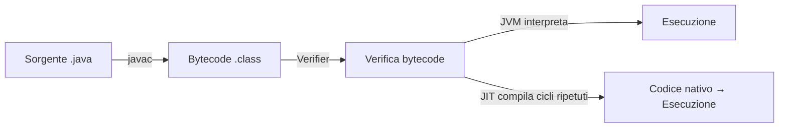

# LP — Lezione: Java — JVM, Scelte di Design e Sintassi di Base

**Corso:** Linguaggi di Programmazione

---

## Argomenti trattati

- Scelte di sicurezza e design del linguaggio Java
- Implementazione mista: compilazione a bytecode + interpretazione JVM
- Componenti della JVM (class loader, bytecode verifier, garbage collector, JIT)
- Formato del file `.class`
- Comandi `javac` e `java` da command line
- Package e organizzazione del codice
- Deployment con JAR
- Notazione BNF per la sintassi di Java (classi, attributi, metodi, costruttori)
- Identificatori, parole chiave, tipi primitivi (introduzione)

---

## 1. Scelte di design per la sicurezza

> [!important] Perché Java è progettato per la sicurezza del codice mobile
> Java nasce con il requisito di poter eseguire codice proveniente dalla rete in modo sicuro. Le scelte di design riflettono questo obiettivo.

Le principali scelte di sicurezza del linguaggio sono:

**Controllo degli indici**: ogni accesso a vettori, stringhe o buffer è controllato a runtime. Gli oggetti portano con sé la propria dimensione. Questo elimina i buffer overflow attack a livello di linguaggio.

**Tipizzazione forte**: il linguaggio è fortemente tipato, eliminando le ambiguità di C dove le conversioni implicite tra tipi possono causare errori difficili da individuare. Più errori vengono catturati a compile-time.

**Nessuna aritmetica dei puntatori**: i puntatori esistono (sono i tipi reference) ma non si possono modificare aritmeticamente. Questo elimina un'intera classe di vulnerabilità.

**Garbage collection automatica**: la memoria non più in uso viene recuperata automaticamente dalla JVM. Questo previene i memory leak che possono causare denial of service.

**Class loader con namespace separati**: il codice caricato da sorgenti diverse vive in namespace distinti, evitando interferenze tra nomi e impedendo lo spoofing (sostituzione di una classe con una malevola con lo stesso nome).

**Bytecode verifier**: prima di eseguire il bytecode, la JVM lo verifica. Questa verifica controlla che non vengano accedute zone di memoria non autorizzate, che lo stack non vada in overflow/underflow, e che non ci siano conversioni di tipo illegali. Anche un bytecode manipolato a mano (che aggira il compilatore) viene rilevato.

> [!quote]
> "Se volete un sistema sicuro con codice mobile, non avete tante scelte."

---

## 2. Implementazione mista: bytecode + JVM

Java usa una strategia intermedia tra compilazione pura e interpretazione pura.



**Fase 1 — Compilazione** (`javac`): trasforma il sorgente `.java` in bytecode `.class`. Effettua tutti i controlli di tipo che possono essere fatti staticamente. Se una classe importata non è ancora compilata, il compilatore la compila a cascata (approccio greedy).

**Fase 2 — Esecuzione** (`java`): la JVM interpreta il bytecode. Prima di eseguirlo, il bytecode verifier lo controlla. I controlli che non si potevano fare a compile-time (es. accesso a indici di vettori, controllo degli accessi a runtime) vengono fatti qui.

**Just-In-Time (JIT) compilation**: se la JVM rileva cicli che rispettano certi requisiti, li compila in codice nativo e li salva. Le esecuzioni successive di quei cicli usano il codice nativo direttamente, senza interpretazione.

> [!tip] Vantaggio dell'implementazione mista
> Il costo della compilazione e dei controlli di tipo viene pagato una volta sola. L'esecuzione del bytecode è più fluida perché il bytecode è compatto e facile da interpretare. Il JIT ottimizza i pezzi critici per le prestazioni.

> [!important] Portabilità
> Il bytecode è indipendente dalla piattaforma. Si compila una volta e si esegue su qualsiasi JVM, che può girare su qualsiasi sistema operativo e hardware. La JVM funge da mediatore tra il bytecode e il sistema sottostante.

---

## 3. Componenti della JVM

La JVM comprende:

**Class loader**: carica le classi dal file system o dalla rete. Mantiene i namespace separati per codice proveniente da locazioni diverse. Se due classi hanno lo stesso nome ma vengono da sorgenti diverse, non interferiscono. Impedisce anche lo spoofing.

**Bytecode verifier**: controlla il bytecode prima dell'esecuzione. È una ridondanza voluta: anche se il compilatore Java ha già fatto i controlli, il bytecode potrebbe provenire da una fonte non fidata o essere stato modificato.

**Interprete + JIT**: il nucleo esecutivo. Interpreta il bytecode istruzione per istruzione, con la JIT che ottimizza i cicli frequenti.

**Garbage collector**: recupera la memoria degli oggetti non più raggiungibili. Gira in un thread separato e si attiva tipicamente quando il programma principale è in attesa di I/O. Le specifiche Java definiscono che il GC deve esistere, ma non specificano l'algoritmo — ogni implementazione della JVM può usarne uno diverso.

> [!example] GC e strutture cicliche
> L'implementazione semplificata del GC usata da Python (conteggio dei riferimenti) non funziona per strutture con cicli (due oggetti che si puntano a vicenda). Java usa algoritmi più sofisticati che gestiscono correttamente i cicli.

**Stack di ricorsione e heap**: la JVM gestisce sia lo stack delle chiamate (per variabili locali e frame di attivazione) che l'heap (per oggetti allocati dinamicamente con `new`).

---

## 4. Formato del file `.class`

Il file `.class` è un oggetto molto strutturato. Contiene, tra le altre cose, la **constant pool** (pool di costanti), informazioni sui tipi e sulla struttura della classe, e le istruzioni bytecode. Grazie a questa ricchezza di metadati, il bytecode è completamente reversibile ingegnerizzabile e permette tutti i controlli a runtime che non si possono fare a compile-time.

> [!tip] Da command line
> ```bash
> javac NomeClasse.java      # compila, produce NomeClasse.class
> java NomeClasse            # esegue (invoca la JVM)
> ```
> In questo corso si usa `javac` e `java` da command line, senza IDE o Maven, per vedere il linguaggio "nudo".

---

## 5. Package e organizzazione del codice

I package organizzano le classi in namespace gerarchici. Corrispondono a directory nel filesystem.

**Dichiarazione di package** (prima riga del file sorgente):
```java
package trasporti.rapporti.web;
```

**Import** (abbreviazioni per evitare di scrivere il nome completo ogni volta):
```java
import java.util.List;       // importa solo List
import java.util.io.*;        // importa tutto da io
```

> [!abstract] Definizione: cosa fa l'import
> L'import è solo un'abbreviazione sintattica. Non copia né duplica nessun file. Senza import, si scrive `java.util.List` ogni volta; con l'import, si scrive solo `List`.

**Struttura nel filesystem**: i package si riflettono in directory annidate. Il file `trasporti/rapporti/web/MiaClasse.java` contiene la classe `trasporti.rapporti.web.MiaClasse`.

**Vincolo nome file = nome classe**: il nome del file `.java` deve corrispondere al nome della classe pubblica in esso contenuta. Questo vale sia per il sorgente che per il `.class`. Motivo: i nomi dei file devono essere portabili, quindi composti solo da caratteri ASCII (non tutti i file system supportano Unicode nei nomi dei file).

**Deployment con JAR**: un file JAR (Java Archive) raccoglie tutto il bytecode organizzato in directory, in un singolo file eseguibile direttamente dalla JVM. Conveniente per distribuire applicazioni.

---

## 6. Sintassi BNF

Java usa la notazione **Backus-Naur Form (BNF)** per definire formalmente la sintassi. I simboli usati sono:

| Simbolo | Significato |
|---|---|
| `<categoria>` | Categoria sintattica (non terminale) |
| `::=` | "è definito come" |
| `|` | Alternativa |
| `*` | Zero o più ripetizioni |
| `[ ]` | Elemento opzionale (zero o una volta) |
| Testo senza `< >` | Terminale (preso alla lettera) |

**Dichiarazione di classe**:
```
<class_decl> ::= <modifier>* class <class_name> { <attr_decl>* <constructor_decl>* <method_decl>* }
```

**Dichiarazione di attributo**:
```
<attr_decl> ::= <modifier> <type> <attr_name> [= <default_value>] ;
<type> ::= byte | short | int | long | float | double | boolean | char | <class_name>
```

**Dichiarazione di metodo**:
```
<method_decl> ::= <modifier> <return_type> <method_name> ( <param_list>* ) { <statement>* }
```

**Dichiarazione di costruttore**:
```
<constructor_decl> ::= <modifier> <class_name> ( <param_list>* ) { <statement>* }
```

> [!warning] Differenze costruttore vs. metodo
> Il costruttore non ha tipo di ritorno (sintatticamente). Non è ereditato. Non può essere invocato direttamente se non con `new`. Può essere overloaded (versioni con parametri diversi). I modificatori ammessi sono solo quelli di visibilità: `public`, `protected`, `private`.

> [!example] Costruttore di default
> Se non si dichiara nessun costruttore, Java inserisce automaticamente un costruttore senza parametri con corpo vuoto. Appena si dichiara un costruttore qualsiasi, quello di default sparisce. Questo può causare errori: se il codice esterno usava il costruttore senza parametri, smette di compilare dopo che si aggiunge un costruttore con parametri.

---

## 7. Identificatori

Gli identificatori possono iniziare con una lettera Unicode, `_` o `$` (ma non con un numero). Sono case-sensitive. Non hanno lunghezza massima. I nomi delle classi devono essere composti solo da caratteri ASCII (per la portabilità sui file system).

**Non possono essere parole chiave**. Java riserva come parole chiave anche `goto` e `const`, che non sono comandi del linguaggio, ma che non si possono usare come identificatori — per evitare confusione con il C.

**Differenze da C**: `true`, `false` e `null` sono letterali nativi (non macro `#define`). Non esiste `sizeof` (le dimensioni dei tipi primitivi sono fisse, indipendenti dalla piattaforma).

> [!example] Identificatori validi e non validi
> - `myVar`, `_temp`, `$value`, `nomeClasseDiEsempio` → validi
> - `123abc` (inizia con numero), `my.var` (`.` è operatore), `int` (parola chiave) → non validi

---

## 8. Incapsulazione

L'incapsulazione — rendere privati gli attributi e fornire accesso solo tramite metodi pubblici — garantisce che i controlli di consistenza dei dati siano centralizzati. Senza incapsulazione si avrebbero "cloni" di codice di validazione sparsi per il programma, difficili da mantenere.

I modificatori di visibilità sono (dal più restrittivo al meno): `private`, (default/package), `protected`, `public`.

---

> [!summary] Punti chiave della lezione
> - Java è progettato per eseguire codice mobile in modo sicuro: controllo indici, tipizzazione forte, no aritmetica puntatori, GC automatico, bytecode verifier.
> - La JVM implementa una strategia mista: `javac` compila a bytecode portabile, `java` (JVM) interpreta con JIT per i cicli critici.
> - I package organizzano il codice in namespace gerarchici corrispondenti a directory nel filesystem; gli import sono solo abbreviazioni.
> - La sintassi è descritta formalmente in BNF; costruttori e metodi hanno differenze sintattiche e semantiche precise.
> - In questo corso si usa sempre `javac`/`java` da command line per vedere il linguaggio nudo.

## Prossimi argomenti

- [ ] Tipi primitivi e operatori (differenze sottili rispetto a C)
- [ ] Tipi reference e oggetti
- [ ] Esercitazioni: compilare ed eseguire programmi con errori tipici da command line

#LP #Java #JVM #bytecode #package #sintassi #garbage-collector #BNF
