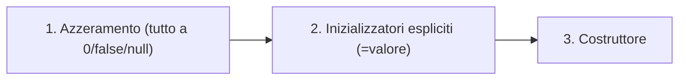

# LP — Lezione 8: Java — Tipi, Passaggio Parametri e Equivalenza di Tipi

**Corso:** Linguaggi di Programmazione

---

## Argomenti trattati

- Tipi primitivi Java: boolean, char, interi (byte, short, int, long), floating point (float, double)
- Letterali e regole di compatibilità di tipo
- Tipi reference e costruzione degli oggetti (tre strati di inizializzazione)
- Passaggio parametri: sempre per copia in Java
- Parola chiave `this`
- Variabili di classe vs istanza vs locali
- Inizializzazione delle variabili locali: controllo statico del compilatore
- Type equivalence: equivalenza per nome vs equivalenza strutturale
- Breve storia dei sistemi di tipi

---

## 1. Tipi primitivi

Java ha **otto tipi primitivi** predefiniti. La loro dimensione è **fissa e indipendente dalla piattaforma**: è la JVM a uniformare la rappresentazione sull'hardware sottostante. Questa scelta sacrifica la trasparenza dell'architettura sottostante (tipica del C) in favore della portabilità e della robustezza.

### Boolean

Il tipo `boolean` ha esattamente due valori: `true` e `false`. Non esiste conversione implicita o esplicita tra `boolean` e tipi interi, in nessun verso. Questo è una differenza radicale rispetto a C/C++, dove i booleani sono interi e `if (1)` è valido.

### Char

I caratteri sono Unicode (UTF-16): **16 bit**. Si possono usare le stesse sequenze di escape del C (es. `'\t'`, `'\n'`) e la notazione esadecimale `'\u03B1'` (per il carattere greco α, dove `03` è l'alfabeto greco e `B1` il codice del carattere).

> [!warning] Caratteri ≠ Stringhe
> I caratteri sono tipi primitivi con dimensione fissa (16 bit). Le stringhe (`String`) sono **oggetti** (tipi reference). Non si trattano allo stesso modo.

### Tipi interi

Tutti con segno, dimensioni fisse:

| Tipo | Bit | Range approssimativo |
|---|---|---|
| `byte` | 8 | $-128$ a $127$ |
| `short` | 16 | $-32768$ a $32767$ |
| `int` | 32 | $\pm 2^{31}$ |
| `long` | 64 | $\pm 2^{63}$ |

I letterali interi sono di tipo `int` per default; per specificare un `long` si aggiunge `L` o `l` in fondo (es. `123L`). Si possono usare notazioni decimale, ottale (prefisso `0`) o esadecimale (prefisso `0x`).

**Regola per le costanti:** se si assegna una costante intera letterale a una variabile di tipo più piccolo (`short` o `byte`), il compilatore accetta l'assegnamento se e solo se la costante rientra nel range del tipo, senza bisogno di un cast esplicito. Questa regola vale però **solo per le costanti letterali**, non per le espressioni:

```java
short s = 9;       // OK: la costante 9 entra in uno short
short t = s + 1;   // ERRORE: s + 1 è un'espressione, produce un int
```

Questo perché gli operatori sugli interi producono sempre almeno un `int`.

### Tipi a virgola mobile

Rispettano lo standard IEEE 754. Il tipo di default è `double` (64 bit); il tipo `float` (32 bit) si specifica con suffisso `F` o `f`. Il suffsso `D` o `d` è opzionale per i double.

```java
float f = 3.14f;       // float
double d = 3.14;       // double (default)
double d2 = 3.14D;     // uguale al precedente
```

---

## 2. Regole di compatibilità di tipo

Il principio è: si può assegnare un valore a una variabile di tipo più grande (più capiente) senza perdita di informazione. Non vale il viceversa senza cast esplicito.

```java
int i = 3;
double d = i;   // OK: int → double, allargamento senza perdita
float f = 3.14; // ERRORE: 3.14 è double, non si può restringere a float senza cast
```

L'eccezione assoluta è il tipo `boolean`: **incompatibile con qualunque tipo numerico** in qualsiasi verso. Nessun cast è possibile.

> [!example] Corretta vs errata
> ```java
> int x = 6;        // OK: int ← int
> float z = 3.14f;  // OK: float ← float
> boolean b = true; // OK
> // float z2 = 3.14;  ERRORE: double ← float (restringimento)
> // boolean b2 = 1;   ERRORE: boolean ← int (incompatibili)
> ```

---

## 3. Tipi reference

I tipi reference sono **puntatori** a oggetti allocati nell'heap. Java non ha aritmetica dei puntatori (non si possono modificare arbitrariamente), ma i puntatori esistono come tipi reference. Si preferisce il termine "handle" o "maniglia" per sottolineare la differenza dai puntatori C.

**Allocazione con `new`:** il compilatore calcola ricorsivamente lo spazio necessario per l'oggetto (inclusi gli attributi ereditati da `Object`), lo alloca nell'heap e restituisce un puntatore.

### I tre strati di inizializzazione degli oggetti

Quando si crea un oggetto con `new`, Java esegue **tre strati di inizializzazione nell'ordine**:



1. **Azzeramento automatico:** tutti i campi vengono riempiti con zeri (0 per i tipi numerici, `false` per i boolean, `null` per i reference). Questo garantisce che nessun campo di un oggetto parta con un valore casuale.
2. **Inizializzatori espliciti:** se un attributo è dichiarato con `= valore`, quel valore viene scritto.
3. **Corpo del costruttore:** esegue ulteriori inizializzazioni.

> [!tip]
> "Questo è un fattore di sicurezza. Se provate a usare un puntatore azzerato, vi darà fuori un'eccezione. È un compromesso vantaggioso tra sicurezza ed efficienza: la costruzione di oggetti è relativamente rara rispetto alle operazioni."

---

## 4. Passaggio di parametri in Java: sempre per copia

In Java l'**unica** modalità di passaggio parametri è **per copia (pass by value)**. Non esiste passaggio per riferimento.

**Per tipi primitivi:** viene copiato il valore. Le modifiche al parametro formale non si propagano fuori.

**Per tipi reference:** viene copiato il **puntatore**. I parametri attuale e formale puntano allo stesso oggetto. Se si modifica il *contenuto* dell'oggetto tramite il parametro formale, la modifica è visibile fuori. Se invece si riassegna il parametro formale a un nuovo oggetto (`d = new MiaData(...)`), il parametro attuale rimane immutato.

> [!example] I tre casi del passaggio parametri
> ```java
> void cambiaValore(int val) { val = 55; }     // val è una copia, fuori rimane 11
> void cambiaOggetto(MiaData d) { d = new MiaData(1,1,2005); } // d è una copia del puntatore, fuori rimane invariato
> void cambiaAttributo(MiaData d) { d.giorno = 16; }  // modifica l'oggetto puntato, visibile fuori
> ```
> Se `data = new MiaData(24,4,2006)` e si chiama `cambiaAttributo(data)`, dopo la chiamata `data.giorno` vale 16.

> [!warning] Non confondere "copia del puntatore" con "passaggio per riferimento"
> Passare un puntatore per copia e passare per riferimento sono cose diverse. Con il passaggio per copia del puntatore: non puoi cambiare quale oggetto punta la variabile fuori dalla funzione, ma puoi modificare il contenuto dell'oggetto puntato. Il passaggio per riferimento vero (come in C++ con `&`) permetterebbe di cambiare anche quale oggetto è puntato dalla variabile esterna.

---

## 5. La parola chiave `this`

`this` è un riferimento all'oggetto corrente. Ha tre usi principali.

**1. Risolvere ambiguità quando i parametri formali mascherano gli attributi:**

```java
class MiaData {
    int giorno, mese, anno;
    MiaData(int giorno, int mese, int anno) {
        this.giorno = giorno;   // this.giorno = attributo; giorno = parametro
        this.mese   = mese;
        this.anno   = anno;
    }
}
```

**2. Passare un puntatore a se stesso** (es. per implementare callbacks o liste concatenate):

```java
lista.setNext(this);   // passo me stesso come prossimo elemento
```

**3. Clonare l'oggetto corrente** usando un costruttore di copia:

```java
MiaData aggiungiGiorni(int g) {
    MiaData nuova = new MiaData(this);  // clona se stesso
    nuova.giorno += g;
    return nuova;
}
```

---

## 6. Variabili di classe, istanza e locali

| Tipo | Dove dichiarate | Una copia per... | Dove memorizzate |
|---|---|---|---|
| **Di classe** (`static`) | Nella classe | Tutta la classe | Insieme al bytecode |
| **Di istanza** | Nella classe (senza `static`) | Ogni oggetto | Heap (nell'oggetto) |
| **Locali** | Dentro un metodo | Ogni invocazione | Stack di attivazione |

Quando si chiama un metodo su un oggetto (es. `x.metodo()`), si dice che `x` fornisce l'**ambiente non locale** del metodo: gli attributi di `x` sono le variabili non locali del codice del metodo. Questo è concettualmente diverso dall'ambiente non locale nei linguaggi imperativi puri, dove dipende solo dall'innestamento dei blocchi.

### Inizializzazione delle variabili locali

Gli attributi (di classe o di istanza) vengono azzerati automaticamente (tre strati di inizializzazione). Le variabili locali **no**: il compilatore verifica staticamente che vengano inizializzate prima dell'uso. Se c'è anche solo la possibilità che una variabile non sia inizializzata (es. inizializzata solo in un ramo di un `if`), si ottiene un errore di compilazione.

```java
void metodo() {
    int y;
    int x = random();
    if (x > 4) y = 10;
    int z = x + y;  // ERRORE: y potrebbe non essere inizializzata
}
```

> [!tip] Perché il trattamento è diverso?
> Le costruzioni di oggetti sono rare rispetto alle chiamate di metodo, quindi azzerare gli attributi è accettabile. Le variabili locali sono create ad ogni chiamata; azzerarle automaticamente sarebbe troppo costoso. Invece, il controllo statico del compilatore garantisce la sicurezza senza costo a runtime.

---

## 7. Type equivalence: nome vs struttura

Quando è valido un assegnamento `x = y` tra variabili di tipi diversi? Questo dipende dalla nozione di **equivalenza di tipo** adottata dal linguaggio.

### Equivalenza per nome (name equivalence)

Due variabili hanno tipi equivalenti solo se hanno **esattamente lo stesso nome di tipo**. È la regola più restrittiva.

```java
// In Java con le classi: una classe è compatibile con un'altra
// solo se è esplicitamente dichiarata sua sottoclasse (o la stessa).
// Due classi con stessa struttura ma nomi diversi NON sono compatibili.
```

### Equivalenza strutturale (structural equivalence)

Due variabili hanno tipi equivalenti se hanno la **stessa struttura interna**, indipendentemente dal nome.

> [!example] Il problema dell'equivalenza strutturale: euro e mele
> ```c
> typedef int Euro;
> typedef int Mele;
> Euro x = 10;
> Mele y = 5;
> int z = x + y;   // OK con equivalenza strutturale (tutti interi)
>                  // ERRORE con equivalenza per nome
> ```
> Con equivalenza strutturale, il compilatore non può aiutarci a evitare di sommare euro e mele. Con equivalenza per nome, cattura l'errore.

**Scelta del C/C++:** equivalenza strutturale per i tipi primitivi e le typedef, ma equivalenza **per nome per le `struct`**. Questa scelta anomala ha una ragione tecnica: verificare l'equivalenza strutturale di tipi strutturati (specialmente con puntatori ricorsivi) richiede di risolvere una bisimulazione tra automi a stati finiti, un problema computazionalmente molto costoso.

**Scelta di Java:** equivalenza per nome per le classi. Due classi con la stessa struttura ma nomi diversi non sono mai compatibili a meno di una relazione esplicita di ereditarietà.

> [!tip] Nei linguaggi dinamici (Python, JavaScript, TypeScript con duck typing)
> Alcuni linguaggi di scripting usano equivalenza strutturale anche per gli oggetti: un oggetto è compatibile con un tipo se ha almeno tutti gli attributi di quel tipo, indipendentemente dal nome della classe. Più flessibile, ma rende difficile il type checking statico.

---

## 8. Breve storia dei sistemi di tipi

I sistemi di tipi si sono evoluti storicamente in questo ordine:

1. **Solo tipi elementari** (primi Fortran): float, int, ecc., uno a fianco all'altro, nessuna gerarchia.
2. **Tipi user-defined** (Pascal, primi C): `typedef`, struct, ma senza encapsulation; i dati e le operazioni su di essi sono separati.
3. **Tipi di dati astratti** (Modula, Ada): encapsulation, operatori associati ai dati, modificatori di accesso, disaccoppiamento interfaccia/implementazione.
4. **Gerarchie di tipi** (C++, Java): sottoclassi, ereditarietà, polimorfismo.

Quando si studia un linguaggio nuovo, le caratteristiche del sistema di tipi da esaminare sono: strongly vs weakly typed, supporto all'encapsulation, tipo di equivalenza di tipi, polimorfismo, type inference, supporto alle eccezioni, supporto al parallelismo (memoria condivisa vs scambio messaggi).

---

> [!abstract] Punti chiave della lezione
> - Java ha 8 tipi primitivi con dimensioni fisse su qualunque piattaforma; `boolean` non è mai compatibile con i tipi interi.
> - Gli oggetti vengono costruiti in tre strati: azzeramento → inizializzatori espliciti → costruttore. Gli attributi sono sempre inizializzati; le variabili locali devono essere inizializzate esplicitamente (controllo statico del compilatore).
> - Il passaggio parametri in Java è sempre per copia. Per i tipi reference si copia il puntatore: modifiche all'oggetto sono visibili fuori, ma riassegnare il parametro formale non lo è.
> - `this` risolve ambiguità di scope, permette di passare un puntatore a se stessi e di clonare l'oggetto corrente.
> - L'equivalenza di tipo per nome è più restrittiva di quella strutturale ma aiuta il compilatore a individuare errori semantici (es. sommare euro e mele). Java usa equivalenza per nome per le classi.

## Prossimi argomenti

- [ ] Operatori bitwise e di shift in Java (differenze rispetto a C)
- [ ] Classi interne e ambiente non locale in Java
- [ ] Algoritmo di ricerca e analisi delle coppie (esercitazioni)

#LP #Java #tipi-primitivi #reference #passaggio-parametri #this #type-equivalence #inizializzazione
