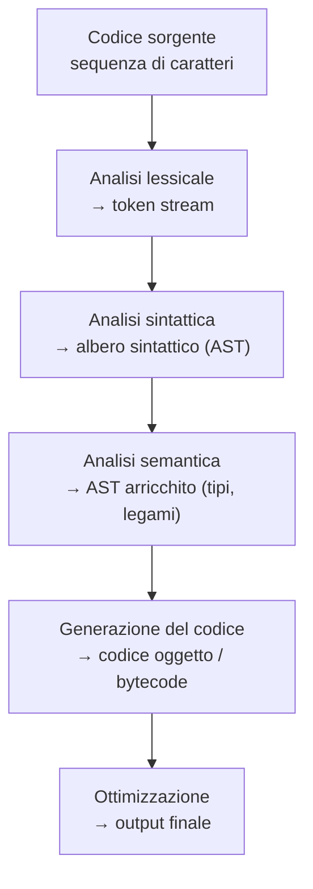

# LP — Lezione 0: Storia dei Linguaggi, Paradigmi e Implementazione

**Corso:** Linguaggi di Programmazione

---

## Argomenti trattati

- Perché esistono tanti linguaggi e perché continuano ad emergere
- Obiettivo del corso: imparare a imparare i linguaggi
- Excursus storico: FORTRAN, COBOL, ALGOL, LISP, Pascal, Simula, PL/1, Prolog
- Caratteristiche costituenti dei linguaggi (le "idee" riusabili)
- Definizioni: linguaggio di programmazione, processore, macchina astratta
- Linguaggi Turing-completi e linguaggi non completi
- Tre approcci di implementazione: interpretazione pura, compilazione pura, approccio ibrido (bytecode)
- Fasi del compilatore: analisi lessicale, sintattica, semantica, generazione del codice

---

## Perché tanti linguaggi?

Il corso si chiama "Linguaggi di Programmazione" al plurale per una ragione precisa: dopo 60+ anni di ricerca, non esiste un linguaggio definitivo e probabilmente non esisterà mai. Ogni volta che emerge una nuova categoria di problemi con esigenze omogenee, emerge un linguaggio più adatto a risolverli.

La risposta pratica non è conoscerli tutti, ma capire le **idee fondamentali** con cui i linguaggi vengono costruiti. Queste idee sono poche, stabili nel tempo, e non dipendono dalla sintassi di un linguaggio specifico. Quando emerge un linguaggio nuovo, lo si "scompatta" nelle sue idee costituenti e lo si impara per delta rispetto a ciò che si conosce già.

> [!tip]
> "L'obiettivo specifico è insegnare a imparare velocemente un nuovo linguaggio, astraendo quelle che sono le caratteristiche di base. Queste cambiano di rado: è tanto tempo che non ne vedo comparire una completamente nuova."

### Obiettivi del corso

Il corso si organizza attorno a tre famiglie di linguaggi (paradigmi):

| Paradigma | Linguaggio rappresentativo | Caratteristica distintiva |
|---|---|---|
| **Imperativo / OO** | Java | Assegnamenti, cicli, oggetti |
| **Funzionale** | ML | Funzioni di ordine superiore, no assegnamento |
| **Logico** | Prolog | Programmazione non deterministica, invertibilità |

Non si insegna la sintassi fino all'ultima virgola, ma le **idee di design** e le **tecniche di implementazione** che stanno dietro ciascun paradigma. L'obiettivo pratico è la "formazione permanente": in una disciplina in continua evoluzione, saper imparare è più importante che sapere.

---

## Excursus storico: le idee che contano

Le caratteristiche fondamentali che troviamo nei linguaggi moderni sono state quasi tutte introdotte **tra gli anni '50 e '70**. I linguaggi nuovi assemblano queste idee in modi diversi; raramente ne inventano di completamente nuove.

### FORTRAN (1954)

Il primo linguaggio ad alto livello della storia. Nasce in contesto militare per calcoli matematici pesanti (traiettorie, previsioni). Introduce per la prima volta: **variabile**, **statement di assegnamento**, **tipi di base** (interi, reali, matrici), **subroutine** (astrazione procedurale), **cicli**, **condizionali**, **I/O formattato**.

**Assenza fondamentale: gestione dinamica della memoria.** Il programma ha un'impronta di memoria fissa, calcolata a compile time, allocata all'avvio. Senza stack, senza `malloc`, senza ricorsione.

### COBOL e ALGOL 60

COBOL introduce il **record** (tipo strutturato definito dal programmatore). ALGOL 60 raggiunge maggiore **indipendenza dalla macchina**: le istruzioni non fanno riferimento all'architettura sottostante. Paradossalmente, C e C++ (più recenti) non hanno questa proprietà: la dimensione di `int` dipende dalla piattaforma.

### LISP (fine anni '50)

Il primo linguaggio **funzionale**. Nato per l'intelligenza artificiale, segue il paradigma funzionale: niente assegnamenti, niente cicli (sostituiti dalla **ricorsione**). Prima introduzione di: **memoria dinamica**, **garbage collector** (idea che ritroviamo in Java e Python), **nessuna distinzione strutturale tra codice e dati** (i programmi sono liste, i dati sono liste → i programmi possono manipolare se stessi: **metaprogrammazione**). Questo anticipa la **reflection** di Java.

### Simula (anni '60)

Il **progenitore dei linguaggi a oggetti**. Introduce il concetto di **classe**: una struttura che incapsula insieme dati e procedure. Anticipa il tipo di dato astratto che poi diventa centrale in Ada, Modula, C++, Java.

### PL/1 (anni '60)

Introduce il **multitasking** dentro il linguaggio stesso: costrutti per thread e semafori. Java riprende questa idea con `synchronized`, `wait()`, `notify()`.

### Pascal (anni '70)

Impone la **programmazione strutturata** (riduzione del `goto`). Grande libertà nella definizione di tipi utente, ma senza incapsulamento: non si può dire "solo queste funzioni accedono a questo tipo".

### Modula (anni '70)

Introduce le **interfacce**: il concetto che Java riprende direttamente. Un modulo esporta solo ciò che decide di esporre; l'implementazione è nascosta.

### Prolog (anni '70)

Il primo e più significativo linguaggio di **programmazione logica**. Non si descrive *come* risolvere il problema, ma *cos'è* una soluzione, e la macchina cerca automaticamente. Caratteristiche uniche: **invertibilità** dei predicati (un predicato che calcola f(x) calcola automaticamente anche la funzione inversa), **metaprogrammazione nativa**. Usato in AI e per problemi combinatoriali complessi.

> [!tip] Utilità pratica di Prolog
> Se avete un problema con vincoli complessi da risolvere in poco tempo, la programmazione logica può condensare centinaia di righe di codice imperativo in poche decine. "Se avete una consegna stringente con qualcosa di molto complesso, può salvarvi la vita."

---

## Terminologia fondamentale

> [!abstract] Definizione: Linguaggio di programmazione
> Un linguaggio ha una **sintassi** (insieme di stringhe ben formate) e una **semantica** (cosa esprimono: un processo computazionale). È destinato a un **processore** che esegue quel processo.

> [!abstract] Definizione: Macchina astratta (per il linguaggio L)
> Un insieme di strutture dati e algoritmi che permette di memorizzare ed eseguire programmi in L. Non deve essere hardware fisico: può essere un interprete software, una VM, o una combinazione.

La struttura di von Neumann — memoria, unità di controllo (fetch → decode → execute), ALU — si ritrova sia nei processori fisici sia nella JVM di Java.

### Linguaggi Turing-completi

Un linguaggio è **Turing-completo** se può esprimere qualsiasi funzione calcolabile. Condizione pratica: deve poter divergere (i programmi possono non terminare). Per la tesi di Church-Turing, i modelli di calcolo equivalenti alla macchina di Turing sono tutti intercambiabili.

> [!example] SQL non è Turing-completo
> SQL garantisce la terminazione di ogni query. Per la dualità completezza/non-terminazione, questo significa che SQL non può esprimere tutte le funzioni calcolabili. Per questo SQL viene spesso combinato con linguaggi completi (stored procedures in Python, Java, PL/SQL).

---

## Tre approcci di implementazione

### Interpretazione pura

Un interprete prende il programma sorgente e lo esegue **istruzione per istruzione**, ad ogni esecuzione. In un ciclo eseguito 1000 volte, la stessa istruzione viene analizzata 1000 volte.

Vantaggi: visibilità dell'esecuzione passo-passo, immediato da usare.  
Svantaggi: lento (analisi ripetuta ad ogni esecuzione).

Esempi: Python (nella forma base), Lua, linguaggi di scripting.

### Compilazione pura

Il compilatore traduce l'intero programma sorgente in **codice oggetto eseguibile direttamente dall'architettura target**, prima di qualsiasi esecuzione.

Vantaggi: veloce (analisi fatta una sola volta per tutto il programma), possibilità di controlli statici approfonditi (tipi, raggiungibilità del codice), rilevazione anticipata degli errori prima dell'esecuzione.

**Cross-compilation:** il compilatore può generare codice per un'architettura diversa da quella su cui gira. Cruciale per "vestire" una nuova piattaforma: si adatta solo il backend del compilatore (la fase di generazione codice), riusando tutto il resto.

### Approccio ibrido: bytecode + macchina virtuale

Prima compilazione verso un **bytecode** (codice per una macchina astratta che non esiste in hardware). Poi una **macchina virtuale** interpreta ed esegue il bytecode.

| Termine Java | Ruolo nel modello ibrido |
|---|---|
| `javac` | Compilatore: sorgente `.java` → bytecode `.class` |
| File `.class` | Bytecode |
| `java` (JVM) | Macchina virtuale: interpreta il bytecode |

Vantaggi: **portabilità** (stesso bytecode gira su qualunque piattaforma con una JVM); buone prestazioni (rispetto all'interpretazione pura). Lo stesso schema si usa in Python (`.pyc`), Prolog, C# (MSIL + .NET runtime).

---

## Fasi del compilatore

**Analisi lessicale:** trasforma la stringa di caratteri in una sequenza di **token** (identificatori, parole chiave, operatori, parentesi...). Implementabile con automi a stati finiti (grammatiche regolari). Esistono generatori automatici di lexer.

**Analisi sintattica (parsing):** verifica che i token rispettino la grammatica del linguaggio e produce un **albero sintattico astratto (AST)**. Usa grammatiche context-free (LR, LR1). L'AST rappresenta il programma in forma ad albero navigabile ricorsivamente: ogni nodo è un'operazione, ogni foglia è un dato.

**Analisi semantica:** controlla la correttezza di significato — tipi compatibili, variabili dichiarate, eccezioni gestite. Arricchisce l'AST con le informazioni di tipo e i legami tra dichiarazioni e usi. Non dipende dall'architettura target → riusabile su piattaforme diverse.

**Generazione del codice:** visita ricorsivamente l'AST e traduce ogni nodo in istruzioni della macchina target. Per ogni costrutto del linguaggio sorgente c'è una regola di traduzione.

**Ottimizzazione:** elimina istruzioni ridondanti e riorganizza il codice per migliorare le prestazioni. Verrà introdotta nell'ultima parte del corso attraverso esempi in Prolog.

> [!tip] Perché serve al programmatore
> Conoscere le fasi di compilazione permette scelte più consapevoli nel codice. Esempio classico: `switch/case` vs catena di `if/else` — sapendo come vengono compilati (spesso il `switch` usa una jump table), si sa quando uno è più efficiente dell'altro.

---

## Logistica del corso

**Esame:** scritto con domande a scelta multipla e domande aperte (piccole funzioni nei linguaggi del corso). Orale opzionale in caso di dubbio. Non ci sono prove intercorse programmate a inizio corso.

**Materiale:** disponibile su pagina Teaching del docente e su docenti.unina.it. Non è necessario un libro di testo singolo; il docente integra più fonti.

**Ricevimento:** per appuntamento (via mail o canale dedicato).

---

> [!abstract] Punti chiave della lezione
> - I linguaggi proliferano perché categorie di problemi diverse richiedono strumenti espressivi diversi. Imparare le idee fondamentali (non le sintassi) permette adattamento rapido.
> - Le caratteristiche chiave — variabile, tipo, ricorsione, GC, OO, metaprogrammazione — sono state introdotte tra gli anni '50 e '70.
> - Un linguaggio è Turing-completo se i suoi programmi possono non terminare; SQL non lo è.
> - Tre approcci di implementazione: interpretazione pura (flessibile, lenta), compilazione pura (veloce, meno portabile), ibrido bytecode+VM (Java: portabile ed efficiente).
> - Il compilatore si articola in fasi: lessicale → sintattica → semantica → generazione del codice → ottimizzazione.

## Prossimi argomenti

- [ ] Modello imperativo: variabili, binding, scope, lifetime
- [ ] Implementazione del modello imperativo: record di attivazione, stack
- [ ] Object Orientation in Java: incapsulamento, ereditarietà, polimorfismo, interfacce
- [ ] Linguaggi funzionali: ML, funzioni di ordine superiore, pattern matching

---

#LP #paradigmi #storia #FORTRAN #LISP #Prolog #Simula #compilatori #interpreti #macchina-astratta #bytecode #Turing-completo
