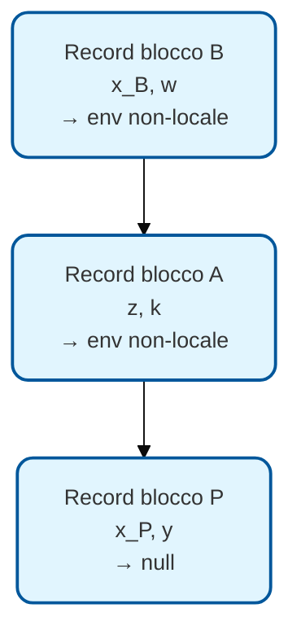

# LP — Lezione 3: Blocchi, Scope e Record di Attivazione

**Corso:** Linguaggi di Programmazione | **Docente:** Prof. Bonatti | **Data:** 19/03/2026

---

## Argomenti trattati

- Blocchi: definizione, motivazioni storiche, struttura sintattica
- Legami di nome e ambito di validità (scope)
- Scoping statico (lessicale): ereditarietà unidirezionale, mascheramento
- Implementazione dello scoping statico con record di attivazione
- Struttura dello stack di attivazione: variabili locali, temporanee, return pointer
- Scoping dinamico: differenze, problemi di predittibilità, storia (LISP → Scheme)
- Blocchi associati a procedure: record di attivazione più complesso
- Puntatore all'ambiente non locale: differenza tra statico e dinamico
- Parametri formali vs. parametri attuali
- Modalità di passaggio: in, out, in-out (Ada)
- Default values e passaggio per nome vs. per posizione

---

## Blocchi: Motivazioni e Struttura

### Perché i blocchi?

I blocchi di istruzione (delimitati in C da `{}`, in Pascal da `begin...end`, in Python dall'indentazione) furono introdotti con la **programmazione strutturata** per tre ragioni principali:

1. **Evitare il `goto`**: definire i bordi di cicli, `if`, procedure.
2. **Unità di compilazione separata**: componenti compilabili e testabili indipendentemente (package in Java).
3. **Namespace separati**: evitare interferenze tra variabili con lo stesso nome usate in punti diversi del programma.

> [!example] Il problema dei vecchi linguaggi
> In Assembler e nel vecchio BASIC i nomi di variabile erano un unico calderone globale. Riutilizzare per errore lo stesso identificatore in un altro punto del codice causava bug insidiosi. I blocchi creano "recinti" all'interno dei quali un nome può essere riutilizzato senza interferire con gli usi esterni.

### Struttura di un blocco (pseudolinguaggio)

```
begin blocco P
    dichiarazioni    ← identificatori dichiarati in P
begin statements
    istruzioni       ← usano gli identificatori dichiarati sopra
end blocco P
```

Il blocco ha due zone: la zona delle dichiarazioni e la zona degli enunciati. I blocchi possono essere innestati arbitrariamente.

---

## Scoping Statico (Lessicale)

### Definizione

> [!abstract] Definizione: Scope Statico
> Il **legame tra un nome e la sua locazione** è valido all'interno del blocco in cui il nome è dichiarato e in tutti i blocchi innestati in esso (salvo mascheramento). L'ambito di validità si determina **guardando il testo del programma**, senza bisogno di eseguirlo.

### Ereditarietà unidirezionale

Un blocco interno **vede** tutto ciò che è dichiarato nei blocchi più esterni. Il viceversa non vale: i blocchi esterni non vedono ciò che è dichiarato all'interno.

```
begin P                    -- dichiara X, Y
    X visibile da qui
    begin A                -- dichiara Z
        X, Y visibili (ereditati da P)
        Z visibile (dichiarato in A)
        begin B            -- dichiara W
            X, Y, Z, W tutti visibili
        end blocco B
        Z ancora visibile (B è finito)
        W non più visibile (B è finito)
    end blocco A
    X, Y visibili
    Z non visibile (A è finito)
end blocco P
```

La struttura dei blocchi innestati forma un **albero**: ogni blocco ha esattamente un genitore (il blocco che lo contiene). L'ereditarietà scorre dall'alto verso il basso nell'albero.

### Mascheramento (Shadowing)

Se un blocco interno dichiara un nome già presente in un blocco esterno, la dichiarazione interna **maschera** quella esterna: finché si è dentro il blocco interno, il nome fa riferimento alla variabile locale. La variabile esterna continua ad esistere e mantiene il suo valore, ma è temporaneamente inaccessibile.

> [!example] Mascheramento in C
> ```c
> int x = 5;          // x del blocco esterno
> {
>     int x = 10;     // maschera la x esterna
>     printf("%d\n", x);  // stampa 10
> }
> printf("%d\n", x);  // stampa 5 — la x esterna è rimasta intatta
> ```
> Le due `x` occupano locazioni di memoria diverse.

> [!warning] Cosa può cambiare nell'ambiente esterno dopo un blocco interno?
> L'unica cosa che può cambiare è il **valore** di una variabile che il blocco interno ha modificato (avendo accesso alla variabile esterna). La struttura dei legami (nome → locazione) è invariata.

---

## Implementazione: Record di Attivazione

Per i blocchi statici semplici (non procedure), l'ambiente si implementa con uno **stack di record di attivazione**. Ogni record contiene:

- Lo spazio per le **variabili locali** del blocco
- Un **puntatore all'ambiente non locale** (il record del blocco che contiene questo)

Entrando in un blocco si fa una push; uscendo, una pop. Il meccanismo è lo stesso della gestione degli environment:



Per cercare una variabile, si scansiona la lista dal record corrente verso la radice: si trova il primo binding con quel nome. Se `x` è dichiarata sia in `B` che in `P`, quella di `B` viene trovata per prima (mascheramento).

### Allocazione statica vs. dinamica

- **Allocazione statica**: la variabile ha una locazione fissa decisa a tempo di compilazione. Tutte le iterazioni di un ciclo usano la stessa locazione. Il valore dell'iterazione precedente persiste.
- **Allocazione dinamica**: a ogni entrata nel blocco si alloca nuova memoria. Il valore non è definito (o è zero se ripulito, ma in pratica non lo è). Necessaria per la ricorsione.

> [!example] Fattoriale con allocazione statica
> ```
> begin P: int i, j
> begin statements
>     for i from 1 to 10:
>         begin A: int j        -- j dichiarata dentro il ciclo
>         begin statements
>             if i == 1: j = 1
>             else:      j = j * i   -- usa il j della iterazione precedente
> ```
> Questo calcola `10!` **solo se l'allocazione di `j` è statica**, perché `j` deve conservare il valore tra un'iterazione e l'altra. Con allocazione dinamica, `j` verrebbe reinizializzata (con valore impredicibile) a ogni iterazione e il calcolo sarebbe errato.

---

## Record di Attivazione per Procedure

### Struttura più complessa

Quando si entra in una procedura, il record di attivazione deve contenere:

| Campo | Contenuto |
|---|---|
| Variabili locali | Spazio per le variabili dichiarate dentro la procedura |
| Memoria temporanea | Risultati parziali nella valutazione di espressioni |
| Return pointer | Indirizzo dell'istruzione a cui tornare dopo la procedura |
| Puntatore all'env non locale | Link al record di attivazione dell'ambiente esterno |

### Memoria temporanea

Durante la valutazione di un'espressione complessa come `x = y * 3 + z * 4`, il compilatore deve parcheggiare i risultati intermedi (es. `y * 3`) da qualche parte mentre calcola `z * 4`. Il posto naturale è il record di attivazione corrente, così le chiamate ricorsive non interferiscono.

### Return pointer

Ogni chiamata a una procedura salva nel record l'indirizzo dell'istruzione da eseguire al ritorno. All'uscita dalla procedura, si estrae il record dallo stack e si salta all'indirizzo salvato.

> [!example] Traccia dello stack per chiamate ricorsive
> P chiama S, S chiama R, R si richiama ricorsivamente, poi chiama Q:
> ```
> [fondo stack]  Record P (null)
>                Record S (→ P)
>                Record R, 1a attivazione (→ P)
>                Record R, 2a attivazione (→ P)  ← stessa funzione, record diverso
>                Record Q (→ Q)
> [cima stack]
> ```
> Due attivazioni della stessa procedura coesistono sullo stack: hanno lo stesso codice ma ambienti separati.

---

## Scoping Statico vs. Dinamico

### Scoping dinamico

In alternativa allo scope lessicale, alcune implementazioni adottano lo **scope dinamico**: l'ambiente non locale di una procedura è quello della procedura che **l'ha chiamata** (non quella che la contiene nel codice).

Il puntatore all'env non locale punta sempre al record immediatamente precedente nello stack, senza saltare record intermedi.

> [!warning] Problemi dello scoping dinamico
> Con lo scope dinamico, non è possibile determinare staticamente qual è l'ambiente non locale di una funzione. Dipende dall'ordine delle chiamate a runtime, che dipende dall'input. Il risultato dello stesso programma con lo stesso input è prevedibile, ma **testare e debuggare** diventa estremamente difficile: quale variabile `x` sta usando la funzione in questo momento? Dipende da chi l'ha chiamata.
>
> Formalmente: determinare l'ambiente non locale di una funzione con scoping dinamico è **indecidibile**.

| | Scope Statico | Scope Dinamico |
|---|---|---|
| Env non locale | Definito dal testo (dove la funzione è scritta) | Definito dall'esecuzione (chi ha chiamato) |
| Determinabile a | Tempo di compilazione | Solo a runtime |
| Predittibilità | Alta | Bassa (indecidibile in generale) |
| Puntatore env | Salta record intermedi (verso il blocco contenitore) | Punta sempre al record precedente |
| Usato da | Quasi tutti i linguaggi moderni | Primo LISP (poi sostituito da Scheme) |

> [!tip] Parole del Professore
> > [!quote]
> > "Scheme è praticamente uguale a LISP — stessa sintassi con tante parentesi — ma usa lo scoping statico proprio per eliminare l'incubo di predire il comportamento dei programmi con scope dinamico."

---

## Passaggio dei Parametri

### Parametri formali vs. attuali

- **Parametri formali**: i nomi usati nella **dichiarazione** della procedura. Fanno parte dell'environment locale della procedura.
- **Parametri attuali**: i nomi usati nella **chiamata** alla procedura (i valori/variabili che si passano dall'esterno).

### Modalità di passaggio (Ada)

Ada è uno dei pochi linguaggi che specifica esplicitamente la direzione del passaggio dei parametri:

```ada
procedure foo(A : in integer; B : out integer; C : in out integer) is
    ...
end foo;
```

| Modalità | Significato | All'inizio dell'esecuzione | Modificabile esternamente? |
|---|---|---|---|
| `in` | Solo input | Valore valido (dato dal chiamante) | No (effetto collaterale indesiderabile) |
| `out` | Solo output | Non inizializzato | Sì (il punto è ricevere un risultato) |
| `in out` | Bidirezionale | Valore valido | Sì |

### Passaggio per posizione vs. per nome

Nella maggior parte dei linguaggi, i parametri attuali si associano ai formali **per posizione**: il primo attuale va al primo formale, ecc.

In Ada (e alcuni altri) è possibile il **passaggio per nome**:

```ada
-- Chiamata per posizione (ordine obbligatorio):
foo(X, Y, Z);

-- Chiamata per nome (ordine libero):
foo(C => Z, A => X, B => Y);
```

Il passaggio per nome migliora la leggibilità (il nome del parametro è esplicito) ed è essenziale quando si vuole **saltare parametri con valore di default**.

### Parametri con valore di default

Alcuni linguaggi permettono di assegnare un valore di default ai parametri formali. Se il chiamante non specifica quel parametro, si usa il default. I parametri con default devono essere tutti in coda (con passaggio per posizione) oppure si può saltarli liberamente (con passaggio per nome).

> [!tip] Perché Ada contiene tutto questo?
> Ada nacque con l'ambizione di essere il linguaggio unico per tutto il software degli enti federali USA. Per supportare tutti i paradigmi e tutti gli usi possibili, risultò così complesso da essere ingestibile. È un caso da manuale di come il tentativo di essere "il linguaggio definitivo" produca un linguaggio che non lo usa quasi nessuno.

---

## Parametri: Valore vs. Riferimento

*(Argomento annunciato per la prossima lezione.)*

Il passaggio di un parametro può avvenire:

- **Per valore** (`pass by value`): si copia il valore del parametro attuale nel parametro formale. Modificare il formale non altera l'attuale.
- **Per riferimento** (`pass by reference`): il parametro formale è un alias del parametro attuale. Modificare il formale modifica l'attuale. Questo fenomeno si chiama **aliasing**.

> *(Questo verrà approfondito nella prossima lezione insieme alle conseguenze dell'aliasing.)*

---

> [!abstract] Punti chiave della lezione
> - I **blocchi** introducono namespace separati e permettono l'ereditarietà unidirezionale (interno vede esterno, non viceversa). Il **mascheramento** nasconde temporaneamente la variabile esterna con lo stesso nome.
> - Lo **scope statico** determina l'ambiente non locale guardando il testo del programma. È predittibile, debuggabile, usato in quasi tutti i linguaggi moderni.
> - Lo **scope dinamico** determina l'ambiente non locale dall'ordine delle chiamate a runtime. È impredicibile (indecidibile in generale) e storicamente abbandonato (LISP → Scheme).
> - I **record di attivazione** si accumulano su uno stack: varibili locali, memoria temporanea per espressioni, return pointer, puntatore all'env non locale.
> - Procedure ricorsive richiedono allocazione dinamica: ogni attivazione ha il proprio record separato.
> - **Parametri formali** (nella dichiarazione) vs. **attuali** (nella chiamata). Modalità Ada: `in`, `out`, `in out`. Passaggio per posizione vs. per nome.

## Prossimi argomenti

- [ ] Passaggio per valore vs. per riferimento (aliasing)
- [ ] Conseguenze dell'aliasing sulla correttezza dei programmi
- [ ] Esercizi su scoping e traccia dello stack di attivazione
- [ ] Introduzione a Java: classi, oggetti, differenze con i blocchi imperativi

#LP #blocchi #scope #scoping-statico #scoping-dinamico #record-di-attivazione #environment #parametri #ADA #mascheramento
