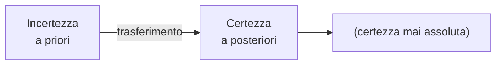
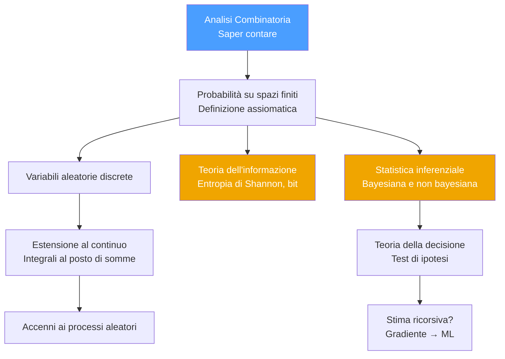
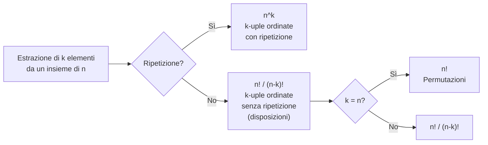

# MSI — Lezione 0: Introduzione, Spazio dei Campioni e Analisi Combinatoria
**Docente:** Prof. Marco Lops (Telecomunicazioni) | **CFU:** 6 | **Corso:** Metodi Statistici per l'Informazione

> [!info] Orario
> - **Martedì** 14:00–16:00
> - **Giovedì** 8:45–10:45
> - Ricevimento: orari ufficiali + disponibile su Teams per appuntamenti di gruppo
> - Materiale (slide + lavagne PDF) sul canale **Teams** del corso

> [!warning] Nota logistica
> Nella prima settimana di maggio il prof sarà all'estero per ricerca → lezione da remoto o recupero.

---

## 📚 Testi di riferimento

| Argomento                | Testo                                                                                       |
| ------------------------ | ------------------------------------------------------------------------------------------- |
| Teoria della probabilità | Ernesto Conte, *Fenomeni aleatori* — molto didattico, richiede una guida (quella del corso) |
| Statistica inferenziale  | Sheldon Ross, *Introduction to Probability and Statistics for Engineers and Scientists*     |

---

## 📝 Esame

> [!important] Modalità d'esame
> - **Prova scritta** + **colloquio orale**
> - 6 CFU, nessun progetto
---

## Perché la Probabilità per l'Informatica?

> [!quote] Idea chiave del corso
> Telecomunicazioni e informatica trattano entrambe lo stesso oggetto: l'**informazione**. Le telecomunicazioni la trasferiscono *nello spazio* (da un luogo a un altro); l'informatica la trasferisce *nel tempo* (memorizzazione, compressione, correzione degli errori).
>
> Intrinseco nel concetto di informazione c'è l'**incertezza**: se non c'è incertezza su ciò che viene trasmesso, non c'è informazione da trasmettere.

La **probabilità** è lo strumento formale per modellare l'incertezza. Tutto ciò che va sotto il nome di *machine learning*, *statistical learning*, *deep learning*, reti neurali — è costruito su questa base.

> [!tip] Citazione del prof
> *"Mettetevi in testa: se vi parlano di statistica dicendo che è un'altra cosa rispetto alla probabilità, vuol dire che non conoscono la probabilità. La probabilità è la base su cui si costruisce tutto il mondo della statistica."*

---

## Programma del Corso

> [!note] Cherry picking
> Essendo un corso da 6 CFU (vs 9 CFU del corso parallelo al 3° anno), alcuni argomenti come la compressione dati (Huffman, codifica aritmetica) e le passeggiate casuali su grafi non saranno trattati in dettaglio. Priorità: **meno argomenti, ma compresi bene**.

### Statistica inferenziale vs descrittiva

| Tipo             | Cosa fa                                                                                          | Importanza                       |
| ---------------- | ------------------------------------------------------------------------------------------------ | -------------------------------- |
| **Descrittiva**  | Calcola statistiche globali su una popolazione data                                              | Limitata ("giocare con Excel")   |
| **Inferenziale** | Da un campione, inferisce le caratteristiche di tutti i campioni futuri statisticamente omogenei | Alta — base del machine learning |

> [!example] Esempio di inferenza
> Progettare un algoritmo di ML: non si vuole un sistema che funzioni solo sul campione di training, ma uno che generalizzi a qualunque campione con gli stessi parametri statistici.

---

## Basi di Teoria della Probabilità

### Il Discreto vs il Continuo

> [!quote] Aforisma del prof
> *"Il discreto riempie la testa di idee; il continuo riempie la lavagna di formule. Se uno capisce bene le idee, le formule sono una conseguenza."*

---

## Definizioni Fondamentali

### Esperimento

> [!abstract] Definizione
> Un **esperimento** è un'operazione (o insieme di operazioni) che conduce a **uno tra tanti risultati possibili**.

### Spazio dei Campioni $\Omega$

> [!abstract] Definizione
> Lo **spazio dei campioni** (o *sample space*) è l'insieme di **tutti i possibili risultati** di un esperimento. Si indica con $\Omega$.
$$\Omega = \{\omega_1, \omega_2, \ldots\}$$
Può essere:
- **Finito** → es. lancio di una moneta: $\Omega = \{T, C\}$
- **Numerabilmente infinito** → es. numero di pacchetti in coda: $\Omega = \mathbb{N}_0$
- **Non numerabile (continuo)** → es. tensione misurata ai capi di una resistenza (rumore termico): $\Omega = \mathbb{R}$

> [!note] Discreto vs Continuo nella pratica
> In realtà qualunque misura fisica è razionale (strumenti con cifre significative finite), ma quando i valori sono così tanti, si modella come continuo e poi si tronca. Il **tempo** viene solitamente schematizzato come continuo.

### Evento

> [!abstract] Definizione
> Un **evento** è un **sottoinsieme** di $\Omega$ definito da una proposizione.
> Un **evento elementare** è un singolo elemento di $\Omega$.

> [!warning] La proposizione non è unica!
> L'evento è univocamente determinato dagli elementi di $\Omega$ che lo compongono, ma la proposizione che lo descrive **non è univoca** (la ridondanza del linguaggio naturale lo permette).
>
> **Esempio:** ho in tasca 1, 2, 3, 4 o 5 euro. L'evento $\{1, 3, 5\}$ può essere descritto come:
> - "ho un numero dispari di euro"
> - "non ho un numero pari di euro"
> - "ho 1 o 3 o 5 euro"
>
> → Saper **riformulare** la proposizione in modo conveniente è spesso la chiave per risolvere un esercizio.

### Nomenclatura degli eventi

| Nome                     | Definizione                                                                              | Notazione         |
| ------------------------ | ---------------------------------------------------------------------------------------- | ----------------- |
| **Evento certo**         | $\Omega$ stesso — ogni volta che compie l'esperimento si ottiene un elemento di $\Omega$ | $\Omega$          |
| **Evento impossibile**   | Insieme vuoto                                                                            | $\emptyset$       |
| **Evento complementare** | $A^c$ = elementi di $\Omega$ non in $A$                                                  | $A^c$ o $\bar{A}$ |
| **Eventi incompatibili** | $A \cap B = \emptyset$                                                                   | —                 |
| **$A$ implica $B$**      | $A \subseteq B$ — il verificarsi di $A$ implica il verificarsi di $B$ (non viceversa)    | $A \subseteq B$   |

> [!example] Esempio — dado
> $A$ = "esce 2", $B$ = "esce un numero pari"
> → $A \subseteq B$: se esce 2, certamente è uscito un pari. Ma se esce un pari, non è detto che sia 2 (potrebbe essere 4 o 6).

---

## Operazioni sugli Insiemi / Eventi

### Riassunto operazioni
| Operazione   | Definizione                                                                               |
| ------------ | ----------------------------------------------------------------------------------------- |
| Unione       | $A_1 \cup A_2 = \{\omega \in \Omega \mid \omega \in A_1 \text{ oppure } \omega \in A_2\}$ |
| Intersezione | $A_1 \cap A_2 = \{\omega \in \Omega \mid \omega \in A_1 \text{ e } \omega \in A_2\}$      |
| Complemento  | $A_1^c = \{\omega \in \Omega \mid \omega \notin A_1\}$                                    |
| Sottrazione  | $A_1\setminus  A_2 = A_1 \cap A_2^c$                                                      |
### Proprietà utili

| Proprietà                | Formula                       |
| ------------------------ | ----------------------------- |
| Doppio complemento       | $(A^c)^c = A$                 |
| Complemento di $\Omega$  | $\Omega^c = \emptyset$        |
| Unione con complementare | $A \cup A^c = \Omega$         |
| De Morgan                | $(A \cup B)^c = A^c \cap B^c$ |
| De Morgan                | $(A \cap B)^c = A^c \cup B^c$ |

---

## Approccio Frequentistico alla Probabilità

### Frequenza di successo

> [!abstract] Definizione
> Dati $n$ esperimenti **indipendenti** (l'esito di uno non influenza gli altri), si definisce **frequenza di successo** dell'evento $A$ su $n$ prove:
>
> $$f_n(A) = \frac{N_A}{n}$$
>
> dove $N_A$ è il numero di volte in cui si è verificato $A$.

Per un dado **onesto** (eventi elementari equiprobabili):
$$\lim_{n \to \infty} f_n(A) = \frac{|A|}{|\Omega|}$$
> [!warning] Il cane che si morde la coda
> La definizione frequentistica usa implicitamente il concetto di **indipendenza** — che è esso stesso un concetto probabilistico. È una definizione un po' autoriflessiva: per questo il prof darà anche una definizione più rigorosa (assiomatica).

> [!example] Verifica dell'onestà di un dado
> Lancio $n$ volte, conto $N_1, N_2, \ldots, N_6$. Il dado è (probabilmente) onesto se:
> $$\frac{N_i}{n} \approx \frac{1}{6} \quad \forall i$$
> Non è una condizione *sufficiente* (i singoli potrebbero compensarsi), ma è *necessaria*.

---

## Analisi Combinatoria

> [!abstract] Perché?
> Quando lo spazio dei campioni è **finito** e gli eventi sono **equiprobabili**:
>
> $$P(A) = \frac{|A|}{|\Omega|}$$
>
> Calcolare probabilità significa **saper contare** $|A|$ e $|\Omega|$ in modo efficiente.

### Regola del Prodotto Cartesiano

Dati $k$ insiemi $A_1, A_2, \ldots, A_k$ con $|A_i| = n_i$:
$$|A_1 \times A_2 \times \cdots \times A_k| = \prod_{i=1}^{k} n_i$$
Questa è la **formula base** da cui derivano tutti i risultati di analisi combinatoria.

---

### $k$-uple ordinate da $n$ elementi

#### Con ripetizione ammessa

Il primo elemento si sceglie in $n$ modi, il secondo in $n$ modi, ..., il $k$-esimo in $n$ modi:
$$\text{k-uple ordinate con ripetizione} = n^k$$
> [!example] Sequenze binarie
> Stringhe binarie di lunghezza $n$: $2^n$

#### Senza ripetizione (disposizioni)

Il primo in $n$ modi, il secondo in $n-1$, ..., il $k$-esimo in $n-k+1$:
$$D(n, k) = n \cdot (n-1) \cdots (n-k+1) = \frac{n!}{(n-k)!}$$
#### Permutazioni ($k = n$)
$$P(n) = n!$$
Le permutazioni di $n$ elementi sono tutte le $n$-uple ordinate senza ripetizione degli $n$ elementi stessi.

---

### $k$-uple **non** ordinate (Combinazioni)

Due $k$-uple che differiscono **solo per l'ordine** degli elementi sono considerate la **stessa** combinazione.

> [!note] Ragionamento chiave
> Tra tutte le $k$-uple ordinate senza ripetizione, ogni gruppo di $k!$ di esse (tutte le permutazioni degli stessi elementi) collassa in **un'unica** $k$-upla non ordinata. Quindi:
$$C(n, k) = \binom{n}{k} = \frac{n!}{k!\,(n-k)!}$$

Questo è il **coefficiente binomiale**.

---

### Riepilogo formule

| Tipo                                      | Formula                                  | Nome                            |
| ----------------------------------------- | ---------------------------------------- | ------------------------------- |
| k-uple ordinate **con** ripetizione       | $n^k$                                    | —                               |
| k-uple ordinate **senza** ripetizione     | $\dfrac{n!}{(n-k)!}$                     | Disposizioni semplici           |
| k-uple ordinate, $k=n$, senza ripetizione | $n!$                                     | Permutazioni                    |
| k-uple **non** ordinate senza ripetizione | $\dbinom{n}{k} = \dfrac{n!}{k!\,(n-k)!}$ | Combinazioni / Coeff. binomiale |

> [!tip] Trucco mnemonico
> Partendo dalle disposizioni $\frac{n!}{(n-k)!}$:
> - vuoi le **non ordinate**? dividi per $k!$ (le permutazioni interne alla k-upla)
> - vuoi **con ripetizione**? ogni estrazione riparte da $n$ → $n^k$

---

### Applicazione: Cardinalità dell'Insieme delle Parti

> [!abstract] Teorema
> Dato un insieme $A$ con $m$ elementi, l'**insieme delle parti** $\mathcal{P}(A)$ (l'insieme di tutti i sottoinsiemi di $A$, inclusi $\emptyset$ e $A$ stesso) ha cardinalità:
>
> $$|\mathcal{P}(A)| = 2^m$$

#### Dimostrazione combinatoria

I sottoinsiemi di $A$ di cardinalità $k$ sono esattamente le $k$-uple non ordinate senza ripetizione, cioè $\binom{m}{k}$. Sommando su tutti i possibili $k$:

$$|\mathcal{P}(A)| = \sum_{k=0}^{m} \binom{m}{k} = \sum_{k=0}^{m} \binom{m}{k} 1^k \cdot 1^{m-k} = (1+1)^m = 2^m$$

L'ultima uguaglianza è il **Binomio di Newton**:

$$\boxed{(a+b)^m = \sum_{k=0}^{m} \binom{m}{k} a^k b^{m-k}}$$
---

### Esempio guidato: Probabilità al poker

Mazzo francese da 52 carte, si estraggono 5 carte.
$$|\Omega| = \binom{52}{5} = \frac{52!}{5! \cdot 47!}$$
**Probabilità di "colore" (flush):** tutte e 5 le carte dello stesso seme (es. tutte cuori). Ci sono 13 carte per seme:
$$|A_{\text{colore}}| = 4 \cdot \binom{13}{5}$$
$$P(\text{colore}) = \frac{4 \cdot \binom{13}{5}}{\binom{52}{5}}$$
> [!tip] La prossima lezione
> Faremo esercizi completi di analisi combinatoria (poker, blackjack, ecc.) prima di procedere alla definizione assiomatica formale della probabilità.

---

## Curiosità: La Martingala

> [!example] Perché i casinò hanno un limite di puntata?
> La **Martingala** è una strategia alla roulette: raddoppia la puntata ad ogni perdita. Si può dimostrare che:
> - Con **patrimonio infinito** e **nessun limite** di puntata → si vince sempre (con probabilità 1)
> - Con qualunque limite di puntata, per quanto alto ma **finito** → si perde
>
> Il limite di puntata esiste proprio per questo motivo.

---

## Prossimi argomenti

- [ ] Ripasso completo analisi combinatoria con esercizi
- [ ] Definizione assiomatica (Kolmogorov) della probabilità
- [ ] Probabilità condizionata e indipendenza
- [ ] Variabili aleatorie discrete

---

## Tags
#probabilità #MSI #spazio-campioni #eventi #analisi-combinatoria #combinazioni #permutazioni #coefficiente-binomiale