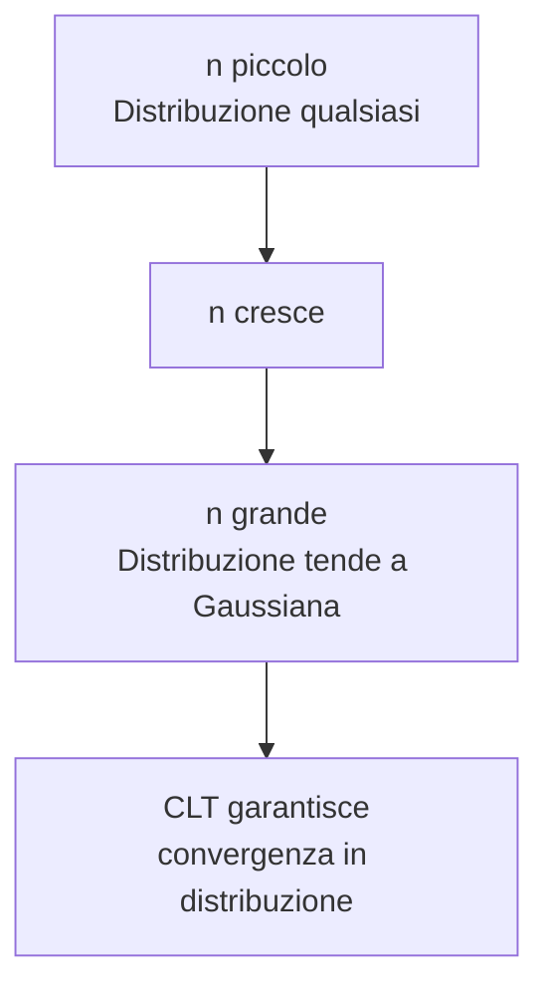
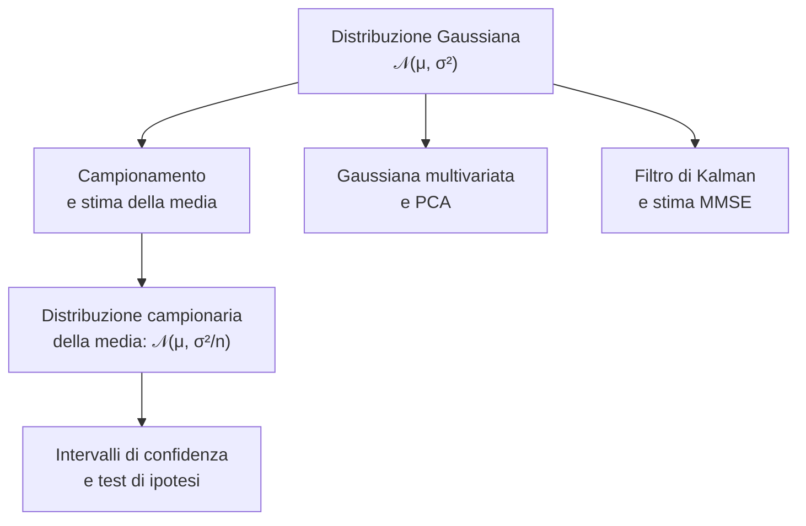

# MSI — Lezione 10: Distribuzione Gaussiana, Valore Atteso e Varianza nel Continuo

**Docente:** Prof. Marco Lops | **Corso:** Metodi Statistici per l'Informazione | **CFU:** 6

---

## Argomenti trattati

- Valore atteso e varianza per variabili aleatorie continue: definizioni e calcolo
- Distribuzione gaussiana (normale): definizione, parametri e forma
- Perché la gaussiana è la distribuzione più importante
- Funzione di ripartizione della gaussiana: funzione di errore e Q-function
- Gaussiana standardizzata e standardizzazione di una v.a. gaussiana
- Trasformazione lineare di una variabile gaussiana
- Calcolo di probabilità tramite la Q-function e le tavole
- Proprietà di simmetria della gaussiana standard

---

## 1. Valore Atteso nel Caso Continuo: Riepilogo e Proprietà

### Definizione

Nella scorsa lezione si è giustificato per quantizzazione il valore atteso di una variabile continua.

> [!abstract] Definizione: Valore atteso di una v.a. continua
> Sia $X$ una variabile aleatoria continua con PDF $f_X(x)$. Il **valore atteso** (o media statistica) di $X$ è:
> $$\mu_X = E[X] = \int_{-\infty}^{+\infty} x\, f_X(x)\, dx$$
> purché l'integrale converga assolutamente.

Il valore atteso è il **baricentro** della distribuzione: se si immagina la PDF come una lamina di densità uniforme posata sull'asse $x$, il baricentro è esattamente in $\mu_X$.

### Teorema fondamentale del calcolo della media (caso continuo)

> [!abstract] Teorema
> Per qualsiasi funzione $g$ sufficientemente regolare:
> $$E[g(X)] = \int_{-\infty}^{+\infty} g(x)\, f_X(x)\, dx$$
> Non è necessario calcolare la PDF di $Y = g(X)$: si lavora direttamente con $f_X$.

Questo teorema è l'analogo continuo del teorema fondamentale del caso discreto visto in Lezione 4.

### Proprietà della linearità

> [!tip] Linearità del valore atteso
> Per qualsiasi costanti $a, b$ e per qualsiasi v.a. continua $X$:
> $$E[aX + b] = a\,E[X] + b$$
> La linearità vale sempre, indipendentemente dalla distribuzione di $X$.

---

## 2. Varianza nel Caso Continuo

> [!abstract] Definizione: Varianza e Deviazione Standard (caso continuo)
> La **varianza** di $X$ è il momento centrale del secondo ordine:
> $$\sigma_X^2 = E\!\left[(X - \mu_X)^2\right] = \int_{-\infty}^{+\infty} (x - \mu_X)^2\, f_X(x)\, dx$$
> La **deviazione standard** è $\sigma_X = \sqrt{\sigma_X^2}$.

### Formula pratica

Applicando il teorema fondamentale con $g(x) = x^2$ e sviluppando il quadrato:

$$\sigma_X^2 = E[X^2] - \mu_X^2 = \int_{-\infty}^{+\infty} x^2\, f_X(x)\, dx - \left(E[X]\right)^2$$

> [!tip] Formula pratica per la varianza
> $$\sigma_X^2 = E[X^2] - (E[X])^2$$
> Calcolare separatamente $E[X^2]$ ed $(E[X])^2$ è spesso più comodo che calcolare direttamente $E[(X-\mu_X)^2]$.

### Proprietà della varianza rispetto a trasformazioni lineari

> [!note] Varianza e trasformazioni lineari
> Per $Y = aX + b$:
> $$\text{Var}(Y) = a^2\, \text{Var}(X)$$
> La traslazione $b$ non cambia la varianza; la scala $a$ la moltiplica per $a^2$.

**Conseguenza:** la deviazione standard si scala linearmente $\sigma_Y = |a|\, \sigma_X$.

### Riepilogo momenti per le distribuzioni continue già viste

| Distribuzione | Media $E[X]$ | Varianza $\text{Var}(X)$ |
|---|---|---|
| Uniforme $U(a,b)$ | $\dfrac{a+b}{2}$ | $\dfrac{(b-a)^2}{12}$ |
| Esponenziale $\text{Exp}(\lambda)$ | $\dfrac{1}{\lambda}$ | $\dfrac{1}{\lambda^2}$ |
| Laplace $\text{Lap}(\lambda)$ | $0$ | $\dfrac{2}{\lambda^2}$ |

---

## 3. Distribuzione Gaussiana (Normale)

### Definizione formale

> [!abstract] Definizione: Distribuzione Gaussiana $\mathcal{N}(\mu, \sigma^2)$
> Una variabile aleatoria $X$ segue una **distribuzione gaussiana** (o **normale**) di media $\mu$ e varianza $\sigma^2$ se la sua PDF è:
> $$\boxed{f_X(x) = \frac{1}{\sqrt{2\pi}\,\sigma}\, e^{-\dfrac{(x-\mu)^2}{2\sigma^2}}, \quad x \in \mathbb{R}}$$
> Si scrive $X \sim \mathcal{N}(\mu, \sigma^2)$.

I due parametri $\mu$ e $\sigma^2$ **identificano completamente** la distribuzione:
- $\mu$ = posizione del picco (la PDF è simmetrica attorno a $\mu$)
- $\sigma^2$ = "larghezza" della campana (più $\sigma$ è grande, più la PDF è bassa e larga)

> [!example] Verifica della normalizzazione
> Dimostrare che $\int_{-\infty}^{+\infty} f_X(x)\, dx = 1$ per la gaussiana richiede il celebre trucco di elevare al quadrato l'integrale e passare in coordinate polari:
> $$I = \int_{-\infty}^{+\infty} e^{-t^2/2}\, dt \implies I^2 = \int_0^{+\infty}\int_0^{2\pi} e^{-r^2/2} r\, d\theta\, dr = 2\pi$$
> da cui $I = \sqrt{2\pi}$. Il fattore $\frac{1}{\sqrt{2\pi}\sigma}$ è esattamente il reciproco di questo integrale.

### Intuizione

La curva gaussiana è la famosa "campana di Gauss". Ha forma simmetrica attorno alla media $\mu$ e decade rapidamente verso zero allontanandosi dal centro.

> [!tip] La regola del "68-95-99.7"
> Per qualsiasi gaussiana $\mathcal{N}(\mu, \sigma^2)$:
> - $P(\mu - \sigma \leq X \leq \mu + \sigma) \approx 68\%$
> - $P(\mu - 2\sigma \leq X \leq \mu + 2\sigma) \approx 95\%$
> - $P(\mu - 3\sigma \leq X \leq \mu + 3\sigma) \approx 99{,}7\%$
>
> Questa regola pratica permette di valutare "a occhio" la probabilità di essere entro 1, 2 o 3 deviazioni standard dalla media.

### Proprietà principali

| Proprietà | Formula / Valore |
|---|---|
| Media | $E[X] = \mu$ |
| Varianza | $\text{Var}(X) = \sigma^2$ |
| Moda (picco PDF) | $x = \mu$ |
| Simmetria | $f_X(\mu + t) = f_X(\mu - t)$ per ogni $t$ |
| Punti di flesso | $x = \mu \pm \sigma$ |
| Supporto | $\mathbb{R}$ (non limitato) |

> [!note] Osservazione sui punti di flesso
> Il punto di flesso è dove la concavità cambia segno. Per la gaussiana, si trova esattamente a $x = \mu \pm \sigma$: questo fornisce un metodo grafico per stimare $\sigma$ guardando la curva.

---

## 4. Perché la Gaussiana è la Distribuzione più Importante

### Teorema del Limite Centrale (CLT)

> [!abstract] Teorema del Limite Centrale (CLT)
> Siano $X_1, X_2, \ldots, X_n$ variabili aleatorie **i.i.d.** (indipendenti e identicamente distribuite) con media $\mu$ e varianza $\sigma^2 < \infty$. Allora la somma normalizzata:
> $$Z_n = \frac{\sum_{i=1}^n X_i - n\mu}{\sigma\sqrt{n}} \xrightarrow{d} \mathcal{N}(0,1) \quad \text{per } n \to \infty$$
> convergendo **in distribuzione** alla gaussiana standard, **qualunque sia la distribuzione originale delle $X_i$**.

Il CLT è il risultato che rende la gaussiana onnipresente: ogni fenomeno che è la somma di tanti piccoli contributi indipendenti è gaussiano. Questo include:
- Errori di misura (somma di tanti errori elementari)
- Rumore termico (agitazione di miliardi di elettroni)
- Campioni di una media empirica
- Segnali di molti mittenti sovrapposti

> [!warning] Il CLT non vale sempre
> Il CLT richiede varianza **finita**. Esistono distribuzioni (come la distribuzione di Cauchy) con varianza infinita per cui la somma normalizzata **non** converge a una gaussiana.

---

## 5. Gaussiana Standard e Standardizzazione

### Definizione della gaussiana standard

> [!abstract] Definizione: Gaussiana Standard $\mathcal{N}(0,1)$
> La **gaussiana standard** è la distribuzione $\mathcal{N}(0,1)$: media zero e varianza uno.
> $$f_Z(z) = \frac{1}{\sqrt{2\pi}}\, e^{-z^2/2}, \quad z \in \mathbb{R}$$
> Di solito si indica con la lettera $Z$ la variabile standard.

### Standardizzazione

> [!abstract] Teorema: Standardizzazione
> Se $X \sim \mathcal{N}(\mu, \sigma^2)$, allora la variabile centrata e normalizzata:
> $$Z = \frac{X - \mu}{\sigma} \sim \mathcal{N}(0,1)$$

**Dimostrazione intuitiva:** sottrarre $\mu$ traslata la distribuzione in zero (la media diventa 0); dividere per $\sigma$ scala la varianza a 1. Per la proprietà di chiusura per trasformazioni lineari (dimostrata più avanti), si ottiene ancora una gaussiana.

> [!example] Standardizzazione pratica
> $X \sim \mathcal{N}(10, 4)$ (media 10, varianza 4, deviazione standard 2).
> $$Z = \frac{X - 10}{2} \sim \mathcal{N}(0,1)$$
> L'evento $\{X > 13\} = \{Z > (13-10)/2\} = \{Z > 1{,}5\}$.

---

## 6. Funzione di Ripartizione della Gaussiana: $\Phi$ e $Q$

### Il problema: la CDF non ha forma chiusa

A differenza delle distribuzioni esponenziale o uniforme, la CDF della gaussiana **non si esprime tramite funzioni elementari**:

$$F_Z(z) = \int_{-\infty}^{z} \frac{1}{\sqrt{2\pi}} e^{-t^2/2}\, dt$$

Questo integrale non ha primitiva analitica. Si usano quindi due funzioni speciali tabulate.

### Funzione $\Phi$ (CDF della gaussiana standard)

> [!abstract] Definizione: Funzione $\Phi$
> La **funzione di distribuzione cumulativa** della gaussiana standard è:
> $$\Phi(z) = P(Z \leq z) = \int_{-\infty}^{z} \frac{1}{\sqrt{2\pi}} e^{-t^2/2}\, dt$$

### Q-function (coda destra)

> [!abstract] Definizione: Q-function
> La **Q-function** è la probabilità della coda destra della gaussiana standard:
> $$Q(x) = P(Z > x) = \int_{x}^{+\infty} \frac{1}{\sqrt{2\pi}} e^{-t^2/2}\, dt = 1 - \Phi(x)$$

**Relazione tra $\Phi$ e $Q$:**

$$\Phi(z) = 1 - Q(z) \qquad Q(x) = 1 - \Phi(x)$$

> [!tip] Proprietà di simmetria della Q-function
> Poiché la gaussiana standard è simmetrica attorno a zero:
> $$Q(-x) = 1 - Q(x) \qquad \Phi(-z) = 1 - \Phi(z) = Q(z)$$
> Questa proprietà è **fondamentale** per calcolare probabilità sulle code sinistre senza bisogno di tavole separate.

| Probabilità | Formula con $Q$ |
|---|---|
| $P(Z > x)$ | $Q(x)$ |
| $P(Z < -x)$ | $Q(x)$ |
| $P(Z < x)$ | $1 - Q(x)$ |
| $P(Z > -x)$ | $1 - Q(x)$ |
| $P(\lvert Z \rvert > x)$, $x > 0$ | $2Q(x)$ |
| $P(-a \leq Z \leq a)$ | $1 - 2Q(a)$ |

### Calcolo di probabilità per una gaussiana generica

> [!note] Ricetta generale
> Per calcolare $P(a \leq X \leq b)$ con $X \sim \mathcal{N}(\mu, \sigma^2)$:
> 1. Standardizzare: $Z = (X-\mu)/\sigma$
> 2. Scrivere $P\!\left(\dfrac{a-\mu}{\sigma} \leq Z \leq \dfrac{b-\mu}{\sigma}\right)$
> 3. Esprimere come differenza di Q-function o $\Phi$

**Formula generale:**

$$P(a \leq X \leq b) = \Phi\!\left(\frac{b-\mu}{\sigma}\right) - \Phi\!\left(\frac{a-\mu}{\sigma}\right) = Q\!\left(\frac{a-\mu}{\sigma}\right) - Q\!\left(\frac{b-\mu}{\sigma}\right)$$

---

## 7. Esempio Svolto: Calcolo di Probabilità con la Gaussiana

### Esempio 1: rumore gaussiano in un canale di comunicazione

**Setup:** il segnale ricevuto è $Y = s + N$, dove $s \in \{-1, +1\}$ è il bit trasmesso e $N \sim \mathcal{N}(0, \sigma^2)$ è il rumore. La soglia di decisione è a 0: se $Y > 0$ si decide $+1$, altrimenti $-1$. Calcolare la probabilità di errore quando è stato trasmesso $s = +1$.

**Soluzione:**

L'errore avviene quando $Y \leq 0$, cioè $1 + N \leq 0$, cioè $N \leq -1$.

$$P_e = P(N \leq -1) = P\!\left(Z \leq \frac{-1}{\sigma}\right) = \Phi\!\left(-\frac{1}{\sigma}\right) = Q\!\left(\frac{1}{\sigma}\right)$$

dove si è usata la proprietà di simmetria $\Phi(-x) = Q(x)$.

**Interpretazione:** la probabilità di errore è $Q(1/\sigma)$. Poiché $Q$ è decrescente, aumentare il rapporto segnale-rumore $1/\sigma$ riduce l'errore.

> [!example] Valori tipici
> | $1/\sigma$ | $Q(1/\sigma)$ |
> |---|---|
> | 1 | $\approx 15{,}9\%$ |
> | 2 | $\approx 2{,}3\%$ |
> | 3 | $\approx 0{,}13\%$ |
> | 4 | $\approx 3{,}2 \times 10^{-5}$ |
>
> La Q-function decade molto rapidamente: aumentare il rapporto segnale-rumore di pochi dB riduce l'errore di ordini di grandezza.

---

### Esempio 2: disuguaglianza di Chebyshev vs. gaussiana

**Setup:** $X \sim \mathcal{N}(\mu, \sigma^2)$. Stimare $P(|X - \mu| > 2\sigma)$.

**Con la Q-function (esatta):**

$$P(|X - \mu| > 2\sigma) = 2\,Q(2) \approx 2 \times 0{,}0228 = 4{,}56\%$$

**Con Chebyshev (solo varianza nota):**

$$P(|X - \mu| > 2\sigma) \leq \frac{1}{4} = 25\%$$

> [!warning] Chebyshev è molto conservativa
> La disuguaglianza di Chebyshev vale per **qualunque** distribuzione con varianza finita: per questo è molto larga. Quando si sa che $X$ è gaussiana, la Q-function dà un risultato esatto (e molto più piccolo).

---

## 8. Trasformazione Lineare di una Gaussiana

> [!abstract] Teorema: chiusura per trasformazioni lineari
> Se $X \sim \mathcal{N}(\mu, \sigma^2)$ e $Y = aX + b$ (con $a \neq 0$), allora:
> $$Y \sim \mathcal{N}(a\mu + b,\; a^2\sigma^2)$$
> La classe delle distribuzioni gaussiane è **chiusa** rispetto alle trasformazioni lineari.

**Dimostrazione (via trasformazione di densità):**

La CDF di $Y$ è:

$$F_Y(y) = P(Y \leq y) = P(aX + b \leq y) = P\!\left(X \leq \frac{y - b}{a}\right) = F_X\!\left(\frac{y-b}{a}\right) \quad (a > 0)$$

Derivando rispetto a $y$:

$$f_Y(y) = f_X\!\left(\frac{y-b}{a}\right) \cdot \frac{1}{|a|} = \frac{1}{\sqrt{2\pi}\,|a|\sigma}\, e^{-\dfrac{\left(\frac{y-b}{a} - \mu\right)^2}{2\sigma^2}}$$

Riconoscendo la forma gaussiana con media $a\mu + b$ e deviazione standard $|a|\sigma$: $Y \sim \mathcal{N}(a\mu+b, a^2\sigma^2)$.

> [!example] Applicazione: cambio di unità di misura
> La temperatura $T$ in Fahrenheit è $T_F = 1{,}8\, T_C + 32$. Se $T_C \sim \mathcal{N}(20, 25)$ (gradi Celsius), allora:
> $$T_F \sim \mathcal{N}(1{,}8 \cdot 20 + 32,\; 1{,}8^2 \cdot 25) = \mathcal{N}(68,\; 81)$$

---

## 9. Osservazioni importanti e casi limite

> [!warning] La gaussiana assegna probabilità non nulla a tutto $\mathbb{R}$
> Formalmente, $f_X(x) > 0$ per ogni $x \in \mathbb{R}$: anche valori "impossibili" fisicamente (temperatura assoluta negativa, lunghezza negativa) hanno probabilità non nulla. In pratica la probabilità delle code estreme è trascurabile, ma in contesti critici (ingegneria della sicurezza, finanza) le code contano.

> [!info] Gaussiana vs. Laplace: confronto delle code
> | Distribuzione | PDF nel punto $x$ lontano dalla media | "Heaviness of tails" |
> |---|---|---|
> | Gaussiana $\mathcal{N}(0,1)$ | $\propto e^{-x^2/2}$ (decade come $e^{-x^2}$) | Code leggere |
> | Laplace $\text{Lap}(\lambda)$ | $\propto e^{-\lambda|x|}$ (decade come $e^{-|x|}$) | Code più pesanti |
>
> La Laplace ha code più pesanti (heavy-tailed): eventi estremi sono relativamente più probabili. Questo la rende preferibile alla gaussiana in modelli di rumore impulsivo (es. interferenza radio, outlier nei dati).

> [!warning] Incorrelazione $\Leftrightarrow$ Indipendenza solo per le gaussiane
> In generale, covarianza zero non implica indipendenza. **Per le variabili gaussiane congiuntamente distribuite** (distribuzione gaussiana multivariata), incorrelazione e indipendenza sono equivalenti. Questo è un caso speciale che non si generalizza.

---

## 10. Collegamento al concetto successivo

La distribuzione gaussiana è il punto di partenza naturale per la **statistica inferenziale**:

Nella prossima lezione si estenderà la gaussiana al caso **multivariato** e si introdurrà il concetto di **distribuzione congiunta gaussiana**, base dell'analisi multivariata e del machine learning.

---

> [!summary] Punti chiave della lezione
> - Il valore atteso continuo $E[X] = \int x\, f_X(x)\, dx$ e la varianza $\sigma^2 = E[X^2] - (E[X])^2$ si calcolano con il teorema fondamentale applicando $g(x) = x$ e $g(x) = x^2$.
> - La gaussiana $\mathcal{N}(\mu,\sigma^2)$ è completamente caratterizzata da media $\mu$ e varianza $\sigma^2$; la sua PDF è la campana di Gauss simmetrica attorno a $\mu$ con punti di flesso in $\mu \pm \sigma$.
> - Il CLT garantisce che la somma di variabili i.i.d. (con varianza finita) converge in distribuzione a una gaussiana: questo spiega la sua onnipresenza.
> - La CDF gaussiana si esprime tramite la Q-function: $Q(x) = P(Z > x)$, con $Q(-x) = 1 - Q(x)$.
> - Per calcolare probabilità gaussiane: standardizzare con $Z = (X-\mu)/\sigma$, poi usare le tavole della Q-function.
> - La classe delle gaussiane è chiusa per trasformazioni lineari: $aX + b \sim \mathcal{N}(a\mu+b, a^2\sigma^2)$.
> - Per le gaussiane (ma non in generale): incorrelazione $\Leftrightarrow$ indipendenza.

## Prossimi argomenti

- [ ] Distribuzione gaussiana multivariata: vettore medio e matrice di covarianza
- [ ] Stima di parametri: massima verosimiglianza (MLE)
- [ ] Teorema di Bayes nel continuo: verosimiglianza gaussiana
- [ ] Introduzione al test di ipotesi

---

#MSI #gaussiana #distribuzione-normale #valore-atteso-continuo #varianza-continua #Q-function #standardizzazione #CLT #trasformazione-lineare
