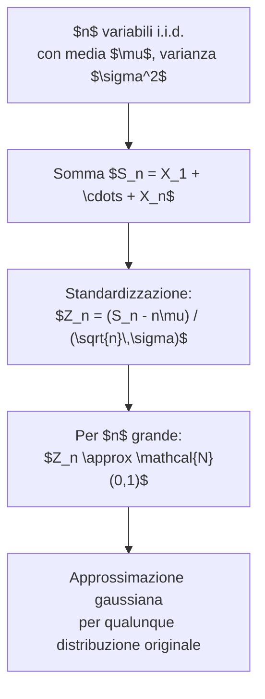

# MSI — Lezione 10: Distribuzione Gaussiana e sue Proprietà

**Docente:** Prof. Marco Lops | **Corso:** Metodi Statistici per l'Informazione | **CFU:** 6

---

## Argomenti trattati

- Definizione e motivazione della distribuzione gaussiana
- Parametri $\mu$ e $\sigma^2$: significato geometrico
- Gaussiana standard $\mathcal{N}(0,1)$ e tecnica di standardizzazione
- CDF della gaussiana: funzione $\Phi$ e Q-function
- Proprietà fondamentali (simmetria, momenti, forma della PDF)
- Trasformazione lineare di una variabile gaussiana
- Somma di gaussiane indipendenti: chiusura per convoluzione
- Collegamento al Teorema del Limite Centrale (CLT)
- Applicazioni: canale gaussiano, rumore termico

---

## 1. Distribuzione Gaussiana (Normale)

### Definizione

> [!abstract] Definizione: Variabile gaussiana $\mathcal{N}(\mu, \sigma^2)$
> Una variabile aleatoria continua $X$ segue una **distribuzione gaussiana** (o normale) di media $\mu \in \mathbb{R}$ e varianza $\sigma^2 > 0$ se la sua densità di probabilità è:
> $$\boxed{f_X(x) = \frac{1}{\sqrt{2\pi\sigma^2}}\, \exp\!\left(-\frac{(x-\mu)^2}{2\sigma^2}\right), \qquad x \in \mathbb{R}}$$
> Si scrive $X \sim \mathcal{N}(\mu, \sigma^2)$.

### Intuizione geometrica

La gaussiana ha una forma a **campana** (curva di Gauss): è simmetrica attorno a $\mu$, raggiunge il suo massimo in $x = \mu$ e decresce esponenzialmente nelle code. I due parametri controllano direttamente la forma:

| Parametro | Significato geometrico | Effetto sulla PDF |
|---|---|---|
| $\mu$ (media) | Centro della campana | Trasla la curva a destra/sinistra |
| $\sigma^2$ (varianza) | Larghezza della campana | $\sigma$ grande → curva bassa e larga; $\sigma$ piccolo → curva alta e stretta |
| $\sigma$ (dev. standard) | Distanza dal centro ai punti di flesso | I punti di flesso si trovano in $\mu \pm \sigma$ |

> [!tip] Punti di flesso
> La PDF gaussiana ha i suoi punti di flesso (dove la concavità cambia segno) esattamente in $x = \mu \pm \sigma$. Questo fornisce un modo grafico per stimare $\sigma$ guardando la curva.

### Verifica della normalizzazione

Per verificare che $\int_{-\infty}^{+\infty} f_X(x)\,dx = 1$ si usa il noto **integrale gaussiano**:

$$\int_{-\infty}^{+\infty} e^{-t^2}\,dt = \sqrt{\pi}$$

Con la sostituzione $t = \frac{x - \mu}{\sqrt{2}\,\sigma}$:

$$\int_{-\infty}^{+\infty} \frac{1}{\sqrt{2\pi\sigma^2}} e^{-\frac{(x-\mu)^2}{2\sigma^2}}\,dx = \frac{1}{\sqrt{\pi}} \int_{-\infty}^{+\infty} e^{-t^2}\,dt = \frac{\sqrt{\pi}}{\sqrt{\pi}} = 1 \checkmark$$

> [!warning] L'integrale gaussiano non ha primitiva elementare
> Non esiste una funzione elementare $F(x)$ tale che $F'(x) = e^{-x^2}$. La CDF della gaussiana non si può esprimere in forma chiusa con funzioni elementari: si definisce la funzione speciale $\Phi(x)$ (o la Q-function) proprio per questo motivo.

---

## 2. Gaussiana Standard $\mathcal{N}(0,1)$

### Definizione

> [!abstract] Definizione: Gaussiana standard
> La variabile $Z \sim \mathcal{N}(0,1)$ ha media $\mu = 0$ e varianza $\sigma^2 = 1$. La sua PDF è:
> $$\varphi(z) = \frac{1}{\sqrt{2\pi}}\, e^{-z^2/2}$$

### Standardizzazione

Qualunque gaussiana $X \sim \mathcal{N}(\mu, \sigma^2)$ si può ricondurre alla standard con la trasformazione:

$$Z = \frac{X - \mu}{\sigma} \sim \mathcal{N}(0,1)$$

> [!tip] Tecnica pratica: sottrarre la media e dividere per la deviazione standard
> Tutta la teoria delle tabelle gaussiane (tavole di $\Phi$) si basa su questa standardizzazione. Basta tabulare la CDF della gaussiana standard e poi ricondurre qualunque gaussiana ad essa.

---

## 3. CDF della Gaussiana: Funzione $\Phi$ e Q-function

### Funzione $\Phi$

> [!abstract] Definizione: Funzione $\Phi$
> La **CDF della gaussiana standard** è:
> $$\Phi(z) = P(Z \leq z) = \int_{-\infty}^{z} \frac{1}{\sqrt{2\pi}}\, e^{-t^2/2}\,dt$$

Non ha forma chiusa, ma viene tabulata o calcolata numericamente.

**Per una generica $X \sim \mathcal{N}(\mu, \sigma^2)$**, usando la standardizzazione:

$$P(X \leq x) = P\!\left(Z \leq \frac{x-\mu}{\sigma}\right) = \Phi\!\left(\frac{x-\mu}{\sigma}\right)$$

> [!example] Calcolo di probabilità con $\Phi$
> Sia $X \sim \mathcal{N}(3, 4)$ (media 3, varianza 4, quindi $\sigma = 2$). Calcolare $P(1 \leq X \leq 7)$.
>
> $$P(1 \leq X \leq 7) = P\!\left(\frac{1-3}{2} \leq Z \leq \frac{7-3}{2}\right) = P(-1 \leq Z \leq 2) = \Phi(2) - \Phi(-1)$$
>
> Dalla tavola: $\Phi(2) \approx 0{,}9772$, $\Phi(-1) \approx 0{,}1587$.
>
> $$P(1 \leq X \leq 7) \approx 0{,}9772 - 0{,}1587 = 0{,}8185 \approx 82\%$$

### Proprietà di simmetria di $\Phi$

Poiché $\varphi(z) = \varphi(-z)$ (la PDF è pari):

$$\Phi(-z) = 1 - \Phi(z)$$

Questo permette di usare la tavola (che spesso riporta solo i valori per $z \geq 0$) anche per argomenti negativi.

> [!tip] Dalla simmetria alla regola pratica
> $P(Z \geq z) = 1 - \Phi(z) = \Phi(-z)$. Quindi la probabilità di stare "a destra" di $z$ coincide con il valore di $\Phi$ calcolato in $-z$.

### Q-function

In ingegneria delle telecomunicazioni si preferisce spesso la **Q-function**, che misura la probabilità della coda destra:

> [!abstract] Definizione: Q-function
> $$Q(z) = P(Z > z) = 1 - \Phi(z) = \int_z^{+\infty} \frac{1}{\sqrt{2\pi}}\, e^{-t^2/2}\,dt$$

La relazione tra le due funzioni è immediata:

$$Q(z) = 1 - \Phi(z) \qquad \Phi(z) = 1 - Q(z) \qquad Q(-z) = 1 - Q(z)$$

> [!example] Q-function in un sistema di comunicazione
> In un canale gaussiano con rapporto segnale/rumore $\text{SNR} = E_b/N_0$, la probabilità di errore bit di una modulazione BPSK è:
> $$P_e = Q\!\left(\sqrt{2\,E_b/N_0}\right)$$
> Per $E_b/N_0 = 4$ dB $\approx 2{,}51$: $P_e = Q(\sqrt{5{,}02}) = Q(2{,}24) \approx 0{,}013$, cioè circa 1,3% di probabilità di errore.

---

## 4. Proprietà Fondamentali della Gaussiana

### Momenti

Per $X \sim \mathcal{N}(\mu, \sigma^2)$:

$$E[X] = \mu \qquad \text{Var}(X) = \sigma^2 \qquad E[(X-\mu)^3] = 0 \quad \text{(asimmetria nulla)}$$

Il momento di ordine 4 (curtosi) vale $E[(X-\mu)^4] = 3\sigma^4$, ovvero la **curtosi standardizzata** è 3 (valore di riferimento per confrontare distribuzioni).

### Simmetria

La distribuzione è simmetrica attorno a $\mu$: $f_X(\mu + t) = f_X(\mu - t)$ per ogni $t$. Ne consegue che **media, mediana e moda coincidono** tutte con $\mu$.

### Regola $1\sigma$-$2\sigma$-$3\sigma$

Queste tre soglie sono fondamentali per la valutazione rapida delle probabilità:

| Intervallo | Probabilità |
|---|---|
| $\mu \pm \sigma$ | $\approx 68{,}3\%$ |
| $\mu \pm 2\sigma$ | $\approx 95{,}4\%$ |
| $\mu \pm 3\sigma$ | $\approx 99{,}7\%$ |

> [!tip] Regola pratica "3 sigma"
> In quasi tutti i contesti applicativi, un evento che cade a più di $3\sigma$ dalla media è considerato raro: ha solo 0,3% di probabilità. Questa regola è usata nel controllo qualità (Six Sigma), nel rilevamento di anomalie e nella definizione di soglie di allarme.

---

## 5. Trasformazione Lineare di una Variabile Gaussiana

> [!abstract] Proprietà: chiusura per trasformazioni lineari
> Se $X \sim \mathcal{N}(\mu, \sigma^2)$ e $Y = aX + b$ con $a \neq 0$, allora:
> $$Y \sim \mathcal{N}(a\mu + b,\; a^2\sigma^2)$$

### Dimostrazione tramite CDF

Per $a > 0$:

$$F_Y(y) = P(Y \leq y) = P(aX + b \leq y) = P\!\left(X \leq \frac{y-b}{a}\right) = \Phi\!\left(\frac{\frac{y-b}{a} - \mu}{\sigma}\right) = \Phi\!\left(\frac{y - (a\mu+b)}{a\sigma}\right)$$

Questa è la CDF di una $\mathcal{N}(a\mu+b,\; a^2\sigma^2)$. Per $a < 0$ il ragionamento è analogo (si inverte il segno della disuguaglianza).

> [!example] Standardizzazione come caso particolare
> $Z = \frac{X - \mu}{\sigma} = \frac{1}{\sigma} X - \frac{\mu}{\sigma}$ è una trasformazione lineare con $a = 1/\sigma$ e $b = -\mu/\sigma$. Applicando la proprietà:
> $$Z \sim \mathcal{N}\!\left(\frac{1}{\sigma}\cdot\mu - \frac{\mu}{\sigma},\;\frac{1}{\sigma^2}\cdot\sigma^2\right) = \mathcal{N}(0, 1) \checkmark$$

> [!warning] La gaussiana è l'unica distribuzione che resta gaussiana per trasformazioni lineari
> Questa proprietà di chiusura non vale in generale per altre distribuzioni. Per esempio, una trasformazione lineare di una variabile esponenziale non è esponenziale (a meno di riscalare il parametro). La gaussiana è speciale in questo senso.

---

## 6. Somma di Gaussiane Indipendenti

> [!abstract] Proprietà: chiusura per convoluzione
> Siano $X_1 \sim \mathcal{N}(\mu_1, \sigma_1^2)$ e $X_2 \sim \mathcal{N}(\mu_2, \sigma_2^2)$ **indipendenti**. Allora:
> $$X_1 + X_2 \sim \mathcal{N}(\mu_1 + \mu_2,\; \sigma_1^2 + \sigma_2^2)$$

### Dimostrazione tramite funzione generatrice dei momenti (MGF)

La MGF della gaussiana $\mathcal{N}(\mu, \sigma^2)$ è:

$$M_X(t) = E[e^{tX}] = e^{\mu t + \frac{1}{2}\sigma^2 t^2}$$

Per $X_1$ e $X_2$ indipendenti, la MGF della somma è il prodotto delle MGF:

$$M_{X_1+X_2}(t) = M_{X_1}(t) \cdot M_{X_2}(t) = e^{\mu_1 t + \frac{1}{2}\sigma_1^2 t^2} \cdot e^{\mu_2 t + \frac{1}{2}\sigma_2^2 t^2} = e^{(\mu_1+\mu_2)t + \frac{1}{2}(\sigma_1^2+\sigma_2^2)t^2}$$

Questa è la MGF di una $\mathcal{N}(\mu_1+\mu_2,\; \sigma_1^2+\sigma_2^2)$.

> [!note] Perché le varianze si sommano, non le deviazioni standard
> Le varianze si sommano perché la varianza è una misura del "quadrato" della dispersione. Se aggiunge due sorgenti di incertezza indipendenti, l'incertezza totale cresce come $\sqrt{\sigma_1^2 + \sigma_2^2}$, non come $\sigma_1 + \sigma_2$. Analogia fisica: il rumore di due resistori indipendenti in serie ha potenza pari alla somma delle potenze individuali.

> [!example] Somma di $n$ gaussiane i.i.d.
> Siano $X_1, \ldots, X_n \sim \mathcal{N}(\mu, \sigma^2)$ i.i.d. Allora:
> $$S_n = \sum_{i=1}^{n} X_i \sim \mathcal{N}(n\mu,\; n\sigma^2)$$
> La media campionaria $\bar{X}_n = S_n/n$ è:
> $$\bar{X}_n \sim \mathcal{N}\!\left(\mu,\; \frac{\sigma^2}{n}\right)$$
> La varianza della media campionaria **decresce** di un fattore $n$: mediando $n$ osservazioni, si riduce l'incertezza sulla stima della media di un fattore $\sqrt{n}$.

---

## 7. Collegamento al Teorema del Limite Centrale (CLT)

Il CLT (già introdotto nella lezione precedente) afferma che la somma standardizzata di variabili i.i.d. con media e varianza finite converge a una $\mathcal{N}(0,1)$:

$$Z_n = \frac{\sum_{i=1}^{n} X_i - n\mu}{\sqrt{n}\,\sigma} \xrightarrow{d} \mathcal{N}(0,1)$$

> [!abstract] Il CLT spiega l'ubiquità della gaussiana
> In natura, molti fenomeni osservati sono il risultato di **molte piccole perturbazioni indipendenti** (rumore elettronico, errori di misura, variazioni biologiche). Il CLT garantisce che la loro somma sia approssimativamente gaussiana, indipendentemente dalla distribuzione dei singoli contributi.

> [!warning] Limiti del CLT
> - Il CLT richiede **indipendenza** tra le variabili (o almeno dipendenza debole).
> - Converge lentamente se la distribuzione originale ha code pesanti o alta asimmetria.
> - La convergenza è **in distribuzione**: non dice nulla sui valori estremi delle code (che spesso sono proprio quelli più importanti in ingegneria e finanza).

### Approssimazione di una binomiale con una gaussiana

Un'applicazione classica del CLT: per $n$ grande e $p$ non troppo vicino a 0 o 1, la $\text{Binomiale}(n,p)$ si approssima con:

$$X \sim \text{Bin}(n, p) \approx \mathcal{N}(np,\; np(1-p))$$

> [!example] Test di ipotesi su una moneta
> Si lancia una moneta 100 volte e si ottengono 60 teste. La moneta è onesta?
> 
> Sotto l'ipotesi di moneta onesta ($p = 0{,}5$): $X \sim \text{Bin}(100, 0{,}5) \approx \mathcal{N}(50, 25)$.
> $$P(X \geq 60) = P\!\left(Z \geq \frac{60-50}{5}\right) = P(Z \geq 2) = Q(2) \approx 0{,}023 = 2{,}3\%$$
> 
> Ottenere 60 o più teste ha solo il 2,3% di probabilità se la moneta è onesta. Questo è un indizio statisticamente rilevante (al livello del 5%) che la moneta potrebbe non essere onesta.

---

## 8. Applicazioni Ingegneristiche

### Canale gaussiano additivo (AWGN)

Il modello più importante nelle telecomunicazioni è il **canale con rumore gaussiano bianco additivo** (AWGN):

$$Y = X + N, \qquad N \sim \mathcal{N}(0, \sigma^2)$$

dove $X$ è il segnale trasmesso e $N$ è il rumore di canale. Dato $X = x$ fissato, $Y \sim \mathcal{N}(x, \sigma^2)$: il segnale ricevuto è una gaussiana centrata sul valore trasmesso.

> [!note] Perché si usa la gaussiana per il rumore
> Il rumore termico (agitazione termica degli elettroni) è la somma di moltissimi contributi microscopici indipendenti. Per il CLT, la loro somma è gaussiana. Il **teorema di Nyquist** lega la potenza del rumore termico alla temperatura e alla banda del sistema: $P_N = kTB$, con $k$ costante di Boltzmann, $T$ temperatura assoluta, $B$ banda.

### Regola di decisione ottima

Per il canale AWGN con $X \in \{-A, +A\}$ (modulazione BPSK), il rivelatore ottimo confronta $Y$ con la soglia 0:

$$\hat{X} = \begin{cases} +A & \text{se } Y \geq 0 \\ -A & \text{se } Y < 0 \end{cases}$$

La probabilità di errore è:

$$P_e = P(N < -A) = Q\!\left(\frac{A}{\sigma}\right) = Q\!\left(\sqrt{\text{SNR}}\right)$$

dove $\text{SNR} = A^2/\sigma^2$ è il rapporto segnale/rumore.

| SNR (lineare) | SNR (dB) | $P_e$ approssimata |
|---|---|---|
| 1 (0 dB) | 0 dB | $Q(1) \approx 15{,}9\%$ |
| 4 (6 dB) | 6 dB | $Q(2) \approx 2{,}3\%$ |
| 10 (10 dB) | 10 dB | $Q(3{,}16) \approx 0{,}08\%$ |
| 100 (20 dB) | 20 dB | $Q(10) \approx 10^{-23}$ |

> [!info] Interpretazione del SNR
> Ogni 6 dB di aumento di SNR (cioè, raddoppiare l'ampiezza del segnale) riduce drammaticamente la probabilità di errore. La curva è molto ripida: passare da $P_e = 15\%$ a $P_e = 2\%$ richiede solo 6 dB in più. Questa non-linearità è il motivo per cui progettare sistemi ad alto SNR è spesso efficace.

---

## 9. Riepilogo delle Distribuzioni Continue Studiate

| Distribuzione | PDF | Media | Varianza | CDF |
|---|---|---|---|---|
| Uniforme $U(a,b)$ | $\frac{1}{b-a}$ su $[a,b]$ | $\frac{a+b}{2}$ | $\frac{(b-a)^2}{12}$ | Lineare su $[a,b]$ |
| Esponenziale $\text{Exp}(\lambda)$ | $\lambda e^{-\lambda x}$, $x \geq 0$ | $\frac{1}{\lambda}$ | $\frac{1}{\lambda^2}$ | $1 - e^{-\lambda x}$ |
| Laplace $\text{Lap}(\lambda)$ | $\frac{\lambda}{2} e^{-\lambda\|x\|}$ | $0$ | $\frac{2}{\lambda^2}$ | Sigmoidale |
| Gaussiana $\mathcal{N}(\mu,\sigma^2)$ | $\frac{1}{\sqrt{2\pi\sigma^2}} e^{-\frac{(x-\mu)^2}{2\sigma^2}}$ | $\mu$ | $\sigma^2$ | $\Phi\!\left(\frac{x-\mu}{\sigma}\right)$ |

---

> [!summary] Punti chiave della lezione
> - La gaussiana $\mathcal{N}(\mu, \sigma^2)$ è caratterizzata completamente da media e varianza; ha forma a campana con punti di flesso in $\mu \pm \sigma$.
> - La CDF non ha forma chiusa: si usa la funzione tabulata $\Phi$ (o la Q-function $Q = 1 - \Phi$) dopo aver standardizzato con $Z = (X-\mu)/\sigma$.
> - La simmetria di $\Phi$ dà: $\Phi(-z) = 1 - \Phi(z)$, utile per evitare tavole con valori negativi.
> - La gaussiana è **chiusa** per trasformazioni lineari: $aX + b \sim \mathcal{N}(a\mu+b, a^2\sigma^2)$.
> - La somma di gaussiane indipendenti è gaussiana: le medie e le **varianze** si sommano.
> - Il CLT spiega perché la gaussiana è ovunque: qualunque somma di molti contributi i.i.d. tende a una gaussiana.
> - Nel canale AWGN, la probabilità di errore BPSK è $Q(\sqrt{\text{SNR}})$; aumentare il SNR riduce drasticamente $P_e$.

## Prossimi argomenti

- [ ] Vettori aleatori gaussiani congiunti e matrice di covarianza
- [ ] Densità gaussiana bivariata e correlazione geometrica
- [ ] Stima di parametri: stimatori non polarizzati, consistenti, efficienti
- [ ] Introduzione alla statistica inferenziale: stima ML e MAP

---

#MSI #gaussiana #distribuzione-normale #Q-function #CDF #trasformazione-lineare #somma-gaussiane #CLT #rumore #AWGN #telecomunicazioni
