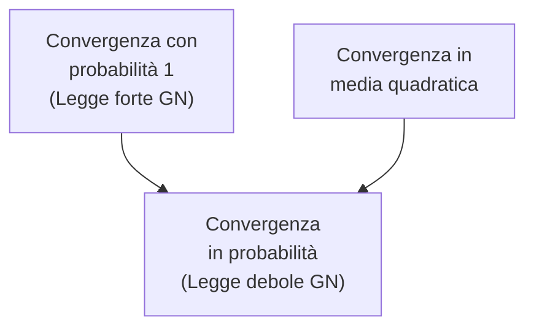

# MSI — Lezione 6: Varianza, Disuguaglianza di Chebyshev e Convergenza della Frequenza

**Docente:** Prof. Marco Lops | **Corso:** Metodi Statistici per l'Informazione | **CFU:** 6 | **Data:** 19/03/2026

---

## Argomenti trattati

- Varianza come misura dell'aleatorietà: interpretazione fisica e geometrica
- Disuguaglianza di Markov e disuguaglianza di Chebyshev
- Relazione varianza–media: quando la media è un buon indicatore
- Proprietà algebriche di media e varianza (linearità, covarianza per scala, invarianza per traslazione)
- Giustificazione matematica della definizione frequentistica di probabilità
- Convergenza in media quadratica e in probabilità della frequenza di successo
- Legge dei grandi numeri: versione forte e debole
- Esercizio: strategia di gioco con puntata costante (geometrica) e martingala
- Annuncio: prossima lezione su coppie di variabili aleatorie

---

## Varianza come Misura dell'Aleatorietà

### Interpretazione

La media statistica $\mu_X$ è il baricentro della distribuzione. La **varianza** $\sigma_X^2$ misura quanto i valori di $X$ si discostano mediamente da quel baricentro.

> [!abstract] Definizione: Varianza e Deviazione Standard
> Data una variabile aleatoria $X$ con media $\mu_X$, si definisce:
> $$\sigma_X^2 = E\!\left[(X - \mu_X)^2\right] = \sum_{x \in \mathcal{X}} (x - \mu_X)^2 \cdot p_X(x)$$
> La **deviazione standard** è $\sigma_X = \sqrt{\sigma_X^2}$. Per costruzione, $\sigma_X^2 \geq 0$.

La coppia $(\mu_X, \sigma_X)$ caratterizza globalmente una variabile aleatoria:

- Se $\sigma_X \ll \mu_X$: la variabile è **poco aleatoria**, concentrata intorno alla media. La media è un buon indicatore.
- Se $\sigma_X$ è comparabile o superiore a $\mu_X$: la variabile è **molto aleatoria**. Osservare valori molto lontani dalla media è probabile. La media da sola non descrive bene il comportamento tipico.

> [!example] Esempio con deviazione standard 1€ vs 10€
> Se il professore ha mediamente 100€ in tasca:
> - Con $\sigma_X = 1€$: con probabilità 99% trovo tra 90 e 110€. La media è quasi deterministica.
> - Con $\sigma_X = 10€$: con probabilità 90% trovo tra 90 e 110€. Alta incertezza.
>
> La quantità rilevante è il **rapporto** $\mu_X / \sigma_X$ (inverso del coefficiente di variazione): più è grande, meno è aleatoria la variabile.

---

## Disuguaglianza di Chebyshev

### Disuguaglianza di Markov (prerequisito)

Per ogni variabile aleatoria **non negativa** $Y$ e ogni $\delta > 0$:

$$P(Y \geq \delta) \leq \frac{E[Y]}{\delta}$$

### Disuguaglianza di Chebyshev

Applicando la disuguaglianza di Markov alla variabile non negativa $Y = (X - \mu_X)^2$ con $\delta = (k\sigma_X)^2$:

> [!abstract] Disuguaglianza di Chebyshev
> Per ogni variabile aleatoria $X$ di media $\mu_X$ e deviazione standard $\sigma_X$, e per ogni $k > 0$:
> $$P\!\left(|X - \mu_X| \geq k\sigma_X\right) \leq \frac{1}{k^2}$$
> Equivalentemente:
> $$P\!\left(|X - \mu_X| < k\sigma_X\right) \geq 1 - \frac{1}{k^2}$$

**Interpretazione:** la probabilità di trovare $X$ a una distanza superiore a $k$ deviazioni standard dalla media è al più $1/k^2$, indipendentemente dalla forma specifica della distribuzione.

> [!example] Applicazione numerica
> Con $k = 10$: $P(|X - \mu_X| \geq 10\sigma_X) \leq 1\%$. Qualunque sia la distribuzione di $X$, osservare un valore a più di 10 deviazioni standard dalla media ha probabilità inferiore all'1%.

---

## Proprietà Algebriche di Media e Varianza

### Linearità della media

Per costanti reali $a$ e $b$:

$$E[aX + b] = a \cdot E[X] + b$$

**Dimostrazione:** $b$ è deterministica (non aleatoria), quindi esce fuori dall'operatore $E$. Anche $a$ è deterministica e fattorizza:

$$E[aX + b] = E[aX] + E[b] = a\,E[X] + b$$

### Comportamento della varianza

$$\sigma_{aX+b}^2 = a^2 \sigma_X^2$$

Due proprietà distinte:

1. **Invarianza per traslazione:** la varianza di $aX + b$ è uguale a quella di $aX$. Un termine additivo $b$ sposta la distribuzione ma non la allarga né la restringe.
2. **Covarianza quadratica per scala:** un fattore moltiplicativo $a$ scala la deviazione standard di $|a|$ e la varianza di $a^2$.

**Dimostrazione:**

$$\sigma_{aX+b}^2 = E\!\left[(aX+b - (a\mu_X + b))^2\right] = E\!\left[(a(X-\mu_X))^2\right] = a^2 E\!\left[(X-\mu_X)^2\right] = a^2\sigma_X^2$$

> [!warning] Conseguenza importante
> Se $\sigma_X^2 = 0$, la variabile aleatoria è quasi certamente uguale alla sua media: per la disuguaglianza di Chebyshev, per ogni $\varepsilon > 0$, $P(|X - \mu_X| > \varepsilon) \to 0$.

---

## Giustificazione Matematica della Probabilità Frequentistica

### La frequenza di successo come variabile aleatoria

Il professore mostra rigorosamente perché la definizione frequentistica di probabilità è matematicamente fondata. Si effettuano $n$ prove indipendenti di un esperimento e si conta quante volte l'evento $A$ si verifica.

**La frequenza di successo è essa stessa una variabile aleatoria:**

$$F_n(A) = \frac{N_A(\omega)}{n}$$

dove $N_A(\omega)$ è il numero di occorrenze di $A$ in $n$ prove. Ogni volta che si ripete il blocco di $n$ prove, $N_A$ può assumere un valore diverso.

**$N_A$ è un conteggio Binomiale:**

Se le prove sono indipendenti, $N_A \sim \mathcal{B}(n, P(A))$, perché contiamo il numero di successi (verificarsi di $A$) in $n$ prove indipendenti, ciascuna con probabilità $P(A)$.

Di conseguenza:

$$E[N_A] = n \cdot P(A) \qquad \Rightarrow \qquad E[F_n(A)] = \frac{E[N_A]}{n} = P(A)$$

$$\text{Var}(N_A) = n \cdot P(A) \cdot (1 - P(A)) \qquad \Rightarrow \qquad \text{Var}(F_n(A)) = \frac{P(A)(1-P(A))}{n}$$

### Convergenza al crescere di $n$

$$\lim_{n \to \infty} \text{Var}(F_n(A)) = \lim_{n \to \infty} \frac{P(A)(1-P(A))}{n} = 0$$

Quando la varianza tende a zero, la variabile aleatoria si concentra attorno alla sua media. Quindi $F_n(A) \to P(A)$ in due sensi precisi:

> [!abstract] Legge dei Grandi Numeri (forme)
> **Convergenza in media quadratica:** $E[(F_n(A) - P(A))^2] \to 0$ quando $n \to \infty$, perché coincide con la varianza di $F_n(A)$.
>
> **Convergenza in probabilità** (da Chebyshev): per ogni $\varepsilon > 0$:
> $$P(|F_n(A) - P(A)| > \varepsilon) \leq \frac{\text{Var}(F_n(A))}{\varepsilon^2} = \frac{P(A)(1-P(A))}{n\varepsilon^2} \to 0$$
>
> **Convergenza con probabilità 1** (Legge forte dei grandi numeri, non dimostrata): l'evento che $F_n(A) \to P(A)$ ha probabilità esattamente 1.

Le frecce indicano implicazioni. Convergenza con prob. 1 e convergenza in media quadratica sono entrambe **forti**, ma non si implicano a vicenda. Entrambe implicano la convergenza in probabilità (la più debole).

> [!quote]
> "La probabilità è definita come il limite della frequenza di successo. Questo ha senso matematico rigoroso: la frequenza converge alla probabilità in media quadratica e in probabilità. La nostra definizione era corretta fin dall'inizio."

### Nota sul problema circolare

La definizione frequentistica richiede che le prove siano **indipendenti** — ma l'indipendenza è essa stessa un concetto probabilistico. L'approccio formale (assiomi di Kolmogorov) risolve questo problema: si definisce prima la probabilità assiomaticamente, poi si dimostra che la frequenza converge a essa.

> [!quote]
> "Il professore Conte me lo contesta sempre: per definire la probabilità usi la frequenza, ma per dire che è una frequenza hai bisogno dell'indipendenza, che è un concetto probabilistico. È il cane che si morde la coda. In realtà non serve strettamente l'indipendenza: basta un'asintotica indipendenza."

---

## Esercizio: Strategie di Gioco al Casinò

### Setup

Un giocatore ha una somma $S$ e adotta diverse strategie in un gioco dove la probabilità di vincita è $a$ e, in caso di vittoria, riceve $b$ volte la posta puntata.

### Strategia A: Punta costante (1€ per volta)

**Variabile aleatoria:** $X$ = numero di puntate effettuate.

**Alfabeto:** $\mathcal{X} = \{1, 2, \ldots, S\}$.

**PMF:**

- Per $k < S$: $P(X = k) = (1-a)^{k-1} \cdot a$ (vince alla $k$-esima puntata dopo $k-1$ fallimenti)
- Per $k = S$: il giocatore fa l'ultima puntata comunque, sia che vinca che perda. Quindi $P(X = S) = (1-a)^{S-1}$ (equivalente a: perde le prime $S-1$ puntate, poi gioca la $S$-esima indipendentemente dall'esito).

> [!tip] Semplificazione per $k = S$
> Non importa se l'ultima puntata viene vinta o persa: il giocatore si alza in entrambi i casi. Quindi l'evento $\{X = S\}$ coincide con "perde le prime $S-1$ puntate", con probabilità $(1-a)^{S-1}$.

Questa distribuzione è **quasi geometrica** (la coda è troncata a $S$).

**Guadagno:** Se vince alla $k$-esima puntata, il guadagno è $b - k$ (riceve $b$ euro, ne ha spesi $k$). Se $X = S$ senza vincere l'ultima, il guadagno è $-S$.

### Strategia B: Martingala (raddoppio dopo ogni perdita)

Alla $k$-esima puntata si punta $2^{k-1}$ euro. La somma totale puntata fino alla puntata $k$-esima è:

$$\sum_{i=1}^{k} 2^{i-1} = 2^k - 1$$

Il numero massimo di puntate intere prima di esaurire la somma $S$ è:

$$x_{\max} = \lfloor \log_2(S+1) \rfloor$$

**Guadagno se vince alla $k$-esima puntata:**

$$g(k) = b \cdot 2^{k-1} - (2^k - 1) = (b-2) \cdot 2^{k-1} + 1$$

Per la roulette ($b = 36$, $a = 18/37$): $g(k) = 34 \cdot 2^{k-1} + 1$.

> [!warning] Paradosso della martingala
> Se il limite di puntata $S \to \infty$ (patrimonio infinito, nessun limite), la martingala garantisce di vincere con probabilità 1 — ed è per questo che i casinò impongono un **limite massimo di puntata**. Con un qualunque limite finito $S$, il guadagno medio è negativo per il giocatore (il banco ha sempre un vantaggio statistico).

> [!quote]
> "Il guadagno medio per $S \to \infty$ diverge. Ma attenzione: fare il limite di $S$ al denominatore non è lo stesso che calcolare il guadagno con $S$ infinito. La convergenza è in probabilità, non puntuale. Questo è un esempio di convergenza in probabilità che non implica nulla sul limite dei valori attesi."

---

> [!summary] Punti chiave della lezione
> - La **varianza** misura l'aleatorietà: $\sigma_X^2$ piccolo significa variabile concentrata intorno alla media. La coppia $(\mu_X, \sigma_X)$ caratterizza globalmente $X$.
> - La **disuguaglianza di Chebyshev** quantifica quanto raramente una variabile si discosta dalla media: $P(|X-\mu_X| \geq k\sigma_X) \leq 1/k^2$.
> - **Media** è lineare: $E[aX+b] = aE[X]+b$. **Varianza** è invariante per traslazione e covariante per scala: $\text{Var}(aX+b) = a^2\text{Var}(X)$.
> - La **frequenza di successo** $F_n(A)$ è una variabile aleatoria con $E[F_n(A)] = P(A)$ e $\text{Var}(F_n(A)) = P(A)(1-P(A))/n \to 0$. Quindi $F_n(A) \to P(A)$ in media quadratica e in probabilità (legge dei grandi numeri).
> - La convergenza in media quadratica e quella con probabilità 1 sono entrambe forti e implicano quella in probabilità, ma non si implicano a vicenda.

## Prossimi argomenti

- [ ] Coppie di variabili aleatorie (variabili aleatorie congiunte)
- [ ] PMF congiunta, marginale e condizionale
- [ ] Indipendenza tra variabili aleatorie
- [ ] Covarianza e correlazione

#MSI #varianza #deviazione-standard #Chebyshev #convergenza #frequenza #martingala #legge-grandi-numeri
