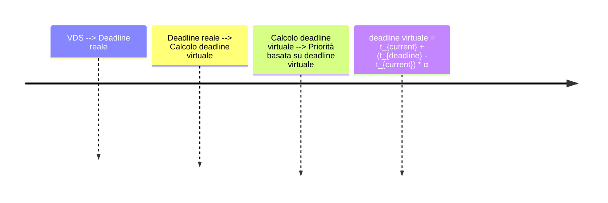
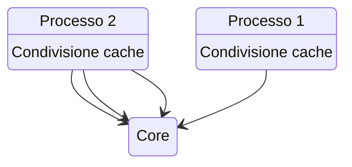
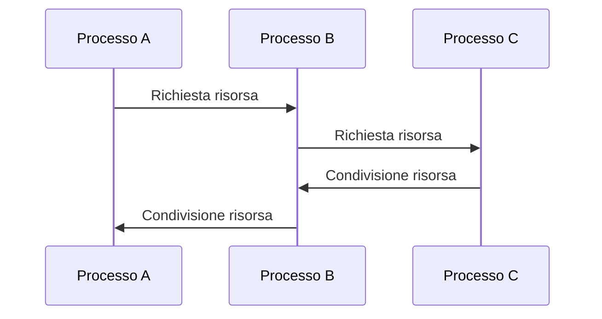

# Gestione dei Processi Real-Time — Lezione: Algoritmi di Scheduling in Ambiente Multicore
**Docente:** Non specificato | **Data:** 01-04-2026

## Argomenti trattati
- Deadline-Oriented Scheduling
- Politiche di Scheduling
- Scheduling in Ambiente Multicore
- Virtualizzazione
- Algoritmi di Scheduling

## Corpo della lezione

### Deadline-Oriented Scheduling
> [!abstract] Definizione: Questo tipo di scheduling è progettato per gestire i processi real-time, garantendo che siano completati entro un tempo definito.

#### Earliest Deadline First (EDF)
> [!example] Esempio pratico: Se due processi hanno periodicità diverse ma scadenze vicine, l'EDF assegna priorità al processo con la deadline più prossima.  
$$ C_i(t) = t_{deadline} - t_{current} $$
Dove:  
- $ C_i(t) $ è il tempo rimanente per il processo $ i $,  
- $ t_{deadline} $ è la scadenza,  
- $ t_{current} $ è il tempo corrente.

#### Rate Monotonic Scheduling (RMS)
> [!example] Esempio pratico: Questo algoritmo assegna priorità in base alla frequenza del processo piuttosto che alla scadenza.  
$$ f_i = \frac{1}{T_i} $$
Dove:  
- $ f_i $ è la frequenza del processo $ i $,  
- $ T_i $ è il periodo del processo $ i $.

### Politiche di Scheduling
#### Linux
> [!info] Informazioni corso
> Il Completely Fair Scheduler (CFS) utilizza un virtual runtime per bilanciare la CPU tra i processi.  
```mermaid
flowchart TD
  CFS --> Calcolo virtual runtime
  Calcolo virtual runtime --> Ordinamento processo
  Ordinamento processo --> Selezione processo
```
> [!tip] Consiglio pratico: Utilizza il VDS per migliorare la reattività dei processi.  

Dove:  
- $α \in [0,1]$ è un fattore di ponderazione.

#### Windows
> [!important] Modalità d'esame
> Le classi di priorità real-time in Windows possono essere boostate temporaneamente per migliorare la reattività dei thread.  
```mermaid
flowchart TD
  Boost priorità --> Thread in attesa
  Thread in attesa --> Risveglio
  Risveglio --> Aumento priorità temporaneo
  Aumento priorità temporaneo --> Esecuzione prioritaria
```

### Scheduling in Ambiente Multicore
> [!quote] Affermazione forte del prof: Gli algoritmi di scheduling devono essere sensibili alla località dei processi per ridurre il costo del bilanciamento tra core.  

> [!tip] Consiglio pratico: Mantieni l'affinity per processi che condividono risorse comuni.  
```mermaid
mindmap
  Affinity --> Località processo
  Località processo --> Condivisione cache
  Condivisione cache --> Riduzione latenza
  Località processo --> Riduzione overhead
  Riduzione overhead --> Miglioramento prestazioni
```

### Virtualizzazione
> [!warning] Attenzione: Conflitti tra scheduler dell'host e della macchina virtuale possono portare a risposte rallentate.  
```mermaid
gantt
  title Conflitto scheduler
  axis x: time
  section Scheduler host
  section Scheduler VM
  section Risposta rallentata
```

### Algoritmi di Scheduling
#### Round Robin
> [!example] Esempio pratico: Utilizzato in combinazione con l'aging per prevenire starvation.  
$$ Time\ slice = \frac{1}{n \cdot \alpha} $$
Dove:  
- $ n $ è il numero di processi,  
- $ \alpha $ è un fattore di aging.

#### Priority Inversion Handling
> [!example] Esempio pratico: Gestisce le inversioni di priorità per evitare deadlock.  


## Riepilogo
> [!summary] Punti chiave della lezione
> - Definizione e funzionamento degli algoritmi EDF e RMS.
> - Implementazioni specifiche in Linux (CFS) e Windows.
> - Strategie di scheduling in un ambiente multicore, incluse politiche di affinity e gestione delle risorse virtuali.
> - Problematiche comuni nella virtualizzazione e soluzioni proposte dall'algoritmo Round Robin con aging.

## Prossimi argomenti
- [ ] Implementazione dettagliata dell'algoritmo CFS in Linux.
- [ ] Analisi delle differenze tra Windows e Linux nella gestione dei processi real-time.

#corso #sistemioperativi #scheduling
