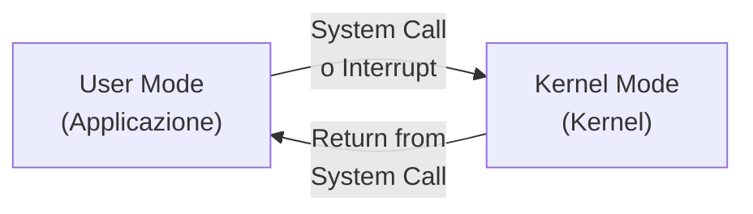
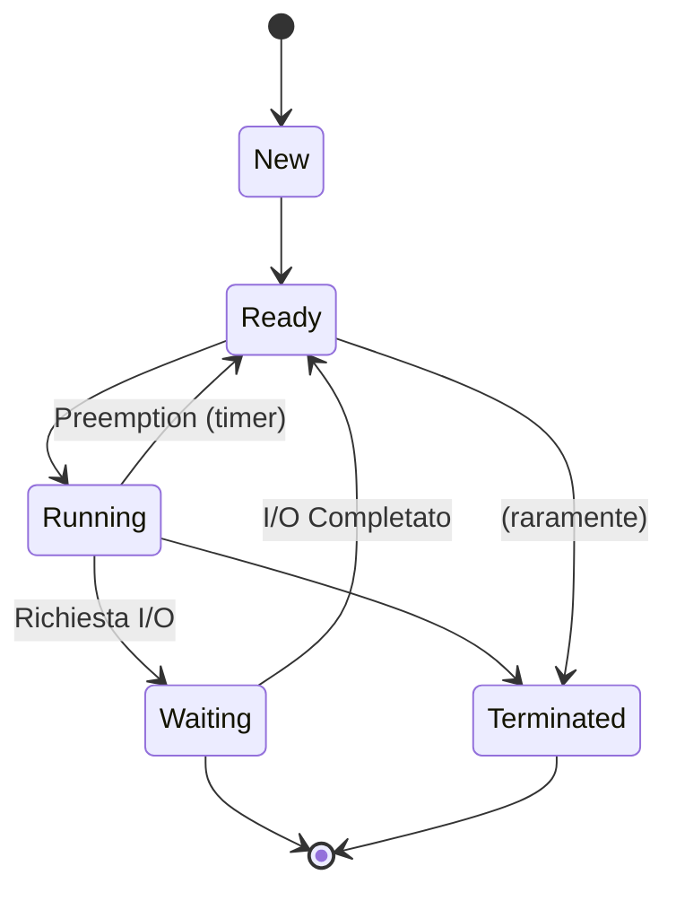
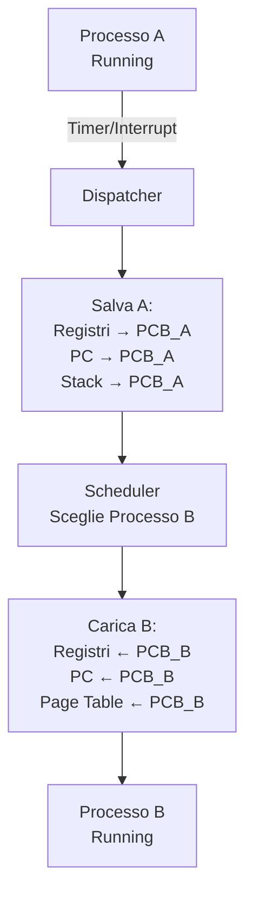

# Appunti Completi - Sistemi Operativi I

**Corso:** Sistemi Operativi I (AA 2025-2026)  
**Docente:** Prof. Alberto Finzi  
**Crediti:** 9 CFU  
**Modalità:** Lezioni + Slide Ufficiali

---
#### Indice Generale
```table-of-contents
```
---


# Parte I - Introduzione ai Sistemi Operativi

## Capitolo 1 - Fondamenti

*(Lezione 1)*

### 1.1 Cos'è un Sistema Operativo?

**Sistema Operativo**: Software che funge da **intermediario** tra l'utente e l'hardware del calcolatore, gestendo le risorse disponibili (CPU, memoria, disco, dispositivi I/O) e fornendo servizi necessari all'esecuzione dei programmi.

Un Sistema Operativo (SO) è un software complesso e sofisticato che svolge diverse funzioni critiche:

1. **Allocazione e gestione delle risorse**: Il SO decide come distribuire le risorse di sistema (CPU, memoria RAM, dispositivi di I/O) tra i programmi in esecuzione.

2. **Interfaccia con l'utente**: Fornisce un'interfaccia (command-line, grafica, ecc.) attraverso cui l'utente può comunicare con il computer.

3. **Protezione**: Protegge i programmi e i dati di ciascun utente da interferenze di altri utenti o programmi.

4. **Astrazione dell'hardware**: Maschera i dettagli complessi dell'hardware, offrendo un'interfaccia semplificata e standardizzata ai programmi.

Il SO è essenziale poiché senza di esso sarebbe praticamente impossibile utilizzare il calcolatore in modo efficiente e sicuro. Tutti i moderni sistemi di calcolo (dai telefoni ai supercomputer) utilizzano un SO.

> **Osservazione**: Alcuni sistemi embedded molto semplici (es. forni a microonde) possono funzionare senza un vero SO, eseguendo un singolo programma fisso. Tuttavia, anche questi spesso dispongono di firmware minimalista che svolge funzioni simili a un SO.

---

### 1.2 Componenti di un Sistema di Calcolo

Un sistema di calcolo moderno è costituito da **quattro componenti principali** che interagiscono continuamente:

```
┌─────────────────────────────────────────────┐
│   UTENTI (Persone/Applicazioni)             │
├─────────────────────────────────────────────┤
│   APPLICAZIONI (Programmi)                  │
├─────────────────────────────────────────────┤
│   SISTEMA OPERATIVO (Kernel + Utilities)    │
├─────────────────────────────────────────────┤
│   HARDWARE (CPU, Memoria, Disco, I/O)       │
└─────────────────────────────────────────────┘
```

#### 1.2.1 Hardware
L'**hardware** è la parte fisica del calcolatore:
- **CPU (Processore Centrale)**: Esegue le istruzioni dei programmi
- **Memoria Principale (RAM)**: Memoria volatile dove risiedono programmi e dati in esecuzione
- **Memoria Secondaria (Disco)**: Memoria non-volatile per l'archiviazione permanente
- **Dispositivi di I/O**: Tastiera, mouse, stampante, monitor, scheda di rete, ecc.

#### 1.2.2 Sistema Operativo
Il **SO** è il software di base che controlla tutto l'hardware e fornisce servizi agli utenti e alle applicazioni. È l'unico software che ha accesso diretto all'hardware in **modalità privilegiata** (kernel mode).

#### 1.2.3 Programmi Applicativi
I **programmi** sono software scritti dagli utenti o dagli sviluppatori che risolvono problemi specifici. Esempi: editor di testo, browser web, giochi, applicazioni scientifiche.

#### 1.2.4 Utenti
Gli **utenti** sono le persone che utilizzano il sistema, sia direttamente che indirettamente (tramite programmi).

---

### 1.3 Obiettivi e Funzioni del Sistema Operativo

Un SO moderno persegue **molteplici obiettivi** che a volte possono entrare in conflitto:

#### 1.3.1 Dal Punto di Vista dell'Utente

**Facilità d'uso**: L'utente desidera che il SO sia facile da usare, con un'interfaccia intuitiva e responsive. Non vuole preoccuparsi di dettagli tecnici dell'hardware.

**Efficienza**: L'utente vuole che i programmi vengono eseguiti il più velocemente possibile e che il sistema reattivo ai suoi comandi.

**Affidabilità**: L'utente vuole che il sistema non perda dati e non abbia crash frequenti.

#### 1.3.2 Dal Punto di Vista dell'Amministratore di Sistema

**Massimizzazione dell'utilizzo delle risorse**: L'amministratore vuole che tutte le risorse (CPU, memoria, disco, dispositivi) siano utilizzate il più possibile in modo da massimizzare il **throughput** (numero di lavori completati per unità di tempo).

**Controllo accessi**: Proteggere il sistema da accessi non autorizzati e da azioni malevole.

**Contabilità**: Tracciare l'utilizzo delle risorse da parte dei singoli utenti/processi.

> **Nota importante**: Gli obiettivi dell'utente e dell'amministratore spesso sono in conflitto. Un SO deve bilanciare questi interessi concorrenti.

---

### 1.4 Il Sistema Operativo come Allocatore di Risorse

Una **prospettiva fondamentale** è quella di considerare il SO come un **allocatore di risorse**. Il calcolatore dispone di risorse finite (CPU, memoria, disco) e molti programmi competono per usarle contemporaneamente.

Le principali responsabilità del SO in questo ruolo sono:

1. **Decidere chi usa la risorsa**: In caso di contesa (es. due programmi vogliono usare la CPU contemporaneamente), il SO decide quale riceve la risorsa e in che ordine.

2. **Allocare la risorsa**: Il SO assegna la risorsa al programma vincitore.

3. **Deallocare la risorsa**: Quando il programma finisce di usare la risorsa, il SO la libera per altri programmi.

4. **Tracciare e contabilizzare**: Il SO mantiene statistiche su quanto ogni risorsa viene utilizzata.

**Esempio pratico**: Quando due programmi cercano di scrivere su disco simultaneamente:
- Il SO decide quale ha priorità
- Serializza gli accessi (uno alla volta)
- Traccia quanto spazio disco ciascuno usa

---

### 1.5 Il Sistema Operativo come Programma di Controllo

Un'altra prospettiva è vedere il SO come un **programma di controllo** che:

1. **Controlla l'esecuzione dei programmi**: Il SO decide quali programmi eseguire, per quanto tempo, e in quale ordine.

2. **Gestisce gli errori**: Rileva errori e condizioni anomale (es. divisione per zero, accesso a memoria non valida) e le gestisce appropriatamente.

3. **Fornisce servizi**: Quando un programma applicativo ha bisogno di fare qualcosa che richiede privilegi (es. leggere un file, allocare memoria), il SO fornisce il servizio.

```
Programma Applicativo
    ↓ (chiede servizio tramite system call)
Sistema Operativo
    ↓ (esegue il servizio con privilegi)
Hardware
```

---

### 1.6 Il Sistema Operativo come Macchina Estesa

Infine, il SO può essere visto come una **macchina estesa** che nasconde la complessità dell'hardware e presenta un'interfaccia semplificata e più comoda ai programmi.

**Senza SO**: Il programmatore dovrebbe conoscere tutti i dettagli dell'hardware (come leggere un settore dal disco, come controllare il display, come gestire interrupt) e programmare direttamente questi dettagli.

**Con SO**: Il programmatore usa **system calls** semplici come:
```c
FILE *f = fopen("file.txt", "r");  // Astratto
read(fd, buffer, 1024);             // Semplice interfaccia
```

Internamente, il SO gestisce tutta la complessità:
- Localizzazione del file nel file system
- Calcolo dell'indirizzo fisico sul disco
- Controllo del controller del disco
- Gestione degli interrupt del disco
- Caching intelligente
- etc.

---

### 1.7 Il Kernel: Nucleo del Sistema Operativo

Il **kernel** è il **nucleo fondamentale** del SO, la parte che:

1. **Rimane sempre in memoria**: A differenza dei programmi ordinari che vengono caricati e scaricati, il kernel è sempre residente in RAM.

2. **Ha accesso privilegiato all'hardware**: Solo il kernel può eseguire certe istruzioni speciali (dette **privilegiate**) che accedono direttamente all'hardware.

3. **Fornisce i servizi fondamentali**: Gestione processi, memoria, I/O, sincronizzazione.

4. **Gestisce interrupt e eccezioni**: Il kernel è invocato automaticamente quando si verifica un interrupt (es. pressione di un tasto) o un'eccezione (es. page fault).

**Struttura**: Il kernel è solitamente organizzato in moduli, ciascuno responsabile di una funzione specifica:
- **Process Manager**: Gestione processi
- **Memory Manager**: Gestione memoria
- **I/O Manager**: Gestione input/output
- **File System**: Gestione file
- etc.

---

### 1.8 Modalità Utente e Modalità Kernel

Un concetto cruciale è la separazione tra **user mode** (modalità utente) e **kernel mode** (modalità kernel), implementata dal processore stesso.

#### 1.8.1 Modalità Kernel (Supervisore)

In **kernel mode**, il processore ha accesso completo a tutte le istruzioni e a tutti i registri/memoria del sistema. Solo il kernel del SO esegue in kernel mode.

**Istruzioni privilegiate** eseguibili solo in kernel mode:
- `HALT`: Arresta il processore
- `SET_TIMER`: Imposta il timer del processore
- `ENABLE/DISABLE_INTERRUPTS`: Abilita/disabilita gli interrupt
- `READ_FROM_PORT / WRITE_TO_PORT`: Accesso diretto ai dispositivi I/O
- `LOAD_STATUS_WORD`: Cambia modalità processore

#### 1.8.2 Modalità Utente

In **user mode**, il processore ha accesso ristretto. Le istruzioni privilegiate **causano un'eccezione** se eseguite in user mode.

**Programmi applicativi** eseguono in user mode per protezione.

#### 1.8.3 Transizioni tra le Modalità



**Scenario tipico**:
1. Programma applicativo esegue normalmente in user mode
2. Programma chiama `read()` per leggere un file (system call)
3. **Processore passa a kernel mode**
4. Kernel esegue la lettura da disco con privilegi completi
5. Kernel ritorna i dati al programma
6. **Processore ritorna a user mode**
7. Programma continua da dove si era fermato

Questa separazione è **fondamentale per la protezione**: impedisce che un programma difettoso o malevolo comprometta il sistema intero.

---

### 1.9 Cenni di Storia dei Sistemi Operativi

Comprendere l'evoluzione dei SO aiuta a capire le scelte architetturali odierne.

#### 1.9.1 Prima Generazione: Mainframe (1945-1955)

- **No SO**: I computer occupavano stanze intere e venivano programmati direttamente in codice macchina
- **Operatore**: Una sola persona alla volta utilizzava il computer
- **Schedulazione manuale**: Gli operatori inserivano manualmente i programmi su carta perforata

#### 1.9.2 Seconda Generazione: Batch Processing (1955-1965)

- **Primi SO**: Sistemi di batch processing automatizzavano il cambio tra lavori
- **Efficienza**: Riducevano i tempi di inattività (quando l'operatore inseriva il lavoro successivo)
- **Memoria limitata**: Pochi kilobyte, necessitava subroutine di sistema esterne
- **Esempio**: OS/360 dell'IBM

#### 1.9.3 Terza Generazione: Time Sharing (1965-1980)

- **Multiprogrammazione**: Più programmi risiedevano contemporaneamente in memoria
- **Time-sharing**: La CPU era divisa tra i programmi mediante context switch veloce
- **Reattività**: Gli utenti potevano interagire direttamente, non più batch-only
- **Protezione**: Recinzione hardware della memoria separava i programmi
- **Esempio**: Unix (1969), sviluppato ai Bell Labs

#### 1.9.4 Quarta Generazione: Personal Computer (1980-Presente)

- **Processori potenti**: Desktop e laptop con CPU multi-GHz
- **Memoria abbondante**: Gigabyte di RAM, terrabyte di disco
- **Interfacce grafiche**: GUI anziché command-line
- **Reti**: Internet e comunicazione istantanea
- **Mobile**: Smartphone con SO sofisticati (iOS, Android)
- **Multicore**: Processori con più core eseguono veramente in parallelo
- **Esempio**: Windows, macOS, Linux

#### 1.9.5 Quinta Generazione: Cloud e IoT (2010-Presente)

- **Distributed Systems**: Computazione distribuita su reti
- **Virtualizzazione**: Più SO eseguono su una sola macchina fisica
- **IoT**: SO leggeri per dispositivi embedded
- **Container**: Isolamento di processi senza virtuali machine pesanti (Docker)

---


# Parte II - Servizi e Interfacce del SO

## Capitolo 2 - Servizi del Sistema Operativo

*(Lezioni 2b, 3)*

### 2.1 Panoramica dei Servizi

Il SO fornisce un'**ampia gamma di servizi** ai programmi applicativi e agli utenti. Questi servizi possono essere classificati in due categorie principali:

1. **Servizi orientati all'utente**: Facilitano direttamente il lavoro dell'utente
2. **Servizi orientati all'efficienza del sistema**: Ottimizzano l'utilizzo delle risorse

---

### 2.2 Servizi Orientati all'Utente

#### 2.2.1 Interfaccia Utente

Il SO fornisce un **interfaccia** attraverso cui l'utente può interagire con il sistema. Esistono tre tipi principali:

| Tipo | Descrizione | Esempio |
|------|-------------|---------|
| **CLI** | Command-Line Interface - riga di comando | Bash, PowerShell |
| **GUI** | Graphical User Interface - interfaccia grafica | Windows Desktop, macOS |
| **Batch** | Interfaccia batch - file di comandi | Script Shell, Batch files |

**CLI (Command-Line Interface)**:
- Utente digita comandi da tastiera
- SO interpreta e esegue i comandi
- Risultati visualizzati a schermo
- Vantaggi: Preciso, veloce per utenti esperti, remote-friendly
- Svantaggi: Curva di apprendimento, meno intuitivo

**GUI (Graphical User Interface)**:
- Elementi visivi: finestre, bottoni, menu, icone
- Interazione mouse/touchscreen
- Vantaggi: Intuitiva, user-friendly, visuale
- Svantaggi: Più lento, usa più risorse

**Batch**:
- File di comandi eseguiti automaticamente in sequenza
- Vantaggi: Automazione, ripetibile, no interazione umana
- Esempio:
```bash
#!/bin/bash
# Script batch per backup
cp -r /home/dati /backup/dati_$(date +%Y%m%d)
tar czf /backup/backup.tar.gz /backup/dati_*
```

#### 2.2.2 Esecuzione di Programmi

Il SO consente agli **utenti di eseguire programmi** su richiesta e fornisce un **ambiente di esecuzione**.

Responsabilità del SO:
- Caricare il programma in memoria RAM
- Allocare risorse (CPU, memoria, file descriptor)
- Gestire l'esecuzione (scheduling, context switch)
- Fornire accesso a servizi di sistema (I/O, memoria, sincronizzazione)
- Gestire la terminazione e la pulizia

```c
// Programma semplice eseguito dal SO
#include <stdio.h>

int main() {
    printf("Ciao da un programma eseguito dal SO!\n");
    return 0;
}
// Il SO:
// 1. Legge il file eseguibile dal disco
// 2. Crea un nuovo processo
// 3. Carica il codice in memoria
// 4. Assegna CPU al processo
// 5. Gestisce interrupt/eccezioni
// 6. Ripulisce quando termina
```

#### 2.2.3 Operazioni di Input/Output

Il SO fornisce un'**interfaccia unificata** per accedere ai dispositivi I/O diversi (disco, stampante, monitor, tastiera, rete) senza che il programma debba conoscerne i dettagli specifici.

**Abstrazione**: 
```
Programma → write(fd, buffer) → SO → Hardware del Dispositivo
```

Il SO nasconde:
- Il tipo specifico di dispositivo
- I dettagli di controllo hardware
- I timing e le latenze
- La sincronizzazione

**Esempio**: 
```c
// Il programmatore scrive lo stesso codice per stampante/disco/monitor
FILE *fp = fopen("output.txt", "w");
fprintf(fp, "Dati da salvare\n");
fclose(fp);
```

Il SO capisce che l'output va a diversi dispositivi e gestisce i dettagli.

#### 2.2.4 Gestione del File System

Il SO fornisce un **file system gerarchico** che astrae la memoria secondaria in una struttura ad albero di directory e file.

**Funzionalità**:
- **Creazione/Eliminazione**: `create()`, `delete()`
- **Lettura/Scrittura**: `read()`, `write()`
- **Navigazione**: `cd`, `ls`, `pwd` (in CLI)
- **Protezione**: Permessi di accesso (read, write, execute)
- **Metadati**: Nome, dimensione, data di creazione, proprietario
- **Persistenza**: Dati salvati rimangono sul disco

```bash
# Comandi del file system forniti dal SO
mkdir /home/progetti          # Crea directory
cd /home/progetti             # Cambia directory
ls -la                        # Lista file con dettagli
cp file1.txt file1_backup.txt # Copia file
rm file_temporaneo.txt        # Elimina file
```

#### 2.2.5 Comunicazione tra Processi

Il SO fornisce **meccanismi** per permettere a processi distinti di comunicare e sincronizzarsi:

- **Pipe**: Canale unidirezionale tra processi correlati
- **Socket**: Comunicazione tra processi su macchine diverse (rete)
- **Message Queue**: Coda di messaggi
- **Shared Memory**: Memoria condivisa tra processi
- **Semafori**: Sincronizzazione di accesso a risorse condivise

```bash
# Esempio di pipe (comunicazione interprocess)
ps aux | grep "bash"  # ps scrive in pipe, grep legge dalla pipe
```

#### 2.2.6 Rilevamento degli Errori

Il SO **rileva e gestisce errori** che possono verificarsi:

| Tipo di Errore | Esempio | Azione del SO |
|---|---|---|
| **Hardware** | Errore lettura disco | Retry, segnalazione al programma |
| **Software** | Accesso memoria non valida | Invio segnale SIGSEGV, terminazione |
| **I/O** | Stampante disconnessa | Errore di I/O, segnalazione |
| **Risorsa** | Memoria esaurita | Errore allocazione memoria |

---

### 2.3 Servizi Orientati all'Efficienza del Sistema

#### 2.3.1 Allocazione delle Risorse

Il SO **alloca le risorse limitate** tra i programmi concorrenti in modo equo e efficiente.

**Risorse gestite**:
- **CPU**: Scheduling della CPU tra processi
- **Memoria**: Allocazione e deallocazione di memoria RAM
- **Disco**: Spazio per file e dati
- **Dispositivi**: Stampanti, dischi, schede di rete

**Algoritmi di allocazione**:
```
Processi in attesa → Scheduler → Alloca CPU al processo P1
(Quantum di tempo) → P1 esegue → Scheduler rialloca a P2
```

#### 2.3.2 Contabilità delle Risorse

Il SO **tiene traccia** di quante risorse ogni utente/processo usa, per:
- **Billing**: Addebitare il costo computazionale all'utente/progetto
- **Statistiche**: Analizzare i pattern di utilizzo
- **Limitazioni**: Impedire che un singolo utente monopolizzi le risorse
- **Monitoraggio**: Identificare processi che consumano anomale quantità di risorse

```bash
# Comandi per visualizzare contabilità
ps aux            # Lista processi con uso CPU/memoria
top               # Monitor tempo reale uso risorse
df -h             # Spazio disco utilizzato
ulimit -a         # Limiti per l'utente corrente
```

#### 2.3.3 Protezione e Sicurezza

Il SO implementa **meccanismi di protezione** per:

1. **Isolamento**: Ogni processo ha il suo spazio di indirizzamento, non può interferire con altri
2. **Permessi**: File e risorse hanno permessi (owner, group, others)
3. **Autenticazione**: Login con username/password
4. **Autorizzazione**: Verifica che l'utente abbia permessi prima di accedere a risorse
5. **Audit**: Log degli accessi per tracciamento

```bash
# Protezione in Unix/Linux
ls -l file.txt
# -rw-r--r-- 1 user group 1234 May 15 10:30 file.txt
# ↑↑↑ owner (user) può leggere e scrivere
#    ↑↑↑ group può solo leggere
#       ↑↑↑ others possono solo leggere
```

---

## Capitolo 3 - Chiamate di Sistema (System Calls)

*(Lezione 4)*

### 3.1 Introduzione alle System Calls

Una **system call** (o **syscall**) è un'**interfaccia** che i programmi applicativi usano per chiedere servizi al kernel del SO.

**Definizione formale**: Una system call è una **funzione che richiede l'intervento del SO** (passaggio da user mode a kernel mode) per svolgere un'operazione privilegiata.

**Meccanismo**:
```
1. Programma in user mode chiama syscall (es. read())
2. CPU passa a kernel mode (trap/interrupt)
3. Kernel esegue l'operazione con privilegi completi
4. Kernel ritorna il risultato al programma
5. CPU ritorna a user mode
6. Programma continua
```

**Perché servono?**
- **Protezione**: Accesso controllato all'hardware
- **Servizi**: Il kernel fornisce servizi che il programma non potrebbe implementare (accesso disco, allocazione memoria)
- **Astrazione**: Nasconde la complessità hardware

---

### 3.2 Tipi di Chiamate di Sistema

Le system calls si dividono in **categorie** in base alla funzione che svolgono:

```
System Calls
├── Controllo dei Processi
├── Gestione dei File
├── Gestione dei Dispositivi
├── Gestione delle Informazioni
├── Comunicazione
└── Gestione della Protezione
```

---

### 3.3 Controllo dei Processi

**Funzione**: Creazione, terminazione, e controllo dei processi.

| System Call | Descrizione | Prototipo |
|---|---|---|
| `fork()` | Crea un nuovo processo (figlio) | `pid_t fork(void)` |
| `exec()` | Sostituisce il programma del processo | `int execve(const char *name, char *const *argv, char *const *envp)` |
| `wait()` / `waitpid()` | Attende la terminazione di un figlio | `pid_t wait(int *status)` |
| `exit()` | Termina il processo corrente | `void exit(int status)` |
| `kill()` | Invia un segnale a un processo | `int kill(pid_t pid, int sig)` |
| `signal()` | Registra un handler di segnale | `signal_t signal(int sig, signal_t handler)` |

**Esempio di fork()**:
```c
#include <unistd.h>
#include <stdlib.h>
#include <stdio.h>

int main() {
    pid_t pid = fork();
    
    if (pid < 0) {
        // Errore: fork fallita
        perror("fork failed");
        exit(1);
    }
    else if (pid == 0) {
        // Processo FIGLIO: pid == 0
        printf("Sono il figlio, il mio PID: %d\n", getpid());
        printf("PID del padre: %d\n", getppid());
    }
    else {
        // Processo PADRE: pid > 0 (contiene il PID del figlio)
        printf("Sono il padre, PID figlio: %d\n", pid);
        wait(NULL);  // Attende che il figlio termini
    }
    
    return 0;
}
```

**Output possibile**:
```
Sono il padre, PID figlio: 1234
Sono il figlio, il mio PID: 1234
PID del padre: 1233
```

---

### 3.4 Gestione dei File

**Funzione**: Creazione, lettura, scrittura, e gestione dei file.

| System Call | Descrizione | Prototipo |
|---|---|---|
| `open()` | Apre un file, ritorna un file descriptor | `int open(const char *pathname, int flags, mode_t mode)` |
| `read()` | Legge byte da un file descriptor | `ssize_t read(int fd, void *buf, size_t count)` |
| `write()` | Scrive byte su un file descriptor | `ssize_t write(int fd, const void *buf, size_t count)` |
| `close()` | Chiude un file descriptor | `int close(int fd)` |
| `lseek()` | Cambia posizione di lettura/scrittura | `off_t lseek(int fd, off_t offset, int whence)` |
| `unlink()` | Elimina un file | `int unlink(const char *pathname)` |
| `stat()` | Ottiene metadati di un file | `int stat(const char *pathname, struct stat *statbuf)` |
| `chmod()` | Cambia permessi di un file | `int chmod(const char *pathname, mode_t mode)` |

**Esempio di lettura file**:
```c
#include <fcntl.h>
#include <unistd.h>
#include <stdio.h>

int main() {
    char buffer[256];
    
    // Apre il file in lettura
    int fd = open("input.txt", O_RDONLY);
    if (fd == -1) {
        perror("open failed");
        return 1;
    }
    
    // Legge fino a 255 byte
    ssize_t n = read(fd, buffer, 255);
    if (n == -1) {
        perror("read failed");
        return 1;
    }
    
    // Null-terminate la stringa
    buffer[n] = '\0';
    printf("Contenuto letto: %s\n", buffer);
    
    // Chiude il file
    close(fd);
    return 0;
}
```

---

### 3.5 Gestione dei Dispositivi

**Funzione**: Controllo dei dispositivi hardware (stampante, monitor, disco, ecc).

| System Call | Descrizione |
|---|---|
| `ioctl()` | Controlla un dispositivo I/O |
| `read()/write()` | Lettura/scrittura da dispositivi |
| `open()/close()` | Apertura/chiusura dispositivi |

**Astrazione importante**: In Unix/Linux, i dispositivi sono rappresentati come **"file speciali"** in `/dev/`:
```bash
ls -la /dev/
# crw-rw-rw- 1 root tty ...  /dev/tty         # Terminale
# brw-rw---- 1 root disk ...  /dev/sda        # Disco rigido
# crw------- 1 root root ...  /dev/mem        # Memoria fisica
```

---

### 3.6 Gestione delle Informazioni

**Funzione**: Ottenere informazioni sul sistema e sul processo.

| System Call | Descrizione |
|---|---|
| `getpid()` | Ottiene il PID del processo corrente |
| `getuid()` | Ottiene l'UID dell'utente corrente |
| `time()` | Ottiene l'ora di sistema |
| `sysinfo()` | Ottiene informazioni di sistema |
| `gethostname()` | Ottiene il nome dell'host |

**Esempio**:
```c
#include <unistd.h>
#include <sys/types.h>
#include <time.h>
#include <stdio.h>

int main() {
    printf("PID: %d\n", getpid());
    printf("UID: %d\n", getuid());
    printf("Tempo: %ld\n", time(NULL));
    return 0;
}
```

---

### 3.7 Comunicazione

**Funzione**: Comunicazione tra processi.

| System Call | Descrizione |
|---|---|
| `pipe()` | Crea una pipe (canale unidirezionale) |
| `socket()` | Crea un socket (comunicazione di rete) |
| `send()/recv()` | Invio/ricezione via socket |
| `msgget()` | Crea una message queue |
| `shmget()` | Crea memoria condivisa |

---

### 3.8 Gestione della Protezione

**Funzione**: Controllo di accesso e protezione.

| System Call | Descrizione |
|---|---|
| `chmod()` | Cambia permessi di file |
| `chown()` | Cambia proprietario di file |
| `setuid()` | Cambia UID effettivo del processo |
| `getgroups()` | Ottiene i gruppi dell'utente |

---

### 3.9 Standard C Library

Le **system calls** sono il livello più basso di interfaccia con il SO. Sopra di esse, la **Standard C Library** (libc) fornisce **funzioni wrapper** più comode.

```c
// System call diretta (basso livello)
#include <unistd.h>
ssize_t ret = read(fd, buffer, 1024);

// Funzione C Library wrapper (alto livello, più comoda)
#include <stdio.h>
FILE *fp = fopen("file.txt", "r");  // Wrapper su open() + altre cose
char *line = fgets(buffer, 256, fp); // Wrapper su read() con buffering
fclose(fp);  // Wrapper su close()
```

Il wrapper della C Library **aggiunge comodità**:
- Buffering automatico
- Gestione dello stato (FILE *)
- Funzioni come getline(), getc(), che sono convenienza

---

### 3.10 Confronto: Unix/Linux vs Windows

| Operazione | Unix/Linux | Windows |
|---|---|---|
| **Crea processo** | `fork()` + `exec()` | `CreateProcess()` |
| **Attende processo** | `wait()`, `waitpid()` | `WaitForSingleObject()` |
| **Termina processo** | `exit()` | `ExitProcess()` |
| **Crea file** | `open(O_CREAT)`, `creat()` | `CreateFileA()` |
| **Leggi file** | `read()` | `ReadFile()` |
| **Scrivi file** | `write()` | `WriteFile()` |
| **Comunicazione Inter-Proc** | Pipe, Socket, Shared Memory | Named Pipes, Socket, Mail Slot |
| **Segnali** | `signal()`, `kill()` | Event Objects, Callback |

**Differenze filosofiche**:
- **Unix**: Minimalista, pochi syscall, composabilità
- **Windows**: Ricco, molti syscall, più complesso

---

### 3.11 Programmi di Sistema

I **programmi di sistema** sono utility fornite dal SO che si basano su system calls per dare all'utente accesso a funzionalità di sistema.

**Esempi**:
```bash
ls          # Lista file (usa opendir, readdir)
cat         # Visualizza file (usa open, read)
cp          # Copia file (usa open, read, write)
rm          # Elimina file (usa unlink)
ps          # Lista processi (usa /proc filesystem)
kill        # Invia segnale (usa kill syscall)
chmod       # Cambia permessi (usa chmod syscall)
```

---

## Capitolo 4 - La Shell Bash

*(Lezione 5-bash)*

### 4.1 Introduzione alla Shell

**Shell**: Programma che funge da **intermediario** tra l'utente e il SO, interpretando comandi e eseguendo programmi.

La shell è un **programma ordinario** (non parte del kernel), ma ha il ruolo cruciale di fornire un'interfaccia a linea di comando per interagire con il SO.

**Funzioni della shell**:
1. **Interpretazione comandi**: Legge una linea di comando, la analizza, la esegue
2. **Ricerca programmi**: Trova il programma da eseguire
3. **Redirezione I/O**: Reindirizza stdin/stdout/stderr
4. **Pipe**: Connette processi con pipe
5. **Variabili**: Gestisce variabili di shell
6. **Script**: Esegue programmi interpretati (script shell)

**Tipi di shell disponibili in Unix/Linux**:

| Shell | Descrizione |
|---|---|
| **sh** | Bourne shell - originale, minimalista |
| **bash** | Bourne Again Shell - estensione di sh, di default in Linux |
| **zsh** | Z shell - ricca di feature, popolare |
| **ksh** | Korn shell - combinazione sh + csh |
| **csh/tcsh** | C shell - sintassi simile a C |
| **fish** | Friendly interactive shell - moderna |

**Bash è la shell più comune** in Linux moderno.

---

### 4.2 Il Ciclo di Esecuzione della Shell

La shell esegue un **ciclo infinito** che continua fino a che non riceve il comando `exit` o EOF:

```
┌─────────────────────────────────────┐
│      SHELL MAIN LOOP                │
└─────────────────────────────────────┘
        ↓
┌─────────────────────────────────────┐
│   1. Visualizza PROMPT ($, #, >)    │
│      e aspetta input                │
└─────────────────────────────────────┘
        ↓
┌─────────────────────────────────────┐
│   2. Legge una linea (comando)      │
│      da tastiera (stdin)            │
└─────────────────────────────────────┘
        ↓
┌─────────────────────────────────────┐
│   3. Esegue l'analisi sintattica    │
│      (parsing) del comando          │
└─────────────────────────────────────┘
        ↓
┌─────────────────────────────────────┐
│   4. Gestisce redirezione (>, >>)   │
│      e pipe (|)                     │
└─────────────────────────────────────┘
        ↓
┌─────────────────────────────────────┐
│   5. Esegue il comando:             │
│      - Built-in: esegue internamente│
│      - Esterno: crea processo        │
└─────────────────────────────────────┘
        ↓
┌─────────────────────────────────────┐
│   6. Attende completamento          │
│      (modalità interattiva)         │
└─────────────────────────────────────┘
        ↓
    Torna al passo 1
```

---

### 4.3 Modalità Interattiva

In **modalità interattiva**, la shell legge comandi da terminale e visualizza i risultati.

```bash
$ echo "Ciao"
Ciao
$ ls -la
total 24
drwxr-xr-x  2 user group 4096 May 15 10:30 .
drwxr-xr-x  8 user root  4096 May 15 09:00 ..
-rw-r--r--  1 user group  256 May 15 10:30 file.txt
```

**Caratteristiche**:
- Prompt visibile
- Comandi uno alla volta
- Risultati immediati
- Possibilità di correggere/modificare la linea (editing)
- History dei comandi (freccia su/giù)

---

### 4.4 Variabili di Shell

La shell supporta **variabili** che possono memorizzare dati e essere usate nei comandi.

**Sintassi di assegnazione**:
```bash
VARIABILE=valore        # Assegna una variabile (no spazi intorno a =)
echo $VARIABILE         # Espande la variabile
echo ${VARIABILE}       # Espande (forma robusta)
```

**Esempi**:
```bash
$ NAME="Alice"
$ echo "Ciao $NAME"
Ciao Alice

$ AGE=25
$ echo "Età: $AGE"
Età: 25

$ PATH="/usr/bin:/bin:/usr/sbin"
$ echo $PATH
/usr/bin:/bin:/usr/sbin
```

**Scope delle variabili**:
- **Variabili locali**: Esistono solo nella shell corrente
- **Variabili d'ambiente**: Ereditate dai processi figli

```bash
$ export VAR="valore"   # Rende VAR d'ambiente
$ bash                  # Avvia una nuova shell figlia
$ echo $VAR             # Il figlio vede VAR
valore
```

---

### 4.5 Variabili Predefinite (HOME, PATH, PS1, USER, HOSTNAME, SHELL)

La shell fornisce **variabili speciali** automaticamente:

| Variabile | Descrizione | Esempio |
|---|---|---|
| **`HOME`** | Directory home dell'utente | `/home/alice` |
| **`PATH`** | Percorsi per ricerca programmi | `/usr/bin:/bin:/usr/sbin` |
| **`PS1`** | Prompt primario | `$` o `bash-4.2$ ` |
| **`PS2`** | Prompt secondario (continuazione) | `> ` |
| **`USER`** | Nome utente corrente | `alice` |
| **`HOSTNAME`** | Nome del computer | `mycomputer` |
| **`SHELL`** | Shell corrente | `/bin/bash` |
| **`PWD`** | Directory di lavoro corrente | `/home/alice/documents` |
| **`OLDPWD`** | Directory precedente | `/home/alice` |
| **`RANDOM`** | Numero casuale 0-32767 | (varia) |
| **`SECONDS`** | Secondi dalla bash start | 1234 |

**Uso pratico**:
```bash
$ echo $HOME
/home/alice

$ echo $PATH
/usr/local/bin:/usr/bin:/bin:/usr/sbin:/sbin

$ echo $USER
alice

$ echo $HOSTNAME
laptop

$ cd ~       # ~ espande a $HOME
$ pwd
/home/alice
```

**Personalizzazione del prompt**:
```bash
# Default
$ PS1="$ "

# Personalizzato con timestamp
$ PS1="[\u@\h \w] \t $ "
[alice@laptop ~/docs] 10:30:45 $

# Dove:
# \u = username
# \h = hostname (short)
# \w = working directory
# \t = time HH:MM:SS
```

---

### 4.6 Sintassi dei Comandi

Un **comando della shell** ha la struttura:

```
COMANDO [OPZIONI] [ARGOMENTI] [REDIREZIONE]
```

**Componenti**:
1. **COMANDO**: Il programma da eseguire
2. **OPZIONI**: Modificano il comportamento (precedute da `-` o `--`)
3. **ARGOMENTI**: Dati per il comando
4. **REDIREZIONE**: Modificano stdin/stdout/stderr

**Esempi**:
```bash
ls                  # Comando semplice, lista directory corrente

ls -la /tmp         # Comando + opzione (-la = long format, all) + argomento (/tmp)

grep "pattern" file.txt    # Comando + argomenti

echo "Ciao" > output.txt   # Comando + redirezione (> redirect stdout)

cat < input.txt     # Comando + redirezione (< redirect stdin)

sort | uniq         # Pipe: output di sort → input di uniq
```

---

### 4.7 Ricerca ed Esecuzione dei Comandi

Quando digiti un comando, la shell:

1. **Verifica se è un built-in**: 
   - Comandi interni alla shell (cd, echo, export, etc.)
   - Se sì, esegue direttamente senza creare processo

2. **Ricerca il programma**:
   - Usa la variabile `$PATH`
   - Cerca il primo match

3. **Crea un nuovo processo**:
   - Chiama `fork()` (Lezione 5 - Processi)
   - Chiama `exec()` per sostituire il programma
   - Attende la terminazione

4. **Ritorna al prompt**

```bash
$ echo "test"       # Built-in (echo è built-in in bash)
test

$ /bin/echo "test"  # Esplicito: /bin/echo è programma esterno
test

$ which ls          # Dove si trova il programma?
/bin/ls

$ echo $PATH        # PATH: dove la shell cerca programmi
/usr/local/bin:/usr/bin:/bin:/usr/sbin:/sbin
```

**Built-in vs External**:
```bash
$ type cd
cd is a shell builtin

$ type ls
ls is /bin/ls

$ type python
python is hashed (/usr/bin/python3)
```

---

### 4.8 Listing dei Processi (comando ps)

Il comando **`ps`** (process status) **lista i processi** attualmente in esecuzione.

**Sintassi**:
```bash
ps [OPZIONI]
```

**Opzioni comuni**:

| Opzione | Descrizione |
|---|---|
| **`-e`** | Tutti i processi (no solo della shell corrente) |
| **`-f`** | Formato full (lungo) |
| **`-u` user** | Processi di uno specifico utente |
| **`-p` PID** | Info su uno specifico PID |
| **`-l`** | Formato lungo |
| **`-a`** | Tutti i processi con terminale |
| **`x`** | Processi senza terminale |
| **`--forest`** | Mostra gerarchia (relazioni padre-figlio) |

**Esempi**:
```bash
# Lista processi attuali della shell
$ ps
  PID TTY      STAT   TIME COMMAND
 1234 pts/0    Ss     0:00 bash
 5678 pts/0    R+     0:00 ps

# Format esteso
$ ps -ef
UID        PID  PPID  C STIME TTY      STAT   TIME COMMAND
root         1     0  0 May15 ?        Ss     0:01 /sbin/init
root       123     1  0 May15 ?        Ss     0:00 /usr/sbin/sshd
alice     1234  1000  0 10:30 pts/0    Ss     0:00 bash

# Processi di un utente
$ ps -u alice
  PID TTY      STAT   TIME COMMAND
 1234 pts/0    Ss     0:00 bash
 5678 pts/0    R+     0:00 ps

# Gerarchia processi
$ ps --forest
  PID TTY      STAT   TIME COMMAND
 1000 ?        Ss     0:00 sshd
 1001 pts/0    Ss     0:00  \_ bash
 1234 pts/0    R+     0:00  \_ ps
```

**Campi principali**:
- **UID**: Utente proprietario del processo
- **PID**: Process ID (identificativo unico)
- **PPID**: Parent PID (processo padre)
- **STAT**: Stato del processo (R=running, S=sleeping, Z=zombie)
- **TIME**: Tempo CPU utilizzato
- **COMMAND**: Comando che ha lanciato il processo

---

### 4.9 Abilitazione WSL in Windows

**WSL** (Windows Subsystem for Linux) è una tecnologia che consente di eseguire una **vera distribuzione Linux** su Windows senza virtualizzazione pesante.

#### Prerequisiti:
- Windows 10 Build 19041+ o Windows 11
- Hyper-V abilitato (opzionale per WSL 2)

#### Installazione WSL:

**Passo 1**: Aprire PowerShell come Amministratore:
```powershell
# Abilita il componente WSL
wsl --install

# Oppure manualmente:
dism.exe /online /enable-feature /featurename:Microsoft-Windows-Subsystem-Linux /all /norestart
dism.exe /online /enable-feature /featurename:VirtualMachinePlatform /all /norestart
```

**Passo 2**: Riavviare il computer

**Passo 3**: Scaricare e installare il kernel WSL 2 (se usando WSL 2)
```powershell
# Scarica il kernel
wsl --update

# Imposta WSL 2 come default
wsl --set-default-version 2
```

**Passo 4**: Installare una distribuzione Linux:
```powershell
# Lista distribuzioni disponibili
wsl -l --online

# Installa Ubuntu
wsl --install -d Ubuntu

# O da Microsoft Store: cercare "Ubuntu"
```

**Passo 5**: Avviare WSL:
```powershell
# Entra in WSL
wsl

# O avvia direttamente bash
bash

# Oppure tramite terminale Windows: selezionare "Ubuntu" dal dropdown
```

**Verifica dell'installazione**:
```bash
$ uname -a
Linux desktop 5.10.16.3-microsoft-standard #1 SMP Fri Mar 12 12:00:00 UTC 2021 x86_64 x86_64 x86_64 GNU/Linux

$ lsb_release -a
Ubuntu 22.04 LTS

$ whoami
alice
```

**Integrazione Windows-WSL**:
```bash
# Accedere ai file Windows da WSL
cd /mnt/c/Users/alice/Documents

# Eseguire WSL da Windows CMD
C:\> wsl ls -la

# Accedere ai file WSL da Windows
C:\> \\wsl$\Ubuntu\home\alice
```

---


# Parte III - Processi e Gestione di Base

## Capitolo 5 - Gestione dei Processi

*(Lezioni 4-5-6)*

### 5.1 Definizione di Processo

**Processo**: **Programma in esecuzione** - entità attiva che richiede risorse (CPU, memoria, file descriptor, dispositivi I/O) per completare il proprio task.

**Differenza fondamentale tra Programma e Processo**:

| Aspetto | Programma | Processo |
|---|---|---|
| **Natura** | Entità **passiva** (testo) | Entità **attiva** (in esecuzione) |
| **Locazione** | Memoria secondaria (disco) | Memoria principale (RAM) |
| **Ciclo di vita** | Permanente (finché il file esiste) | Temporaneo (dalla creazione alla terminazione) |
| **Istanze** | Una copia sul disco | Più istanze possono eseguire lo stesso programma contemporaneamente |
| **Risorse** | Non consuma risorse | Consuma CPU, memoria, I/O, ecc. |
| **Esempio** | File eseguibile `/usr/bin/bash` | Un'istanza bash in esecuzione |

**Esempio pratico**:
```bash
$ which bash
/usr/bin/bash          # Questo è il PROGRAMMA (file su disco)

$ ps aux | grep bash
alice  1234 0.0  0.5   4192  2048 pts/0    Ss   10:30   0:00 bash
root   5678 0.0  0.8   4500  3200 pts/1    Ss   10:15   0:00 bash
# Questi sono i PROCESSI (istanze in esecuzione)
```

Un singolo **programma** (bash) ha **due processi** in esecuzione (PID 1234 e 5678), ciascuno con le proprie risorse.

---

### 5.2 Processi Single-threaded e Multi-threaded

Un processo può contenere **uno o più thread** (fili di esecuzione).

#### 5.2.1 Processi Single-threaded

Un processo **single-threaded** ha un **solo thread di esecuzione** - esegue una sequenza lineare di istruzioni.

```
Processo Single-threaded
┌─────────────────────┐
│   Stack             │
├─────────────────────┤
│   Heap              │
├─────────────────────┤
│   Dati              │
├─────────────────────┤
│   Codice (Text)     │
└─────────────────────┘
    ↑
  Un solo Program Counter (PC)
  Un solo Stack
```

**Caratteristiche**:
- Una sola riga di esecuzione per volta
- Semplice da programmare
- Se il thread si blocca su I/O, l'intero processo si blocca
- La CPU non può elaborare altre parti del codice del processo

**Esempio**:
```c
// Programma single-threaded semplice
int main() {
    printf("Inizio\n");
    sleep(5);          // Si blocca per 5 secondi
    printf("Fine\n");  // Non esegue fino a dopo i 5 secondi
    return 0;
}
```

#### 5.2.2 Processi Multi-threaded

Un processo **multi-threaded** contiene **due o più thread** che eseguono **concorrentemente** nello stesso spazio di indirizzamento.

```
Processo Multi-threaded
┌────────────────────────────────────┐
│         Stack Thread 1 Stack Thread 2... │
├────────────────────────────────────┤
│   Heap (CONDIVISO)                 │
├────────────────────────────────────┤
│   Dati (CONDIVISI)                 │
├────────────────────────────────────┤
│   Codice (CONDIVISO)               │
└────────────────────────────────────┘
    ↑              ↑
  PC Thread 1    PC Thread 2
```

**Caratteristiche**:
- Più righe di esecuzione nello stesso processo
- I thread **condividono** heap, dati, codice
- Ogni thread ha il **proprio** stack e PC
- Se un thread si blocca su I/O, altri thread continuano
- Più veloce da creare/commutare rispetto ai processi (no context di memoria)
- Più complesso da programmare (race condition, sincronizzazione)

**Vantaggi**:
1. **Risposta**: Se un thread si blocca su I/O, altri thread continuano
2. **Condivisione risorse**: I thread condividono memoria → meno overhead
3. **Economia**: Creare un thread è più leggero che creare un processo
4. **Scalabilità**: Su multicore, thread diversi su core diversi = vero parallelismo

**Esempio**:
```c
#include <pthread.h>
#include <stdio.h>
#include <unistd.h>

void* thread_func(void* arg) {
    int id = *(int*)arg;
    for (int i = 0; i < 3; i++) {
        printf("Thread %d: %d\n", id, i);
        sleep(1);
    }
    return NULL;
}

int main() {
    pthread_t t1, t2;
    int id1 = 1, id2 = 2;
    
    pthread_create(&t1, NULL, thread_func, &id1);
    pthread_create(&t2, NULL, thread_func, &id2);
    
    pthread_join(t1, NULL);  // Attende thread 1
    pthread_join(t2, NULL);  // Attende thread 2
    
    return 0;
}
```

**Output** (i due thread si eseguono concorrentemente):
```
Thread 1: 0
Thread 2: 0
Thread 1: 1
Thread 2: 1
Thread 1: 2
Thread 2: 2
```

Noterai che l'output è **intercalato**: i due thread eseguono simultaneamente, non uno dopo l'altro.

---

### 5.3 Layout di Memoria di un Processo

La memoria di un processo è organizzata in **sezioni distinte** con ruoli specifici:

```
MEMORIA ALTA
┌─────────────────────┐
│   Stack             │ ← Cresce verso il basso
│   (locale var, ...)│
├─────────────────────┤
│   (spazio vuoto)    │
│   (non usato)       │
├─────────────────────┤
│   Heap              │ ← Cresce verso l'alto
│   (malloc, new)     │
├─────────────────────┤
│   BSS               │
│   (variabili        │
│    globali non      │
│    inizializzate)   │
├─────────────────────┤
│   Data              │
│   (variabili        │
│    globali          │
│    inizializzate)   │
├─────────────────────┤
│   Text              │
│   (codice)          │
└─────────────────────┘
MEMORIA BASSA
```

#### 5.3.1 Sezione Text (Codice)

La **sezione Text** contiene il **codice eseguibile** del programma.

**Caratteristiche**:
- **Read-only**: Non può essere modificata durante l'esecuzione (protezione)
- **Condivisa tra processi**: Se più istanze dello stesso programma eseguono, condividono lo stesso codice (risparmio memoria)
- **Contiene**: Istruzioni macchina, costanti hardcoded

```c
// Questo codice finisce nella sezione Text
int add(int a, int b) {
    return a + b;
}

int main() {
    int result = add(5, 3);  // Questa istruzione è nella Text
    return 0;
}
```

#### 5.3.2 Sezione Dati (Data)

La **sezione Data** contiene **variabili globali inizializzate**.

**Caratteristiche**:
- **Read-write**: Può essere modificata
- **Inizializzate**: I valori iniziali sono memorizzati nel file eseguibile
- **Non volatili**: Persistono per l'intera vita del processo

```c
int global_var = 42;           // Finisce in Data (inizializzato)
double pi = 3.14159;           // Finisce in Data
char message[] = "Ciao";        // Finisce in Data

int main() {
    global_var = 100;  // Modifica la Data
    return 0;
}
```

#### 5.3.3 Sezione BSS (Block Started by Symbol)

La **sezione BSS** contiene **variabili globali non inizializzate**.

**Caratteristiche**:
- **Read-write**: Può essere modificata
- **Non inizializzate**: Gli spazi sono allocati ma il valore non è specificato (tipicamente zero)
- **Ottimizzazione**: Occupano spazio in memoria ma non nel file eseguibile (riduce dimensione file)

```c
int global_uninit;     // Finisce in BSS (non inizializzato)
static int counter;    // Finisce in BSS
char buffer[1000];     // Finisce in BSS (array grande)

int main() {
    printf("%d\n", global_uninit);  // Stampa 0 (non inizializzato = 0)
    return 0;
}
```

#### 5.3.4 Heap

La **sezione Heap** contiene **memoria allocata dinamicamente** durante l'esecuzione.

**Caratteristiche**:
- **Dinamica**: Allocata e deallocata durante l'esecuzione
- **Cresce verso l'alto**: Verso indirizzi più alti (opposto dello stack)
- **Gestore memoria**: Malloc/free (C) o new/delete (C++) gestiscono l'heap
- **Condivisa tra thread**: Tutti i thread del processo accedono allo stesso heap

```c
int main() {
    int *ptr = malloc(sizeof(int) * 100);  // Alloca 400 byte nello heap
    
    ptr[0] = 42;
    ptr[99] = 100;
    
    free(ptr);  // Deallocaa l'heap
    
    return 0;
}
```

**Gestione dell'heap**:
```
malloc(100) ─→ Allocato 100 byte
malloc(200) ─→ Allocato altri 200 byte
free(ptr1)  ─→ Deallocato il primo (frammentazione)
malloc(50)  ─→ Allocato 50 byte (in spazio precedentemente libero)
```

#### 5.3.5 Stack

La **sezione Stack** contiene **variabili locali**, **parametri di funzione**, e **indirizzi di ritorno**.

**Caratteristiche**:
- **LIFO** (Last In First Out): L'ultimo elemento inserito è il primo estratto
- **Cresce verso il basso**: Verso indirizzi più bassi (opposto dell'heap)
- **Veloce**: Allocazione/deallocazione O(1) - basta spostare il pointer
- **Limitato**: Stack overflow se si alloca troppo
- **Per thread**: Ogni thread ha il suo stack

```c
void function_b(int x) {
    int z = 30;  // Stack frame di function_b
    printf("%d\n", x + z);
}  // z e x deallocati automaticamente (stack unwound)

void function_a(int y) {
    int w = 20;  // Stack frame di function_a
    function_b(y);
}  // w deallocato

int main() {
    int v = 10;  // Stack frame di main
    function_a(v);
    return 0;
}
```

**Stack frames nel tempo**:
```
┌────────────────────┐
│ main(): v = 10     │  ← Attuale
└────────────────────┘

┌────────────────────┐
│ function_a(): w=20 │  ← function_a aggiunto
├────────────────────┤
│ main(): v = 10     │
└────────────────────┘

┌────────────────────┐
│ function_b(): z=30 │  ← function_b aggiunto
├────────────────────┤
│ function_a(): w=20 │
├────────────────────┤
│ main(): v = 10     │
└────────────────────┘

(function_b ritorna)
┌────────────────────┐
│ function_a(): w=20 │  ← function_b rimosso
├────────────────────┤
│ main(): v = 10     │
└────────────────────┘

(function_a ritorna)
┌────────────────────┐
│ main(): v = 10     │  ← function_a rimosso
└────────────────────┘
```

---

### 5.4 Stati di un Processo

Durante il suo ciclo di vita, un processo transita attraverso diversi **stati** che definiscono la sua attività e disponibilità di risorse. Il **modello a 5 stati** è il più comune.



#### 5.4.1 New (Nuovo)

Il processo è stato **appena creato** dal SO ma non è ancora pronto per l'esecuzione.

**Cosa accade**:
- Il **PCB** (Process Control Block) viene allocato
- Le **strutture dati** iniziali vengono create
- **Risorse** vengono allocate parzialmente
- Il processo **non è ancora nella coda ready**

**Durata**: Brevissima (millisecondi)

**Transizione**: New → Ready (quando il SO finisce l'inizializzazione)

```c
// Nella shell
$ ./mio_programma &    // Crea un nuovo processo (stato "new")
# Il processo passa a ready dopo l'inizializzazione
```

#### 5.4.2 Ready (Pronto)

Il processo è **pronto a eseguire** ma non ha attualmente la CPU (perché un altro processo sta eseguendo).

**Cosa significa**:
- Tutte le risorse necessarie sono disponibili (eccetto la CPU)
- Il processo è in una **coda di processi pronti** (Ready Queue)
- Lo **scheduler** sceglierà quando assegnare la CPU

**Come rappresentato internamente**:
```
CPU Scheduler
    ↓
Ready Queue
┌──────────────────────────┐
│ Processo 1 (Ready)       │
├──────────────────────────┤
│ Processo 2 (Ready)       │
├──────────────────────────┤
│ Processo 3 (Ready)       │
└──────────────────────────┘
```

**Transizioni**:
- Ready → Running (quando il dispatcher assegna la CPU)
- Ready ← Waiting (quando I/O è completato)

#### 5.4.3 Running (In Esecuzione)

Il processo sta **attualmente usando la CPU** ed eseguendo le sue istruzioni.

**Cosa accade**:
- Il processo ha la CPU
- Il **Program Counter** (PC) sta avanzando
- Le istruzioni sono eseguite una dopo l'altra

**Su sistemi monocore**: Un solo processo è in esecuzione alla volta

**Su sistemi multicore**: Più processi possono essere in running contemporaneamente (uno per core)

**Transizioni**:
- Running → Ready (preemption - scheduler lo interrompe per assegnare CPU a un altro processo)
- Running → Waiting (il processo richiede I/O e si blocca)
- Running → Terminated (il processo termina)

#### 5.4.4 Waiting (In Attesa)

Il processo è **bloccato** in attesa di un evento (es. completamento I/O, dato disponibile in una pipe, segnale).

**Cosa accade**:
- Il processo **non usa la CPU**
- Il processo **non è nella Ready Queue**
- È in una **coda di attesa** specifica per l'evento

**Cosa attende un processo**:
- **I/O disk**: Lettura da disco
- **I/O device**: Stampante, network, USB
- **Input utente**: Pressione tasto
- **Sincronizzazione**: Semaforo, mutex
- **Segnale**: Signal da un altro processo

```c
// Esempio di transizione a Waiting
int n = read(fd, buffer, 1024);  // Legge 1024 byte da disco
// Fino a quando il disco non risponde, il processo è in Waiting
// I/O interrupt segnala che i dati sono pronti
// Transizione: Waiting → Ready
```

**Transizione**:
- Waiting → Ready (quando l'evento si verifica)

#### 5.4.5 Terminated (Terminato)

Il processo ha **terminato l'esecuzione** e viene pulito dal SO.

**Cosa accade**:
- Il processo ha eseguito `exit()` o è stato killed
- Il **PCB** rimane brevemente in memoria (zombie state) per il padre che lo attende
- Le **risorse** vengono deallocate
- Lo **stato d'uscita** è salvato per il padre

```c
int main() {
    // ... esecuzione ...
    return 0;  // exit(0) implicito
    // Transizione: Running → Terminated
}
```

**Zombie**: Brevemente il processo rimane nello stato "Terminated" se il padre non ha ancora letto lo stato di uscita con `waitpid()`.

```bash
$ ps aux | grep defunct
# Un processo "defunct" è uno zombie
```

---

### 5.5 Il Descrittore di Processo (PCB - Process Control Block)

Il **PCB** (Process Control Block) è una **struttura dati del kernel** che contiene **tutte le informazioni** necessarie per gestire un processo.

**Funzione**: Il PCB è come la "carta d'identità" di un processo - il kernel la consulta per:
- Riprendere l'esecuzione dopo un context switch
- Assegnare risorse
- Tracciare lo stato
- Implementare scheduling

**Contenuto del PCB**:

| Campo | Descrizione | Esempio |
|---|---|---|
| **Process State** | Stato attuale | Running, Ready, Waiting, Terminated |
| **Process ID (PID)** | Identificatore unico | 1234 |
| **Program Counter** | Indirizzo prossima istruzione | 0x400100 |
| **CPU Registers** | Valori salvati dei registri | RAX=0x42, RBX=0x100, ... |
| **Memory Management** | Info su memoria/pagine | Page Table, heap/stack limits |
| **CPU Scheduling Info** | Priorità, tempo allocato | Priority=5, TimeQuantum=10ms |
| **I/O Status Info** | File aperti, dispositivi | FD Table, allocati devices |
| **Accounting** | Statistiche utilizzo | CPU time, Clock cycles |

#### Rappresentazione Semplificata del PCB:

```c
struct PCB {
    int pid;                    // Process ID
    int ppid;                   // Parent Process ID
    int state;                  // 1=new, 2=ready, 3=running, 4=waiting, 5=terminated
    void *pc;                   // Program Counter (dove siamo nel codice)
    int registers[16];          // Registri CPU (salvataggio context switch)
    int priority;               // Priorità scheduling
    int timequantum;            // Quanto di tempo CPU
    int cpu_time;               // Tempo CPU totale usato
    void *mem_layout;           // Ptr a layout memoria (page table, etc)
    int open_files[256];        // File descriptor aperti
    int signals_pending;        // Segnali in sospeso
    struct PCB *next;           // Ptr al prossimo PCB in coda
};
```

**Dove è memorizzato**: Il PCB per ogni processo è memorizzato **in kernel memory**, non accessibile direttamente dal programma utente.

**Accesso al PCB**:
```bash
$ cat /proc/1234/status    # Linux: visualizza informazioni PCB (tramite /proc FS)
Name:   bash
State:  S (sleeping)
Pid:    1234
PPid:   1000
Uid:    1000 1000 1000 1000
VmPeak:  4192 kB             # Max memoria virtuale
VmSize:  4192 kB             # Memoria virtuale corrente
```

---

### 5.6 La Struttura task_struct in Linux

In **Linux**, il PCB è implementato come la struttura **`task_struct`** in `<linux/sched.h>`.

**`task_struct`** è una **mega-struttura** che contiene tutto ciò che il kernel sa di un processo:

```c
struct task_struct {
    /* Identificatori */
    pid_t pid;                                  // Process ID
    pid_t tgid;                                 // Thread group ID (per thread)
    
    /* Stati */
    volatile long state;                        // State: TASK_RUNNING, TASK_INTERRUPTIBLE, ...
    
    /* Esecuzione */
    struct thread_info thread_info;             // Informazioni thread
    unsigned int *stack;                        // Stack del processo
    
    /* Scheduling */
    int prio;                                   // Priorità
    int static_prio;                            // Priorità statica (set by user)
    struct list_head run_list;                  // In Ready Queue
    struct sched_entity se;                     // Scheduling entity (CFS)
    
    /* Memoria */
    struct mm_struct *mm;                       // Memory management (space di indirizzamento)
    struct mm_struct *active_mm;                // Active memory context
    
    /* File descriptor */
    struct files_struct *files;                 // Tabella file descriptor aperti
    
    /* I/O */
    struct fs_struct *fs;                       // File system info (PWD, root, etc.)
    
    /* Segnali */
    struct signal_struct *signal;               // Segnali
    struct sighand_struct *sighand;             // Handler segnali
    sigset_t blocked;                           // Segnali bloccati
    sigset_t real_blocked;                      // Segnali reali bloccati
    
    /* Relazioni processi */
    pid_t tgid;                                 // Leader del thread group
    struct list_head thread_group;              // Link a altri thread
    struct task_struct *parent;                 // Ptr processo padre
    struct list_head children;                  // Figli del processo
    
    /* Contabilità */
    unsigned long utime;                        // Tempo utente (user mode)
    unsigned long stime;                        // Tempo kernel (kernel mode)
    unsigned long gtime;                        // Guest time
    unsigned long nvcsw;                        // Num context switch volontari
    unsigned long nivcsw;                       // Num context switch involontari
    
    /* Altro */
    char comm[TASK_COMM_LEN];                   // Nome comando (es. "bash")
    struct nsproxy *nsproxy;                    // Namespaces (container, virtualization)
    // ... e molti altri campi
};
```

**Dimensione**: `task_struct` è **enorme** (>10KB) perché deve contenere ogni informazione possibile su un processo.

**Accesso da codice C**:
```c
#include <unistd.h>
#include <stdio.h>

int main() {
    printf("PID: %d\n", getpid());              // Accede a task_struct->pid
    printf("Priority: %d\n", getpriority(PRIO_PROCESS, 0)); // Accede priorità
    printf("Working Dir: %s\n", getcwd(NULL, 0)); // Info da fs_struct
    return 0;
}
```

---

### 5.7 Commutazione tra Processi (Context Switch)

Il **context switch** è il meccanismo con cui il SO **cambia il processo** che sta eseguendo sulla CPU. È un'operazione **fondamentale** per la multiprogrammazione.

#### 5.7.1 Cosa è un Context Switch?

Un **context switch** è il momento in cui:
1. La CPU **interrompe** l'esecuzione del processo attuale
2. **Salva lo stato** (registri, PC, etc.) nel PCB del processo vecchio
3. **Carica lo stato** dal PCB del nuovo processo
4. **Riprende l'esecuzione** del nuovo processo dove si era fermato

#### 5.7.2 Quando Avviene un Context Switch?

Un context switch avviene in queste situazioni:

1. **Timer Interrupt (Preemption)**:
   ```
   Timer scade dopo Quantum (es. 10ms)
   → Interrupt handler
   → Scheduler decide nuovo processo
   → Context switch
   ```

2. **I/O Request**:
   ```
   Processo chiede read() da disco
   → Processo va in Waiting
   → CPU assegnata a altro processo
   → Context switch
   ```

3. **System Call**:
   ```
   Processo chiama system call
   → Context switch a kernel code
   → Kernel mode
   → Context switch di ritorno
   ```

4. **Interrupt Hardware**:
   ```
   Es. disco finisce lettura
   → Interrupt handler
   → Se il processo in attesa è ready
   → Context switch
   ```

#### 5.7.3 Passi di un Context Switch



**Dettagli tecnici**:

1. **Salvataggio dello stato di A**:
   - Il **PC** (Program Counter) di A è salvato
   - Tutti i **registri** (RAX, RBX, RIP, RSP, ecc.) sono salvati
   - **Stack pointer** è salvato
   - Stato della **MMU** (Memory Management Unit) è salvato

2. **Scelta del nuovo processo**:
   - Lo **scheduler** decide quale processo B eseguire
   - Dipende dall'algoritmo di scheduling (FCFS, Round-Robin, CFS, etc.)

3. **Caricamento dello stato di B**:
   - Registri di B sono **ripristinati** da PCB_B
   - **PC** di B è ripristinato
   - **Page Table** è caricata nella MMU (per memoria virtuale)
   - **Stack pointer** è ripristinato

4. **Ripresa B**:
   - B continua esattamente da dove si era fermato
   - La **transizione è trasparente** per B - non sa che è stato swappato

#### 5.7.4 Overhead del Context Switch

Un context switch **non è istantaneo** - richiede:

**Tempo diretto**:
- Salvataggio/caricamento registri: µs (microsecondi)
- Cambio Memory Management Unit (TLB flush): µs - ms
- Dispatcher overhead: µs

**Tempo indiretto**:
- **Cache invalidation**: I dati in L1/L2 cache di A non servono a B → cache miss
- **TLB misses**: Nuove page table di B non sono in TLB → cicli extra di accesso memoria

**Ordine di grandezza**: 1-10 µs per switching veloce, ma con cache invalidation può essere 100+ µs.

**Minimizzazione**:
- Ridurre numero di context switch (quantums lunghi ma responsiveness scarsa)
- Aumentare processor affinity (stesso processo su stesso core = cache friendy)
- Ridurre memoria working set

#### 5.7.5 Esempio Pratico di Context Switch

```bash
$ ./process_a &     # Avvia processo A in background (PID 1001)
$ ./process_b &     # Avvia processo B in background (PID 1002)
$ ./process_c       # Avvia processo C in foreground (PID 1003)
```

**Timeline**:
```
T=0ms:   Process C running, PID 1003 (foreground)
         A, B waiting
         
T=10ms:  Timer interrupt
         Context switch: Salva C (PC=0x400150)
         Scheduler: "Prossimo è A"
         Context switch: Carica A (PC=0x400050)
         
T=20ms:  A running
         Timer interrupt
         Context switch: Salva A (PC=0x400055)
         Scheduler: "Prossimo è B"
         Context switch: Carica B (PC=0x400100)
         
T=30ms:  B running
         B richiede read() da disco
         Context switch: Salva B (PC=0x400105)
         B va in Waiting
         Scheduler: "A è ready"
         Context switch: Carica A (PC=0x400055)
         
T=35ms:  A running
         ...
         
T=50ms:  Disco finisce I/O
         B va da Waiting → Ready
         Timer scade per A
         Scheduler: "Prossimo è B"
         Context switch: B resume da PC=0x400105
```

---

### 5.8 System Calls per la Gestione dei Processi

#### 5.8.1 fork()

La system call **`fork()`** crea un **nuovo processo** (figlio) come copia esatta del processo chiamante (padre).

**Prototipo**:
```c
#include <unistd.h>

pid_t fork(void);
```

**Valore di ritorno**:
- **Nel processo PADRE**: Ritorna il **PID del figlio** (> 0)
- **Nel processo FIGLIO**: Ritorna **0**
- **In caso di errore**: Ritorna **-1** e setta `errno`

**Cosa copia`fork()`**:
- ✅ Memoria (text, data, BSS, heap, stack)
- ✅ File descriptor (aperti, posizione di lettura/scrittura)
- ✅ Variabili d'ambiente
- ✅ Signal handlers
- ❌ PID (il figlio ha un nuovo PID)
- ❌ PPID (il figlio ha come padre il processo che ha chiamato fork)
- ❌ Lock (file lock sono reset)

**Memoria**:
Dopo `fork()`, il padre e il figlio hanno **copie separate** della memoria. Modifiche nel figlio non vengono viste dal padre e viceversa.

```c
#include <unistd.h>
#include <stdio.h>

int main() {
    int x = 10;
    
    pid_t pid = fork();
    
    if (pid < 0) {
        perror("fork failed");
        return 1;
    }
    else if (pid == 0) {
        // FIGLIO
        x = 20;
        printf("Figlio: x = %d\n", x);  // Stampa 20
    }
    else {
        // PADRE
        printf("Padre: x = %d\n", x);   // Stampa 10 (non vede modifica del figlio)
        printf("Padre: PID del figlio = %d\n", pid);
    }
    
    return 0;
}
```

**Output**:
```
Figlio: x = 20
Padre: x = 10
Padre: PID del figlio = 2345
```

#### 5.8.2 waitpid()

La system call **`waitpid()`** fa sì che il processo **attenda la terminazione** di un processo figlio e **ottenga il suo stato di uscita**.

**Prototipo**:
```c
#include <sys/wait.h>

pid_t waitpid(pid_t pid, int *status, int options);
```

**Parametri**:
- **`pid`**:
  - `> 0`: Attende il figlio con quel PID
  - `-1`: Attende **qualsiasi** figlio
  - `0`: Attende un figlio dello stesso **process group**
  - `< -1`: Attende un figlio del process group `|pid|`

- **`status`**: Puntatore a int dove il kernel salva lo stato di uscita
  - `WIFEXITED(status)`: True se il figlio ha fatto exit() normalmente
  - `WEXITSTATUS(status)`: Il codice di exit (0-255)
  - `WIFSIGNALED(status)`: True se il figlio è stato ucciso da un segnale
  - `WTERMSIG(status)`: Quale segnale ha ucciso il figlio

- **`options`**: Modificatori di comportamento
  - `WNOHANG`: Non bloccare, ritorna subito se il figlio non è pronto
  - `WUNTRACED`: Ritorna anche se il figlio è stato fermato (stopped)

**Ritorno**:
- `> 0`: PID del figlio che ha terminato
- `0`: Se `WNOHANG` e il figlio non ha ancora terminato
- `-1`: Errore

**Esempi**:

```c
// Attesa semplice di un figlio
#include <unistd.h>
#include <sys/wait.h>
#include <stdio.h>
#include <stdlib.h>

int main() {
    pid_t pid = fork();
    
    if (pid < 0) {
        perror("fork failed");
        exit(1);
    }
    else if (pid == 0) {
        // FIGLIO
        printf("Figlio: esecuzione...\n");
        sleep(2);
        printf("Figlio: termine\n");
        exit(42);  // Exit con codice 42
    }
    else {
        // PADRE
        printf("Padre: aspetto il figlio...\n");
        
        int status;
        pid_t terminated_pid = waitpid(pid, &status, 0);
        
        if (WIFEXITED(status)) {
            int exit_code = WEXITSTATUS(status);
            printf("Padre: figlio terminato con codice %d\n", exit_code);  // 42
        }
    }
    
    return 0;
}
```

**Output**:
```
Padre: aspetto il figlio...
Figlio: esecuzione...
Figlio: termine
Padre: figlio terminato con codice 42
```

#### 5.8.3 execve()

La system call **`execve()`** **sostituisce il programma** del processo con un nuovo programma.

**Prototipo**:
```c
#include <unistd.h>

int execve(const char *filename, char *const argv[], char *const envp[]);
```

**Parametri**:
- **`filename`**: Path al programma eseguibile
- **`argv`**: Array di argomenti (argv[0] = nome del programma, ultimo elemento NULL)
- **`envp`**: Array di variabili d'ambiente (es. `{"PATH=...", "HOME=...", NULL}`)

**Effetto**:
- **Non ritorna** se succede (il processo è sostituito)
- Ritorna **-1** solo in caso di errore

**Cosa preserva**:
- ✅ PID (rimane lo stesso)
- ✅ File descriptor
- ✅ Process group
- ❌ Memoria (sostituita)
- ❌ Stack (sostituito)
- ❌ Segnali (reset)

**Tipico uso: fork() + execve()**:

```c
#include <unistd.h>
#include <stdio.h>
#include <stdlib.h>
#include <sys/wait.h>

int main() {
    pid_t pid = fork();
    
    if (pid < 0) {
        perror("fork failed");
        exit(1);
    }
    else if (pid == 0) {
        // FIGLIO: esegui un nuovo programma
        char *args[] = {"/bin/ls", "-la", "/tmp", NULL};
        char *env[] = {"PATH=/bin:/usr/bin", NULL};
        
        execve(args[0], args, env);
        
        // Non arriviamo qui se execve() ha successo
        perror("execve failed");
        exit(1);
    }
    else {
        // PADRE: aspetta il figlio
        int status;
        waitpid(pid, &status, 0);
        printf("Padre: figlio terminato\n");
    }
    
    return 0;
}
```

**Varianti di exec()**:
Ci sono diverse varianti che facilitano l'uso:

```c
execve(path, argv, envp)      // Versione di base
execv(path, argv)              // Usa le variabili d'ambiente correnti
execle(path, arg1, arg2, ..., NULL, envp)  // Argomenti diretti + env
execl(path, arg1, arg2, ..., NULL)  // Argomenti diretti
execlp(prog, arg1, ..., NULL)  // Ricerca in PATH
execvp(prog, argv)             // Ricerca in PATH
```

#### 5.8.4 exit()

La system call **`exit()`** **termina il processo** corrente e restituisce uno **stato di uscita** al processo padre.

**Prototipo**:
```c
#include <stdlib.h>

void exit(int status);
```

**Parametri**:
- **`status`**: Codice di uscita (0-255)
  - Convenzionalmente: **0 = successo**, **non-zero = errore**

**Effetto**:
- Chiude file aperti
- Deallocaa memoria (heap, stack)
- PCB rimane in memoria (zombie) finché il padre lo attende
- Il padre riceve il codice di uscita tramite `waitpid()`

**Esempio**:
```c
#include <stdio.h>
#include <stdlib.h>

int main(int argc, char *argv[]) {
    if (argc < 2) {
        fprintf(stderr, "Usage: %s <filename>\n", argv[0]);
        exit(1);  // Exit con codice errore
    }
    
    FILE *f = fopen(argv[1], "r");
    if (!f) {
        perror("fopen failed");
        exit(2);  // Exit diverso per errore diverso
    }
    
    // ... elaborazione ...
    
    fclose(f);
    exit(0);  // Exit successo
}
```

**Codici di uscita tipici**:
```bash
$ ./program arg1
$ echo $?      # Stampa lo stato di uscita
1
```

---


### Capitolo 6 - Gerarchia di Memoria e Archiviazione

*(Lezione 2a)*

#### 6.1 Memoria Principale (RAM)

La **memoria principale** (RAM - Random Access Memory) è la memoria **volatile** in cui il SO e i programmi risiedono durante l'esecuzione.

**Caratteristiche**:
- **Veloce**: Accesso in ns (nanosecondi) - 10-100 ns
- **Volatile**: Perde tutto il contenuto allo spegnimento
- **Limitata**: Typicamente 4GB-64GB su PC moderni
- **Costosa**: Più cara per byte rispetto al disco

**Gerarchia**: La CPU accede prima ai **registri** (ultra-veloci), poi alla **cache** (veloce), poi alla **RAM** (più lenta), infine al **disco** (molto lenta).

#### 6.2 Memoria Non Volatile (ROM, PROM, EPROM, EEPROM)

La **memoria non volatile** conserva i dati anche senza alimentazione.

| Tipo | Descrizione | Programmabile | Riscrivibile | Uso |
|---|---|---|---|---|
| **ROM** | Read-Only Memory | No (factory programmed) | No | BIOS, firmware |
| **PROM** | Programmable ROM | Una volta | No | Firmware personalizzato |
| **EPROM** | Erasable PROM | Sì (UV light) | Sì (lentamente) | Test firmware, sviluppo |
| **EEPROM** | Electrically Erasable PROM | Sì (electrically) | Sì | Configurazioni, chiavi SSH |

**EEPROM moderno**: **Flash memory** (usata in SSD, USB stick, memoria telefoni).

#### 6.3 Memoria Secondaria

**Memoria secondaria** (disco) è la memoria **non volatile** per archiviazione permanente di dati.

**Tipi**:
- **HDD** (Hard Disk Drive): Piatti magnetici rotanti
- **SSD** (Solid State Disk): Memoria flash (senza parti mobili)
- **Tape**: Nastri magnetici (backup, archiviazione)

**Caratteristiche**:
- **Lenta**: Accesso in ms (millisecondi) - 1000x più lentedi RAM
- **Non volatile**: Dati persistono
- **Grande capacità**: Terabyte
- **Economica**: Costo per byte basso

#### 6.4 Gerarchia delle Memorie

La memoria nei computer è organizzata in una **gerarchia** che bilancia velocità, capacità e costo:

```
VELOCITÀ (alta) ↑
              │
              │  Registri      (32-512 KB, ns,      molto costosi)
              │  Cache L1/L2   (32 MB, ns,          costosi)
              │  Cache L3      (32 MB, ns,          costosi)
              │  RAM           (16 GB, 10-100 ns,   $)
              │  SSD           (512 GB, µs,         $$)
              │  HDD           (4 TB, ms,           $$$)
              │  Tape          (100 TB, s,          $$$$)
              ↓
CAPACITÀ (grande)
```

**Principio di località**:
- **Locality temporale**: Se accesso a indirizzo X ora, probabilmente accederò di nuovo presto
- **Locality spaziale**: Se accesso a indirizzo X, probabilmente accederò a indirizzi vicini

Le **cache** sfruttano questi principi per ridurre la latenza media di accesso.

#### 6.5 Allocazione e Deallocazione della Memoria

Il **memory manager** del SO gestisce l'allocazione e deallocazione della memoria:

**Allocazione**:
```c
// Allocazione statica (compile-time)
int array[100];  // 400 byte nello stack

// Allocazione dinamica (runtime)
int *ptr = malloc(sizeof(int) * 100);  // 400 byte nello heap
```

**Deallocazione**:
```c
free(ptr);  // Deallocazione heap
// Stack deallocato automaticamente quando funzione termina
```

**Problemi comuni**:
- **Memory leak**: Memoria allocata ma mai deallocata
- **Double free**: Deallocazione della stessa memoria due volte
- **Use after free**: Accesso a memoria dopo deallocazione
- **Stack overflow**: Allocazione eccessiva nello stack

#### 6.6 Decisioni di Spostamento Processi/Dati

Il SO decide dove caricare i processi e i dati in memoria:

**Binding time**:
- **Compile time**: Indirizzi fissi durante la compilazione (raro, inflessibile)
- **Load time**: Indirizzi decisi al caricamento (poco flessibile)
- **Run time**: Indirizzi calcolati durante l'esecuzione (massima flessibilità)

**Schemi di allocazione**:
- **Contiguous allocation**: Il processo occupa un blocco contiguo
- **Paging**: Il processo è diviso in pagine sparse in memoria
- **Segmentation**: Il processo è diviso in segmenti (variabile size)

#### 6.7-6.10 File System e Directory

*(Approfondito in Capitolo 14)*

---


# Parte IV - Thread e Concorrenza

## Capitolo 7 - Thread

*(Lezione 6-7)*

### 7.1 Motivazioni per l'Utilizzo dei Thread

I **thread** (fili di esecuzione) all'interno di un processo offrono vantaggi significativi rispetto ai processi separati.

**Problema tradizionale**:
```
Processo 1: main() → read() [blocco su I/O] → attende
Processo 2: alterate task impossibile finché Process 1 non finisce I/O
```

**Soluzione con thread**:
```
Thread 1: read() [blocco su I/O]
Thread 2: continua elaborazione [non bloccato]
Thread 3: altra operazione [non bloccato]
```

#### 7.1.1 Risposta (Responsiveness)

Se un thread si blocca su I/O, gli altri thread continuano. L'applicazione rimane **responsive**.

**Esempio pratico**: Browser web
```
Thread 1: Scarica immagini (lento)
Thread 2: Renderizza HTML (veloce)
Thread 3: Risponde ai click dell'utente (sempre responsivo)
```

Senza thread, mentre scarica immagini, il browser non risponderebbe ai click.

#### 7.1.2 Condivisione delle Risorse

I thread dello stesso processo **condividono automaticamente** lo spazio di indirizzamento:
- Memory
- File descriptor
- Signal handlers

Questo è più efficiente che creare processi separati e usare IPC (pipe, socket, shared memory).

#### 7.1.3 Economia

Creare e gestire un thread è **più veloce** che creare un processo:
- Meno allocazione di memoria (condividono heap)
- Context switch più veloce (stack più piccolo)
- Comunicazione diretta (memoria condivisa, no IPC)

```c
// Thread: creazione veloce
pthread_t t;
pthread_create(&t, NULL, func, NULL);  // O(µs)

// vs Processo: creazione lenta
pid_t p = fork();  // O(ms)
```

#### 7.1.4 Scalabilità

Su **sistemi multicore**, thread diversi eseguono **veramente in parallelo** su core diversi.

```
Quad-core CPU:
Core 0: Thread 1
Core 1: Thread 2
Core 2: Thread 3
Core 3: Thread 4
↓
Vero parallelismo = speedup lineare (fino a 4x)
```

Senza thread, un processo usa solo un core.

---

### 7.2 Processi Single-threaded vs Multithreaded

*(Approfondito in Sezione 5.2)*

---

### 7.3 Caratteristiche dei Thread

**Cosa hanno in comune**:
- Condividono lo **stesso codice** (sezione Text)
- Condividono lo **stesso heap**
- Condividono lo **stesso spazio di indirizzamento**
- Condividono i **file descriptor**

**Cosa hanno di proprio**:
- Stack locale (variabili locali)
- PC (Program Counter)
- Registri locali
- Thread-specific data

---

### 7.4 Architettura Client-Server Multithread

Un'architettura **client-server** frequentemente sfrutta i thread per **gestire più client contemporaneamente**:

```
┌─────────────────────────────────┐
│   SERVER (Main Process)         │
├─────────────────────────────────┤
│ Main Thread:                    │
│   listen() sulla porta          │
│   accept() connessioni in-box  │
├─────────────────────────────────┤
│ Thread 1: Gestisce Client A     │
│ Thread 2: Gestisce Client B     │
│ Thread 3: Gestisce Client C     │
│ ...                             │
└─────────────────────────────────┘
   ↑    ↑    ↑
   │    │    │
Client A, B, C in parallelo
```

**Codice di esempio** (server TCP con thread):

```c
#include <pthread.h>
#include <stdio.h>
#include <stdlib.h>
#include <string.h>
#include <unistd.h>
#include <arpa/inet.h>

void* handle_client(void* arg) {
    int client_socket = *(int*)arg;
    free(arg);
    
    char buffer[1024];
    int n = read(client_socket, buffer, 1024);
    if (n > 0) {
        buffer[n] = '\0';
        printf("Ricevuto: %s\n", buffer);
        write(client_socket, buffer, n);  // Echo back
    }
    
    close(client_socket);
    return NULL;
}

int main() {
    int server_socket = socket(AF_INET, SOCK_STREAM, 0);
    
    struct sockaddr_in addr;
    addr.sin_family = AF_INET;
    addr.sin_port = htons(8000);
    addr.sin_addr.s_addr = INADDR_ANY;
    
    bind(server_socket, (struct sockaddr*)&addr, sizeof(addr));
    listen(server_socket, 5);
    
    printf("Server listening on port 8000...\n");
    
    while (1) {
        int *client_socket = malloc(sizeof(int));
        *client_socket = accept(server_socket, NULL, NULL);
        
        pthread_t thread;
        pthread_create(&thread, NULL, handle_client, client_socket);
        pthread_detach(thread);  // No join needed
    }
    
    close(server_socket);
    return 0;
}
```

---

### 7.5 Benefici dei Thread

*(Approfondito in 7.1)*

---

## Capitolo 8 - Programmazione Multicore

*(Lezione 7-8)*

### 8.1 Introduzione al Multicore Programming

I moderni processori hanno **più core** fisici che eseguono istruzioni in parallelo. Per sfruttare questa potenza, la programmazione deve essere **parallela**.

**Sfida**: Come scrivere programmi che sfruttano N core?

### 8.2 Parallelismo di Dati (Data Parallelism)

Dividi i **dati** in porzioni indipendenti e elabora ogni porzione su un thread diverso.

**Esempio**: Somma di array grande
```c
int array[1000000];
int sum = 0;

// Sequenziale: O(n)
for (int i = 0; i < 1000000; i++)
    sum += array[i];

// Parallelo su 4 thread:
// Thread 1: sum array[0..249999]
// Thread 2: sum array[250000..499999]
// Thread 3: sum array[500000..749999]
// Thread 4: sum array[750000..999999]
// Combine: total = sum1 + sum2 + sum3 + sum4
```

**Vantaggi**: Semplice, predicibile, buon scaling

---

### 8.3 Parallelismo di Task (Task Parallelism)

Dividi il **lavoro** in compiti indipendenti, esegui su thread diversi.

**Esempio**: Elaborazione immagine
```
Task 1: Leggi immagine da disco (I/O bound)
Task 2: Applica filtro (CPU bound)
Task 3: Salva risultato su disco (I/O bound)

Esecuzione sequenziale: 1 → 2 → 3
Esecuzione parallela:    1, 2, 3 contemporaneamente
```

**Vantaggi**: Risposta, cache locality migliore, I/O non blocca

---

### 8.4 Concorrenza vs Parallelismo

**Concorrenza**: Più task fanno **progresso** nello stesso periodo (time-sharing su un core)

```
Core singolo, time-sharing:
T1: |--T1--|--T1--|--T1--|
T2:       |--T2--|--T2--|
T3:             |--T3--|
Timeline: T1 e T2 e T3 fanno progresso, ma non simultaneamente
```

**Parallelismo**: Più task eseguono **fisicamente simultaneamente** su core diversi

```
Dual-core:
Core 0: |--T1--|--T1--|--T1--|
Core 1: |--T2--|--T2--|--T3--|
Timeline: T1 e T2 veramente simultanei
```

---

### 8.5 La Legge di Amdahl

La **legge di Amdahl** stima lo **speedup massimo** ottenibile parallelizzando un programma.

**Formula**:

$$S(N) = \frac{1}{S + \frac{1-S}{N}}$$

Dove:
- **S** = frazione di codice **sequenziale** (non parallelizzabile)
- **1-S** = frazione di codice **parallelizzabile**
- **N** = numero di processori/core

**Interpretazione**:
- Se tutto è parallelizzabile (S=0): **S(N) = N** (speedup lineare)
- Se nulla è parallelizzabile (S=1): **S(N) = 1** (nessun speedup, anche con molti core)
- Se 10% è sequenziale (S=0.1):
  - N=2: S = 1.82x
  - N=4: S = 3.08x (non 4x!)
  - N=∞: S = 10x (limite massimo)

**Implicazione critica**: Anche una **piccola porzione sequenziale** limita lo speedup. Con S=0.2 (20% sequenziale), il massimo speedup è 5x indipendentemente da quanti core hai.

**Grafico**:
```
Speedup
  10│         ╱─────── S=0.00 (100% parallelo)
   8│        ╱
   6│       ╱  ─────── S=0.10 (90% parallelo)
   4│      ╱ ╱
   2│     ╱╱─────────── S=0.20 (80% parallelo)
   0└────────────────────── S=1.00 (100% sequenziale)
      0  5  10  20  ∞
           Numero di core
```

**Conclusione**: Parallelizzare non è sufficiente - devi minimizzare la parte sequenziale!

---

# Parte V - Sincronizzazione dei Processi

## Capitolo 9 - Sincronizzazione dei Processi

*(Lezioni 11-12-13)*

### 9.1 Background e Motivazioni

Quando **più processi/thread** accedono **concorrentemente** a **dati condivisi**, possono verificarsi **race condition** se non si sincronizzano correttamente.

**Problema**: Inconsistenza dei dati

---

### 9.2 Accessi Concorrenti a Dati Condivisi

Considera una **variabile globale condivisa** tra thread:

```c
int counter = 0;  // Condivisa tra thread

void* increment_thread(void* arg) {
    for (int i = 0; i < 100000; i++) {
        counter++;  // Accesso concorrente
    }
    return NULL;
}

int main() {
    pthread_t t1, t2;
    
    pthread_create(&t1, NULL, increment_thread, NULL);
    pthread_create(&t2, NULL, increment_thread, NULL);
    
    pthread_join(t1, NULL);
    pthread_join(t2, NULL);
    
    printf("Counter: %d (atteso: 200000)\n", counter);
    // Output: Counter: 165432 (SBAGLIATO!)
    
    return 0;
}
```

**Esecuzione multipla**:
```
Esecuzione 1: Counter = 156000 ❌
Esecuzione 2: Counter = 189000 ❌
Esecuzione 3: Counter = 200000 ✓ (per caso!)
Esecuzione 4: Counter = 142000 ❌
```

Risultati **non deterministici** - questo è il problema!

---

### 9.3 Race Condition (Corsa Critica)

Una **race condition** si verifica quando:
1. Più thread accedono a **dati condivisi**
2. **Almeno uno** fa una **modifica**
3. L'**outcome dipende** dall'ordine di accesso

L'ordine è **non deterministico** (dipende da scheduling, timing, etc.)

**Causa radice**: L'operazione `counter++` è **non atomica**.

---

### 9.4 Operazioni Non Atomiche

`counter++` è **tre operazioni**:

```
Istruzione assembly:
LOAD  R1, counter    # Carica counter in registro R1
ADD   R1, 1          # Incrementa R1
STORE R1, counter    # Salva R1 in counter

Scenario con due thread:
T1: LOAD  counter (=5) → R1
T2:   LOAD counter (=5) → R1    [T1 non ha ancora salvato!]
T1: ADD R1, 1 → R1 (=6)
T2:     ADD R1, 1 → R1 (=6)
T1: STORE R1 → counter (=6)
T2:       STORE R1 → counter (=6)

Risultato finale: counter = 6 (dovrebbe essere 7!)
Uno degli incrementi è perso.
```

---

### 9.5 Il Problema della Sezione Critica

Una **sezione critica** è una porzione di codice che accede a dati condivisi.

**Requisiti per una soluzione**:

1. **Mutua Esclusione**: Solo **un processo/thread** alla volta in sezione critica
2. **Progresso**: Se nessuno è in sezione critica, il prossimo interessato entra
3. **Bounded Waiting**: Nessun processo attende infinitamente

#### 9.5.1 Criteri di Soluzione

**Mutua Esclusione**: 
```
P1 in sezione critica ⟹ P2, P3, ... NON in sezione critica
```

**Progresso**:
```
Se nessuno in sezione critica e P1 vuole entrare,
allora P1 entra (non scade il timeout, non muore)
```

**Bounded Waiting**:
```
Se P1 chiede di entrare, P1 entra entro N volte
che altri processi entrano/escono (no starvation)
```

#### 9.5.2 Soluzione Software: Peterson Algorithm

L'**algoritmo di Peterson** è una soluzione puramente software per 2 processi.

```c
bool flag[2] = {false, false};  // Intenzione di entrare
int turn = 0;                    // Chi può entrare

// Processo 0
void* process_0() {
    while (1) {
        // Entering
        flag[0] = true;
        turn = 1;
        while (flag[1] && turn == 1)  // Attendi se P1 vuole
            ;
        
        // Critical Section
        critical_section();
        
        // Exiting
        flag[0] = false;
    }
}

// Processo 1
void* process_1() {
    while (1) {
        flag[1] = true;
        turn = 0;
        while (flag[0] && turn == 0)  // Attendi se P0 vuole
            ;
        
        critical_section();
        
        flag[1] = false;
    }
}
```

**Funzionamento**:
1. P0 setta `flag[0]=true` (dichiara intenzione)
2. P0 setta `turn=1` (cede il turno a P1)
3. Se P1 non vuole (`flag[1]=false`) o è il suo turno (`turn==0`), P0 entra
4. Se P1 vuole, aspetta in `while` loop

**Soddisfa tutti i requisiti**:
- ✅ Mutua esclusione
- ✅ Progresso
- ✅ Bounded waiting

**Problema**: Non scala bene a N processi

---

### 9.6 Memory Barriers e Istruzioni Atomiche

**Problema reale**: Il compilatore e il processore possono **riordinare** le istruzioni per ottimizzazione.

```c
// Codice scritto
flag[0] = true;
turn = 1;

// Processore potrebbe riordinare a:
turn = 1;       // Certe CPU lo fanno!
flag[0] = true;

// Questo rompe Peterson!
```

**Soluzione**: **Memory barriers** - istruzioni che forzano l'ordine.

```c
flag[0] = true;
memory_barrier();   // Forza completamento prima
turn = 1;
```

In prati, usiamo le **istruzioni atomiche** del processore:

#### 9.6.1 Test-and-Set (TAS)

Istruzione **atomica** che testa e setta un valore **indivisibilmente**:

```c
bool test_and_set(bool *target) {
    bool rv = *target;      // Leggi valore attuale
    *target = true;         // Setta sempre a true
    return rv;              // Ritorna valore precedente
    
    // Tutto avviene ATOMICAMENTE - nessun interrupt nel mezzo
}

// Uso per mutua esclusione:
bool lock = false;  // Serrata non acquisita

while (test_and_set(&lock))
    ;  // Spin fino a quando TAS ritorna false (lock era libero)

// Sezione critica

lock = false;  // Libera il lock
```

#### 9.6.2 Compare-and-Swap (CAS)

Istruzione **atomica** ancora più potente:

```c
bool compare_and_swap(int *value, int expected, int new_value) {
    if (*value == expected) {
        *value = new_value;
        return true;  // Successo
    } else {
        return false;  // Fallimento (il valore era cambiato)
    }
    // Atomico - nessuno può intervenire
}

// Uso per lock:
int lock = 0;

while (!compare_and_swap(&lock, 0, 1))
    ;  // Spin finché CAS non riesce a swappare 0→1

// Sezione critica

compare_and_swap(&lock, 1, 0);  // Libera il lock
```

---

### 9.7 Mutex Lock

Un **mutex** (mutual exclusion lock) è una **primitiva di sincronizzazione** che garantisce **mutua esclusione**.

**Operazioni**:
- `lock()`: Acquisisce il lock (attende se già acquisito)
- `unlock()`: Rilascia il lock

**Implementazione semplice** (Busy Waiting - Spin Lock):

```c
#include <stdatomic.h>

typedef struct {
    atomic_flag lock;  // Atomico
} spinlock_t;

void spinlock_acquire(spinlock_t *lock) {
    while (atomic_flag_test_and_set(&lock->lock))
        ;  // Spin finché non acquisito
}

void spinlock_release(spinlock_t *lock) {
    atomic_flag_clear(&lock->lock);
}
```

**Uso**:
```c
spinlock_t lock;
atomic_flag_clear(&lock.lock);

void* thread_func() {
    spinlock_acquire(&lock);
    // Sezione critica
    counter++;
    spinlock_release(&lock);
}
```

**Problema**: **Busy waiting** - il thread gira in un loop, consumando CPU.

**Soluzione migliore**: `pthread_mutex_t` (usa sleep non busy waiting)

```c
#include <pthread.h>

pthread_mutex_t lock = PTHREAD_MUTEX_INITIALIZER;

void* thread_func() {
    pthread_mutex_lock(&lock);  // Attende senza consumare CPU
    // Sezione critica
    counter++;
    pthread_mutex_unlock(&lock);
    return NULL;
}
```

---

### 9.8 Semafori

Un **semaforo** è una variabile intera con **due operazioni atomiche**:

- `wait()` (P): Decrementa il semaforo; se negativo, attendi
- `signal()` (V): Incrementa il semaforo; sveglia un processo in attesa

**Definizione formale**:
```
semaphore s = N;

wait(s):
    while (s <= 0)
        ;  // Attendi
    s--;

signal(s):
    s++;
    wakeup(uno dei processi in wait());
```

#### 9.8.1 Semafori Binari

Semaforo che vale **0 o 1** - funziona come mutex:

```c
#include <semaphore.h>

sem_t semaphore;
sem_init(&semaphore, 0, 1);  // Inizializza a 1 (risorsa disponibile)

void* thread_func() {
    sem_wait(&semaphore);     // Decrementa a 0 (acquisisce)
    // Sezione critica
    counter++;
    sem_post(&semaphore);     // Incrementa a 1 (rilascia)
}
```

#### 9.8.2 Semafori Contatori

Semaforo con valore > 1 - regola accesso a N risorse:

```c
sem_t buffer_empty, buffer_full;
sem_init(&buffer_empty, 0, N);   // N posti vuoti nel buffer
sem_init(&buffer_full, 0, 0);    // 0 posti pieni all'inizio

// Produttore
void produce(int item) {
    sem_wait(&buffer_empty);  // Attendi spazio
    insert_item(item);        // Inserisci
    sem_post(&buffer_full);   // Segna come pieno
}

// Consumatore
int consume() {
    sem_wait(&buffer_full);   // Attendi item disponibile
    int item = remove_item();
    sem_post(&buffer_empty);  // Libera spazio
    return item;
}
```

#### 9.8.3 Wait/Signal Operations

Operazioni atomiche su semafori:

```c
sem_t s;

sem_wait(&s);     // Decrementa s (attende se s <= 0)
// ... sezione critica

sem_post(&s);     // Incrementa s (sveglia in attesa)

sem_getvalue(&s, &val);  // Leggi valore corrente
```

---

### 9.9 Monitor

Un **monitor** è un meccanismo di **sincronizzazione di alto livello** che combina:
- **Mutex** (lock)
- **Variabili di condizione** (wait/signal)
- **Dati condivisi**

#### 9.9.1 Definizione e Struttura

```c
typedef struct {
    pthread_mutex_t lock;        // Mutex automatico
    pthread_cond_t condition;    // Variabile di condizione
    // Dati condivisi
    int data;
} Monitor;

// Struttura: Solo un thread alla volta può essere nel monitor
```

#### 9.9.2 Variabili di Condizione

Una **variabile di condizione** rappresenta una **condizione** che un thread attende:

```c
pthread_cond_t cond = PTHREAD_COND_INITIALIZER;
pthread_mutex_t lock = PTHREAD_MUTEX_INITIALIZER;
int data_ready = 0;

// Thread consumatore
void consumer() {
    pthread_mutex_lock(&lock);
    
    while (!data_ready) {           // Check della condizione
        pthread_cond_wait(&cond, &lock);  // Attendi notifica
    }
    
    // Usa data
    printf("Data: %d\n", data);
    
    pthread_mutex_unlock(&lock);
}

// Thread produttore
void producer() {
    pthread_mutex_lock(&lock);
    
    // Produce data
    data = 42;
    data_ready = 1;
    
    pthread_cond_signal(&cond);     // Notifica un consumatore
    
    pthread_mutex_unlock(&lock);
}
```

**Importante**: Usa `while` non `if` per riecontrollare la condizione (spurious wakeup)

#### 9.9.3 Wait/Signal/Broadcast

```c
pthread_cond_wait(&cond, &lock);        // Attendi condizione
                                         // Rilascia lock, si dorme
                                         // Svegliato da signal, riacquisisce lock

pthread_cond_signal(&cond);              // Sveglia UN thread in attesa

pthread_cond_broadcast(&cond);           // Sveglia TUTTI i thread in attesa
```

---

### 9.10 Deadlock

Un **deadlock** è una situazione in cui:
- Processo A attende risorsa R1 (posseduta da B)
- Processo B attende risorsa R2 (posseduta da A)
- Nessuno dei due può procedere → **Stallo permanente**

#### 9.10.1 Condizioni di Coffman

Un deadlock richiede **tutte e quattro** queste condizioni:

1. **Mutua Esclusione**: Risorsa può essere usata da un solo processo
2. **Possesso e Attesa**: Processo tiene una risorsa e attende un'altra
3. **No Preemption**: La risorsa non può essere sottratta al processo
4. **Attesa Circolare**: Ciclo di processi in attesa di risorse

**Esempio**:
```
Processo A: lock(R1) → attende lock(R2)
Processo B: lock(R2) → attende lock(R1)

Condizione 1: ✅ R1, R2 in mutua esclusione
Condizione 2: ✅ A ha R1 ed attende R2; B ha R2 ed attende R1
Condizione 3: ✅ Nessuno sottrae R1 o R2
Condizione 4: ✅ A → R2 → B → R1 → A (ciclo!)

DEADLOCK!
```

#### 9.10.2 Prevenzione e Rilevamento

**Prevenzione**: Elimina una delle 4 condizioni

1. **Elimina mutua esclusione**: Non sempre possibile (es. file aperto)
2. **Elimina possesso e attesa**: Acquisisci tutte le risorse atomicamente
3. **Abilita preemption**: Permetti sottrazione di risorse (difficile)
4. **Elimina attesa circolare**: Imponi un **ordine totale** di acquisizione

```c
// Sbagliato: rischio deadlock
void transaction() {
    lock(account_A);     // Acquisisce account A
    lock(account_B);     // Attende account B
    // Trasferimento...
    unlock(account_A);
    unlock(account_B);
}

// Corretto: ordine totale previene deadlock
#define LOCK_ORDER(a, b) ((a) < (b) ? lock(a), lock(b) : lock(b), lock(a))

void transaction() {
    LOCK_ORDER(account_A, account_B);
    // Trasferimento...
    unlock(account_A);
    unlock(account_B);
}
```

---

### 9.11 Priority Inversion e Priority Inheritance

**Priority Inversion**: Un processo **ad alta priorità** attende un processo a **bassa priorità**.

**Caso reale**: Mars Pathfinder (1997)
```
Task alta priorità: attende mutex
Task bassa priorità: ha il mutex
Task media priorità: preempt task bassa (che ha il mutex!)
⟹ Task alta priorità non può procedere (bloccata da task media)
```

**Soluzione**: **Priority Inheritance**

Quando una task ad alta priorità attende una risorsa posseduta da una task a bassa priorità, la task bassa **eredita la priorità alta** finché non rilascia la risorsa.

```c
// Con priority inheritance:
Task bassa (priorità ereditata = alta) ha il mutex
Task media priorità: NON può preempt (task bassa ha priorità ereditata)
Task bassa: rilascia mutex
Task alta: può procedere
```

---

### 9.12 Problemi Classici

#### 9.12.1 Produttore-Consumatore (Bounded-Buffer)

**Problema**:
- Produttore produce dati
- Consumatore consuma dati
- Buffer limitato (N elementi)
- Sincronizzazione necessaria

**Soluzione con semafori**:

```c
#define BUFFER_SIZE 10

int buffer[BUFFER_SIZE];
int in = 0, out = 0;

sem_t empty;    // Posti vuoti (inizialmente N)
sem_t full;     // Posti pieni (inizialmente 0)
sem_t mutex;    // Mutua esclusione (inizialmente 1)

sem_init(&empty, 0, BUFFER_SIZE);
sem_init(&full, 0, 0);
sem_init(&mutex, 0, 1);

void produce(int item) {
    sem_wait(&empty);       // Attendi spazio vuoto
    sem_wait(&mutex);       // Acquisisci lock
    
    buffer[in] = item;      // Inserisci
    in = (in + 1) % BUFFER_SIZE;
    
    sem_post(&mutex);       // Rilascia lock
    sem_post(&full);        // Segnala item disponibile
}

int consume() {
    sem_wait(&full);        // Attendi item disponibile
    sem_wait(&mutex);       // Acquisisci lock
    
    int item = buffer[out]; // Estrai
    out = (out + 1) % BUFFER_SIZE;
    
    sem_post(&mutex);       // Rilascia lock
    sem_post(&empty);       // Segnala spazio vuoto
    
    return item;
}
```

#### 9.12.2 Lettori-Scrittori (Readers-Writers)

**Problema**:
- Più **lettori** possono leggere **contemporaneamente**
- Un **scrittore** deve avere **accesso esclusivo** (no lettori, no scrittori)
- Evitare **starvation** di scrittori

**Soluzione**:

```c
int read_count = 0;
sem_t write_lock = 1;      // Scrittore
sem_t read_count_lock = 1; // Proteggi read_count

void reader_entry() {
    sem_wait(&read_count_lock);
    read_count++;
    if (read_count == 1)
        sem_wait(&write_lock);  // Primo lettore blocca scrittori
    sem_post(&read_count_lock);
}

void reader_exit() {
    sem_wait(&read_count_lock);
    read_count--;
    if (read_count == 0)
        sem_post(&write_lock);  // Ultimo lettore sblocca scrittori
    sem_post(&read_count_lock);
}

void writer_entry() {
    sem_wait(&write_lock);  // Blocca lettori e altri scrittori
}

void writer_exit() {
    sem_post(&write_lock);  // Sblocca lettori/scrittori
}
```

#### 9.12.3 Problema dei 5 Filosofi

**Problema classico** di sincronizzazione:

5 filosofi seduti a tavola con 5 bacchette (una tra ogni coppia).
Ogni filosofo: pensa → mangia → pensa → ...
Per mangiare: deve prendere **ENTRAMBE** le bacchette vicine.

**Deadlock potenziale**:
```
Filosofo 1: ha bacchetta 1, attende bacchetta 2
Filosofo 2: ha bacchetta 2, attende bacchetta 3
Filosofo 3: ha bacchetta 3, attende bacchetta 4
...
Filosofo 5: ha bacchetta 5, attende bacchetta 1 (posseduta da 1)
DEADLOCK CIRCOLARE!
```

**Soluzione 1**: Numero massimo di 4 filosofi a tavola simultaneamente

**Soluzione 2**: Ordine asimmetrico di acquisizione

```c
sem_t chopstick[5];  // 5 bacchette

void philosopher(int i) {
    while (1) {
        think();
        
        if (i == 4) {  // Ultimo filosofo - ordine diverso
            sem_wait(&chopstick[(i+1) % 5]);
            sem_wait(&chopstick[i]);
        } else {       // Altri filosofi
            sem_wait(&chopstick[i]);
            sem_wait(&chopstick[(i+1) % 5]);
        }
        
        eat();
        
        sem_post(&chopstick[i]);
        sem_post(&chopstick[(i+1) % 5]);
    }
}
```

---


# Parte VI - Scheduling della CPU

## Capitolo 10 - Concetti di Base dello Scheduling

*(Lezioni 9-10-11)*

### 10.1 Cicli CPU-burst e I/O-burst

Un processo alterna tra:
- **CPU burst**: Esecuzione di istruzioni (calcoli)
- **I/O burst**: Attesa per I/O (lettura disco, network)

```
Timeline di un processo:
CPU burst (50ms) → I/O burst (200ms) → CPU burst (30ms) → I/O burst (100ms) → ...
```

La **durata** dei burst varia molto:
- CPU burst: 1ms - 100ms
- I/O burst: 10ms - 5000ms (dipende dal dispositivo)

### 10.2 Istogramma dei Tempi di CPU-burst

La **distribuzione** dei CPU burst è **non uniforme**:

```
Frequenza
   │
 50│      ╱╲
   │     ╱  ╲
 40│    ╱    ╲
   │   ╱      ╲
 30│  ╱        ╲
   │ ╱          ╲
 20│╱            ╲
   │              ╲___
 10│                   ╲___
   │                       ───_
  0└──────────────────────────
    0  10 20 30 40 50 60 ms
         CPU Burst Time

Osservazione:
- Molti burst BREVI (1-10 ms)
- Pochi burst LUNGHI (50+ ms)
- Distribuzione esponenziale negativa
```

Questo è importante per il **scheduling**: è vantaggioso dare precedenza ai burst brevi!

### 10.3 Il CPU Scheduler (Short-term Scheduler)

Lo **CPU Scheduler** è il componente del kernel che **decide quale processo** eseguire quando.

**Quando fa decisioni**:
1. Processo va da Running → Waiting (I/O richiesto)
2. Processo va da Running → Ready (preemption, timer)
3. Processo va da Waiting → Ready (I/O completato)
4. Processo termina (Running → Terminated)

**Decisioni non-preemptive**: Casi 1 e 4 (il processo cede volontariamente)
**Decisioni preemptive**: Casi 2 e 3 (SO strappa la CPU)

### 10.4 Scheduling Preemptive vs Non-preemptive

**Non-preemptive** (Cooperative):
- Processo continua finché non si blocca volontariamente
- Semplice da implementare
- Rischio di monopolio (un processo tiene la CPU troppo a lungo)
- Usato in: Windows 3.1, vecchi sistemi

```
P1: ========== P1: ========= P1: =
P2:           P2: ======= P2: ======== P2: =====
P3:                      P3: = P3: ===============
```

**Preemptive** (Time-sharing):
- SO può interrompere un processo e assegnare CPU a un altro
- Più equo (tutti hanno tempo di CPU)
- Più complesso (possibili race condition)
- Usato in: Linux, Windows moderni, Unix

```
P1: ===== P2: ===== P3: ===== P1: ===== P2: ===== P3: =====
     ↓      ↓      ↓      ↓      ↓      ↓
     Context switches controllati
```

### 10.5 Il Dispatcher

Il **Dispatcher** è il componente che **esegue fisicamente** il context switch:

1. Salva il contesto del processo vecchio (registri, PC, memoria)
2. Carica il contesto del processo nuovo
3. Passa il controllo al processo nuovo

**Latenza di dispatch**: Tempo per fare context switch (1-10 µs su sistemi moderni)

### 10.6 Latenza di Dispatch

La **latenza di dispatch** è il **tempo totale** da quando lo scheduler decide fino a quando il nuovo processo inizia a eseguire.

```
Timeline:
T0: Timer interrupt (fine del quantum)
    ↓
T1: Interrupt handler esegue (~1 µs)
    ↓
T2: Scheduler decide il nuovo processo (~10 µs)
    ↓
T3: Dispatcher salva contesto vecchio (~1 µs)
    ↓
T4: Dispatcher carica contesto nuovo (~1 µs)
    ↓
T5: Nuovo processo continua

Latenza totale: ~13 µs
Quantum: 10 ms = 10,000 µs

Overhead: 13/10,000 = 0.13% (accettabile)
```

Se il quantum fosse troppo breve (es. 1 µs), l'overhead sarebbe inaccettabile (100%+).

---

## Capitolo 11 - Criteri e Algoritmi di Scheduling

### 11.1 Criteri di Scheduling

Lo scheduler **ottimizza** per diversi criteri:

#### 11.1.1 Utilizzo della CPU

**Percentuale di tempo** in cui la CPU esegue (non idle).

- Obiettivo: **Massimizzare** (es. 90-100%)
- Basso utilizzo (es. 10%): CPU spesso idle, sistema poco efficiente

```
Timeline 10 secondi:
CPU: ===== =   ======   === =
Idle: -    -   -       -   -

Utilizzo = 5+1+6+3+1 = 16 / 10 = 16%
(Basso - CPU spesso idle)
```

#### 11.1.2 Throughput

**Numero di processi** completati nell'unità di tempo.

- Obiettivo: **Massimizzare**
- Esempio: 10 processi/secondo = throughput 10

```
If CPU burst è breve (5ms):
Throughput = 1 / 0.005 = 200 processi/sec

If CPU burst è lungo (1 sec):
Throughput = 1 / 1.0 = 1 processo/sec
```

#### 11.1.3 Turnaround Time

**Tempo totale** dal submission alla terminazione (include attesa e esecuzione).

$$T_{turnaround} = T_{terminazione} - T_{submission}$$

- Obiettivo: **Minimizzare**
- Esempio: Processo submitted 10:00, terminato 10:05 → turnaround = 5 min

#### 11.1.4 Waiting Time

**Tempo total** che il processo passa nella Ready Queue (non esecuzione, non I/O).

$$T_{waiting} = T_{turnaround} - T_{burst}$$

- Obiettivo: **Minimizzare**
- Esempio: Turnaround 5 sec, CPU burst 2 sec → waiting = 3 sec

#### 11.1.5 Response Time

**Tempo** dalla submission alla prima esecuzione.

- Obiettivo: **Minimizzare** (importante per interfaccia interattiva)
- Esempio: Digitare comando e aspettare 100ms prima che la risposta inizi

```
Timeline:
T0: Submission (utente digita comando)
T1: ------ Waiting ------
T2: (Primo byte di risposta invia a utente)

Response time = T2 - T0
```

### 11.2 Criteri di Ottimizzazione

In generale, l'obiettivo è **minimizzare il waiting time medio**:

$$W_{avg} = \frac{1}{n} \sum_{i=1}^{n} W_i$$

Dove $W_i$ è il waiting time del processo $i$.

### 11.3 Algoritmo FCFS (First-Come, First-Served)

**Algoritmo semplice**: Il primo processo a arrivare è il primo a essere eseguito (non-preemptive).

```
Ready Queue: P1 → P2 → P3 → P4 (in arrivo)

CPU:
P1: ===================== (20ms)
P2:                      ========== (10ms)
P3:                               ===== (5ms)
P4:                                    === (3ms)
```

**Calcolo**:
```
P1: Waiting = 0, Turnaround = 20
P2: Waiting = 20, Turnaround = 30
P3: Waiting = 30, Turnaround = 35
P4: Waiting = 35, Turnaround = 38

Waiting time medio = (0 + 20 + 30 + 35) / 4 = 21.25 ms
Turnaround time medio = (20 + 30 + 35 + 38) / 4 = 30.75 ms
```

**Vantaggi**:
- Semplice da implementare
- Equo (nessun starvation)

**Svantaggi**:
- **Convoy Effect**: Un processo lungo blocca i processicorti dietro
- Waiting time alto se primi processi sono lunghi

**Esempio Convoy Effect**:
```
Scenario: P1 (20ms), P2 (1ms), P3 (1ms)

FCFS:
P1: ==================== (20ms)
P2:                      = (1ms)
P3:                        = (1ms)

Waiting time P2 = 20 ms (attende il lungo P1!)
Waiting time P3 = 21 ms

Ideale: P2 → P3 → P1
P2: = (1ms)
P3:  = (1ms)
P1:   ==================== (20ms)

Waiting time P2 = 0 ms
Waiting time P3 = 1 ms
```

---

## Capitolo 11.4-11.x - Algoritmi di Scheduling Avanzati

A causa dello spazio, presenterò un riassunto degli altri algoritmi chiave:

### 11.4 SJF (Shortest Job First) / SRTF (Preemptive)

**SJF**: Esegui il processo con il CPU burst **più breve** per primo.

**Vantaggi**:
- Minimizza il waiting time medio (ottimale)

**Svantaggi**:
- Richiede stima del burst futuro
- Rischio di **starvation** per processi lunghi

**SRTF**: Variante preemptive - se arriva un processo con burst più breve dell'attuale, lo interrompi.

### 11.5 Round-Robin (RR)

Ogni processo ottiene un **quantum di tempo** (es. 10ms). Se non termina, va in fondo alla coda.

**Vantaggi**:
- Equo (tutti ricevono CPU time)
- Buona response time

**Svantaggi**:
- Context switch overhead
- Waiting time può essere alto

### 11.6 Scheduling con Priorità

Ogni processo ha una **priorità**. Esegui quello con priorità **più alta** prima.

**Rischio**: **Starvation** per processi a bassa priorità.

**Soluzione**: **Aging** - aumenta la priorità con il tempo di attesa.

### 11.7 CFS (Completely Fair Scheduler - Linux)

Lo scheduler di default in Linux moderno. Usa il concetto di **"virtual runtime"** - tempo di esecuzione pesato dalla priorità.

Maniene un **albero rosso-nero** di processi ordinati per virtual runtime. Esegui sempre il processo con il virtual runtime **più basso**.

---


# Parte VII - Gestione della Memoria

## Capitolo 12 - Memoria Principale

*(Lezione 15-16)*

### 12.1 Background

*(Come in Sezione 6.1)*

### 12.2 Hardware di Memoria

La memoria è organizzata in **gerarchie**:

```
Registri (CPU register): ~4 KB, ns
L1 Cache: 32 KB, ns
L2 Cache: 256 KB, ns
L3 Cache: 8 MB, ns
RAM (Memoria Principale): 16 GB, 10-100 ns
SSD (Memoria Secondaria): 512 GB, µs
HDD: 4 TB, ms
```

### 12.3 Cache e Gerarchia di Memoria

*(Come in Sezione 6.4)*

### 12.4 Protezione Hardware della Memoria

#### 12.4.1 Registri Base e Limite

Meccanismo hardware per **proteggere** lo spazio di indirizzamento di un processo.

**Registri**:
- **Base Register**: Indirizzo **iniziale** dello spazio del processo
- **Limit Register**: **Dimensione** massima dello spazio

**Validazione**: Ogni indirizzo generato dal processo è confrontato:

```
if (address < base_register || address >= base_register + limit_register)
    → ERRORE: Tentativo di accesso non autorizzato → Interrupt
    → SO termina il processo (segmentation fault / seg fault)
```

#### 12.4.2 Controllo degli Accessi Hardware

La **MMU** (Memory Management Unit) implementa controlli di accesso:

```
Processo A (Base=0, Limit=4096): Può accedere indirizzi [0, 4096)
Processo B (Base=4096, Limit=4096): Può accedere indirizzi [4096, 8192)

Se A tenta di accedere a 5000 (fuori il suo spazio):
Indirizzo fisico 5000 < Base_A (0) + Limit_A (4096) = 4096 → ERRORE
MMU genera trap → SO termina A
```

### 12.5 Binding di Istruzioni e Dati alla Memoria

Il "binding" è il processo di **mappare indirizzi logici a indirizzi fisici**.

#### 12.5.1 Compile Time Binding

Gli indirizzi sono **fissati al momento della compilazione**.

```c
// Nel source
int global_var;  // Assegnato indirizzo 0x1000 al compile time
```

**Problema**: Il processo deve risiedere esattamente a quell'indirizzo.

Usato in: Sistemi embedded, bare-metal.

#### 12.5.2 Load Time Binding

Gli indirizzi sono **assegnati al momento del caricamento** in memoria.

```
Fase di compilazione: Genera codice relocatable
Fase di caricamento: Rilocate indirizzi basati su dove il processo va
```

**Advantage**: Flessibilità.

Usato in: Sistemi older, alcuni embedded.

#### 12.5.3 Execution Time Binding

Gli indirizzi sono **calcolati durante l'esecuzione**.

```
address_logico = address_virtuale
address_fisico = address_logico + base_register
```

**Vantaggi**: Massima flessibilità, supporta memoria virtuale.

Usato in: Sistemi moderni (Linux, Windows).

### 12.6 Indirizzi Logici vs Indirizzi Fisici

#### 12.6.1 Separazione Logica/Fisica

**Indirizzo Logico**: Indirizzo **dal punto di vista del processo** (0 - MAX)

**Indirizzo Fisico**: Indirizzo **reale della RAM** (0 - RAM_SIZE)

```
Processo A vede:
Indirizzo logico: 0x0000 → Accede alla prima variabile
In realtà (fisico):
Indirizzo fisico: 0x4000 → Che è dove processo A risiede in RAM
```

**Mapping**:
```
Indirizzo Fisico = Indirizzo Logico + Base
Es: Logico 100 + Base 0x4000 = Fisico 0x4064
```

#### 12.6.2 Memory Management Unit (MMU)

La **MMU** è un dispositivo hardware che:

1. Prende l'indirizzo logico dal processore
2. Lo traduce in indirizzo fisico
3. Accede la memoria fisica

```
CPU: load R1, logical_address_100
     ↓
MMU: Traduce a fisico_address = 0x4000 + 100 = 0x4064
     ↓
RAM: Accede locazione 0x4064
```

### 12.7 Allocazione Contigua

Il processo occupa uno **spazio contiguo e continuo** di memoria.

```
RAM:
[0x0000 - 0x1000): SO Kernel
[0x1000 - 0x3000): Processo A (contiguo)
[0x3000 - 0x5000): Processo B (contiguo)
[0x5000 - ???): Spazio libero
```

#### 12.7.1 First Fit, Best Fit, Worst Fit

Algoritmi per **allocare** blocchi contigui:

**First Fit**: Alloca nel primo buco abbastanza grande.
- Veloce
- Frammentazione moderata

**Best Fit**: Alloca nel buco più piccolo che contenga il processo.
- Più lento
- Migliore utilizzo memoria

**Worst Fit**: Alloca nel buco più grande.
- Controintuitivo ma talvolta meglio

#### 12.7.2 Frammentazione Esterna

**Frammentazione esterna**: Buchi **liberi** tra blocchi allocati che sono **troppo piccoli** per nuovi processi.

```
RAM:
[A - 200 bytes][Buco - 50 bytes][B - 300 bytes][Buco - 30 bytes][C - 100 bytes]

Novo processo richiede 60 bytes:
- Buco 1 (50 bytes): Troppo piccolo
- Buco 2 (30 bytes): Troppo piccolo
→ Allocazione fallisce, sebbene 80 bytes totali siano liberi!
```

**Soluzione**: Compattazione - sposta processi per consolidare buchi.

```
Prima:  [A][50][B][30][C]
Dopo:   [A][B][C][80 buchi contigui]
```

#### 12.7.3 Frammentazione Interna

**Frammentazione interna**: Spazio **allocato** a un processo ma **non usato**.

```
Processo richiede 500 bytes.
Allocatore assegna blocco di 512 bytes (potenza di 2).
→ 12 bytes sprecati internamente
```

### 12.8 La Paginazione (Paging)

La **paginazione** divide il processo in piccole **pagine** (es. 4 KB) e le alloca **sparsamente** in memoria.

#### 12.8.1 Concetto di Frame e Pagine

**Pagina**: Unità della memoria **logica** del processo (es. 4 KB)

**Frame**: Unità della memoria **fisica** della RAM (es. 4 KB)

```
Processo (logico):
[Pagina 0: 0x0000-0x0FFF]
[Pagina 1: 0x1000-0x1FFF]
[Pagina 2: 0x2000-0x2FFF]
...

RAM (fisico):
[Frame 0: 0x0000-0x0FFF]
[Frame 1: 0x1000-0x1FFF]
[Frame 2: 0x2000-0x2FFF]
[Frame 3: 0x3000-0x3FFF]
[Frame 4: 0x4000-0x4FFF]
...

Mapping:
Pagina 0 → Frame 2
Pagina 1 → Frame 5
Pagina 2 → Frame 1
```

#### 12.8.2 Page Table

La **Page Table** mappa pagine logiche a frame fisici.

```
PAGE TABLE per Processo A:
┌─────┬────────┐
│Page │ Frame  │
├─────┼────────┤
│  0  │   2    │
│  1  │   5    │
│  2  │   1    │
│  3  │ (libre)│ (page fault se acceduta)
│  4  │   7    │
└─────┴────────┘
```

#### 12.8.3 Traduzione Indirizzi <p, d>

Un **indirizzo logico** è diviso in:
- **p** (page number): Quale pagina
- **d** (page offset): Quale byte nella pagina

```
Address logico: 32 bit
┌──────────────┬──────────────┐
│ p (20 bit)   │ d (12 bit)   │
└──────────────┴──────────────┘
    Page#        Offset (0-4095)

Esempio: Indirizzo 0x00001234
p = 0x001 (pagina 1)
d = 0x234 (offset 564 in pagina)
```

**Traduzione**:
```
1. Prendi p (page number) dal Page Table
2. Ottieni f (frame number)
3. Indirizzo fisico = f * FRAME_SIZE + d

Esempio:
Logico: 0x00001234
Page = 1, Offset = 0x234
Page Table[1] = Frame 5
Fisico = 5 * 4096 + 0x234 = 0x5234
```

#### 12.8.4 Bit di Stato nella Page Table

Ogni entry della Page Table contiene bit di stato:

| Bit | Nome | Significato |
|-----|------|-------------|
| Valid | V | 1=Pagina è in RAM, 0=Non in RAM (page fault) |
| Dirty | D | 1=Pagina modificata, 0=Pulita (copia su disco aggiornata) |
| Reference | R | 1=Acceduta recentemente, 0=Non acceduta |
| R/W/X | Permessi | Read/Write/eXecute |

### 12.9 Translation Lookaside Buffer (TLB)

*(Come in Lezione 16)*

Il **TLB** è una **cache della Page Table** nel processore.

```
CPU genera indirizzo logico
     ↓
Controlla TLB (1-2 ns)
     ├→ TLB Hit: Ottieni frame subito
     └→ TLB Miss: Accedi Page Table in memoria (100-200 ns)
     ↓
Traduce a indirizzo fisico
     ↓
Accede RAM
```

**EAT** (Effective Access Time):
$$EAT = (Hit Rate) \times TLB Time + (Miss Rate) \times Memory Access Time$$

### 12.10 Strutture Page Table per Spazi Grandi

Su sistemi a 64-bit, lo spazio è enorme. Una Page Table lineare sarebbe impossibile.

#### 12.10.1 Page Table Gerarchica (Multi-level)

Usa **tabelle di tabelle**:

```
32-bit address (Intel x86):
┌────────────┬────────────┬──────────────┐
│ PD (10 bit)│ PT (10 bit)│ Offset(12 bit)│
└────────────┴────────────┴──────────────┘

Traduzione:
1. PD (Page Directory) a PDT
2. PT (Page Table) entry di PDT
3. Frame dalla PT entry
4. Fisico = Frame + Offset
```

**Vantaggi**: Solo le tabelle necessarie vengono allocate.

#### 12.10.2 Inverted Page Table (IPT)

Una **sola tabella** che mappa frame a pagine.

```
INVERTED PAGE TABLE:
┌───┬─────────┬────────┐
│F# │ Proc ID │ Page # │
├───┼─────────┼────────┤
│ 0 │   A     │   0    │
│ 1 │   B     │   3    │
│ 2 │   A     │   5    │
│ 3 │   C     │   1    │
└───┴─────────┴────────┘

Traduzione (più lenta):
1. Cerca nella tabella (page, proc_id)
2. Ottieni indice frame
3. Fisico = frame * SIZE + offset
```

---

## Capitolo 13 - Memoria Virtuale e Demand Paging

*(Lezione 17)*

### 13.1 Introduzione alla Memoria Virtuale

La **memoria virtuale** è l'**astrazione** che consente a un processo di avere uno spazio di indirizzamento più grande della RAM fisica.

**Idea**: Non tutto il processo deve risiedere in RAM contemporaneamente. Solo le parti attualmente necessarie sono in RAM; il resto è su disco.

### 13.2 Vantaggi della Memoria Virtuale

1. **Spazio più grande**: Processo da 4GB può eseguire con 2GB RAM (il resto su disco)
2. **Multiprogrammazione**: Più processi in memoria contemporaneamente
3. **Protezione**: Processi isolati l'uno dall'altro
4. **Semplicità di programmazione**: Programmatore vede spazio infinito, SO gestisce il mapping

### 13.3 Spazio degli Indirizzi Virtuali

Lo **spazio virtuale** è l'indirizzamento dal punto di vista del processo:

```
Spazio virtuale processo 32-bit:
0x00000000 - 0xFFFFFFFF (4 GB)

Organizzazione tipica:
0x00000000 ─────────────────┐
           │ Testo (codice) │
0x08000000 ─────────────────┤
           │ Dati iniziali  │
0x08100000 ─────────────────┤
           │ Heap (↑)       │ (cresce verso l'alto)
           │      ...       │
           │ (spazio vuoto) │
           │      ...       │
           │ Stack (↓)      │ (cresce verso il basso)
0xFFFFFFFF ─────────────────┘
```

#### 13.3.1 Organizzazione Stack e Heap

- **Heap**: Memoria allocata dinamicamente (`malloc`, `new`)
- **Stack**: Variabili locali, parametri, indirizzi ritorno

Crescono in **direzioni opposte** per massimizzare spazio disponibile.

#### 13.3.2 Spazi Sparsi con Buchi

La memoria virtuale può avere **buchi** (aree non allocate):

```
Stack: 0xFF000000 - 0xFFFFFFFF (allocato)
Buco:  0x08100000 - 0xFEFFFFFF (non allocato)
Heap:  0x00100000 - 0x08100000 (allocato, cresce)
Buco:  0x00040000 - 0x00100000
Testo: 0x00000000 - 0x00040000 (allocato)
```

Se un processo accede a un buco → page fault → SO alloca memoria.

### 13.4 La Memory Management Unit (MMU)

*(Come in Sezione 12.6.2)*

### 13.5 Demand Paging

**Demand paging** è il meccanismo per implementare memoria virtuale:

Carica una **pagina in memoria solo quando è richiesta** (on-demand).

#### 13.5.1 Concetti di Base

```
1. Pagina non in RAM (valid bit = 0)
2. Processo accede a indirizzo in quella pagina
3. Page fault → interrupt
4. SO legge pagina da disco
5. SO aggiorna Page Table
6. Processo riprende

Tutto trasparente al processo!
```

#### 13.5.2 Lazy Swapper

Il **lazy swapper** è l'algoritmo che:
- **Carica pagine pigrizamente** (solo quando necessarie)
- Minimizza I/O disco
- Permette di avere processi grandi in RAM piccola

#### 13.5.3 Page Fault e Gestione

**Page Fault**: Eccezione generata quando si accede a una pagina non in RAM.

**Maneggio**:
```
1. SO riceve page fault interrupt
2. SO controlla se l'indirizzo è valido
   - Valido ma non in RAM: Leggi da disco
   - Non valido: Termina processo (Seg Fault)
3. SO alloca un frame in RAM
4. SO legge pagina da disco in frame
5. SO aggiorna Page Table (valid=1)
6. SO ritorna al processo
7. Processo riprende (retry istruzione)
```

**Tempo page fault**: 1-10 ms (molto lungo!)

#### 13.5.4 Implementazione: Demand Paging e Demand Segmentation

Variante: **Demand Segmentation** usa segmenti anziché pagine (segmenti size variabile).

### 13.6 Copy-on-Write (COW)

**Copy-on-Write** è un'ottimizzazione di `fork()`.

Senza COW:
```
fork() → Copia tutta la memoria di A → B
Problema: Inefficiente se A è grande (500MB)
```

Con COW:
```
fork() → A e B condividono la memoria (read-only)
        Se A o B scrive → Copia la pagina (write)
        Efficiente: Se scrittura non accade, no copy!
```

#### 13.6.1 Meccanismo e Vantaggi

```
Padre (A): Memoria shared con figlio (B)
           Tutti i pages: read-only, COW flag = 1

B modifica pagina P:
  → Page fault (write to read-only)
  → SO copia P per B
  → B continua con copia privata
  
A rimane con originale, non vede modifiche di B.
```

#### 13.6.2 Applicazione in fork()

COW migliora drasticamente le prestazioni di `fork()`:
```
Senza COW: fork(500MB) → copia 500MB → ~100ms
Con COW:   fork(500MB) → alias 500MB → ~1ms
           (copia solo se scritti)
```

### 13.7 Shared Library e Memoria Condivisa

Librerie shared (`libc.so`, `libm.so`) sono **mappate in memoria virtuale** di tutti i processi ma **fisicamente** una sola copia.

```
Processo A: Legge libc.so da indirizzo 0x7000000
Processo B: Legge libc.so da indirizzo 0x7000000 (stessa locazione logica!)

Fisicamente: Una sola copia in RAM
```

Questo è possibile con **memoria virtuale** - processi vedono la stessa copia ma a indirizzi diversi.

---


# Parte VIII - File System e Memoria di Massa

## Capitolo 14 - File System

*(Lezione 22-23-24-25)*

### 14.1 File System e Memoria di Massa

Un **file system** è il SO **astrazione** che gestisce la **memoria di massa** (disco) e presenta un'interfaccia di **file e directory** agli utenti.

### 14.2 Il Concetto di File

Un **file** è una **sequenza di byte** archiviata su disco.

```
File: "documento.txt"
[B] [y] [t] [e] [0] [1] [2] [ ] ... [N-1]
 0   1   2   3   4   5   6   7       N-1

SO astrae i dettagli fisici del disco
Utente vede: Lettura/scrittura semplice
```

### 14.3 Attributi del File

Metadati associati a ogni file:

| Attributo | Descrizione |
|-----------|-------------|
| Nome | Identificatore leggibile |
| Tipo | Tipo di file (regular, directory, link, ecc.) |
| Locazione | Indirizzo fisico sul disco |
| Dimensione | Numero di byte |
| Protezione | Permessi (rwx per user/group/others) |
| Data creazione | Quando è stato creato |
| Data modifica | Ultima modifica |
| Proprietario | Utente che ha creato |

### 14.4 L'inode in Unix/Linux

Un **inode** (Index Node) è la **struttura dati** che contiene metadata e locazione di un file.

#### 14.4.1 Struttura Inode

```c
struct inode {
    ino_t   i_number;              // Numero inode (univoco nel FS)
    mode_t  i_mode;                // Tipo e permessi
    nlink_t i_nlink;               // Numero hard link
    uid_t   i_uid;                 // Proprietario UID
    gid_t   i_gid;                 // Proprietario GID
    off_t   i_size;                // Dimensione in byte
    time_t  i_atime;               // Ultimo accesso
    time_t  i_mtime;               // Ultima modifica
    time_t  i_ctime;               // Ultimo cambio metadata
    blkcnt_t i_blocks;             // Numero di blocchi allocati
    blksize_t i_blksize;           // Dimensione blocco (4096)
    
    // CRUCIALE: Puntatori ai blocchi dati
    block_t i_block[15];           // Blocchi diretti e indiretti
};
```

**Nota importante**: L'inode **NON contiene il nome del file**.
Il nome è memorizzato nella **directory** (che contiene coppie inode_number → nome).

```
Directory (file speciale):
┌────────────────────┐
│ Inode # │ Name     │
├────────────────────┤
│   12345 │ file.txt │
│   12346 │ image.png│
│   12347 │ ..       │ (parent directory)
└────────────────────┘
```

#### 14.4.2 Puntatori Diretti e Indiretti

Per rappresentare file di dimensioni diverse, l'inode usa:

**Puntatori diretti** (i_block[0-11]): 12 puntatori che referenziano direttamente i blocchi dati.

```
i_block[0] → [Blocco dati 0: 4KB]
i_block[1] → [Blocco dati 1: 4KB]
...
i_block[11] → [Blocco dati 11: 4KB]

Massimo file con diretti: 12 * 4KB = 48 KB
```

**Puntatore indiretto singolo** (i_block[12]): Punta a un blocco che contiene puntatori ai blocchi dati.

```
i_block[12] → [Blocco indiretto]
               ├→ [Blocco dati 12]
               ├→ [Blocco dati 13]
               ├→ ...
               └→ [Blocco dati 1035] (1024 puntatori in blocco 4KB)

Aggiunge: 1024 * 4KB = 4 MB
```

**Puntatore indiretto doppio** (i_block[13]): Punta a blocco che punta a blocchi indiretti.

```
i_block[13] → [Blocco indiretto doppio]
              ├→ [Blocco indiretto]
              │  ├→ [Blocco dati]
              │  └→ ...
              ├→ [Blocco indiretto]
              │  └→ ...
              └→ ...

Aggiunge: 1024 * 1024 * 4KB = 4 GB
```

**Puntatore indiretto triplo** (i_block[14]): Per file ancora più grandi.

#### 14.4.3 Calcolo Max File Size

Tradizionale ext2/3/4 con blocchi 4KB:

$$Max Size = 12 \times 4KB + 1024 \times 4KB + 1024^2 \times 4KB + 1024^3 \times 4KB$$
$$= 48KB + 4MB + 4GB + 4TB = \approx 4TB$$

Con blocchi da 4KB e puntatori da 32-bit, il massimo è ~4TB (limitato dall'indirizzo a 32-bit dei blocchi).

Ext4 supporta file fino a 16TB (con estensioni).

### 14.5 Operazioni sui File

#### 14.5.1 Create

Crea un nuovo file (0 byte inizialmente).

```bash
touch file.txt       # Crea file vuoto
echo > file.txt      # Crea/svuota file
```

Sistema operativo:
1. Alloca un nuovo inode
2. Inizializza metadati (proprietario=utente corrente, permessi=0644)
3. Aggiunge entry nella directory (nome → inode)

#### 14.5.2 Open e Close

Apre e chiude un file.

```c
int fd = open("file.txt", O_RDONLY);  // Open
// ... leggere ...
close(fd);                             // Close
```

**Open**:
1. Cerca il file nel file system (traversa directory)
2. Trova l'inode
3. Alloca un file descriptor nel PCB
4. Crea una entry in System-wide Open File Table
5. Ritorna il file descriptor

**Close**:
1. Aggiorna metadati (atime, mtime)
2. Libera il file descriptor
3. Decrementa reference count del file
4. Se reference count = 0, rilascia inode in memoria

#### 14.5.3 Read e Write

Legge e scrive dati nel file.

```c
ssize_t n = read(fd, buffer, 1024);      // Leggi 1024 bytes
ssize_t m = write(fd, buffer, 1024);     // Scrivi 1024 bytes
```

**Read**:
1. Controlla permessi (file deve avere read permission per utente)
2. Calcola quale blocco contenere l'offset corrente
3. Legge il blocco da disco (o da cache se presente)
4. Copia i byte richiesti in user buffer
5. Aggiorna offset nel file descriptor

**Write**:
1. Calcola quale blocco per l'offset corrente
2. Se blocco non esiste ancora, allocane uno (expand file)
3. Scrivi dati nel blocco
4. Aggiorna offset e dimensione file nell'inode
5. Setta dirty bit nell'inode

#### 14.5.4 Reposition/Seek

Cambia la posizione di lettura/scrittura nel file.

```c
lseek(fd, 100, SEEK_SET);    // Salta a byte 100 (inizio)
lseek(fd, -10, SEEK_END);    // Salta 10 bytes prima di fine
lseek(fd, 50, SEEK_CUR);     // Avanza di 50 bytes
```

**Implementazione**: Basta aggiornare l'offset nel file descriptor.
Non accede disco!

#### 14.5.5 Delete e Truncate

**Delete** (unlink):
```bash
rm file.txt      # Cancella
unlink("file.txt");  // C system call
```

SO:
1. Controlla proprietà (deve essere owner o root)
2. Rimuove entry dalla directory
3. Decrementa hard link count nell'inode
4. Se count = 0, libera i blocchi dati
5. Libera l'inode

**Truncate**:
```c
truncate("file.txt", 0);     // Svuota file (dimensione = 0)
```

SO:
1. Libera i blocchi dati attuali
2. Setta i_size = 0
3. Resetta i_block

### 14.6 Gestione dei File Aperti

Tre livelli di strutture dati tracciano i file aperti:

#### 14.6.1 File Descriptor (FD)

**Per processo**: Indice intero (0, 1, 2, ...) che identifica un file aperto nel processo.

Convenzioni:
- **0**: stdin
- **1**: stdout
- **2**: stderr
- **3+**: File aperti

```bash
$ ls -l /proc/1234/fd     # Linux: visualizza FD aperti da processo
lrwx------ root root 0 May 15 10:30 0 -> /dev/pts/0  (stdin)
lrwx------ root root 0 May 15 10:30 1 -> /dev/pts/0  (stdout)
lrwx------ root root 0 May 15 10:30 2 -> /dev/pts/0  (stderr)
lrwx------ root root 0 May 15 10:30 3 -> /home/file.txt
```

#### 14.6.2 Open-File Table (3 livelli)

**Livello 1: Per-Process File Descriptor Table**

Nel PCB di ogni processo:
```c
struct pcb {
    ...
    struct file *open_files[256];  // Puntatori alle entry globali
    ...
};
```

```
FD 0 → Global table entry #5 (stdin)
FD 1 → Global table entry #7 (stdout)
FD 2 → Global table entry #9 (stderr)
FD 3 → Global table entry #15 (file.txt)
```

#### 14.6.3 System-wide Open File Table

**Livello 2: Global Open File Table** (nel kernel)

Una entry per ogni apertura di file da parte di qualunque processo.

```c
struct open_file {
    mode_t file_mode;           // Modalità (R/W/RW)
    off_t offset;               // Offset corrente per read/write
    int ref_count;              // Numero processi che hanno aperto
    struct inode *inode_ptr;    // Puntatore all'inode del file
};
```

Due processi possono avere aperto lo stesso file **con offset diversi**:

```
Processo A: FD 5 → Global entry #10 (offset=0)
Processo B: FD 3 → Global entry #11 (offset=1024)

Stesso file (inode #456) ma offset diversi
```

#### 14.6.4 In-Memory Inode Table

**Livello 3: In-Memory Inode Table** (nel kernel)

Le inode dei file aperti rimangono **in memoria** (cache).

```c
struct inode {
    ino_t i_number;         // Univoco nel FS
    mode_t i_mode;          // Permessi
    ...
    int ref_count;          // Numero proces referenzianti
    int dirty;              // 1 se modificato
};
```

Quando tutti i processi chiudono il file, l'inode in memoria è liberato.

#### 14.6.5-14.6.6 FCB e Strutture in Memoria

*(Vedi dettagli nelle sezioni precedenti)*

### 14.7 Strutture del File System in Memoria (Linux)

Linux mantiene:
- **Super block**: Informazioni globali del FS (dimensione, numero inode)
- **Inode table**: Inode in cache
- **Open file table**: File aperti globalmente
- **Directory cache**: Entry directory recenti
- **Page cache**: Blocchi dati in cache

### 14.8 Tipi di File, Nomi ed Estensioni

**Tipi di file**:
```
- File regolare: Sequenza di byte (testo, binario)
- Directory: File speciale che contiene inode → nome mappings
- Link simbolico: "Shortcut" a un altro file
- Link fisico: Altro nome per lo stesso inode
- Socket: Comunicazione tra processi
- Device: Rappresentazione di dispositivi hardware
  - Block device: Disco (accesso a blocchi)
  - Character device: Tastiera, terminale (accesso a caractere)
```

**Estensioni** (non mandatory in Unix):
```
file.txt       → Potrebbe essere testo
image.jpg      → Potrebbe essere immagine JPEG
script.sh      → Potrebbe essere shell script

In Windows: Estensioni sono significative
In Unix: Estensione è solo convenzione (usa 'file' comando)
```

---

## Capitolo 15 - Memoria di Massa

*(Lezione 20-21)*

### 15.1 Obiettivi e Overview

La **memoria di massa** (disco) viene gestita per:
- **Affidabilità**: Preservare dati contro fallimenti
- **Performance**: Accesso veloce
- **Capacità**: Archiviare grandi quantità
- **Costo**: Economica per byte

### 15.2 Struttura della Memoria di Massa

Dispositivi moderni:

1. **HDD (Hard Disk Drive)**: Piatti rotanti magnetici
2. **SSD (Solid State Disk)**: Memoria flash
3. **Tape**: Nastri magnetici (backup)

### 15.3 Hard Disk Drives (HDD)

*(Lezione 20)*

#### 15.3.1 Struttura Fisica

```
HDD Components:
┌─────────────────┐
│     Spindle     │ (Asse di rotazione - gira a 7200-15000 RPM)
│   ┌─────────┐   │
│   │ Piatto  │   │ (Superficie magnetica)
│   │ (Platter)   │
│   └─────────┘   │
│      ↑          │
│    Read/Write   │ (Testina - accede/modifica dati)
│      Head       │
└─────────────────┘

Disco con 4 piatti:
┌────────────────────┐
│ Piatto 0 (Top)     │
│ ─────────────────  │
│ Piatto 1           │
│ ─────────────────  │
│ Piatto 2           │
│ ─────────────────  │
│ Piatto 3 (Bottom)  │
└────────────────────┘

Organizzazione dati:
┌─────────────────────┐
│  Traccia (Track)    │ Anello concentrico
│  ┌───────────────┐  │
│  │ S0 │ S1 │ S2 │  │ Settori (Sector) ~512B-4KB
│  └───────────────┘  │
└─────────────────────┘

Cilindro: Tutte le tracce della stessa posizione radiale
```

#### 15.3.2 Performance degli HDD

**Fattori di latenza**:

1. **Seek Time**: Tempo per la testina a muoversi alla traccia corretta
   - 2-15 ms tipico
   - Dipende da distanza (primo traccia vs ultimo)

2. **Rotational Latency**: Tempo per il settore corretto a raggiungere la testina
   - Dipende da velocità rotazione: RPM = Rotazioni Per Minuto
   - A 7200 RPM: 1 rotazione = 60/7200 = 8.33 ms
   - Latenza media = 8.33 / 2 = 4.17 ms

3. **Transfer Rate**: Velocità di lettura/scrittura dati
   - ~100-200 MB/s per HDD moderne
   - Transfer time = bytes / rate

#### 15.3.3 Seek Time, Rotational Latency, Transfer Rate

**Esempio**:
```
Leggere 4 KB da settore casuale:

1. Seek time: 10 ms (media)
2. Rotational latency: 4 ms (media, con 7200 RPM)
3. Transfer time: 4KB / 150MB/s = 0.027 ms

Total: 10 + 4 + 0.027 ≈ 14 ms

Il disco impiega ~14ms per una singola operazione casuale!
```

**Sequential vs Random**:
```
Sequenziale: Testina già posizionata, settori consecutivi
- Seek: 0 ms (nessun movimento)
- Rotational: Minimale (settore vicino)
- Transfer: Massimo throughput
- Velocità: ~150 MB/s

Random: Testina deve muoversi continuamente
- Seek: 10 ms (media)
- Rotational: 4 ms
- Transfer: Rapido, ma piccolo
- Velocità: ~4KB / 14ms ≈ 300 KB/s

Differenza: 500x più lento!
```

#### 15.3.4 Average Access Time e Average I/O Time

**AAT** (Average Access Time):
$$AAT = Seek Time + Rotational Latency + Transfer Time$$

**Average I/O Time** (per multiple request):
Dipende dall'**algoritmo di disk scheduling** (Shortest Seek Time First, Elevator Algorithm, ecc.)

### 15.4 Dispositivi NonVolatile Memory (NVM)

Memoria non-volatile moderne oltre HDD e tape:
- **Flash**: SSD, USB stick
- **NVRAM**: RAM non-volatile (batteria o flash)
- **Phase Change Memory**: Cambia stato cristallino
- **Memristor**: Resistenza variable

### 15.5 Solid-State Disks (SSD)

*(Lezione 20)*

#### 15.5.1 Caratteristiche degli SSD

**Vantaggi**:
- **No moving parts**: Nessuna testina mobile
- **Veloce**: Accesso <1 ms (vs 14ms HDD)
- **Reliable**: Meno propenso a fallimenti meccanici
- **Efficienza energetica**: Meno consumo

**Svantaggi**:
- **Caro**: Più costoso per GB
- **Usura**: Limitato numero di cicli write (~10,000 per cella)
- **Recupero dati**: Più difficile rispetto HDD

#### 15.5.2 Memoria NAND Flash

L'SSD usa memoria **NAND Flash**:

```
NAND Flash:
┌──────────────────┐
│ Block 0          │ (Unità di cancellazione ~256KB)
│  ┌────────────┐  │
│  │ Page 0     │  │ (Unità di lettura/scrittura ~4KB)
│  ├────────────┤  │
│  │ Page 1     │  │
│  ├────────────┤  │
│  │ ...        │  │
│  └────────────┘  │
├──────────────────┤
│ Block 1          │
│  ...             │
└──────────────────┘

Operazioni:
- Read: Una pagina (~0.1 ms)
- Write: Una pagina (~1 ms)
- Erase: Intera block (~2 ms)
  ↑ Limitazione: Per scrivere, devi prima cancellare (whole block)
```

#### 15.5.3 Vantaggi e Svantaggi rispetto agli HDD

| Aspetto | HDD | SSD |
|---------|-----|-----|
| Latenza | 14 ms | <1 ms |
| Throughput | 100-200 MB/s | 500-700 MB/s |
| Costo | $0.02/GB | $0.10/GB |
| Durabilità | 10,000+ ore | ~5 anni |
| Consumo | 5-8 W | 0.1-0.5 W |
| Rumore | Sì (testina) | No |
| Fragilità | Moderata | Bassa |

#### 15.5.4 Algoritmi del Controllore NAND Flash

Il controllore SSD implementa:

1. **Wear Leveling**: Distribuisce le scritture evitando di consumare gli stessi block
2. **Garbage Collection**: Recupera spazio cancellando block usati
3. **Bad Block Management**: Gestisce block difettosi
4. **ECC (Error Correcting Code)**: Rileva e corregge errori di bit

---


# Appendici

## Appendice A - Riepilogo Concetti Chiave

### A.1 Processi e Sincronizzazione

**Processo**: Programma in esecuzione, entità che richiede risorse.

**Thread**: Filo di esecuzione dentro un processo, condivide memoria.

**Race Condition**: Risultato dipende dall'ordine non-deterministico di thread/processi.

**Sincronizzazione**: Meccanismi (mutex, semafori, monitor) per controllare accesso concorrente.

**Deadlock**: Ciclo di attese - nessun processo può procedere.

### A.2 Gestione della Memoria

**Memoria Virtuale**: Astrazione che permette spazi di indirizzamento più grandi di RAM.

**Paging**: Divide processo in pagine sparse, alloca on-demand.

**Page Table**: Mappa pagine logiche a frame fisici.

**TLB**: Cache della Page Table, accelera traduzione indirizzi.

### A.3 I/O e File System

**File**: Astrazione di una sequenza di byte su disco.

**Inode**: Struttura che contiene metadata e locazione di un file.

**Directory**: File speciale che contiene mapping nome → inode.

**Block**: Unità d'allocazione su disco (~4 KB).

### A.4 Shell e Comandi di Sistema

**Shell**: Interprete di comandi, fornisce interfaccia al SO.

**System Call**: Funzione che richiede servizi al kernel.

**Process Management**: fork, exec, wait, exit per controllo processi.

---

## Appendice B - Tabelle di Riferimento Rapido

### B.1 System Calls Unix/Linux vs Windows

| Operazione | Unix/Linux | Windows |
|---|---|---|
| Crea processo | `fork()` + `exec()` | `CreateProcess()` |
| Attendi processo | `wait()`, `waitpid()` | `WaitForSingleObject()` |
| Termina processo | `exit()`, `kill()` | `ExitProcess()`, `TerminateProcess()` |
| Apri file | `open()` | `CreateFileA()` |
| Leggi file | `read()` | `ReadFile()` |
| Scrivi file | `write()` | `WriteFile()` |
| IPC | Pipe, socket, shm | Named pipe, socket, mailslot |
| Semafori | `sem_wait/post()` | `WaitForSingleObject()`, `SetEvent()` |
| Mutex | `pthread_mutex_*` | `CreateMutexA()` |
| Segnali | `signal()`, `kill()` | Event objects |

### B.2 Stati dei Processi

| Stato | Transizioni | Descrizione |
|---|---|---|
| **New** | → Ready | Processo creato, inizializzazione |
| **Ready** | → Running (scheduler) | Pronto, in attesa CPU |
| **Running** | → Ready (preemption)<br>→ Waiting (I/O)<br>→ Terminated | Esecuzione |
| **Waiting** | → Ready (I/O completo) | Blocco per evento |
| **Terminated** | [fine] | Completato |

### B.3 Campi del PCB

```
Process ID (PID)
Parent Process ID (PPID)
Process State
Program Counter (PC)
CPU Registers
Memory Information (Page Table, stack/heap limits)
Priority
CPU Time Used
I/O Status (open files, allocated devices)
Signals Pending
...
```

### B.4 Variabili di Ambiente Shell

```bash
PATH        /usr/bin:/bin:/usr/sbin  Percorsi ricerca comandi
HOME        /home/alice               Directory home
USER        alice                     Nome utente
SHELL       /bin/bash                 Shell corrente
HOSTNAME    laptop                    Nome computer
PWD         /home/alice               Directory corrente
OLDPWD      /home                     Directory precedente
LANG        en_US.UTF-8              Lingua/locale
TERM        xterm-256color            Tipo terminale
EDITOR      vim                       Editor predefinito
```

---

**Fine Appunti Completi - Sistemi Operativi I**

*Documento completato: 25 Maggio 2026*  
*Basato su: 13 Lezioni Frontali + Slide Ufficiali*  
*Docente: Prof. Alberto Finzi*  
*Crediti: 9 CFU*

**Ultima revisione**: Capitoli 1-15 + Appendici A-B completamente espansi con definizioni, diagrammi, codice, tabelle, e riferimenti incrociati.
