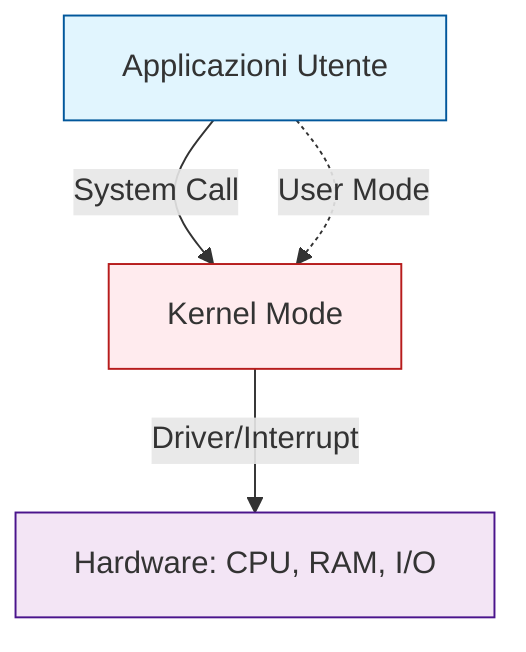
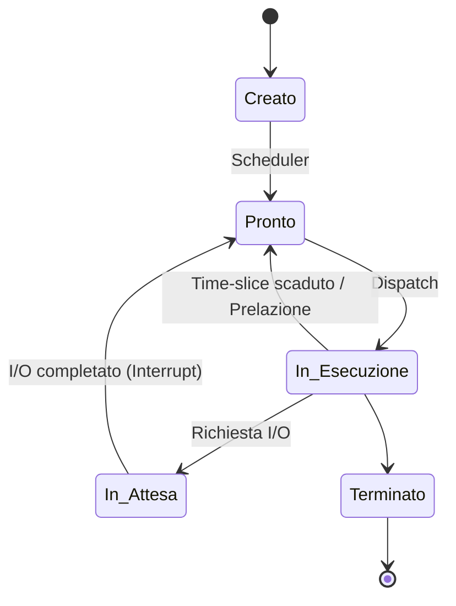
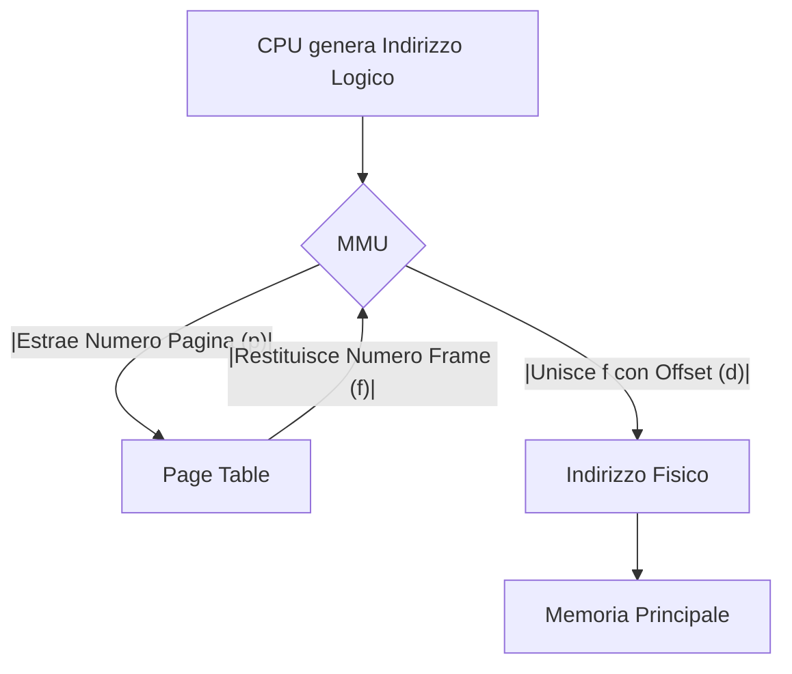

# Sistemi Operativi — Appunti Strutturati
*(Basato sulle lezioni del Prof. Alberto Finzi, Corso di Sistemi Operativi)*

> **Introduzione**:
> I **Sistemi Operativi** rappresentano il fondamento software di qualsiasi calcolatore moderno, fungendo da intermediari tra l'hardware e le applicazioni utente. Questo documento sintetizza i concetti fondamentali del corso, organizzandoli in moduli coerenti che spaziano dall'architettura di base e dalla gestione dei processi, fino alla memoria virtuale, allo scheduling, alla sincronizzazione e ai file system. L'approccio è rigorosamente accademico, con enfasi sulla **correttezza formale**, sull'**analisi delle prestazioni** e sull'**implementazione pratica** nei sistemi Unix-like.

---

## 1. Introduzione e Architettura del Sistema Operativo

### 1.1 Definizione e Obiettivi Fondamentali
**Sistema Operativo (SO)**:
Programma di controllo che gestisce le risorse hardware di un calcolatore, agendo da intermediario tra utente e macchina. È il primo strato software caricato all'avvio.

**Obiettivi principali**:
- **Gestione delle risorse**: Allocazione efficiente di CPU, memoria e periferiche.
- **Astrazione**: Fornire un modello semplificato dell'hardware (es. file system gerarchico, memoria contigua).
- **Controllo dei conflitti**: Risolvere le contese tra processi/utenti concorrenti.
- **Efficienza**: Massimizzare il throughput e minimizzare i tempi di risposta.

### 1.2 Struttura a Strati e Dual Mode
Il SO opera secondo un'architettura a strati che separa nettamente i privilegi di esecuzione.



**Dual Mode (Modalità Duale)**:
La CPU opera sempre in una di due modalità, distinte da un **bit hardware**:
- **Kernel Mode**: Accesso completo all'hardware e alle istruzioni privilegiate.
- **User Mode**: Operazioni limitate; per accedere all'hardware è necessario invocare il kernel tramite *system call*.

> ⚠️ **Attenzione**:
> La transizione tra le modalità è **sempre controllata dal kernel**. Sistemi storici come MS-DOS non implementavano questo bit, rendendo l'intero sistema vulnerabile a programmi utente maliziosi.

### 1.3 Evoluzione Storica dei Sistemi Operativi
| Generazione | Periodo   | Tecnologia         | Caratteristiche SO                                  |
| ----------- | --------- | ------------------ | --------------------------------------------------- |
| **I**       | 1940-1950 | Valvole            | Nessun SO; operatore = programmatore; nasce FORTRAN |
| **II**      | 1950-1960 | Transistor         | Batch processing, spooling, primo monitor residente |
| **III**     | 1960-1970 | Circuiti Integrati | Multiprogrammazione, time-sharing, dual mode, UNIX  |
| **IV**      | 1980      | Personal Computer  | MS-DOS, GUI (Xerox PARC → Apple → Windows)          |
| **V**       | 2000-Oggi | Mobile/Cloud       | iOS, Android, virtualizzazione massiva, cloud OS    |

### 1.4 Meccanismo delle Interruzioni
Le **interruzioni** permettono alla CPU di sospendere temporaneamente l'esecuzione corrente per gestire eventi asincroni, evitando il costoso *polling*.

**Tipologie di interrupt**:

|Tipo | Origine | Sincronia | Esempio |
|---|---|---|---|
| **Hardware Interrupt** | Periferica esterna | Asincrono | Fine trasferimento dati, pressione tasto |
| **Eccezione** | CPU (errore esecuzione) | Sincrono | Division by zero, Segmentation Fault |
| **Trap** | Programma (richiesta esplicita) | Sincrono | System Call, breakpoint debugger |

> **Osservazione**:
> Il **vettore di interruzioni** è una tabella protetta dal kernel che mappa ogni numero di interrupt all'indirizzo della relativa routine di servizio. La sua protezione è critica per la sicurezza del sistema.

### 1.5 La Gerarchia API → ABI → System Call
La comunicazione tra spazio utente e kernel avviene attraverso livelli di astrazione sovrapposti:

```
[Programma C]       → printf("Hello\n")
     ↓
[Standard C Lib]    → write(fd, buf, n)
     ↓
[API POSIX]         → write(fd, buf, n)  ← interfaccia standardizzata
     ↓
[ABI (Machine)]     → syscall(1, ...)    ← istruzione trap
     ↓
[Kernel]            → sys_write()        ← routine di servizio
```

**System Call**:
Istruzione macchina speciale che trasferisce il controllo dal processo utente al kernel. I parametri vengono passati tramite **registri CPU** (approccio moderno) o tramite puntatore a blocco in memoria.

---

## 2. Processi, Thread e Comunicazione

### 2.1 Il Processo: Definizione e Ciclo di Vita
**Processo**:
Programma in esecuzione. Possiede uno spazio di indirizzamento dedicato, un Program Counter (PC), registri e risorse associate.

**Ciclo di vita (Grafo degli Stati)**:


### 2.2 Operazioni Fondamentali: `fork`, `exec`, `wait`
La creazione e gestione dei processi in Unix si basa su tre primitive POSIX:
- **`fork()`**: Duplica il processo chiamante. Restituisce `0` al figlio, `PID > 0` al padre.
- **`exec()`**: Sostituisce l'immagine del processo corrente con un nuovo programma.
- **`wait()`**: Sospende il padre fino alla terminazione del figlio, recuperando lo status di uscita.

> ⚠️ **Attenzione**:
> Un processo terminato ma non ancora `wait()`-ato dal padre diventa uno **Zombie**. Occupa spazio nel PCB ma non risorse CPU/RAM. Se il padre termina prima del figlio, il figlio viene adottato da `init` (PID 1).

### 2.3 Thread: Concetti e Modelli di Mapping
**Thread**:
Unità di esecuzione sequenziale all'interno di un processo. Condividono heap, dati globali e file descriptor, ma possiedono stack e registri dedicati.

**Modelli di Mapping User/Kernel Thread**:

| Modello | Descrizione | Vantaggi | Svantaggi |
|---|---|---|---|
| **Many-to-One** | Molti user thread → 1 kernel thread | Leggero, gestione in user space | Blocco totale se un thread fa I/O; nessun parallelismo |
| **One-to-One** | 1 user thread → 1 kernel thread | Vero parallelismo; isolamento blocchi | Overhead kernel; proliferazione risorse |
| **Many-to-Many** | M user thread → K kernel thread | Flessibilità; pool controllato | Complessità implementativa (richiede LWP/upcall) |

Linux e Windows adottano il modello **one-to-one**.

### 2.4 Concorrenza vs Parallelismo e Legge di Amdahl
**Concorrenza**: Esecuzione alternata di task nello stesso intervallo temporale (possibile su single-core).
**Parallelismo**: Esecuzione simultanea fisica su core distinti.

**Legge di Amdahl**:
Stima lo speedup teorico ottenibile parallelizzando un programma. Sia $S$ la frazione seriale ($0 \leq S \leq 1$):
$$\text{Speedup}(n) = \frac{1}{S + \frac{1-S}{n}}$$
> **Osservazione**:
> Anche con $n \to \infty$, lo speedup è limitato a $1/S$. La componente seriale è il collo di bottiglia architetturale.

### 2.5 Comunicazione tra Processi (IPC)
I processi possono scambiare dati tramite:
1. **Memoria Condivisa**: Regione di RAM accessibile da più processi. Richiede sincronizzazione esplicita.
2. **Message Passing**: Scambio di messaggi tramite canali (pipe, socket).

**Pipe Anonime vs FIFO**:
- **Pipe**: Unidirezionali, solo per processi imparentati, esistono solo in memoria kernel.
- **FIFO (Named Pipe)**: Persistono nel filesystem, permettono comunicazione tra processi non correlati.

---

## 3. Scheduling della CPU

### 3.1 Criteri e Componenti
Lo **Short-term Scheduler** decide quale processo dalla coda *Ready* mandare in CPU. Il **Dispatcher** materializza la decisione (context switch).

**Metriche di valutazione**:
- **Throughput**: Job completati per unità di tempo.
- **Turnaround Time**: Tempo totale da submit a completion.
- **Waiting Time**: Tempo totale in coda Ready.
- **Response Time**: Tempo alla prima risposta (critico per sistemi interattivi).

### 3.2 Algoritmi Tradizionali
| Algoritmo | Meccanismo | Ottimalità | Problemi |
|---|---|---|---|
| **FCFS** | Primo arrivato, primo servito | No | Effetto convoglio (CPU-bound bloccano I/O-bound) |
| **SJF** | Minimo CPU burst stimato | Sì (minimizza waiting time) | Richiede oracolo; starvation processi lunghi |
| **SRTF** | SJF preemptive | Sì | Overhead context switch elevato |
| **Round Robin** | Quanto di tempo $q$ per processo | Equo | Calibrazione $q$ critica (troppo piccolo → overhead) |

**Stima del CPU Burst (Media Esponenziale)**:
$$\tau_{n+1} = \alpha \cdot t_n + (1-\alpha) \cdot \tau_n$$
Dove $t_n$ è il burst effettivo, $\tau_n$ la stima precedente, e $\alpha \in [0,1]$ il fattore di smorzamento.

### 3.3 Scheduling con Priorità e Code Multiple
- **Priorità Fissa**: Numero basso = alta priorità. Rischio di **starvation**. Soluzione: **Aging** (aumentare priorità col tempo di attesa).
- **Multi-Level Feedback Queue**: Code multiple con algoritmi diversi (es. RR per interattivi, FCFS per batch). I processi migrano tra le code in base al comportamento osservato (CPU-bound affondano, I/O-bound salgono).

### 3.4 Scheduling Real-Time
- **Soft Real-Time**: Massima urgenza senza garanzie assolute.
- **Hard Real-Time**: Scadenze garantite (richiede RTOS).

**Rate Monotonic (RMS)**: Priorità statica inversamente proporzionale al periodo $T$. Garantisce le deadline se $\sum \frac{t_i}{T_i} \leq n(2^{1/n}-1)$.
**Earliest Deadline First (EDF)**: Priorità dinamica alla deadline più ravvicinata. Ottimale: se esiste uno scheduling fattibile, EDF lo trova.

### 3.5 Scheduling nei Sistemi Moderni (Linux)
- **CFS (Completely Fair Scheduler)**: Usa un **virtual runtime** ($v_r$) che scorre più lentamente per processi ad alta priorità. Albero rosso-nero per selezione $O(1)$.
- **EEVDF (Linux 6.6+)**: Combina *eligibilità* (fairness passata) con *virtual deadline* (reattività futura). Più reattivo di CFS per workload interattivi.

---

## 4. Sincronizzazione e Deadlock

### 4.1 Il Problema della Sezione Critica
Ogni processo ha una struttura: `Entry → Critical Section → Exit → Remainder`.
Un meccanismo corretto deve garantire:
1. **Mutua Esclusione**: Al più un processo in CS.
2. **Progresso**: La decisione di ingresso non dipende da processi in remainder.
3. **Bounded Waiting**: Limite massimo di ingressi altrui prima del servizio.

### 4.2 Supporto Hardware e Primitive
Le soluzioni software pure (es. Peterson) richiedono **memory barriers** per prevenire il riordino delle istruzioni da parte del compilatore/CPU.
**Istruzioni Atomiche**:
- **Test-and-Set (TAS)**: Legge e setta a `True` atomicamente.
- **Compare-and-Swap (CAS)**: Sostituisce un valore solo se uguale a quello atteso. Fondamentale per strutture *lock-free*.

### 4.3 Mutex, Semafori e Monitor
| Meccanismo | Livello | Descrizione |
|---|---|---|
| **Mutex Lock** | Basso | Acquisizione/release binaria. Leggero, ideale per CS brevi. |
| **Semaforo** | Medio | Variabile intera con `wait()`/`signal()`. Binario (mutex) o contatore ($k$ slot). |
| **Monitor** | Alto | Tipo di dato astratto. Garantisce mutua esclusione strutturalmente sui metodi. |

### 4.4 Variabili di Condizione
Permettono ai thread di sospendersi in attesa di una condizione logica.
```c
pthread_mutex_lock(&mutex);
while (!condizione) {
    pthread_cond_wait(&cond, &mutex); // Rilascia mutex e dorme
}
// Sezione critica
pthread_mutex_unlock(&mutex);
```
> ⚠️ **Attenzione**:
> Usare sempre un `while` loop, non `if`, per proteggersi dai **false awakenings** e dalle race condition sulla valutazione della condizione.

### 4.5 Deadlock e Priority Inversion
**Deadlock**: Attesa circolare permanente. Richiede 4 condizioni (Coffman): mutua esclusione, hold-and-wait, non-prelazione, attesa circolare.
**Priority Inversion**: Processo ad alta priorità bloccato da uno a bassa priorità, mentre uno a media priorità prelaziona il basso. Soluzione: **Priority Inheritance** (il processo che tiene il lock eredita temporaneamente la priorità del bloccato).

---

## 5. Gestione della Memoria

### 5.1 Indirizzi Logici vs Fisici e MMU
La **MMU (Memory Management Unit)** traduce indirizzi logici (generati dalla CPU) in indirizzi fisici (RAM). Questo disaccoppiamento permette la **memoria virtuale** e la protezione dello spazio di indirizzamento.

### 5.2 Paginazione (Paging)
La memoria fisica è divisa in **frame**, quella logica in **pagine** (stessa dimensione, es. 4KB).
- **Vantaggio**: Elimina la frammentazione esterna.
- **Page Table**: Tabella che mappa `pagina[i] → frame[j]`.
- **Frammentazione Interna**: Max `frame_size - 1` byte per processo.

### 5.3 TLB e Effective Access Time (EAT)
La **TLB (Translation Lookaside Buffer)** è una cache hardware associativa per le traduzioni recenti.
$$EAT = \alpha(\epsilon + T_M) + (1-\alpha)(\epsilon + 2T_M)$$
Dove $\alpha$ è l'hit rate, $\epsilon$ il tempo TLB, $T_M$ il tempo memoria. Un hit rate >99% è cruciale per le prestazioni.

### 5.4 Memoria Virtuale e Demand Paging
Le pagine vengono caricate in RAM solo al primo accesso (**Demand Paging**). Un accesso a pagina non residente genera un **Page Fault**, gestito dal kernel che alloca un frame, schedula l'I/O e riavvia l'istruzione.

**Copy-on-Write (COW)**:
Ottimizzazione per `fork()`. Padre e figlio condividono le pagine in read-only. La copia fisica avviene solo quando uno dei due tenta di scrivere.

### 5.5 Algoritmi di Sostituzione e Thrashing
| Algoritmo | Criterio | Note |
|---|---|---|
| **FIFO** | Primo entrato, primo uscito | Soffre dell'anomalia di Belady |
| **OPT** | Mai usato nel futuro | Teorico, benchmark ottimale |
| **LRU** | Meno usato nel passato | Stack algorithm; costoso da implementare puro |
| **Clock** | Approssimazione LRU (Reference Bit) | Standard nei SO moderni |

**Thrashing**: Fenomeno in cui il sistema spende più tempo a swap pagine che a eseguire istruzioni, causato da un grado di multiprogrammazione eccessivo rispetto alla RAM disponibile. Si previene regolando dinamicamente i **Working Set**.

---

## 6. Sistemi di I/O e Storage

### 6.1 Architettura a Strati e Classificazione
Il sottosistema I/O è strutturato in: `System Call API → Device Independent OS → Drivers → Interrupt Handlers → Hardware`.
- **Block Devices**: Accesso randomico a blocchi fissi (HDD, SSD).
- **Character Devices**: Flusso sequenziale di byte (TTY, tastiera).

### 6.2 Dischi Magnetici (HDD) vs SSD
| Caratteristica | HDD | SSD (NAND Flash) |
|---|---|---|
| **Accesso** | Meccanico (Seek + Rotational Latency) | Elettronico (accesso random veloce) |
| **Scrittura** | Sovrascrittura diretta | Cancellazione a blocco → riscrittura a pagina |
| **Usura** | Bassa | Limitata (P/E cycles); richiede Wear Leveling |
| **Scheduling** | Critico (SSTF, SCAN, C-LOOK) | Inutile (NOOP/Deadline sufficiente) |

### 6.3 Affidabilità e RAID
**RAID (Redundant Array of Independent Disks)** combina dischi per performance o ridondanza:
- **RAID 0**: Striping (massima velocità, zero tolleranza).
- **RAID 1**: Mirroring (massima affidabilità, 50% spazio utile).
- **RAID 5/6**: Striping + parità distribuita (tolleranza 1/2 guasti).

---

## 7. File System

### 7.1 Architettura Logica e Metadati
Il File System astrae i blocchi disco in file e directory. I metadati sono gestiti tramite **Inode** (Unix) o **MFT** (NTFS).
L'Inode contiene: permessi, timestamp, puntatori ai blocchi dati, ma **non il nome del file**.

**Tabelle dei File Aperti**:
1. **Per-Process FD Table**: Mappa interi (0,1,2...) a entry globali.
2. **System-wide Open File Table**: Contiene offset corrente, flags, puntatore all'Inode.
3. **In-Memory Inode Cache**: Copia RAM dei metadati persistenti.

### 7.2 Allocazione dei Blocchi e Inode
L'Inode Unix usa indirizzamento ibrido:
- **Diretto**: 12 puntatori immediati (accesso $O(1)$).
- **Indiretto Singolo/Doppio/Triplo**: Blocchi indice a cascata per file enormi.

### 7.3 Consistenza e Journaling
In caso di crash, le modifiche ai metadati possono rimanere a metà. Il **Journaling** registra le intenzioni di modifica in un log circolare prima di applicarle al disco principale. Al riavvio, il SO *replaya* le transazioni commitate o *unda* quelle incomplete, garantendo consistenza strutturale in pochi secondi.

---

## 8. Ambiente di Sviluppo e Shell Unix

### 8.1 La Shell e Redirezione
La shell (es. Bash) è un interprete comandi in user space. Supporta:
- **Redirezione**: `>` (overwrite), `>>` (append), `<` (input).
- **Pipe**: `|` connette lo stdout di un comando allo stdin del successivo.
- **Background**: `&` esegue il comando asincronamente.

### 8.2 Processo di Compilazione
1. **Preprocessore**: Espande macro (`#define`), include header.
2. **Compilatore**: Traduce C in assembly.
3. **Assemblatore**: Genera codice macchina (file oggetto `.o`).
4. **Linker**: Unisce oggetti e librerie in eseguibile (`ELF` su Linux).

**Linking Statico vs Dinamico**:
- **Statico** (`.a`): Codice libreria incorporato nell'eseguibile.
- **Dinamico** (`.so`): Riferimenti risolti a runtime dal *dynamic linker*. Risparmia memoria e permette aggiornamenti trasparenti.

---

## 📝 Esercizi Proposti per lo Studio

1. **Scheduling**: Dati i processi $P_1(arr.0, burst=8), P_2(arr.1, burst=4), P_3(arr.2, burst=9)$, calcolare il tempo medio di attesa usando **SRTF** e confrontarlo con **Round Robin** (quanto=4). Disegnare il diagramma di Gantt.
2. **Sincronizzazione**: Implementare in C la soluzione al problema del **Produttore-Consumatore** usando 3 semafori POSIX (`mutex`, `empty`, `full`) e una buffer circolare di dimensione $N$.
3. **Memoria Virtuale**: Spiegare come funziona il meccanismo **Copy-on-Write** durante una `fork()` seguita da `exec()`. Perché è più efficiente della duplicazione fisica immediata?
4. **File System**: Analizzare la struttura di un **Inode Unix** con 10 puntatori diretti, 1 singolo, 1 doppio e 1 triplo indiretto. Calcolare la dimensione massima teorica di un file assumendo blocchi da 4KB e indirizzi a 32 bit.
5. **System Call**: Scrivere un programma C che usa `open()`, `fork()`, `write()` e `read()` per far comunicare padre e figlio tramite un file condiviso. Discutere il comportamento dell'offset del file in entrambi i casi: `open()` prima e dopo la `fork()`.

> **Riferimenti Incrociati**:
> - Per dettagli sulla gestione dei segnali in contesto multi-thread, Vedi Sezione 2.5.
> - Per l'analisi delle prestazioni della TLB e formule EAT, Vedi Sezione 5.3.
> - Per la prevenzione del deadlock tramite ordinamento delle risorse, Vedi Sezione 4.5.

## 9. Avvio del Sistema e Gestione dello Swap

### 9.1 Il Processo di Bootstrap
Il **Bootstrap** è la sequenza di operazioni che porta il Sistema Operativo dalla memoria secondaria (disco) alla RAM, permettendone l'esecuzione.

#### Architettura Legacy: BIOS + MBR
- **BIOS (Basic Input/Output System)**: Firmware che esegue il POST (*Power-On Self-Test*) e cerca il dispositivo di boot.
- **MBR (Master Boot Record)**: I primi 512 byte del disco.
  - Contiene il *Boot Code* (446 byte) e la *Partition Table* (max 4 partizioni primarie).
  - **Limiti**: Supporta dischi fino a ~2.2 TB; indirizzamento a 32 bit.

#### Architettura Moderna: UEFI + GPT
- **UEFI (Unified Extensible Firmware Interface)**: Sostituisce il BIOS. Supporta mouse, rete pre-boot e interfaccia grafica.
- **GPT (GUID Partition Table)**:
  - Supporta partizioni a 64 bit (dischi enormi, >128 partizioni).
  - Include una copia di backup della tabella per la ridondanza.
  - **ESP (EFI System Partition)**: Partizione speciale (FAT32) contenente i bootloader (`.efi`).

### 9.2 Gestione dello Swap Space
Lo **Swap Space** è l'area su disco utilizzata come estensione della memoria fisica (*Backing Store*).
- **Raw Partition**: Area dedicata non formattata. Accesso diretto, minor overhead.
- **Swap File**: File regolare all'interno del file system. Più flessibile (ridimensionabile dinamicamente).
- **Swap Map**: Tabella mantenuta in RAM dal kernel per tracciare quali blocchi dello swap sono liberi o occupati, permettendo un rapido recupero durante un *Page Fault*.

---

## 10. Affidabilità e Storage Avanzato

### 10.1 Architetture RAID
**RAID (Redundant Array of Independent Disks)** combina più dischi fisici per migliorare le prestazioni, l'affidabilità o entrambi.

| Livello | Tecnica | Descrizione | Pro | Contro |
|---|---|---|---|---|
| **RAID 0** | Striping | Dati divisi su più dischi. | Massima velocità, 100% spazio. | Zero tolleranza ai guasti. |
| **RAID 1** | Mirroring | Duplicazione esatta dei dati. | Alta affidabilità, lettura veloce. | 50% spazio utile. |
| **RAID 5** | Striping + Parità | Parità distribuita su tutti i dischi. | Tolleranza a 1 guasto, efficienza. | Write penalty (calcolo parità). |
| **RAID 6** | Doppia Parità | Due blocchi di parità indipendenti. | Tolleranza a **2 guasti**. | Overhead scrittura maggiore. |
| **RAID 10** | Mirror + Stripe | Strisce di mirror. | Alta perf. + Alta affidabilità. | Costo elevato (50% spazio). |

### 10.2 Rilevamento e Correzione Errori
I dispositivi di storage utilizzano codici per garantire l'integrità dei dati contro la degradazione fisica.
- **Parity Bit**: Rileva errori a singolo bit (rende pari il numero di 1). Non corregge.
- **ECC (Error Correction Code)**: Es. **Codice di Hamming**. Aggiunge ridondanza per correggere errori automaticamente.
  - **SEC-DED**: *Single Error Correction, Double Error Detection*. Corregge 1 bit, rileva 2.
  - Se l'errore è incorrreggibile, il blocco viene marcato come *Bad Block* e rimappato.

---

## 11. File System: Strutturazione e Allocazione

### 11.1 Metodi di Allocazione dei File
Il metodo di allocazione determina come i blocchi di un file sono distribuiti fisicamente sul disco.

| Metodo | Descrizione | Vantaggi | Svantaggi |
|---|---|---|---|
| **Contigua** | Blocchi adiacenti. | Accesso sequenziale/diretto ottimo. | Frammentazione esterna; difficile espansione. |
| **Concatenata** | Lista di blocchi sparsi. | Nessuna frammentazione; espansione facile. | Accesso diretto lento; overhead puntatori. |
| **Indicizzata** | Blocco indice con puntatori. | Accesso diretto efficiente; nessuna frammentazione. | Overhead del blocco indice. |

> **Osservazione**:
> Il **FAT (File Allocation Table)** è una variante dell'allocazione concatenata dove i puntatori sono spostati in una tabella centrale in RAM, migliorando l'affidabilità e la velocità di accesso.

### 11.2 Hard Link vs Symbolic Link
| Caratteristica | Hard Link | Symbolic Link (Soft) |
|---|---|---|
| **Definizione** | Un altro nome per lo stesso Inode. | File speciale contenente il percorso del target. |
| **Inode** | Condiviso. | Distinto. |
| **Target** | Solo file (solitamente). | File o directory. |
| **Cross-FS** | No. | Sì. |
| **Validità** | Indipendente dal nome originale. | Diventa "rotto" se il target viene cancellato. |

### 11.3 Affidabilità: Journaling
Il **Journaling** previene la corruzione del file system in caso di crash improvviso.
1. **Write to Journal**: Le intenzioni di modifica ai metadati vengono scritte in un log circolare.
2. **Commit**: La transazione viene marcata come impegnata.
3. **Checkpoint**: Le modifiche vengono applicate ai metadati reali.
4. **Recovery**: Al riavvio, il SO *replaya* le transazioni completate o *unda* quelle incomplete.

---

## 12. I/O di Basso Livello e Architettura VFS

### 12.1 System Call Fondamentali
Le API POSIX forniscono un'interfaccia uniforme per l'I/O:
- **`open(pathname, flags, mode)`**: Restituisce un File Descriptor (FD). Flags comuni: `O_CREAT`, `O_TRUNC`, `O_APPEND`.
- **`read(fd, buf, count)` / `write(fd, buf, count)`**: Lettura/scrittura di byte. Aggiornano l'offset corrente.
- **`lseek(fd, offset, whence)`**: Modifica l'offset senza effettuare I/O. Permette accesso randomico.
- **`close(fd)`**: Rilascia le risorse e flush dei buffer kernel.

### 12.2 Sparse Files
I **Sparse Files** permettono di avere una dimensione logica maggiore di quella fisica.
- Quando si usa `lseek()` per saltare una regione e si scrive oltre, il kernel non alloca blocchi fisici per la regione intermedia ("hole").
- I "buchi" leggono come zeri (`\0`) ma non occupano spazio su disco.

### 12.3 Architettura a Strati del File System
Il file system è organizzato per favorire l'astrazione:
1. **Logical File System**: Gestisce API utente, permessi e directory logiche.
2. **File Organization Module**: Traduce indirizzi logici in fisici (allocazione blocchi).
3. **Basic File System**: I/O generici su blocchi fisici.
4. **Device Drivers**: Interfaccia specifica con l'hardware.

**Virtual File System (VFS)**:
Livello di astrazione che permette al kernel di supportare diversi file system (ext4, NTFS, FAT) contemporaneamente, presentando un'interfaccia uniforme alle applicazioni tramite strutture virtuali (Vnode).

### 12.4 Sottosistema I/O e Line Discipline
- **Block Devices**: Accesso randomico (dischi).
- **Character Devices**: Flusso sequenziale (tastiera, terminali).
- **Line Discipline**: Livello software per i terminali (TTY) che gestisce l'editing della riga, la conversione dei caratteri (es. `CR` → `LF`) e i segnali (es. `Ctrl+C` invia `SIGINT`).

---

## 📝 Esercizi Avanzati Proposti

1. **RAID e Affidabilità**:
   In un array **RAID 5** composto da 4 dischi da 1 TB ciascuno, calcolare:
   - La capacità totale utile dell'array.
   - La capacità residua e lo stato dell'array in caso di guasto di un disco.
   - Cosa accade se falliscono contemporaneamente due dischi?

2. **Calcolo Inode e Allocazione**:
   Dato un Inode con 10 puntatori diretti, 1 singolo, 1 doppio e 1 triplo indiretto, e una dimensione di blocco di 4 KB (32 bit per i puntatori):
   - Qual è la dimensione massima teorica di un file gestibile?
   - Quanti accessi a disco sono necessari per leggere l'ultimo byte di un file molto grande?

3. **System Call e Offset**:
   Si consideri il seguente codice C:
   ```c
   int fd = open("file.txt", O_RDWR | O_CREAT, 0644);
   if (fork() == 0) {
       write(fd, "Hello", 5);
       exit(0);
   }
   wait(NULL);
   char buf[10];
   read(fd, buf, 5); // Legge cosa?
   ```
   Spiegare perché la `read()` nel padre potrebbe non leggere "Hello" e come correggere il comportamento usando `lseek()`.

4. **Journaling e Consistenza**:
   Descrivere la sequenza di operazioni che il file system esegue quando si effettua un `mv` (spostamento) di un file tra due directory diverse su un file system journaling. Cosa viene registrato nel journal prima della modifica effettiva?

---

> **Riferimenti Incrociati**:
> - Per il confronto tra allocazione contigua e indicizzata, Vedi Sezione 11.1.
> - Per i dettagli sulla gestione della memoria virtuale e swap, Vedi Sezione 9.2.
> - Per l'architettura a strati del SO e i driver, Vedi Sezione 12.3.

## 13. Struttura del Kernel e Virtualizzazione

### 13.1 Principio di Separazione: Policy vs Meccanismo
Un principio fondamentale nella progettazione dei sistemi operativi è la distinzione tra **meccanismo** e **policy**.
- **Meccanismo**: *Come* si fa qualcosa (lo strumento tecnico).
- **Policy**: *Cosa* si fa (la decisione strategica).

> **Osservazione**:
> Separare i due permette di modificare le politiche (es. algoritmo di scheduling) senza dover riscrivere i meccanismi di base (es. il timer hardware).
> - *Esempio*: Il **meccanismo** è il timer hardware che genera interruzioni; la **policy** è la decisione di assegnare 10ms di tempo a un processo interattivo e 100ms a uno batch.

### 13.2 Paradigmi di Progettazione del Kernel
| Tipo di Kernel | Descrizione | Vantaggi | Svantaggi |
|---|---|---|---|
| **Monolitico** | Tutte le funzionalità (scheduling, memoria, driver) risiedono in kernel space. | Alta velocità (chiamate dirette); nessuna syscall overhead. | Difficile da mantenere; bug nei driver possono crashare tutto il sistema. |
| **Microkernel** | Solo il minimo vitale (IPC, scheduling base) è in kernel; servizi in user space. | Alta modularità e sicurezza; crash di un servizio non ferma il SO. | Overhead elevato (passaggio messaggi costante); complessità implementativa. |
| **Modulare** | Kernel base + moduli caricabili dinamicamente (es. driver, FS). | Flessibilità (Linux); aggiornamento senza riavvio. | Complessità di gestione delle dipendenze. |
| **Ibrido** | Compromesso tra monolitico e microkernel (es. Windows NT, macOS XNU). | Bilancia prestazioni e modularità. | Complessità architetturale. |

### 13.3 Virtualizzazione
La **virtualizzazione** permette di eseguire più sistemi operativi sullo stesso hardware fisico, isolandoli a vicenda.
- **Tipo 1 (Bare Metal)**: L'ipervisore gira direttamente sull'hardware (es. VMware ESXi, Xen).
- **Tipo 2 (Hosted)**: L'ipervisore gira come applicazione su un SO host (es. VirtualBox, VMware Workstation).

---

## 14. Gestione dei Segnali e Cancellazione dei Thread

### 14.1 Segnali in Contesto Multi-thread
I segnali sono notifiche asincrone inviate a processi o thread specifici.
- **Maschere di Segnali**: Ogni thread può bloccare segnali specifici tramite `pthread_sigmask`.
- **Segnali Pending**:
  - I segnali **ordinari** (es. `SIGUSR1`) **non si accodano**: se un segnale è già pending, nuovi invii vengono ignorati (collassati).
  - I segnali **real-time** (`SIGRTMIN`...`SIGRTMAX`) **si accodano** e vengono consegnati tutti in sequenza.

> ⚠️ **Attenzione**:
> Se si imposta una maschera di blocco *prima* di creare i thread, questa viene **ereditata** da tutti i thread figli. Se impostata *dopo*, vale solo per il thread chiamante.

### 14.2 Cancellazione dei Thread
La cancellazione (`pthread_cancel`) termina un thread forzatamente.
- **Deferred (Differita)**: La cancellazione avviene solo in un **cancellation point** (es. `sleep`, I/O, `pthread_testcancel`). È il comportamento default e più sicuro.
- **Asynchronous**: Il thread può essere cancellato in qualsiasi istruzione. Rischioso (può lasciare strutture dati inconsistenti o mutex bloccati).

---

## 15. Gestione Avanzata della Memoria del Kernel

### 15.1 Buddy System
Allocatore di memoria fisica usato dal kernel per gestire blocchi di grandi dimensioni.
- **Meccanismo**: Alloca blocchi di dimensione potenza di 2 ($2^n$ pagine).
- **Fusione**: Quando un blocco viene liberato, il sistema controlla se il suo "buddy" (blocco adiacente di stessa dimensione) è libero. Se sì, li fonde in un blocco più grande.
- **Vantaggio**: Riduce la frammentazione esterna e semplifica la deallocazione.

### 15.2 Slab Allocator
Gestisce oggetti kernel piccoli e frequenti (es. PCB, Inode, socket) sopra il Buddy System.
- **Struttura**:
  - **Cache**: Contiene oggetti dello stesso tipo.
  - **Slab**: Insieme di pagine fisiche contigue contenenti istanze pre-inizializzate.
- **Vantaggio**: Elimina l'overhead di inizializzazione per ogni allocazione e riduce la frammentazione interna.

### 15.3 Compressione della Memoria
Nei sistemi moderni (specialmente mobile), invece di scrivere pagine sporche su disco (swap lento e usura SSD), il kernel le **comprime** e le mantiene in RAM.
- **Trade-off**: Si scambiano cicli CPU e spazio RAM per guadagnare in latenza e durata dell'hardware.

---

## 16. Architetture di Memoria Hardware (Intel e ARM)

### 16.1 Intel x86: Segmentazione e Paging
- **Segmentazione**: L'indirizzo logico è `(Selettore, Offset)`. Il selettore punta alla **GDT** (Global Descriptor Table) o **LDT**.
- **Paging Gerarchico**:
  - **32-bit**: 2 livelli (Directory + Table). Supporta **PAE** (Physical Address Extension) per indirizzare fino a 64GB di RAM fisica.
  - **64-bit**: 4 livelli (PML4 → PDPT → PD → PT). Supporta **Huge Pages** (2MB, 1GB) per ridurre l'overhead TLB.

### 16.2 Architettura ARM v8
- Supporta pagine da 4KB, 16KB e 64KB.
- **TLB Separate**: I-TLB (istruzioni) e D-TLB (dati) a livello L1, unificate a L2.
- **Paging Structure Cache**: Cache dedicate per le strutture delle page table, riducendo il costo del *page table walk*.

---

## 17. Caching e Ottimizzazione delle Prestazioni I/O

### 17.1 Il Problema del Double Caching
Storicamente, Linux manteneva due cache separate:
1. **Buffer Cache**: Per blocchi disco grezzi.
2. **Page Cache**: Per memoria virtuale.
Questo causava duplicazione dei dati se un file veniva accesso sia via `read()` che via `mmap()`.

### 17.2 Unified Page Cache
Nei kernel moderni, le due cache sono fuse in una **Unified Page Cache**.
- I blocchi disco sono trattati come pagine di memoria virtuale.
- Sia le system call I/O che la memoria mappata accedono alle stesse pagine in RAM, garantendo coerenza e risparmio di spazio.

### 17.3 Read-Ahead e Pre-paging
- **Read-Ahead**: Il kernel rileva accessi sequenziali e precarica in cache i blocchi successivi per nascondere la latenza del disco.
- **Pre-paging**: Caricamento anticipato di pagine di memoria virtuale non ancora richieste (utile per codice sequenziale, meno per dati casuali).

---

## 📝 Esercizi Avanzati Proposti

1. **Kernel Memory Management**:
   Spiegare la differenza tra **Buddy System** e **Slab Allocator**. Perché il kernel non usa solo il Buddy System per allocare un `task_struct`?

2. **Virtualizzazione**:
   Confrontare un ipervisore di **Tipo 1** e uno di **Tipo 2** in termini di overhead di prestazioni e isolamento. Qual è l'impatto sulle system call di un guest OS?

3. **Unified Page Cache**:
   Descrivere cosa succede a livello di cache quando un processo esegue `mmap()` su un file già presente nella buffer cache. Come il kernel garantisce la coerenza dei dati?

4. **Architetture Intel**:
   Dato un indirizzo logico a 32 bit con paging a due livelli (10 bit directory, 10 bit table, 12 bit offset), calcolare quanti accessi a memoria sono necessari per risolvere l'indirizzo fisico in assenza di TLB hit.

---

> **Riferimenti Incrociati**:
> - Per i dettagli sulla gestione della memoria virtuale e swap, Vedi Sezione 9.2.
> - Per l'analisi delle prestazioni della TLB e formule EAT, Vedi Sezione 5.3.
> - Per la prevenzione del deadlock tramite ordinamento delle risorse, Vedi Sezione 4.5.
> - Per il confronto tra allocazione contigua e indicizzata, Vedi Sezione 11.1.

## 18. Laboratorio di Sistemi: Programmazione POSIX

### 18.1 Ambiente di Sviluppo e Compilazione
Il processo di compilazione in C separa le fasi di traduzione e collegamento.
- **Preprocessore**: Espande macro e include header (`#include`, `#define`).
- **Compilatore**: Traduce il codice sorgente in assembly.
- **Linker**: Unisce i file oggetto (`.o`) nelle librerie finali.

**Comandi GCC Fondamentali**:
```bash
gcc -c file.c          # Compila in file oggetto (senza linking)
gcc file.c -o app      # Compila e linka in eseguibile
gcc file.c -lpthread   # Necessario per linkare le librerie dei thread
gcc file.c -O2         # Ottimizzazione del codice (per misurare le performance reali)
```

### 18.2 Gestione dei Processi e I/O di Basso Livello
Le system call POSIX offrono un controllo fine sui file descriptor.

**Apertura File (`open`)**:
- `O_CREAT`: Crea il file se non esiste (richiede permessi es. `0644`).
- `O_TRUNC`: Tronca il file a lunghezza zero (sovrascrittura).
- `O_APPEND`: Posiziona l'offset alla fine prima di ogni scrittura (atomico).

**Spostamento Offset (`lseek`)**:
- `lseek(fd, offset, SEEK_SET)`: Assoluto dall'inizio.
- `lseek(fd, offset, SEEK_CUR)`: Relativo alla posizione corrente.
- **Sparse Files**: Usare `lseek` per saltare grandi regioni senza scrivere crea "buchi" che non occupano spazio su disco.

### 18.3 Programmazione Concorrente (Thread e Sincronizzazione)
**Creazione Thread**:
```c
pthread_t tid;
pthread_create(&tid, NULL, funzione_start, argomento);
pthread_join(tid, NULL); // Fondamentale per evitare race condition alla terminazione
```

**Protezione Sezioni Critiche**:
- **Mutex**: Per l'accesso esclusivo a variabili condivise.
  ```c
  pthread_mutex_lock(&m);
  // Sezione critica (es. counter++)
  pthread_mutex_unlock(&m);
  ```
- **Condition Variables**: Per la comunicazione tra thread (produttore-consumatore).
  - Regola d'oro: Usare sempre un ciclo `while` per verificare la condizione dopo il `wait`.

### 18.4 Comunicazione tra Processi (IPC)
- **Pipe Anonime**: `pipe(fd)` crea due file descriptor (lettura/scrittura) per processi imparentati. La `read()` blocca se la pipe è vuota; la `write()` genera `SIGPIPE` se non ci sono lettori.
- **Shared Memory (`mmap`)**:
  1. `shm_open()`: Crea/apre oggetto di memoria.
  2. `ftruncate()`: Imposta dimensione.
  3. `mmap()`: Mappa nello spazio virtuale del processo.
  - Richiede sincronizzazione esterna (es. semafori) poiché `mmap` da sola non è atomica.

---

## 19. Analisi degli Algoritmi Critici

### 19.1 Soluzione di Peterson (Mutua Esclusione Software)
Soluzione teorica per due processi $P_i$ e $P_j$ che soddisfa mutua esclusione, progresso e bounded waiting.

**Logica**:
1. Ogni processo imposta `flag[i] = TRUE` (voglio entrare).
2. Cede il turno all'altro: `turn = j`.
3. Entrano solo se l'altro non vuole entrare oppure il turno è loro.

```c
// Codice per Pi
flag[i] = TRUE;
turn = j;
while (flag[j] && turn == j) { /* busy waiting */ }
// Sezione Critica
flag[i] = FALSE;
```

### 19.2 Problema dei 5 Filosofi
Soluzione che evita il deadlock usando una variabile di condizione per ogni filosofo e uno stato esplicito.
- **Stati**: `THINKING`, `HUNGRY`, `EATING`.
- **Funzione `test(i)`**: Verifica se il filosofo $i$ può mangiare (vicini non stanno mangiando). Se sì, lo mette in `EATING` e fa `signal(&cond[i])`.
- **Prevenzione Deadlock**: L'uso di un mutex globale per modificare gli stati e le condition variable individuali impediscono l'attesa circolare indefinita.

### 19.3 Algoritmo Clock (Sostituzione Pagine)
Approssimazione efficiente di LRU usata nei SO moderni.
1. Le pagine sono in una lista circolare con un bit di riferimento (R).
2. **Hand (Lancetta)**: Scorre le pagine.
   - Se `R=1`: La pagina è stata usata di recente. Si imposta `R=0` (si dà una "seconda chance") e si passa alla successiva.
   - Se `R=0`: La pagina non è usata. Viene scelta come **vittima**.
3. **Enhanced Clock**: Considera anche il bit Dirty (M). Preferisce espellere pagine con `(R=0, M=0)` (non usate e non modificate) per evitare costose scritture su disco.

---

## 20. Sottosistema I/O e Dispositivi

### 20.1 Classificazione dei Dispositivi
| Tipo | Descrizione | Esempi | Operazioni |
|---|---|---|---|
| **Block Devices** | Accesso randomico a blocchi fissi. | HDD, SSD, USB | `read`, `write`, `seek` |
| **Character Devices** | Flusso sequenziale byte per byte. | Tastiera, Mouse, TTY | `read`, `write` |
| **Network Devices** | Comunicazione tramite socket. | Ethernet, WiFi | `send`, `recv`, `bind` |

### 20.2 Line Discipline
Livello software tra il driver del terminale e l'utente.
- Gestisce l'editing della riga (backspace, cancellazione).
- Converte caratteri di controllo (es. `Ctrl+C` → `SIGINT`).
- Permette di configurare il comportamento del terminale (echo, canonical mode).

---

## 21. Manuale di Calcolo per l'Esame

### 21.1 Metriche di Scheduling
- **Turnaround Time** = Tempo Fine - Tempo Arrivo.
- **Waiting Time** = Turnaround Time - Burst Time.
- **Response Time** = Tempo Prima Esecuzione - Tempo Arrivo.

### 21.2 Gestione della Memoria
**Calcolo Bit Page Table**:
- Numero bit Indirizzo Logico = $\log_2(\text{Spazio Virtuale})$.
- Numero bit Offset = $\log_2(\text{Dimensione Pagina})$.
- Numero bit Indice Pagina = Bit Logico - Bit Offset.
- Numero Entry Page Table = $2^{\text{Bit Indice}}$.

**Effective Access Time (EAT)**:
$$EAT = \alpha(\epsilon + T_m) + (1-\alpha)(\epsilon + 2T_m)$$
*(Dove $\alpha$ = hit rate, $\epsilon$ = tempo TLB, $T_m$ = tempo memoria)*.

### 21.3 Affidabilità e Errori
**MTTF di un Array**:
Se un disco ha MTTF $M$ e l'array ha $N$ dischi:
$$MTTF_{sistema} = \frac{M}{N}$$

**Codice di Hamming (ECC)**:
Per correggere errori a singolo bit su $k$ bit di dati, servono $r$ bit di ridondanza tali che:
$$2^r \geq k + r + 1$$

---

## 22. Glossario Rapido dei Termini Tecnici

- **Context Switch**: Cambio di processo; salva stato vecchio, carica stato nuovo.
- **Deadlock**: Attesa circolare indefinita tra processi per risorse.
- **Page Fault**: Eccezione generata quando si accede a pagina non in RAM.
- **Thrashing**: Saturazione della CPU in gestione swap per mancanza di RAM.
- **VFS (Virtual File System)**: Astrazione che unifica diversi file system.
- **Working Set**: Insieme di pagine attive di un processo in un intervallo di tempo.
- **Copy-on-Write**: Ottimizzazione che ritarda la copia della memoria alla prima scrittura.

---

# 23. Gestione della Memoria e Paging
*(Basato sulla Lezione 15: Memoria Principale, Binding degli Indirizzi, Frammentazione e Paging)*

> **Introduzione**:
> La **gestione della memoria** è una delle funzioni critiche del Sistema Operativo. Mentre la CPU esegue istruzioni, i programmi e i dati devono risiedere nella **memoria principale** (RAM). In questo capitolo, analizzeremo la distinzione tra memoria logica e fisica, il problema storico del **binding degli indirizzi**, le forme di **frammentazione** e come il meccanismo di **paginazione** (paging) risolva definitivamente il problema della contiguità fisica.

---

## 23.1 Background: Accesso alla Memoria e Protezione
La CPU può interagire direttamente solo con i propri **registri** e la **memoria principale**. Ogni processo, per essere eseguito, deve essere caricato (almeno parzialmente) in RAM.

**Ciclo di esecuzione ad alto livello**:
1. La CPU carica le istruzioni indicate dal **Program Counter**.
2. Le decodifica ed esegue.
3. Scrive risultati in memoria principale o effettua chiamate di I/O.

La memoria principale può essere vista come un grande **array di byte**, dove ogni byte ha un indirizzo unico. Per garantire la stabilità del sistema, il SO deve assicurare:
- **Protezione**: Ogni processo ha l'uso esclusivo delle proprie zone di memoria. Questo è garantito da supporti hardware (bit di modalità kernel/user e registri di limite).
- **Accelerazione**: L'accesso alla RAM è lento rispetto alla CPU; si utilizzano strutture intermedie (cache) per ottimizzare le prestazioni.

> **Osservazione**:
> Un processo utente standard non può violare le protezioni strutturali della memoria. Eventuali condivisioni (es. *Shared Memory*) devono essere esplicitamente concesse e gestite dal kernel.

---

## 23.2 Il Problema del Binding degli Indirizzi
Il **binding** è l'associazione degli indirizzi simbolici/logici agli indirizzi fisici reali nella RAM.

### 23.2.1 Momenti del Binding
Il binding può avvenire in tre momenti distinti:
1. **Tempo di Compilazione**: Si genera codice assoluto. Richiede che la posizione in memoria sia nota a priori (rigido e raro).
2. **Tempo di Caricamento**: Si genera codice rilocabile. Il *Loader* somma l'indirizzo base all'indirizzo relativo durante il caricamento.
3. **Tempo di Esecuzione (Runtime)**: Metodo usato nei sistemi moderni. Gli indirizzi rimangono logici fino all'accesso effettivo, richiedendo supporto hardware speciale.

### 23.2.2 Indirizzi Logici vs Fisici e la MMU
Nei sistemi moderni esiste una netta separazione:
- **Indirizzi Logici (Virtuali)**: Generati dalla CPU. Il processo vede uno spazio di indirizzamento contiguo che parte da 0.
- **Indirizzi Fisici**: Gli indirizzi reali della RAM.

La traduzione avviene tramite la **MMU (Memory Management Unit)**, un modulo hardware integrato nella CPU. La traduzione è trasparente per il processo utente e avviene in tempo reale.

---

## 23.3 Allocazione Contigua e Frammentazione
Prima dell'avvento del paging, si utilizzava l'**allocazione contigua**. La memoria era suddivisa in blocchi contigui assegnati ai processi.

### 23.3.1 Strategie di Allocazione
- **First Fit**: Assegna il primo "buco" libero sufficientemente grande.
- **Best Fit**: Assegna il buco più aderente alla richiesta.
- **Worst Fit**: Assegna il buco più grande disponibile.

### 23.3.2 Tipi di Frammentazione
| Tipo | Descrizione | Conseguenza |
|------|-------------|-------------|
| **Frammentazione Esterna** | La memoria libera è frammentata in piccoli buchi sparsi, insufficienti per nuove allocazioni anche se la somma totale è adeguata. | Fino al 50% di memoria persa a regime. Richiederebbe *compattazione* (costosa a runtime). |
| **Frammentazione Interna** | Lo spazio inutilizzato *all'interno* di un blocco allocato (es. l'ultimo blocco non viene riempito completamente). | Spreco di spazio proporzionale alla granularità dell'allocazione. |

---

## 23.4 La Paginazione (Paging)
Il **Paging** elimina la necessità di contiguità fisica, risolvendo la frammentazione esterna.

### 23.4.1 Definizione
- La memoria fisica è divisa in blocchi fissi di uguale dimensione chiamati **Frame** (es. 4KB, 2MB).
- La memoria logica è divisa in blocchi della stessa dimensione chiamati **Pagine**.

**Vantaggi**:
- Una pagina logica può essere mappata in qualsiasi frame fisico libero.
- **Elimina la frammentazione esterna**.
- Rimane solo la frammentazione interna (massimo un frame meno 1 byte per processo).

### 23.4.2 Traduzione degli Indirizzi
L'indirizzo logico è suddiviso in:
1. **Numero di Pagina ($p$)**: Indice nella **Page Table**.
2. **Offset ($d$)**: Spostamento all'interno della pagina.

**Meccanismo di traduzione**:
1. La CPU genera `<p, d>`.
2. La MMU usa $p$ per cercare il numero di **Frame ($f$)** nella Page Table.
3. L'indirizzo fisico diventa `<f, d>`. L'offset rimane invariato.

> **Esempio di calcolo bit**:
> Se lo spazio logico è $2^{30}$ byte (1 GB) e la pagina è $2^{12}$ byte (4 KB):
> - Bit per l'offset = $12$.
> - Bit per il numero di pagina = $30 - 12 = 18$.
> - Numero di pagine totali = $2^{18}$.



---

## 23.5 Esercizi Proposti
1. **Calcolo Entry Page Table**: Dato uno spazio di indirizzi logici a 14 bit e pagine di 2 KB, quante entry avrà la tabella delle pagine? *(Soluzione: $2^{14-11} = 8$ entry)*.
2. **Dimensione Pagina**: Se lo spazio logico è a 15 bit e il sistema ha 8 pagine, quanto sono grandi le pagine? *(Soluzione: $2^{15}/2^3 = 2^{12} = 4$ KB)*.
3. **Bit per Frame**: Dati frame di 4 MB e memoria fisica di 128 GB, calcolare il numero minimo di bit per indicizzare tutti i frame. *(Soluzione: $2^{37}/2^{22} = 2^{15}$ frame, servono 15 bit)*.

---

# 24. Gestione Avanzata della Memoria e TLB
*(Basato sulla Lezione 16: Allocazione Frame, TLB, Strutture Page Table, Protezione)*

> **Introduzione**:
> La semplice esistenza di una Page Table non basta per garantire prestazioni accettabili. Ogni accesso in memoria richiederebbe due letture (una per la tabella, una per il dato). In questa sezione introduciamo la **TLB**, i bit di protezione, le strutture gerarchiche per spazi di indirizzamento vasti e il concetto di **swapping**.

---

## 24.1 Translation Lookaside Buffer (TLB)
La **TLB** è una cache hardware associativa ad alta velocità integrata nella MMU che memorizza le traduzioni indirizzo logico $\rightarrow$ fisico più recentemente utilizzate.

### 24.1.1 Funzionamento e Principio di Località
1. La CPU genera un indirizzo logico.
2. La MMU cerca nella TLB:
   - **TLB Hit**: La traduzione è trovata. Tempo di accesso ridotto drasticamente.
   - **TLB Miss**: La MMU accede alla Page Table in RAM, recupera il frame e aggiorna la TLB.

L'efficacia della TLB si basa sul **principio di località**: i processi tendono ad accedere ripetutamente alle stesse pagine o a pagine vicine.

### 24.1.2 Calcolo dell'Effective Access Time (EAT)
L'EAT è il tempo medio di accesso alla memoria considerando hit e miss della TLB.

$$ EAT = \alpha \cdot (\epsilon + T_M) + (1 - \alpha) \cdot (\epsilon + 2T_M) $$

Dove:
- $\alpha$: Probabilità di Hit nella TLB.
- $\epsilon$: Tempo di accesso alla TLB.
- $T_M$: Tempo di accesso alla memoria principale.

> **Esempio Pratico**:
> Con $\alpha = 0.8$, $\epsilon = 20$ ns, $T_M = 100$ ns:
> $EAT = 0.8(120) + 0.2(220) = 96 + 44 = 140$ ns.
> Senza TLB, il tempo sarebbe $2 \cdot 100 = 200$ ns.

---

## 24.2 Protezione e Bit di Stato nella Page Table
Ogni entry della Page Table contiene bit di controllo fondamentali:

| Bit | Descrizione |
|-----|-------------|
| **Valid/Invalid** | Indica se l'accesso alla pagina è legale. Spesso la Pagina 0 è *Invalid* per catturare puntatori NULL. |
| **Present/Absent** | Indica se la pagina è in RAM o nel backing store. Se *Absent*, genera un **Page Fault**. |
| **Read/Write/Execute** | Definisce i permessi di accesso (es. codice in sola esecuzione). |
| **Dirty (Modified)** | Segnala se la pagina è stata modificata in RAM. Se *Dirty=0*, può essere sovrascritta senza scrivere su disco. |
| **Reference (Accessed)** | Segnala se la pagina è stata letta/scritta recentemente. Utile per algoritmi di rimpiazzo (es. LRU). |

---

## 24.3 Strutture delle Page Table per Spazi Grandi
Con architetture a 32 o 64 bit, una Page Table lineare diventerebbe enormemente grande (es. 4 MB per processo a 32-bit).

### 24.3.1 Page Table Gerarchica (Multi-Level)
L'indirizzo logico viene partizionato in più indici (es. P1, P2) che attraversano livelli di tabelle.
- **Vantaggio**: Si allocano solo le parti della struttura effettivamente usate dal processo.
- **Svantaggio**: Aumenta gli accessi in memoria per la traduzione (mitigato dalla TLB).

### 24.3.2 Inverted Page Table (IPT)
Esiste **una sola tabella globale** per tutta la memoria fisica, con tante entry quanti sono i frame fisici.
- **Vantaggio**: Risparmio enorme di memoria.
- **Svantaggio**: La ricerca della coppia `(PID, Pagina Virtuale)` è lineare (lenta) e la gestione della memoria condivisa è complessa.

---

## 24.4 Swapping e Demand Paging
Storicamente, lo **Swapping** spostava interi processi tra RAM e disco (*Swap-in/Swap-out*), operazione costosissima.
Nei sistemi moderni si usa il **Demand Paging**: si spostano solo singole pagine quando necessario. Il **Dirty Bit** è cruciale per risparmiare I/O: se una pagina è *Clean*, non viene scritta su disco durante il replacement.

> **Nota sui Sistemi Mobile**:
> Nelle memorie Flash, le scritture hanno un ciclo di vita limitato. Per evitare l'usura (wear leveling), i sistemi mobile spesso preferiscono la **compressione delle pagine in RAM** invece dello swap su disco.

---

## 24.5 Esercizi Proposti
1. Calcolare l'EAT dato un Hit Rate del 99%, tempo TLB di 10 ns e tempo memoria di 150 ns.
2. Spiegare perché il *Dirty Bit* è fondamentale per le prestazioni del sistema di paging.
3. Confrontare i pro e i contro della *Page Table Gerarchica* rispetto all'*Inverted Page Table*.

---

# 25. Architetture di Memoria e Demand Paging
*(Basato sulla Lezione 17: Intel x86/ARM, Memoria Virtuale, Page Fault, Copy-on-Write)*

---

## 25.1 Segmentazione e Paging nelle Architetture Intel
### 25.1.1 Intel a 32-bit (x86)
Utilizza un meccanismo ibrido:
1. **Segmentation Unit**: L'indirizzo logico (Selettore 16-bit + Offset 32-bit) viene tradotto in un **Indirizzo Lineare** a 32 bit. Nei SO moderni, la segmentazione è spesso in *flat mode* (base = 0).
2. **Paging Unit**: L'indirizzo lineare viene paginato (es. paging a due livelli per pagine da 4 KB). Il registro **CR3** punta alla Page Directory Base.

### 25.1.2 Intel a 64-bit (x86-64)
Supporta teoricamente $2^{64}$ byte, ma implementa **48 bit** per gli indirizzi virtuali.
- Utilizza una **struttura gerarchica a 4 livelli** (PML4, PDPT, PD, PT).
- Supporta **Huge Pages** (2 MB, 1 GB) per ridurre i livelli di gerarchia e migliorare il *TLB Reach*.

---

## 25.2 Memoria Virtuale e Demand Paging
La **Memoria Virtuale** disaccoppia lo spazio di indirizzamento logico dalla RAM fisica, permettendo di eseguire processi più grandi della RAM disponibile.

### 25.2.1 Gestione del Page Fault
Quando la CPU accede a una pagina non presente in RAM (bit *Invalid* o *Absent*):
1. La MMU genera un trap al Sistema Operativo.
2. Il SO verifica la legalità dell'accesso. Se illegale $\rightarrow$ Abort.
3. Il SO cerca la pagina nel **Backing Store**.
4. Trova un **Frame Libero** in RAM e schedula l'I/O.
5. Aggiorna la Page Table e **riavvia l'istruzione** che ha causato il fault.

> **⚠️ Attenzione**:
> Il Page Fault è estremamente costoso (~8 ms) rispetto all'accesso in RAM (~200 ns). Per mantenere una degradazione < 10%, la probabilità di page fault deve essere inferiore a 1 ogni 400.000 accessi.

---

## 25.3 Copy-on-Write (COW) e Fork
La chiamata `fork()` duplica un processo. Duplicare fisicamente tutte le pagine è inefficiente.
- **Soluzione COW**: Padre e figlio condividono inizialmente le stesse pagine fisiche in modalità **Read-Only**.
- Solo quando uno dei due tenta di **scrivere**, scatta un fault di protezione. Il SO alloca un nuovo frame, copia la pagina e aggiorna la Page Table del processo scrivente.
- Questo ottimizza drasticamente le prestazioni se il figlio esegue subito `exec()`.

---

## 25.4 Esercizi Proposti
1. Descrivere passo-passo cosa accade nel kernel durante un Page Fault legale.
2. Spiegare il vantaggio del *Copy-on-Write* rispetto alla duplicazione fisica della memoria durante un `fork()`.
3. Calcolare quanti bit servono per l'offset e quanti per gli indici di pagina in un sistema a 48 bit con paging a 4 livelli e pagine da 4 KB.

---

# 26. Algoritmi di Sostituzione di Pagina e Thrashing
*(Basato sulla Lezione 18: FIFO, OPT, LRU, Clock, Allocazione Frame)*

---

## 26.1 Algoritmi di Sostituzione di Pagina
Quando i frame liberi si esauriscono, il SO deve scegliere una **Pagina Vittima**.

### 26.1.1 FIFO (First-In, First-Out)
Sostituisce la pagina caricata da più tempo.
- **Problema**: Soffre dell'**Anomalia di Belady**, dove aumentare i frame disponibili porta a un *aumento* dei Page Fault.

### 26.1.2 Optimal (OPT)
Sostituisce la pagina che non verrà utilizzata per il periodo più lungo nel futuro.
- **Utilizzo**: Algoritmo teorico di riferimento (benchmark), non implementabile nella pratica per la sua preveggenza.

### 26.1.3 LRU (Least Recently Used)
Sostituisce la pagina non utilizzata da più tempo nel passato.
- **Proprietà**: È uno **Stack Algorithm** (non soffre di Belady).
- **Implementazione**: Costosa in hardware (richiede timestamp o liste doppiamente linkate aggiornate ad ogni accesso).

### 26.1.4 Algoritmo Clock (Second Chance)
Approssimazione di LRU basata sul **Bit di Riferimento (R)**.
- Le pagine sono in una lista circolare. Un puntatore ("lancetta") le scandisce.
- Se $R=1$, si resetta a $0$ e si passa alla successiva (*second chance*).
- Se $R=0$, la pagina viene scelta come vittima.
- **Enhanced Clock**: Considera anche il *Dirty Bit (M)*, classificando le pagine in 4 classi di priorità per minimizzare l'I/O di scrittura.

---

## 26.2 Allocazione dei Frame
### 26.2.1 Locale vs Globale
- **Allocazione Locale**: Ogni processo ha frame dedicati. Isolamento garantito, ma possibile sottoutilizzo.
- **Allocazione Globale**: Tutti i frame sono condivisi. Efficienza massima, ma rischio di interferenza tra processi.

### 26.2.2 Thrashing (Satellamento)
Il **Thrashing** si verifica quando il sistema spende più tempo a scambiare pagine che a eseguire istruzioni.
- **Cause**: Grado di multiprogrammazione troppo elevato; somma dei *working set* > RAM disponibile.
- **Sintomi**: Elevatissimo tasso di Page Fault, coda di I/O lunga, crollo dell'utilizzo della CPU.
- **Soluzione**: Ridurre il grado di multiprogrammazione o aumentare la RAM fisica.

---

## 26.3 Esercizi Proposti
1. Data la stringa di riferimenti `7, 0, 1, 2, 0, 3, 0, 4, 2, 3, 0, 3, 2, 1, 2, 0, 1, 7, 0, 1` e 3 frame, simulare gli algoritmi FIFO e LRU contando i Page Fault.
2. Spiegare perché l'Anomalia di Belady invalida l'uso di FIFO in sistemi ad alte prestazioni.
3. Descrivere come l'*Enhanced Clock Algorithm* decide quale pagina espellere considerando i bit R e M.

---

# 27. Thrashing, Working Set e Memoria del Kernel
*(Basato sulla Lezione 19: Working Set, Buddy System, Slab Allocator, Ottimizzazioni)*

---

## 27.1 Il Modello del Working Set
Il **Working Set** $W(t, \Delta)$ è l'insieme delle pagine diverse a cui un processo ha fatto riferimento negli ultimi $\Delta$ istanti.
- Il SO monitora gli accessi (usando interrupt periodici e i *Bit di Riferimento*) per stimare la località.
- Se $\sum |W_i|$ supera la memoria fisica, il sistema è in sofferenza (rischio thrashing).

---

## 27.2 Gestione della Memoria del Kernel
La memoria del kernel ha requisiti diversi (piccole dimensioni, contiguità fisica per DMA). Linux usa due allocatori complementari:

### 27.2.1 Buddy System
Gestisce la memoria fisica a livello di pagine/frame.
- Fornisce blocchi di dimensione potenza di 2 ($2^n$).
- Se il blocco disponibile è più grande, viene suddiviso in due "buddy".
- Alla deallocazione, i buddy liberi vengono fusi ("merged").
- **Svantaggio**: Frammentazione interna.

### 27.2.2 Slab Allocator
Gestisce strutture dati specifiche del kernel (es. PCB, Inode) sopra il Buddy System.
- **Struttura**: Cache $\rightarrow$ Slab (pagine contigue) $\rightarrow$ Oggetti pre-inizializzati.
- **Vantaggi**: Nessun overhead di inizializzazione, cache-friendly, elimina la frammentazione interna per oggetti piccoli.

---

## 27.3 Ottimizzazioni: Compressione e Pre-paging
- **Compressione della Memoria**: Invece di scrivere pagine *dirty* su disco (lento e usurante per le Flash), il SO le comprime in RAM. La decompressione in CPU è spesso più veloce dell'I/O su disco.
- **Pre-paging**: Anticipare il caricamento di pagine adiacenti ($P+1, P+2...$) assumendo località spaziale. Utile per codice sequenziale, controproducente per dati casuali.

---

## 27.4 Esercizi Proposti
1. Confrontare il *Buddy System* e lo *Slab Allocator* in termini di granularità e tipo di frammentazione gestita.
2. Spiegare perché la compressione in RAM è preferita allo swap su disco nei dispositivi mobili moderni.
3. Calcolare la dimensione massima di un file gestibile da un inode con 10 puntatori diretti, 1 singolo, 1 doppio e 1 triplo indiretto, assumendo blocchi da 4KB e puntatori da 4 byte.

---

# 28. Implementazioni SO e Storage Secondario
*(Basato sulla Lezione 20: Linux/Windows/Solaris Replacement, HDD vs SSD, Disk Scheduling, ECC)*

---

## 28.1 Implementazione della Sostituzione nei SO Moderni
- **Linux (Active/Inactive Lists)**: Pagine con Reference Bit=1 sono *Active*. Periodicamente, quelle non riferite diventano *Inactive*. Un demone (*kswapd*) libera pagine dalla lista *Inactive* quando la RAM scarseggia.
- **Windows (Working Set Trimmer)**: Monitora la memoria libera globale. Se scende sotto soglia, rimuove pagine dai processi che eccedono il loro *Minimum Working Set*, sacrificando prima i processi grandi e inattivi.
- **Solaris (Two-Hand Clock)**: Usa due lancette (*Front Hand* azzer i bit di riferimento, *Back Hand* raccoglie le vittime). La distanza tra le lancette (*Hand Spread*) si adatta dinamicamente alla pressione di memoria.

---

## 28.2 Memoria Secondaria: HDD vs SSD
| Caratteristica | HDD (Magnetico) | SSD (NAND Flash) |
|----------------|-----------------|------------------|
| **Accesso** | Meccanico (testine, piatti rotanti) | Elettronico (celle di memoria) |
| **Latenza** | Alta (Seek Time + Rotational Latency) | Bassissima (nessuna parte mobile) |
| **Limiti** | Usura meccanica | Cicli di scrittura limitati (P/E cycles) |
| **Gestione SO** | Disk Scheduling complesso | Scheduling semplice (NOOP/Deadline) |

---

## 28.3 Algoritmi di Disk Scheduling (Per HDD)
L'obiettivo è minimizzare il **Seek Time** totale.

| Algoritmo | Descrizione | Svantaggio |
|-----------|-------------|------------|
| **FCFS** | Serve in ordine di arrivo. | Movimento erratico, prestazioni scadenti. |
| **SSTF** | Serve la richiesta più vicina. | Rischio di *Starvation* per richieste lontane. |
| **SCAN** | Movimento lineare avanti e indietro (ascensore). | Attesa doppia per gli estremi. |
| **C-SCAN** | Movimento unidirezionale, ritorno vuoto all'inizio. | Tempo di attesa più uniforme. |
| **LOOK/C-LOOK** | Varianti ottimizzate che si fermano all'ultima richiesta. | - |

---

## 28.4 Rilevamento e Correzione Errori (ECC)
I dispositivi di storage usano codici per garantire l'integrità dei dati.
- **Parity Bit**: Rileva errori a singolo bit, ma non li corregge.
- **Codice di Hamming (ECC)**: Aggiunge bit di ridondanza per correggere errori.
  $$ 2^r \geq k + r + 1 $$
  Dove $k$ sono i bit di dati e $r$ i bit di ridondanza. I codici **SEC-DED** correggono 1 bit e rilevano 2 bit.

---

## 28.5 Esercizi Proposti
1. Data una sequenza di richieste disco e una posizione iniziale, calcolare il movimento totale della testina per SCAN e C-SCAN.
2. Spiegare il ruolo del *Flash Translation Layer (FTL)* negli SSD e perché lo scheduling tradizionale è inutile per essi.
3. Calcolare il numero minimo di bit di ridondanza $r$ necessari per proteggere 8 bit di dati usando il codice di Hamming.

---

# 29. Bootstrap, Swap Space e Architetture RAID
*(Basato sulla Lezione 21: Partizionamento, Boot Process, Swap, RAID)*

---

## 29.1 Il Processo di Bootstrap
### 29.1.1 Architettura Legacy: BIOS + MBR
- **BIOS**: Esegue il POST e carica il **Master Boot Record** (primi 512 byte del disco).
- **MBR**: Contiene il Boot Code e la tabella delle partizioni (max 4 primarie). Limitato a dischi da ~2.2 TB.

### 29.1.2 Architettura Moderna: UEFI + GPT
- **UEFI**: Firmware avanzato con interfaccia grafica e networking pre-boot.
- **GPT**: Supporta partizioni a 64-bit (dischi enormi) e include un backup della tabella per ridondanza.
- **ESP (EFI System Partition)**: Partizione FAT32 contenente i bootloader `.efi`.

---

## 29.2 Gestione dello Swap Space
Lo **Swap Space** è l'area su disco usata come backing store per la memoria virtuale.
- Può essere una **Raw Partition** (più veloce, meno overhead) o un **Swap File** (più flessibile).
- Contiene principalmente **Memoria Anonima** (stack, heap). Il codice eseguibile (read-only) viene ricaricato direttamente dal file sorgente se necessario.

---

## 29.3 Architetture RAID
**RAID** combina più dischi per migliorare performance e affidabilità.

| Livello | Tecnica | Pro | Contro | Min Dischi |
|---------|---------|-----|--------|------------|
| **RAID 0** | Striping | Massima velocità, 100% capacità. | Zero tolleranza ai guasti. | 2 |
| **RAID 1** | Mirroring | Alta affidabilità, lettura parallela. | Costo spazio 50%. | 2 |
| **RAID 5** | Striping + Parità Distribuita | Tolleranza a 1 guasto, efficienza spazio. | Write penalty, ricostruzione lenta. | 3 |
| **RAID 6** | Doppia Parità | Tolleranza a 2 guasti. | Overhead scrittura maggiore. | 4 |
| **RAID 10**| Mirror + Stripe | Alta performance + alta affidabilità. | Costo spazio 50%. | 4 |

---

## 29.4 Esercizi Proposti
1. Confrontare i flussi di avvio BIOS/MBR e UEFI/GPT evidenziando i limiti del primo.
2. Spiegare perché il codice eseguibile (Text segment) solitamente non viene swappato su disco.
3. Scegliere il livello RAID più adatto per un database ad alte prestazioni che non può permettersi la perdita di dati, giustificando la scelta.

---

# 30. Strutture del File System e Directory
*(Basato sulla Lezione 22: FCB, Tabelle File Aperti, Locking, Link, Journaling, Inode)*

---

## 30.1 Architettura Logica del File System
Il File System astrae i blocchi fisici del disco in sequenze di byte. I metadati di ogni file sono gestiti nel **File Control Block (FCB)**, noto come **Inode** in Unix/Linux.
- **Contenuto dell'Inode**: Tipo, dimensione, permessi, timestamp, puntatori ai blocchi dati.
- **Nota Importante**: L'Inode **NON** contiene il nome del file. Il nome è gestito separatamente nelle Directory.

---

## 30.2 Gestione dei File Aperti: Le Tre Tabelle
1. **Tabella dei File Descriptor (Per-Process)**: Nel PCB, mappa gli interi FD (0, 1, 2...) alle entry globali.
2. **System-wide Open File Table**: Globale al kernel. Contiene flag di stato, **Current Offset** (file pointer) e puntatore all'Inode in memoria.
3. **Inode Table (In-Memory)**: Copie degli Inode caricati dal disco per i file attivi.

---

## 30.3 Directory e Link
Le Directory sono file speciali che mappano **Nome File $\leftrightarrow$ Inode Number**.

| Caratteristica | Hard Link | Symbolic Link (Soft) |
|----------------|-----------|----------------------|
| **Natura** | Altro nome per lo stesso Inode. | File speciale contenente il percorso del target. |
| **Inode** | Condiviso. | Proprio e distinto. |
| **Cross-FS** | No. | Sì. |
| **Cicli** | Impossibili. | Possibili (dangling links). |

---

## 30.4 Affidabilità: Journaling
Il **Journaling** previene la corruzione del FS in caso di crash.
- Prima di modificare i metadati reali, il FS scrive l'intento in un **Journal** (log circolare).
- Al riavvio, il FS *replaya* le operazioni *committed* e annulla quelle incomplete, garantendo la consistenza strutturale rapidamente.

---

## 30.5 Esercizi Proposti
1. Descrivere il flusso completo di una chiamata `open()`, dall'accesso alla directory fino all'allocazione del FD.
2. Spiegare la differenza tra `flock()` e `fcntl()` nella gestione del file locking.
3. Analizzare i vantaggi e gli svantaggi di Hard Link rispetto a Symbolic Link in un ambiente multi-utente.

---

# 31. I/O di Basso Livello e System Call POSIX
*(Basato sulla Lezione 23: `open`, `read`, `write`, `lseek`, Fork & FD, Sparse Files)*

---

## 31.1 System Call Fondamentali
- **`open(pathname, flags, mode)`**: Restituisce un FD. Flag comuni: `O_CREAT`, `O_TRUNC`, `O_APPEND`.
- **`read(fd, buf, count)`** e **`write(fd, buf, count)`**: Operano su blocchi di byte, aggiornando l'offset nel kernel.
- **`lseek(fd, offset, whence)`**: Modifica l'offset senza effettuare I/O. Permette accessi randomici.
- **`close(fd)`**: Libera le risorse nel kernel e flush dei buffer.

---

## 31.2 Condivisione di File Descriptor (Fork)
Se `open()` avviene *prima* di `fork()`, padre e figlio condividono la stessa entry nella *System-wide Open File Table*.
- Condividono lo stesso **offset**.
- Se il figlio scrive, l'offset comune si sposta. Il padre deve usare `lseek(fd, 0, SEEK_SET)` per rileggere dall'inizio.
- Se `open()` avviene *dopo* il `fork()`, gli offset sono indipendenti.

---

## 31.3 Sparse Files (Creazione di "Buchi")
I file system moderni supportano gli **Sparse Files**.
- Se si fa `lseek` oltre la fine del file e si scrive, il FS non alloca blocchi fisici pieni di zeri per la regione intermedia.
- **Dimensione Logica** (`ls -l`) $\neq$ **Dimensione Fisica** (`du`).
- I "buchi" leggono come caratteri nulli (`\0`) e non occupano spazio su disco.

---

## 31.4 Esercizi Proposti
1. Scrivere uno snippet C che apre un file, scrive una stringa, usa `lseek` per tornare all'inizio e legge il contenuto.
2. Spiegare perché la `read()` su file non è bloccante in attesa di nuovi dati, a differenza delle Pipe.
3. Dimostrare con un esempio pratico come `lseek` possa creare uno Sparse File e come verificarne la dimensione fisica.

---

# 32. Allocazione dei File e Caching Unificato
*(Basato sulla Lezione 24: Contigua, Concatenata, Indicizzata, FAT, Ext2/3/4, Double Caching)*

---

## 32.1 Metodi di Allocazione dei File
| Metodo | Descrizione | Pro | Contro |
|--------|-------------|-----|--------|
| **Contigua** | Blocchi adiacenti. | Accesso sequenziale/diretto ottimale. | Frammentazione esterna, difficile espansione. |
| **Concatenata** | Lista di blocchi sparsi. | Nessuna frammentazione esterna, espansione facile. | Accesso diretto lento, overhead puntatori. |
| **Indicizzata** | Blocco indice con puntatori. | Accesso diretto efficiente, nessuna frammentazione. | Overhead indice, limite dimensione file. |

---

## 32.2 Implementazioni Moderne: Unix Inode vs NTFS MFT
- **Unix Inode**: Usa puntatori diretti, singoli, doppi e tripli indiretti per bilanciare velocità (file piccoli) e capacità (file grandi).
- **NTFS MFT**: Database centralizzato contenente un record per ogni file. Usa *Extents* per mappare blocchi contigui efficientemente.

---

## 32.3 Caching e Performance: Unified Page Cache
Storicamente, Linux usava una *Buffer Cache* per i blocchi disco e una *Page Cache* per la memoria virtuale, causando il **Double Caching** (duplicazione dei dati).
- **Soluzione**: I moderni kernel usano una **Page Cache unificata**. Sia `read/write` che `mmap` accedono alle stesse pagine in RAM.
- **Read-Ahead**: Il kernel legge blocchi successivi anticipatamente durante accessi sequenziali per nascondere la latenza del disco.

---

## 32.4 Esercizi Proposti
1. Confrontare l'allocazione concatenata classica con la **FAT (File Allocation Table)** in termini di affidabilità e velocità di accesso diretto.
2. Spiegare come l'evoluzione da Ext2 a Ext4 abbia migliorato la gestione dei file grandi (introduzione degli *Extents*).
3. Descrivere il problema del *Double Caching* e come la *Unified Page Cache* lo risolva.

---

# 33. Consistenza del File System e Sottosistema I/O
*(Basato sulla Lezione 25: Crash Recovery, VFS, Device Drivers, Line Discipline)*

---

## 33.1 Architettura a Strati del File System
Il File System è organizzato in livelli gerarchici per favorire l'astrazione:
1. **Logical File System**: Interfaccia utente, permessi, directory.
2. **File Organization Module**: Traduce indirizzi logici in fisici, allocazione blocchi.
3. **Basic File System**: I/O generico sui blocchi fisici, buffering.
4. **I/O Control Layer**: Driver specifici per l'hardware.

### Virtual File System (VFS)
Strato di astrazione che permette al kernel di supportare molteplici file system (ext4, NTFS, FAT) contemporaneamente, fornendo un'interfaccia uniforme alle applicazioni tramite i **Vnode**.

---

## 33.2 Sottosistema di Input/Output (I/O)
### 33.2.1 Classificazione dei Dispositivi
- **Block Devices**: Accesso randomico a blocchi fissi (HDD, SSD). Supportano `seek`.
- **Character Devices**: Flusso sequenziale di byte (Tastiera, Mouse). Nessun `seek`.
- **Network Devices**: Comunicazione tramite socket (TCP/UDP).

### 33.2.2 Device Drivers e Interrupt
I driver traducono chiamate generiche del kernel in comandi hardware. Eseguono in **Kernel Mode (Ring 0)**, quindi un driver buggy può compromettere l'intero sistema.
L'I/O è prevalentemente **asincrono**: il driver invia un comando e si sospende; quando il dispositivo finisce, genera un **Hardware Interrupt** che sveglia il driver.

### 33.2.3 Terminali e Line Discipline
I terminali (TTY) implementano una **Line Discipline**: un livello software che interpreta il flusso di byte grezzo, gestendo l'editing della riga (backspace), la conversione di caratteri speciali e i segnali (es. `Ctrl+C` invia SIGINT).

---

## 33.3 Esercizi Proposti
1. Descrivere il ruolo del **VFS** in un sistema operativo multi-file system.
2. Spiegare la differenza tra *Block Devices* e *Character Devices* fornendo un esempio di system call specifica per ciascuno.
3. Analizzare il flusso di un'operazione di I/O asincrono, dal momento in cui il driver invia il comando al dispositivo fino al completamento segnalato dall'Interrupt.

---

> **Nota Finale per lo Studio**:
> Per l'esame scritto, concentratevi sulla capacità di **tracciare l'esecuzione** di algoritmi di scheduling disco (calcolare il seek time totale) e di gestione della memoria (calcolare indirizzi fisici da logici e simulare la TLB). Per l'orale, preparate bene le differenze concettuali (es. Hard Link vs Soft Link, FIFO vs LRU, HDD vs SSD) e le motivazioni architetturali (es. perché si usa il Journaling, perché si usa la Unified Page Cache).
