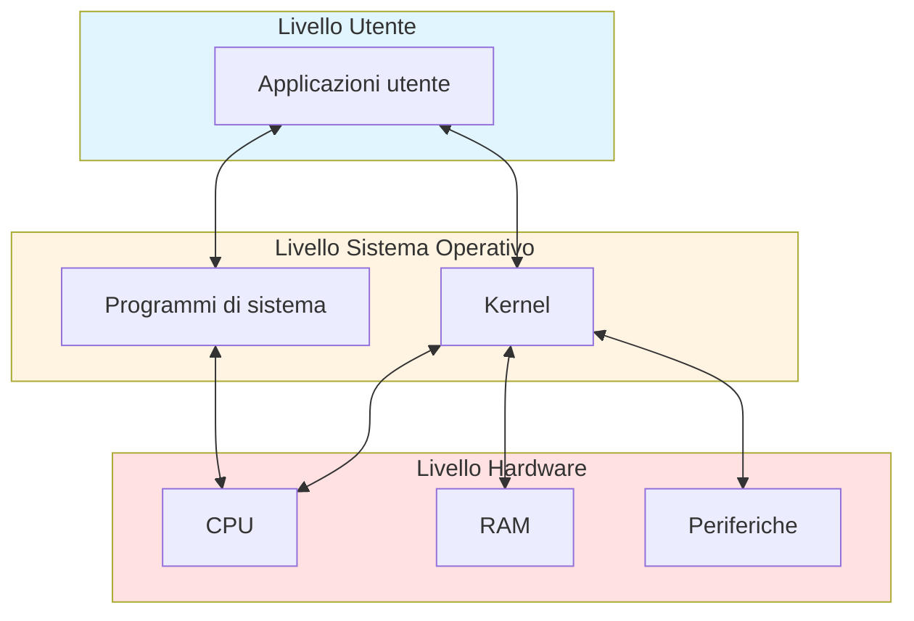
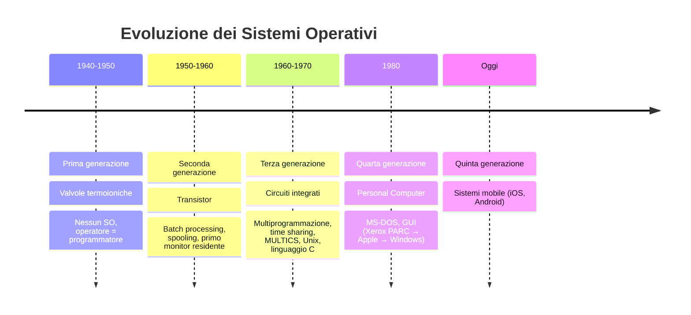
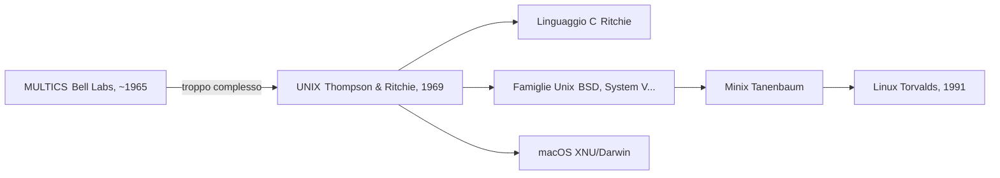
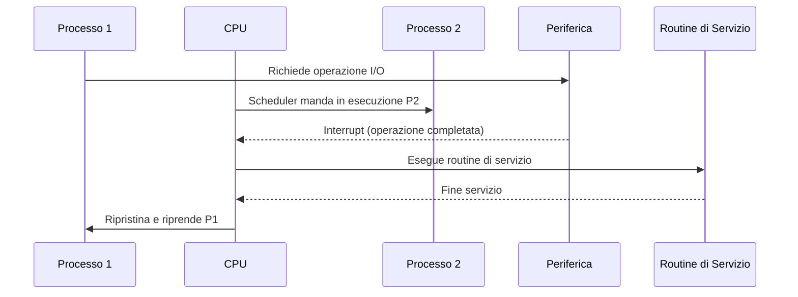
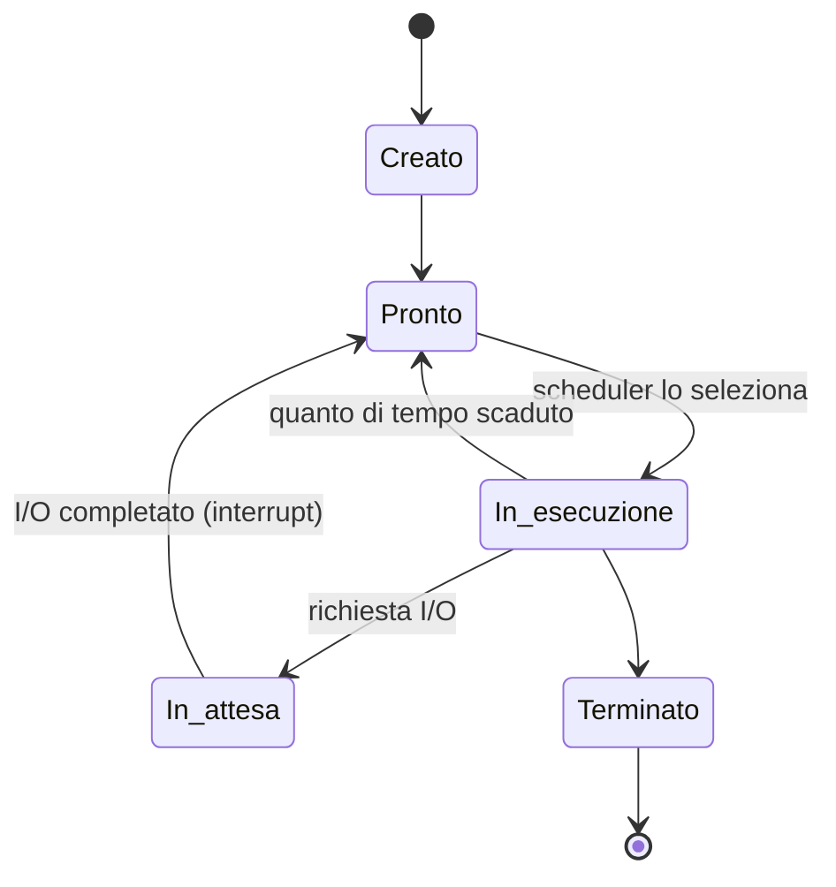
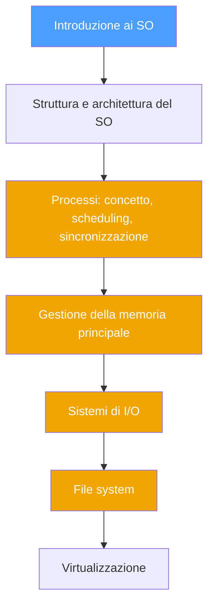

# Sistemi Operativi — Lezione 0
## Informazioni sul corso

- **Orario:** Martedì 16:30–18:30 | Mercoledì e Giovedì 14:00–16:00, Aula B6
- **Ricevimento:** Venerdì 15:00–17:00 (preferibilmente su Teams; in presenza su accordo)
- **Studio:** Via Claudio 25
- **Email:** oggetto sempre `SO1 - <argomento>`
- **Propedeuticità in ingresso:** Architetture degli Elaboratori
---
## 📚 Riferimenti

| Tipo          | Libro                                     |
| ------------- | ----------------------------------------- |
| Principale    | Silberschatz, *Operating System Concepts* |
| Consultazione | Tanenbaum, *Modern Operating Systems*     |

---
## 📝 Esame

> [!info] Modalità d'esame
> 1. **Prova scritta** — domande aperte + esercizi (lettura e interpretazione di codice, non scrittura)
> 2. **Prova orale** — accessibile solo dopo aver superato lo scritto
> 
> Non è previsto un progetto. Focus sui **concetti teorici fondamentali**.
> Possibile **pre-appello** al posto di una prova intercorso.

---
## 🖥️ Strumenti e Piattaforme

> [!tip] Quale sistema usare?
> - **Windows** → abilitare **WSL** (Windows Subsystem for Linux); in alternativa VM con VMware
> - **macOS** → già basato su kernel Unix (**XNU/Darwin**), nessuna installazione necessaria
> - **Linux** → pronto all'uso


---

## Cos'è un Sistema Operativo?

> [!tip] Definizione
> Un Sistema Operativo è un **programma** che gestisce le risorse hardware di un calcolatore, facendo da intermediario tra utente e macchina. È il **primo strato software** che si pone tra l'hardware e le applicazioni.

### Obiettivi principali

- Gestire l'esecuzione dei programmi
- Semplificare l'interazione utente–calcolatore
- Risolvere i conflitti tra richieste di più processi/utenti
- Utilizzare l'hardware in modo efficiente

### Struttura a strati


### Punti di vista sul SO

| Prospettiva                   | Descrizione                                                     |
| ----------------------------- | --------------------------------------------------------------- |
| **Allocatore di risorse**     | Gestisce CPU, memoria, periferiche; risolve i conflitti         |
| **Programma di controllo**    | Primo programma avviato; controlla l'esecuzione degli altri     |
| **Astrazione della macchina** | Fornisce un modello semplificato e standardizzato dell'hardware |

> [!example] Esempio intuitivo
> Il file system gerarchico (cartelle/file), la memoria come spazio contiguo, l'avvio e la terminazione di processi: sono tutte **illusioni di semplicità** costruite dal SO sopra un hardware molto più complesso.

---

## Kernel vs Programmi di sistema

> [!info] Distinzione fondamentale
> - **Kernel (nucleo):** parte più interna; unico programma con accesso completo all'hardware; opera in *Kernel Mode* (modalità privilegiata)
> - **Programmi di sistema:** estendono le funzionalità del kernel (shell, utilità di sistema, ecc.)
> - **Applicazioni:** tutto ciò che non è né kernel né programma di sistema
> 
> $$\text{SO} = \text{Kernel} + \text{Programmi di sistema}$$
---

## 🕰️ Storia dei Sistemi Operativi



### Prima generazione (anni '40–'50) — Valvole
- Nessun SO; un programma alla volta, configurato a livello macchina
- Operatore = programmatore
- Nascono: librerie di supporto, compilatori (**FORTRAN**, Backus 1957), linker, loader

### Seconda generazione (anni '50–'60) — Transistor
- Separazione operatore/programmatore; programmi organizzati in **batch (lotti)**
- Nasce il **monitor residente** (primo embrione del SO)
- Introduzione dello **spooling** *(Simultaneous Peripheral Operations Online)*: gestione tramite coda delle operazioni su periferiche lente

> [!info] Disco vs Nastro
> Il disco, a differenza del nastro (accesso sequenziale), ha **accesso random**: si può scrivere/leggere in qualsiasi posizione. Questo rende possibile caricare più job contemporaneamente e switchare tra loro.

### Terza generazione (anni '60–'70) — Circuiti integrati

- **Multiprogrammazione:** più processi alternati sulla CPU
- **Time sharing:** il tempo CPU è suddiviso tra processi/utenti tramite timer
- Introduzione della **dual mode** (Kernel Mode / User Mode) e protezione della memoria

#### MULTICS → UNIX



> [!tip] Curiosità
> **Unix** nasce come gioco di parole su **MULTICS**: "MULTiplexed" → "UNiplexed", a sottolineare la semplificazione del design.
> Dennis Ritchie, co-creatore di Unix, è anche il creatore del **linguaggio C**.

### Quarta generazione (anni '80) — Personal Computer
- **MS-DOS:** sistema semplificato, **senza bit di modalità** → nessuna protezione hardware
- **GUI:** sviluppata a Xerox PARC, adottata da Apple (Lisa, Macintosh), poi da Windows

### Quinta generazione — Mobile
Sistemi operativi per dispositivi mobili (iOS, Android, ecc.)

---

## Architettura di Base del Calcolatore

### Componenti principali

```
CPU
├── Control Unit (CU)
├── Arithmetic Logic Unit (ALU)
└── Registri: MAR, MDR, PC, IR...

RAM (memoria principale)
└── I programmi devono essere caricati qui per essere eseguiti

Periferiche
└── Comunicate tramite controller e buffer locali
```

### Terminologia

| Termine             | Significato                             |
| ------------------- | --------------------------------------- |
| **CPU**             | Unità hardware che esegue le istruzioni |
| **Processore**      | Chip fisico (contiene una o più CPU)    |
| **Core**            | Singola unità di calcolo                |
| **Multicore**       | Più core nello stesso processore        |
| **Multiprocessore** | Sistema con più processori fisici       |

---

## Meccanismo delle Interruzioni

> [!abstract] Perché le interruzioni?
> Alternativa al **polling** (interrogazione ciclica della periferica da parte della CPU), che spreca cicli preziosi. Con le interruzioni la CPU può fare altro mentre aspetta la periferica.

### Flusso di gestione di un interrupt



### Interrupt vettorizzato

Ogni interrupt ha un **numero** univoco. Esiste un **vettore di interruzioni** dove:
$$\text{vettore}[\,n_{\text{interrupt}}\,] = \text{indirizzo della routine di servizio}$$
> [!warning] Protezione del vettore
> Il vettore degli interrupt **deve essere protetto dal kernel**. Un utente malizioso che potesse sovrascriverlo potrebbe dirottare l'intera macchina verso codice arbitrario.

### Tipi di interruzione

| Tipo                      | Origine                              | Sincronia | Esempi                                                 |
| ------------------------- | ------------------------------------ | --------- | ------------------------------------------------------ |
| **Hardware interrupt**    | Periferica esterna                   | Asincrono | Tasto premuto, fine trasferimento dati di rete         |
| **Eccezione (Exception)** | CPU, errore durante esecuzione       | Sincrono  | Division by zero, Segmentation Fault, accesso illegale |
| **Trap**                  | Programma, richiesta esplicita al SO | Sincrono  | Chiamate di sistema (`syscall`)                        |

> [!example] Esempio concreto — pressione di un tasto
> 1. Il controller della tastiera rileva il tasto
> 2. Manda un **hardware interrupt** alla CPU
> 3. La CPU sospende il processo corrente
> 4. Viene eseguita la **routine di servizio**: il codice del tasto viene messo in un buffer
> 5. Il processo interrotto viene ripristinato

> [!info] Frequenza reale
> Su macOS, in **10 secondi** si possono registrare fino a **~23.000 interruzioni**. Il SO moderno è essenzialmente **event-driven**.

---

## Caratteristiche Fondamentali del SO Moderno

### Multiprogrammazione e Time Sharing

```mermaid
gantt
    title Time Sharing — alternanza dei processi sulla CPU
    dateFormat X
    axisFormat %s

    section CPU
    Processo A :a1, 0, 2
    Processo B :b1, 2, 4
    Processo A :a2, 4, 6
    Processo C :c1, 6, 8
    Processo B :b2, 8, 10
```



- **Multiprogrammazione:** più programmi caricati in RAM, la CPU passa da uno all'altro
- **Time Sharing:** ogni processo riceve un **quanto di tempo (TIC)**, poi lo scheduler decide il prossimo

### Dual Mode — Modalità Duale

> [!info] Principio fondamentale
> Il sistema opera sempre in una di due modalità, distinte da un **bit hardware**:
> - **Kernel Mode:** accesso completo all'hardware, operazioni privilegiate
> - **User Mode:** operazioni limitate; per accedere all'hardware si deve richiedere al kernel tramite *system call*
> 
> È **sempre il kernel** a controllare questo bit: concede la User Mode e se la riprende.

> [!warning] MS-DOS — un controesempio
> MS-DOS sull'Intel 8088 **non aveva il bit di modalità**: qualsiasi programma poteva accedere direttamente all'hardware, rendendo il sistema facilmente "dirottabile".

### Protezione Temporale

Per evitare che un processo utente occupi la CPU indefinitamente:

> [!info]
> Un **timer hardware** invia periodicamente un interrupt alla CPU, riportando il controllo al kernel. Questo garantisce che nessun processo possa monopolizzare la CPU.

### Protezione della Memoria

Il kernel assegna ad ogni processo uno **spazio di indirizzamento** con registro base e registro limite:
$$\text{indirizzo fisico} = \text{base} + \text{indirizzo logico} \quad \text{se} \quad \text{indirizzo logico} \leq \text{limite}$$
> [!tip] Parole del Professore
> > [!quote]
> > La CPU lavora con **indirizzi logici** (disaccoppiati dalla RAM fisica). I controlli di accesso sono eseguiti in **hardware** per motivi di velocità. Il SO "apparecchia la tavola", poi l'hardware fa i controlli.

---

## Gestione dei Processi — Introduzione

> [!abstract] Cos'è un processo?
> Un **processo** è un programma in esecuzione. Ha bisogno di risorse (CPU, memoria, I/O) e le rilascia alla terminazione.

### Single-thread vs Multi-thread

| | Single-thread | Multi-thread |
|---|---|---|
| Program Counter | Uno solo | Uno per thread |
| Spazio di indirizzamento | Dedicato | Condiviso tra i thread |
| Parallelismo | No | Sì (con problemi di sincronizzazione) |

### Ciclo di vita di un processo



---

## Programma del Corso



---

## Tags
#sistemi-operativi #SO1 #kernel #interrupt #processo #dual-mode