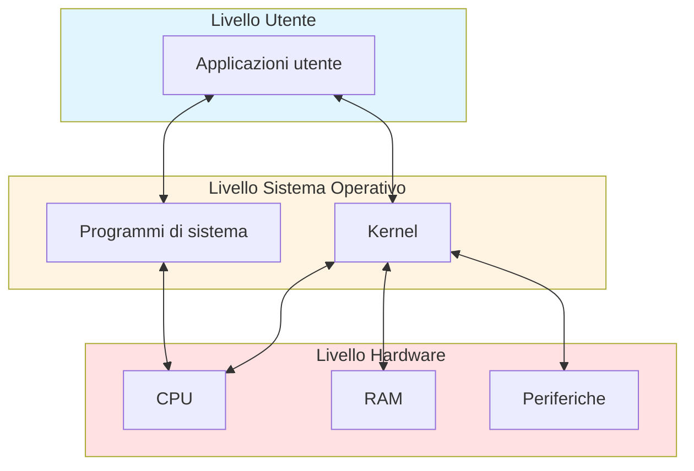

# Sistemi Operativi — Lezione 0
## Informazioni sul corso

- **Orario:** Martedì 16:30–18:30 | Mercoledì e Giovedì 14:00–16:00, Aula B6
- **Ricevimento:** Venerdì 15:00–17:00 (preferibilmente su Teams; in presenza su accordo)
- **Studio:** Via Claudio 25
- **Email:** oggetto sempre `SO1 - <argomento>`
- **Propedeuticità in ingresso:** Architetture degli Elaboratori

### Libro di testo
- **Principale:** Silberschatz, *Operating System Concepts*
- **Consultazione:** Tanenbaum, *Modern Operating Systems*

### Modalità d'esame
- **Prova scritta:** domande aperte + esercizi (interpretazione di codice, analisi di comportamento)
- **Prova orale:** discussione (accessibile solo dopo aver superato lo scritto)
- Non è previsto un progetto pratico; il focus è sui concetti teorici fondamentali
- Possibile **pre-appello** al posto di una prova intercorso

### Strumenti e piattaforme
- Riferimento principale: sistema **Linux/Unix**
- **Windows:** usare WSL (Windows Subsystem for Linux) oppure una VM (es. VMware)
- **macOS:** già basato su un kernel Unix (XNU/Darwin) — nessuna installazione aggiuntiva necessaria

---

## Cos'è un Sistema Operativo

Un Sistema Operativo (SO) è il **primo strato software** che gestisce le risorse hardware di un calcolatore, facendo da intermediario tra utente e macchina.

### Obiettivi principali
- Gestire l'esecuzione dei programmi
- Semplificare l'interazione utente-calcolatore
- Utilizzare l'hardware in modo efficiente
- Risolvere i conflitti tra richieste di più processi/utenti

### Punti di vista sul SO
| Prospettiva                   | Descrizione                                                     |
| ----------------------------- | --------------------------------------------------------------- |
| **Allocatore di risorse**     | Gestisce CPU, memoria, periferiche e risolve i conflitti        |
| **Programma di controllo**    | Primo programma avviato; evita usi impropri dell'hardware       |
| **Astrazione della macchina** | Fornisce un modello semplificato e standardizzato dell'hardware |

### Struttura a strati

## Kernel vs Programmi di sistema

- **Kernel (nucleo):** la parte più interna del SO; unico programma con accesso completo all'hardware, opera in *modalità privilegiata* (Kernel Mode)
- **Programmi di sistema:** estendono le funzionalità del kernel (shell, utilità, ecc.)
- **Applicazioni:** tutto ciò che non è kernel né programma di sistema

> Il SO = Kernel + Programmi di sistema. Tutto il resto è applicazione.

---

## Breve storia dei sistemi operativi

### Prima generazione (anni '40–'50) — Valvole
- Nessun SO; operatore = programmatore
- Un programma alla volta, configurato direttamente a livello macchina
- Prime librerie, compilatori (es. **FORTRAN**, Backus 1957), linker, loader

### Seconda generazione (anni '50–'60) — Transistor
- Separazione tra operatore e programmatore
- Programmi raggruppati in **batch (lotti/job)**
- Nasce un primo **monitor residente** (embrione del SO)
- Introduzione dello **spooling** (*Simultaneous Peripheral Operations Online*): gestione di una coda di operazioni su periferiche lente tramite disco
- Il **disco** (accesso random) vs nastro (accesso sequenziale) rende possibile caricare più job contemporaneamente

### Terza generazione (anni '60–'70) — Circuiti integrati
- **Multiprogrammazione:** più processi in esecuzione "contemporanea", alternati dalla CPU
- **Time sharing:** il tempo CPU viene suddiviso tra più processi/utenti
- Introduzione della **dual mode** (Kernel Mode / User Mode)
- Protezione della memoria, protezione temporale (timer)
- Progetto **MULTICS** (Bell Labs): primo tentativo sistematico di SO multiutente e multiprogrammato
- Da MULTICS nasce **Unix** (1969, Ken Thompson & Dennis Ritchie) — e con esso il linguaggio **C**
  - Multiutente, multiprogrammato, file system gerarchico, shell testuale
  - Da Unix derivano: varie famiglie Unix, **Minix** (Tanenbaum), infine **Linux** (Linus Torvalds)

### Quarta generazione (anni '80) — Personal Computer
- **MS-DOS** (IBM/Microsoft): semplificato, senza protezione hardware (nessun bit di modalità)
- **GUI** (Graphic User Interface): sviluppata a Xerox PARC, adottata da Apple (Lisa, Macintosh) e poi da Windows

### Quinta generazione — Mobile
- Sistemi operativi per dispositivi mobili (iOS, Android, ecc.)

---

## Architettura di base del calcolatore

### Componenti principali
- **CPU** = Control Unit + ALU; esegue il ciclo *Fetch → Decode → Execute → (Check Interrupt)*
- **Memoria principale (RAM):** i programmi devono essere caricati qui per essere eseguiti
- **Periferiche:** comunicate tramite controller e buffer locali

### Terminologia
| Termine         | Significato                             |
| --------------- | --------------------------------------- |
| CPU             | Unità hardware che esegue le istruzioni |
| Processore      | Chip fisico (contiene una o più CPU)    |
| Core            | Singola unità di calcolo                |
| Multicore       | Più core nello stesso processore        |
| Multiprocessore | Sistema con più processori              |

---

## Meccanismo delle interruzioni

Le interruzioni sono il meccanismo fondamentale con cui il SO reagisce agli eventi in modo **asincrono**.

### Perché le interruzioni?
Alternativa al **polling** (interrogazione ciclica della periferica da parte della CPU), che spreca cicli CPU. Con le interruzioni:
1. La CPU avvia un'operazione sulla periferica
2. Nel frattempo esegue altri processi
3. Quando la periferica ha finito, invia un **interrupt**
4. La CPU interrompe il processo corrente, esegue la **routine di servizio**, poi riprende

### Interrupt vettorizzato
- Ogni interrupt ha un **numero** univoco
- Esiste un **vettore di interruzioni**: all'indice corrispondente al numero si trova l'indirizzo della routine di servizio
- Il vettore è protetto dal kernel (se modificabile da utenti, la macchina potrebbe essere dirottata)

### Tipi di interruzione

| Tipo                      | Origine                              | Sincronicità | Esempio                                                |
| ------------------------- | ------------------------------------ | ------------ | ------------------------------------------------------ |
| **Hardware interrupt**    | Periferica esterna                   | Asincrono    | Pressione di un tasto, fine trasferimento dati         |
| **Eccezione (Exception)** | CPU stessa, errore                   | Sincrono     | Division by zero, Segmentation Fault, accesso illegale |
| **Trap**                  | Programma, richiesta esplicita al SO | Sincrono     | Chiamata di sistema (`syscall`)                        |

> Su x86, i vettori 0–31 sono per eccezioni CPU (non mascherabili e mascherabili); i numeri più alti per interrupt hardware da periferiche.

### Frequenza reale
Su macOS, in 10 secondi si possono registrare fino a **~23.000 interruzioni**. Il SO moderno è essenzialmente **event-driven** (guidato dagli eventi).

---

## Caratteristiche fondamentali del SO moderno

### Multiprogrammazione e Time Sharing
- **Multiprogrammazione:** più programmi caricati in RAM, la CPU passa da uno all'altro
- **Time Sharing:** ogni processo riceve un **quanto di tempo** (TIC), poi il controllo passa allo scheduler
- Lo **scheduler** decide quale processo mandare in esecuzione

### Dual Mode (modalità duale)
- **Kernel Mode:** accesso completo all'hardware, operazioni privilegiate
- **User Mode:** operazioni limitate; per accedere all'hardware si richiede il kernel tramite *system call*
- Un **bit di modalità** (implementato in hardware) distingue le due modalità
- È sempre il kernel a controllare il bit: concede la User Mode e se la riprende

### Protezione temporale
- Un **timer hardware** invia periodicamente un interrupt alla CPU
- Impedisce che un processo utente occupi la CPU indefinitamente
- Il controllo torna regolarmente al kernel

### Protezione della memoria
- Il SO assegna ad ogni processo uno **spazio di indirizzamento** (con registro base + registro limite)
- La CPU lavora con **indirizzi logici** (disaccoppiati dagli indirizzi fisici in RAM)
- I controlli di accesso sono fatti in hardware per motivi di velocità
- Il SO "apparecchia la tavola" e poi l'hardware esegue i controlli

---

## Gestione dei processi (introduzione)

- Un **processo** è un programma in esecuzione; ha bisogno di risorse (CPU, memoria, I/O)
- Alla terminazione, le risorse vengono liberate
- **Processo single-thread:** un unico Program Counter, esecuzione sequenziale
- **Processo multi-thread:** più sotto-unità di esecuzione (thread), ognuno con il proprio PC, che condividono lo stesso spazio di indirizzamento → problemi di **sincronizzazione**

### Ciclo di vita di un processo
Creazione → Esecuzione → Sospensione → Ripresa → Terminazione

### Argomenti che verranno approfonditi
- Schedulazione dei processi
- Sincronizzazione e comunicazione tra processi
- Programmazione concorrente (fork, thread, IPC)
- Memoria: gestione e virtualizzazione
- File system
- Gestione I/O
- Virtualizzazione

---

## Programma del corso (panoramica)

1. Introduzione ai sistemi operativi *(questa lezione)*
2. Struttura e architettura del SO
3. Processi: concetto, schedulazione, sincronizzazione
4. Gestione della memoria principale
5. Sistemi di I/O
6. File system
7. Esercitazioni pratiche su Linux (shell scripting, programmazione di sistema in C)