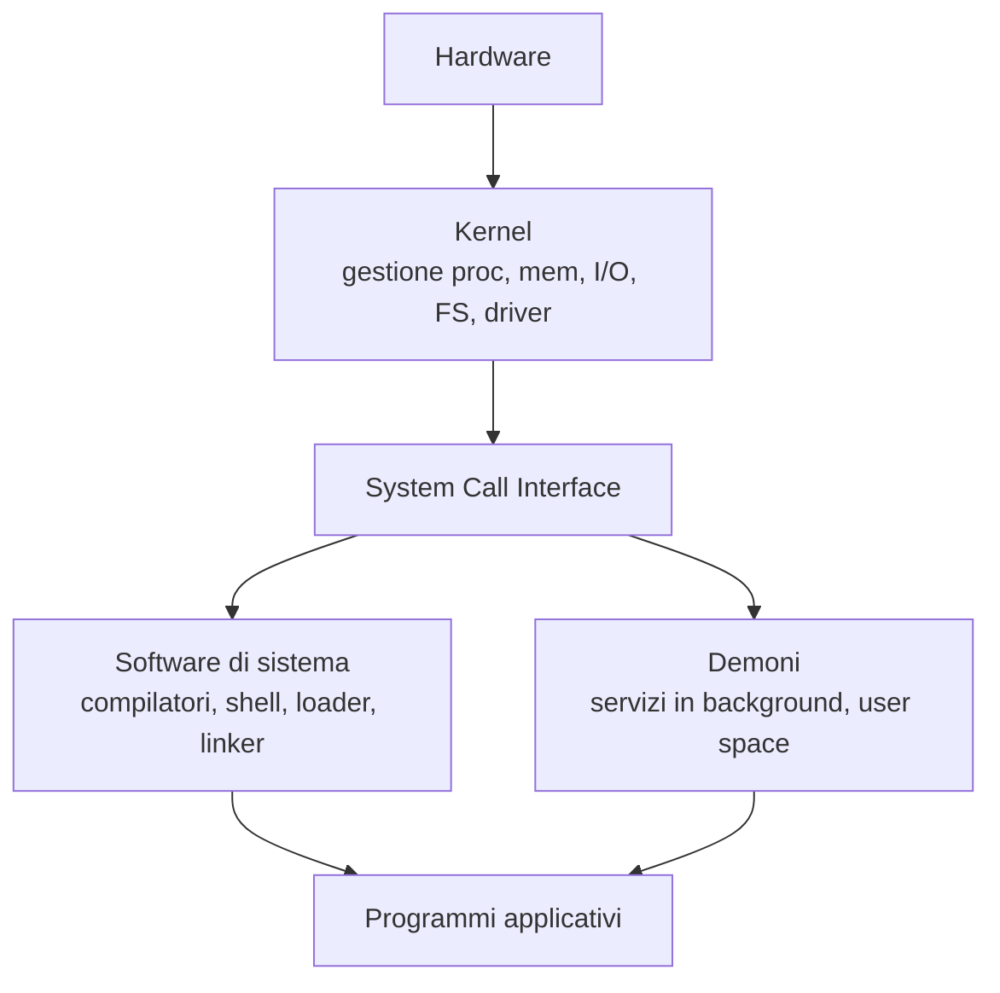

# SO — Lezione 1: Servizi del SO, Chiamate di Sistema e Struttura del Kernel

**Docente:** Prof. Alberto Finzi | **Corso:** Sistemi Operativi | **CFU:** 9

---

## Argomenti trattati

- Panoramica dei servizi del sistema operativo
- Interfacce utente: CLI, GUI, batch
- Gerarchia API → ABI → System Call
- Meccanismo di passaggio dei parametri al kernel
- Software di sistema: kernel, demoni, programmi utente
- Policy vs Meccanismo
- Primi cenni alla struttura del kernel (monolitico, microkernel)

---

## Servizi del Sistema Operativo

Il sistema operativo deve fornire un insieme ampio di servizi. Deve mettere a disposizione interfacce per l'interazione dell'utente, un ambiente per l'esecuzione dei programmi, la gestione delle operazioni I/O (nascondendo la complessità dei dispositivi e uniformando quanto possibile), la gestione del file system, la comunicazione tra processi, il rilevamento degli errori.

Il SO è anche un **monitor**: non solo alloca le risorse, ma tiene costantemente traccia di tutto quello che sta succedendo sulla macchina. Per ogni processo sa quali file sono aperti, quali risorse sono allocate, chi sono gli utenti coinvolti. Mantiene per questo una serie di strutture dati interne al kernel. Vengono anche garantiti meccanismi di **protezione** (accesso controllato alle risorse tra processi interni) e **sicurezza** (difesa da accessi non autorizzati dall'esterno).

> [!important] Protezione ≠ Sicurezza
> La **protezione** riguarda l'interno: garantisce che processi utente non accedano a zone di memoria o operazioni non consentite. La **sicurezza** riguarda l'esterno: autenticazione, difesa da intrusioni. Sono concetti e meccanismi distinti.

---

## Interfacce Utente

**Command Line Interface (CLI)** — le shell. Sono programmi che interpretano comandi testuali. Permettono di comporre sequenze di operazioni, scrivere script, invocare servizi del kernel. Noi faremo riferimento alla **shell Bash** (come standard per i sistemi Unix-like). Si può anche usare da Mac OS, che è Unix-certificato.

**Graphical User Interface (GUI)** — introdotta da Xerox PARC, diffusa commercialmente da Apple con Lisa e Macintosh. Usa la metafora della scrivania: icone, finestre, cursore. È diventata lo standard per l'interazione quotidiana. Si è poi evoluta verso touch screen e comandi vocali.

**Batch** — lotti di operazioni da eseguire sequenzialmente. Meno rilevante ai fini del corso.

> [!warning] La GUI è un programma utente
> La GUI non è eseguita in modalità privilegiata. È un processo che gira in user space, e si interfaccia al kernel esattamente come qualsiasi altro programma: tramite chiamate di sistema.

---

## La Gerarchia API → ABI → System Call

Quando scriviamo codice C, la distanza tra ciò che scriviamo e ciò che avviene realmente a livello hardware è molto ampia. Esistono più livelli di astrazione sovrapposti:

```
[Programma C]        →  printf("Hello\n")
     ↓
[Standard C Library] →  printf chiama internamente write()
     ↓
[API POSIX]          →  write(fd, buf, n)    ← chiamata di alto livello
     ↓
[ABI (livello macchina)] → syscall(1, fd, buf, n)  ← istruzione macchina
     ↓
[Kernel]             →  routine di servizio sys_write
```

| Livello | Cos'è | Esempio |
|---|---|---|
| Standard C Library | Funzioni di libreria ad altissimo livello | `printf`, `fopen` |
| API POSIX | Funzioni C standard per sistemi Unix-like | `write`, `read`, `open`, `fork` |
| ABI | Numero intero + registri a livello macchina | syscall n.1 = write |
| Kernel | Routine di servizio eseguita in kernel mode | `sys_write` |

> [!abstract] Definizione: System Call
> Un'istruzione macchina speciale (trap) che trasferisce il controllo dal processo utente al kernel. Il processo viene sospeso, il kernel esegue la routine di servizio richiesta, poi restituisce il controllo con il risultato dell'operazione.

### API POSIX

Le API a cui facciamo riferimento nel corso sono le **POSIX API** (Portable Operating System Interface for Unix). Sono standardizzate per tutti i sistemi Unix-like: Linux, macOS, BSD. Il programma che usa queste API, compilato per la stessa architettura, funziona su tutti questi sistemi senza modifiche al sorgente.

Windows ha le proprie **Win API**, con una struttura diversa e argomenti spesso più numerosi. A livello macchina, sulla stessa architettura, le invocazioni si tradurranno in meccanismi simili, ma a livello sorgente sono incompatibili.

> [!tip] Perché imparare POSIX
> POSIX è più parsimoniosa e didattica: pochi argomenti, semantica chiara. Una volta capiti i concetti POSIX, riapprendere le Win API per gli stessi concetti è semplice.

### API ≠ ABI: il mapping non è 1:1

Non è garantito che ogni funzione API si traduca esattamente in una ABI. Una `printf` ad alto livello si decompone internamente in una o più chiamate `write` POSIX, che a loro volta si traducono in una o più istruzioni macchina con il numero di system call nei registri. Alcune funzioni hanno una corrispondenza diretta 1:1; altre si compongono di più operazioni di basso livello.

---

## Meccanismo di passaggio dei parametri al kernel

Il problema centrale è: quando si emette un trap al kernel, come gli si communicano gli argomenti dell'operazione richiesta? La comunicazione avviene a livello macchina, quindi tramite registri.

### Modalità moderne

**Registri (preferita):** i parametri vengono precaricati direttamente in registri specifici della CPU prima di emettere il trap. Il kernel, al risveglio, sa già — per ogni numero di system call — in quali registri trovare ogni argomento (è tutto standardizzato).

**Puntatore a blocco:** se i parametri sono troppi per i registri disponibili, si prepara un blocco contiguo in memoria con tutti i parametri e si mette nel registro il puntatore a quel blocco.

### Esempio in assembly x86-64: chiamata `write`

```asm
mov rax, 1       ; numero della system call: write = 1
mov rdi, 1       ; argomento 1: file descriptor (stdout)
mov rsi, messaggio  ; argomento 2: indirizzo del buffer
mov rdx, 12      ; argomento 3: numero di byte da scrivere
syscall          ; trap → il kernel si sveglia
                 ; il risultato (byte scritti / errore) torna in rax
```

Questo è ciò che il compilatore genera quando si compila una chiamata come `write(1, msg, 12)`. Il programmatore non scrive assembly: vede solo la funzione C di alto livello.

### Sequenza completa della chiamata (approccio moderno)

1. Il programma C invoca `read(fd, buf, n)`.
2. Il **libc wrapper** predispone i parametri nel suo stack di attivazione (come per qualunque funzione C).
3. Prima del trap, il wrapper copia i valori nei registri corretti.
4. Viene emesso il trap (`syscall`).
5. Il kernel legge il numero di system call da `rax`, cerca il valore degli argomenti negli altri registri.
6. Esegue la routine di servizio.
7. Scrive il risultato in `rax` e ritorna al processo utente.

> [!quote]
> "È come se voi vi siete già messi d'accordo su dove stanno le chiavi di casa. Io ho lasciato le chiavi nel solito posto. Il kernel già sa in quali cassetti aprire per trovare i dati."

> [!example] Esempio dall'alto: il comando `cp`
> Il comando `cp input.txt output.txt` è un programma C che si compone di decine di system call:
> 1. Acquisisce il nome del file ingresso
> 2. Apre il file ingresso (`open`) — se non esiste → errore
> 3. Controlla il file uscita — se esiste già → errore (in modalità `cp`)
> 4. Crea il file uscita
> 5. Loop: legge dal file ingresso (`read`), scrive sul file uscita (`write`)
> 6. Chiude entrambi i file (`close`)
> 7. Scrive messaggio sullo schermo
>
> Anche solo verificare se un file esiste richiede una system call: accedere alla struttura delle directory è un'operazione privilegiata che solo il kernel può fare.

---

## Struttura del software nel sistema

Il software che gira sulla macchina si divide in tre grandi categorie:



**Kernel** — eseguito in modalità privilegiata (ring 0). Gestisce tutto ciò che è critico: scheduling, memoria, I/O, file system, driver. È un blocco di codice in cui le componenti possono comunicare direttamente → massima velocità.

**Software di sistema** — eseguito in user space. Non ha bisogno di protezione kernel, ma invoca i servizi del kernel tramite system call. Esempi: compilatori, shell, loader dinamico, linker.

**Demoni** — processi utente che rimangono attivi in background e forniscono servizi di sistema. Esempio: in Linux **systemd** (PID 1) è un demone, un processo utente, non un processo kernel. Pur essendo il primo processo lanciato, lavora nello user space e usa le system call come qualsiasi altro processo.

> [!warning] Processo di sistema ≠ processo kernel
> Un processo che svolge funzioni di sistema non lavora necessariamente in kernel mode. systemd è in user space: la sua struttura gerarchica di processi (tutti gli altri processi derivano da lui) è gestita come qualsiasi albero di processi utente.

---

## Policy vs Meccanismo

Una delle distinzioni fondamentali nella progettazione del sistema operativo.

> [!abstract] Definizione: Policy vs Meccanismo
> Il **meccanismo** è lo strumento che il sistema mette a disposizione (es. il timer hardware). La **policy** è come quel meccanismo viene usato e configurato (es. quanto tempo assegnare a ciascun processo). Separare i due è buona norma: lo stesso meccanismo deve poter supportare politiche diverse.

> [!example] Esempi
> - **Timer**: il meccanismo è il timer hardware; la policy è la dimensione del time slice.
> - **Paginazione della memoria**: il meccanismo è il sistema di pagine; la policy è la dimensione delle pagine. Pagine più grandi → minor overhead di gestione ma maggiore frammentazione interna; pagine più piccole → viceversa.
> - **Permessi sui file**: il meccanismo è il sistema di ACL; la policy è chi può leggere/scrivere cosa.

---

## Struttura del kernel: prime distinzioni

La lezione introduce brevemente diversi paradigmi di progettazione del kernel. Verrà approfondita nella lezione successiva.

**Monolitico** — il kernel è un unico programma dove tutte le procedure possono chiamarsi l'una con l'altra. Vantaggio: velocità e comunicazione diretta. Svantaggio: difficile da mantenere ed estendere.

**Microkernel** — si mette nel kernel solo il minimo (scheduling, memoria, IPC). Tutto il resto va in user space. Vantaggio: modularità e sicurezza. Svantaggio: overhead di comunicazione (ogni modulo deve passare per il kernel via message passing).

La scelta dipende sempre dai trade-off: velocità vs modularità, sicurezza vs prestazioni.

---

> [!summary] Punti chiave della lezione
> - Le system call sono il confine tra user space e kernel space: l'unico canale di comunicazione controllato.
> - API (alto livello, portabile) e ABI (livello macchina) sono due cose distinte; non c'è mapping 1:1 garantito.
> - Le API POSIX sono lo standard Unix-like che useremo nel corso per la programmazione concorrente in C.
> - I parametri al kernel vengono passati tramite registri (approccio moderno, più veloce).
> - Un processo di sistema non è un processo kernel: systemd è in user space.

## Prossimi argomenti

- [ ] Virtualizzazione: emulazione vs virtualizzazione, tipo 1 vs tipo 2
- [ ] Ring 0, 1, 2, 3, -1 e il loro ruolo
- [ ] Struttura kernel: monolitico, stratificato, microkernel, modulare, ibrido
- [ ] Il processo: definizione, layout di memoria, ciclo di vita
- [ ] Process Control Block (PCB) e context switch

---

#SO #system-call #API #ABI #POSIX #struttura-SO #interfacce #policy-meccanismo
