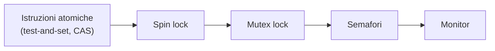

# SO — Lezione 11: Sincronizzazione Avanzata — Semafori, Monitor, Deadlock e Priority Inversion

**Corso:** Sistemi Operativi

---

## Argomenti trattati

- Bounded waiting con test-and-set e compare-and-swap: riepilogo
- Lock-free increment tramite compare-and-swap
- Spin lock vs mutex lock
- Semafori binari e contatori: definizione, wait, signal
- Produttore-consumatore con semafori
- Monitor e variabili di condizione: signal-and-continue vs signal-and-wait
- Deadlock: definizione e casi tipici
- Priority inversion: definizione, esempio Pathfinder (1997), soluzione con priority inheritance
- Strutture dati lock-free: push/pop lock-free con CAS
- Confronto prestazionale dei meccanismi di sincronizzazione

---

## 1. Bounded waiting: riepilogo

Dalla lezione precedente: per ottenere il bounded waiting oltre alla mutua esclusione, si usa un array `waiting[N]` e una rotazione circolare. Ogni processo $i$ si marca come in attesa, poi cerca di prendere il lock con CAS. All'uscita dalla sezione critica, invece di sbloccare direttamente il lock, il processo cerca il primo $j$ in attesa (in ordine circolare) e gli cede il testimone impostando `waiting[j] = false` senza sbloccare il lock. Solo se nessuno aspetta, il lock viene liberato.

La stessa logica si può implementare con test-and-set usando un array booleano `waiting[]` e una variabile `key`. Il concetto è identico, cambia solo il tipo primitivo di atomicità usato.

---

## 2. Lock-free increment con compare-and-swap

Il CAS non serve solo per costruire lock; può essere usato per rendere atomiche operazioni senza bloccare mai esplicitamente.

> [!example] Incremento lock-free
> ```c
> void increment(int *v) {
>     int temp;
>     do {
>         temp = *v;                         // salva il valore attuale
>     } while (compare_and_swap(v, temp, temp + 1) != temp);
>     // CAS: se *v è ancora temp, scrivi temp+1 e restituisce temp (esce)
>     //       se *v è cambiato, restituisce il nuovo valore != temp (riprova)
> }
> ```
> L'idea è "rubare il tempo": si tenta l'aggiornamento atomico. Se nel frattempo un altro thread ha modificato `*v`, si accorge che `*v != temp`, riprende il valore aggiornato e riprova. È come se facessero a turno invece di bloccarsi.

Questa tecnica è efficace quando la contesa è **bassa o moderata**. Con alta contesa, molti thread continuano a perdere il CAS e a riprovare, causando starvation. In quel caso conviene il mutex classico.

---

## 3. Spin lock vs mutex lock

> [!abstract] Definizione: Spin lock
> Uno **spin lock** è un lock in cui il processo che aspetta rimane attivo (stato running) in un ciclo di busy waiting, continuando a testare se il lock si è liberato.

```c
// Implementazione semplificata di spin lock con CAS
void spinlock_acquire(int *lock) {
    while (compare_and_swap(lock, 0, 1) != 0)
        ;   // busy waiting
}
void spinlock_release(int *lock) {
    *lock = 0;
}
```

| Caratteristica | Spin lock | Mutex lock |
|---|---|---|
| Processo in attesa | Rimane in running (busy wait) | Viene sospeso (sleeping) |
| Context switch | Nessuno durante l'attesa | Uno per sospendere, uno per risvegliare |
| Efficienza | Alta se l'attesa è **breve** | Alta se l'attesa è **lunga** |
| Adatto a | Sistemi multicore, kernel | Programmazione applicativa |
| Analogia | Macchina al semaforo col motore acceso | Macchina che si spegne e si riavvia |

> [!important] Spin lock su sistemi single-core
> Su un solo core, lo spin lock è dannoso: il processo che aspetta occupa il 100% della CPU, impedendo al processo che tiene il lock di eseguire e liberarlo. Su multicore invece un core può dedicarsi allo spinning mentre un altro esegue il processo che deve rilasciare il lock.

---

## 4. Semafori

I semafori sono meccanismi di sincronizzazione di livello più alto dei lock, introdotti storicamente da Dijkstra (che li chiamava con le lettere olandesi P e V).

> [!abstract] Definizione: Semaforo
> Un **semaforo** $S$ è una variabile intera su cui sono definite due operazioni atomiche:
>
> **`wait(S)`** (o P, o "decrementa e aspetta"):
> $$S \leftarrow S - 1; \quad \text{se } S < 0 \text{ → blocca il processo}$$
>
> **`signal(S)`** (o V, o "incrementa e sveglia"):
> $$S \leftarrow S + 1; \quad \text{se } S \leq 0 \text{ → sveglia un processo in attesa}$$

### Semaforo binario vs semaforo contatore

**Semaforo binario** — inizializzato a 1. Funziona esattamente come un mutex lock: il primo processo che fa `wait` porta $S$ a 0 e può procedere; il secondo trova $S = 0$, fa `wait` e $S$ diventa $-1$, quindi si blocca. Chi esce fa `signal` e porta $S$ a 0, svegliando uno dei processi in attesa.

**Semaforo contatore** — inizializzato a $k > 1$. Permette a **al più $k$ processi contemporaneamente** di accedere alla risorsa. È uno strumento più flessibile: può contare quanti slot sono disponibili in un buffer, quante connessioni sono aperte, ecc.

> [!tip] Quando usare mutex vs semaforo binario
> Se si deve solo proteggere una sezione critica, il mutex lock è preferibile: è più leggero computazionalmente del semaforo. Il semaforo è più flessibile (può essere usato per sincronizzazioni non solo di accesso esclusivo) ma più pesante.

### Uso per la sequenzializzazione (punto di sincronizzazione)

I semafori si usano anche per **sequenzializzare** porzioni di codice in thread indipendenti:

```
SYNC = 0   (inizializzato a 0 → P2 si bloccherà subito)

P1: esegui S1; signal(SYNC)    →  sblocca P2 dopo S1
P2: wait(SYNC); esegui S2      →  aspetta che P1 abbia fatto S1
```

Indipendentemente dallo scheduling, S2 eseguirà sempre dopo S1. È come un semaforo stradale auto-gestito dai processi: P2 parte col rosso e aspetta che P1 faccia scattare il verde.

---

## 5. Produttore-consumatore con semafori

Si usano tre semafori per gestire il buffer circolare di $N$ slot:

```c
semaphore mutex = 1;    // accesso esclusivo al buffer
semaphore empty = N;    // conta gli slot vuoti
semaphore full  = 0;    // conta gli slot pieni
```

**Produttore:**
```c
// produce item
wait(empty);        // aspetta uno slot vuoto
wait(mutex);        // prende accesso esclusivo
buffer[in] = item;
in = (in + 1) % N;
signal(mutex);      // rilascia accesso esclusivo
signal(full);       // avverte che c'è uno slot pieno in più
```

**Consumatore:**
```c
wait(full);         // aspetta uno slot pieno
wait(mutex);        // prende accesso esclusivo
item = buffer[out];
out = (out + 1) % N;
signal(mutex);
signal(empty);      // avverte che c'è uno slot vuoto in più
```

La simmetria è elegante: `empty` e `full` si complementano. Il `mutex` protegge le operazioni sul buffer dalla corsa critica. Lo stesso schema si potrebbe implementare con soli mutex, ma richiederebbe contatori espliciti protetti da ulteriori mutex.

---

## 6. Monitor

Il **monitor** è uno strumento di sincronizzazione di livello ancora più alto: è un tipo di dato astratto che incapsula dati condivisi e operazioni che li accedono, garantendo automaticamente la mutua esclusione.

> [!abstract] Definizione: Monitor
> Un **monitor** è una struttura dati con:
> - **dati interni condivisi** (accessibili solo tramite i metodi del monitor)
> - **procedure** che operano sui dati
> - **garanzia strutturale** che al più un processo alla volta esegua una procedura del monitor

Se un processo invoca `monitor.operazione()`, non deve dichiarare esplicitamente un lock: la mutua esclusione è garantita dalla struttura del monitor.

### Variabili di condizione

La sola mutua esclusione è insufficiente: a volte un processo deve aspettare che si verifichi una **condizione** prima di continuare. Le **variabili di condizione** permettono di sospendersi temporaneamente nel monitor, lasciando entrare altri processi.

Su una variabile di condizione `x` si possono fare due operazioni:
- **`x.wait()`** — il processo si autosospende su `x` e lascia il monitor
- **`x.signal()`** — sveglia uno dei processi sospesi su `x`

### Signal-and-continue vs signal-and-wait

Quando un processo fa `signal` su una variabile di condizione, si pone la domanda: chi va avanti, chi ha mandato la signal o chi è stato svegliato?

| Meccanismo | Chi procede dopo la signal | Note |
|---|---|---|
| **Signal-and-continue** | Chi ha mandato la signal; chi si è svegliato aspetta che il primo esca | Più naturale, più semplice da implementare |
| **Signal-and-wait** | Chi si è svegliato; chi ha mandato la signal si sospende | Utile quando la condizione ha una scadenza: si vuole reattività immediata |

### Implementazione con semafori

Un monitor si può implementare con un semaforo `mutex = 1` per la mutua esclusione e un semaforo `next = 0` per la porta di servizio (processo che ha fatto signal e si è sospeso). Ogni variabile di condizione $x$ ha un semaforo associato `x_sem = 0` e un contatore `x_count` dei processi sospesi su di essa.

L'operazione `x.signal()` (nella variante signal-and-wait):
1. Se `x_count > 0`: incrementa `next_count`, fa `signal(x_sem)` (sveglia il sospeso) e poi si autosospende su `next`.
2. Quando riprende, decrementa `next_count`.

---

## 7. Deadlock

> [!abstract] Definizione: Deadlock
> Un **deadlock** è una situazione in cui un insieme di processi è bloccato in attesa circolare: ognuno aspetta che un altro rilasci una risorsa, ma nessuno può avanzare.

> [!example] Deadlock banale con due semafori
> ```
> P0: wait(S); wait(Q); signal(S); signal(Q)
> P1: wait(Q); wait(S); signal(Q); signal(S)
> ```
> Sequenza che causa deadlock: P0 fa `wait(S)` (S=0), P1 fa `wait(Q)` (Q=0). P0 prova `wait(Q)` ma Q=0, si blocca. P1 prova `wait(S)` ma S=0, si blocca. Si incrociano e rimangono bloccati per sempre.

Casi tipici di deadlock:
- Un processo chiama due volte `wait` sullo stesso semaforo senza un `signal` nel mezzo.
- Due processi acquisiscono lock nello stesso ordine invertito.
- Con $n$ processi che formano un ciclo di attesa.

> [!warning] Consigli pratici
> Evitare di annidare troppi mutex. Se si devono acquisire più lock, farlo sempre nello stesso ordine in tutti i processi. Mantenere le sezioni critiche il più brevi possibile. I meccanismi di sincronizzazione non garantiscono l'assenza di deadlock: è responsabilità del programmatore.

### Problemi correlati alla liveness

La **liveness** è la proprietà che garantisce che tutti i processi possano eventualmente progredire. Il deadlock è una violazione della liveness. Altre violazioni sono:
- **Starvation** — un processo aspetta indefinitamente perché altri vengono sempre preferiti
- **Priority inversion** (vedi sotto)
- **Ciclo infinito** — un processo non termina mai

---

## 8. Priority inversion

La **priority inversion** (inversione di priorità) è un problema subdolo che si manifesta nei sistemi con scheduling a priorità e meccanismi di sincronizzazione.

> [!abstract] Definizione: Priority inversion
> Si ha inversione di priorità quando un processo a **media** priorità (M) blocca indirettamente un processo ad **alta** priorità (H), a causa di un lock detenuto da un processo a **bassa** priorità (L). Servono almeno tre processi.

**Come si manifesta:**
1. L (bassa priorità) entra nella sezione critica e prende un lock che serve a H.
2. H (alta priorità) arriva e vuole il lock: si blocca perché L lo tiene.
3. Nel frattempo, M (media priorità) viene schedulato e prelaziona L.
4. M si prende tutto il tempo che vuole. Nel frattempo L non può liberare il lock.
5. H rimane bloccato indirettamente da M, nonostante H abbia priorità più alta di M.

> [!example] Il caso Pathfinder (Marte, 1997)
> Il rover Pathfinder, dopo l'atterraggio su Marte, continuava a fare reset senza riuscire a completare il suo ciclo operativo nominale di 8 Hz. Il problema era esattamente una priority inversion:
>
> - Un task di lettura dati meteo (bassa priorità) teneva un lock condiviso con il task di distribuzione dati.
> - Un task di media priorità prelazionava il task meteo mentre teneva il lock.
> - Il task scheduler (alta priorità) non riusciva ad acquisire il lock in tempo e andava fuori dalla sua deadline, causando il reset.
>
> **Soluzione:** abilitando da remoto la **priority inheritance** nel sistema operativo real-time, il problema fu risolto senza dover inviare nulla fisicamente a Marte. Bastò un semplice flag via comunicazione radio.

### Soluzione: Priority Inheritance

> [!abstract] Soluzione: Priority Inheritance
> Quando un processo H ad alta priorità si blocca aspettando un lock tenuto da L a bassa priorità, L **eredita temporaneamente la priorità di H**. Questo impedisce a M di prelazionare L, che può così liberare rapidamente il lock e consentire a H di procedere.

La priority inheritance non è abilitata di default: va configurata esplicitamente nel sistema operativo.

---

## 9. Strutture dati lock-free

Analogamente all'incremento lock-free, si possono implementare operazioni su strutture dati concatenate senza bloccare mai esplicitamente.

> [!example] Push lock-free su una pila
> ```c
> void push(Node *new_node) {
>     do {
>         new_node->next = top;   // prepara il collegamento
>     } while (compare_and_swap(&top, new_node->next, new_node) != new_node->next);
>     // Se top è ancora uguale a quello che mi aspettavo, faccio lo swap atomico.
>     // Se nel frattempo un altro ha modificato top, riprovo.
> }
> ```
> È la stessa logica "ruba bandiera": si prepara l'operazione, si tenta atomicamente. Se qualcuno si è infilato nel mezzo, si ricomincia.

**Quando usare lock-free vs mutex:**

| Condizione | Approccio consigliato |
|---|---|
| Nessuna contesa | Lock-free è più veloce |
| Contesa moderata | Lock-free batte il mutex |
| Alta contesa | Mutex conviene: i lock-free perdono continuamente e c'è rischio di starvation |
| Programmazione applicativa comune | Sempre mutex: più leggibili e manutenibili |

---

## 10. Riepilogo: peso dei meccanismi di sincronizzazione

Dal più leggero al più pesante:



Gli spin lock non fanno context switch ma sprecano CPU. I mutex sospendono il processo (context switch). I semafori sono più pesanti perché più flessibili. I monitor sono il meccanismo più alto livello e più pesante. Per la programmazione applicativa ordinaria si usano i mutex lock.

---

> [!summary] Punti chiave della lezione
> - I semafori generalizzano i mutex: un semaforo binario equivale a un mutex, un semaforo contatore permette $k$ accessi contemporanei.
> - Il problema produttore-consumatore si risolve elegantemente con tre semafori (`mutex`, `empty`, `full`).
> - I monitor garantiscono mutua esclusione strutturalmente; le variabili di condizione permettono ai processi di sospendersi in attesa di una condizione, lasciando entrare altri.
> - Il deadlock richiede attesa circolare; si previene acquisendo i lock sempre nello stesso ordine.
> - La priority inversion blocca un processo ad alta priorità attraverso un processo a media priorità che prelaziona chi tiene il lock. Si risolve con la priority inheritance.
> - I meccanismi lock-free sono efficienti con bassa contesa, ma con alta contesa il mutex classico è preferibile.

## Prossimi argomenti

- [ ] Esercitazioni pratiche con POSIX pthread: mutex e condition variables
- [ ] Gestione dei deadlock: prevenzione, rilevamento, recupero
- [ ] Memory management: introduzione

#SO #semafori #monitor #variabili-condizione #deadlock #priority-inversion #spin-lock #mutex #lock-free
