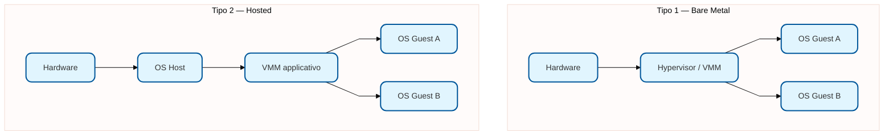
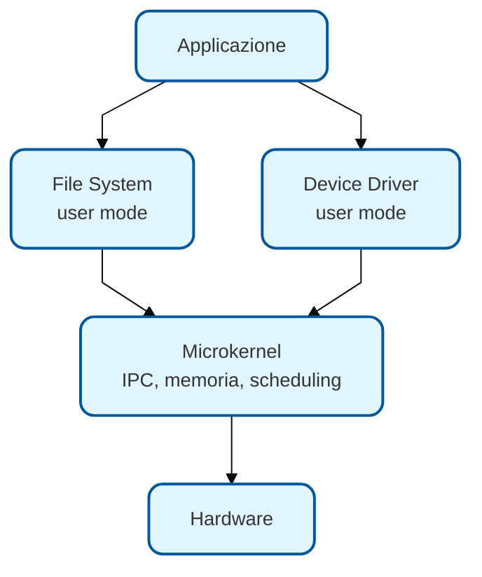
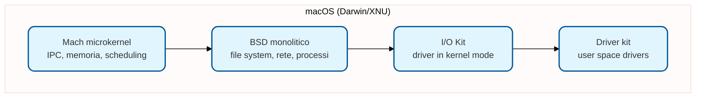

# SO — Lezione 2: Virtualizzazione, Struttura del Kernel e Processi

**Docente:** Prof. Alberto Finzi | **Corso:** Sistemi Operativi | **CFU:** 9

---

## Argomenti trattati

- Emulazione vs virtualizzazione
- Virtualizzazione di tipo 1 (bare metal) e tipo 2 (hosted)
- Anelli di protezione: ring 0, 1, 2, 3, -1
- Struttura del kernel: monolitico, stratificato, microkernel, modulare, ibrido
- Case study: Linux (KVM), Windows (Hyper-V), macOS (Darwin/XNU), Android
- Processo: definizione, differenza da programma e da job
- Layout di memoria di un processo
- Ciclo di vita dei processi (stati)
- Process Control Block (PCB / Task Control Block in Linux)
- Context switch
- Schedulazione dei processi
- Creazione di processi: fork, exec, wait

---

## Emulazione e Virtualizzazione

### Emulazione software

L'emulazione è la riproduzione **completa** di un'architettura hardware via software. Un programma simula ogni componente della macchina target, inclusi CPU, bus, periferiche. Sopra questo strato si installa un sistema operativo che non sa di girare su un sistema emulato.

> [!example] QEMU
> QEMU può emulare un'architettura ARM su un host x86-64. Il sistema operativo guest gira come se fosse su hardware ARM reale. Questo è molto flessibile ma estremamente costoso in termini di prestazioni.

L'emulazione si usa per scopi molto specifici. Per eseguire sistemi operativi diversi sulla stessa macchina si preferisce la virtualizzazione.

### Virtualizzazione

La virtualizzazione permette di eseguire più sistemi operativi sulla **stessa architettura hardware** in modo molto più efficiente dell'emulazione. Non si simula tutto l'hardware: si cerca di far lavorare i guest direttamente sull'hardware reale, con uno strato software che gestisce la condivisione delle risorse.

Esistono tre approcci:

| Tipo | Caratteristica | Prestazioni |
|---|---|---|
| **Virtualizzazione completa** | Il guest non sa di essere virtualizzato | Buone |
| **Paravirtualizzazione** | Il guest sa di essere virtualizzato e collabora via API speciali | Ottime |
| **Virtualizzazione assistita da hardware** | La CPU fornisce istruzioni dedicate per la virtualizzazione | Ottime — standard moderno |

Le CPU moderne (Intel VT-x, AMD-V) supportano direttamente la virtualizzazione a livello hardware: questo è il fondamento della virtualizzazione moderna.

---

## Virtualizzazione Tipo 1 vs Tipo 2



**Tipo 1 (bare metal):** lo hypervisor si installa direttamente sull'hardware, senza sistema operativo host sottostante. È uno strato leggerissimo che gestisce le risorse fisiche e permette a più kernel di girarci sopra. Prestazioni massime. Esempi: VMware ESXi, Xen.

**Tipo 2 (hosted):** lo hypervisor è un'applicazione che gira sopra un sistema operativo host già installato. Il guest deve passare per il kernel del sistema host, quindi è più lento. Esempi: VirtualBox, VMware Workstation/Fusion.

---

## Ring di protezione

Le CPU x86 supportano 4 livelli di privilegio (ring):

```
Ring -1  →  Hypervisor (VMM tipo 1) — massima priorità, introdotto per la virtualizzazione
Ring  0  →  Kernel mode — massima protezione per il SO
Ring  1  →  (raramente usato)
Ring  2  →  (raramente usato)
Ring  3  →  User mode — processi utente
```

In pratica, i sistemi operativi moderni usano **ring 0** (kernel mode) e **ring 3** (user mode). Ring 1 e 2 erano stati pensati per stratificare i permessi (es. device driver in ring 1), ma l'overhead di comunicazione tra ring li ha resi poco pratici.

> [!warning] Driver in ring 0 e anti-cheat
> In Linux e Windows, i driver fanno tipicamente parte del kernel, quindi girano in ring 0. Questo significa che un driver ha accesso completo alla macchina. Alcuni sistemi anti-cheat per videogiochi sfruttano questa caratteristica per fare controlli profondi sullo stato del sistema. Ring 1 e 2 erano stati pensati proprio per evitare questo, ma non si usano.

**Ring -1 (hypervisor mode):** introdotto per supportare la virtualizzazione tipo 1 a livello hardware. Lo hypervisor deve stare "sotto" tutti i kernel guest, quindi necessita di un livello di privilegio ancora più elevato del ring 0.

---

## Struttura del Kernel: paradigmi di progettazione

### Sistemi Monolitici

Il kernel è un unico blocco di codice (unico spazio di indirizzamento). Tutte le componenti si possono chiamare direttamente. Esempi: Linux, Unix originale.

Vantaggi: velocità, comunicazione diretta tra componenti interne.
Svantaggi: difficile da mantenere, ogni modifica richiede la ricompilazione dell'intero kernel.

> [!example] MS-DOS: l'estremo opposto
> Il primo MS-DOS era monoutente e monotask, senza separazione tra modalità kernel e utente. Un'applicazione poteva accedere direttamente ai servizi più bassi del sistema. Non c'era protezione.

### Sistemi Stratificati

Il kernel è organizzato in strati (anelli concentrici), dove ogni strato usa solo i servizi dello strato inferiore. Molto elegante dal punto di vista teorico, ma ha causato overhead eccessivo: ogni comunicazione tra strati richiedeva una chiamata di interfaccia.

### Microkernel

Si mette nel kernel **solo il minimo indispensabile**: scheduling di base, gestione della memoria, IPC (comunicazione interprocesso). Tutto il resto — file system, driver, gestione della rete — va in user space come processi separati.



Vantaggi: alta modularità, sicurezza (un crash del driver non abbatte il kernel), portabilità.

Svantaggio: **overhead di comunicazione**. Ogni volta che un modulo deve comunicare con un altro deve passare per il microkernel tramite message passing. Le performance calano significativamente.

> [!example] Storia: Windows NT → XP
> Windows NT 4.0 era nato come microkernel. Le prestazioni erano inferiori rispetto a Windows 95. Con NT 4.0 alcuni servizi vennero spostati dentro il kernel. Con Windows XP la struttura è diventata più monolitica. Il campo ha quindi fatto da laboratorio per questa scelta di design.

### Kernel Modulare

Approccio usato dai kernel moderni (Linux, Solaris, Windows). Il kernel ha un nucleo fisso a cui si possono agganciare/sganciare **moduli** dinamicamente, senza ricompilare. I moduli vengono linkati dentro il kernel → nessun overhead di message passing, ma comunque compartimentazione del codice.

> [!tip] Parole del Professore
> > [!quote]
> > "È simile al microkernel per l'idea di compartimentazione, ma senza il message passing. I moduli stanno dentro il kernel, si parlano direttamente."

### Sistemi Ibridi

La maggior parte dei kernel reali combina più approcci:



**macOS** usa **Mach** (derivato di microkernel) per IPC, memoria e scheduling. Ma il file system e la gestione dei processi sono gestiti da **BSD** in modo monolitico, perché in modalità microkernel le prestazioni erano insufficienti. I driver sono in parte in kernel space (IOP) e in parte in user space.

**Android** usa un kernel Linux modificato come base, poi aggiunge strati: HAL (Hardware Abstraction Layer), runtime (ART), librerie Android, application framework.

---

## Il Processo

### Programma vs Processo vs Job

| Concetto | Definizione |
|---|---|
| **Programma** | File passivo stoccato in memoria secondaria. Non fa nulla da solo. |
| **Processo** | Programma in esecuzione: ha un program counter, uno spazio di memoria dedicato, un ciclo di vita. L'esecuzione è sequenziale. |
| **Job** | Unità di lavoro più astratta. Un job può generare più processi. Rimane come termine storico (dai sistemi batch con schede perforate). |

> [!warning] Job e processo non sono sinonimi
> Un job è l'unità di lavoro computazionale lanciata dall'utente. Quando lo scheduler di sistema (da shell) mostra i job, uno stesso job può corrispondere a più processi. In molti libri vengono usati in modo intercambiabile, ma formalmente il job è più astratto.

### Layout di memoria di un processo

Quando un processo viene caricato in memoria principale, occupa una zona dedicata (memoria logica) strutturata in segmenti:

```
┌──────────────────┐  ← stack pointer
│      STACK       │  ↓ cresce verso il basso
│  (var locali,    │
│   frame chiamate)│
├──────────────────┤
│                  │
│   spazio libero  │
│                  │
├──────────────────┤
│      HEAP        │  ↑ cresce verso l'alto
│ (malloc dinamica)│
├──────────────────┤
│  DATA (iniz.)    │  variabili globali inizializzate
├──────────────────┤
│  BSS (non iniz.) │  variabili globali non inizializzate
├──────────────────┤
│      TEXT        │  ← istruzioni del programma
└──────────────────┘
```

Quando stack e heap si incontrano → **stack overflow**.

> [!tip] Memoria logica ≠ fisica
> Questo schema è la **memoria logica** del processo: quella che la CPU e il programmatore "vedono". La memoria **fisica** è diversa: i segmenti possono essere sparsi ovunque in RAM. Il sistema operativo (con l'ausilio dell'hardware MMU) mantiene la traduzione tra i due.

---

## Ciclo di vita dei processi

```mermaid
%%{init: {'flowchart': {'curve': 'linear', 'useMaxWidth': true, 'htmlLabels': true}, 'theme': 'base', 'themeVariables': {'fontSize': '14px', 'primaryColor': '#e1f5fe', 'primaryBorderColor': '#01579b'}}}%%
stateDiagram-v2
    %% Definizione dello stile per adattarsi all'A4
    classDef default fill:#e1f5fe,stroke:#01579b,stroke-width:2px,rx:10,ry:10;
    [*] --> New : creazione
    New --> Ready : ammissione
    Ready --> Running : dispatch (scheduler)
    Running --> Ready : interrupt / time slice esaurito
    Running --> Waiting : richiesta I/O o attesa evento
    Waiting --> Ready : I/O completato / evento arrivato
    Running --> Terminated : exit / errore
    Terminated --> [*]
```

**New** — il processo è stato creato ma non ancora ammesso alla coda di esecuzione.
**Ready** — il processo è pronto per girare, aspetta che lo scheduler gli assegni la CPU.
**Running** — il processo sta usando la CPU.
**Waiting** — il processo è bloccato in attesa di un evento esterno (I/O, segnale, fine di un figlio).
**Terminated** — il processo è terminato (normalmente o per eccezione).

> [!example] Zombie
> In Unix/Linux esiste anche lo stato **zombie**: quando un figlio termina prima del padre ma il padre non ha ancora chiamato `wait()`, il figlio rimane in stato zombie — è terminato, ma le sue informazioni nel PCB rimangono fino a quando il padre non le raccoglie.
>
> Se il padre termina prima del figlio, il figlio viene **adottato da systemd** (PID 1), che raccoglierà il suo exit status al momento opportuno.

---

## Process Control Block (PCB)

Per ogni processo, il kernel mantiene una struttura dati chiamata **Process Control Block** (in Linux: **Task Control Block**, perché Linux unifica processi e thread nel concetto di "task").

Il PCB contiene:

| Campo | Descrizione |
|---|---|
| **State** | Stato corrente (ready, running, waiting, ...) |
| **PID** | Process ID — numero univoco assegnato dal kernel |
| **Program Counter** | Indirizzo della prossima istruzione da eseguire |
| **Registri CPU** | Snapshot di tutti i registri al momento della sospensione |
| **Info schedulazione** | Priorità, contatori di uso della CPU |
| **Info memoria** | Puntatori ai segmenti (text, data, stack, heap) |
| **File aperti** | Lista dei file descriptor aperti dal processo |
| **PPID** | Parent PID — ID del processo padre |

> [!tip] PID 0 e PID 1
> Il **PID 0** è il processo idle, un processo speciale che rappresenta "prima di tutto". Il **PID 1** è **systemd** (o `init` nei sistemi più vecchi), il primo processo utente, da cui derivano per filiazione tutti gli altri.

Linux tratta processi e thread con lo stesso meccanismo (task). La chiamata `clone()` permette di scegliere quante risorse condividere tra il padre e il figlio: nessuna condivisione → processo separato; condivisione dello spazio di indirizzamento → thread.

---

## Context Switch

Quando la CPU passa da un processo all'altro, avviene il **context switch**:

```mermaid
%%{init: {'flowchart': {'curve': 'linear', 'useMaxWidth': true, 'htmlLabels': true}, 'theme': 'base', 'themeVariables': {'fontSize': '14px', 'primaryColor': '#e1f5fe', 'primaryBorderColor': '#01579b'}}}%%
sequenceDiagram
    %% Definizione dello stile per adattarsi all'A4
    classDef default fill:#e1f5fe,stroke:#01579b,stroke-width:2px,rx:10,ry:10;
    participant CPU
    participant PCB_A as PCB Processo A
    participant PCB_B as PCB Processo B
    CPU ->> PCB_A: salva stato (PC, registri, ...)
    CPU ->> PCB_B: carica stato
    CPU ->> CPU: esegue Processo B
    CPU ->> PCB_B: salva stato
    CPU ->> PCB_A: carica stato
    CPU ->> CPU: riprende Processo A
```

Il context switch è un overhead puro: il sistema non fa lavoro utile durante questa operazione. Per questo le CPU moderne supportano meccanismi (cache L1/L2, ottimizzazioni hardware) per rendere queste operazioni il più veloci possibile.

---

## Schedulazione dei processi

Lo **scheduler** è il componente del kernel che decide quale processo in coda-ready può usare la CPU.

**Short-term scheduler (CPU scheduler):** viene eseguito molto frequentemente (ogni time slice). Deve essere molto veloce. Seleziona il prossimo processo dalla coda dei ready.

**Long-term scheduler (job scheduler):** nei sistemi tradizionali controlla il grado di multiprogrammazione (quanti processi sono caricati in memoria). Nei sistemi Linux/Unix moderni non è un componente esplicito: è il risultato di vari meccanismi combinati.

### Classificazione dei processi

**I/O-bound:** richiedono molto I/O (interazione con periferiche, utente, rete). L'utente che usa un browser o un videogioco è I/O-bound. La CPU non deve essere monopolizzata: questi processi devono essere reattivi.

**CPU-bound:** richiedono computazione intensa. Un rendering video, una compilazione, un training di ML. Possono girare più a lungo sulla CPU senza impatto percepibile sull'interattività.

Una buona policy di scheduling deve bilanciare questi due tipi, evitando che i processi CPU-bound monopolizzino la CPU a scapito della reattività dei processi I/O-bound.

---

## Creazione dei processi: fork, exec, wait

Le chiamate di sistema POSIX fondamentali per la gestione dei processi:

**`fork()`** — clona il processo corrente. Da quel momento il codice viene eseguito da due processi separati con spazi di indirizzamento distinti (ma che condividono i file descriptor già aperti). Al padre restituisce il PID del figlio; al figlio restituisce 0.

**`exec()`** — sostituisce il programma del processo corrente con un altro. L'area text viene sovrascritta con le istruzioni del nuovo programma; stack e heap vengono reinizializzati. Il PID rimane lo stesso. Spesso usato dal figlio subito dopo `fork()` per diventare un programma diverso.

**`wait()`** — il processo padre si sospende in attesa che un figlio termini. Raccoglie l'exit status del figlio. Serve per evitare che il figlio rimanga zombie.

```c
pid_t pid = fork();
if (pid < 0) {
    // errore: fork fallita
    exit(1);
} else if (pid == 0) {
    // sono il figlio
    execl("/bin/ls", "ls", NULL);  // divento 'ls'
} else {
    // sono il padre
    wait(NULL);  // aspetto la fine del figlio
}
```

> [!warning] Fork bomb
> Se si chiama `fork()` dentro un ciclo senza condizioni di uscita corrette, il numero di processi raddoppia ad ogni iterazione: 1 → 2 → 4 → 8 → ... La macchina esaurisce le risorse e si blocca. È uno dei casi classici in cui la mancanza di comprensione del meccanismo causa danni.

---

> [!abstract] Punti chiave della lezione
> - La virtualizzazione tipo 1 (bare metal) è più efficiente del tipo 2 (hosted); entrambe si distinguono dall'emulazione, che riproduce software l'intera architettura.
> - I kernel moderni sono ibridi: prendono idee dal monolitico (prestazioni), dal microkernel (modularità) e dalla struttura modulare (estendibilità).
> - Un processo è un programma in esecuzione con un proprio spazio di memoria, un program counter e un ciclo di vita.
> - Il PCB è la struttura dati del kernel che mantiene tutto lo stato di un processo; il context switch la usa per passare da un processo all'altro.
> - `fork()` clona il processo, `exec()` lo trasforma in un programma diverso, `wait()` sincronizza padre e figlio.

## Prossimi argomenti

- [ ] Thread: differenza con i processi, modelli N:1, 1:1, M:N
- [ ] Algoritmi di schedulazione: FCFS, SJF, Round Robin, priorità, CFS di Linux
- [ ] Problemi di concorrenza: race condition, sezione critica
- [ ] Sincronizzazione: mutex, semafori

---

#SO #virtualizzazione #ring #microkernel #monolitico #modulare #processi #PCB #fork #scheduling #context-switch
