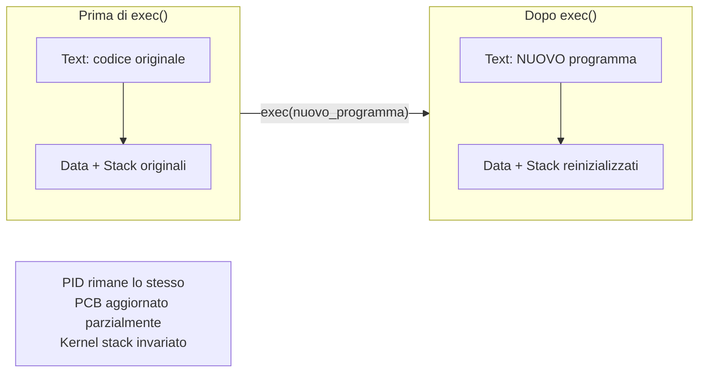
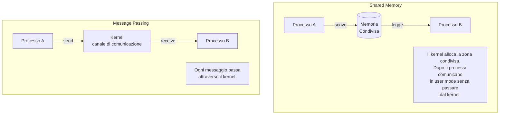
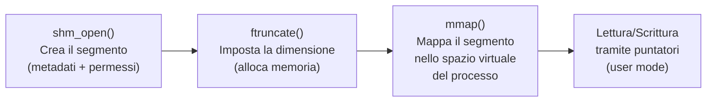
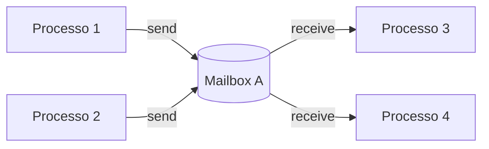

# SO — Lezione 3: Comunicazione tra Processi (IPC) e Memoria Condivisa

**Docente:** Prof. Alberto Finzi | **Corso:** Sistemi Operativi | **CFU:** 9

---

## Argomenti trattati

- Ripasso: formato degli eseguibili (.out → .elf), layout di memoria a tempo di esecuzione
- Spazio di indirizzamento virtuale: zona user mode e zona kernel
- Operazioni sui processi: fork, exec, wait (approfondimento)
- Exit status e macro di lettura (WIFEXITED, WEXITSTATUS)
- Processi zombie, terminazione e cascading termination
- Comunicazione tra processi (IPC): shared memory vs message passing
- Problema produttore-consumatore con buffer circolare (bounded buffer)
- API POSIX per la shared memory: `shm_open`, `ftruncate`, `mmap`
- Message passing: comunicazione diretta e indiretta (mailbox/porte)
- Comunicazione sincrona vs asincrona, rendezvous
- Buffering: capacita zero, limitata, illimitata
- Memory mapped files: `MAP_SHARED`, `MAP_PRIVATE`, `MAP_ANONYMOUS`

---

## Ripasso: Formato degli Eseguibili e Layout in Memoria

### Da .out a .elf

Il file eseguibile in memoria secondaria contiene sezioni diverse da quelle che il processo ha a tempo di esecuzione in RAM. L'eseguibile contiene indicazioni per il **loader** (caricatore): offset, struttura dei segmenti, informazioni su dove sono stoccati i dati in memoria secondaria.

> [!abstract] Definizione: Formato ELF
> **ELF** (Executable and Linkable Format) e il formato standard moderno per gli eseguibili in Linux. Sostituisce il vecchio formato **.out**. Il file ELF contiene diverse "viste" sulla struttura del programma: il loader legge prima un header, capisce come e strutturato il file, e poi va a caricare i vari segmenti nello spazio di indirizzamento virtuale del processo.

Ogni formato di eseguibile e legato a un tipo specifico di caricatore. Il loader ispeziona l'header del file, determina la struttura, e carica i segmenti nello spazio di indirizzamento che il sistema operativo dedica al processo.

### Spazio di indirizzamento virtuale

Il sistema operativo dedica ad ogni processo uno **spazio di indirizzamento virtuale** che da l'illusione alla CPU di avere indirizzi continui (da 0 fino a un massimo). Il processo e segregato in questo spazio:

```
┌─────────────────────────────┐  alta memoria
│       KERNEL SPACE          │  ← mappato per ogni processo
│  (shared, stesso codice)    │     (stesso codice fisico)
├─────────────────────────────┤
│         STACK               │  ↓ cresce verso il basso
│   (var locali, frame)       │
├─────────────────────────────┤
│       spazio libero         │
├─────────────────────────────┤
│         HEAP                │  ↑ cresce verso l'alto
│   (allocazione dinamica)    │
├─────────────────────────────┤
│     DATA (inizializzate)    │
├─────────────────────────────┤
│     BSS (non inizializzate) │
├─────────────────────────────┤
│         TEXT                │  ← istruzioni del programma
└─────────────────────────────┘  bassa memoria (user space)
```

> [!warning] Kernel space nello spazio virtuale del processo
> Ogni processo "pensa" di avere tutta la macchina per se: sia lo spazio user mode (dove lavora normalmente), sia una zona dove e mappato il kernel. In realta il kernel e **shared**: ogni processo lo mappa nello stesso punto, ed e sempre lo stesso codice fisico. La CPU, quando esegue, lavora con indirizzi virtuali e ha l'illusione di una macchina semplificata tutta per lei.

- **Operazioni in user mode:** tutto cio che il processo fa nel proprio spazio di indirizzamento (calcoli, variabili locali, variabili globali) rimane in user mode.
- **Passaggio a kernel mode:** quando il processo deve accedere a una periferica, aprire un file, o qualsiasi operazione che esce dal suo spazio → avviene un **trap** e si entra in kernel mode. Finita la routine di servizio, si ritorna in user mode.

### PCB e Kernel Stack

Per ogni processo, oltre al Process Control Block, esiste un **kernel stack** dedicato:

- Il PCB contiene i metadati del processo (stato, PID, registri, ecc.)
- Il kernel stack e puntato dal PCB e viene usato per le operazioni in kernel mode
- Durante il **context switch**, i registri vengono salvati nel kernel stack (non direttamente nel PCB)

---

## Operazioni sui Processi: fork, exec, wait

### fork() — Approfondimento

> [!abstract] Definizione: fork()
> `fork()` e una chiamata di sistema POSIX che **clona** il processo corrente. Crea un nuovo processo figlio con un proprio spazio di indirizzamento che e una **copia esatta** di quello del padre. Da quel momento le variabili viaggiano in modo indipendente: modifiche del padre non sono visibili al figlio e viceversa.

Comportamento del valore di ritorno:

| Processo | Valore restituito da `fork()` | Significato |
|---|---|---|
| **Padre** | PID del figlio (intero > 0) | Il padre conosce il "nome" del figlio |
| **Figlio** | 0 | Indica che e il figlio (il suo PID reale e diverso) |
| **Errore** | -1 | La fork e fallita |

> [!warning] Dopo la fork il codice non e piu sequenziale
> Dalla `fork()` in poi bisogna ragionare con **due teste**: la testa del padre e la testa del figlio. Entrambi eseguono lo stesso codice a partire dall'istruzione successiva alla fork, ma seguono rami diversi in base al valore di ritorno.

```c
pid_t pid = fork();
if (pid < 0) {
    // Errore: fork fallita
    perror("fork failed");
    exit(1);
} else if (pid == 0) {
    // Codice eseguito dal FIGLIO
    execl("/bin/ls", "ls", NULL);  // il figlio diventa 'ls'
    // Se exec fallisce (es. comando non trovato), si arriva qui
} else {
    // Codice eseguito dal PADRE
    wait(NULL);  // il padre si blocca fino alla fine del figlio
    printf("Child complete\n");
}
```

**Cosa succede nell'esempio:**
1. Il padre chiama `fork()` → il kernel crea un nuovo PCB per il figlio, duplica lo spazio di indirizzamento
2. Il figlio entra nel ramo `pid == 0` e chiama `execl("/bin/ls", "ls", NULL)`
3. La `exec` sostituisce **tutto** il contenuto della memoria del figlio con il programma `ls`
4. Il padre entra nel ramo `else`, chiama `wait(NULL)` e si mette in coda di attesa (stato **waiting**)
5. Il figlio (`ls`) termina, il sistema invia un segnale **SIGCHILD** al padre
6. Il padre si sblocca dalla `wait`, stampa "Child complete" e termina

### exec() — Sostituzione del programma

> [!abstract] Definizione: exec()
> `exec()` **sostituisce** il contenuto della memoria del processo corrente con un nuovo programma. Il segmento text viene sovrascritto con le istruzioni del nuovo programma, stack e heap vengono reinizializzati, e il program counter salta all'inizio del nuovo codice. I **metadati** del processo (PID, PCB) rimangono gli stessi: cambia solo il contenuto della memoria.



> [!warning] exec() e un punto di non ritorno
> Dopo la `exec`, il codice del programma precedente e **perso** (sovrascritto). Qualsiasi istruzione scritta dopo la `exec` non verra mai eseguita, a meno che la `exec` non fallisca (restituisce -1). Per esempio, se si chiama `execl("LS", ...)` con nome maiuscolo, su Linux/Unix (case-sensitive) il comando non viene trovato, la exec fallisce e l'esecuzione prosegue.

L'`exec` e legata al **loader**: il loader viene invocato, carica il nuovo programma nello spazio di indirizzamento, e il program counter salta all'inizio del nuovo text. Esistono varianti dell'exec che permettono anche di modificare l'**ambiente di esecuzione** (variabili d'ambiente, path, ecc.).

### wait() e Exit Status

Il padre puo aspettare la terminazione del figlio con `wait()` e raccogliere il suo **exit status**:

```c
int status;
pid_t child_pid = wait(&status);
```

> [!abstract] Definizione: Exit Status
> L'exit status e un intero **opaco**: non si legge direttamente come un numero, ma va interpretato **bit a bit** tramite macro standard. I primi 16 bit sono significativi: i bit meno significativi (7 bit) indicano il **segnale** che ha causato la terminazione, i bit piu significativi indicano l'**exit code**.

```
Exit Status (int):
┌────────────────────────────────┐
│  ... | exit code (8 bit) | signal (7 bit) | core dump (1 bit) │
└────────────────────────────────┘
```

**Macro standard per leggere lo status:**

| Macro | Descrizione |
|---|---|
| `WIFEXITED(status)` | Restituisce vero se il processo e terminato **normalmente** (exit o return) |
| `WEXITSTATUS(status)` | Restituisce il codice di uscita (significativo solo se `WIFEXITED` e vero) |
| `WIFSIGNALED(status)` | Restituisce vero se il processo e stato terminato da un **segnale** |

> [!example] Tre modi di terminazione di un figlio
> ```c
> // Figlio 1: terminazione normale
> pid = fork();
> if (pid == 0) exit(42);          // exit code = 42
>
> // Figlio 2: abort (terminazione anomala volontaria)
> pid = fork();
> if (pid == 0) abort();           // segnale SIGABRT
>
> // Figlio 3: eccezione (divisione per zero)
> pid = fork();
> if (pid == 0) { int x = 1/0; }  // segnale SIGFPE
> ```
> In tutti e tre i casi il padre raccoglie lo status con `wait(&status)` e usa le macro per distinguere la causa della terminazione. Il primo caso ha `WIFEXITED` = true; il secondo e il terzo hanno `WIFSIGNALED` = true con segnali diversi.

### Crescita esponenziale dei processi (fork bomb)

> [!warning] Fork in un ciclo = crescita esponenziale
> Se si inserisce una `fork()` dentro un ciclo, il numero di processi cresce **esponenzialmente**: con un ciclo `for(i=0; i<N; i++) fork()`, ad ogni iterazione ogni processo esistente si duplica. Con N=2 si arriva a 4 processi. Un `while(1) fork()` satura rapidamente le risorse del sistema, causando **thrashing** (il kernel cerca continuamente di fare context switch senza riuscire a fare lavoro utile).

---

## Processi Zombie e Terminazione

### Zombie

> [!abstract] Definizione: Processo Zombie
> Un processo zombie e un figlio che e **terminato** ma il cui padre non ha ancora chiamato `wait()`. Il PCB e tutta l'impalcatura del processo rimangono in memoria **solo** per consegnare l'exit status al padre. Se il padre non raccoglie mai lo status, il zombie rimane indefinitamente.

Questo puo essere un problema serio nei **server multiprocesso**: il processo principale (padre) rimane sempre attivo e lancia figli per gestire i client. Se i figli terminano ma il padre non li "raccoglie", il sistema si popola di zombie fino a esaurire le risorse.

> [!example] Server con zombie
> Un server che gestisce client con processi figli: ogni client che si disconnette causa la terminazione del figlio. Se il padre non chiama `wait()`, ogni figlio diventa zombie. Soluzione: creare i figli in modalita **detached** (cosi non diventano zombie) oppure gestire il segnale SIGCHILD nel padre.

### Orfani e adozione

Se il **padre termina prima del figlio**, in Linux il figlio viene **adottato da systemd** (PID 1), che si occupa di raccogliere il suo exit status. In questo modo il figlio orfano non diventa zombie.

### Cascading termination

In alcuni sistemi operativi, la morte del padre causa la **terminazione a cascata** di tutta la gerarchia dei figli. Questa non e la scelta piu comune: di solito si preferisce mantenere i figli in vita.

---

## Comunicazione tra Processi (IPC)

I processi sono **isolati** tra loro: ogni processo ha il proprio spazio di indirizzamento e non puo accedere alla memoria degli altri. Il problema principale e quindi farli **comunicare**.

> [!abstract] Definizione: Inter-Process Communication (IPC)
> L'IPC e l'insieme dei meccanismi forniti dal kernel per permettere a processi separati di scambiare dati e coordinarsi. Esistono due paradigmi fondamentali: **shared memory** e **message passing**.



| Caratteristica | Shared Memory | Message Passing |
|---|---|---|
| **Meccanismo** | Zona di memoria condivisa tra processi | Canale di comunicazione gestito dal kernel |
| **Intervento del kernel** | Solo alla creazione; poi i processi lavorano in user mode | Ad ogni messaggio inviato/ricevuto |
| **Sincronizzazione** | A carico dei processi (mutex, semafori, ecc.) | Gestita implicitamente dal meccanismo |
| **Prestazioni** | Piu veloce per grandi quantita di dati | Overhead per ogni messaggio |
| **Rischio** | Race condition su variabili condivise | Meno problematico |

> [!warning] Shared memory: la sincronizzazione e responsabilita dei processi
> Una volta che il kernel concede l'accesso alla memoria condivisa, i processi comunicano in **user mode** senza chiedere permesso al kernel ad ogni operazione. Questo e veloce, ma significa che se i processi si "pestano i piedi" (scrivono contemporaneamente), il kernel non interviene. Servono meccanismi di sincronizzazione espliciti (mutex, semafori, ecc.).

---

## Problema Produttore-Consumatore

> [!abstract] Definizione: Produttore-Consumatore
> Un processo **produttore** genera dati e li inserisce in un buffer; un processo **consumatore** preleva i dati dal buffer e li elabora. Il buffer risiede in una zona di **memoria condivisa** tra i due processi.

### Buffer bounded (dimensione fissa) con struttura circolare

Si utilizza un array circolare con due indici:
- **`in`**: prossima locazione libera (dove il produttore inserisce)
- **`out`**: prima posizione occupata (da cui il consumatore preleva)

```
     out           in
      ↓             ↓
┌───┬───┬───┬───┬───┬───┬───┬───┐
│   │ X │ X │ X │ X │   │   │   │
└───┴───┴───┴───┴───┴───┴───┴───┘
  0   1   2   3   4   5   6   7
       ←── dati presenti ──→
```

**Condizioni:**
- **Buffer vuoto:** `in == out`
- **Buffer pieno:** `(in + 1) % BUFFER_SIZE == out` (si spreca una locazione)

### Codice del produttore

```c
#define BUFFER_SIZE 8
int buffer[BUFFER_SIZE];
int in = 0, out = 0;

// PRODUTTORE
while (true) {
    int next_produced = produce_item();

    // Busy waiting: aspetta finche il buffer e pieno
    while ((in + 1) % BUFFER_SIZE == out)
        ; // non fa nulla, cicla

    buffer[in] = next_produced;
    in = (in + 1) % BUFFER_SIZE;
}
```

### Codice del consumatore

```c
// CONSUMATORE
while (true) {
    // Busy waiting: aspetta finche il buffer e vuoto
    while (in == out)
        ; // non fa nulla, cicla

    int next_consumed = buffer[out];
    out = (out + 1) % BUFFER_SIZE;

    consume_item(next_consumed);
}
```

> [!warning] Il busy waiting e problematico
> Il `while(condizione) ;` e un'**attesa attiva** (busy waiting): il processo continua a controllare la condizione consumando cicli di CPU inutilmente. In futuro vedremo come evitarlo con **variabili di condizione**: il processo si addormenta in wait e viene risvegliato da un segnale quando la condizione cambia.

> [!warning] Le operazioni non sono atomiche
> Questa soluzione **non e sufficiente** nella pratica: le operazioni di controllo e aggiornamento delle variabili condivise (`in`, `out`) non sono **atomiche**. A livello macchina, un'istruzione ad alto livello come `in = (in + 1) % BUFFER_SIZE` si traduce in piu istruzioni elementari che possono **interforliarsi** (interleaving) tra i due processi, causando **race condition**. Servono meccanismi di sincronizzazione (mutex, semafori) o operazioni **lock-free** (istruzioni atomiche hardware che tentano l'operazione e, se falliscono, riprovano senza causare danni).

---

## API POSIX per la Shared Memory

L'API POSIX mette a disposizione un meccanismo per creare e gestire segmenti di memoria condivisa trattandoli come se fossero file.

### Passi per creare shared memory



### shm_open() — Creazione del segmento

```c
int fd = shm_open("/my_shm",        // nome del segmento (come un file)
                  O_CREAT | O_RDWR,  // crea se non esiste, read-write
                  0666);             // permessi (rw per tutti)
```

> [!abstract] Definizione: shm_open()
> `shm_open()` crea (o apre) un oggetto di memoria condivisa identificato da un **nome**. Restituisce un **file descriptor** (un intero che identifica univocamente il segmento). A questo punto sono stati creati solo i **metadati** nel kernel; la memoria vera e propria non e ancora allocata.

### ftruncate() — Dimensionamento

```c
ftruncate(fd, 4096);  // alloca 4096 byte di memoria condivisa
```

Tramite il file descriptor restituito da `shm_open()`, si specifica la **dimensione** effettiva della memoria condivisa.

### mmap() — Mappatura in memoria

```c
char *ptr = (char *) mmap(0,             // indirizzo suggerito (0 = lascia decidere il kernel)
                          4096,           // dimensione
                          PROT_WRITE,     // protezione: permette scrittura
                          MAP_SHARED,     // condivisa tra processi
                          fd,             // file descriptor
                          0);             // offset
```

> [!abstract] Definizione: mmap()
> `mmap()` mappa il segmento di memoria condivisa nello **spazio di indirizzamento virtuale** del processo. Restituisce un puntatore tramite il quale si puo leggere e scrivere direttamente in user mode, come se fosse memoria locale.

### Esempio completo: Produttore e Consumatore con POSIX Shared Memory

**Produttore (crea e scrive):**

```c
#include <fcntl.h>
#include <sys/mman.h>
#include <unistd.h>
#include <string.h>
#include <stdio.h>

int main() {
    // 1. Crea il segmento di shared memory
    int fd = shm_open("/my_shm", O_CREAT | O_RDWR, 0666);

    // 2. Imposta la dimensione
    ftruncate(fd, 4096);

    // 3. Mappa in memoria (scrittura)
    char *ptr = (char *) mmap(0, 4096, PROT_WRITE, MAP_SHARED, fd, 0);

    // 4. Scrive nella memoria condivisa
    sprintf(ptr, "Hello from producer!");

    return 0;
}
```

**Consumatore (apre e legge):**

```c
#include <fcntl.h>
#include <sys/mman.h>
#include <stdio.h>

int main() {
    // 1. Apre il segmento ESISTENTE (stesso nome!)
    int fd = shm_open("/my_shm", O_RDONLY, 0666);

    // 2. Mappa in memoria (sola lettura)
    char *ptr = (char *) mmap(0, 4096, PROT_READ, MAP_SHARED, fd, 0);

    // 3. Legge dalla memoria condivisa
    printf("Received: %s\n", ptr);

    // 4. Rimuove il segmento
    shm_unlink("/my_shm");

    return 0;
}
```

> [!example] Come funziona la condivisione
> Il produttore chiama `shm_open("/my_shm", ...)` e mappa la memoria nel proprio spazio virtuale con `PROT_WRITE`. Il consumatore usa lo **stesso nome** `"/my_shm"` per accedere alla stessa zona di memoria fisica. Ogni processo "vede" la memoria condivisa nel proprio spazio di indirizzamento (con puntatori diversi), ma in RAM esiste **una sola copia** dei dati. Il processo che crea la shared memory alloca veramente la memoria fisica; gli altri processi la mappano come una "proiezione".

---

## Memory Mapped Files

Lo stesso meccanismo `mmap()` puo essere usato per mappare un **file reale** dalla memoria secondaria direttamente nello spazio di indirizzamento del processo:

| Flag | Significato |
|---|---|
| `MAP_SHARED` | Le modifiche in memoria vengono propagate al file e sono visibili ad altri processi |
| `MAP_PRIVATE` | Le modifiche restano locali al processo e **non vengono salvate** sul file (copy-on-write) |
| `MAP_ANONYMOUS` | Alloca memoria pura (RAM volatile), senza associazione a nessun file |

> [!example] Editor di testo e memory mapped files
> Gli editor di testo mappano i file in memoria con `mmap()` per velocizzare le operazioni: invece di fare letture e scritture ripetute su disco, si lavora direttamente con puntatori in RAM. Le modifiche vengono eventualmente salvate sul file alla chiusura. Questo e molto piu efficiente che leggere/scrivere il file ad ogni modifica.

---

## Message Passing

Il secondo paradigma di IPC e il **message passing**: i processi comunicano scambiandosi messaggi attraverso un canale gestito dal kernel.

### Operazioni fondamentali

```c
send(messaggio);     // invia un messaggio sul canale
receive(messaggio);  // riceve un messaggio dal canale
```

### Proprieta del canale di comunicazione

Un canale di comunicazione puo avere diverse caratteristiche:

| Proprieta | Opzioni |
|---|---|
| **Numero di processi** | Solo 2 (punto-a-punto) oppure piu processi sullo stesso canale |
| **Numero di canali** | Uno o piu canali tra la stessa coppia di processi |
| **Capacita** | Limitata (buffer finito) oppure illimitata |
| **Dimensione messaggi** | Fissa o variabile |
| **Direzione** | Unidirezionale o bidirezionale |

---

### Comunicazione Diretta vs Indiretta

#### Comunicazione diretta (naming esplicito)

Il mittente specifica **direttamente** il processo destinatario:

```c
send(P, messaggio);      // invia a processo P
receive(Q, messaggio);   // ricevi da processo Q
```

Il canale e vincolato esattamente a quei due processi. Il codice e **strettamente legato** ai nomi dei processi → scarsa flessibilita.

La comunicazione diretta puo essere:
- **Simmetrica:** sia il sender che il receiver devono conoscere il nome dell'altro
- **Asimmetrica:** il sender deve conoscere il destinatario, ma il receiver puo ricevere da chiunque (`receive(id, messaggio)` dove `id` viene riempito con l'identita del mittente)

#### Comunicazione indiretta (mailbox / porte)



I processi comunicano attraverso una **mailbox** (o porta) identificata da un ID. Si disaccoppia il canale da chi lo usa: piu processi possono leggere e scrivere sulla stessa mailbox.

```c
// Operazioni su mailbox
mailbox = create_mailbox(A);       // crea mailbox con ID 'A'
send(A, messaggio);                // invia messaggio alla mailbox A
receive(A, messaggio);             // ricevi messaggio dalla mailbox A
destroy_mailbox(A);                // distrugge la mailbox
```

> [!warning] Problema: chi riceve il messaggio?
> Se P1 invia un messaggio sulla mailbox A, e sia P2 che P3 sono in ascolto su A, chi riceve il messaggio? Diverse politiche possibili:
> - Permettere una sola connessione alla volta tra due processi
> - Permettere un solo processo alla volta di eseguire `receive`
> - Lasciare al sistema la scelta (es. round-robin tra i receiver)
> - Fare in modo che tutti i receiver ricevano una copia del messaggio (broadcast)

---

### Comunicazione Sincrona vs Asincrona

| Modalita | Sender | Receiver |
|---|---|---|
| **Bloccante (sincrono)** | Si blocca finche il messaggio non viene ricevuto | Si blocca finche un messaggio non arriva |
| **Non bloccante (asincrono)** | Invia e prosegue senza attendere | Se non c'e messaggio, ritorna subito (eventualmente con valore nullo) |

> [!abstract] Definizione: Rendezvous
> Quando **sia il sender che il receiver sono bloccanti**, si parla di **rendezvous**: il mittente invia e rimane in attesa che qualcuno riceva; il destinatario aspetta che arrivi un messaggio. Entrambi si sbloccano solo quando il messaggio viene effettivamente scambiato.

> [!example] Comportamento tipico: read/write su pipe
> La `write` su una pipe e tipicamente **non bloccante**: il sender scrive e il messaggio viene bufferizzato nel canale. La `read` su una pipe e **bloccante**: il receiver si blocca finche non arriva qualcosa da leggere. Questa asimmetria (sender asincrono, receiver sincrono) e una modalita molto comune.

**Produttore-consumatore con message passing sincrono:**

Se la comunicazione e bloccante per entrambi (rendezvous), il produttore invia il dato e attende che il consumatore lo riceva; il consumatore attende che il dato arrivi e poi lo consuma. La sincronizzazione e **automatica**, ma i processi sono resi **sincroni** → c'e un costo in termini di parallelismo.

---

### Buffering

La capacita del canale di comunicazione determina il comportamento:

| Capacita | Comportamento |
|---|---|
| **Zero** (no buffer) | Rendezvous obbligatorio: produttore e consumatore devono essere contemporaneamente presenti per scambiarsi il messaggio |
| **Limitata** (n messaggi) | Il sender si blocca solo se il buffer e pieno; il receiver si blocca solo se e vuoto. La bufferizzazione e **automatica** (gestita dal canale) |
| **Illimitata** | Il sender non si blocca mai: mette il messaggio in coda e prosegue. Il receiver si blocca solo se la coda e vuota |

---

> [!abstract] Punti chiave della lezione
> - Il formato degli eseguibili in Linux e passato da **.out** a **.elf**; il loader usa l'header del file per caricare i segmenti nello spazio di indirizzamento virtuale.
> - Ogni processo ha uno spazio virtuale che include sia la zona **user mode** che una mappatura del **kernel** (shared tra tutti i processi).
> - L'**exit status** e un intero opaco che va letto con macro bit a bit (`WIFEXITED`, `WEXITSTATUS`).
> - I processi **zombie** mantengono il PCB in memoria solo per consegnare l'exit status al padre; i figli orfani vengono adottati da systemd.
> - L'IPC si basa su due paradigmi: **shared memory** (veloce, ma sincronizzazione a carico dei processi) e **message passing** (piu sicuro, ma con overhead per messaggio).
> - Il problema **produttore-consumatore** con buffer circolare richiede sincronizzazione esplicita perche le operazioni non sono atomiche.
> - L'API POSIX per la shared memory usa `shm_open` → `ftruncate` → `mmap` per creare, dimensionare e mappare un segmento condiviso.
> - Il message passing puo essere **diretto** (naming esplicito) o **indiretto** (mailbox/porte), **sincrono** (bloccante) o **asincrono** (non bloccante).
> - La capacita di buffering del canale determina il grado di accoppiamento tra sender e receiver.

## Prossimi argomenti

- [ ] Pipe ordinarie e named pipe (FIFO) in Unix
- [ ] Comunicazione client-server: socket
- [ ] Thread: differenza con i processi, modelli di threading
- [ ] Problemi di concorrenza: race condition, sezione critica
- [ ] Sincronizzazione: mutex, semafori, variabili di condizione

---

#SO #processi #IPC #shared-memory #message-passing #fork #exec #mmap #POSIX #produttore-consumatore #mailbox #sincronizzazione
