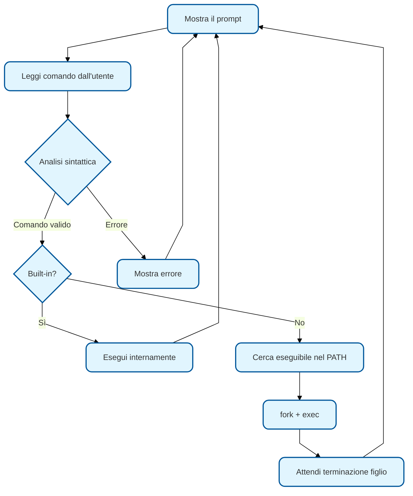
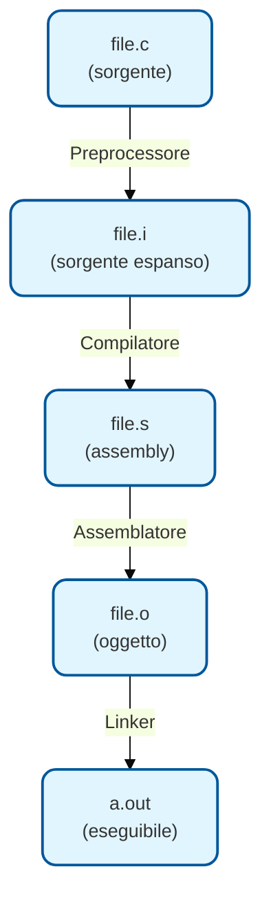
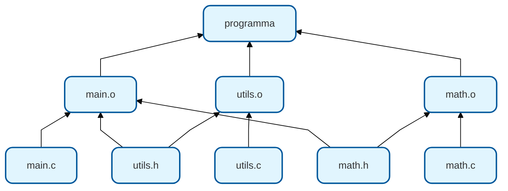

# SO — Lezione 4: La Shell Unix, Compilazione e Ambiente di Sviluppo

**Docente:** Prof. Alberto Finzi | **Corso:** Sistemi Operativi | **CFU:** 9

---

## Argomenti trattati

- La shell Unix: definizione, funzionamento e tipi (sh, bash, zsh, csh, tcsh, fish)
- Modalità interattiva e scripting
- Comandi built-in vs comandi esterni
- Variabili di shell e variabili d'ambiente (`PATH`, `HOME`, `PS1`)
- Comandi fondamentali per il file system (`ls`, `cd`, `pwd`, `mkdir`, `cp`, `mv`, `rm`, `cat`, `chmod`)
- Redirezione I/O e pipe (`>`, `>>`, `<`, `|`)
- Il processo di compilazione: preprocessore, compilatore, assemblatore, linker
- GCC: flag principali e fasi di compilazione
- File oggetto e formato ELF
- Linking statico e dinamico
- Librerie statiche (`.a`) e dinamiche (`.so`)
- Introduzione a Make e Makefile

---

## La Shell

### Cos'è la shell

> [!abstract] Definizione: Shell
> La shell è un programma che interpreta un linguaggio a linea di comando attraverso cui l'utente può interagire con il sistema operativo. Gestisce variabili, ha costrutti di controllo (condizioni, cicli) e permette di creare veri e propri programmi interpretati (script).

La shell viene eseguita generalmente in **modalità interattiva**: si lancia un terminale, nel terminale è attiva la shell, e l'utente inserisce comandi al prompt. La shell può anche eseguire **script**, ovvero file contenenti sequenze di comandi.

### Funzionamento interno

Il ciclo principale della shell (main command loop) esegue queste operazioni:



La shell distingue tra:

| Tipo | Descrizione | Esempi |
|---|---|---|
| **Comandi built-in** | Eseguiti direttamente dalla shell, senza creare un nuovo processo | `cd`, `echo`, `export`, `alias`, `exit` |
| **Comandi esterni** | Programmi eseguibili cercati nelle directory del `PATH` | `ls`, `grep`, `gcc`, `man` |

> [!warning] Perché `cd` è built-in
> Il comando `cd` deve essere un built-in perché modifica la directory corrente del **processo shell stesso**. Se fosse un programma esterno, la `fork` creerebbe un processo figlio che cambierebbe la propria directory e poi terminerebbe, senza alcun effetto sulla shell padre.

### Tipi di shell

Le principali shell Unix sono:

| Shell | Caratteristiche |
|---|---|
| **sh** (Bourne Shell) | La shell originale, base per lo scripting POSIX |
| **bash** (Bourne Again Shell) | Estensione di sh, la più diffusa su Linux |
| **zsh** | Simile a bash con autocompletamento avanzato, default su macOS |
| **csh / tcsh** | Sintassi simile al C |
| **fish** | Shell moderna con autocompletamento e syntax highlighting |

Bash è la shell di riferimento per il corso.

### Variabili di shell e d'ambiente

Le variabili di shell si definiscono senza spazi attorno a `=`:

```bash
# Variabile locale alla shell
NOME="valore"

# Variabile d'ambiente (ereditata dai processi figli)
export NOME="valore"

# Accesso al valore
echo $NOME
```

Le variabili d'ambiente più importanti sono:

| Variabile | Significato |
|---|---|
| `PATH` | Lista di directory dove la shell cerca gli eseguibili, separate da `:` |
| `HOME` | Directory home dell'utente |
| `PS1` | Stringa del prompt |
| `SHELL` | Shell corrente |
| `USER` | Nome dell'utente |

> [!example] Aggiunta di una directory al PATH
> Per aggiungere `/opt/myprograms/bin` al PATH:
> ```bash
> export PATH=$PATH:/opt/myprograms/bin
> ```
> Questa modifica vale solo per la sessione corrente. Per renderla permanente va aggiunta a `~/.bashrc` o `~/.bash_profile`.

### Redirezione I/O e pipe

Ogni processo ha tre flussi standard:

| File descriptor | Nome | Default |
|---|---|---|
| 0 | **stdin** | Tastiera |
| 1 | **stdout** | Terminale |
| 2 | **stderr** | Terminale |

La shell permette di redirigere questi flussi:

```bash
# Redirezione stdout su file (sovrascrive)
ls -la > output.txt

# Redirezione stdout su file (appende)
echo "nuova riga" >> output.txt

# Redirezione stdin da file
wc -l < input.txt

# Redirezione stderr
gcc main.c 2> errori.txt

# Redirezione stdout e stderr
gcc main.c > output.txt 2>&1

# Pipe: stdout di un comando → stdin del successivo
ls -la | grep ".c" | wc -l
```

> [!abstract] Definizione: Pipe
> La pipe (`|`) è un meccanismo che connette lo stdout di un processo allo stdin del successivo, creando una catena di elaborazione. La shell crea una pipe per ogni `|` nel comando e collega i processi tramite `fork`, `exec` e `dup2`.

---

## Comandi fondamentali per il file system

| Comando | Funzione | Esempio |
|---|---|---|
| `pwd` | Mostra la directory corrente | `pwd` |
| `ls` | Elenca i file | `ls -la` (dettagli + nascosti) |
| `cd` | Cambia directory | `cd /home/user` |
| `mkdir` | Crea una directory | `mkdir -p dir1/dir2` |
| `rmdir` | Rimuove directory vuota | `rmdir dir` |
| `cp` | Copia file | `cp -r src/ dest/` |
| `mv` | Sposta/rinomina | `mv old.c new.c` |
| `rm` | Rimuove file | `rm -r dir/` |
| `cat` | Mostra contenuto di un file | `cat file.c` |
| `chmod` | Modifica permessi | `chmod 755 script.sh` |
| `man` | Manuale di un comando | `man ls` |

> [!warning] Permessi dei file
> `chmod` usa la notazione ottale: ogni cifra rappresenta i permessi per proprietario, gruppo e altri (read=4, write=2, execute=1). Ad esempio `chmod 755 file` dà rwx al proprietario e rx a gruppo e altri.

---

## Il processo di compilazione

### Dal codice sorgente all'eseguibile

La compilazione di un programma C non è un singolo passo, ma una **pipeline di quattro fasi**:



### Fase 1: Preprocessore

Il preprocessore gestisce le direttive che iniziano con `#`:

```c
#include <stdio.h>    // Inclusione di header
#define MAX 100        // Definizione di macro
#ifdef DEBUG           // Compilazione condizionale
    printf("debug\n");
#endif
```

Il preprocessore **sostituisce testualmente**: espande le macro, include i file header (copiandone il contenuto nel sorgente), e rimuove i commenti. Il risultato è un file `.i`.

```bash
# Solo preprocessore
gcc -E main.c -o main.i
```

### Fase 2: Compilatore

Il compilatore traduce il codice C preprocessato in **codice assembly** per l'architettura target. Questa fase include l'analisi lessicale, sintattica, semantica e l'ottimizzazione.

```bash
# Fino al codice assembly
gcc -S main.c -o main.s
```

> [!example] Ispezione dell'assembly
> ```bash
> gcc -S -O0 main.c    # Assembly senza ottimizzazioni
> gcc -S -O2 main.c    # Assembly con ottimizzazioni di livello 2
> cat main.s            # Visualizza il codice assembly
> ```
> Confrontare le due versioni permette di capire cosa fa l'ottimizzatore.

### Fase 3: Assemblatore

L'assemblatore traduce il codice assembly in **codice macchina**, producendo un file oggetto (`.o`). Il file oggetto contiene codice macchina ma non è ancora eseguibile: i riferimenti a funzioni esterne non sono ancora risolti.

```bash
# Fino al file oggetto
gcc -c main.c -o main.o
```

### Fase 4: Linker

Il linker risolve tutti i **riferimenti esterni**: collega i file oggetto tra loro e con le librerie necessarie, producendo l'eseguibile finale.

```bash
# Compilazione completa (tutte le fasi)
gcc main.c -o programma

# Linking esplicito di più file oggetto
gcc main.o utils.o -o programma
```

> [!warning] Errori di linking vs errori di compilazione
> Un errore di compilazione (es. errore di sintassi) si manifesta nella fase 2. Un errore di linking (es. funzione dichiarata ma mai definita, `undefined reference to`) si manifesta nella fase 4. Sono errori di natura completamente diversa.

---

## GCC: flag principali

| Flag | Fase | Effetto |
|---|---|---|
| `-E` | Preprocessore | Si ferma dopo il preprocessing |
| `-S` | Compilazione | Si ferma dopo la generazione dell'assembly |
| `-c` | Assemblaggio | Si ferma dopo la generazione del file oggetto |
| `-o nome` | Output | Specifica il nome del file di output |
| `-Wall` | Warning | Attiva tutti i warning comuni |
| `-Wextra` | Warning | Warning aggiuntivi |
| `-Werror` | Warning | Tratta i warning come errori |
| `-g` | Debug | Aggiunge informazioni di debug (per `gdb`) |
| `-O0` | Ottimizzazione | Nessuna ottimizzazione (default) |
| `-O1`, `-O2`, `-O3` | Ottimizzazione | Livelli crescenti di ottimizzazione |
| `-I dir` | Include | Aggiunge `dir` al percorso di ricerca degli header |
| `-L dir` | Linking | Aggiunge `dir` al percorso di ricerca delle librerie |
| `-l nome` | Linking | Collega la libreria `libnome` |

> [!tip] Compilazione con warning
> Per il corso si consiglia di compilare **sempre** con:
> ```bash
> gcc -Wall -Wextra -g main.c -o programma
> ```
> `-Wall -Wextra` catturano la maggior parte dei problemi, `-g` permette poi il debug con `gdb`.

---

## File oggetto e formato ELF

> [!abstract] Definizione: ELF (Executable and Linkable Format)
> ELF è il formato standard per i file eseguibili, i file oggetto e le librerie condivise su Linux. Ha sostituito il vecchio formato `a.out`. Un file ELF contiene un header che descrive la struttura del file, le sezioni con il codice e i dati, e le informazioni necessarie al loader per caricare il programma in memoria.

Un file ELF contiene diverse sezioni:

| Sezione | Contenuto |
|---|---|
| `.text` | Codice macchina (istruzioni) |
| `.data` | Variabili globali e statiche inizializzate |
| `.bss` | Variabili globali e statiche non inizializzate |
| `.rodata` | Dati in sola lettura (costanti, stringhe) |
| `.symtab` | Tabella dei simboli |
| `.strtab` | Tabella delle stringhe |

> [!example] Ispezione di un file ELF
> ```bash
> file programma             # Tipo di file
> readelf -h programma       # Header ELF
> readelf -S programma       # Sezioni
> nm programma               # Tabella dei simboli
> objdump -d programma       # Disassembly
> ```

---

## Linking statico e dinamico

### Linking statico

Nel linking statico, il codice delle librerie viene **copiato integralmente** nell'eseguibile al momento della compilazione.

```bash
gcc -static main.c -o programma_statico
```

### Linking dinamico

Nel linking dinamico, l'eseguibile contiene solo **riferimenti** alle librerie condivise (`.so`). Le librerie vengono caricate in memoria a tempo di esecuzione dal **dynamic linker** (`ld-linux.so`).

```bash
gcc main.c -o programma    # Linking dinamico (default)
ldd programma               # Mostra le librerie dinamiche usate
```

| Caratteristica | Statico | Dinamico |
|---|---|---|
| **Dimensione eseguibile** | Grande | Piccola |
| **Dipendenze a runtime** | Nessuna | Richiede le `.so` installate |
| **Aggiornamento librerie** | Richiede ricompilazione | Automatico |
| **Condivisione in RAM** | No (ogni processo ha la sua copia) | Sì (una sola copia in RAM condivisa) |
| **Portabilità** | Alta (file autocontenuto) | Dipende dall'ambiente |

> [!warning] Linking dinamico e compatibilità
> Se un programma è linkato dinamicamente e la libreria `.so` viene aggiornata a una versione incompatibile, il programma potrebbe non funzionare. Questo è il classico problema del "dependency hell".

### Librerie statiche (`.a`)

Le librerie statiche sono archivi di file oggetto:

```bash
# Compilare i file oggetto
gcc -c math_utils.c -o math_utils.o
gcc -c string_utils.c -o string_utils.o

# Creare la libreria statica
ar rcs libmylib.a math_utils.o string_utils.o

# Usarla
gcc main.c -L. -lmylib -o programma
```

### Librerie dinamiche (`.so`)

```bash
# Compilare con Position Independent Code
gcc -fPIC -c math_utils.c -o math_utils.o

# Creare la libreria dinamica
gcc -shared -o libmylib.so math_utils.o

# Usarla
gcc main.c -L. -lmylib -o programma
export LD_LIBRARY_PATH=$LD_LIBRARY_PATH:.
```

---

## Compilazione separata

Quando un progetto ha più file sorgente, si compila e linka separatamente:

```bash
# Compilare ogni file separatamente
gcc -c main.c -o main.o
gcc -c utils.c -o utils.o
gcc -c math.c -o math.o

# Linkare tutto insieme
gcc main.o utils.o math.o -o programma
```

> [!tip] Vantaggio della compilazione separata
> Se si modifica solo `utils.c`, basta ricompilare quel file e poi rifare il linking. Non serve ricompilare `main.c` e `math.c`. Questo risparmia tempo nei progetti grandi.

---

## Make e Makefile

> [!abstract] Definizione: Make
> `make` è uno strumento di automazione della compilazione che legge un file chiamato `Makefile` contenente le **regole** per costruire il progetto. Ogni regola specifica un target, le sue dipendenze e i comandi per costruirlo. Make ricompila solo ciò che è cambiato, basandosi sui timestamp dei file.

### Struttura di una regola

```makefile
target: dipendenze
	comando
```

> [!warning] Indentazione nel Makefile
> I comandi nelle regole **devono** essere indentati con un **tab** (non spazi). Questo è una delle fonti di errore più comuni.

### Esempio di Makefile

```makefile
CC = gcc
CFLAGS = -Wall -Wextra -g

programma: main.o utils.o math.o
	$(CC) $(CFLAGS) main.o utils.o math.o -o programma

main.o: main.c utils.h math.h
	$(CC) $(CFLAGS) -c main.c

utils.o: utils.c utils.h
	$(CC) $(CFLAGS) -c utils.c

math.o: math.c math.h
	$(CC) $(CFLAGS) -c math.c

clean:
	rm -f *.o programma
```

> [!example] Utilizzo di make
> ```bash
> make              # Compila il primo target (programma)
> make clean        # Esegue la regola clean
> make utils.o      # Compila solo utils.o
> ```
> Se si modifica solo `utils.c`, `make` ricompila `utils.o` e poi rilinka `programma`, senza toccare `main.o` e `math.o`.

Make costruisce internamente un **grafo delle dipendenze**: partendo dal target richiesto, risale le dipendenze ricorsivamente e ricompila solo i file il cui timestamp è più vecchio delle proprie dipendenze.



---

## Esempio completo: primo programma C

```c
/* hello.c */
#include <stdio.h>

int main(void) {
    printf("Hello, World!\n");
    return 0;
}
```

```bash
# Compilare ed eseguire
gcc -Wall -g hello.c -o hello
./hello
```

> [!warning] Esecuzione di programmi nella directory corrente
> Su Linux, la directory corrente **non** è nel `PATH` di default. Per eseguire un programma nella directory corrente bisogna usare `./nomeprogramma`. Questo è una scelta di sicurezza: evita che un programma malevolo nella directory corrente venga eseguito al posto di un comando di sistema.

---

> [!abstract] Punti chiave della lezione
> - La **shell** è l'interfaccia testuale con il sistema operativo; bash è la shell standard su Linux
> - La compilazione è una **pipeline a 4 fasi**: preprocessore → compilatore → assemblatore → linker
> - **GCC** permette di fermarsi a ciascuna fase con i flag `-E`, `-S`, `-c`
> - Il formato **ELF** è lo standard per eseguibili e librerie su Linux
> - Il linking può essere **statico** (copia il codice) o **dinamico** (riferimenti risolti a runtime)
> - **Make** automatizza la compilazione, ricompilando solo ciò che è cambiato grazie al grafo delle dipendenze

## Prossimi argomenti

- [ ] Thread e programmazione concorrente
- [ ] Problemi di sincronizzazione (race condition)
- [ ] Meccanismi di sincronizzazione (mutex, semafori)

#SO1 #shell #compilazione #GCC #ELF #linking #Makefile
