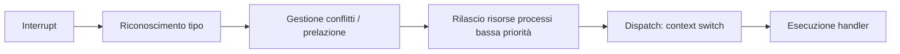

# SO — Lezione 8: Scheduling Real-Time, Linux CFS e EEVDF

**Corso:** Sistemi Operativi

---

## Argomenti trattati

- Processi real-time: soft e hard real-time
- Latenza di evento e dispatch latency
- Task periodici: periodo, burst time, deadline
- Rate Monotonic Scheduling (RMS): criterio e limite di utilizzo
- Earliest Deadline First (EDF): ottimalità e criterio di ammissibilità
- Scheduling Linux: evoluzione storica
- Completely Fair Scheduling (CFS): virtual runtime e fairness
- EEVDF (Earliest Eligible Virtual Deadline First): virtual deadline e eligibilità
- Scheduling multicore: affinity, load balancing, NUMA

---

## 1. Processi real-time

> [!abstract] Definizione: Soft real-time
> Un processo **soft real-time** è schedulato con la massima urgenza possibile, ma senza garanzia assoluta di rispettare una scadenza precisa. Il sistema operativo cerca di servire questi processi prima possibile.

> [!abstract] Definizione: Hard real-time
> Un processo **hard real-time** deve essere eseguito entro una scadenza (**deadline**) garantita. I sistemi operativi generici (Linux, Windows) supportano solo il soft real-time. Per l'hard real-time servono RTOS specifici (es. Linux con patch real-time, VxWorks, ecc.).

**Applicazioni hard real-time**: sistemi robotici, controllo industriale, acquisizione dati da sensori. In questi contesti, un dato che arriva va processato entro una finestra temporale precisa, altrimenti si perde.

> [!warning] RTOS non significa "più veloce"
> Un sistema operativo real-time può sembrare più lento per i processi utente interattivi, perché garantisce le scadenze sacrificando la reattività degli altri processi. La garanzia temporale ha un costo.

---

## 2. Latenza di evento e dispatch latency

Tra l'arrivo di un evento (es. interrupt hardware) e l'effettiva risposta del processo, ci sono diverse latenze:



Questa **dispatch latency** non è eliminabile, ma va minimizzata nei sistemi real-time.

---

## 3. Task periodici

I task real-time sono spesso **periodici**: si ripetono ogni $T$ millisecondi, con un burst time $t$ e una deadline $d \leq T$.

| Parametro | Simbolo | Significato |
|---|---|---|
| Periodo | $T$ | Quanto spesso si attiva il task |
| Burst time | $t$ | Tempo di CPU necessario per esecuzione |
| Deadline | $d$ | Entro quando deve finire ($d \leq T$) |
| Frequenza | $f = 1/T$ | Quante volte si attiva per unità di tempo |
| Utilizzo CPU | $u = t/T$ | Frazione di CPU occupata |

**Criterio di ammissibilità** (condizione necessaria): $\sum_i u_i \leq 1$ (la somma degli utilizzi non supera il 100% di CPU).

---

## 4. Rate Monotonic Scheduling (RMS)

**Principio**: tra i processi periodici pronti, ha la precedenza quello con il **periodo minore** (frequenza maggiore). Le priorità sono statiche e calcolate a priori.

> [!example] Esempio RMS: P1 (T=50, t=20), P2 (T=100, t=35)
> Utilizzi: P1 occupa 40%, P2 occupa 35% → totale 75% < 83% (limite per 2 processi).
>
> - T=0: P1 parte (ha periodo minore).
> - T=20: P1 finisce. Parte P2.
> - T=50: P1 si riattiva. Poiché ha priorità maggiore (periodo minore), prelaziona P2.
> - P1 finisce a T=70. P2 riprende (aveva fatto 30 ms su 35).
> - T=75: P2 finisce. Nessuno fino a T=100.
>
> Entrambe le deadline rispettate.

### Limite di utilizzo di RMS

Con $n$ processi periodici, RMS garantisce il rispetto di tutte le deadline se:

$$\sum_{i=1}^{n} \frac{t_i}{T_i} \leq n\left(2^{1/n} - 1\right)$$

| $n$ | Limite |
|---|---|
| 1 | 100% |
| 2 | 83% |
| $\infty$ | $\ln 2 \approx 69\%$ |

> [!warning] RMS non sfrutta il 100% della CPU
> Con $n \to \infty$, RMS garantisce le deadline solo se l'utilizzo totale è sotto il 69%. Questo significa che anche se la CPU non è satura, RMS può bucare alcune deadline. Il problema è che RMS usa solo la frequenza, non le deadline effettive.

---

## 5. Earliest Deadline First (EDF)

**Principio**: ha la precedenza il processo con la **deadline più ravvicinata**. Le priorità sono **dinamiche**: cambiano man mano che i processi si avvicinano alle loro scadenze.

> [!abstract] Teorema: ottimalità di EDF
> Se esiste uno scheduling che rispetta tutte le deadline di un insieme di task, EDF lo trova. EDF è ottimale per l'utilizzo della CPU: con task periodici con deadline = periodo, EDF garantisce le deadline finché l'utilizzo totale è ≤ 100% (al netto dell'overhead).

> [!example] Confronto RMS vs. EDF
> P1 (T=50, t=25), P2 (T=80, t=35). Utilizzi: 50% + 43.75% = 93.75% < 100%.
>
> Con **RMS**: P1 ha priorità statica su P2. Analisi mostra che P2 buca la deadline.
>
> Con **EDF**: si confrontano le deadline correnti. Quando P1 si riattiva a T=50, la sua deadline è T=100, mentre P2 ha deadline T=80. P2 continua finché non finisce. Entrambe le deadline rispettate.

> [!example] Esercizio EDF con tempi di arrivo
> J1 (arr.0, burst 3, deadline 16), J2 (arr.2, burst 1, deadline 7), J3 (arr.0, burst 6, deadline 8), J4 (arr.8, burst 2, deadline 11), J5 (arr.13, burst 5, deadline 18).
>
> - T=0: J1 e J3 pronti. Deadline J1=16, J3=8 → parte J3.
> - T=2: arriva J2 (deadline 7 < J3 deadline 8) → prelazione, parte J2.
> - T=3: J2 finisce. Confronto J1 (deadline 16) e J3 (deadline 8) → riprende J3.
> - T=7: J3 finisce. Rimane J1 → parte J1.
> - T=8: arriva J4 (deadline 11 < J1 deadline 16) → prelazione, parte J4.
> - T=10: J4 finisce. Riprende J1.
> - T=12: J1 finisce. Nessuno fino a T=13.
> - T=13: arriva J5 → parte J5, finisce a T=18.
>
> Ordine di fine: **J2, J3, J4, J1, J5**.

### EDF con deadline ≠ periodo

Se la deadline è più stretta del periodo, il criterio di ammissibilità basato solo sull'utilizzo della CPU non è sufficiente: anche con utilizzo < 100%, alcune deadline potrebbero essere bucate. In questo caso serve un'analisi più sofisticata.

---

## 6. Evoluzione dello scheduling in Linux

### Pre-2.6: O(n) scheduler

Unica coda di processi; lo scheduler scandiva l'intera lista ad ogni decisione → costo $O(n)$. Non scalava con il numero di processi e non gestiva bene il multiprocessing.

### Linux 2.6: O(1) scheduler

Due array (attivi ed expired): i processi attivi vengono eseguiti finché consumano il loro time slice, poi passati agli expired. Quando tutti gli attivi finiscono, i due array si scambiano di ruolo → decisione in $O(1)$.

Problema: penalizzava i processi interattivi (dovevano aspettare che si svuotasse l'intera lista degli attivi).

---

## 7. Completely Fair Scheduling (CFS)

CFS (Linux 2.6.23+) introduce il concetto di **fairness**: ogni processo dovrebbe ricevere $1/n$ del tempo di CPU su un intervallo target.

### Virtual runtime

Ad ogni processo è associato un **virtual runtime** ($v_r$) che misura quanto tempo virtuale ha trascorso in CPU. Per i processi ad **alta priorità** il virtual runtime scorre più **lentamente** (vengono favoriti); per i processi a bassa priorità scorre più velocemente.

```
alta priorità  → orologio lento → vr cresce poco → viene scelto spesso
bassa priorità → orologio veloce → vr cresce tanto → viene scelto meno
```

Lo scheduler **sceglie sempre il processo con il minore virtual runtime** (cioè quello che ha "avuto meno soddisfazione").

### Struttura dati: albero rosso-nero

I processi sono organizzati in un **albero rosso-nero** (albero di ricerca binario auto-bilanciato) ordinato per virtual runtime. Il processo con il minore virtual runtime è sempre sulla foglia più a sinistra → accesso in $O(1)$ al prossimo da schedulare.

### Time slice

Il time slice assegnato a ogni processo è proporzionale al peso del processo (derivato dalla sua priorità "nice") e alla **latency target** (periodo target entro cui ogni processo deve essere eseguito almeno una volta):

$$\text{time slice}_i = \frac{w_i}{\sum_j w_j} \times \text{latency target}$$

Con un **minimum granularity** (valore minimo del time slice) per evitare overhead eccessivo di context switch.

---

## 8. EEVDF (Earliest Eligible Virtual Deadline First)

Algoritmo introdotto in Linux 6.6 (novembre 2023). Risolve la tendenza di CFS a essere troppo "democratico" e poco reattivo.

### Dual criterion: eligibilità + virtual deadline

Ogni processo ha:
- **Virtual runtime** (come in CFS): misura il passato.
- **Virtual deadline**: misura il futuro (quando si aspetta che il processo abbia ricevuto abbastanza CPU).
- **Lag**: differenza tra quanto CPU ha avuto e quanto avrebbe dovuto avere (fairness).

**Eligibilità**: un processo è *eligibile* se il suo lag non è troppo negativo (non ha consumato molto più di quanto spettava). Un processo con lag molto negativo viene messo "in quarantena" (non eligibile) finché non "scontano" il debito.

**Selezione**: tra i processi eligibili, si sceglie quello con la **virtual deadline più ravvicinata** (EDF applicato alle deadline virtuali).

> [!quote]
> "Se quello di prima era orientato alla fairness pesata su priorità, questo nuovo è orientato alla reattività pesata, considerando priorità e deadline."

### Confronto CFS vs. EEVDF

| | CFS | EEVDF |
|---|---|---|
| Criterio selezione | Minimo virtual runtime (passato) | Minima virtual deadline (futuro) tra eligibili |
| Priorità | Velocità dell'orologio virtuale | Velocità dell'orologio virtuale + eligibilità |
| Reattività | Moderate (democratico) | Maggiore (deadline-oriented) |
| Fairness | Garantita dal virtual runtime | Garantita dall'eligibilità (lag) |

---

## 9. Scheduling multicore

Con più core, lo scheduler deve gestire sia la scelta del processo sia l'assegnazione al core.

### Simmetric Multiprocessing (SMP)

Ogni core ha la propria coda di processi (code private). Lo scheduler di ogni core sceglie dalla propria coda.

**Load balancing**: se le code sono sbilanciate, si migrano task tra core con due strategie:
- **Push**: un processo controlla il carico altrui e spinge task ai core scarichi.
- **Pull**: un core idle va a prendere task dalla coda dei core occupati. Linux implementa entrambe.

**Affinità del processore**:
- **Soft affinity**: preferenza a mantenere un thread sullo stesso core, ma migrazione consentita.
- **Hard affinity**: il thread è vincolato a un sottoinsieme di core.

### NUMA (Non-Uniform Memory Access)

In alcuni sistemi, ogni gruppo di core ha RAM "più vicina" con accesso più veloce. Migrare un thread tra zone NUMA ha un costo elevato (invalidazione cache + trasferimento dati). Lo scheduling NUMA cerca di mantenere i thread vicini alla loro memoria.

### Hyper-threading (hardware thread)

Alcuni core gestiscono più hardware thread contemporaneamente, sfruttando i cicli di stallo (attesa memoria). Il sistema operativo vede questi come "core logici" aggiuntivi. Su un core con 16 core fisici e 24 hardware thread, lo scheduler vede 24 slot.

### Sistemi eterogenei (big.LITTLE / HMP)

Core ad alte prestazioni (big) e core a basso consumo (LITTLE) sullo stesso chip. Lo scheduler è **energy-aware**: deve bilanciare prestazioni e consumo. Nei dispositivi mobile questo è fondamentale per la durata della batteria.

---

> [!summary] Punti chiave della lezione
> - RMS: priorità statica basata sulla frequenza; garantisce le deadline finché l'utilizzo totale ≤ $n(2^{1/n}-1)$ (69% per $n \to \infty$).
> - EDF: priorità dinamica basata sulla deadline più ravvicinata; ottimale — se esiste uno scheduling fattibile, EDF lo trova.
> - Linux CFS: virtual runtime con "orologio truccato" in base alla priorità; albero rosso-nero per selezione O(1).
> - EEVDF (Linux 6.6): combina virtual deadline (futuro) con eligibilità (fairness dal passato); più reattivo di CFS.
> - Su multicore: code private per core, load balancing con push/pull, affinità del processore.

## Prossimi argomenti

- [ ] Sincronizzazione: mutex, semafori, monitor, variabili di condizione
- [ ] Deadlock: condizioni necessarie, grafo di allocazione, algoritmi di prevenzione

#SO #real-time #rate-monotonic #EDF #CFS #EEVDF #Linux-scheduling #multicore
