# **🔥 INDICE RAPIDO**
---
1. **[Concetti Base](📚%20GUIDA%20COMPLETA%20PER%20LO%20SCRITTO%20DI%20SISTEMI%20OPERATIVI.md#-1-concetti-base)**
   - Modalità duale, bit di modalità, interruzioni, gerarchie di memoria, chiamate di sistema, strutture SO.
2. **[Processi](📚%20GUIDA%20COMPLETA%20PER%20LO%20SCRITTO%20DI%20SISTEMI%20OPERATIVI.md#-2-processi)**
   - PCB, stati, `fork`, `wait`, `exit`, zombie, IPC (pipe, shared memory).
3. **[Thread](📚%20GUIDA%20COMPLETA%20PER%20LO%20SCRITTO%20DI%20SISTEMI%20OPERATIVI.md#-3-thread)**
   - Differenze con processi, modelli (many-to-one, one-to-one), sincronizzazione, cancellazione.
4. **[Sincronizzazione](📚%20GUIDA%20COMPLETA%20PER%20LO%20SCRITTO%20DI%20SISTEMI%20OPERATIVI.md#-4-sincronizzazione)**
   - Sezione critica, Peterson, TestAndSet, mutex, semafori, monitor, deadlock (Coffman), problemi classici.
5. **[Schedulazione CPU](📚%20GUIDA%20COMPLETA%20PER%20LO%20SCRITTO%20DI%20SISTEMI%20OPERATIVI.md#-5-schedulazione-cpu)**
   - FCFS, SJF, SRTF, Round Robin, Priority, Real-Time (RM, EDF), metriche (attesa, turnaround).
6. **[Gestione della Memoria](📚%20GUIDA%20COMPLETA%20PER%20LO%20SCRITTO%20DI%20SISTEMI%20OPERATIVI.md#-6-gestione-della-memoria)**
   - Allocazione contigua (First/Best Fit), paginazione, segmentazione, memoria virtuale, TLB, page fault.
7. **[File System](📚%20GUIDA%20COMPLETA%20PER%20LO%20SCRITTO%20DI%20SISTEMI%20OPERATIVI.md#-7-file-system)**
   - Inode, operazioni sui file, permessi.
8. **[Esercizi Tipici](📚%20GUIDA%20COMPLETA%20PER%20LO%20SCRITTO%20DI%20SISTEMI%20OPERATIVI.md#-8-esercizi-tipici)**
   - Esempi risolti di schedulazione, memoria, sincronizzazione, deadlock.

---
# **📌 1. CONCETTI BASE**
*(Domande aperte o a risposta multipla molto probabili)*

---

### **🔹 Modalità Operativa Duale**
- **User Mode vs. Kernel Mode**:
  - **User Mode**: Esecuzione di programmi applicativi (**istruzioni non privilegiate**).
  - **Kernel Mode**: Esecuzione del SO (**istruzioni privilegiate** come accesso hardware, gestione memoria).
- **Bit di Modalità**:
  - **1 bit** nel registro di stato della CPU che indica la modalità corrente.
  - **A cosa serve**:
    - **Protezione**: Impedisce ai programmi utente di eseguire operazioni pericolose (es. `HALT`, accesso diretto all’hardware).
    - **Controllo**: Il SO mantiene sempre il controllo tramite **interruzioni** e **chiamate di sistema**.
- **Transizione tra modalità**:
  - **Da User → Kernel**: Tramite **interrupt** (hardware/software) o **system call** (es. `read()`, `fork()`).
  - **Da Kernel → User**: Tramite **`iret`** (return from interrupt).

**📌 Domande tipiche**:
- *Spiegare la funzionalità della modalità operativa duale.*
- *Cos’è il bit di modalità e a cosa serve?*
- *Come viene servita una chiamata di sistema?*

---

### **🔹 Gestione delle Interruzioni**
- **Interrupt**:
  - **Hardware**: Segnale da periferica (es. tastiera, timer).
  - **Software**: Trap (es. system call) o eccezione (es. divisione per zero).
- **Fasi di gestione**:
  1. **Salvataggio dello stato** (registri, PC) nel **PCB** o stack.
  2. **Esecuzione della Routine di Servizio (ISR)** in Kernel Mode.
  3. **Context Switch** (se necessario).
  4. **Ripristino dello stato** e ritorno in User Mode.
- **Differenza tra Interrupt e Polling**:

| **Interrupt** | **Polling** |
|---|---|
| La CPU è **interrotta** dal dispositivo. | La CPU **interroga** periodicamente il dispositivo. |
| Efficiente (CPU libera per altri task). | Inefficiente (CPU occupata a controllare). |
| Usato nei SO moderni. | Usato in sistemi embedded semplici.

**📌 Domande tipiche**:
- *Spiegare la differenza tra interrupt e polling.*
- *Descrivere le fasi della gestione di un’interruzione.*

---

### **🔹 Strutture dei Sistemi Operativi**
| **Modello**       | **Descrizione**                                                                 | **Vantaggi**                          | **Svantaggi**                          |
|-------------------|---------------------------------------------------------------------------------|---------------------------------------|----------------------------------------|
| **Monolitico**    | Tutto il SO in un unico modulo (es. Linux, Unix).                              | Prestazioni elevate.                 | Difficile da mantenere, poco modulare. |
| **Stratificato**  | Gerarchia di livelli (es. THE OS).                                              | Modularità, astrazione.               | Overhead per comunicazione tra livelli. |
| **Microkernel**   | Solo funzioni essenziali nel kernel (es. QNX, MINIX).                         | Flessibilità, isolamento servizi.    | Comunicazione IPC costosa.            |
| **Modulare**      | Moduli caricabili dinamicamente (es. Linux con moduli kernel).                | Estendibilità.                        | Complesso da progettare.               |
| **Ibrido**        | Combina microkernel e monolitico (es. Windows NT, macOS).                     | Bilanciato.                           | Complesso.                             |

**📌 Domande tipiche**:
- *Quali sono i vantaggi e gli svantaggi di un approccio monolitico e stratificato?*
- *Qual è il principale vantaggio dell’approccio microkernel?*

---

# **📌 2. PROCESSI**
*(Esercizi pratici e domande aperte **molto probabili**)*

---

### **🔹 Definizione e Ciclo di Vita**
- **Processo**: **Programma in esecuzione** + **contesto** (PC, registri, stato, ecc.).
- **PCB (Process Control Block)**:
  - Struttura dati che contiene:
    - **PID** (Process ID).
    - **Stato** (Running, Ready, Waiting, Terminated, Zombie).
    - **Registri** (PC, SP, ecc.).
    - **Memoria** (puntatori a tabelle di pagine, segmenti).
    - **Risorse** (file aperti, dispositivi I/O).
    - **Priorità**, tempo di CPU usato, ecc.
- **Stati di un processo**:
  ```mermaid
  graph LR
      A[New] -->|Admission| B[Ready]
      B -->|Dispatch| C[Running]
      C -->|I/O Request| D[Waiting]
      C -->|Exit| E[Terminated]
      D -->|I/O Completion| B
      C -->|Time Slice Expired| B
  ```
  - **Zombie**: Processo terminato ma il padre non ha ancora chiamato `wait()` (mantiene solo il PCB per lo *exit status*).
  - **Orfano**: Processo il cui padre è terminato → adottato da `init` (PID 1).

**📌 Domande tipiche**:
- *Descrivere il ciclo di vita di un processo.*
- *Cos’è un processo zombie? Come viene eliminato?*

---

### **🔹 Chiamate di Sistema per i Processi**
| **System Call** | **Descrizione**                                                                 | **Esempio**                                                                 |
|-----------------|---------------------------------------------------------------------------------|-----------------------------------------------------------------------------|
| `fork()`        | Crea un **nuovo processo figlio** (copia del padre). Ritorna `0` al figlio, `PID figlio` al padre. | `pid_t pid = fork();`                                                      |
| `exec()`        | **Sostituisce** il programma del processo corrente con un nuovo programma. | `execlp("ls", "ls", "-l", NULL);`                                           |
| `wait()`        | **Attende** la terminazione di un processo figlio e raccoglie lo *exit status*. | `wait(NULL);` (bloccante) o `waitpid(pid, &status, 0);`                     |
| `exit()`        | **Termina** il processo corrente.                                              | `exit(0);` (successo) o `exit(1);` (errore)                              |
| `kill()`        | Invia un **segnale** a un processo (es. `SIGTERM`, `SIGKILL`).                 | `kill(pid, SIGTERM);`                                                      |

**📌 Comportamento di `fork()`**:
- Il **figlio** è una **copia esatta** del padre (spazio di indirizzamento **identico ma separato**).
- **PID diverso** tra padre e figlio.
- **Variabili**: Modifiche nel figlio **non** influenzano il padre (e viceversa).
- **File descriptor**: Condivisi tra padre e figlio (es. se il padre ha un file aperto, anche il figlio può scriverci).
- **Shared Memory**: Se allocata esplicitamente (es. `shmget()`), è **condivisa**.

**📌 Esempio pratico**:
```c
int value = 5;
if (fork() == 0) {  // Figlio
    value = 20;
    exit(0);
}
wait(NULL);         // Padre aspetta il figlio
printf("%d", value); // Output: **5** (il padre ha la sua copia di `value`)
```

**📌 Domande tipiche**:
- *Qual è l’output del seguente codice?*
- *Quanti processi vengono creati da `fork()` in un loop di 3 iterazioni?* → **2^3 = 8** (incluso il principale).
- *Quali segmenti di memoria sono condivisi tra padre e figlio dopo `fork`?*
  ✅ **Shared Memory** (se allocata esplicitamente).
  ❌ Stack, Heap, Text (duplicati).

---

### **🔹 Comunicazione tra Processi (IPC)**
| **Meccanismo**       | **Descrizione**                                                                 | **Esempio**                                                                 |
|----------------------|---------------------------------------------------------------------------------|-----------------------------------------------------------------------------|
| **Pipe (anonima)**   | Canale **unidirezionale** tra processi correlati (padre-figlio).               | `int fd[2]; pipe(fd); fork();`                                            |
| **Pipe nominata**    | Canale **bidirezionale** tra processi non correlati (es. `/dev/fifo`).         | `mkfifo("pipe_nominata");`                                                 |
| **Shared Memory**    | Memoria **condivisa** tra processi (più veloce delle pipe).                   | `shmget()`, `shmat()`, `shmdt()`                                          |
| **Message Queue**    | Coda di messaggi tra processi.                                                 | `msgget()`, `msgsnd()`, `msgrcv()`                                         |
| **Socket**           | Comunicazione tra processi su **macchine diverse** (rete).                    | `socket()`, `bind()`, `connect()`, `send()`, `recv()`                     |

**📌 Domande tipiche**:
- *Quali sono i meccanismi di IPC che avete visto a lezione?*
- *Differenza tra pipe anonima e nominata.*

---

# **📌 3. THREAD**
*(Esercizi misti `fork` + `pthread` probabili)*

---

### **🔹 Definizione e Confronto con Processi**
| **Aspetto**          | **Processo**                          | **Thread**                          |
|----------------------|---------------------------------------|-------------------------------------|
| **Spazio indirizzi** | Separato (protezione).               | **Condiviso** (con altri thread dello stesso processo). |
| **Comunicazione**    | IPC (pipe, shared memory).            | **Variabili globali** (nessun IPC necessario). |
| **Creazione**        | `fork()` (costo alto).                | `pthread_create()` (costo basso).    |
| **Context Switch**   | Lento (cambio spazio indirizzi).      | **Veloce** (solo registri e PC).     |
| **Risorse**          | CPU, memoria, file descriptor.        | **Condivide** risorse del processo. |

**📌 Vantaggi dei Thread**:
- **Risposta**: Più reattivo (es. server web che gestisce più client).
- **Condivisione dati**: Non serve IPC.
- **Economia**: Meno risorse rispetto ai processi.
- **Scalabilità**: Sfrutta meglio i **multi-core**.

---

### **🔹 Tipologie di Thread**
| **Modello**          | **Descrizione**                                                                 | **Esempio**                     |
|----------------------|---------------------------------------------------------------------------------|---------------------------------|
| **User-Level Thread** | Gestiti dalla **libreria utente** (es. pthreads). Il kernel non ne è a conoscenza. | pthreads (POSIX)                |
| **Kernel-Level Thread** | Gestiti dal **kernel** (es. 1:1 in Linux).                                      | Linux (NPTL)                    |
| **Many-to-One**      | Molti thread utente → 1 thread kernel.                                         | Vecchio pthreads su Solaris     |
| **One-to-One**       | 1 thread utente → 1 thread kernel.                                               | Linux, Windows                  |
| **Many-to-Many**     | Molti thread utente → molti thread kernel (con pooling).                        | Solaris, HP-UX                  |
| **Ibrido**           | Combina many-to-one e one-to-one.                                               | Linux (NPTL)                    |

**📌 Problemi con `fork` + Thread**:
- In Linux, **solo il thread che chiama `fork` viene duplicato** nel figlio.
- Gli altri thread **non esistono** nel processo figlio.
- **Rischio di deadlock**: Se un thread blocca un mutex prima di `fork`, il figlio potrebbe non sbloccarlo mai.

---

### **🔹 Sincronizzazione tra Thread**
- **Mutex (Mutual Exclusion)**:
  - Protegge **sezioni critiche** (accesso a variabili condivise).
  - **Funzioni**:
    ```c
    pthread_mutex_t mutex;
    pthread_mutex_init(&mutex, NULL);  // Inizializza
    pthread_mutex_lock(&mutex);        // Blocca
    // Sezione critica
    pthread_mutex_unlock(&mutex);      // Sblocca
    pthread_mutex_destroy(&mutex);     // Distrugge
    ```
- **Variabili di Condizione**:
  - Permette a un thread di **aspettare** che una condizione sia vera.
  - **Funzioni**:
    ```c
    pthread_cond_t cond;
    pthread_mutex_t mutex;
    pthread_cond_init(&cond, NULL);
    
    pthread_mutex_lock(&mutex);
    while (condizione_falsa) {
        pthread_cond_wait(&cond, &mutex);  // Rilascia mutex e aspetta
    }
    pthread_mutex_unlock(&mutex);
    
    // Segnalazione:
    pthread_cond_signal(&cond);   // Sveglia 1 thread
    pthread_cond_broadcast(&cond); // Sveglia tutti i thread
    ```

**📌 Domande tipiche**:
- *Quali componenti dello stato del programma sono condivisi tra thread?* ✅ **Variabili globali, heap, codice (text)**. ❌ **Stack, registri, PC**.
- *Spiegare la differenza tra parallelismo e concorrenza.*
  - **Parallelismo**: Esecuzione **simultanea** su più core (fisico).
  - **Concorrenza**: Esecuzione **interlacciata** su un core (logico).
  - ✅ *È possibile avere concorrenza senza parallelismo* (es. su un core singolo).
  - ❌ *Non è possibile avere parallelismo senza concorrenza*.

---

# **📌 4. SINCRONIZZAZIONE**
*(Esercizi su pseudocodice e deadlock **molto probabili**)*

---

### **🔹 Sezione Critica e Race Condition**
- **Sezione Critica**: Parte di codice che **accede a risorse condivise** (es. variabili globali).
- **Race Condition**: Risultato dipendente **dall’ordine di esecuzione** dei processi/thread.
- **Requisiti per la soluzione della sezione critica** (Coffman):
  1. **Mutua Esclusione**: Solo un processo alla volta nella sezione critica.
  2. **Progresso**: Se nessun processo è in sezione critica, la decisione su chi entra non può essere rimandata all’infinito.
  3. **Attesa Limitata**: Nessun processo aspetta all’infinito.

---

### **🔹 Soluzioni Software e Hardware**
| **Soluzione**         | **Descrizione**                                                                 | **Vantaggi**               | **Svantaggi**                     |
|-----------------------|---------------------------------------------------------------------------------|----------------------------|------------------------------------|
| **Peterson**          | Algoritmo software per 2 processi (usa `flag` e `turn`).                      | Nessun supporto hardware. | Solo per 2 processi.              |
| **TestAndSet (TAS)**  | Istruzione hardware atomica: `bool TestAndSet(bool *lock)`.                   | Semplice, veloce.          | **Spinlock** (CPU occupata).      |
| **CompareAndSwap (CAS)** | Istruzione hardware atomica: `int CAS(int *ptr, int old, int new)`.          | Semplice, veloce.          | **Spinlock**.                     |
| **Mutex**            | Lock gestito dal SO (es. `pthread_mutex`).                                      | Attesa passiva (non occupa CPU). | Overhead per system call. |
| **Semafori**          | Contatore per risorse condivise (es. `sem_t`).                                | Flessibile (può gestire più risorse). | Rischio di deadlock se usato male. |

**📌 Algoritmo di Peterson (per 2 processi)**:
```c
// Variabili condivise
bool flag[2] = {false, false};
int turn = 0;

// Processo i (0 o 1)
do {
    flag[i] = true;          // Segnala interesse
    turn = 1 - i;            // Cede il turno all'altro
    while (flag[1-i] && turn == 1-i) ; // Aspetta
    
    // SEZIONE CRITICA
    
    flag[i] = false;         // Esce dalla sezione critica
} while (true);
```

---
### **🔹 Semafori**
- **Semaforo binario**: Valore `0` o `1` (simile a un mutex).
- **Semaforo contatore**: Valore `≥ 0` (può gestire più risorse).
- **Operazioni**:
  - `wait(sem)` (o `P(sem)`): Decrementa `sem`. Se `sem < 0`, blocca il processo.
  - `signal(sem)` (o `V(sem)`): Incrementa `sem`. Sveglia un processo bloccato.

**📌 Esempio: Produttore-Consumatore (Buffer Limitato)**
```c
sem_t empty = N;   // Slot vuoti (inizializzato a dimensione buffer)
sem_t full = 0;    // Slot pieni (inizializzato a 0)
sem_t mutex = 1;   // Mutua esclusione

// Produttore
do {
    wait(&empty);    // Aspetta slot vuoto
    wait(&mutex);    // Entra in sezione critica
    // Inserisci item nel buffer
    signal(&mutex);  // Esce da sezione critica
    signal(&full);   // Segnala slot pieno
} while (true);

// Consumatore
do {
    wait(&full);     // Aspetta slot pieno
    wait(&mutex);    // Entra in sezione critica
    // Rimuovi item dal buffer
    signal(&mutex);  // Esce da sezione critica
    signal(&empty); // Segnala slot vuoto
} while (true);
```

---
### **🔹 Monitor**
- **Struttura**:
  - **Variabili condivise** (accessibili solo tramite procedure del monitor).
  - **Procedure** (mutuamente esclusive).
  - **Variabili di condizione** (per sincronizzazione).
- **Operazioni**:
  - `wait(cond)`: Bloccarsi su una condizione.
  - `signal(cond)`: Svegliare un thread in attesa.
  - `broadcast(cond)`: Svegliare tutti i thread in attesa.

**📌 Esempio: Lettori-Scrittori (1ª variante - lettori priorità)**
```c
monitor RW {
    int read_count = 0;
    condition write_ok;  // Scrittori aspettano qui

    // Lettore
    procedure read() {
        if (read_count == 0) {
            wait(write_ok);  // Blocca gli scrittori
        }
        read_count++;
        signal(write_ok);   // Sblocca altri lettori
        
        // Leggi la risorsa...
        
        read_count--;
        if (read_count == 0) {
            signal(write_ok); // Sblocca gli scrittori
        }
    }

    // Scrittore
    procedure write() {
        wait(write_ok);    // Aspetta che non ci siano lettori
        // Scrivi la risorsa...
        signal(write_ok);
    }
}
```

---
### **🔹 Deadlock**
- **Definizione**: Situazione in cui **due o più processi** sono bloccati in attesa di una risorsa tenuta dall’altro, **senza possibilità di proseguire**.
- **Condizioni necessarie (Coffman)**:
  1. **Mutua Esclusione**: Solo un processo alla volta può usare una risorsa.
  2. **Hold and Wait**: Un processo **tiene** una risorsa e **aspetta** un’altra.
  3. **Non Preemptive**: Le risorse non possono essere sottratte.
  4. **Attesa Circolare**: Esiste un **ciclo** di processi che si aspettano a vicenda.

**📌 Grafi di Allocazione delle Risorse**:
- **Nodi**:
  - **Cerchi**: Processi.
  - **Quadrati**: Risorse.
- **Archii**:
  - **Processo → Risorsa**: Richiesta.
  - **Risorsa → Processo**: Allocazione.
- **Deadlock**:
  - Se **ogni risorsa ha una sola istanza**, il deadlock esiste **se e solo se** c’è un **ciclo** nel grafo.
  - Se le risorse hanno **più istanze**, serve un’analisi più approfondita (es. algoritmo del banchiere).

**📌 Esempio di grafo con deadlock**:
```
P1 ───→ R1
^       |
|       ↓
R2 ◀─── P2
```
- **P1** tiene **R1** e richiede **R2**.
- **P2** tiene **R2** e richiede **R1**.
→ **Deadlock** (ciclo).

---
### **🔹 Algoritmo del Banchiere (Deadlock Avoidance)**
- **Stato sicuro**: Esiste una sequenza di esecuzione che permette a **tutti i processi di terminare**.
- **Matrici**:
  - **Allocation**: Risorse attualmente allocate (`Allocation[i][j]` = risorse di tipo `j` allocate a `P_i`).
  - **Max**: Risorse massime richieste (`Max[i][j]`).
  - **Need**: `Need[i][j] = Max[i][j] - Allocation[i][j]`.
  - **Available**: Risorse libere (`Available[j]`).
- **Passi per verificare lo stato sicuro**:
  1. Trova un processo `P_i` tale che `Need[i] ≤ Available`.
  2. Simula l’esecuzione di `P_i`:
     - `Available = Available + Allocation[i]`.
     - Marca `P_i` come terminato.
  3. Ripeti fino a quando tutti i processi terminano (**stato sicuro**) o non si trova alcun `P_i` (**stato non sicuro**).

**📌 Esempio**:
|       | P0 | P1 | P2 |
|-------|----|----|----|
| **Allocation** | 1  | 2  | 3  |
| **Max**       | 3  | 3  | 4  |
| **Need**      | 2  | 1  | 1  |
| **Available** | 1  | 1  | 1  |

**Soluzione**:
1. `Need[P1] = (1,1,1) ≤ Available = (1,1,1)` → Esegui P1.
   - `Available = (1,1,1) + (2,2,3) = (3,3,4)`.
2. `Need[P0] = (2,0,0) ≤ (3,3,4)` → Esegui P0.
   - `Available = (3,3,4) + (1,1,0) = (4,4,4)`.
3. `Need[P2] = (1,0,0) ≤ (4,4,4)` → Esegui P2.
   - **Sequenza sicura**: `<P1, P0, P2>` → **Stato sicuro**.

**📌 Domande tipiche**:
- *Quali delle seguenti affermazioni sui processi zombie è vera?* (Risposta: *Rimane zombie finché il padre non chiama `wait`*).
- *Quali componenti sono condivisi tra thread?* (Risposta: *Variabili globali, heap, codice*).
- *Scrivere lo pseudocodice per il problema Lettori-Scrittori (1ª variante).*
- *Dato un grafo di allocazione, determinare se c’è deadlock.*

---

# **📌 5. SCHEDULAZIONE CPU**
*(Esercizi con tabelle **molto probabili**)*

---
### **🔹 Criteri di Scheduling**
| **Criterio**         | **Descrizione**                                                                 | **Formula**                          |
|----------------------|---------------------------------------------------------------------------------|--------------------------------------|
| **Utilizzo CPU**     | Percentuale di tempo in cui la CPU è occupata.                                  | `(Tempo CPU occupato) / (Tempo totale)` |
| **Throughput**       | Numero di processi completati per unità di tempo.                              | `Processi completati / Tempo`         |
| **Turnaround Time**  | Tempo dalla sottomissione al completamento.                                      | `Tempo completamento - Tempo arrivo` |
| **Waiting Time**    | Tempo in cui il processo è in coda di ready.                       | `Turnaround Time - CPU Burst`        |
| **Response Time**   | Tempo dalla sottomissione al primo avvio.                                       | `Primo tempo di esecuzione - Tempo arrivo` |

---
### **🔹 Algoritmi di Scheduling**
#### **📌 Non Preemptive**
| **Algoritmo**       | **Descrizione**                                                                 | **Vantaggi**               | **Svantaggi**                     | **Tempo Attesa Medio** |
|---------------------|---------------------------------------------------------------------------------|----------------------------|------------------------------------|------------------------|
| **FCFS**            | Esegue i processi nell’**ordine di arrivo**.                                  | Semplice, equo.            | Alto tempo di attesa (convoy effect). | Alto |
| **SJF**             | Esegue il processo con il **CPU burst più corto**.                              | Minimizza tempo di attesa. | Starvation per processi lunghi. | **Ottimale** |
| **Priority**        | Esegue il processo con **priorità più alta** (più bassa = priorità più alta). | Flessibile.                | Starvation per processi a bassa priorità. | Medio |

#### **📌 Preemptive**
| **Algoritmo**       | **Descrizione**                                                                 | **Vantaggi**               | **Svantaggi**                     | **Tempo Attesa Medio** |
|---------------------|---------------------------------------------------------------------------------|----------------------------|------------------------------------|------------------------|
| **SRTF**            | Versione preemptive di SJF: esegue il processo con il **tempo rimanente più corto**. | Minimizza tempo di attesa. | Overhead per context switch. | **Ottimale** |
| **Round Robin**     | Ogni processo ha un **time quantum** (es. 10 ms). Se non finisce, va in coda. | Equità (no starvation).    | Dipende dal quantum. | Medio |
| **Priority Preemptive** | Come Priority, ma preemptive. | Flessibile. | Starvation. | Medio |

**📌 Esempio: SJF Non Preemptive**
| Processo | Tempo Arrivo | CPU Burst |
|----------|--------------|-----------|
| P1       | 0            | 6         |
| P2       | 1            | 4         |
| P3       | 2            | 2         |
| P4       | 3            | 3         |

**Ordine di esecuzione**:
1. P1 (0-6) → **Turnaround Time = 6**, **Waiting Time = 0**.
2. P3 (6-8) → **Turnaround Time = 6**, **Waiting Time = 4**.
3. P2 (8-12) → **Turnaround Time = 11**, **Waiting Time = 7**.
4. P4 (12-15) → **Turnaround Time = 12**, **Waiting Time = 9**.
**Tempo di attesa medio** = `(0 + 4 + 7 + 9) / 4 = 5.75`.

**📌 Esempio: Round Robin (Quantum = 4)**
| Processo | Tempo Arrivo | CPU Burst |
|----------|--------------|-----------|
| P1       | 0            | 8         |
| P2       | 1            | 4         |
| P3       | 2            | 2         |

**Gantt Chart**:
```
P1 (0-4) → P2 (4-8) → P1 (8-12) → P3 (12-14) → P1 (14-16)
```
**Tempo di attesa**:
- P1: `0 + (8-4) + (12-8) = 8` (aspetta da 4-8 e 12-14).
- P2: `1` (aspetta da 1-4).
- P3: `10` (aspetta da 2-12).
**Media** = `(8 + 1 + 10) / 3 = 6.33`.

---
### **🔹 Schedulazione Real-Time**
| **Algoritmo**       | **Descrizione**                                                                 | **Condizione di Schedulabilità** |
|---------------------|---------------------------------------------------------------------------------|-----------------------------------|
| **Rate Monotonic (RM)** | Priorità basata sulla **frequenza** (più alta frequenza = priorità più alta). | `Σ (CPU Burst / Period) ≤ n(2^(1/n) - 1)` |
| **Earliest Deadline First (EDF)** | Priorità basata sulla **scadenza più vicina**. | `Σ (CPU Burst / Period) ≤ 1` |

**📌 Esempio: Rate Monotonic**
- P1: Periodo = 50 ms, CPU Burst = 25 ms → Utilizzo = 25/50 = **0.5**.
- P2: Periodo = 75 ms, CPU Burst = 30 ms → Utilizzo = 30/75 = **0.4**.
- **Utilizzo totale** = 0.5 + 0.4 = **0.9**.
- **Condizione RM (n=2)**: `2*(2^(1/2) - 1) ≈ 0.828`.
- **0.9 > 0.828** → **Non schedulabile con RM**.
- **Condizione EDF**: `0.9 ≤ 1` → **Schedulabile con EDF**.

**📌 Domande tipiche**:
- *Calcolare il tempo medio di attesa per SJF/Round Robin.*
- *Quali algoritmi possono portare a starvation?* (Risposta: **Priority, SJF**).
- *Verificare se un set di processi real-time è schedulabile con RM/EDF.*

---
# **📌 6. GESTIONE DELLA MEMORIA**
*(Esercizi di allocazione e paginazione **molto probabili**)*

---
### **🔹 Allocazione Contigua**
- **Partizioni fisse**: Memoria divisa in partizioni statiche.
- **Partizioni variabili**: Memoria allocata dinamicamente.
- **Algoritmi di allocazione**:

| **Algoritmo** | **Descrizione**                                                                 | **Vantaggi**               | **Svantaggi**                     |
|--------------|---------------------------------------------------------------------------------|----------------------------|------------------------------------|
| **First Fit** | Alloca la **prima partizione libera** sufficientemente grande.              | Veloce.                    | Frammentazione esterna.            |
| **Best Fit**  | Alloca la **partizione libera più piccola** che soddisfa la richiesta.      | Minimizza frammentazione.  | Lento (deve scansionare tutte).     |
| **Worst Fit** | Alloca la **partizione libera più grande**.                                   | Può ridurre frammentazione.| Frammentazione esterna peggiore. |

**📌 Esempio: First Fit**
- **Partizioni libere**: 100 KB, 500 KB, 200 KB, 300 KB, 600 KB.
- **Processi**: P1 (212 KB), P2 (417 KB), P3 (112 KB), P4 (426 KB).
- **Allocazione**:
  - P1 → **500 KB** (rimane 288 KB).
  - P2 → **600 KB** (rimane 183 KB).
  - P3 → **200 KB** (rimane 88 KB).
  - P4 → **Non allocato** (nessuna partizione sufficiente).

---
### **🔹 Paginazione**
- **Pagina**: Blocco di dimensione fissa (es. 4 KB).
- **Frame**: Blocco fisico in RAM.
- **Tabella delle Pagine**:
  - Mappa **pagine logiche** → **frame fisici**.
  - **Entry**: Numero di frame + **bit di stato** (Valid, Dirty, Reference, R/W/X).
- **Vantaggi**:
  - Nessuna frammentazione **esterna** (solo interna).
  - Supporto per **memoria virtuale**.
- **Svantaggi**:
  - Frammentazione **interna** (ultima pagina parzialmente usata).
  - Overhead per la tabella delle pagine.

**📌 Calcolo indirizzi**:
- **Indirizzo logico** = `<numero_pagina, offset>`.
- **Dimensione pagina** = `2^bit_offset` (es. 4 KB = 2^12 → **12 bit offset**).
- **Numero di pagine** = `2^(32 - bit_offset)` (per indirizzi a 32 bit).
- **Indirizzo fisico** = `frame_number * dimensione_pagina + offset`.

**📌 Esempio**:
- Indirizzo logico: **212 KB**, pagina = **100 KB**.
  - **Numero pagine** = `ceil(212 / 100) = 3` (frammentazione = 88 KB).
- Indirizzo virtuale **400** (pagina 0, offset 400), tabella:
  | Pagina | Valida | Frame |
  |--------|--------|-------|
  | 0      | ✅     | 435   |
  | 1      | ❌     | -     |
  | 2      | ✅     | 171   |
  - **Indirizzo fisico** = `435 * 1024 + 400 = 445,440`.

---
### **🔹 TLB (Translation Lookaside Buffer)**
- **Cache hardware** per tradurre indirizzi virtuali → fisici.
- **Hit**: Indirizzo trovato in TLB → **1 accesso alla RAM**.
- **Miss**: Accesso alla tabella delle pagine (in RAM) → **2 accessi alla RAM**.
- **Tempo di accesso effettivo (EAT)**:
  - **Senza TLB**: `2 * tempo_accesso_RAM`.
  - **Con TLB** (hit ratio = `h`, tempo TLB = `t`):
    ```
    EAT = h * (t + RAM) + (1 - h) * (t + 2 * RAM)
    ```
  - Esempio: `h = 0.8`, `t = 20 ns`, `RAM = 100 ns`:
    ```
    EAT = 0.8*(20 + 100) + 0.2*(20 + 200) = 0.8*120 + 0.2*220 = 96 + 44 = 140 ns
    ```

---
### **🔹 Memoria Virtuale e Demand Paging**
- **Memoria Virtuale**: Astrazione che dà a ogni processo uno **spazio di indirizzamento privato** (più grande della RAM fisica).
- **Demand Paging**: Carica le pagine **solo quando servono** (lazy loading).
- **Page Fault**: Eccezione quando una pagina non è in RAM → **caricala dal disco**.
- **Algoritmi di sostituzione**:

| **Algoritmo** | **Descrizione**                                                                 | **Vantaggi**               | **Svantaggi**                     |
|--------------|---------------------------------------------------------------------------------|----------------------------|------------------------------------|
| **FIFO**      | Sostituisce la pagina **più vecchia**.                                         | Semplice.                  | Anomalia di Belady.                 |
| **LRU**       | Sostituisce la pagina **meno recentemente usata**.                              | Ottimale.                  | Costoso da implementare.           |
| **LFU**       | Sostituisce la pagina **meno frequentemente usata**.                            | Buono per pattern statici. | Costoso.                          |
| **Clock**     | Approssimazione di LRU con un **puntatore circolare**.                          | Efficiente.                | Approssimazione.                   |
| **Optimal**   | Sostituisce la pagina che **non verrà usata più a lungo**.                      | Teoricamente ottimale.    | Non implementabile (non si conosce il futuro). |

**📌 Thrashing**:
- **Definizione**: Eccesso di **page fault** → il sistema spende più tempo in I/O che in esecuzione.
- **Causa**: Memoria fisica insufficiente per i processi attivi.
- **Soluzione**: Ridurre il **grado di multiprogrammazione** (numero di processi in memoria).

---
### **🔹 Tabella delle Pagine Gerarchica (Multi-level)**
- **Problema**: Con indirizzi a 32 bit e pagine da 4 KB, la tabella delle pagine ha **2^20 entry** (1 MB).
- **Soluzione**: Suddividere la tabella in **più livelli**.
  - Esempio: **2 livelli** con 10 bit per il 1° livello e 10 bit per il 2° livello.
  - **Dimensione totale**: `2^10 * (dimensione_entry + 2^10 * dimensione_entry)` → Molto più piccola.

**📌 Esempio**:
- Indirizzo virtuale a **32 bit**, pagine da **8 KB** (2^13).
  - **Bit offset**: 13.
  - **Bit per pagina**: 19.
  - **Tabella single-level**: 2^19 entry = **512 KB**.
  - **Tabella invertita**: Numero frame = `RAM / dimensione_pagina` = `2^32 / 2^13 = 2^19` → **512 KB**.

---
### **🔹 Copy-on-Write (COW)**
- **Meccanismo**: Quando un processo esegue `fork()`, le pagine **non vengono duplicate** immediatamente.
  - **Padre e figlio condividono** le stesse pagine fisiche.
  - Se uno dei due **modifica una pagina**, viene creata una **copia** (solo allora).
- **Vantaggi**:
  - **Risparmio di memoria** (nessuna duplicazione inutile).
  - **`fork()` più veloce** (non serve copiare tutta la memoria).
- **Applicazione**: Usato in `fork()` + `exec()` (es. `fork()` seguito da `execve()` non richiede COW).

**📌 Domande tipiche**:
- *Data una lista di partizioni, allocare processi con First Fit/Best Fit.*
- *Calcolare l’indirizzo fisico da uno logico con paginazione.*
- *Calcolare il tempo di accesso effettivo con TLB.*
- *Verificare se uno stato è sicuro con l’algoritmo del banchiere.*

---
# **📌 7. FILE SYSTEM**
*(Domande teoriche probabili, esercizi meno probabili)*

---
### **🔹 Concetti Base**
- **File**: Sequenza di byte con un **nome** e **metadati** (dimensione, data, permessi, ecc.).
- **File System**: Struttura che organizza i file in **directory gerarchiche**.
- **Inode (Unix/Linux)**:
  - Struttura dati che contiene **metadati** del file (non il nome!).
  - **Puntatori**:
    - **Diretti**: Puntano direttamente ai blocchi dati.
    - **Indiretti**: Puntano a blocchi che contengono altri puntatori.
    - **Doppio indiretto**: Puntano a blocchi che contengono puntatori a blocchi indiretti.
  - **Calcolo dimensione massima file**:
    - Esempio: 12 puntatori diretti + 1 indiretto (256 entry) + 1 doppio indiretto (256^2 entry) + 1 triplo indiretto (256^3 entry).
    - Dimensione blocco = 4 KB → **Max file size = (12 + 256 + 256^2 + 256^3) * 4 KB ≈ 16 TB**.

---
### **🔹 Operazioni sui File**
| **Operazione** | **Descrizione**                                                                 | **System Call**       |
|---------------|---------------------------------------------------------------------------------|------------------------|
| `open()`      | Apre un file, ritorna un **file descriptor (FD)**.                              | `int open(path, flags)` |
| `read()`      | Legge byte da un FD.                                                             | `ssize_t read(fd, buf, count)` |
| `write()`     | Scrive byte su un FD.                                                            | `ssize_t write(fd, buf, count)` |
| `lseek()`     | Sposta il puntatore di lettura/scrittura.                                      | `off_t lseek(fd, offset, whence)` |
| `close()`     | Chiude un FD.                                                                  | `int close(fd)`         |
| `unlink()`    | Elimina un file (rimuove il link dal filesystem).                              | `int unlink(path)`     |

---
### **🔹 Permessi in Unix/Linux**
- **Permessi**: `r` (read), `w` (write), `x` (execute).
- **Categorie**: `user` (proprietario), `group`, `others`.
- **Esempio**: `chmod 755 file.txt` → `rwxr-xr-x`.
  - **7** (user): `rwx` (4+2+1).
  - **5** (group): `r-x` (4+1).
  - **5** (others): `r-x` (4+1).

**📌 Domande tipiche**:
- *Spiegare il concetto di inode in Unix/Linux.*
- *Calcolare la dimensione massima di un file in un file system con inode.*

---
# **📌 8. ESERCIZI TIPICI**
*(Raccolta di esercizi risolti per prepararsi all’esame)*

---
## **🔹 Esercizio 1: Output di `fork()`**
```c
int value = 5;
if (fork() == 0) {
    value = 20;
    exit(0);
}
wait(NULL);
printf("%d", value); // Output: **5**
```
**Spiegazione**:
- Il figlio modifica la sua **copia locale** di `value` (20).
- Il padre **non vede** la modifica del figlio → stampa `5`.

---
## **🔹 Esercizio 2: Numero di Processi**
```c
for (int i = 0; i < 3; i++) {
    fork();
}
```
**Risposta**:
- **2^3 = 8 processi** (incluso il principale).

---
## **🔹 Esercizio 3: Schedulazione SJF Non Preemptive**
| Processo | Tempo Arrivo | CPU Burst |
|----------|--------------|-----------|
| P1       | 0            | 6         |
| P2       | 1            | 4         |
| P3       | 2            | 2         |
| P4       | 3            | 3         |

**Ordine**: P1 (0-6) → P3 (6-8) → P2 (8-12) → P4 (12-15).
**Tempo di attesa medio** = `(0 + 4 + 7 + 9) / 4 = 5.75`.

---
## **🔹 Esercizio 4: Round Robin (Quantum = 4)**
| Processo | Tempo Arrivo | CPU Burst |
|----------|--------------|-----------|
| P1       | 0            | 8         |
| P2       | 1            | 4         |
| P3       | 2            | 2         |

**Gantt Chart**: P1 (0-4) → P2 (4-8) → P1 (8-12) → P3 (12-14) → P1 (14-16).
**Tempo di attesa medio** = `(8 + 1 + 10) / 3 = 6.33`.

---
## **🔹 Esercizio 5: Allocazione First Fit**
- **Partizioni libere**: 100 KB, 500 KB, 200 KB, 300 KB, 600 KB.
- **Processi**: P1 (212 KB), P2 (417 KB), P3 (112 KB), P4 (426 KB).
- **Allocazione**:
  - P1 → **500 KB** (rimane 288 KB).
  - P2 → **600 KB** (rimane 183 KB).
  - P3 → **200 KB** (rimane 88 KB).
  - P4 → **Non allocato**.

---
## **🔹 Esercizio 6: Paginazione**
- Indirizzo logico: **212 KB**, pagina = **100 KB**.
  - **Numero pagine** = `ceil(212 / 100) = 3`.
  - **Frammentazione** = `3 * 100 - 212 = 88 KB`.

---
## **🔹 Esercizio 7: Algoritmo del Banchiere**
|       | P0 | P1 | P2 |
|-------|----|----|----|
| **Allocation** | 1  | 2  | 3  |
| **Max**       | 3  | 3  | 4  |
| **Need**      | 2  | 1  | 1  |
| **Available** | 1  | 1  | 1  |

**Sequenza sicura**: `<P1, P0, P2>` → **Stato sicuro**.

---
## **🔹 Esercizio 8: TLB e Tempo di Accesso**
- `h = 0.8` (hit ratio), `t_TLB = 20 ns`, `t_RAM = 100 ns`.
- **EAT** = `0.8*(20 + 100) + 0.2*(20 + 200) = 140 ns`.

---
## **🔹 Esercizio 9: Deadlock in Grafo**
```
P1 → R1
^     |
|     ↓
R2 ← P2
```
**Risposta**: **Deadlock** (ciclo con risorse singole).

---
## **🔹 Esercizio 10: Schedulazione Real-Time (RM)**
- P1: Periodo = 50 ms, CPU Burst = 25 ms → Utilizzo = 0.5.
- P2: Periodo = 75 ms, CPU Burst = 30 ms → Utilizzo = 0.4.
- **Utilizzo totale** = 0.9.
- **Condizione RM (n=2)**: `2*(2^(1/2) - 1) ≈ 0.828`.
- **0.9 > 0.828** → **Non schedulabile con RM**.
- **Condizione EDF**: `0.9 ≤ 1` → **Schedulabile con EDF**.
---
# **🎯 CONSIGLI FINALI PER LO SCRITTO**
---
### **✅ Cosa Studiare Assolutamente**
1. **Concetti base**:
   - Modalità duale, bit di modalità, interruzioni, chiamate di sistema.
   - Strutture dei SO (monolitico, microkernel, ecc.).
2. **Processi**:
   - PCB, stati, `fork`, `wait`, `exit`, zombie.
   - IPC (pipe, shared memory).
3. **Thread**:
   - Differenze con processi, modelli, sincronizzazione.
4. **Sincronizzazione**:
   - Sezione critica, Peterson, mutex, semafori, monitor, deadlock (Coffman).
   - Problemi classici (Lettori-Scrittori, Produttore-Consumatore).
5. **Schedulazione**:
   - FCFS, SJF, SRTF, Round Robin, Priority.
   - Calcolo tempi di attesa e turnaround.
   - Real-Time (RM, EDF).
6. **Memoria**:
   - Allocazione contigua (First Fit, Best Fit).
   - Paginazione, TLB, page fault.
   - Algoritmo del banchiere.

---
### **❌ Errori da Evitare**
1. **Confondere parallelismo e concorrenza**.
2. **Dimenticare che `fork` duplica lo spazio di indirizzamento** (ma non la shared memory).
3. **Non considerare la frammentazione interna** nella paginazione.
4. **Errore nei calcoli di Round Robin** (dimenticare di riaccodare i processi).
5. **Non verificare la condizione di deadlock** nei grafi (ciclo + risorse singole).

---


---

# **📚 1. CONCETTI BASE**

---
### **🔹 Modalità User Mode ↔ Kernel Mode**
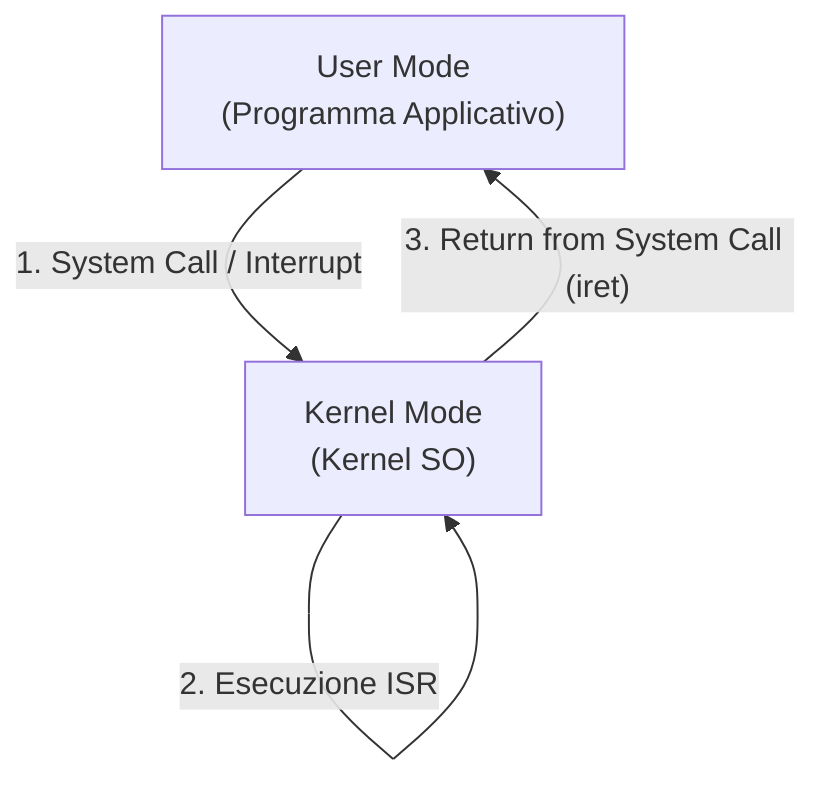

---
### **🔹 Gestione di un’Interruzione**
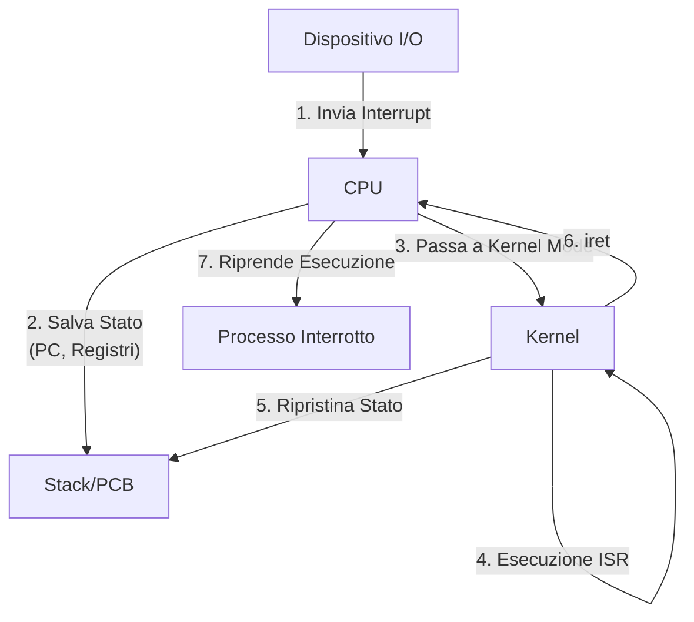

---
### **🔹 Gerarchia delle Memorie**
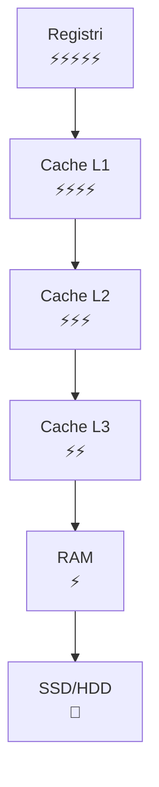

---
---
---

# **📚 2. PROCESSI**

---
### **🔹 Ciclo di Vita di un Processo**
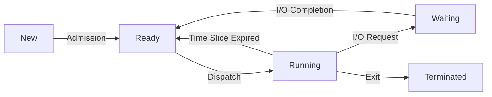

---
### **🔹 Processi Zombie e Orfani**
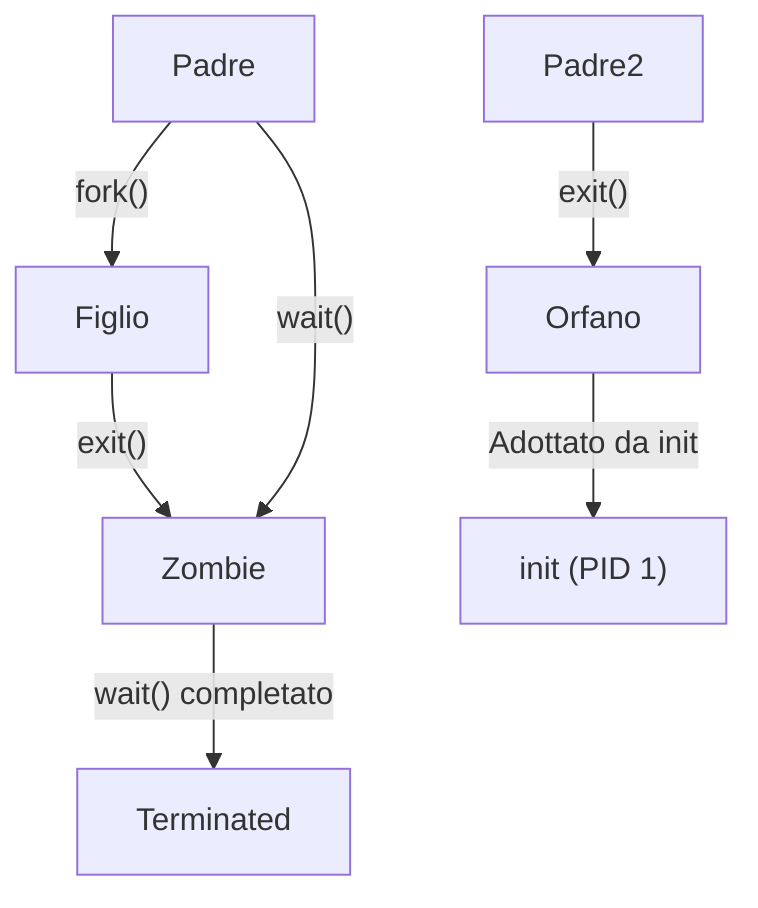

---
### **🔹 Context Switch**
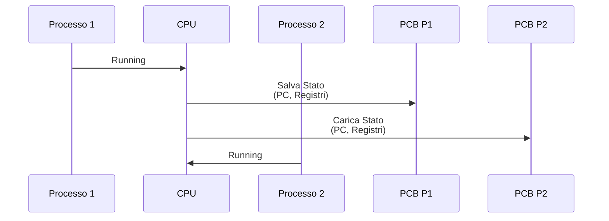

---
### **🔹 Layout di Memoria di un Processo**
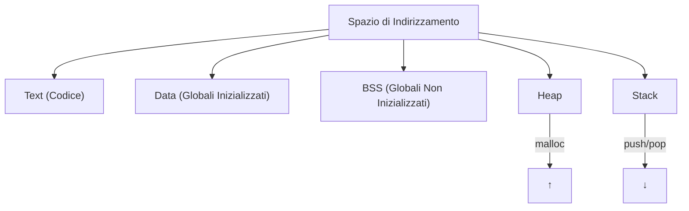

---
### **🔹 Esempio di `fork()` + `exec()`**
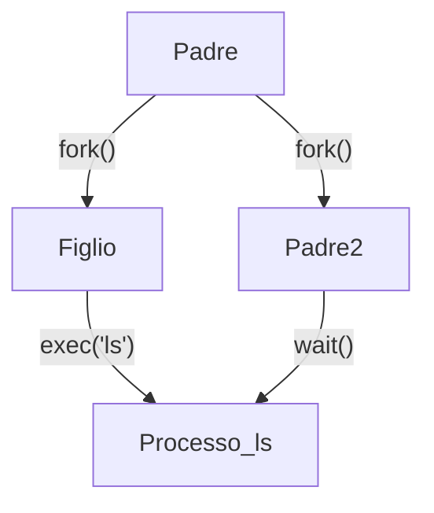

---
### **🔹 Comunicazione con Pipe**


---
### **🔹 Comunicazione con Shared Memory**
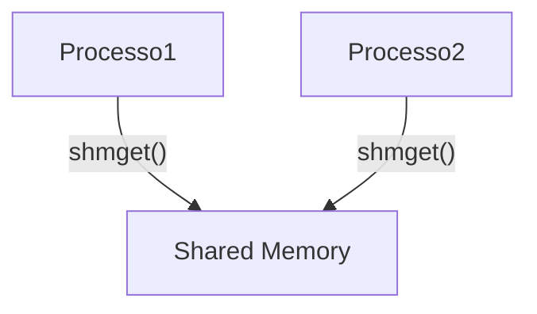

---
---
---

# **📚 3. THREAD**

---
### **🔹 Struttura di un Processo Multithread**
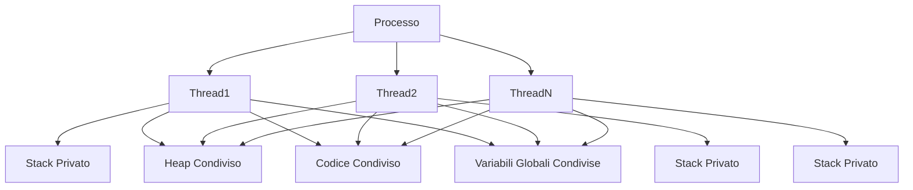

---
### **🔹 Modelli di Thread**
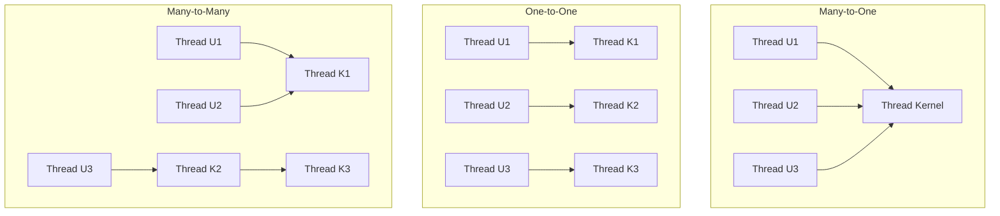

---
### **🔹 Stati di un Thread**
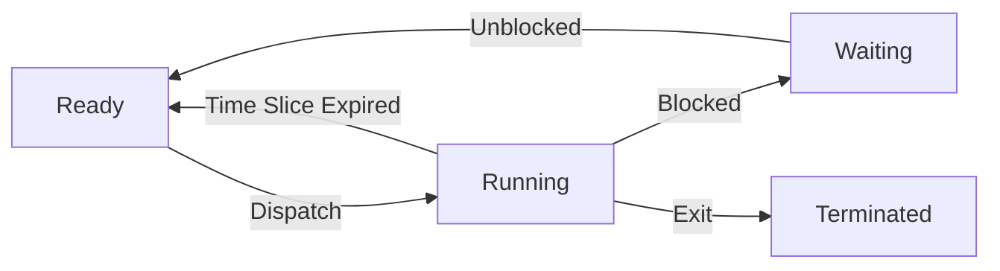

---
### **🔹 Fork + Thread (Problema Classico in Linux)**
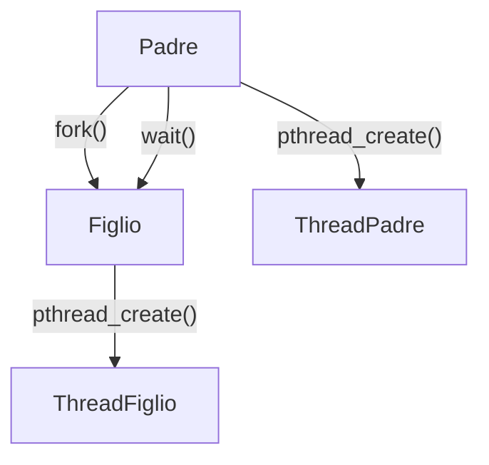

---
---
---

# **📚 4. SINCRONIZZAZIONE**

---
### **🔹 Sezione Critica con Mutex**
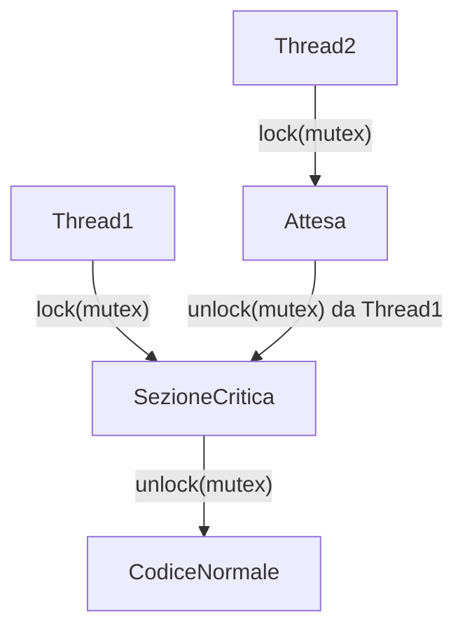

---
### **🔹 Algoritmo di Peterson (2 Processi)**
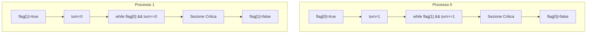

---
### **🔹 Semafori (Produttore-Consumatore)**
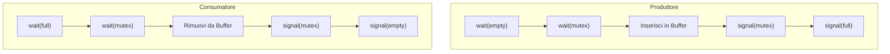

---
### **🔹 Monitor (Lettori-Scrittori 1ª Variante)**
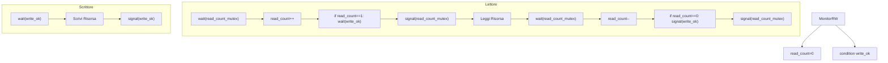

---
### **🔹 Deadlock (Grafo di Allocazione Risorse)**
#### **Caso 1: Deadlock (Risorse Singole)**
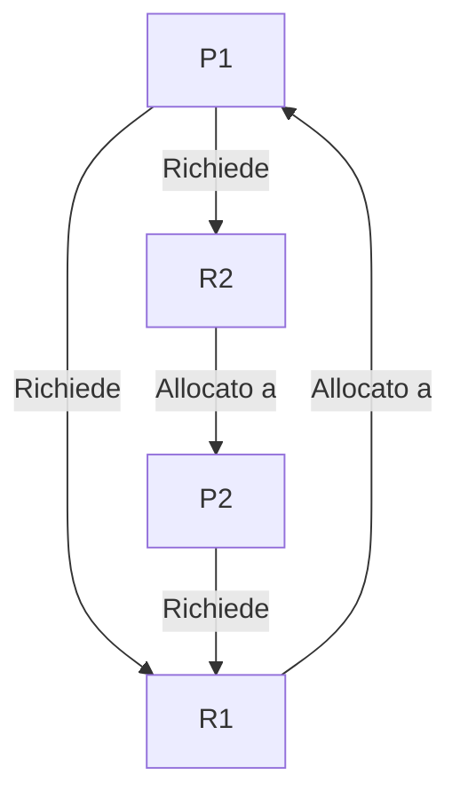

#### **Caso 2: Nessun Deadlock (Risorse Multiple)**
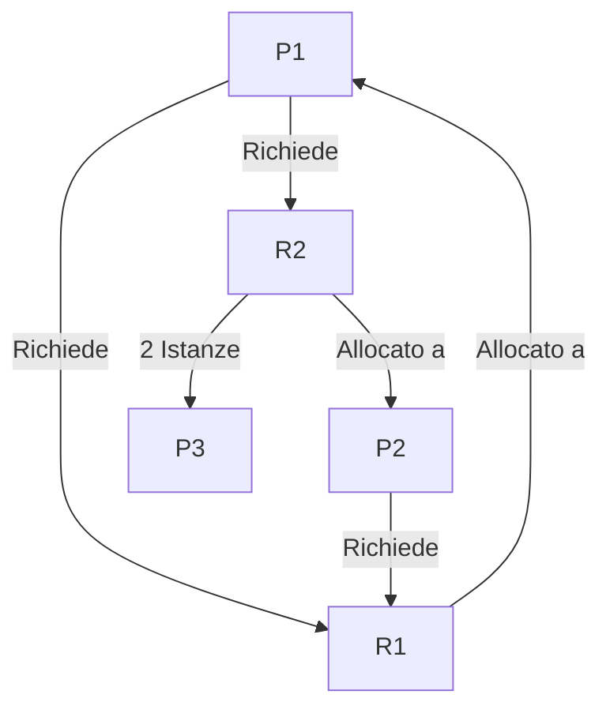

---
### **🔹 Algoritmo del Banchiere**
```mermaid
graph TD
    Allocation -->|"Max"| Max
    Max --> Need["Need = Max - Allocation"]
    Need -->|"Available"| Available
    Available --> E["Cerca Pi dove Need[i] ≤ Available"]
    E -->|"Trovato"| F["Simula Esecuzione Pi"]
    E -->|"Non trovato"| NonSicuro["Stato Non Sicuro"]
    F --> G["Available += Allocation[i]"]
    G --> H["Marca Pi come terminato"]
    H --> E
    F -->|"Tutti terminati"| Sicuro["Stato Sicuro"]
```

---
---
---

# **📚 5. SCHEDULAZIONE CPU**
*(I Gantt Chart non richiedono correzioni, ma li includo per completezza)*

---
### **🔹 Gantt Chart per FCFS**
```mermaid
gantt
    title FCFS
    dateFormat  X
    axisFormat %S
    P1 : 0, 6
    P2 : 6, 4
    P3 : 10, 2
```

---
### **🔹 Gantt Chart per Round Robin (Quantum=4)**
```mermaid
gantt
    title Round Robin (Quantum=4)
    dateFormat  X
    axisFormat %S
    P1 : 0, 4
    P2 : 4, 4
    P1 : 8, 4
    P3 : 12, 2
    P1 : 14, 2
```

---
---
---

# **📚 6. GESTIONE DELLA MEMORIA**

---
### **🔹 Allocazione Contigua (First Fit)**
```mermaid
graph TD
    A["Partizioni: 100, 500, 200, 300, 600"] --> B["P1=212KB"]
    B --> C["P1 → 500KB<br>(rimane 288KB)"]
    C --> D["P2=417KB"]
    D --> E["P2 → 600KB<br>(rimane 183KB)"]
    E --> F["P3=112KB"]
    F --> G["P3 → 200KB<br>(rimane 88KB)"]
```

---
### **🔹 Allocazione Contigua (Best Fit)**
```mermaid
graph TD
    A["Partizioni: 100, 500, 200, 300, 600"] --> B["P1=212KB"]
    B --> C["P1 → 300KB<br>(rimane 88KB)"]
    C --> D["P2=417KB"]
    D --> E["P2 → 500KB<br>(rimane 83KB)"]
    E --> F["P3=112KB"]
    F --> G["P3 → 200KB<br>(rimane 88KB)"]
```

---
### **🔹 Paginazione: Traduzione Indirizzi**
```mermaid
graph TD
    A[Indirizzo Logico] --> B[Numero Pagina]
    A --> C[Offset]
    B --> D[Tabella delle Pagine]
    D --> E[Frame Fisico]
    C --> E
    E --> F[Indirizzo Fisico]
```

---
### **🔹 Struttura di una Tabella delle Pagine**
```mermaid
graph TD
    A[Indirizzo Virtuale] --> B[Numero Pagina]
    A --> C[Offset]
    B --> D[Entry Tabella delle Pagine]
    D --> E[Valid Bit]
    D --> F[Dirty Bit]
    D --> G[Reference Bit]
    D --> H[Frame Number]
    E -->|"0"| I[Page Fault]
    E -->|"1"| J[Frame Fisico]
    H --> J
    C --> J
```

---
### **🔹 TLB (Translation Lookaside Buffer)**
```mermaid
graph TD
    A[Indirizzo Virtuale] --> B[TLB]
    B -->|"Hit"| C[Frame Fisico]
    B -->|"Miss"| D[Tabella delle Pagine]
    D --> C
    C --> E[Indirizzo Fisico]
```

---
### **🔹 Paginazione Gerarchica (2 Livelli)**
```mermaid
graph TD
    A[Indirizzo Virtuale 32-bit] --> B["10 bit<br>1° Livello"]
    A --> C["10 bit<br>2° Livello"]
    A --> D["12 bit<br>Offset"]
    B --> E[Tabella 1° Livello]
    E --> F[Tabella 2° Livello]
    F --> G[Frame Fisico]
    C --> F
    D --> G
```

---
### **🔹 Memoria Virtuale: Demand Paging**
```mermaid
graph TD
    A[Processo] -->|"Accesso a Pagina"| B[MMU]
    B -->|"Pagina in RAM?"| C{Pagina in RAM?}
    C -->|"Sì"| D[Indirizzo Fisico]
    C -->|"No"| E[Page Fault]
    E --> F["SO: Carica Pagina da Disco"]
    F --> D
```

---
### **🔹 Algoritmi di Sostituzione delle Pagine**
```mermaid
graph TD
    A[Page Fault] -->|"Frame Libero?"| B[Frame Libero?]
    B -->|"Sì"| C[Carica Pagina]
    B -->|"No"| D[Sostituisci Pagina]
    D --> E["FIFO: + Vecchia"]
    D --> F["LRU: - Recente"]
    D --> G["LFU: - Frequente"]
    D --> H["Clock: Puntatore"]
```

---
### **🔹 Thrashing**
```mermaid
graph TD
    A[Processi] -->|"Richiedono Memoria"| B[Page Fault]
    B -->|"Carica Pagina"| C[RAM]
    C -->|"Poca Memoria"| D[Altro Page Fault]
    D -->|"Eccesso"| E[Thrashing]
    E -->|"CPU in I/O"| F["Prestazioni ↓"]
```

---
---
---

# **📚 7. FILE SYSTEM**

---
### **🔹 Struttura Gerarchica del File System**
```mermaid
graph TD
    A["Root"] --> B["/home"]
    A --> C["/bin"]
    A --> D["/etc"]
    B --> E["/alice"]
    B --> F["/bob"]
    E --> G["Documents"]
    E --> H["Downloads"]
    G --> I["file1.txt"]
    G --> J["file2.txt"]
```

---
### **🔹 Struttura di un Inode (Unix/Linux)**
```mermaid
graph TD
    A[Inode] --> B[Metadati]
    A --> C[Puntatori]

    B --> B1[Type]
    B --> B2[Permissions]
    B --> B3[Owner]
    B --> B4[Size]
    B --> B5[Timestamps]

    C --> C1["Puntatori Diretti<br>(12)"]
    C --> C2[Puntatore Indiretto]
    C --> C3[Puntatore Doppio Indiretto]
    C --> C4[Puntatore Triplo Indiretto]

    C1 --> D[Blocchi Dati]
    C2 --> E[Blocco Puntatori]
    E --> D
    C3 --> F[Blocco Puntatori]
    F --> E
    C4 --> G[Blocco Puntatori]
    G --> F
```

---
### **🔹 Open-File Table (3 Livelli)**
```mermaid
graph TD
    A[Processo 1] -->|"open('file.txt')"| B[Per-Process FD Table]
    A -->|"fd=3"| B
    B -->|"Entry 3"| C[System-wide Open File Table]
    C -->|"File Offset, Mode"| D[In-Memory Inode Table]
    D -->|"Inode Number"| E[Disk Inode]
    E --> F[Blocchi Dati]

    G[Processo 2] -->|"open('file.txt')"| H[Per-Process FD Table]
    H -->|"fd=4"| C
```

---
### **🔹 Permessi dei File in Unix**
```mermaid
graph TD
    A["rwxr-xr--"] --> B["User: rwx"]
    A --> C["Group: r-x"]
    A --> D["Others: r--"]

    B --> B1["Read (4)"]
    B --> B2["Write (2)"]
    B --> B3["Execute (1)"]
    C --> C1["Read (4)"]
    C --> C2["Execute (1)"]
    D --> D1["Read (4)"]
```

---
---
---
# **🎯 SPIEGAZIONE: PERMESSI IN NOTAZIONE OTTALE (754)**

---
### **🔹 Come Funziona la Notazione Ottale**
I permessi in Unix/Linux sono rappresentati da **3 cifre ottali** (0-7), ognuna delle quali corrisponde a una **categoria** (User, Group, Others) e a una **combinazione di bit** (Read, Write, Execute).

---

#### **📌 Tabella di Conversione Bit → Ottale**
| **Permesso** | **Valore Ottale** | **Simbolo** |
|--------------|-------------------|-------------|
| Execute (x)  | 1                 | `x`         |
| Write (w)    | 2                 | `w`         |
| Read (r)     | 4                 | `r`         |

**Regola**:
- **Somma i valori** dei permessi attivi per ogni categoria.
- Esempio: `rwx` = 4 (r) + 2 (w) + 1 (x) = **7**

---

#### **📌 Struttura dei Permessi Ottali**
Le **3 cifre** rappresentano:
1. **Prima cifra**: **User** (proprietario del file)
2. **Seconda cifra**: **Group** (gruppo del file)
3. **Terza cifra**: **Others** (tutti gli altri utenti)

| **Cifra** | **Categorie** | **Esempio in 754** | **Permessi Simbolici** |
|-----------|---------------|---------------------|-------------------------|
| 7          | User          | 7                   | `rwx`                  |
| 5          | Group         | 5                   | `r-x`                  |
| 4          | Others        | 4                   | `r--`                  |

**Risultato finale**: `rwxr-xr--`

---

#### **📌 Come Convertire da Simbolico a Ottale**
**Passo 1**: Dividi i permessi in 3 gruppi (User, Group, Others).
- Esempio: `rwxr-xr--` → `rwx` (User) | `r-x` (Group) | `r--` (Others)

**Passo 2**: Converti ogni gruppo in valore ottale.
- `rwx` = 4 (r) + 2 (w) + 1 (x) = **7**
- `r-x` = 4 (r) + 0 + 1 (x) = **5**
- `r--` = 4 (r) + 0 + 0 = **4**

**Passo 3**: Combina i valori.
- **754** = `7` (User) + `5` (Group) + `4` (Others)

---
#### **📌 Esempi Pratici**
| **Permessi Simbolici** | **Notazione Ottale** | **Descrizione**                          |
|------------------------|----------------------|------------------------------------------|
| `rwxrwxrwx`           | 777                  | Tutti possono leggere, scrivere, eseguire |
| `rwxr-xr-x`           | 755                  | User: rwx, Group/Others: r-x             |
| `rwxr-x---`           | 750                  | User: rwx, Group: r-x, Others: ---       |
| `rwx------`           | 700                  | Solo il proprietario può fare tutto      |
| `rw-rw-r--`          | 664                  | User/Group: rw-, Others: r--             |
| `rw-r-----`          | 640                  | User: rw-, Group: r--, Others: ---       |
| `r--r--r--`          | 444                  | Tutti possono solo leggere              |

---
#### **📌 Comandi Utili**
```bash
# Cambiare permessi in notazione ottale
chmod 754 file.txt

# Cambiare permessi in notazione simbolica
chmod u=rwx,g=rx,o=r file.txt

# Visualizzare permessi attuali
ls -l file.txt
# Output: -rwxr-xr-- 1 user group 1234 May 20 10:00 file.txt
```

---
#### **📌 Permessi Speciali (SetUID, SetGID, Sticky Bit)**
I permessi speciali **precedono** le 3 cifre standard (es. `4755`).

| **Permesso Speciale** | **Valore Ottale** | **Simbolo** | **Descrizione**                                                                 |
|----------------------|-------------------|-------------|---------------------------------------------------------------------------------|
| **SetUID (SUID)**    | 4                 | `s`         | Esegue con i **permessi del proprietario** (es. `/usr/bin/passwd`).            |
| **SetGID (SGID)**    | 2                 | `s`         | Esegue con i **permessi del gruppo** (es. `/usr/bin/wall`).                     |
| **Sticky Bit**        | 1                 | `t`         | Solo il proprietario può eliminare i file nella directory (es. `/tmp`).         |

**Esempi**:
- `4755` → **SUID** + `rwxr-xr-x` (es. `/usr/bin/passwd`)
- `2755` → **SGID** + `rwxr-xr-x` (es. `/usr/bin/wall`)
- `1755` → **Sticky Bit** + `rwxr-xr-x` (es. `/tmp`)

**Nota**:
- Il **Sticky Bit** su una directory (es. `/tmp`) impedisce agli utenti di eliminare file di altri utenti.
- **SUID/SGID** su un file: l’esecuzione avviene con i permessi del **proprietario/gruppo** del file, non dell’utente che lo esegue.

---
#### **📌 Esempio Pratico: `chmod 4755 /usr/bin/programma`**
1. **4** = SetUID attivo.
2. **7** = User: `rwx`.
3. **5** = Group: `r-x`.
4. **5** = Others: `r-x`.
5. **Risultato**:
   - Il file `/usr/bin/programma` viene eseguito con i **permessi del proprietario** (es. root), anche se lanciat da un utente normale.

---
#### **📌 Come Calcolare `umask`**
L’`umask` **sottrae** i permessi predefiniti ai file/directory creati.
- **Valore predefinito**: `666` per i file, `777` per le directory.
- **Formula**:
  ```
  Permessi finali = Permessi predefiniti - umask
  ```
- **Esempio**:
  - `umask 022` (predefinito in molti sistemi):
    - File: `666 - 022 = 644` → `rw-r--r--`
    - Directory: `777 - 022 = 755` → `rwxr-xr-x`

**Comando per visualizzare `umask`**:
```bash
umask          # Output: 0022 (ottale)
umask -S       # Output: u=rwx,g=rx,o=rx
```

---
---
---
**✅ Ora hai tutto:**
✔ **Diagrammi Mermaid 100% compatibili con Obsidian** (nessun errore di sintassi).
✔ **Spiegazione completa sui permessi ottali**, inclusi SUID, SGID e Sticky Bit.

**Prova a incollare un diagramma in Obsidian per verificare che funzioni!** 🎉
Se vuoi aggiungere altri argomenti (es. `chown`, `chgrp`, ACL), fammi sapere!
