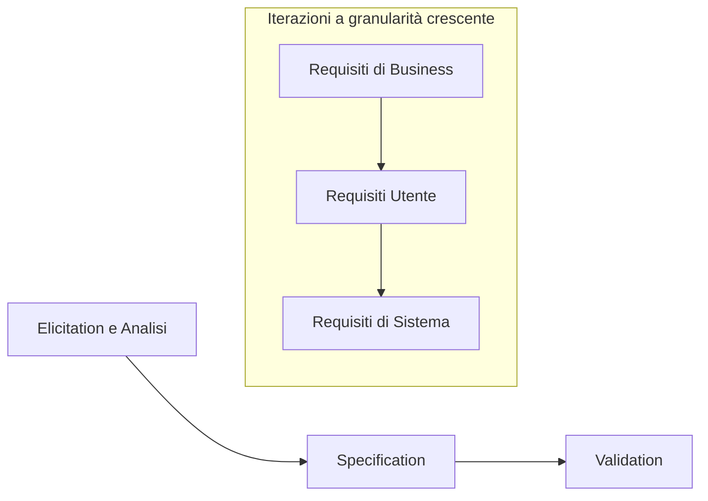

# Requirements Engineering: Elicitation and Analysis

> [!info] Citazione chiave
> «La parte più difficile della costruzione di un sistema software è decidere precisamente cosa costruire» — Fred P. Brooks. Nessun errore, se fatto in questa fase, è più difficile da correggere in seguito.

Il costo di correzione di un errore cresce con la fase del ciclo di vita in cui viene scoperto; gli errori di requisiti sono quindi i più costosi.

## Software Requirements

> [!def] Requisito
> Un **requisito** è una descrizione di ciò che il sistema deve fare: **servizi** che il sistema deve fornire ai propri utenti e **vincoli operativi** a cui è sottoposto.

### Livelli di requisiti

Il termine «requisito» è usato in modo incoerente nell'industria; distingue due livelli di astrazione.

- **Requisiti utente** (*user requirements*): descrizione astratta e ad alto livello di un servizio o vincolo, nella prospettiva dell'utente finale.
- **Requisiti di sistema** (*system requirements*): definizione dettagliata e formale di una funzione del sistema, nella prospettiva del sistema da costruire.

L'ambiguità tra i due livelli è inevitabile perché i requisiti svolgono una doppia funzione contrattuale: i **requisiti utente** possono essere la base di un bando di gara, mentre i **requisiti di sistema** — formulati dal contraente vincitore e validati dal committente — entrano nel contratto finale e sono **vincolanti**.

I requisiti esistono a livelli di astrazione crescente, dal business al dettaglio:

- **Business goal**: obiettivo aziendale che motiva il progetto (es. ridurre le visite mancate).
- **User requirement**: servizio richiesto dall'utente.
- **System requirement**: comportamento preciso del sistema.
- **Quality / constraint**: proprietà quantitativa o vincolo sul comportamento.

### Tipi di requisiti

- **Requisiti funzionali** (*functional requirements*): cosa il sistema deve fare.
- **Requisiti di qualità** (*quality requirements*): quanto bene il sistema deve svolgere le sue funzioni (prestazioni, affidabilità, sicurezza, manutenibilità, …).
- **Vincoli** (*constraints*): tecnologici, organizzativi, legali/regolatori, di processo.
- **Requisiti di dominio** (*domain requirements*): derivanti dal contesto o settore d'uso del software; possono essere funzionali o non e vincolano sia il progetto sia il processo di sviluppo (es. uno standard di sicurezza medica).

I requisiti di qualità e i vincoli sono spesso chiamati collettivamente **requisiti non funzionali**.

#### Requisiti non funzionali: classificazione

- **Requisiti di prodotto** (*product requirements*): caratteristiche richieste al prodotto — usabilità, efficienza (prestazioni, spazio), dipendenza (affidabilità, sicurezza).
- **Requisiti organizzativi** (*organizational requirements*): derivanti dall'organizzazione di committente e sviluppatori — ambientali, operativi, di sviluppo, contabili.
- **Requisiti esterni** (*external requirements*): derivanti da fonti esterne — regolatori, legislativi, etici, di sicurezza.

I non-funzionali non riguardano servizi specifici ma **caratteristiche del sistema nel suo insieme**; spesso sono più critici dei funzionali: un requisito funzionale subottimale si aggira, mentre il fallimento di un non-funzionale può rendere il sistema inutilizzabile o non schierabile (es. per mancata conformità al GDPR).

La distinzione funzionale/non-funzionale **non è netta**: un non-funzionale, sviluppato in dettaglio, genera requisiti funzionali (es. «solo utenti autorizzati» genera il login). I requisiti non sono indipendenti: uno spesso genera o vincola altri.

> [!warning] Testabilità
> I non-funzionali di sistema devono includere **indicatori quantitativi** quando possibile: «il sistema deve essere affidabile» non è verificabile, «uptime mensile del 99,9%» lo è.

Metriche tipiche per i requisiti non funzionali:

| Proprietà | Metriche |
| --- | --- |
| Prestazioni | Operazioni/secondo, tempo di risposta a utente/evento, frequenza di refresh dello schermo |
| Dimensione | Megabyte |
| Facilità d'uso | Tempo di formazione richiesto, tasso di errori utente, numero di richieste di supporto |
| Affidabilità | Tempo medio a guasto, tasso di disponibilità (uptime) |
| Robustezza | Tempo di ripristino dopo guasto, probabilità di perdita dati al guasto |

### Proprietà di un buon requisito

- **Chiaro e comprensibile**: soprattutto per i requisiti utente.
- **Non ambiguo**: l'ambiguità porta a dispute col committente.
- **Completo** e **consistente**: senza conflitti reciproci.
- **Necessario**: se ne deve capire la ragione d'essere.
- **Fattibile**: implementabile realisticamente.
- **Tracciabile**: si deve sapere da dove proviene e cosa dipende da esso.
- **Verificabile**: deve essere possibile stabilire senza ambiguità se il sistema lo soddisfa.

> [!example] I demoni dell'ambiguità
> Un requisito apparentemente chiaro nasconde domande non risposte (es. «segnale per i bambini» non definisce chi è un bambino né quando la regola si applica). Analogamente, un requisito di avvio/stop di un servizio remoto non specifica comportamento su stati già attivi, riavvii, cadute di connessione, errori e retry: i requisiti di sistema devono contenere dettaglio sufficiente a essere non ambigui e verificabili.

## Il processo di Requirements Engineering

> [!def] Requirements Engineering (RE)
> Sottoarea dell'ingegneria del software che fornisce metodi, tecniche e strumenti per comprendere e documentare cosa un sistema software deve fare.

Tre attività chiave:

1. **Elicitation e analisi**: scoprire i requisiti interagendo con gli stakeholder.
2. **Specification**: convertire i requisiti in una forma standardizzata.
3. **Validation**: verificare che i requisiti definiscano davvero il sistema voluto dal committente.

In pratica il processo **non è lineare**: le attività sono interleavate in un processo iterativo su livelli di granularità crescente — prima requisiti di **business**, poi **utente**, infine **di sistema** — e ogni iterazione include elicitation/analisi, specification e validation (con feasibility study, prototyping e review come tecniche di supporto).

## Requirements Elicitation and Analysis

L'elicitazione è considerata la parte **più critica** del processo RE e coinvolge la collaborazione tra **stakeholder**.

> [!def] Stakeholder
> Persone o gruppi affetti in qualche modo dal progetto: utenti finali (gruppo spesso eterogeneo), utilizzatori degli output del software, management e dirigenti del cliente, personale tecnico del cliente.

### Sfide dell'elicitazione

- Gli stakeholder **non sanno cosa vogliono**, se non nei termini più generali, e possono avanzare richieste irrealistiche.
- Gli stakeholder sono **esperti del proprio dominio**: usano gergo e conoscenza implicita, dando per scontati dettagli che non lo sono.
- Stakeholder diversi esprimono **bisogni diversi in modi diversi**: occorre gestire comunanze e conflitti.
- **Fattori politici** possono influenzare il processo (es. manager che chiedono requisiti per accrescere la propria influenza).
- Le priorità sono contrastanti e stakeholder che si sentono ignorati possono **sabotare** il processo.
- I requisiti **cambiano** durante l'elicitazione, anche per nuovi stakeholder emersi in corsa.

### Processo di elicitation e analisi

1. **Discovery e comprensione**: interazione con gli stakeholder per scoprire i requisiti.
2. **Classificazione e organizzazione**: raggruppamento dei requisiti correlati.
3. **Prioritizzazione e negoziazione**: risoluzione dei conflitti tra bisogni contrastanti.
4. **Documentazione**: tracciamento dei requisiti per l'iterazione successiva.

## Tecniche di elicitation

### Interviste con gli stakeholder

- **Interviste chiuse** (*closed*): il risponditore risponde a una lista predefinita di domande.
- **Interviste aperte** (*open*): nessuna agenda predefinita.
- In pratica si combinano: le interviste totalmente aperte raramente funzionano; conviene partire da domande predisposte che aprono discussioni meno strutturate.

Limiti e accorgimenti:

- Le persone parlano volentieri del proprio lavoro, ma occorre **non sprecare il loro tempo** e minimizzare l'impatto sul loro lavoro.
- Lo **gergo** e le conoscenze implicite rendono ambigue le risposte.
- Ogni stakeholder ha una **visione parziale o distorta** del lavoro dei colleghi di altre aree.
- Dinamiche di potere possono rendere gli stakeholder **riluttanti** a discutere requisiti e vincoli organizzativi.

### Etnografia

- Il software esiste in un **ambiente sociale e organizzativo** che genera o vincola i requisiti; spesso i processi realmente usati **differiscono** da quelli formali dichiarati.
- È una tecnica **osservativa**: l'ingegnere dei requisiti si immerge nell'ambiente di lavoro degli utenti finali e osserva il lavoro quotidiano, annotando i compiti effettivi e i partecipanti coinvolti.

È particolarmente efficace per scoprire:

- Requisiti derivanti da **come le persone lavorano davvero**, non da come i processi formali dicono che dovrebbero lavorare.
- Requisiti derivanti da **cooperazione e consapevolezza** delle attività altrui (es. verificare con i colleghi se un ordine è già stato consegnato).

### Personas

> [!def] Persona
> Archetipo **ipotetico** di utenti reali: non è una persona reale né completamente inventata, ma viene **scoperta** come sottoprodotto dell'elicitazione e definita con rigore e precisione. È basata su evidenze, non su stereotipi.

- Motivazione: gli utenti reali del software sono **diversi dagli sviluppatori**; le personas promuovono **empatia** e comprensione completa degli utenti.
- Sono essenziali quando **non ci sono stakeholder da intervistare** (es. software off-the-shelf per il grande pubblico).
- Non esiste una rappresentazione standard; elementi comuni:
  - **Personalizzazione**: nome, età, breve biografia.
  - **Informazioni lavorative**: qualifica e ruolo.
  - **Educazione** ed esperienza.
  - **Obiettivi**: interesse nell'uso del software.
  - **Frustrazioni / pain points**: criticità che il software può risolvere.

Da una persona possono **emergere nuovi requisiti** che gli stakeholder non avevano espresso (es. utenti non tecnologici che necessitano di prenotazione telefonica e reminder umani).

### Stories

- È più facile rapportarsi a **esempi reali** che ad astrazioni: gli stakeholder descrivono bene *come fanno le cose*, non *come devono essere i requisiti*.
- Una **storia** è una descrizione narrativa, ad alto livello, di come il sistema viene usato per un compito particolare: cosa fa l'utente, quali informazioni usa, quale output serve.

### Low-fidelity mockups

> [!def] Wireframe
> Schizzo semplificato dell'interfaccia utente del sistema; il focus è su **funzionalità e flusso**, non sull'estetica.

Benefici:

- **Facilitano la comprensione**: punto di partenza per la discussione e per una comunicazione chiara delle idee iniziali.
- **Aiutano a scoprire nuovi requisiti**: è più facile ragionare su interfacce concrete che su affermazioni astratte.
- **Engagement e feedback iterativo** senza grandi investimenti di design.
- **Fondamenta per lo sviluppo**: base per passare ai design a maggiore fedeltà e infine allo sviluppo.

Strumenti: carta e matita per gli schizzi iniziali; strumenti digitali commerciali (Balsamiq, Figma) o open-source (PenPot) per creare e condividere wireframe elettronici.

## Collocazione nel ciclo di vita

Nel ciclo di vita del software, la RE precede System Design e Software/UI-UX Design: i requisiti sono raccolti tramite interviste, personas e specificati con storie/scenari, use case, linguaggio naturale, modelli di dominio e mock-up; l'architettura alloca poi sottosistemi e requisiti su risorse hardware e software.
