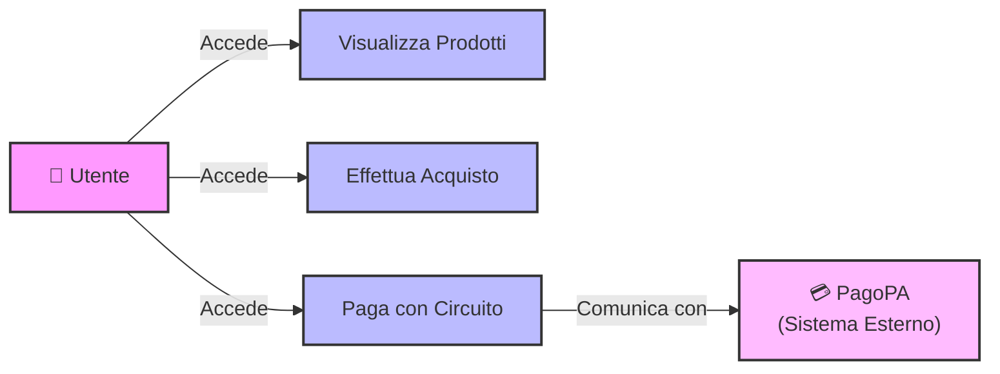

# Lezione 3 e 4: Ingegneria del Software: Fondamenti di Requisiti e Progettazione della Qualità

## Dal programma al prodotto software

Nel contesto dell'ingegneria del software è fondamentale distinguere il semplice **programma** dal **prodotto software**. Un programma è uno sviluppo ad hoc o a uso personale, mentre un prodotto software è un sistema complesso sviluppato in modo industriale attraverso un processo strutturato, noto come **Software Development Life Cycle (SDLC)**.

Realizzare un prodotto di qualità non significa massimizzare indefinitamente ogni singolo attributo qualitativo. La qualità è un concetto ampio e inclusivo: il compito dell'ingegnere del software è individuare e massimizzare, per lo specifico problema, le **caratteristiche di qualità prioritario-vincolanti**.

## La centralità dei requisiti: la lezione di Fred Brooks

La prima fase critica del ciclo di vita è l'**Ingegneria dei Requisiti (Requirements Engineering)**. Come evidenziato da Fred Brooks in *The Mythical Man-Month*:

> *"La singola parte più difficile nella costruzione di un sistema software è decidere esattamente cosa costruire. Nessun'altra parte del lavoro concettuale è così difficile come definire i requisiti tecnici dettagliati, e nessun'altra parte può rovinare così gravemente il sistema risultante se fatta male."*

Un algoritmo subottimale, infatti, può essere riorganizzato o ottimizzato in fase di refactoring; la mancata comprensione di un requisito o un'errata stima di un attributo di qualità può invece comportare il **fallimento totale del progetto**, costringendo a scartare l'intero sistema con enormi perdite economiche.

L'Ingegneria dei Requisiti è inoltre una disciplina fortemente multidisciplinare, posta all'intersezione tra informatica, psicologia e sociologia, poiché richiede empatia per estrarre e comprendere i reali bisogni degli utenti.

## Tassonomia e classificazione dei requisiti

### Gerarchia dei requisiti: business, user e system

I requisiti non si collocano tutti al medesimo livello di astrazione, ma seguono una gerarchia strutturata che parte dagli obiettivi strategici e scende fino ai dettagli contrattuali:

1. I **Business Requirements** (requisiti di business) esprimono gli obiettivi strategici ed economici dell'organizzazione, ad esempio "ridurre del 30% i mancati appuntamenti per aumentare i ricavi" o "velocizzare la gestione dei tirocini".
2. Gli **User Requirements** (requisiti utente) descrivono i servizi che l'utente si aspetta dal sistema in linguaggio naturale, ad esempio "i pazienti devono ricevere un promemoria per gli appuntamenti".
3. I **System Requirements** (requisiti di sistema) specificano in modo formale e dettagliato le funzioni e i vincoli operativi del sistema, e costituiscono la base contrattuale tra cliente e software house.

### Requisiti funzionali e non funzionali

Ortogonalmente al livello di astrazione, i requisiti si dividono per contenuto. I **requisiti funzionali** definiscono *cosa* il sistema deve fare, cioè i servizi e le funzionalità offerti agli utenti. I **requisiti non funzionali** definiscono *come* il sistema deve performare e comprendono due famiglie:

- I **Quality Requirements** (requisiti di qualità), che riguardano prestazioni, scalabilità, usabilità e manutenibilità.
- I **Constraints** (vincoli), cioè limiti tecnologici (ad esempio l'utilizzo obbligatorio di database Oracle), organizzativi o legali.

### Vincoli organizzativi, legali ed esterni

Molti requisiti non funzionali derivano da fattori esterni al prodotto stesso. Tra i **vincoli organizzativi** rientrano le convenzioni aziendali sulla scrittura del codice o le naming convention. Tra i **vincoli legali e regolatori** rientrano il rispetto della normativa sulla privacy **GDPR** per la gestione dei dati personali in Europa, o certificazioni specifiche come la normativa **DO-178** in ambito aeronautico.

## Ambiguità del linguaggio naturale e verificabilità quantitativa

### I rischi della lingua naturale

Il linguaggio naturale è intrinsecamente ambiguo: un requisito espresso in modo generico può portare a interpretazioni divergenti da parte del team di sviluppo e del cliente, generando contenziosi. Due esempi discussi in aula lo dimostrano concretamente.

Il **cartello stradale americano** con la scritta "School speed limit 20 when children are present" sembra chiaro a prima vista, ma solleva enormi ambiguità algoritmiche: che cosa definisce la presenza di un bambino? A quale distanza? Quali sono gli orari scolastici validi? Analogamente, il **comando "Start/Stop" di un servizio remoto** lascia aperte domande cruciali: che cosa accade se si invia il comando *Start* a un servizio già attivo, o se due utenti inviano comandi opposti simultaneamente?

### Proprietà dei requisiti e verificabilità

Per essere validi, i requisiti devono essere **chiari, non ambigui, completi, consistenti, tracciabili e verificabili**.

Da questa esigenza deriva una regola fondamentale: un requisito non funzionale non deve mai utilizzare aggettivi qualitativi generici come "veloce" o "usabile", ma deve essere espresso tramite **metriche quantitative e misurabili**, ad esempio "il 95% delle operazioni deve completarsi entro 1 secondo" o "garantire 30 FPS su una specifica GPU".

## Il processo iterativo di Requirements Engineering

L'Ingegneria dei Requisiti è un **processo iterativo** articolato in tre macrofasi che si ripercorrono a ciclo in caso di incongruenze o dubbi:

1. L'**elicitazione** (requirements elicitation) è la raccolta dei fabbisogni attraverso il dialogo con gli stakeholder.
2. L'**analisi e specifica** (analysis & specification) è la modellazione, la formalizzazione e la strutturazione tecnica dei requisiti.
3. La **validazione** (validation) è il controllo della consistenza e dell'assenza di contraddizioni nei requisiti.

Al termine del ciclo si produce il **documento dei requisiti**.

### Simulazione pratica: il caso della gestione tirocini su Segrepass

Per dimostrare la variabilità delle prospettive degli stakeholder, durante la lezione è stata condotta un'intervista a tre studenti per progettare la funzionalità di gestione tirocini su Segrepass. Il primo stakeholder ha richiesto un catalogo con filtri e collegamenti ai siti aziendali per informarsi; il secondo ha ipotizzato un semplice elenco statico di contatti e-mail; il terzo ha preteso un'integrazione nell'area riservata del piano di studi, attivabile solo al completamento degli esami dei primi due anni, con form dinamici di candidatura.

### Gestione delle contraddizioni e il Product Owner

La simulazione ha evidenziato requisiti in palese contrasto, come rendere la sezione visibile a tutti versus nasconderla a chi non possiede i CFU necessari. In presenza di visioni divergenti è quindi necessaria la figura del **Product Owner** lato cliente: il responsabile finale che possiede l'autorità di dirimere i dubbi e prendere decisioni vincolanti.

### Prioritarizzazione e modelli di ciclo di vita: Waterfall vs Agile

I requisiti devono essere organizzati secondo un **ordine di priorità**, e questa organizzazione influenza la scelta del modello di sviluppo. Nel **modello a cascata (Waterfall)** si segue un approccio sequenziale "per pilastri verticali": si completa interamente la fase di analisi prima di passare alla progettazione e allo sviluppo. Nel **modello Agile** si adotta invece un approccio iterativo "per fette/funzionalità": si rilasciano continuamente incrementi software, partendo dai requisiti a priorità più alta.

## Tecniche di elicitazione e strumenti di prototipazione

### Tecniche di intervista e studi etnografici

- Le **interviste aperte** funzionano come sessioni di brainstorming libero: permettono di far emergere aspetti inaspettati, ma possono portare a dettagli disomogenei.
- Le **interviste chiuse** sono basate su quesiti prefissati: garantiscono risposte omogenee, ma rischiano di tralasciare esigenze non previste dall'intervistatore.
- Gli **studi etnografici** consistono nell'osservazione diretta dell'operatore sul campo, per comprendere i flussi operativi reali e l'integrazione nell'organizzazione.

### La barriera del linguaggio di dominio

Ogni ambito operativo possiede un proprio **gergo specialistico** (il linguaggio di dominio) che l'analista deve apprendere prima di poter dialogare con gli stakeholder. Negli enti locali, ad esempio, si usano termini come "Tracciato 290" o "iscrizione a ruolo coattivo" nella gestione dei tributi comunali; nel settore cinematografico si parla della stampa del "Borderò" per la SIAE.

### Modellazione degli utenti: le personas

Le **Personas** sono archetipi e rappresentazioni fittizie delle diverse classi di utenti finali, come lo studente smanettone contrapposto all'utente poco tecnologico. Aiutano il team a immedesimarsi nelle reali esigenze e limitazioni dell'utente finale durante la progettazione delle interfacce.

### Wireframe e mockup

Per eliminare l'ambiguità del linguaggio naturale si utilizzano i **Mockup** (o wireframe). Poiché la loro funzione è concentrare la discussione esclusivamente sulla struttura informativa e sul flusso di navigazione, i wireframe devono essere a **bassa fedeltà**, cioè privi di colori o elementi estetici. Tra gli strumenti professionali indicati figurano **Figma**, **Balsamiq** e **Penpot**.

## Modellazione dei requisiti con UML: Use Case Diagrams

### Scopo comunicativo di UML

Il **Unified Modeling Language (UML)** offre un insieme di diagrammi standardizzati il cui scopo fondamentale è **comunicare in modo sintetico e non ambiguo** la struttura e il comportamento del software.

### Componenti del diagramma dei casi d'uso

Il **Diagramma dei Casi d'Uso** definisce le funzionalità del sistema da una prospettiva ad alto livello attraverso tre elementi:

1. L'**attore** (actor), rappresentato con uno *stickman*, indica una classe di utenti o un sistema esterno che interagisce con il software.
2. Il **caso d'uso** (use case), rappresentato da un'ellisse contenente un sintagma verbale (ad esempio "Prenota Esame"), esprime una funzionalità ad alto livello.
3. Il **confine del sistema** (system boundary) è un box che racchiude i casi d'uso interni al software sviluppato.

### Scenari di esecuzione e relazioni

Ogni caso d'uso si articola in più flussi. Il **Main Success Scenario** è il flusso principale in cui tutte le operazioni vanno a buon fine; gli **scenari alternativi/eccezioni** sono i flussi gestiti in caso di errori, ad esempio il credito insufficiente. Esistono inoltre relazioni tra attori: la **specializzazione degli attori** fa sì che un attore specializzato erediti tutte le funzionalità dell'attore generale e ne aggiunga di proprie, e viene rappresentata con una freccia con triangolo cavo.

### Granularità del caso d'uso

Un caso d'uso deve rappresentare una **macro-funzionalità con un reale beneficio economico o pratico per l'utente**, come "Effettua Acquisto", e non singoli passi operativi intermedi come "Inserisci Login" o "Aggiungi Carta di Credita": questi costituiscono dettagli di sequenza, non casi d'uso.

## Sintesi finale

- **Prodotto software vs programma:** approccio industriale vs sviluppo individuale.
- **Requirements Engineering:** la fase più critica del ciclo di vita, poiché gli errori sui requisiti causano il fallimento dell'intero progetto.
- **Tassonomia:** Business Requirements → User Requirements → System Requirements.
- **Funzionali vs non funzionali:** *cosa* fa il sistema vs *come* lo fa (quality requirements + constraints).
- **Verificabilità quantitativa:** un requisito non funzionale deve essere espresso con metriche numeriche misurabili, evitando termini ambigui come "veloce".
- **Processo iterativo:** elicitazione → analisi/specifica → validazione.
- **Strumenti di elicitazione:** interviste (aperte/chiuse), studi etnografici, personas, user stories, wireframe/mockup (Figma, Balsamiq).
- **UML Use Case Diagram:** rappresentazione ad alto livello di attori, casi d'uso (verbo + complemento) e confini di sistema.
- **Product Owner:** figura responsabile lato cliente che dirime i requisiti in contrasto.
- **Ciclo di vita:** Waterfall (approccio per pilastri) vs Agile (approccio per fette/funzionalità prioritarizzate).