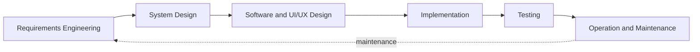
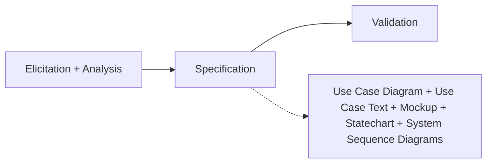
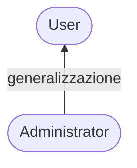

# Lezione 5 e 6 — Requirements Engineering: Specification

## Il ciclo di vita del software e il posto della RE

- Il **ciclo di vita del software** è composto dalle fasi: Requirements Engineering → System Design → Software and UI/UX Design → Implementation → Testing → Operation and Maintenance.
- Nella **Requirements Engineering** i requisiti sono raccolti tramite interviste con stakeholder, personas, storie e scenari; sono specificati con Use Cases, linguaggio naturale, domain model e mock-up.
- Nel **System Design** si definisce l'architettura del sistema: i requisiti sono allocati a sotto-sistemi software, e i sotto-sistemi a risorse hardware; si usano architectural pattern.
- Nel **Software and UI/UX Design** si definiscono gli oggetti necessari a realizzare ogni sottosistema; si usano design pattern, usability engineering e wireframing ad alta fedeltà.
- Nell'**Implementation** ogni sottosistema viene implementato (codice sorgente e altri artefatti), con attenzione a clean code, framework/ORM e qualità del software.
- Nel **Testing** si verifica che il software soddisfi il cliente: code inspection, functional testing (unit, integration, system) e usability testing.
- In **Operation and Maintenance** il sistema entra in uso pratico; la manutenzione serve a correggere errori non scoperti prima e ad adattare il software a cambiamenti nei requisiti o nell'ambiente.



## Il processo di Requirement Engineering

- Il processo ha tre fasi: **Elicitation + Analysis** → **Specification** → **Validation**.



## Requirements Specification

- La **Requirement Specification** è il processo di scrivere i requisiti utente e di sistema in un **requirements document**.
- Gli **user requirements** devono essere comprensibili a utenti finali e committenti senza background tecnico.
- I **system requirements** sono requisiti più dettagliati e possono includere informazioni più tecniche.
- I requisiti possono far parte di un contratto per lo sviluppo del sistema, quindi devono essere **completi e dettagliati** il più possibile.

### Requirements e design

- In principio i **requisiti** dicono *cosa* il sistema deve fare e il **design** *come* lo fa; in pratica sono **inseparabili**:
	- I requisiti possono essere strutturati e organizzati sulla base di un'architettura di alto livello del sistema.
	- Il sistema può interagire con altri sistemi che generano requisiti di design.
	- L'uso di un'architettura specifica per soddisfare requisiti non-funzionali può essere un requisito di dominio.

### Approcci alla specifica

- **Natural Language**: requisiti come frasi numerate in linguaggio naturale; ogni frase esprime un requisito.
- **Structured Natural Language**: si usa una form o template standardizzato.
- **Semi-formal notations and models**: UML Use Case Diagram e altri domain model, tipicamente integrati da annotazioni in linguaggio naturale.
- **Formal Specification**: notazioni basate su concetti matematici come macchine a stati finite e infinite, logiche temporali.

> [!info] Scelta dell'approccio per dominio
> - Nei sistemi **safety-critical** si usano comunemente specifiche formali e linguaggio naturale strutturato.
> - In un'app **todo list** si può usare linguaggio naturale non strutturato.
> - In un **sistema informativo medio-grande** le notazioni semi-formali sono un buon compromesso.

### Specifica in linguaggio naturale (NL)

- I requisiti sono scritti come frasi in linguaggio naturale, opzionalmente integrati da diagrammi e tabelle.
- È usata perché è **espressiva**, **intuitiva** e **universale**: i requisiti risultano comprensibili a utenti e committenti.
- Può esprimere requisiti sia **funzionali** che **non-funzionali**.

#### Linee guida per la NL

- Definire un formato "standard" e usarlo per tutti i requisiti, es.: `<part of the system> shall <requirement> (<rationale>)`.
	- **shall** per requisiti obbligatori, **should** per requisiti desiderabili.
- Usare l'evidenziatura del testo per identificare le parti chiave del requisito.
- Evitare il gergo informatico.
- Includere la spiegazione (**rationale**) del perché un requisito è necessario.

#### Problemi del linguaggio naturale

- **Lack of clarity**: la precisione è difficile senza rendere il documento difficile da leggere.
- **Requirements confusion**: requisiti funzionali e non-funzionali tendono a essere mescolati.
- **Requirements amalgamation**: più requisiti diversi possono essere espressi insieme nella stessa frase.

## Specifiche strutturate

- La **Structured Specification** è un approccio in cui la libertà del redattore è limitata e si impone un modo standardizzato di scrivere i requisiti.
- Funziona bene per certi tipi di requisiti (es. sistemi embedded di controllo) ma a volte è troppo rigida per i requisiti di sistemi aziendali (business system).

> [!example] Esempio di form strutturata (Insulin Pump/Control Software/SRS/3.3.2)
> Ogni requisito è descritto con campi fissi:
>
> | Campo | Contenuto |
> | --- | --- |
> | **Function** | Compute insulin dose: Safe sugar level |
> | **Description** | Computa la dose di insulina quando il livello di zucchero misurato è tra 3 e 7 unità |
> | **Inputs** | Lettura corrente dello zucchero ($r_2$), le due letture precedenti ($r_0$ e $r_1$) |
> | **Source** | Lettura corrente dal sensore; le altre letture dalla memoria |
> | **Outputs** | `CompDose` — la dose di insulina da somministrare |
> | **Action** | `CompDose` è zero se il livello è stabile o in caduta, o se cresce ma il tasso di crescita diminuisce; se livello e tasso di crescita sono entrambi crescenti, `CompDose` = differenza tra livello corrente e precedente divisa 4, arrotondata (se l'arrotondamento dà zero, si usa la dose minima erogabile) |
> | **Requires** | Le due letture precedenti, per calcolare il tasso di variazione |
> | **Precondition** | Il serbatoio di insulina contiene almeno la dose singola massima consentita |
> | **Postcondition** | In memoria $r_0$ è sostituito da $r_1$, poi $r_1$ da $r_2$ |
> | **Side effects** | Nessuno |

## Use Case Diagrams

### Use Cases

- Gli **Use Cases** descrivono le interazioni tra utenti e sistema usando un modello grafico e testo strutturato in linguaggio naturale.
- Sono una parte chiave dell'**UML** (Unified Modelling Language) e rappresentano l'insieme dei **requisiti funzionali** di un sistema.
- Identificano:
	- **Attori (Actors)** — categorie di utenti del sistema (non necessariamente umani).
	- **Use Cases** — obiettivi (goal) di un attore, offerti dal sistema.
- Informazioni aggiuntive sulle interazioni possono essere fornite da descrizioni testuali strutturate o da modelli semi-formali (es. Sequence Diagram UML o Statechart).
- Scopo: supportare la comunicazione col cliente per definire le funzionalità del sistema; devono essere il più semplici possibile.
- **Non definiscono *come* il sistema è implementato, ma cosa il sistema deve fare**, dal punto di vista degli utenti (il sistema è una **black box**).
- Vengono spesso documentati con un **Use Case Diagram (UCD)** di alto livello.

### Attori

- Gli attori sono rappresentati con **stick figure** e hanno un nome unico.
- Rappresentano entità **esterne** che interagiscono con il **System Under Development (SUD)**:
	- Classi di utenti (umani).
	- Altri sistemi.
	- Ambiente fisico.
- Gli attori sono più **coarse-grained** delle Personas: un attore può essere associato a più Personas.

#### Euristiche per identificare gli attori

- Quali gruppi di utenti sono supportati dal SUD nel loro lavoro?
- Quali gruppi eseguono le funzionalità principali offerte dal SUD?
- Quali gruppi eseguono le funzioni secondarie (es. amministrazione)?
- Il SUD interagisce con sistemi o software esterni? Ogni sistema esterno con cui il SUD interagisce è un attore.
- Un attore non corrisponde a una singola entità ma a una **classe di utenti con lo stesso ruolo**; uno stesso utente può avere ruoli diversi nello stesso sistema (es. l'amministratore di un sito può anche visitarne le pagine come utente non autenticato).

### Use Cases

- I use case sono rappresentati come **ellissi nominate**.
- **Un Use Case rappresenta un obiettivo che un attore vuole raggiungere interagendo col sistema**, fornendo un **beneficio** o **utilità** all'attore.
- Il nome è tipicamente un **active verb phrase** che descrive il goal dell'attore: *Withdraw Money, Submit Incident Report, Borrow Book, Generate Monthly Report*.
- I use case modellano i **requisiti funzionali**.

#### Use case e scenari

- Un use case astrae molti possibili **scenari** (sequenze di azioni) per lo stesso obiettivo.
- Uno **scenario** è un'istanza di un use case; il use case rappresenta una classe di scenari che usano la stessa funzionalità.

### System Boundary

- Prima di identificare attori e use case, definire chiaramente il **SUD** (System Under Development):
	- Gli attori sono **esterni** al SUD.
	- I use case descrivono comportamenti **forniti dal** SUD.
	- Spostare il **system boundary** può cambiare sia attori sia use case.
- Ciò che va sviluppato è **dentro** il SUD; ciò che è già disponibile **non** lo è.

### Relazioni nel UCD

#### Associazioni

- Un'**associazione** indica che l'attore partecipa al Use Case interagendo col sistema.
- Graficamente è una **linea** che collega attore e use case.

#### Attori secondari

- Un use case può essere associato a più attori:
	- **Primary Actor**: l'attore il cui obiettivo è soddisfatto dal use case.
	- **Supporting/Secondary Actor**: entità esterna da cui il sistema ha bisogno di un servizio durante l'esecuzione del use case.
- La partecipazione di un attore secondario può essere opzionale (**cardinalità** 0..1, es. un Bank Payment Processor coinvolto solo se il cliente paga con carta).
- Il UCD **non** specifica *come* i diversi attori sono coinvolti né le loro responsabilità: queste si specificano con descrizioni aggiuntive.

```mermaid
flowchart LR
  Customer([Customer]) ---|associazione| UC1(((Checkout)))
  Cashier([Cashier]) --- UC1
  Bank{{Bank Payment Processor}} -. 0..1 .-> UC1
```

#### Generalizzazione di attori

- La **generalizzazione tra attori** si applica quando un attore è sotto-tipo di un altro.
- Stesso concetto e notazione dei Class Diagram UML: freccia con **testa vuota** dal figlio al genitore.
- L'attore specializzato può eseguire tutti i use case che il genitore può eseguire.



### Errori comuni (Rookie Mistakes)

> [!warning] Errori comuni nella modellazione dei use case
> - Ogni use case deve dare un **beneficio** all'attore (aiutarlo a completare il suo lavoro o raggiungere un obiettivo): i nomi dei use case contengono tipicamente un verbo, i nomi degli attori un sostantivo.
> - Due attori associati allo stesso use case (cardinalità non nulla) sono **coinvolti e devono collaborare in ogni istanza** (scenario) del use case: **non** significa che ciascuno può eseguirlo indipendentemente.
> - Attenzione alle generalizzazioni improprie: ogni attore deve avere i propri use case; l'attore specializzato eredita già tutti i use case del genitore — se non ha use case propri, la generalizzazione è inutile o mancano use case.
> - Il diagramma non deve diventare troppo complesso: relazioni tra use case e generalizzazioni vanno usate con moderazione, la modellazione deve restare a un alto grado di astrazione e ordinata (evitare linee che si incrociano). **Un diagramma complesso indica un cattivo analista.**

#### Livello giusto del use case

- Un use case deve corrispondere a un **user goal**, non a una singola operazione di UI.
- Troppo piccoli: *Enter password, Click Checkout, Select payment method*.
- Obiettivi appropriati: *Authenticate User, Purchase Product, Submit Incident Report*.
- Domanda guida: **"What is the actor trying to achieve?"** — se completare il use case non fornisce valore significativo all'attore, è troppo fine-grained.

## Specifica dettagliata dei Use Cases

- Il UCD dà una visione di insieme di alto livello dei requisiti funzionali, ma **non è abbastanza dettagliato** per stabilire i requisiti di sistema.
- Per **ogni** UC del diagramma serve una specifica dettagliata, che renda il comportamento richiesto chiaro e **verificabile**.
- Vanno descritti il **Main Success Scenario** e **tutti gli scenari alternativi e di fallimento rilevanti**.

### Contenuto di una descrizione testuale

- Descrizione di ciò che sistema e utenti si aspettano quando il use case inizia.
- Descrizione del flusso normale di eventi (**main scenario**).
- Descrizione di ciò che può causare errori e come gestirli.
- Descrizione dello stato del sistema al termine del use case.

### Formati dei use case

- **Brief**: sintetico riassunto in un paragrafo, di solito del solo main success scenario.
- **Casual**: formato informale a paragrafi che coprono vari scenari.
- **Fully-dressed**: tutti i passi e le variazioni descritti in dettaglio, con sezioni di supporto (precondizioni, garanzie di successo).
- Brief e Casual si usano nelle fasi iniziali della specifica, per capire rapidamente soggetto e perimetro; i Fully-dressed si sviluppano dopo, come base per un **contratto** e per specificare in dettaglio il comportamento del sistema.

### Template di Cockburn (semplificato)

- Per le descrizioni fully-dressed esistono diversi formati proposti; questo è basato sul template di **Alistair Cockburn**.

| **USE CASE #X** | **Name of the Use Case** |
| --- | --- |
| **Goal in Context** | Descrizione dell'obiettivo del UC |
| **Preconditions** | Tutte le condizioni che devono valere per avviare il UC |
| **Success End Condition** | Stato del sistema se il UC ha successo |
| **Failed End Condition** | Stato del sistema se il UC fallisce |
| **Primary Actor** | Attore primario del UC |
| **Trigger** | Azione dell'attore primario che avvia il UC |
| **Main Scenario** | Tabella a step: **Actor 1** \| **Actor n** \| **System** |
| **Extensions** | Per ogni estensione: tabella a step riferita al main scenario |
| **Open Issues** | Aspetti ancora da chiarire; alla consegna del documento deve essere vuota |

- Il **main scenario** è la sequenza di azioni che si verifica quando tutto procede senza intoppi.
- Ma ci possono essere modi diversi di eseguire un use case (es. autenticazione con PIN o con impronta) o errori in qualche punto: descrivere anche queste sequenze alternative è fondamentale per il comportamento funzionale, usando le **Extensions** (tipicamente il testo nelle estensioni è molto più abbondante che nel main scenario).

#### Scrivere un'estensione

Ogni estensione identifica quattro elementi:

1. **Where?** — riferimento allo step del main scenario.
2. **When?** — condizione che innesca l'estensione.
3. **What happens?** — sequenza alternativa.
4. **Then?** — terminare, riuscire diversamente, o **ritornare a uno step del main scenario**.

> [!example] Estensione tipica (fondi insufficienti, riferita a uno step *x*)
> - *x*a — Il sistema informa il cliente che l'importo richiesto non è disponibile.
> - Il sistema chiede un importo diverso.
> - Si riprende dallo step precedente del main scenario.

- Scenari di fallimento ed errori da dettagliare come estensioni: PIN errato, saldo insufficiente del cliente, riserve di cassa insufficienti dell'ATM, carta rubata, carta illeggibile.
- Variazioni possibili (esecuzione diversa, non errore): autenticazione con impronta o riconoscimento facciale invece del PIN, stampa opzionale della ricevuta.

## Requirements Validation

- La **Requirements Validation** dimostra che i requisiti definiscono il sistema che il cliente vuole davvero.
- Gli errori nei requisiti hanno costi alti: correggere un errore di requisito dopo la consegna può costare fino a **100 volte** la correzione di un errore di implementazione.

### Requirement checking

- **Validity**: il sistema fornisce le funzioni che supportano al meglio i bisogni del cliente?
- **Consistency**: ci sono requisiti in conflitto?
- **Completeness**: tutte le funzioni richieste dal cliente sono incluse?
- **Realism**: i requisiti sono implementabili con il budget e la tecnologia disponibili?
- **Verifiability**: i requisiti sono controllabili?

### Tecniche di validazione

- **Requirements reviews**: analisi manuale sistematica dei requisiti.
- **Prototyping**: uso di un modello eseguibile semplificato del sistema per verificare i requisiti; anche *visual prototyping* con mockup/wireframe.
- **Test-case generation**: sviluppo di test per i requisiti, per verificarne la testabilità.

#### Requirements reviews

- Vanno tenute revisioni regolari mentre i requisiti vengono formulati.
- Devono coinvolgere sia lo staff del cliente sia quello dell'appaltatore.
- Possono essere formali (su documenti completati) o informali; una buona comunicazione tra sviluppatori, clienti e utenti risolve i problemi in fase iniziale.

#### Review checks

- **Verifiability**: il requisito è realisticamente testabile?
- **Comprehensibility**: il requisito è compreso correttamente?
- **Traceability**: l'origine del requisito è dichiarata chiaramente?
- **Adaptability**: il requisito può essere cambiato senza grande impatto sugli altri requisiti?