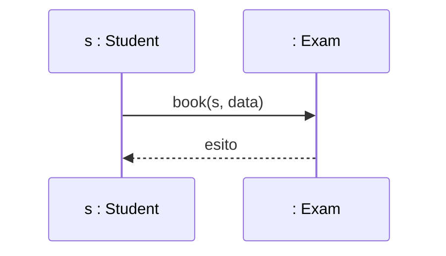

# Lezione — UML: Class Diagram e Sequence Diagram

## Il Class Diagram e i suoi limiti

> [!def] Class Diagram
> Strumento principale dell'**UML** (*Unified Modeling Language*), descrive le idee e la struttura del software a vari livelli di dettaglio e in diverse fasi del ciclo di vita: dalla bozza iniziale dell'architettura fino alla definizione concreta, da cui generare scheletri di codice (es. Java).

- **Struttura statica e astratta:** descrive solo quali classi esistono, i loro **attributi** e **metodi**, e le relazioni strutturali tra loro.
- **Mancanza di dinamica:** non specifica la logica interna dei metodi né **come le classi e gli oggetti collaborano nel tempo** per realizzare una funzionalità o un caso d'uso (*use case*).
- Dalla generazione di codice da un Class Diagram si ottengono **metodi vuoti**, privi di implementazione.

## I Sequence Diagram

> [!def] Sequence Diagram
> Diagramma UML che descrive il funzionamento **dinamico** del sistema e l'interazione tra oggetti nel tempo; è il secondo diagramma per importanza in UML.

### Confronto con il Class Diagram

- **Molteplicità:** nel modello di un sistema ci sono pochissimi Class Diagram (spesso uno per sistema o modulo), ma **molti Sequence Diagram**, uno per ogni funzionalità o scenario dei casi d'uso.
- **Verso di lettura:** il Class Diagram **non ha un verso di lettura** prestabilito; il Sequence Diagram ha un rigoroso **senso di lettura temporale**.
- **Parte alta:** contiene gli oggetti/istanze che collaborano.
- **Asse verticale:** rappresenta il trascorrere del tempo, dall'alto verso il basso.
- **Asse orizzontale:** rappresenta lo scambio di **messaggi** (chiamate di metodo) tra gli oggetti.

### Sintassi di base

- **Oggetti/istanze:** sintassi `nomeOggetto : NomeClasse` (es. `s : Student` è l'oggetto `s` di classe `Student`); per indicare una classe in generale, senza istanza, si scrive `: NomeClasse`.
- **Invocazione di un metodo:** freccia orizzontale continua dal chiamante al chiamato, con nome del metodo e parametri (es. `book(s, data)`).
- **Valore di ritorno:** freccia tratteggiata orientata verso sinistra, dal chiamato al chiamante, indicante l'eventuale valore restituito.
- **Barre di attivazione:** rettangoli verticali sulla **lifeline** (linea di vita) dell'oggetto, che indicano quale componente detiene l'esecuzione/computazione (in contesti monothread/monotask).



## Elementi avanzati

### Autochiamata (self-call)

- **Autochiamata:** una classe/oggetto invoca un proprio metodo interno (es. un controllo preliminare prima di un'operazione); si rappresenta con una freccia che parte dall'oggetto e si ripiega su se stessa.

### Operatori e frame di interazione

> [!info] Frame
> Rettangoli che racchiudono le chiamate per rappresentare logiche condizionali o iterative.

- **`alt`** (alternativa, `if-else`): frame diviso orizzontalmente da una linea tratteggiata; la condizione booleana è indicata tra parentesi quadre `[condizione]` — se vera si esegue la sequenza superiore, altrimenti quella inferiore.
- **`opt`** (opzione, `if` semplice): racchiude chiamate eseguite solo se una condizione è verificata, senza ramo di alternativa.
- **`loop`** (ciclo/iterazione): le chiamate nel blocco vengono ripetute per *n* volte o finché la condizione specificata resta vera.
- **`ref`** (reference): fa riferimento a un altro Sequence Diagram definito altrove, utile per mantenere i diagrammi leggibili, scomporre funzionalità complesse e riutilizzare sequenze comuni.

### Chiamate sincrone e asincrone

- **Chiamata sincrona** (bloccante): freccia orizzontale con punta piena; il chiamante sospende la propria esecuzione finché il metodo chiamato non termina e restituisce il controllo.
- **Chiamata asincrona** (non bloccante): freccia orizzontale con punta aperta/mezza punta; il chiamante invoca il metodo e continua la propria computazione in parallelo con il chiamato.

## Corrispondenza tra Sequence Diagram e codice

Dalla combinazione di Class Diagram e Sequence Diagram si ricava lo scheletro di codice funzionante delle classi coinvolte:

- Le **frecce entranti** in una classe ne definiscono i **metodi pubblici**/accessibili dall'esterno.
- Le **autochiamate** definiscono **metodi ausiliari/privati**.
- Le **invocazioni uscenti** indicano le operazioni eseguite **nel corpo del metodo**.

```java
public class Exam {
    // autochiamata -> metodo privato
    private boolean check(Student s, Date d) { ... }
    
    // freccia entrante -> metodo pubblico
    public boolean saveBooking(Student s, Date d) {
        boolean ok = check(s, d);
        if (ok) {
            // invocazione uscente -> chiamata nel corpo del metodo
            return dao.saveBooking(s, d);
        }
        return false;
    }
}
```

## Associazione vs dipendenza

- **Associazione** (linea continua): l'altra classe è presente come **attributo di istanza permanente** nella classe (es. `Student` ha un attributo `Carriera`).
- **Dipendenza** (linea tratteggiata con freccia): la classe fa uso **temporaneo** di un'altra (es. ricevendola come **parametro di un metodo** o istanziandola come **variabile locale**), senza memorizzarla come attributo permanente.

## Strumenti CASE

> [!info] Strumenti CASE
> Per l'ingegneria del software conviene usare strumenti CASE dedicati (es. **Visual Paradigm**) anziché programmi di disegno generici (es. *Draw.io*, *PowerPoint*).

- **Coerenza semantica:** un vero strumento CASE gestisce il modello sottostante del software; aggiungere un metodo o un'interazione in un Sequence Diagram aggiorna e sincronizza automaticamente la struttura nel Class Diagram, garantendo la coerenza tra vista statica e vista dinamica.

## Sintassi completa del Sequence Diagram

> [!example] 
> ```mermaid
> sequenceDiagram
>     autonumber
>     participant s as s : Student
>     participant e as : Exam
>     participant dao as : ExamDao
> 
>     %% chiamata sincrona (freccia con punta piena)
>     s->>e: book(s, data)
>     %% barra di attivazione sulla lifeline
>     activate e
>     %% autochiamata
>     e->>e: check(s, d)
>     %% valore di ritorno (freccia tratteggiata)
>     e-->>s: boolean ok
>     deactivate e
> 
>     %% opt: esecuzione solo se la condizione è vera
>     opt condizione
>         s->>e: saveBooking(s, data)
>     end
> 
>     %% alt: if-else con rami separati da linea tratteggiata
>     alt condizione
>         s->>e: operazioneA()
>     else not condizione
>         s->>e: operazioneB()
>     end
> 
>     %% loop: iterazione per n volte o finché la condizione è vera
>     loop per ogni esame
>         s->>e: getVoto()
>     end
> 
>     %% ref: riferimento a un Sequence Diagram definito altrove
>     %% (non ha rappresentazione grafica nativa in Mermaid)
> 
>     %% chiamata asincrona (freccia con punta aperta)
>     s--)e: notifica()
> ```
