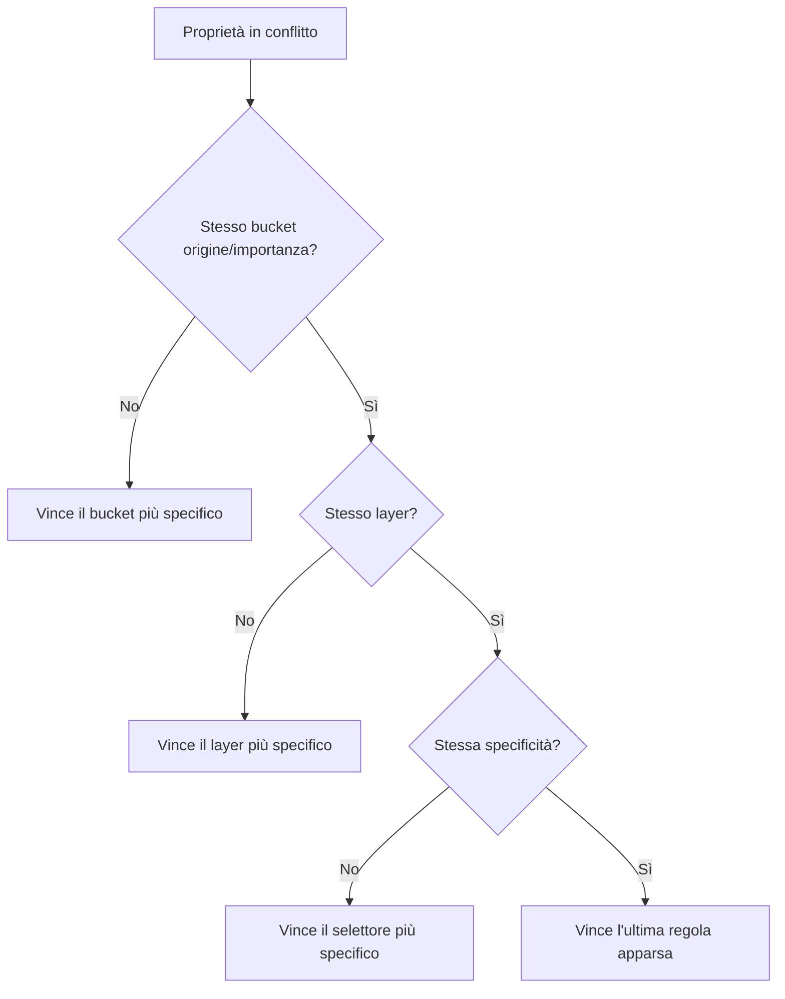

# Lezione 05 CSS: Cascading Style Sheets

## Ruolo del CSS nel web

- **HTML** si occupa della struttura e della semantica dei documenti: non dice nulla sull'aspetto (appearance) dei contenuti.
- Un elemento come `<em>` specifica solo che il contenuto va enfatizzato, non come: l'enfasi può essere resa con corsivo, colori o sfondi diversi.

> [!def] CSS
> Linguaggio **dichiarativo e basato su regole** che specifica come i documenti vengono presentati agli utenti.

- Un **stylesheet** è un insieme di **regole**; ogni regola è composta da un **selettore** (quali elementi HTML sono coinvolti) e da un blocco di **dichiarazioni** (coppie proprietà-valore che specificano lo stile da applicare).

```css
selector {
    property: value;
    property: value;
}
```

### Stili di default del browser (user agent styles)

- Il browser applica a ogni pagina dei suoi stili di base, detti **user agent styles**: titoli più grandi e in grassetto, `<p>` a capo riga, `<em>` in corsivo, `<strong>` in grassetto, `<a>` sottolineati e blu, `<ul>` con elenchi puntati, ecc.
- Questi default sono all'incirca uguali tra i vari browser, ma esistono alcune differenze.

## Includere stili in una pagina

- **`<link rel="stylesheet" href="...">`** nel `<head>`: collega un foglio di stile esterno; `rel` specifica la relazione con il documento collegato, `href` l'URL del foglio. Come per ``, il browser fa una richiesta HTTP aggiuntiva per recuperare il foglio prima del rendering.
- **`<style>`** nel `<head>`: definisce regole CSS direttamente dentro il documento HTML; è in genere preferibile usare fogli esterni e `<link>`.
- **Stili inline**: attributo `style` su un singolo elemento; il valore è una sequenza di dichiarazioni separate da `;` e vale solo per l'elemento che lo porta.

```html
<em style="color: fuchsia; font-weight: bold;">inline style</em>
```

## Selettori

> [!info] Usi dei selettori oltre allo stile
> I selettori CSS non servono solo per lo stile: con **JavaScript** selezionano gli elementi con cui interagire, nel **testing automatizzato** del web individuano gli elementi su cui agiscono i test, e nello **scraping/crawling** selezionano gli elementi che contengono le informazioni da estrarre.

### Selettori semplici

- **Selettore universale** (wildcard): `*`, corrisponde a qualsiasi elemento.
- **Selettore di tipo**: il nome del tag; corrisponde a tutti gli elementi di quel tipo (es. `a`).
- **Selettore di id**: forma `#ElementId`, corrisponde all'elemento con quell'attributo `id`.
- **Selettore di classe**: forma `.classname`, corrisponde agli elementi con quell'attributo `class` (un elemneto può avere più classi, limportante che siano separati da uno spazio `class=".classname1 classname2 ..."` ).
- **Selettore di attributo**: forma `[attribute]` o `[attribute='value']`, corrisponde agli elementi con quell'attributo (o con quel valore).

```css
[for] { background: yellow; }        /* tutti gli elementi con attributo for */
[type='number'] { background: cyan; } /* tutti gli elementi con type=number */
```

#### Operatori di corrispondenza parziale sui valori degli attributi

- `[attribute*='v']`: il valore **contiene** `v`.
- `[attribute^='v']`: il valore **inizia con** `v`.
- `[attribute$='v']`: il valore **termina con** `v`.

```css
[href^='https'] { color: red; }  /* inizia con https */
[href$='.it/']  { color: green; } /* termina con .it/ */
```

### Selettori composti (compound)

- Si **concatenano** selettori senza spazio per ottenere un controllo fine: la selezione è l'**intersezione** dei selettori coinvolti (es. `a[href*='programming'].my-class` corrisponde agli `a` il cui `href` contiene "programming" e che hanno la classe `my-class`).

### Combinatori

- I **combinatori** selezionano elementi in base alla loro posizione nel documento (un documento HTML è un albero); sintassi: `selector1 combinator selector2`.

| Combinatore | Nome | Semantica |
| --- | --- | --- |
| (spazio) | Selettore discendente | `A B` corrisponde a tutti gli elementi che soddisfano `B` contenuti (discendenti) in un elemento `A` |
| `>` | Selettore figlio | `A > B` corrisponde a tutti gli elementi `B` figli **diretti** di `A` |
| `+` | Selettore di fratelli adiacenti | `A + B` corrisponde agli elementi `B` fratelli **immediatamente successivi** a `A` |
| `~` | Selettore generale di fratelli | `A ~ B` corrisponde agli elementi `B` fratelli **successivi** (anche non adiacenti) a `A` |

```css
section em { color: teal; }        /* discendente */
main > em  { color: teal; }         /* figlio diretto */
.master + li { color: red; }        /* fratello adiacente */
.master ~ li.disciple { color: red; } /* fratelli successivi */
```

### Pseudo-classi

> [!def] Pseudo-classe
> I elementi HTML possono trovarsi in **stati** diversi (per interazione dell'utente o per relazione con altri elementi); le pseudo-classi, con sintassi che inizia con `:`, permettono di stilizzare gli elementi in base al loro stato.

- **Stati interattivi** (derivanti dall'interazione utente): `:hover` (puntatore del mouse sopra l'elemento), `:active` (elemento attivamente in interazione, es. pulsante premuto), `:focus` (elemento attualmente selezionato/fuocato, es. link o campo input).
- **Stati storici** (memorizzano i link visitati): `:link` (link non ancora visitati), `:visited` (link già visitati). Nota: gli stati storici non sono supportati nel Live Preview di VS Code; vanno verificati in un browser reale.
- **Stati dei form** (specifici dell'interazione con i form): `:disabled`, `:invalid`, `:checked`.
- **Stati di posizione** (relazioni con gli altri elementi tra fratelli, siblings):
	- `:first-child` e `:last-child`: primo/ultimo figlio tra un insieme di fratelli.
	- `:only-child`: elementi senza fratelli.
	- `:first-of-type` e `:last-of-type`: primo/ultimo fratello **considerando solo gli elementi dello stesso tipo**.
	- `:nth-child(n)` e `:nth-of-type(n)`: elemento in ennesima posizione tra i fratelli; accettano anche parole chiave come `even` e `odd`.

> [!warning] Indicizzazione
> In CSS l'indicizzazione parte da **1**, non da 0.

```css
em:last-of-type { color: red; }
li:nth-child(even) { color: red; }
li:nth-child(odd)  { color: blue; }
```

### Pseudo-elementi

> [!def] Pseudo-elemento
> Pseudo-elemento (sintassi `selector::pseudo-element`) che permette di mirare **parti specifiche del contenuto** di un elemento HTML, senza aggiungere markup HTML aggiuntivo.

- `::first-letter`: la prima lettera del contenuto di un elemento a livello di blocco (block-level).
- `::first-line`: la prima riga del contenuto di un elemento block-level.
- `::selection`: il contenuto attualmente selezionato dall'utente.
- `::before`: crea un elemento che è il **primo figlio** dell'elemento selezionato.
- `::after`: crea un elemento che è l'**ultimo figlio** dell'elemento selezionato.

```css
p::first-letter { font-weight: bold; }
.narrator::before {
    content: "Narrator >> ";
    font-weight: bold;
}
```

## La cascata (the cascade)

> [!def] La cascata
> Algoritmo usato per risolvere i **conflitti** quando due o più regole si applicano allo stesso elemento assegnando valori diversi alla stessa proprietà. Input: un insieme di proprietà conflittuali per un elemento; output: la singola proprietà (con valore) da applicare effettivamente.

- La cascata considera 4 aspetti chiave, in ordine: **origine e importanza**, **layers**, **specificità**, **posizione/ordine di apparizione** della regola.



### Origine e importanza

- Il CSS che scriviamo (**authored CSS**) non è l'unico applicato a una pagina: esistono gli **user agent styles** e altri stili (**local user styles**) aggiunti da estensioni del browser o dal sistema operativo, ad esempio per accessibilità (schemi a alto contrasto, font più grandi per ipovedenti).
- L'annotazione **`!important`**, aggiunta alla fine di una dichiarazione, conferisce più importanza a quella dichiarazione; l'importanza pesa in modo significativo nella cascata.

```css
h1 { color: red !important; }
```

- Gli origin bucket vanno dal **meno specifico al più specifico**; l'importanza (`!important`) crea ulteriori sotto-bucket all'interno di ciascuna origine.

![[Lezione 5-1791213829616.webp|452]]

### Layers

- Dentro ogni bucket origine/importanza possono esserci più **cascade layers**:
	- Negli stili authored si possono definire **layer personalizzati** con la regola `@layer`; i layer dichiarati **più tardi hanno priorità più alta**.
	- Tutto il CSS in `<style>` o importato con `<link>` appartiene a un **layer senza nome**.
	- Gli **stili inline** appartengono a un layer separato e hanno la **priorità più alta**.

![[Lezione 5-1791213863152.webp|351]]

### Specificità

> [!def] Specificità
> Una terna numerica **(A, B, C)** calcolata da un selettore: si ignora il selettore universale; **A** = numero di selettori di id; **B** = numero di selettori di classe, attributo e pseudo-classi; **C** = numero di selettori di tipo e pseudo-elementi.

- Il calcolo vale quando due regole in conflitto appartengono allo stesso bucket origine/importanza e allo stesso layer: **vince il selettore più specifico**.

| Selettore                              | Specificità (A, B, C) |
| -------------------------------------- | --------------------- |
| `*`                                    | (0, 0, 0)             |
| `a:hover`                              | (0, 1, 1)             |
| `article.item section p::first-letter` | (0, 1, 4)             |
| `em.master[target]`                    | (0, 2, 1)             |
| `#id`                                  | (1, 0, 0)             |
| `#navbar ul li a.nav-link[href*='/']`  | (1, 2, 3)             |

#### Confronto tra specificità

- Le tre componenti si confrontano **in ordine**: vince la specificità con A maggiore; a parità di A, quella con B maggiore; a parità anche di B, quella con C maggiore; se tutti i valori sono pari, le specificità sono **uguali** (pareggio).

| Selettore #1 | Spec. #1 | Selettore #2 | Spec. #2 | Vincitore |
| --- | --- | --- | --- | --- |
| `a[target]` | (0, 1, 1) | `.list a` | (0, 1, 1) | Pareggio |
| `#msg` | (1, 0, 0) | `input[type].inp` | (0, 2, 1) | #1 |
| `#nav > #brd a.lk` | (2, 1, 1) | `em.foo.bar.light` | (0, 3, 1) | #1 |
| `[id='nav'] a` | (0, 1, 1) | `#nav a` | (1, 0, 1) | #2 |

### Posizione e ordine di apparizione

- Se due regole appartengono allo stesso bucket origine/importanza, allo stesso layer e hanno la stessa specificità, **l'ultima regola apparsa ha la priorità più alta**.
- La regola vale sia dentro lo stesso stylesheet, sia in base all'ordine in cui i fogli di stile compaiono.

```css
h1 { color: red; }
h1 { color: blue; } /* vince blue */
```

## Ereditarietà (inheritance)

- Alcune proprietà CSS (**inheritable**) — ad esempio `color`, `font-size`, `font-family`, `font-weight`, `font-style` — vengono **ereditate dagli antenati** se all'elemento non è impostato un valore specifico.
- Le proprietà ereditate **non prendono parte alla cascata**: vengono considerate solo quando la cascata non ha prodotto alcun valore per quell'elemento; in un certo senso hanno la specificità più bassa di tutti i metodi di stilizzazione.

```css
p {
    font-family: sans-serif;
    color: red;
}
/* l'elemento <em> dentro <p> eredita color e font-family */
```

> [!info] Ispezione nel browser
> Negli strumenti di sviluppo (Dev Tools) gli user agent styles sono **nascosti per default**: per vederli occorre premere F1 e cambiare l'impostazione.
