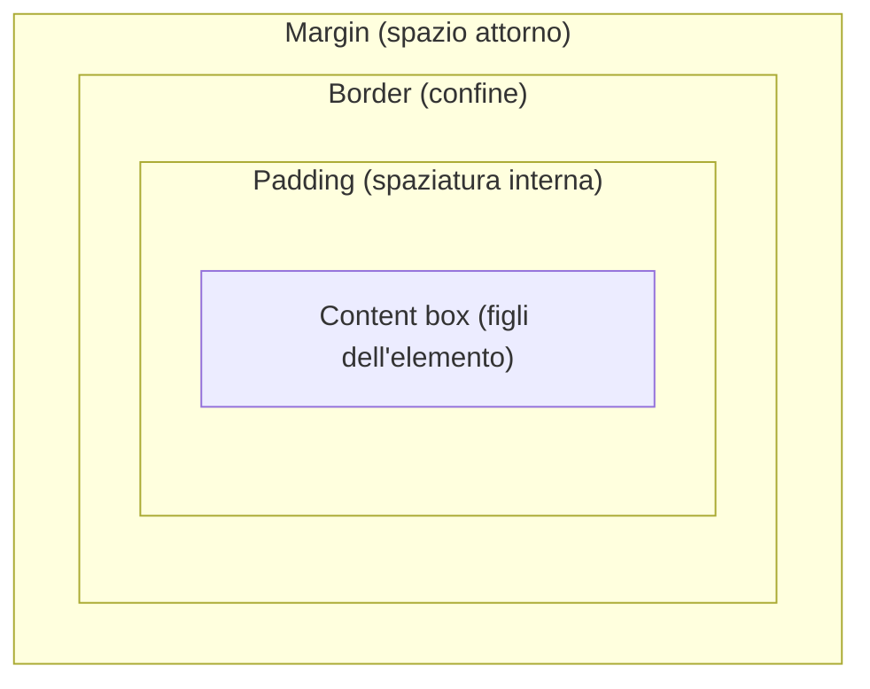
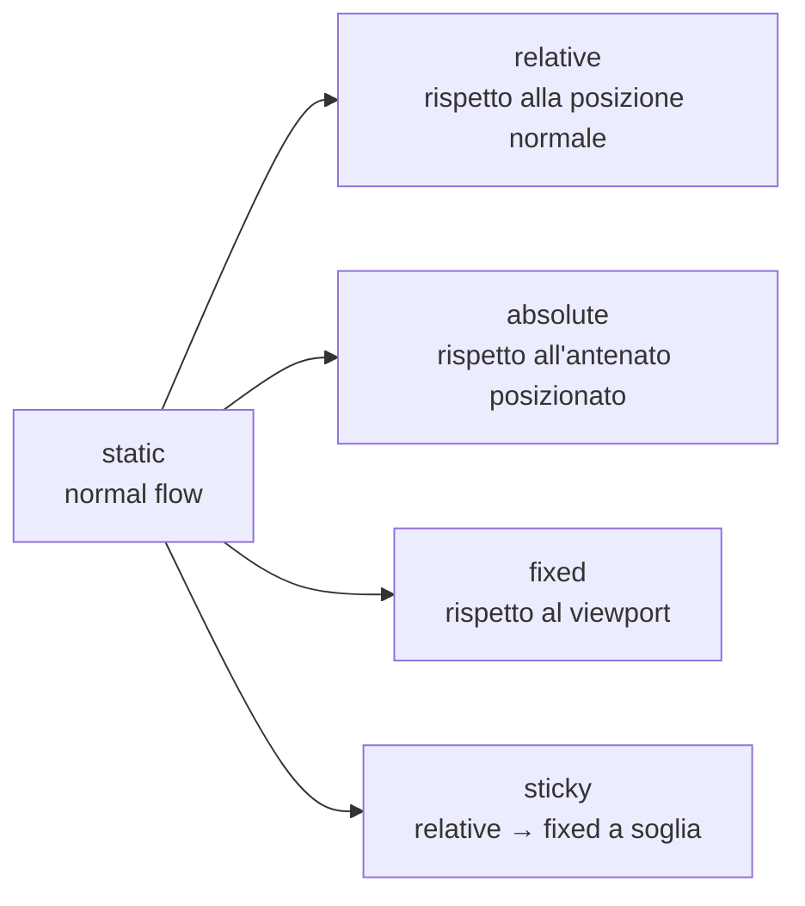
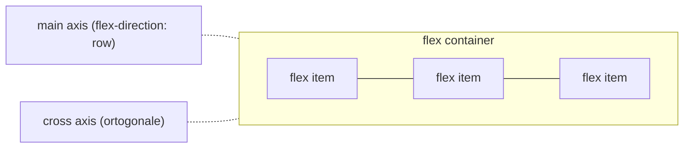
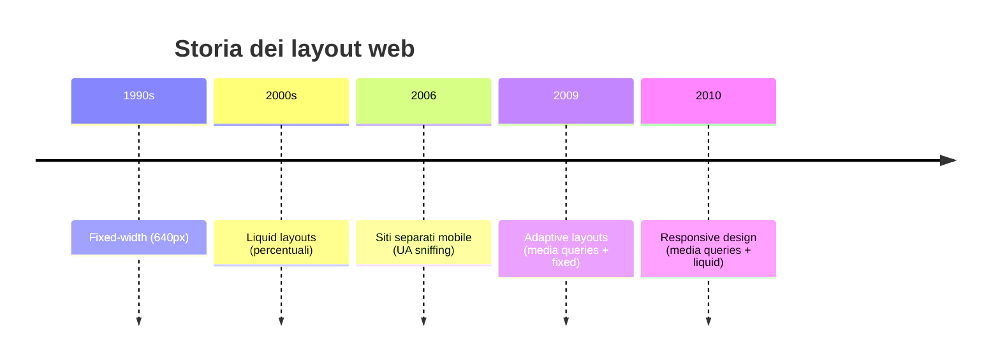
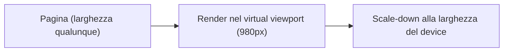

# Lezione 06 CSS: Layouts, Responsive Design

## Unità di misura (sizing units)

### Panoramica

- Alcune proprietà CSS cambiano la **dimensione** degli elementi: `width`, `height`, `font-size`, `margin`, `padding`, `border`, …
- Per dimensionare gli elementi si usano lunghezze **assolute** o lunghezze **relative** (dipendono da altre dimensioni: font o viewport).

### Unità assolute

- Le lunghezze assolute si definiscono con un numero e una delle **unità di lunghezza** supportate.

```css
div {
    width: 2.54cm;  /* centimetri */
    height: 1in;    /* pollici */
    border: 2mm solid black; /* millimetri */
    font-size: 24px; /* pixel */
}
```

### Percentuali

- Le **percentuali** definiscono dimensioni relative all'elemento **padre**.
- Si usano con molte proprietà: `width`, `height`, `font-size`, `margin`, `padding`, …

```css
.b { width: 50%; height: 50%; } /* 50% del padre */
```

### Unità relative al font

- **em**: `1em` rappresenta la dimensione di font corrente (`1.5em` è il 50% in più); il nome deriva storicamente dalla larghezza della "M" maiuscola in tipografia.
- **rem**: `1rem` rappresenta il `font-size` calcolato all'elemento **radice** (default 16px).

```css
p { font-size: 1.5rem; }
span { font-size: 1.5em; }
```

### Unità relative al viewport

> [!def] Viewport
> Il **viewport** è la finestra del browser.

- **vw**: `1vw` rappresenta l'1% della **larghezza** del viewport corrente.
- **vh**: `1vh` rappresenta l'1% dell'**altezza** del viewport corrente.

```css
div { height: 50vh; }
.b { width: 50vw; font-size: 10vw; }
```

## Il box model

> [!def] Box model
> Ogni elemento HTML è un **box** composto da aree distinte.

- **Content box**: l'area dove vivono i figli dell'elemento.
- **Padding**: spaziatura interna, separa il content box dal bordo.
- **Border**: il confine dell'elemento.
- **Margin**: crea spazio attorno agli elementi.



- La dimensione di ogni area si definisce con dichiarazioni CSS.
- Comportamento e aspetto dei box sono determinati da: **layout mode**, **contenuto** e **proprietà del box model**.
- Se il contenuto non entra nel box, la parte in eccesso si chiama **overflow**.

## Layout

### Flow layout (normal flow)

Per default i box sono visualizzati con il **flow layout** (a.k.a. **normal flow**). Esistono due tipi di elementi:
- **inline** si dispongono nella direzione inline, come parole in una frase.
- **block** si dispongono uno dopo l'altro, ognuno su una nuova riga dedicata.

### La proprietà display

- `display: inline` posiziona il box accanto al precedente nella direzione inline; **ignora** `width` e `height`.
- `display: block` posiziona il box su una nuova riga dedicata; se non specificato, i block si espandono su tutta la dimensione inline.
- `display: inline-block` è come `inline`, ma **permette** di impostare `width` e `height`.
- `display: none` rimuove completamente l'elemento dalla visualizzazione.

```css
em { display: inline-block; width: 50px; height: 50px; }
```

### Floats

- La proprietà `float` fa "galleggiare" un elemento nella direzione indicata, con i fratelli successivi che vi **scorrono attorno** (wrap).
- La proprietà `clear` impedisce a un fratello successivo di fare wrap attorno a un elemento flottante.

```css
img { float: left; margin-right: 1rem; }
p+p { clear: both; }
```

### Positioning

- La proprietà `position` cambia il comportamento dell'elemento nel normal flow.
- Il valore di default è **static**; gli altri valori sono `relative`, `absolute`, `fixed`, `sticky`.

- **relative**: l'elemento è posizionato rispetto alla sua posizione normale.
- **absolute**: l'elemento è posizionato rispetto all'**antenato posizionato più vicino** (nearest relative-positioned ancestor).
- **fixed**: l'elemento è posizionato rispetto al **viewport**.
- **sticky**: ibrido relative/fixed — relativo finché non supera una soglia (`top`, …), poi fixed finché non raggiunge il confine del proprio padre.



```css
nav { position: sticky; top: 0px; }
a  { position: fixed; bottom: 2rem; right: 2rem; }
```

## Layout moderni: Flexbox e Grid

- Oltre al normal flow, il CSS moderno ha due meccanismi di layout: **Flexbox** e **Grid**.
- **Flexbox** è pensato per layout **unidimensionali** (orizzontale o verticale).
- **Grid** è pensato per layout **bidimensionali**.

### Flexbox: flex container

- I flex container si dichiarano con `display: flex`; sono elementi block-level con figli **flex item**.
- Ogni container ha un **main axis** e un **cross axis** (ortogonale).
- Il main axis è impostato da `flex-direction` (default: `row`).



### Flexbox: flex items

I figli del container diventano **flex item** e si collocano lungo il main axis.
- **flex-grow**: fa espandere l'item in tutto lo spazio disponibile lungo il main axis.
- **flex-shrink**: controlla se l'item può ridurre la propria dimensione di base per stare nel container.

Gli overflow sono possibili e si controllano con `flex-wrap` sul container.

### Flexbox: gestione dello spazio libero

- **justify-content**: gestisce lo **spazio libero lungo il main axis**.
- **align-content**: gestisce lo **spazio libero lungo il cross axis**.
- Valori possibili includono: `flex-start`, `flex-end`, `center`, `space-between`, `space-around`.

```css
.container {
    display: flex;
    justify-content: space-around;
    align-items: center;
}
```

![[Lezione 6-1791220827473.png|390]]

### Grid

Grid è un layout **bidimensionale** basato su **righe e colonne**, si dichiarano con `display: grid`; i figli diretti sono **grid item**. Il container definisce **numero e dimensione** di righe e colonne (`grid-template-columns`, `grid-template-rows`, `gap`).
Per default gli item sono collocati lungo le righe; `grid-auto-flow: column` li colloca lungo le colonne.

```css
.container {
    display: grid;
    grid-template-columns: 1fr 100px;
    grid-template-rows: 20px 50px 100px;
    gap: 10px;
}
```

#### L'unità fr

**fr** è un'unità relativa specializzata che funziona solo nei grid layout. Rappresenta una lunghezza flessibile corrispondente a una quota dello spazio disponibile, in modo simile alla proprietà `flex`.
- Esempio: `grid-template-columns: 1fr 1fr 1fr` definisce tre colonne con la stessa quota di spazio.

#### Template areas

- Si possono assegnare nomi ad **aree** (insiemi di celle) con `grid-template-areas` e collocare item in un'area con `grid-area`.

```css
body {
    display: grid;
    grid-template-columns: 70vw 1fr;
    grid-template-areas:
      "header header"
      "navbar navbar"
      "main sidebar"
      "footer footer";
}
header { grid-area: header; }
aside  { grid-area: sidebar; }
```

## Media queries

> [!def] Media query
> Una media query applica stili CSS solo quando il **dispositivo** che visualizza il contenuto ha **caratteristiche specifiche**.

- Le media query si aprono con la keyword `@media`.

```css
@media print {
    body { color: black; background: transparent; }
}
```

### Tipi di output

- **print**: materiale paginato e documenti in anteprima di stampa.
- **screen**: dispositivi che visualizzano il documento su schermo.
- **all**: tutti i dispositivi di output.

### Media features

- Le **media features** verificano caratteristiche dello user-agent, del dispositivo di output o dell'ambiente.
- Sintassi completa: `@media media_type and (media_feature: value) and ...`.
- Se `media_type` è omesso si usa `all`; le feature vanno racchiuse tra parentesi e sono opzionali.

```css
@media screen and (orientation: landscape) { /* ... */ }
@media (min-width: 768px) { /* ... */ }
```

## Responsive design

### Fixed-width layouts

- Progettare per una singola larghezza specifica (640, 800, 1024px) si chiama **fixed-width design**.
- Funziona bene solo alla larghezza considerata: schermi più piccoli richiedono scrolling orizzontale, schermi più grandi mostrano molto spazio sprecato.

### Liquid (fluid) layouts

- I **liquid layouts** usano le **percentuali** come larghezza delle colonne, senza flexbox, grid o media queries.
- Reggono su un intervallo più ampio di larghezze, ma degradano agli estremi: **stretched** su schermi molto larghi, **squashed** su schermi molto stretti.

### Siti separati (mobile)

- Con l'arrivo dei dispositivi mobili (schermi fino a 240px) un'opzione era un **sito separato** per mobile.
- Tipicamente basato su **user agent sniffing** per reindirizzare gli utenti mobili a una versione su sottodominio.

> [!warning] Contro dei siti separati
> - Lo UA sniffing è inaffidabile (può mancare i mobile o reindirizzare i desktop).
> - Ogni sito separato va mantenuto.
> - La distinzione mobile/non-mobile oggi è sfumata.

### Adaptive layouts

- Con le media query (~2009), i designer passavano tra un **piccolo numero di design fixed-width** usando media query: è l'**adaptive design**.
- L'utente vede il layout più vicino alla dimensione del proprio browser; per le dimensioni intermedie il design non è ottimale.

```css
@media (max-width: 800px) { main { width: 400px; } }
@media (min-width: 800px) { main { width: 500px; } }
```

### Responsive layouts

- **Adaptive** = media queries + fixed-width; **responsive** = media queries + liquid layouts (termine coniato da Ethan Marcotte, 2010).
- Il responsive design è caratterizzato da: **container fluidi**, **media fluidi**, **media queries**.
- Layout e immagini di un sito responsive devono apparire ben resi su qualsiasi dispositivo.

```css
body { display: flex; flex-wrap: wrap; }
@media (min-width: 768px) { main { width: 70%; } aside { width: 20%; } }
img { width: 20%; min-width: 100px; }
```



### Viewport meta tag

- I primi browser mobili assumevano che i siti fossero progettati per uno schermo di **980px**.
- Rendering in un **virtual viewport** di 980px, poi **scalatura** della pagina alla larghezza reale dello schermo.



- Il meccanismo aiuta i siti non ottimizzati per mobile, ma **non funziona** per i siti mobile-optimized: le media query che scattano a 640px non si attivano mai a 980px.
- Il **meta tag viewport** permette di controllare il meccanismo; le pagine mobile-optimized dovrebbero includere in `<head>`:

```html
<meta name="viewport" content="width=device-width, initial-scale=1">
```

- `width=device-width`: assumere che la larghezza di progettazione sia la larghezza del device.
- `initial-scale=1`: nessuna scalatura.
