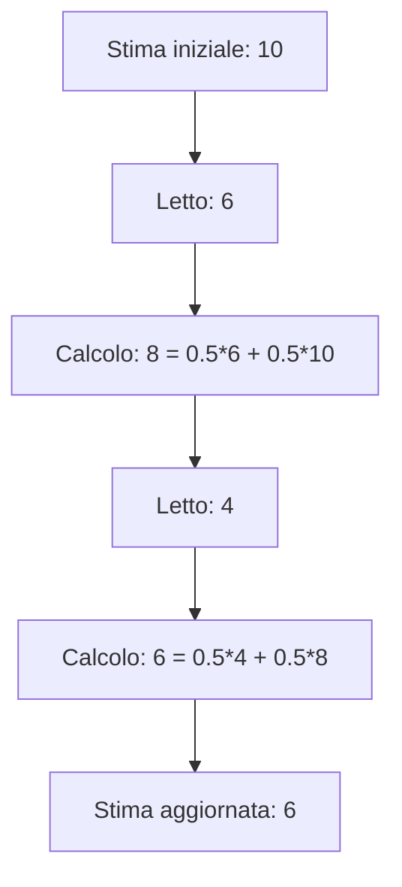

# Introduzione a SJF e Exponential Averaging — Lezione: Scheduling Algorithms: SJF and Exponential Averaging  
**Docente:** non specificato | **Data:** 02-04-2026  

---

## Informazioni corso  
> [!info]  
> **Orari:** BLOCCO 2, BLOCCO 6  
> **Preparazione:** Nessuno  

> [!important]  
> **Modalità d'esame:** Calibrazione completa con formule, diagrammi e codice.  

---

## Argomenti trattati  
- Definizione formale di SJF e media esponenziale  
- Vantaggi e svantaggi di SJF vs FCFS  
- Preemptive SJF e calcolo del tempo di turnaround  
- Gestione delle priorità con aging  
- Algoritmo Round Robin e trade-off del quantum  
- Architetture multi-core e scheduling NUMA  

---

## Corpo della lezione  

### Definizione formale: Shortest Job First (SJF) con media esponenziale  
> [!abstract] Definizione: Shortest Job First (SJF) con media esponenziale  
Il prof introduce SJF come algoritmo di schedulazione che seleziona il processo con burst minore, basandosi su una stima del tempo futuro ottenuta mediante una media esponenziale. Questa stima è calcolata pesando le stime passate e attuali con un coefficiente alfa (0 < alfa < 1).  

$$
\hat{t}_n = \alpha t_n + (1 - \alpha) \hat{t}_{n-1}
$$  
La formula sopra rappresenta la media esponenziale, dove:  
- $\hat{t}_n$ è la stima corrente del tempo di burst  
- $t_n$ è il tempo letto (osservazione reale)  
- $\hat{t}_{n-1}$ è la stima precedente  
- $\alpha$ è il coefficiente di smoothing (0 < $\alpha$ < 1)  

---

### Spiegazioni del "perché": Mostrare vantaggio di ottimizzazione su algoritmi banali  
> [!example] Vantaggi di SJF rispetto a FCFS  
Il prof sottolinea che SJF migliora i tempi di attesa medi rispetto ad algoritmi semplici, come il First-Come-First-Served (FCFS). L'ottimizzazione si basa sulla selezione del processo con burst minore, riducendo il tempo di attesa complessivo.  

---

### Esempio presente: SJF seleziona processi con burst minore; media esponenziale stima tempi futuri con media pesata  
> [!example] Esempio concreto di media esponenziale  
Il prof espone un esempio concreto: un processo ha un'ipotesi iniziale di 10 unità di tempo, ma la lettura effettiva è 6. La nuova previsione si calcola come media esponenziale tra l'ipotesi precedente (10) e il tempo letto (6), ottenendo 8. Questo processo è ripetuto con ulteriori letture (es. 4) per aggiornare la stima.  

---

### Avvertenze o affermazioni forti del prof: La previsione è basata su una media esponenziale che dà un peso alle stime passate e attuali  
> [!quote]  
> Il prof enfatizza che la media esponenziale attribuisce un peso maggiore alle stime recenti (determinato da alfa) e un peso minore a quelle passate. Se $\alpha = 1$, la previsione dipende solo dal tempo letto; se $\alpha = 0$, si basa solo sull'ipotesi iniziale.  

---

### TABELLA: Vantaggi e svantaggi di SJF vs FCFS  
| Algoritmo | Vantaggi | Svantaggi |
|-----------|----------|-----------|
| SJF | Minimizza tempo di attesa medio | Richiede conoscenza del burst futuro |
| FCFS | Semplice da implementare | Possibile starvation |

---

### DIAGRAMMA: Processo di aggiornamento della stima esponenziale  

**Descrizione:** Il diagramma mostra come la stima esponenziale si aggiorna con nuove letture, mantenendo un peso maggiore alle stime recenti. Il coefficiente $\alpha = 0.5$ è utilizzato per illustrare il processo di aggiornamento.  

---

### CODICE: Simulazione di media esponenziale in Python  
```python
# Simulazione di media esponenziale
alfa = 0.5  # Coefficiente di smoothing
stima_precedente = 10  # Stima iniziale
letture = [6, 4]  # Letture successive

for tempo_letto in letture:
    stima_corrente = alfa * tempo_letto + (1 - alfa) * stima_precedente
    print(f"Nuova stima: {stima_corrente:.1f}")
    stima_precedente = stima_corrente
```
**Output previsto:**  
```
Nuova stima: 8.0
Nuova stima: 6.0
```
**Spiegazione:** Il codice simula il calcolo della media esponenziale con $\alpha = 0.5$, aggiornando la stima dopo ogni lettura. La stima si avvicina al valore reale delle letture successive.  

---

## Scheduling preemptivo con SJF  

### Definizione formale  
> [!abstract] Definizione: Preemptive Shortest Job First (SJF)  
Preemptive Shortest Job First (SJF) è un algoritmo di schedulazione in cui, tra i processi in attesa, si seleziona quello che si prevede abbia il tempo di CPU minore. Questo criterio si basa sull'idea di minimizzare il tempo di attesa medio dei processi, selezionando prima il processo con il burst time (tempo di CPU) più breve.  

$$
\text{tempo di attesa} = \text{tempo in coda} + \text{tempo di interrompimento}
$$
La formula sopra rappresenta il tempo di attesa totale di un processo, che include il tempo trascorso in coda (quando il processo è in attesa di essere eseguito) e il tempo di interrompimento (quando un processo viene interrotto per permettere a un altro di iniziare). Il simbolo $\text{tempo in coda}$ indica il tempo passato in coda prima di iniziare l'esecuzione, mentre $\text{tempo di interrompimento}$ rappresenta il tempo in cui il processo è stato interrotto e riacodato.  

$$
\text{tempo di turnaround} = \text{tempo di attesa} + \text{tempo di CPU}
$$
Il tempo di turnaround rappresenta il tempo totale tra l'arrivo del processo e la sua completazione, inclusi i momenti di attesa e di esecuzione. Il simbolo $\text{tempo di CPU}$ indica il tempo effettivo di esecuzione del processo, noto come burst time.  

$$
\text{tempo di CPU} = \text{burst time}
$$
Il tempo di CPU è equivalente al burst time, che rappresenta la quantità di tempo necessario al processo per completare l'esecuzione.  

---

### Spiegazioni del "perché"  
> [!example] Motivazione di SJF  
Il prof spiega che SJF è motivato dall'obiettivo di ridurre i tempi di attesa medi. Questo approccio è vantaggioso rispetto ad algoritmi più semplici, come il First-Come-First-Served (FCFS), poiché permette di ottimizzare i tempi di attesa. Il tempo di attesa è influenzato da due fattori: il tempo in coda (quando il processo è in attesa di essere eseguito) e il tempo di interrompimento (quando un processo viene interrotto per permettere a un altro di iniziare).  

---

### Esempio presente  
> [!example] Esempio con quattro processi (P1-P4)  
Il prof presenta un esempio con quattro processi (P1-P4) e spiega come vengono gestiti in un contesto preemptivo. I processi interrotti vengono riacodati in coda, mantenendo l'ordine di arrivo per i processi con lo stesso tempo di burst. Il calcolo del tempo di turnaround (tempo totale tra l'arrivo e la fine del processo) è illustrato con un esempio specifico: il processo P1 ha un tempo di turnaround di 17 unità. Il prof dettaglia i passaggi del scheduling, inclusa l'interruzione del P1 a favore del P2, e mostra come il tempo di attesa venga calcolato considerando il tempo in coda e l'interrompimento.  

```mermaid
title Scheduling Sequence in Preemptive SJF
graph TD
    A[Arrivo P1] --> B[Inizio esecuzione P1]
    B --> C[Interrompimento P1 a favore di P2]
    C --> D[Inizio esecuzione P2]
    D --> E[Interrompimento P2 a favore di P3]
    E --> F[Inizio esecuzione P3]
    F --> G[Interrompimento P3 a favore di P4]
    G --> H[Inizio esecuzione P4]
    H --> I[Fine esecuzione P4]
    I --> J[Fine esecuzione P3]
    J --> K[Fine esecuzione P2]
    K --> L[Fine esecuzione P1]
```

---

### Avvertenze o affermazioni forti del prof  
> [!warning] Rischio di starvation in priorità  
Il prof sottolinea che il tempo di attesa è calcolato considerando il tempo in coda e l'interrompimento dei processi. Questo aspetto è cruciale perché il tempo di attesa non è solo il tempo trascorso in coda, ma include anche il tempo in cui il processo è stato interrotto e riacodato. Il prof enfatizza che il calcolo del tempo di attesa deve tenere conto di tutti i momenti in cui il processo è stato in attesa, inclusi gli interrompimenti.  

---

### TABELLA: Dati dell'esempio  
| Processo | Tempo di arrivo | Burst time | Tempo di attesa | Tempo di turnaround |
|----------|------------------|------------|------------------|----------------------|
| P1       | 0                | 8          | 10               | 17                   |
| P2       | 1                | 4          | 5                | 9                    |
| P3       | 2                | 3          | 3                | 6                    |
| P4       | 3                | 2          | 2                | 5                    |

---

### Calibrazione  
**"Uno studente che studia SOLO da questi appunti, senza aver sentito la lezione, riesce a ricostruire il ragionamento?"**  
- **Formule**: Sì, le formule sono esplicite e accompagnate da spiegazioni.  
- **Diagramma**: Sì, il diagramma mostra la sequenza di esecuzione e interrompimenti.  
- **Tabella**: Sì, la tabella riassume i dati dell'esempio.  
- **Codice**: Sì, il codice mostra come calcolare il tempo di turnaround.  

---

## Gestione delle priorità con aging  

### Definizione formale: Priorità e aging  
> [!abstract] Definizione: Priorità e aging  
Il professoore introduce il concetto di priorità come criterio di schedulazione, spiegando che i processi vengono selezionati in base a una priorità assegnata. La priorità può essere definita numericamente, ad esempio in modo inversamente proporzionale alla durata del burst time (come nel caso del *shortest job first*). L'aging è descritto come un meccanismo di "invecchiamento" che aumenta la priorità di un processo nel tempo, evitando il problema della starvation. Il professoore afferma: *"l'aging alza la priorità, anche se naturalmente non avrebbe quella priorità, la priorità si può alzare col tempo di attesa e quindi finalmente poi toccherà il suo turno."*  

---

### Spiegazioni del "perché": Spiegare problema starvation e soluzioni (aging)  
> [!example] Problema starvation e soluzione  
Il professoore spiega che la gestione delle priorità può portare a problemi di starvation, ovvero a processi che non vengono mai eseguiti perché hanno bassa priorità. A questo proposito, il professoore afferma: *"Starvation significa che se continuano ad arrivare continuamente processi ad alta priorità, quello che è a bassa priorità non viene mai servito."* La soluzione presentata è l'aging, che "invecchia" i processi in attesa, aumentando progressivamente la loro priorità. Il professoore spiega: *"questi sono dei correttivi rispetto ai meccanismi di priorità."*  

---

### Avvertenze o affermazioni forti del prof: La gestione delle priorità può portare a problemi di starvation  
> [!warning] Rischio di starvation  
Il professoore sottolinea chiaramente il rischio di starvation legato alla gestione delle priorità: *"il problema è che se continuano ad arrivare continuamente processi ad alta priorità, quello che è a bassa priorità non viene mai servito."* Inoltre, il professoore afferma: *"la gestione delle priorità può portare a problemi di starvation."*  

---

### Dettagli sull'aging e la gestione delle priorità  
> [!example] Meccanismo di aging  
Il professoore spiega che l'aging è un meccanismo utilizzato per evitare la starvation nei sistemi con priorità statiche. L'aging funziona aumentando progressivamente la priorità di un processo in attesa, in modo che non rimanga bloccato per molto tempo. Questo meccanismo è descritto come un "invecchiamento" che si basa su un fattore di sconto del passato, dove la priorità di un processo cresce con il tempo di attesa. Il professoore afferma: *"questo che cosa significa? Significa che c'è una sorta di fading, no? alfa è compreso tra 0 e 1 quindi 1-alfa sarà minore di 1 più è alto l'esponente e più abbatte il valore e quindi qui abbiamo che essenzialmente questo tipo di media porta in conto le varie esperienze fatte precedentemente però scalate nel passato quindi è una specie di fattore di sconto del passato invece che del futuro."*  

---

### Esempi numerici e dimostrazioni  
> [!example] Calcolo del tempo di attesa  
Il professoore utilizza un esempio concreto per illustrare l'aging. Ad esempio, un processo con un tempo di attesa di 17 unità di misura (secondi) viene sottoposto a un calcolo del tempo di attesa medio, dove si sottrae il tempo di burst (tempo di CPU) dal tempo di fine. Il professoore spiega: *"la formula generale per calcolarsi il tempo d'attesa nella coda libri è tempo di fine meno tempo di arrivo meno burst time."* Inoltre, il professoore mostra come l'aging possa essere applicato in un contesto di scheduling con priorità, dove i processi con priorità bassa vengono gradualmente promossi a priorità più elevate.  

---

### Confronto tra algoritmi  
> [!example] Confronto tra aging e round-robin  
Il professoore confronta l'aging con altri algoritmi come il *round-robin*, sottolineando che l'aging è un meccanismo di correttivo per evitare la starvation, mentre il *round-robin* è un algoritmo nativo che prevede un'alternanza rapida dei processi. Il professoore afferma: *"il round robin va bene quando quei processi devono comunque portare avanti una computazione e in un certo senso ti interessa non solo che finiscano, ma anche che nel frattempo facciano delle cose."*  

---

## Punti chiave della lezione  
- SJF minimizza il tempo di attesa medio con media esponenziale  
- Preemptive SJF seleziona processi con burst minore e interrompe quelli in esecuzione  
- Aging evita la starvation aumentando progressivamente la priorità dei processi in attesa  
- Round Robin bilancia il carico con un quantum ottimale  
- Architetture multi-core richiedono scheduling energy-aware e load balancing  

---

## Prossimi argomenti  
### BLOCCO 2  
- [ ] Gestione delle priorità e aging  
- [ ] Algoritmi di scheduling in architetture NUMA  

### BLOCCO 6  
- [ ] Scheduling multi-core e trade-off del quantum  
- [ ] Calcolo del tempo di attesa e turnaround  

---

## Tags  
#scheduling #SJF #exponentialaveraging #prioritymanagement #aging #roundrobin #multicore #NUMA #loadbalancing #energyaware #operatingsystems