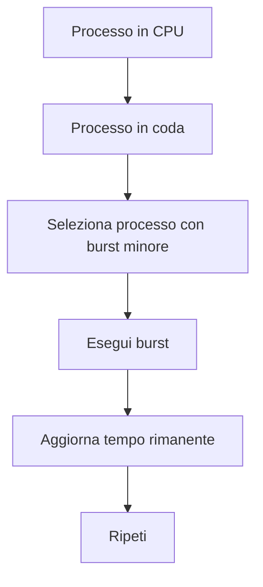
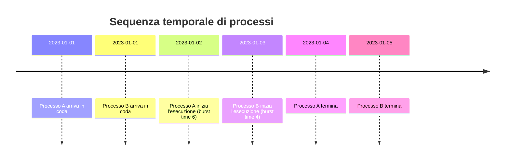
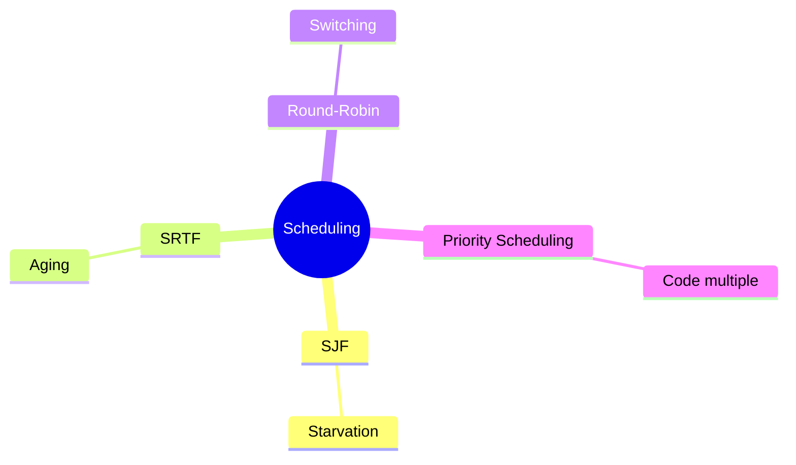
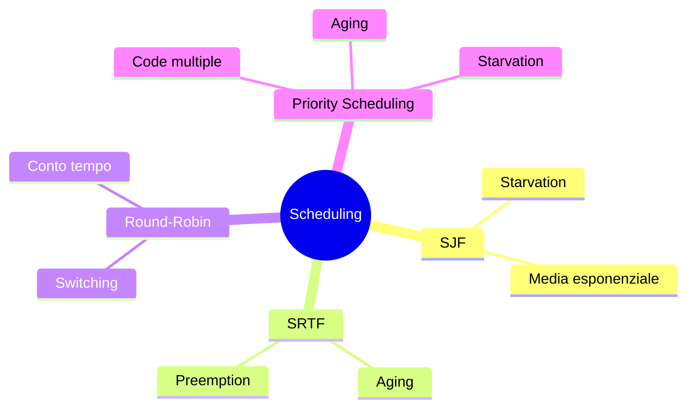

# Introduzione al problema di scheduling — Lezione: Riduzione del tempo di attesa

**Docente:** non specificato | **Data:** 02-04-2026

## Argomenti trattati
- Definizione formale del tempo di attesa
- Spiegazione dell'importanza della riduzione del tempo di attesa
- Dimostrazioni formali e esempi numerici
- Avvertenze e affermazioni forti
- Scheduling preemptivo (SRTF)
- Calcolo tempo di attesa e turnaround time
- Priorità e starvation
- Round Robin e quantum
- Scheduling con code multiple e feedback
- Sistemi multi-core e NUMA
- Esercizi e confronto algoritmi

## Definizione formale
> [!abstract] Definizione: Tempo di attesa  
Il tempo di attesa è un aspetto critico nella gestione dei processi, migliorarlo è fondamentale per l'efficienza del sistema operativo. Il calcolo del tempo di attesa è dato dalla formula:
$$ \text{tempo\_di\_attesa} = \text{tempo\_di\_fine} - \text{tempo\_di\_arrivo} - \text{burst\_time} $$

## Spiegazione del "perché"
Il prof spiega l'importanza di ridurre il tempo di attesa medio attraverso ottimizzazioni. Ad esempio, scegliere prima il processo che durerà di meno per minimizzare appunto il tempo di attesa medio.

> [!quote]  
"Mostra l'importanza del ridurre il tempo di attesa medio attraverso ottimizzazioni."

## Dimostrazioni formali
Il prof introduce un criterio di schedulazione basato sul *shortest job first* (SJF), spiegando che si seleziona il processo con il tempo di CPU minore.

> [!example] Esempio SJF  
Scegliamo n0 come massimo perché... selezionare il processo che si prevede che abbia il burst minore quindi che abbia un tempo di CPU minore.

**[DIAGRAMMA flowchart: SRTF (Shortest Remaining Time First)]**

**Descrizione:** Questo diagramma mostra il flusso di esecuzione in un sistema con scheduling preemptivo. Il processo in CPU viene interrotto se arriva un processo con tempo rimanente minore.

## Esempi numerici
Il prof presenta un esempio con un processo che ha un tempo di CPU stimato a 6 unità di misura (secondi, millisecondi, ecc.).

> [!example] Media esponenziale  
Se mettiamo alfa 1 vuol dire che la previsione sarà basata solo sul tempo passato appena letto, che è il futuro, se invece mettiamo qui è A, alfa qui è 0, ci basiamo solo sull'ipotesi iniziale.

**[DIAGRAMMA timeline: Sequenza temporale di processi]**

**Descrizione:** Questo diagramma mostra come il tempo di attesa si calcola in base al momento di arrivo e al tempo di esecuzione. Il processo B, con burst time minore, inizia l'esecuzione prima del processo A.

## Avvertenze
Il prof sottolinea che "bisogna avere una stima del tempo futuro" e che "se non si conoscono i tempi di computazione, bisogna appunto stimarli sulla base di una sorta di statistica".

**[DIAGRAMMA mindmap: Scheduling]**

## Affermazioni forti
Il prof enfatizza l'importanza del *shortest remaining time first* (SRTF) come metodo preemptivo: "questo significa fare la prelazione. Cioè nel momento in cui può sostituire, vuol dire che può sostituire il processo attualmente in CPU con un altro".

## Backtracking e correzioni
Il prof corregge un calcolo iniziale, spiegando che "la formula generale per calcolarsi il tempo d'attesa nella coda libri è tempo di fine meno tempo di arrivo meno burst time".

## Conclusione
Il prof conclude con un esempio di *priority scheduling* con code multiple e meccanismi di *aging* per evitare la starvation: "questo è un esempio di code multiple dove uno può definire dei processi, per esempio, ad altissima priorità come quelli di sistema, poi possiamo avere i processi interattivi che vogliono avere soddisfazione immediata".

**[DIAGRAMMA mindmap: Scheduling con dettagli]**

## Prossimi argomenti
- Introduzione a contesti avanzati di scheduling in sistemi multicore, affinità e load balancing.

## Tags
#scheduling #tempo_di_attesa #SJF #SRTF #round_robin #priorità #starvation