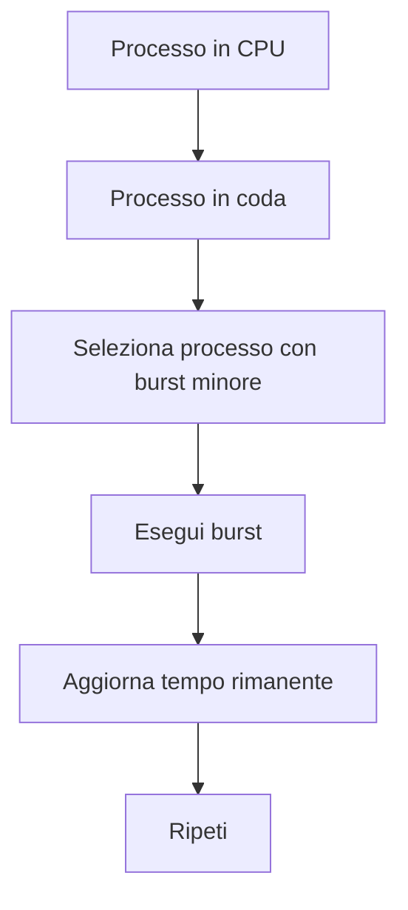
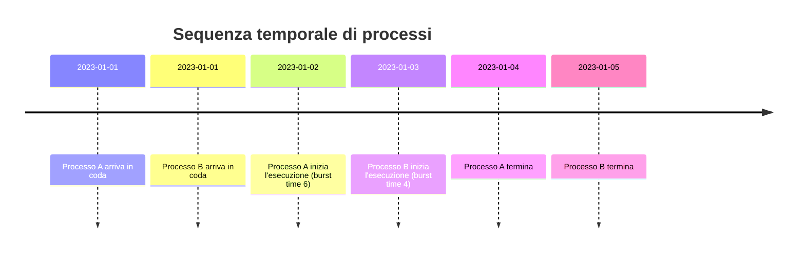
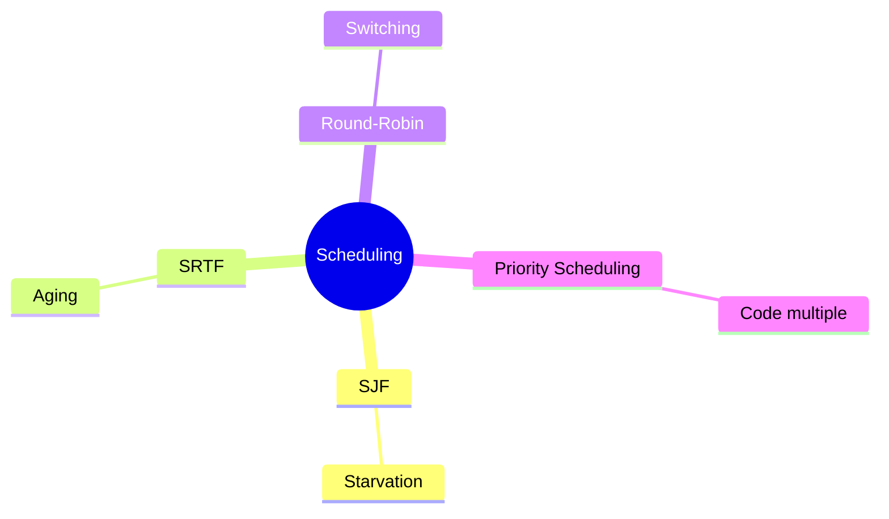

# Introduzione al problema di scheduling — Lezione: Tempo di attesa e ottimizzazione

**Docente:** non specificato | **Data:** 02-04-2026

## Argomenti trattati
- Definizione formale del tempo di attesa
- Importanza della riduzione del tempo di attesa medio attraverso ottimizzazioni
- Dimostrazioni formali e esempi numerici
- Avvertenze sulle problematiche di starvation e stime future
- Affermazioni forti sull'importanza dei metodi preemptivi come SRTF
- Estensione di SJF con media esponenziale
- Scheduling preemptivo (SRTF)
- Calcolo tempo di attesa e turnaround time
- Priorità e starvation
- Round Robin e quantum
- Scheduling con code multiple e feedback
- Sistemi multi-core e NUMA
- Esercizi e confronto algoritmi

## Definizione formale
Il tempo di attesa è un aspetto critico nella gestione dei processi, migliorarlo è fondamentale per l'efficienza del sistema operativo.  
> [!abstract] **Definizione:** Tempo di attesa  
**tempo_di_attesa = tempo_di_fine - tempo_di_arrivo - burst_time**

## Spiegazione del "perché"
Mostra l'importanza del ridurre il tempo di attesa medio attraverso ottimizzazioni.  
> [!quote] **Affermazione forte:**  
"Se vogliamo minimizzare appunto il tempo di attesa medio possiamo appunto selezionare prima il processo che durerà di meno e così via."

## Dimostrazioni formali
Il prof introduce un criterio di schedulazione basato sul *shortest job first* (SJF), spiegando che si seleziona il processo con il tempo di CPU minore.  
> [!example] **Esempio:**  
"Scegliamo n0 come massimo perché... selezionare il processo che si prevede che abbia il burst minore quindi che abbia un tempo di CPU minore".  

**[DIAGRAMMA flowchart: SRTF (Shortest Remaining Time First)]**

**Descrizione:** Questo diagramma mostra il flusso di esecuzione in un sistema con scheduling preemptivo. Il processo in CPU viene interrotto se arriva un processo con tempo rimanente minore.

## Esempi numerici
- Il prof presenta un esempio con un processo che ha un tempo di CPU stimato a 6 unità di misura (secondi, millisecondi, ecc.).  
- Si descrive un algoritmo di previsione basato su una *media esponenziale*, con un esempio numerico: "se mettiamo alfa 1 vuol dire che la previsione sarà basata solo sul tempo passato appena letto, che è il futuro, se invece mettiamo qui è A, alfa qui è 0, ci basiamo solo sull'ipotesi iniziale".  
- Si mostra un esempio concretizzato: "si parte per esempio con, per un processo, un'ipotesi di durata del CPU fast di questo processo di 10, ma poi si va a leggere 6, allora si fa diciamo 10 più 6, 16, diviso 2, 8, e questa sarà la mia guess per il tempo successivo".  

**[DIAGRAMMA timeline: Sequenza temporale di processi]**  

**Descrizione:** Questo diagramma mostra come il tempo di attesa si calcola in base al momento di arrivo e al tempo di esecuzione. Il processo B, con burst time minore, inizia l'esecuzione prima del processo A.

## Avvertenze
- Il prof sottolinea che "bisogna avere una stima del tempo futuro" e che "se non si conoscono i tempi di computazione, bisogna appunto stimarli sulla base di una sorta di statistica".  
- Viene menzionato un problema di *starvation* (processi bloccati a causa di priorità elevate): "Starvation significa che se continuano ad arrivare continuamente processi ad alta priorità, quello che è a bassa priorità non viene mai servito".  

**[DIAGRAMMA mindmap: Scheduling]**  

**Descrizione:** Questo mindmap organizza i diversi algoritmi di scheduling e i loro aspetti critici. Il *priority scheduling* con code multiple è un esempio di come gestire la starvation attraverso il meccanismo di *aging*.  

## Affermazioni forti
- Il prof enfatizza l'importanza del *shortest remaining time first* (SRTF) come metodo preemptivo: "questo significa fare la prelazione. Cioè nel momento in cui può sostituire, vuol dire che può sostituire il processo attualmente in CPU con un altro".  
- Viene sottolineato il vantaggio del *round-robin* rispetto ad algoritmi non preemptivi: "round robin non è gratis, perché appunto così come ogni prelazione non è gratis, c'è il tempo di conto e switch".

## Calcolo tempo di attesa e turnaround time
La formula per calcolare il tempo di attesa è definita come:
$$
\text{tempo\_di\_attesa} = \text{tempo\_di\_fine} - \text{tempo\_di\_arrivo} - \text{burst\_time}
$$

## Priorità e starvation
- **Definizione formale:** Priorità numeriche (Linux) e meccanismi di invecchiamento per risolvere starvation.  
  Il prof spiega che in Linux le priorità sono numeriche, dove il numero più basso indica una priorità più alta.

## Round Robin e quantum
- **Definizione formale:** Quantum calibrato per bilanciare efficienza e overhead di contest switch.
- **Spiegazione del "perché":** Spiega trade-off tra quantum e overhead di contest switch.  
  Il prof sottolinea che il quantum deve essere scelto in modo che non sia né troppo grande né troppo piccolo.

## Scheduling con code multiple e feedback
Il prof presenta un esempio dettagliato di scheduling con code multiple, dove i processi vengono spostati tra code in base al loro tempo di attesa e alla priorità. Ad esempio, il processo P1 (foreground) viene promosso in coda di priorità 0, mentre i processi in background (P2, P3, P4, P5) vengono gestiti in code con priorità diverse.

## Sistemi multi-core e NUMA
Il prof introduce il concetto di scheduling in contesti multi-core, enfatizzando l'importanza dell'affinità (la preferenza per un core specifico) e del load balancing (bilanciamento del carico tra core).

## Esercizi e confronto algoritmi
### **SJF preemptive**
- **P1:** burst time 6, tempo di attesa 17
- **P2:** burst time 4, tempo di attesa 0
- **P3:** burst time 9, tempo di attesa 14
- **P4:** burst time 5, tempo di attesa 2

### **Round Robin (quanto 4)**
- **Gantt chart:** A (0-3), B (3-7), C (7-11), D (11-15), E (15-19)
- **Tempo di attesa per P1:** 17
- **Tempo di attesa per P2:** 15
- **Tempo di attesa per P3:** 14
- **Tempo di attesa per P4:** 19

## Riepilogo
> [!summary] **Punti chiave della lezione**
1. Definizione formale del tempo di attesa e calcolo.
2. Importanza dell'ottimizzazione del tempo di attesa medio.
3. Dimostrazioni formali e esempi numerici per SJF e SRTF.
4. Avvertenze sulle problematiche di starvation e stime future.
5. Affermazioni forti sull'importanza dei metodi preemptivi come SRTF.
6. Estensione di SJF con media esponenziale.
7. Calcolo tempo di attesa e turnaround time.
8. Priorità e starvation.
9. Round Robin e quantum.
10. Scheduling con code multiple e feedback.

## Prossimi argomenti
- [ ] Introduzione a contesti avanzati di scheduling in sistemi multicore, affinità e load balancing.
- [ ] Esercizi e confronto algoritmi di scheduling.

# Tags
#scheduling #tempo_di_attesa #ottimizzazione #SJF #SRTF #starvation #round_robin #quantum #code_multiple