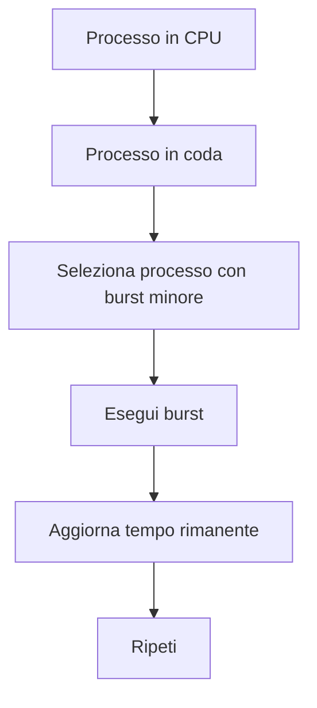
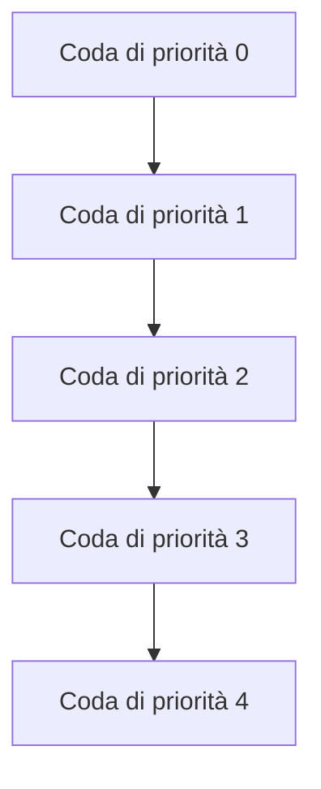

# Introduzione al problema di scheduling — Lezione: Tempo di attesa e ottimizzazione

**Docente:** non specificato | **Data:** 02-04-2026

## Argomenti trattati
- Definizione formale del tempo di attesa
- Spiegazione dell'importanza di ridurre il tempo di attesa medio attraverso ottimizzazioni
- Dimostrazioni formali e esempi numerici per il criterio shortest job first (SJF)
- Avvertenze sulle potenziali problematiche come la starvation
- Affermazioni forti del prof su metodi preemptivi e non preemptivi
- Estensione di SJF con media esponenziale
- Scheduling preemptivo (Shortest Remaining Time First - SRTF)
- Calcolo tempo di attesa e turnaround time
- Priorità e starvation
- Round Robin e quantum
- Scheduling con code multiple e feedback
- Sistemi multi-core e NUMA
- Esercizi e confronto algoritmi

## Definizione formale
Il tempo di attesa è un aspetto critico nella gestione dei processi, migliorarlo è fondamentale per l'efficienza del sistema operativo.  
> [!abstract] **Definizione:** Tempo di attesa  
**tempo_di_attesa = tempo_di_fine - tempo_di_arrivo - burst_time**

## Spiegazione del "perché"
Mostra l'importanza del ridurre il tempo di attesa medio attraverso ottimizzazioni.  
> [!quote] **Affermazione forte:**  
"Se vogliamo minimizzare appunto il tempo di attesa medio possiamo appunto selezionare prima il processo che durerà di meno e così via."

## Dimostrazioni formali
Il prof introduce un criterio di schedulazione basato sul *shortest job first* (SJF), spiegando che si seleziona il processo con il tempo di CPU minore.  
> [!example] **Esempio numerico SJF**  
Si parte per esempio con, per un processo, un'ipotesi di durata del CPU fast di questo processo di 10, ma poi si va a leggere 6, allora si fa diciamo 10 più 6, 16, diviso 2, 8, e questa sarà la mia guess per il tempo successivo.

**[DIAGRAMMA flowchart: SRTF (Shortest Remaining Time First)]**

**Descrizione:** Questo diagramma mostra il flusso di esecuzione in un sistema con scheduling preemptivo. Il processo in CPU viene interrotto se arriva un processo con tempo rimanente minore.

## Avvertenze
- Il prof sottolinea che "bisogna avere una stima del tempo futuro" e che "se non si conoscono i tempi di computazione, bisogna appunto stimarli sulla base di una sorta di statistica".  
> [!warning] **Avvertenza:**  
Starvation significa che se continuano ad arrivare continuamente processi ad alta priorità, quello che è a bassa priorità non viene mai servito.

## Affermazioni forti
- Il prof enfatizza l'importanza del *shortest remaining time first* (SRTF) come metodo preemptivo: "questo significa fare la prelazione. Cioè nel momento in cui può sostituire, vuol dire che può sostituire il processo attualmente in CPU con un altro".  
> [!quote] **Affermazione forte:**  
"Round robin non è gratis, perché appunto così come ogni prelazione non è gratis, c'è il tempo di conto e switch".

## Estensione di SJF con exponential averaging
- Il prof spiega che per aggiornare le previsioni sui tempi futuri si utilizza una media esponenziale, dove α è un peso tra 0 e 1. Se α è 1, la previsione è basata solo sul tempo letto recentemente (il futuro), mentre se α è 0, si basa solo sull'ipotesi iniziale.
> [!abstract] **Definizione:** Formula con α e 1-α per aggiornare previsioni su tempi futuri  
$$
\text{new\_prediction} = \alpha \cdot \text{current\_value} + (1 - \alpha) \cdot \text{previous\_prediction}
$$

## Scheduling preemptivo (Shortest Remaining Time First)
- Il prof illustra un esempio dettagliato in cui si applica l'algoritmo Shortest Remaining Time First (SRTF). I processi P1, P2, P3 e P4 arrivano rispettivamente al tempo 0, 1, 2 e 3. Al tempo 1, P2 arriva e interrompe P1 perché ha un tempo rimanente minore (4 vs 7).
> [!example] **Esempio presente:** Esempio con interruzione di processo e priorità al tempo rimanente  
**Passaggi esplicativi:**
- Al tempo 1, P2 arriva e interrompe P1 perché ha un tempo rimanente minore (4 vs 7).
- Al tempo 2, P3 arriva e interrompe P2 perché ha un tempo rimanente minore (9 vs 3).

## Calcolo tempo di attesa e turnaround time
La formula per calcolare il tempo di attesa è definita come:  
$$
\text{tempo\_di\_attesa} = \text{tempo\_di\_fine} - \text{tempo\_di\_arrivo} - \text{burst\_time}
$$

## Priorità e starvation
- Il prof spiega che in Linux le priorità sono numeriche, dove il numero più basso indica una priorità più alta. Ad esempio, un processo con priorità 1 ha maggiore priorità rispetto a uno con priorità 2.
> [!warning] **Avvertenza:**  
Se continuano ad arrivare processi ad alta priorità, quelli a bassa priorità potrebbero rimanere in attesa indefinita.

## Round Robin e quantum
- Il prof spiega che il quantum deve essere calibrato in modo che non sia né troppo grande né troppo piccolo. Se il quantum è grande, il processo non richiede contest switch, ma potrebbe non completare il suo tempo di CPU in un'unica esecuzione.
> [!tip] **Consiglio:**  
Il tempo di contest switch deve essere inferiore al 10% del quantum.

## Scheduling con code multiple e feedback
- Il prof presenta un esempio dettagliato di scheduling con code multiple, dove i processi vengono spostati tra code in base al loro tempo di attesa e alla priorità.
> [!example] **Esempio presente:** Code multiple con feedback  

## Sistemi multi-core e NUMA
- Il prof introduce il concetto di scheduling in contesti multi-core, enfatizzando l'importanza dell'affinità (la preferenza per un core specifico) e del load balancing.
> [!quote] **Affermazione forte:**  
La gestione delle code multiple permette quindi di bilanciare la priorità e il tempo di attesa, evitando che alcuni processi siano ignorati.

## Esercizi e confronto algoritmi
Il prof illustra un esempio dettagliato con quattro processi (P1, P2, P3, P4) e i loro tempi di burst. Si descrive come il scheduler seleziona il processo con il tempo di CPU minore (SJF preemptive), mostrando il Gantt chart e i tempi di attesa.
> [!example] **Esempio presente:** Analisi di scenari con SJF, Round Robin e priorità  
$$
\text{Tempo di attesa medio} = \frac{\sum (\text{Tempo di fine} - \text{Tempo di arrivo} - \text{Burst time})}{N}
$$

## Punti chiave della lezione
> [!summary] **Punti chiave:**
1. Definizione e calcolo del tempo di attesa.
2. Importanza dell'ottimizzazione per ridurre il tempo di attesa medio.
3. Esempi numerici e dimostrazioni formali per SJF e SRTF.
4. Avvertenze sulle potenziali problematiche come la starvation.
5. Affermazioni forti del prof su metodi preemptivi e non preemptivi.
6. Estensione di SJF con media esponenziale.
7. Calcolo tempo di attesa e turnaround time.
8. Priorità e meccanismi di aging per evitare la starvation.
9. Round Robin e calibrazione del quantum.
10. Scheduling con code multiple e feedback.

## Prossimi argomenti
- [ ] Introduzione a contesti avanzati di scheduling in sistemi multicore, affinità e load balancing.
- [ ] Esercizi pratici per confrontare l'efficienza degli algoritmi di scheduling.

#corso #scheduling #tempo_di_attesa #ottimizzazione #sjf #srtf #round_robin #quantum #priorità #starvation