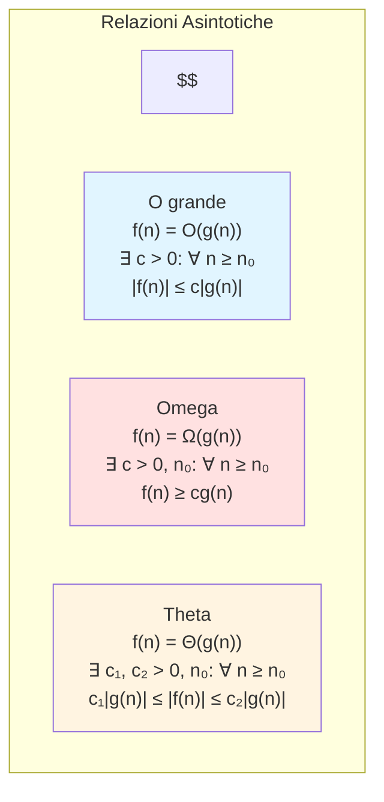
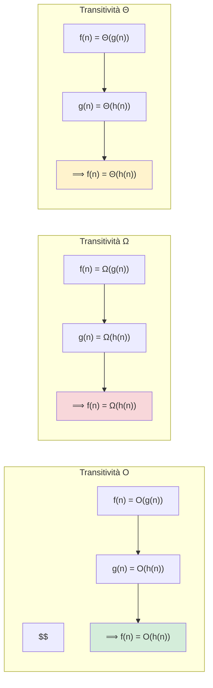
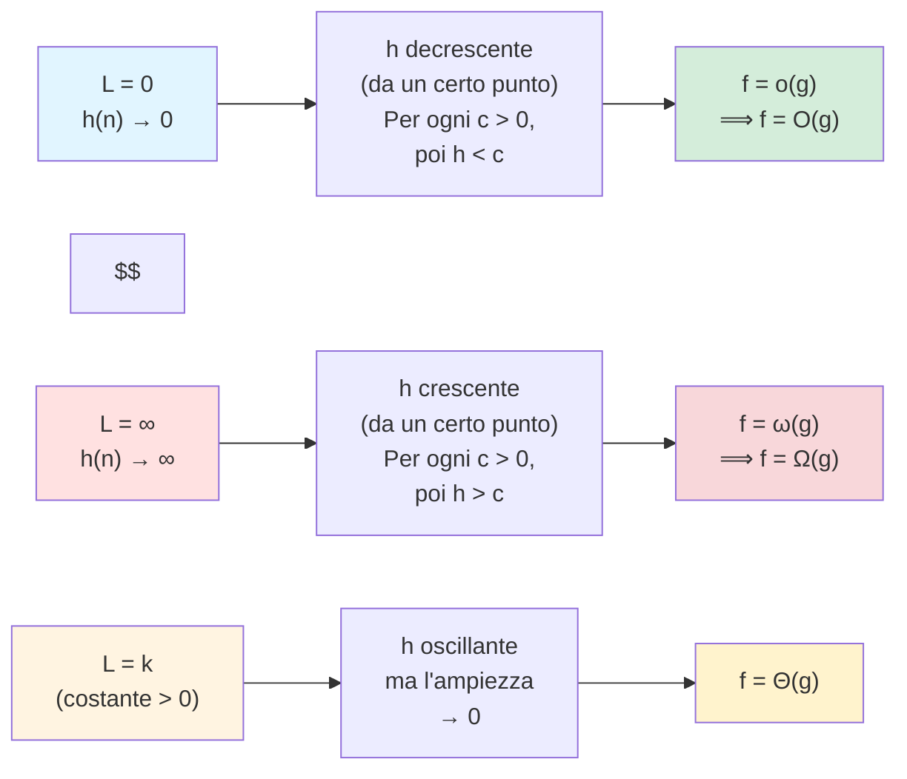
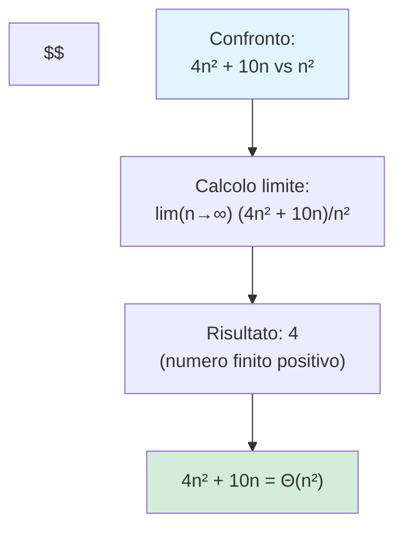
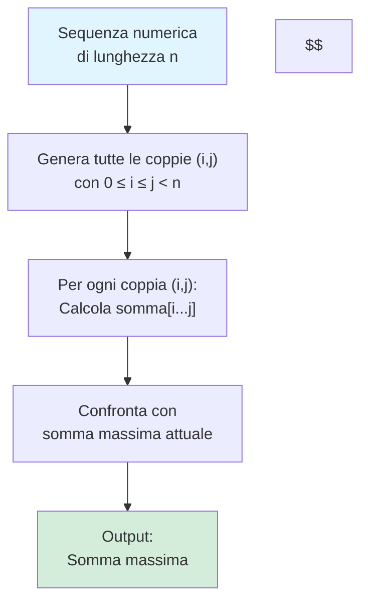
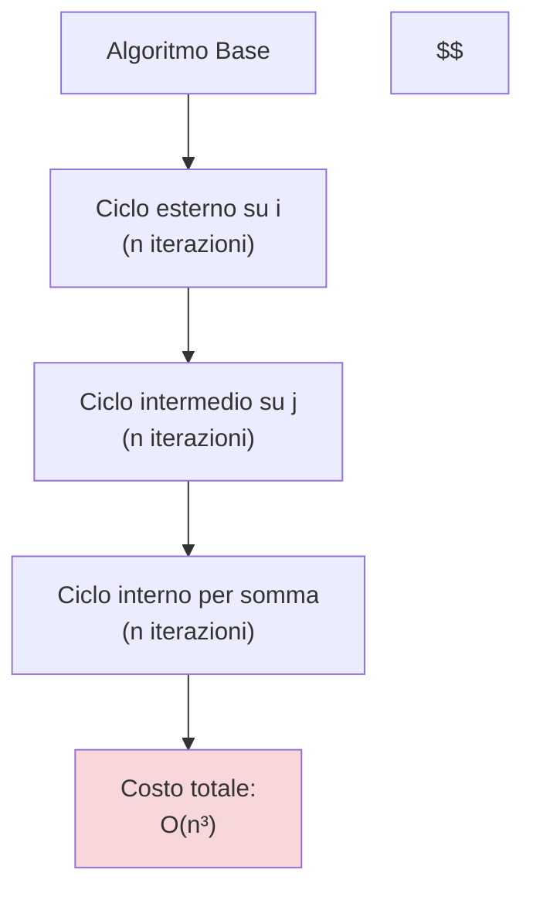
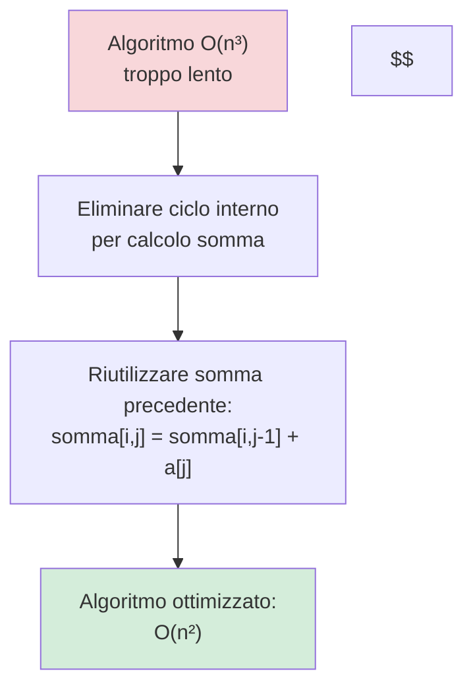
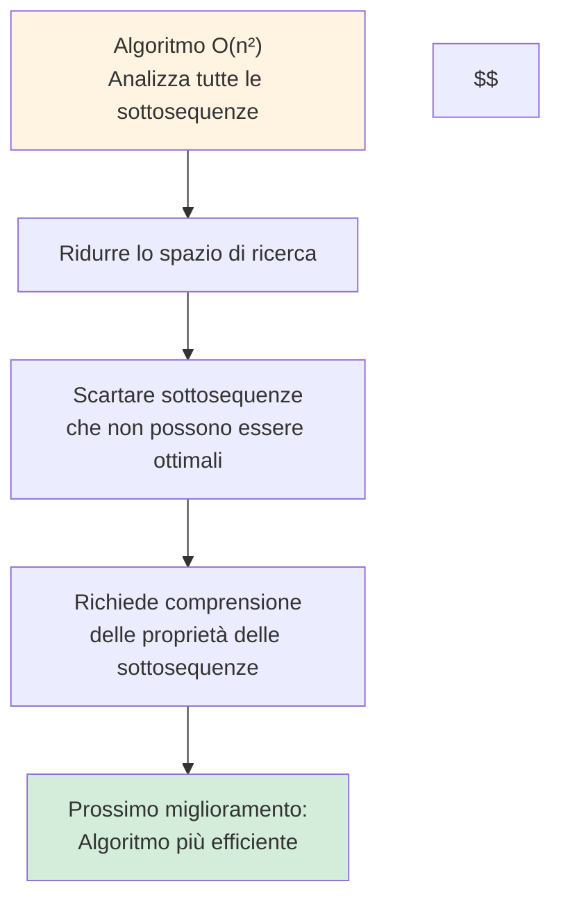

# TEST 4 — Lezione: Analisi delle notazioni asintotiche e confronto tra algoritmi
**Docente:** non specificato | **Data:** 08-03-2026

## Argomenti trattati
- Definizione di relazioni asintotiche (O grande, omega, theta)
- Dimostrazione della transitività delle relazioni asintotiche
- Applicazione dei limiti per confrontare funzioni
- Esempi di confronto tra algoritmi
- Sottosequenze contigue di una sequenza numerica
- Generazione e confronto delle sottosequenze contigue
- Analisi del costo dell'algoritmo di generazione delle sottosequenze
- Ottimizzazione dell'algoritmo per calcolo della somma massima
- Proposta di miglioramento successivo per ridurre lo spazio di ricerca

## Definizione di relazioni asintotiche (O grande, omega, theta)

Le relazioni asintotiche O grande, Omega e Theta sono formalizzate come segue:

> [!abstract] Definizione: O grande
> - **O grande (f(n) = O(g(n)))**: esiste una costante positiva $c$ tale che per ogni $n \geq n_0$, $|f(n)| \leq c|g(n)|$.
> 
> $$ f(n) = O(g(n)) : \text{esiste una costante positiva } c \text{ tale che per ogni } n \geq n_0, |f(n)| \leq c|g(n)|. $$
> [!abstract] Definizione: Omega
> - **Omega (f(n) = Ω(g(n)))**: esiste un numero reale positivo $c$ e un intero non negativo $n_0$ tali che per ogni $n \geq n_0$, $f(n) \geq cg(n)$.
> 
> $$ f(n) = Ω(g(n)) : \text{esistono un numero reale positivo } c \text{ e un intero non negativo } n_0 \text{ tali che per ogni } n \geq n_0, f(n) \geq cg(n). $$
> [!abstract] Definizione: Theta
> - **Theta (f(n) = Θ(g(n)))**: vale sia $O(g(n))$ che $Ω(g(n))$, cioè esistono costanti positive $c_1$ e $c_2$ e un intero non negativo $n_0$ tali che per ogni $n \geq n_0$, $c_1|g(n)| \leq |f(n)| \leq c_2|g(n)|$.
> 
> $$ f(n) = Θ(g(n)) : \text{vale sia } O(g(n)) \text{ che } Ω(g(n)), \text{cioè esistono costanti positive } c_1 \text{ e } c_2 \text{ e un intero non negativo } n_0 \text{ tali che per ogni } n \geq n_0, c_1|g(n)| \leq |f(n)| \leq c_2|g(n)|. $$
## Dimostrazione della transitività delle relazioni asintotiche

La transitività delle relazioni asintotiche è dimostrata come segue:

> [!quote] Transitività
> - Se $f(n) = O(g(n))$ e $g(n) = O(h(n))$, allora $f(n) = O(h(n))$.
> 
> $$ \text{Se } f(n) = O(g(n)) \text{ e } g(n) = O(h(n)), \text{allora } f(n) = O(h(n)). $$
> 
> - Se $f(n) = Ω(g(n))$ e $g(n) = Ω(h(n))$, allora $f(n) = Ω(h(n))$.
> 
> $$ \text{Se } f(n) = Ω(g(n)) \text{ e } g(n) = Ω(h(n)), \text{allora } f(n) = Ω(h(n)). $$
> 
> - Se $f(n) = Θ(g(n))$ e $g(n) = Θ(h(n))$, allora $f(n) = Θ(h(n))$.
> 
> $$ \text{Se } f(n) = Θ(g(n)) \text{ e } g(n) = Θ(h(n)), \text{allora } f(n) = Θ(h(n)). $$
## Applicazione dei limiti per confrontare funzioni

Per confrontare due funzioni asintotiche, si può usare il limite del rapporto tra le funzioni:

> [!quote] Confronto tramite limiti
> - Se $\lim_{n \to \infty} \frac{f(n)}{g(n)}$ tende a un numero finito positivo, allora $f(n) = Θ(g(n))$.
> 
> $$ \text{Se } \lim_{n \to \infty} \frac{f(n)}{g(n)} \text{ tende a un numero finito positivo, allora } f(n) = Θ(g(n)). $$
> 
> - Se $\lim_{n \to \infty} \frac{f(n)}{g(n)}$ tende a infinito, allora $f(n) = Ω(g(n))$.
> 
> $$ \text{Se } \lim_{n \to \infty} \frac{f(n)}{g(n)} \text{ tende a infinito, allora } f(n) = Ω(g(n)). $$
> 
> - Se $\lim_{n \to \infty} \frac{f(n)}{g(n)}$ tende a zero, allora $f(n) = O(g(n))$.
> 
> $$ \text{Se } \lim_{n \to \infty} \frac{f(n)}{g(n)} \text{ tende a zero, allora } f(n) = O(g(n)). $$
## Esempi di confronto tra algoritmi

Per esempio, per confrontare $4n^2 + 10n$ con $n^2$, si calcola il limite:
$$ \lim_{n \to \infty} \frac{4n^2 + 10n}{n^2} = 4. $$
Poiché il limite tende a un numero finito positivo, $4n^2 + 10n = Θ(n^2)$.

## Sottosequenze contigue di una sequenza numerica

Una sottosequenza continua è un sottoinsieme degli elementi che sono tutti uno accanto all'altro nella sequenza. La somma massima di una sottosequenza continua può essere calcolata considerando tutte le possibili coppie di indici $(i, j)$ tali che $i \leq j$ e calcolando la somma della sottosequenza tra $i$ e $j$.

## Generazione e confronto delle sottosequenze contigue

Per generare tutte le possibili sottosequenze contigue, si considerano tutte le coppie di indici $(i, j)$ tali che $0 \leq i \leq j < n$. La somma massima tra queste sottosequenze può essere trovata calcolando la somma per ogni coppia e confrontandola con la somma massima attuale.

## Analisi del costo dell'algoritmo di generazione delle sottosequenze

L'analisi mostra che l'algoritmo ha un costo cubico, $O(n^3)$, dove $n$ è la lunghezza della sequenza. Questo perché per ogni coppia di indici $(i, j)$ si calcola la somma della sottosequenza tra $i$ e $j$.

## Ottimizzazione dell'algoritmo per calcolo della somma massima

L'idea di ottimizzare l'algoritmo consiste nell'eliminare il ciclo interno per ridurre il costo da $O(n^3)$ a $O(n^2)$. In pratica, si può evitare di ricalcolare la somma completa ogni volta che $i$ viene incrementato.

## Proposta di miglioramento successivo per ridurre lo spazio di ricerca

Il prossimo passo di ottimizzazione è non analizzare tutte le sottosequenze, ma scartare quelle che non possono contenere la soluzione migliore. Questa tecnica richiede una comprensione approfondita delle proprietà delle sottosequenze.

## Conclusione

Il docente conclude indicando che il prossimo passo di ottimizzazione sarà ridurre lo spazio di ricerca, garantendo che le sottosequenze scartate non possano contenere la soluzione migliore. Questa tecnica è meno banale e richiede una comprensione approfondita delle proprietà delle sottosequenze contigue.

## Diagrammi

### Definizione di relazioni asintotiche

### Dimostrazione della transitività delle relazioni asintotiche

### Applicazione dei limiti per confrontare funzioni

### Esempi di confronto tra algoritmi

### Generazione e confronto delle sottosequenze contigue

### Analisi del costo dell'algoritmo di generazione delle sottosequenze

### Ottimizzazione dell'algoritmo per calcolo della somma massima

### Proposta di miglioramento successivo per ridurre lo spazio di ricerca

## Punti chiave della lezione
> [!summary] Punti chiave della lezione
> - Definizione formale di O grande, Omega e Theta
> - Dimostrazione della transitività delle relazioni asintotiche
> - Applicazione dei limiti per confrontare funzioni
> - Esempi pratici del confronto tra algoritmi
> - Analisi del costo dell'algoritmo di generazione delle sottosequenze contigue

## Prossimi argomenti
- [ ] Riduzione dello spazio di ricerca nelle sottosequenze contigue

#TEST4 #relazioni_asintotiche #confronto_algoritmi #sottosequenze_contigue #analisi_costo
