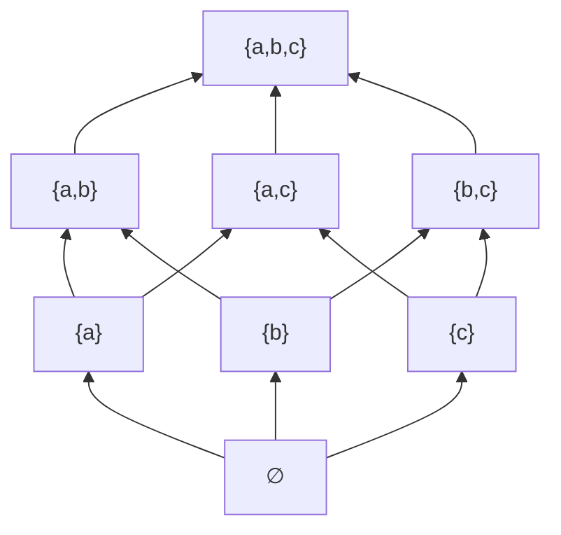

# Lezione 19: Relazioni d'Ordine, Insiemi Ordinati, Elementi Notevoli (con Diagrammi Mermaid)

**Data:** 23/05/2025 (come da note)
**Argomenti:** Relazioni d'Ordine (larghe e strette), Ordine Totale e Parziale, Diagrammi di Hasse, Elementi Minimali/Massimali, Minimo/Massimo, Minoranti/Maggioranti, Inf/Sup, Insiemi Ben Ordinati, Ordine Indotto da Funzione, Esercizi.

#tag/relations #tag/order-theory #tag/posets #tag/hasse-diagrams #tag/min-max #tag/inf-sup #tag/well-ordering #tag/algebra-avanzata #tag/mermaid

---

## 1. Relazioni d'Ordine

Una relazione d'ordine definisce una struttura gerarchica tra gli elementi di un insieme.

### 1.1 Relazione d'Ordine (Larga) (Pag 1, 7)

*   Una relazione binaria $\mathcal{R}$ su un insieme $S$ si dice **relazione d'ordine** (o d'ordine largo, parziale) se è:
    1.  **Riflessiva:** $\forall x \in S, x \mathcal{R} x$.
    2.  **Antisimmetrica:** $\forall x, y \in S, (x \mathcal{R} y \land y \mathcal{R} x) \implies x = y$.
    3.  **Transitiva:** $\forall x, y, z \in S, (x \mathcal{R} y \land y \mathcal{R} z) \implies x \mathcal{R} z$.
*   Un insieme $S$ dotato di una relazione d'ordine $\mathcal{R}$, denotato $(S, \mathcal{R})$ (o spesso $(S, \le)$), si chiama **insieme parzialmente ordinato** (poset).

### 1.2 Relazione d'Ordine Stretto (Pag 1, 7)

*   Una relazione binaria $\mathcal{R}'$ su un insieme $S$ si dice **relazione d'ordine stretto** se è:
    1.  **Antiriflessiva (o Irriflessiva):** $\forall x \in S, \neg (x \mathcal{R}' x)$.
    2.  **Transitiva:** $\forall x, y, z \in S, (x \mathcal{R}' y \land y \mathcal{R}' z) \implies x \mathcal{R}' z$.
    *   *Nota:* L'antiriflessività e la transitività insieme implicano l'**asimmetria** ($x \mathcal{R}' y \implies \neg (y \mathcal{R}' x)$).

### 1.3 Corrispondenza tra Ordine Largo e Stretto (Pag 2, 7)

Esiste una corrispondenza biunivoca tra relazioni d'ordine largo ($\mathcal{R}$) e relazioni d'ordine stretto ($\mathcal{R}'$) sullo stesso insieme $S$.

*   **Da Ordine Largo $\mathcal{R}$ a Ordine Stretto $\mathcal{R}'$:**
    $$ x \mathcal{R}' y \iff (x \mathcal{R} y \land x \neq y) $$
*   **Da Ordine Stretto $\mathcal{R}'$ a Ordine Largo $\mathcal{R}$:**
    $$ x \mathcal{R} y \iff (x \mathcal{R}' y \lor x = y) $$

### 1.4 Ordine Totale vs Parziale (Pag 2)

*   Un insieme ordinato $(S, \mathcal{R})$ si dice **totalmente ordinato** (o linearmente ordinato, o una catena) se per ogni coppia di elementi $x, y \in S$ si ha:
    $$ (x \mathcal{R} y) \lor (y \mathcal{R} x) $$
*   Se un ordine non è totale, è detto **parziale**.
*   **Esempi:** $(\mathbb{N}, \le)$ è totale. $(P(S), \subseteq)$ con $|S| \ge 2$ è parziale.

### 1.5 Relazione di Divisibilità (Pag 9-10)

*   $(\mathbb{N}^*, \mid)$ (divisibilità su interi positivi) è una relazione d'ordine parziale.
*   $(\mathbb{Z}, \mid)$ **NON** è una relazione d'ordine (non è antisimmetrica: $2 \mid -2$ e $-2 \mid 2$ ma $2 \neq -2$).

[[Relazione d'ordine]] [[Insieme parzialmente ordinato]] [[Ordine totale]]

---

## 2. Rappresentazione e Elementi Notevoli in Insiemi Ordinati

### 2.1 Relazione di Copertura (Pag 3)

Sia $(S, \mathcal{R})$ un insieme ordinato e $\mathcal{R}'$ la relazione d'ordine stretto associata.
*   $b$ **copre** $a$ $\iff (a \mathcal{R}' b) \land (\neg \exists c \in S : a \mathcal{R}' c \land c \mathcal{R}' b)$.
    *   $b$ è "immediatamente sopra" $a$ nell'ordine.

### 2.2 Diagrammi di Hasse (Pag 4-6)

Per insiemi ordinati **finiti**. Si disegnano nodi per gli elementi e segmenti per le relazioni di copertura, con l'elemento "superiore" più in alto.

*   **Esempio $(P(S), \subseteq)$ con $S=\{a, b\}$ (Pag 4):**
    *   $P(S) = \{\emptyset, \{a\}, \{b\}, S=\{a,b\}\}$.

    ```mermaid
    graph BT
        S["S ({a,b})"]
        A["{a}"]
        B["{b}"]
        Phi["∅"]

        Phi --> A
        Phi --> B
        A --> S
        B --> S
    ```

*   **Esempio $(P(S), \subseteq)$ con $S=\{a, b, c\}$ (Pag 4):**
    *   $P(S) = \{\emptyset, \{a\}, \{b\}, \{c\}, \{a,b\}, \{a,c\}, \{b,c\}, S=\{a,b,c\}\}$.

    ```mermaid
    graph BT
        SABC["S ({a,b,c})"]
        AB["{a,b}"]
        AC["{a,c}"]
        BC["{b,c}"]
        A["{a}"]
        B["{b}"]
        C["{c}"]
        Phi["∅"]

        Phi --> A
        Phi --> B
        Phi --> C
        A --> AB
        A --> AC
        B --> AB
        B --> BC
        C --> AC
        C --> BC
        AB --> SABC
        AC --> SABC
        BC --> SABC
    ```

*   **Esempio $(P(S), \mathcal{R})$ con $S=\{a,b,c\}$ e $X \mathcal{R} Y \iff (X=Y) \lor (|X| < |Y|)$ (Pag 5):**
    *   $Y$ copre $X \iff |Y| = |X|+1$.
    *   Nodi raggruppati per cardinalità. Ogni nodo di cardinalità $k$ è collegato (coperto da) ogni nodo di cardinalità $k+1$.

    ```mermaid
    graph BT
        subgraph Livello3_Card3
            SABC["S ({a,b,c})"]
        end
        subgraph Livello2_Card2
            AB["{a,b}"]
            AC["{a,c}"]
            BC["{b,c}"]
        end
        subgraph Livello1_Card1
            A["{a}"]
            B["{b}"]
            C["{c}"]
        end
        subgraph Livello0_Card0
            Phi["∅"]
        end

        Phi --> A
        Phi --> B
        Phi --> C
        
        A --> AB
        A --> AC
        A --> BC
        
        B --> AB
        B --> AC
        B --> BC
        
        C --> AB
        C --> AC
        C --> BC
        
        AB --> SABC
        AC --> SABC
        BC --> SABC
    ```
    > [!NOTE] Questo diagramma di Hasse illustra che ogni elemento di cardinalità $k$ è "minore" (secondo $\mathcal{R}$) di ogni elemento di cardinalità $k+1, k+2, \dots$. La relazione di copertura si ha tra livelli di cardinalità adiacenti.

*   **Esempio $(\{2,3,4,5,6,8,10\}, \mathcal{R})$ con $a \mathcal{R} b \iff (a=b) \lor (\pi(a) \subset \pi(b))$, dove $\pi(n)$ è l'insieme dei divisori primi di $n$ (Pag 6):**
    *   $\pi(2)=\{2\}$, $\pi(3)=\{3\}$, $\pi(4)=\{2\}$, $\pi(5)=\{5\}$, $\pi(6)=\{2,3\}$, $\pi(8)=\{2\}$, $\pi(10)=\{2,5\}$.
    *   Relazione di copertura $\mathcal{R}'$: $x \mathcal{R}' y \iff \pi(x) \subset \pi(y)$ e non esiste $z$ con $\pi(x) \subset \pi(z) \subset \pi(y)$.
    *   Coperture:
        *   $\pi(2) \subset \pi(6)$ e $\pi(3) \subset \pi(6)$ sono coperture.
        *   $\pi(2) \subset \pi(10)$ e $\pi(5) \subset \pi(10)$ sono coperture.
        *   $\pi(4)$, $\pi(8)$ hanno lo stesso insieme di fattori primi di $\pi(2)$, quindi non ci sono relazioni di copertura del tipo $\pi(x) \subset \pi(y)$ che li coinvolgano come elemento "minore" in una copertura, né come elemento "maggiore" se non per uguaglianza (che non si disegna in Hasse).

    ```mermaid
    graph BT
        n6["6 {2,3}"]
        n10["10 {2,5}"]
        n2["2 {2}"]
        n3["3 {3}"]
        n5["5 {5}"]
        n4["4 {2}"]
        n8["8 {2}"]

        n2 --> n6
        n3 --> n6
        n2 --> n10
        n5 --> n10
        
        %% n4, n8 sono incomparabili (o uguali per pi) con gli altri in termini di copertura stretta
        %% e non coprono/sono coperti da altri in modo stretto basato su pi(x) subset pi(y)
    ```
    > [!NOTE] In questo diagramma, i nodi 4 e 8 sono isolati perché $\pi(4)=\pi(2)$ e $\pi(8)=\pi(2)$. La relazione $a \mathcal{R} b$ si verifica se $a=b$ (riflessività, non mostrata in Hasse) oppure se $\pi(a)$ è un *sottoinsieme proprio* di $\pi(b)$. Quindi $2 \mathcal{R} 4$ non vale in senso stretto, né $2 \mathcal{R} 8$.

[[Diagramma di Hasse]]

### 2.3 Elemento Minimo e Massimo (Pag 11)

Sia $(S, \le)$ un insieme ordinato.
*   $a \in S$ è **minimo** se $a \le x, \forall x \in S$. È unico se esiste.
*   $a \in S$ è **massimo** se $x \le a, \forall x \in S$. È unico se esiste.

### 2.4 Elementi Minimali e Massimali (Pag 14, 16)

Sia $(S, \le)$ un insieme ordinato.
*   $a \in S$ è **minimale** se $\neg \exists x \in S : x < a$ (cioè $x \le a \land x \neq a$).
*   $a \in S$ è **massimale** se $\neg \exists x \in S : a < x$.
*   Minimo $\implies$ unico minimale. Massimo $\implies$ unico massimale. Il viceversa non sempre.
*   Insiemi finiti non vuoti hanno sempre elementi minimali/massimali.

[[Elemento minimale e massimale]] [[Elemento minimo e massimo]]

### 2.5 Insieme Ben Ordinato (Pag 26)

*   Un insieme totalmente ordinato $(S, \le)$ è **ben ordinato** se ogni suo sottoinsieme non vuoto $X \subseteq S$ ammette un elemento minimo.
*   Esempio: $(\mathbb{N}, \le)$. Controesempio: $(\mathbb{Z}, \le)$.

[[Insieme ben ordinato]]

### 2.6 Minoranti, Maggioranti, Infimo, Supremo (Pag 27-28)

Sia $(S, \le)$ un insieme ordinato e $X \subseteq S$.
*   **Minorante** di $X$: $a \in S$ tale che $a \le x, \forall x \in X$.
*   **Maggiorante** di $X$: $a \in S$ tale che $x \le a, \forall x \in X$.
*   **Infimo** di $X$: $\inf(X) = \max(\text{insieme dei minoranti di } X)$, se esiste.
*   **Supremo** di $X$: $\sup(X) = \min(\text{insieme dei maggioranti di } X)$, se esiste.
*   Se $\min(X)$ esiste, $\inf(X) = \min(X)$. Se $\max(X)$ esiste, $\sup(X) = \max(X)$.
*   Esempio $(\mathbb{N}^*, \mid)$: Per $X=\{60, 54\}$, $\inf(X) = \text{MCD}(60, 54)=6$, $\sup(X) = \text{mcm}(60, 54)=540$.

[[Minorante e maggiorante]] [[Estremo inferiore e superiore]]

---

## 3. Ordine Indotto da una Funzione (Pag 20-25)

Sia $f: S \to T$ una funzione, e $(T, \le_T)$ un insieme ordinato. Definiamo $\le_f$ su $S$:
$$ \forall a, b \in S, \quad a \le_f b \iff (a=b) \lor (f(a) <_T f(b)) $$
dove $<_T$ è l'ordine stretto associato a $\le_T$. Questa $\le_f$ è una relazione d'ordine su $S$.

---

> [!EXERCISE] Esercizio (Pag 29 - DA FARE)
> Sia $(P(S), \mathcal{R})$ con $S=\{a,b,c\}$ e $X \mathcal{R} Y \iff (X=Y) \lor (|X| < |Y|)$.
> *   Disegnare il diagramma di Hasse.
> *   Trovare gli elementi minimali e massimali.
> *   Trovare minimo e massimo, se esistono.
> *   Considerare il sottoinsieme $H = \{\{a,b\}, \{a,c\}\}$. Trovare minoranti, maggioranti, inf e sup di $H$ in $(P(S), \mathcal{R})$.



> *(Nota: Il diagramma Mermaid qui sopra è una traccia per l'esercizio. Verifica se rappresenta correttamente la relazione di copertura per l'ordine dato! Il diagramma corretto è quello discusso in precedenza per questa relazione).*

---

> [!SUMMARY] Riepilogo Veloce Lezione 19
> *   Definite **relazioni d'ordine largo** e **stretto** e la loro corrispondenza.
> *   Distinzione tra ordine **totale** e **parziale**.
> *   I **Diagrammi di Hasse** visualizzano ordini finiti.
> *   Definiti **minimo/massimo** e **minimali/massimali**.
> *   Definito **insieme ben ordinato**.
> *   Definiti **minoranti, maggioranti, infimo e supremo**.
> *   Introdotto l'**ordine indotto da una funzione**.