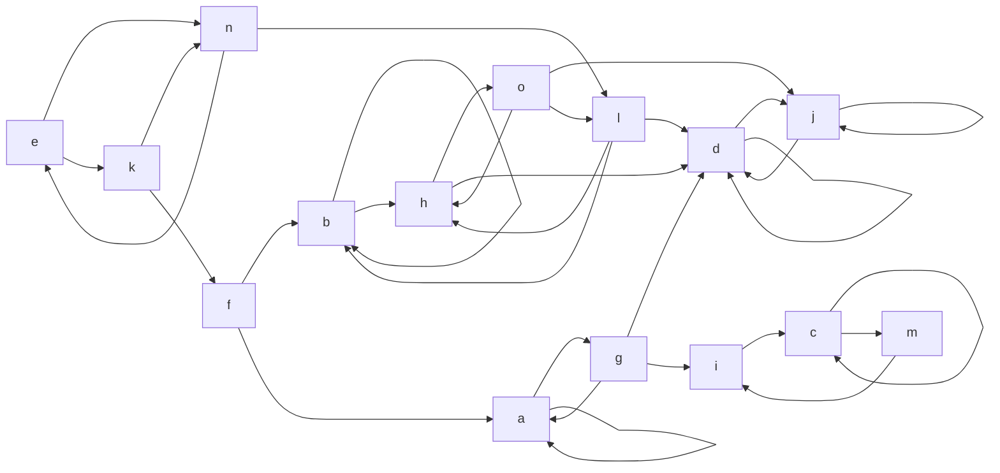
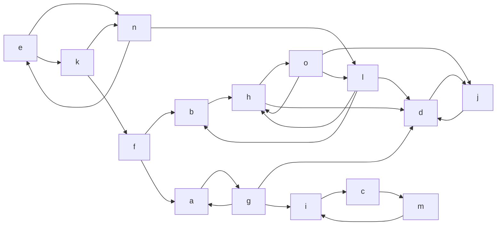
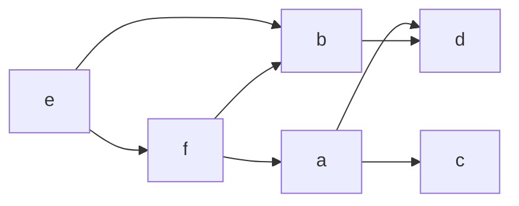

# Compito
1. Si svolgano i seguenti tre problemi elementari, motivando brevemente le risposte date. **In assenza di una corretta motivazione, lo svolgimento dell'esercizio sarà considerato errato.**

   i. Si consideri il grafo orientato G rappresentato dalle seguenti liste di adiacenza, in cui le liste dei nodi mancanti sono da considerarsi vuote (ossia tali vertici non hanno archi uscenti). Si proponga una **rappresentazione grafica** dello stesso e si identifichino tra i cinque insiemi di vertici (i)-(v) quali costituiscono una **componente fortemente connessa**.

   ```
   a → [g, a]          f → [b, a]          k → [n, f]         (i) {a}
   b → [b, h]          g → [a, d, i]       l → [h, b, d]      (ii) {l, n}
   c → [c, m]          h → [o, d]          m → [i]            (iii) {k, f}
   d → [j, d]          i → [c]             n → [e, l]         (iv) {h, l, o}
   e → [n, k]          j → [d, j]          o → [j, h, l]      (v) {i, c, m}
   ```

   ii. Si assegni come nome a tutte e sole le componenti fortemente connesse del precedente grafo G il ciccio e rappresentanti canonici (ossia il nome del primo nodo in ordine alfabetico tra i nodi presenti nella cfc) e si **rappresenti graficamente** il relativo grafo aciclico C delle componenti. Infine, si elenchino tutti i possibili **ordinamenti topologici** di C.

   iii. Si riporti lo pseudo-codice dell'algoritmo di **visita in ampiezza su grafo** (con annesso calcolo delle **distanze** e dei predecessori). Successivamente, lo si applichi al grafo G del punto (i) partendo dal nodo f e usando l'ordine di visita indotto dalle liste di adiacenza sopra riportate, si identifichino le distanze da tutti gli altri nodi e si rappresenti graficamente l'albero di visita.

2. Un albero binario T è un **albero sintattico** di una semplice espressione aritmetica se le foglie contengono numeri interi e i nodi interni i simboli + o ∗. Si scriva lo **pseudocodice** di un algoritmo ricorsivo che, dato in ingresso un albero binario T, calcoli e restituisca in **tempo lineare** il valore dell'espressione aritmetica di cui T rappresenta l'albero sintattico. In caso quest'ultimo abbia forma errata (foglie contenenti simboli o nodi interni contenenti numeri), l'algoritmo deve restituire il valore ⊥. Tale algoritmo **non può far uso né di variabili globali né di parametri passati per riferimento**.

3. Siano dati un grafo orientato G = ⟨V, E⟩, rappresentato per mezzo di **liste di adiacenza**, un vertice s ∈ V e un insieme di vertici A ⊆ V rappresentato tramite un array (quindi A[i] ∈ V, per ogni 0 ≤ i < |V|). Si scriva un algoritmo in **pseudocodice** che in **tempo lineare** sulla dimensione del grafo restituisca la lista dei vertici di G che possono raggiungere s senza passare da alcun vertice di A (cioè tali che esiste un percorso da ciascuno di tali vertici a s che non contiene alcun vertice di A).


# Soluzione

## ESERCIZIO 1

### i. Rappresentazione grafica e componenti fortemente connesse

**Grafo G (liste di adiacenza):**




**Grafo senza cicli "j->j"**

**Componenti Fortemente Connesse (algoritmo di Kosaraju):**

| CFC | Vertici |
|-----|---------|
| **CFC₁** | {e, n, k} |
| **CFC₂** | {f} |
| **CFC₃** | {b, h, l, o} |
| **CFC₄** | {a, g} |
| **CFC₅** | {c, i, m} |
| **CFC₆** | {d, j} |

**Verifica opzioni date:**

- (i) {a} → ✗ (la CFC corretta è {a, g})
- (ii) {l, n} → ✗ (n è in {e, n, k}, l è in {b, h, l, o})
- (iii) {k, f} → ✗ (k è in {e, n, k}, f è singoletto)
- (iv) {h, l, o} → ✗ (la CFC corretta è {b, h, l, o})
- **(v) {i, c, m} → ✓ CORRETTA**

**Risposta:** Solo **(v) {i, c, m}** è una componente fortemente connessa

### ii. Grafo aciclico delle componenti C

**Componenti con rappresentanti canonici (primo nodo alfabetico):**

| CFC | Rappresentante |
|-----|----------------|
| {a, g} | **a** |
| {b, h, l, o} | **b** |
| {c, i, m} | **c** |
| {d, j} | **d** |
| {e, n, k} | **e** |
| {f} | **f** |

**Archi nel grafo delle componenti C:**

```
e → {b, f}
f → {a, b}
a → {c, d}
b → {d}
c → {}
d → {}
```

**Grafo C (visualizzazione):**



**Tutti gli Ordinamenti Topologici di C (5 totali):**

1. e, f, a, b, c, d
2. e, f, a, b, d, c
3. e, f, a, c, b, d
4. e, f, b, a, c, d
5. e, f, b, a, d, c

### iii. Pseudocodice BFS e applicazione

```lua
procedure BFS(G, s)
    if s == NIL then
        return
    
    for each x in V do
        Color[x] = White
        d[x] = ∞
        p[x] = NIL
    
    Q = {s}
    Color[s] = Gray
    d[s] = 0
    p[s] = NIL
    
    while Q ≠ {} do
        x = Head(Q)
        for each v in Adj(x) do
            if Color[v] == White then
                Q = Enqueue(Q, v)
                Color[v] = Gray
                d[v] = d[x] + 1
                p[v] = x
        Q = Dequeue(Q)
        Color[x] = Black
end procedure
```

**Applicazione BFS da f sul grafo G:**

**Esecuzione passo-passo:**

```
Inizializzazione: d[f]=0, π[f]=NIL, Color[f]=Gray, Q=[f]

Iter 1: u=f, Adj[f]=[b,a]
  → b: d[b]=1, π[b]=f, Gray
  → a: d[a]=1, π[a]=f, Gray
  f→Nero, Q=[b,a]

Iter 2: u=b, Adj[b]=[b,h]
  → b: già Gray, skip
  → h: d[h]=2, π[h]=b, Gray
  b→Nero, Q=[a,h]

Iter 3: u=a, Adj[a]=[g,a]
  → g: d[g]=2, π[g]=a, Gray
  → a: già Nero, skip
  a→Nero, Q=[h,g]

Iter 4: u=h, Adj[h]=[o,d]
  → o: d[o]=3, π[o]=h, Gray
  → d: d[d]=3, π[d]=h, Gray
  h→Nero, Q=[g,o,d]

Iter 5: u=g, Adj[g]=[a,d,i]
  → a: già Nero, skip
  → d: già Gray, skip
  → i: d[i]=3, π[i]=g, Gray
  g→Nero, Q=[o,d,i]

Iter 6: u=o, Adj[o]=[j,h,l]
  → j: d[j]=4, π[j]=o, Gray
  → h: già Nero, skip
  → l: d[l]=4, π[l]=o, Gray
  o→Nero, Q=[d,i,j,l]

Iter 7: u=d, Adj[d]=[j,d]
  → j: già Gray, skip
  → d: già Nero, skip
  d→Nero, Q=[i,j,l]

Iter 8: u=i, Adj[i]=[c]
  → c: d[c]=4, π[c]=i, Gray
  i→Nero, Q=[j,l,c]

Iter 9: u=j, Adj[j]=[d,j]
  → d: già Nero, skip
  → j: già Nero, skip
  j→Nero, Q=[l,c]

Iter 10: u=l, Adj[l]=[h,b,d]
  → h,b,d: tutti già Nero, skip
  l→Nero, Q=[c]

Iter 11: u=c, Adj[c]=[c,m]
  → c: già Nero, skip
  → m: d[m]=5, π[m]=c, Gray
  c→Nero, Q=[m]

Iter 12: u=m, Adj[m]=[i]
  → i: già Nero, skip
  m→Nero, Q=[] → FINE
```

**Tabella completa distanze e predecessori:**

| Nodo | d[v] | π[v] | Raggiungibile |
|------|------|------|---------------|
| f | 0 | NIL | ✅ |
| b | 1 | f | ✅ |
| a | 1 | f | ✅ |
| h | 2 | b | ✅ |
| g | 2 | a | ✅ |
| o | 3 | h | ✅ |
| d | 3 | h | ✅ |
| i | 3 | g | ✅ |
| j | 4 | o | ✅ |
| l | 4 | o | ✅ |
| c | 4 | i | ✅ |
| m | 5 | c | ✅ |
| e | ∞ | NIL | ❌ |
| n | ∞ | NIL | ❌ |
| k | ∞ | NIL | ❌ |

**Albero BFS da f:**

```
                        f (d=0)
                       / \
                      /   \
                     v     v
               (d=1) b     a (d=1)
                     |     |
                     v     v
               (d=2) h     g (d=2)
                    / \     \
                   /   \     \
                  v     v     v
            (d=3) o     d     i (d=3)
                 / \          |
                /   \         |
               v     v        v
         (d=4) j     l        c (d=4)
                              |
                              v
                              m (d=5)
```

**Nodi NON raggiungibili da f: {e, n, k}**

---

## ESERCIZIO 2

```lua
procedure Valuta_Espressione(T)
    if T == NIL then
        return ⊥
    
    // Caso foglia
    if T.left == NIL && T.right == NIL then
        if T.key è numero intero then
            return T.key
        else
            return ⊥
    
    // Caso nodo interno malformato (manca un figlio)
    if T.left == NIL || T.right == NIL then
        return ⊥
    
    // Nodo interno deve avere operatore + o *
    if T.key != "+" && T.key != "*" then
        return ⊥
    
    // Valutazione ricorsiva dei sottoalberi
    val_sx = Valuta_Espressione(T.left)
    val_dx = Valuta_Espressione(T.right)
    
    if val_sx == ⊥ || val_dx == ⊥  then
        return ⊥
	
    // Applica l'operatore
    if T.key == "+" then
        return val_sx + val_dx
    else    // T.key == "*"
        return val_sx * val_dx
end procedure
```

**Analisi di Complessità:**
- Ogni nodo viene visitato esattamente una volta
- Operazioni per nodo: O(1)
- **Complessità totale: O(n)** dove n = numero di nodi

**Correttezza:**
- Verifica strutturale: foglie con numeri, nodi interni con operatori e 2 figli
- Propagazione errori: se un sottoalbero è malformato, restituisce ⊥
- Nessuna variabile globale, nessun parametro per riferimento
- Il risultato viene calcolato e propagato attraverso i return

---

## ESERCIZIO 3

### Idea
- Un vertice **v** può raggiungere **s** in G ⟺ **s** può raggiungere **v** nel grafo trasposto G^T
- Costruiamo G^T, facciamo una BFS da s in G^T, **evitando** i vertici in A
- Per avere lookup O(1) su A, usiamo un array booleano `Proibito[]`

### Pseudocodice

```lua
procedure VerticiCheRaggiungono_s_SenzaPassarePer_A(G, s, A)
    // ------------------------------------------------------
    // Passo 0: Preparazione array di "proibiti" O(|V|)
    // ------------------------------------------------------
    for each u ∈ V do
        Proibito[u] ← false
    
    for i ← 0 to |A|-1 do
        Proibito[A[i]] ← true
    
	// Se s ∈ A, nessun percorso può "arrivare a s senza passare per A"
	// perché s stesso è in A e il percorso lo contiene 
	if Proibito[s] = true then
	    return lista vuota
	
    // ------------------------------------------------------
    // Passo 1: Costruzione grafo trasposto GT    O(|V| + |E|)
    // ------------------------------------------------------
    for each u ∈ V do
        Adj_T[u] ← lista vuota
    
    for each u ∈ V do
        for each v ∈ Adj[u] do
            Adj_T[v].aggiungi(u)          // arco v → u nel trasposto
	
    // ------------------------------------------------------
    // Passo 2: BFS da s su GT, ignorando i nodi proibiti
    // ------------------------------------------------------
    for each u ∈ V do
        Colore[u] ← BIANCO
        Raggiunge[u] ← falso
	
    // s è sempre raggiungibile da sé stesso (percorso vuoto)
    // anche se s ∈ A → dipende dall'interpretazione, ma quasi sempre lo includiamo
    Raggiunge[s] ← vero
    Colore[s] ← GRIGIO
	
    Q ← coda vuota
    Enqueue(Q, s)
	
    while Q != {} do
        u ← Dequeue(Q)
	
        for each v ∈ Adj_T[u] do               // vertici che in G puntano a u
            if Colore[v] = BIANCO && Proibito[v] = falso then
                Colore[v] ← GRIGIO
                Raggiunge[v] ← vero
                Enqueue(Q, v)
	
        Colore[u] ← NERO
	
    // ------------------------------------------------------
    // Passo 3: Costruzione della lista risultato    O(|V|)
    // ------------------------------------------------------
    risultato ← lista vuota
	
    for each u ∈ V do
        if Raggiunge[u] = vero then
            risultato.aggiungi(u)
	
    return risultato
fine procedura
```

### Analisi della Complessità

| Passo   | Operazione                    | Costo                  |
| ------- | ----------------------------- | ---------------------- |
| Passo 0 | Inizializzazione `Proibito[]` | O(V) + O(\|A\|) = O(V) |
| Passo 1 | Costruzione G^T               | O(V + E)               |
| Passo 2 | BFS su G^T                    | O(V + E)               |
|         | **Totale**                    | **O(V + E)** ✅         |

**Dettagli:**
- `Proibito[v]` è un accesso diretto all'array → O(1) per ogni controllo
- Ogni vertice viene accodato e decodato al più una volta → O(V)
- Ogni arco di G^T viene esaminato al più una volta → O(E)
- G^T ha lo stesso numero di archi di G

### Correttezza

**Teorema:** L'algoritmo restituisce esattamente i vertici v ∈ V tali che esiste un cammino v ⇝ s in G che non passa per alcun vertice di A.

**Dimostrazione:**
1. v ⇝ s in G senza A ⟺ s ⇝ v in G^T senza A (per definizione di grafo trasposto)
2. La BFS da s in G^T visita esattamente i vertici raggiungibili da s in G^T, escludendo quelli in A (grazie al controllo `Proibito[v] == False`)
3. Poiché non espandiamo mai un vertice proibito, nessun cammino nel BFS-tree passa per un vertice di A
4. Se esiste un cammino s ⇝ v in G^T che non passa per A, la BFS lo troverà (completezza della BFS)
5. s è incluso nel risultato perché è raggiungibile da sé stesso con un cammino vuoto

**Nota importante:** L'uso di un array booleano `Proibito[]` indicizzato direttamente per vertice garantisce lookup O(1). Se A fosse rappresentato come lista e controllassimo l'appartenenza con ricerca lineare, ogni controllo `v ∈ A` costerebbe O(|A|), portando la complessità a O(V·|A| + E·|A|) che non è lineare.