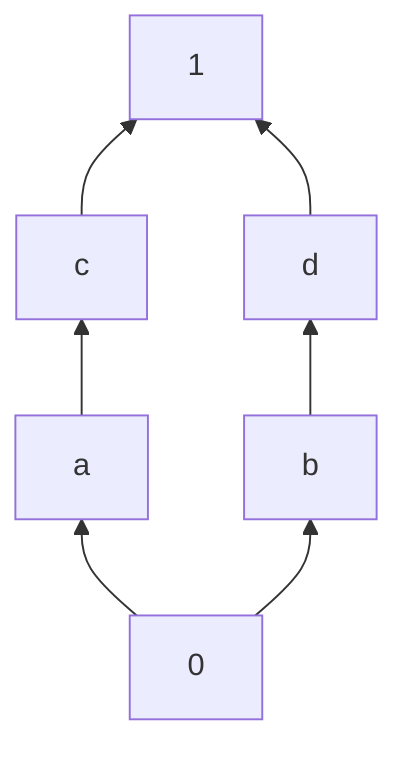
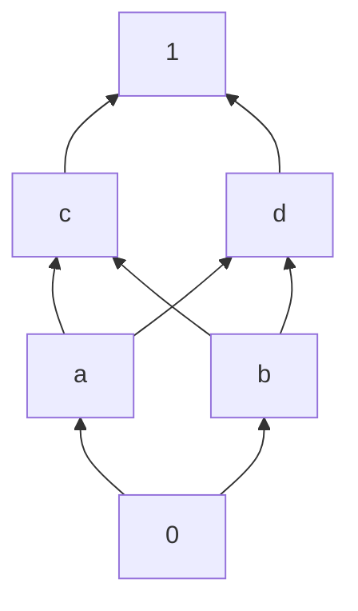

# Lezione 20: Insiemi Ordinati (Recap) e Reticoli

**Data:** 27/05/2025 (come da note)
**Argomenti:** Insiemi Ordinati (recap, esempi), Catene, Minoranti/Maggioranti, Inf/Sup (recap), Reticoli (definizione tramite ordine e algebrica), Proprietà delle operazioni reticolari (associatività, commutatività, assorbimento, idempotenza), Equivalenza tra le due definizioni di reticolo.

#tag/order-theory #tag/posets #tag/lattices #tag/inf-sup #tag/hasse-diagrams #tag/algebraic-structures #tag/algebra-avanzata #tag/mermaid

---

## 1. Insiemi Ordinati: Recap e Esempi

*   **Ordine Naturale su $\mathbb{Z}$ (Pag 1-2):**
    *   $(L, \le)$ o $(\mathbb{Z}, \le)$.
    *   $a \le b \iff b-a \in \mathbb{N}$ (dove $\mathbb{N}=\{0, 1, 2, ...\}$).
    1.  **Riflessiva:** $a \le a \iff a-a=0 \in \mathbb{N}$. Vero.
    2.  **Antisimmetrica:** $(a \le b \land b \le a) \implies a=b$.
        *   $b-a \in \mathbb{N}$ e $a-b \in \mathbb{N}$.
        *   Sia $k_1 = b-a \ge 0$ e $k_2 = a-b \ge 0$.
        *   $k_2 = -(b-a) = -k_1$.
        *   L'unico numero in $\mathbb{N}$ il cui opposto è anch'esso in $\mathbb{N}$ è $0$.
        *   Quindi $k_1=0 \implies b-a=0 \implies a=b$. Vero.
    3.  **Transitiva:** $(a \le b \land b \le c) \implies a \le c$.
        *   $b-a \in \mathbb{N}$ e $c-b \in \mathbb{N}$.
        *   $(b-a) + (c-b) = c-a$. Poiché $\mathbb{N}$ è chiuso rispetto a $+$, $c-a \in \mathbb{N}$.
        *   Quindi $a \le c$. Vero.
    *   $(\mathbb{Z}, \le)$ è **totalmente ordinato**.

*   **Divisibilità su $\mathbb{N}^* = \{1, 2, 3, ...\}$ (Pag 2):**
    *   $(\mathbb{N}^*, \mid)$ è parzialmente ordinato (dimostrato in Lez. 19).
    *   **Non è totalmente ordinato** (es. $2 \nmid 3$ e $3 \nmid 2$).
    *   $\min(\mathbb{N}^*, \mid) = 1$.
    *   $\max(\mathbb{N}^*, \mid)$ non esiste.

*   **Esempio $(L, \mid)$ con $L=\{1, 2, 3, 4, 6, 8, 9, 10, 12\}$ (Pag 3-4):**
    *   Questo è un insieme parzialmente ordinato dalla relazione di divisibilità.
    *   **Diagramma di Hasse:**

    ```mermaid
    graph BT
        n12["12"]
        n8["8"]
        n10["10"]
        n9["9"]
        n6["6"]
        n4["4"]
        n2["2"]
        n3["3"]
        n1["1"]

        n1 --> n2
        n1 --> n3
        n2 --> n4
        n2 --> n6
        n2 --> n10
        n3 --> n6
        n3 --> n9
        n4 --> n8
        n4 --> n12
        n6 --> n12
        
        %% Collegamenti impliciti per transitività non mostrati
        %% es. 1->4 via 1->2->4
    ```
    *   $\min(L, \mid) = 1$.
    *   Elementi Massimali: $\{8, 9, 10, 12\}$. Non c'è un massimo.
    *   **Catena:** Un sottoinsieme totalmente ordinato. Es. $\{1, 2, 4, 8\}$, $\{1, 3, 9\}$, $\{1, 2, 6, 12\}$.
    *   **Catena Massimale:** Una catena che non può essere estesa aggiungendo altri elementi di $L$.
    *   **Minoranti/Maggioranti (Pag 4):**
        *   $Min(\{10\}) = \{1, 2, 10\}$. $\inf(\{10\})=10$.
        *   $Magg(\{10\}) = \{10\}$. $\sup(\{10\})=10$.
        *   $Min(\{10, 2\}) = \{1, 2\}$. $\inf(\{10, 2\})=2$.
        *   $Magg(\{10, 2\}) = \{10\}$. $\sup(\{10, 2\})=10$.
        *   $Min(\{10, 6\}) = \{1, 2\}$. $\inf(\{10, 6\})=2$.
        *   $Magg(\{10, 6\}) = \emptyset$. $\sup(\{10, 6\})$ non esiste.
        *   $Min(\{8, 12, 6\}) = \{1, 2\}$. $\inf=2$.
        *   $Magg(\{8, 12, 6\}) = \emptyset$. $\sup$ non esiste.
        *   $Min(\{2, 3\}) = \{1\}$. $\inf=1$.
        *   $Magg(\{2, 3\}) = \{6, 12\}$. $\sup=6$.

*   **Unicità Minimo/Massimo (Pag 5):** Se esistono, sono unici.
*   **Minimo/Massimo $\implies$ Unico Minimale/Massimale (Pag 5):** Vero.

[[Insieme parzialmente ordinato]] [[Diagramma di Hasse]] [[Catena (teoria degli ordini)]] [[Minorante e maggiorante]] [[Estremo inferiore e superiore]]

---

## 2. Reticoli (Lattices)

Insiemi parzialmente ordinati con proprietà aggiuntive su inf e sup.

### 2.1 Definizione di Reticolo tramite Ordine: L'Idea di "Completezza" Locale

Immagina di avere un insieme $L$ dove alcuni elementi sono "più piccoli" o "più grandi" di altri, secondo una relazione d'ordine parziale $\le$. Un insieme parzialmente ordinato $(L, \le)$ diventa un **reticolo** se soddisfa una condizione fondamentale:

*   Per **ogni singola coppia** di elementi che scegli dall'insieme $L$, diciamo $\{a, b\}$, devono esistere sempre due cose:
    1.  Il loro **estremo inferiore** (inf): Questo è l'elemento più grande in $L$ che è "sotto" (minore o uguale a) sia $a$ che $b$.
    2.  Il loro **estremo superiore** (sup): Questo è l'elemento più piccolo in $L$ che è "sopra" (maggiore o uguale a) sia $a$ che $b$.

E la cosa cruciale è che questi estremi (inf e sup) devono esistere e appartenere **sempre** all'insieme $L$ stesso.

**Notazione:**

Per rendere le cose più snelle, usiamo dei simboli speciali per l'estremo inferiore e superiore di una coppia:

*   L'estremo inferiore di $a$ e $b$, $\inf\{a, b\}$, si denota $a \land b$. Puoi leggerlo "a meet b" o "a inf b". Pensa a $\land$ come a trovare il "punto di incontro più alto" sotto entrambi gli elementi.
*   L'estremo superiore di $a$ e $b$, $\sup\{a, b\}$, si denota $a \lor b$. Puoi leggerlo "a join b" o "a sup b". Pensa a $\lor$ come a trovare il "punto di unione più basso" sopra entrambi gli elementi.

Quindi, la definizione formale si riassume così:

*   Un insieme parzialmente ordinato $(L, \le)$ è un **reticolo** se per ogni $a, b \in L$, esistono $\inf\{a, b\}$ (o $a \land b$) e $\sup\{a, b\}$ (o $a \lor b$) in $L$.

**Esempio con un Diagramma Specifico:**

Prendiamo il diagramma di Hasse che abbiamo appena analizzato, con gli elementi $L=\{0, a, b, c, d, 1\}$ e le connessioni dirette (frecce) che hai specificato: $0 \to a, 0 \to b, a \to c, b \to d, c \to 1, d \to 1$.

Ecco il diagramma disegnato correttamente con 0 in basso e 1 in alto:



Vediamo perché questo diagramma **è un reticolo** controllando alcune coppie:

*   **Coppia $\{a, b\}$:**
    *   Minoranti di $\{a, b\}$ (elementi $\le a$ e $\le b$): Solo $0$. Il massimo dei minoranti è $0$. Quindi $\inf\{a, b\} = 0$. (Esiste in $L$).
    *   Maggioranti di $\{a, b\}$ (elementi $\ge a$ e $\ge b$): $a \le c \le 1$ e $b \le d \le 1$. L'unico elemento $\ge$ sia di $a$ che di $b$ è $1$. Il minimo dei maggioranti è $1$. Quindi $\sup\{a, b\} = 1$. (Esiste in $L$).
*   **Coppia $\{c, d\}$:**
    *   Minoranti di $\{c, d\}$ (elementi $\le c$ e $\le d$): $c \ge a \ge 0$ e $d \ge b \ge 0$. L'unico elemento $\le$ sia di $c$ che di $d$ è $0$. Il massimo dei minoranti è $0$. Quindi $\inf\{c, d\} = 0$. (Esiste in $L$).
    *   Maggioranti di $\{c, d\}$ (elementi $\ge c$ e $\ge d$): Solo $1$. Il minimo dei maggioranti è $1$. Quindi $\sup\{c, d\} = 1$. (Esiste in $L$).

Controllando tutte le altre coppie (es. $\{0, a\}$, $\{b, d\}$, $\{a, c\}$, $\{c, 1\}$, ecc.), troveremmo sempre che l'estremo inferiore e l'estremo superiore esistono e sono elementi dell'insieme $L$.

Poiché per *ogni* coppia di elementi in questo diagramma l'estremo inferiore e l'estremo superiore esistono all'interno dell'insieme stesso, questo diagramma **rappresenta un reticolo**.

Questo esempio specifico *è* un reticolo. A volte, diagrammi che sembrano simili (come quello "a forma di casa" che hai menzionato, o un "diamante" leggermente diverso) *non* lo sono, perché per *almeno una* coppia di elementi, l'inf o il sup non esiste nell'insieme. La chiave è che la proprietà deve valere per **tutte** le coppie!

---


### 2.2 Definizione Algebrica di Reticolo (Pag 13-14)

*   Una struttura algebrica $(L, \land, \lor)$, dove $\land$ e $\lor$ sono operazioni binarie su $L$, è un **reticolo** se valgono le seguenti proprietà per ogni $a, b, c \in L$:
    1.  **Associatività:**
        *   $a \land (b \land c) = (a \land b) \land c$
        *   $a \lor (b \lor c) = (a \lor b) \lor c$
    2.  **Commutatività:**
        *   $a \land b = b \land a$
        *   $a \lor b = b \lor a$
    3.  **Leggi di Assorbimento:**
        *   $a \land (a \lor b) = a$
        *   $a \lor (a \land b) = a$

*   **Proprietà Derivata: Idempotenza (Pag 15):** Dalle leggi di assorbimento si può derivare l'idempotenza:
    *   $a \land a = a$
        *   Dim: $a \land a = a \land (a \lor (a \land b))$ (per assorbimento $a = a \lor (a \land b)$)
        *   $= a$ (per assorbimento $x \land (x \lor y) = x$, con $x=a, y=(a \land b)$).
    *   $a \lor a = a$ (analogo).

### 2.3 Equivalenza tra le Due Definizioni (Pag 15-17)

Le due definizioni di reticolo (quella basata sull'ordine e quella algebrica) sono equivalenti.

*   **$(L, \le)$ reticolo $\implies (L, \inf, \sup)$ è reticolo algebrico:**
    *   Se $(L, \le)$ è un reticolo (ordine), allora $a \land b = \inf\{a,b\}$ e $a \lor b = \sup\{a,b\}$ soddisfano le proprietà algebriche (associatività, commutatività, assorbimento). La dimostrazione richiede di usare le proprietà di inf e sup.

*   **$(L, \land, \lor)$ reticolo algebrico $\implies (L, \le)$ è reticolo (ordine):**
    *   Data una struttura algebrica $(L, \land, \lor)$ che soddisfa le proprietà algebriche, possiamo definire una relazione d'ordine $\le$ su $L$ come segue:
        $$ a \le b \iff a \land b = a $$
        (Equivalentemente, $a \le b \iff a \lor b = b$).
    *   Bisogna dimostrare che questa $\le$ è una relazione d'ordine:
        1.  **Riflessiva:** $a \le a \iff a \land a = a$. Vero per idempotenza.
        2.  **Antisimmetrica:** $a \le b \land b \le a \implies a \land b = a$ e $b \land a = b$. Per commutatività, $a \land b = b \land a$, quindi $a=b$. Vero.
        3.  **Transitiva:** $a \le b \land b \le c \implies a \land b = a$ e $b \land c = b$.
            *   Dobbiamo mostrare $a \le c$, cioè $a \land c = a$.
            *   $a \land c = (a \land b) \land c$ (sostituendo $a=a \land b$)
            *   $= a \land (b \land c)$ (associatività di $\land$)
            *   $= a \land b$ (sostituendo $b=b \land c$)
            *   $= a$. Vero.
    *   Infine, bisogna dimostrare che rispetto a questo ordine $\le$, si ha $\inf\{a,b\} = a \land b$ e $\sup\{a,b\} = a \lor b$.
        *   Per $\inf\{a,b\} = a \land b$:
            *   $(a \land b) \le a$? Sì, perché $(a \land b) \land a = a \land b$.
            *   $(a \land b) \le b$? Sì, perché $(a \land b) \land b = a \land b$.
            *   Se $c \le a$ e $c \le b$, allora $c \land a = c$ e $c \land b = c$. Dobbiamo mostrare $c \le (a \land b)$, cioè $c \land (a \land b) = c$.
            *   $c \land (a \land b) = (c \land a) \land b = c \land b = c$. Vero.

[[Reticolo (matematica)]] [[Leggi di assorbimento]] [[Idempotenza]]


### 2.4 Esempio: Un Poset che NON è un Reticolo

Il diagramma di Hasse analizzato nel capitolo 2.4 è il seguente:



#### Verifica se è un reticolo

Un insieme parzialmente ordinato è un reticolo se per ogni coppia di elementi esistono $\inf$ e $\sup$ *all'interno dell'insieme*.

Prendiamo la coppia $\{a, b\}$:

1. **Minoranti di $\{a, b\}$:**
   - Elementi $\le a$ e $\le b$: Solo $0$.
   - $\inf\{a, b\} = 0$.

2. **Maggioranti di $\{a, b\}$:**
   - Elementi $\ge a$ e $\ge b$: $c, d, 1$.
     - $c \ge a$ e $c \ge b$ (per transitività, poiché $a \le c$ e $b \le c$).
     - $d \ge a$ e $d \ge b$ (per transitività, poiché $a \le d$ e $b \le d$).
     - $1 \ge a$ e $1 \ge b$ (per transitività, poiché $a \le c \le 1$ e $b \le c \le 1$, e $a \le d \le 1$ e $b \le d \le 1$).
   - I maggioranti sono $\{c, d, 1\}$.
   - Il minimo dei maggioranti dovrebbe essere l'elemento più piccolo tra $c, d, 1$.
     - Ma $c$ e $d$ sono incomparabili (nessuno dei due è $\le$ l'altro).
     - Quindi, non esiste un minimo dei maggioranti.
   - **Conclusione:** $\sup\{a, b\}$ **non esiste**.

Poiché esiste almeno una coppia (in questo caso $\{a, b\}$) per cui il $\sup$ non esiste, il poset **non è un reticolo**.

#### Errore nell'analisi iniziale

Nell'analisi iniziale, è stato erroneamente affermato che il $\sup\{a, b\}$ è $c$ o $d$, ma in realtà non esiste un $\sup$ perché $c$ e $d$ sono incomparabili. La corretta analisi mostra che $\sup\{a, b\}$ non esiste, confermando che il poset non è un reticolo.

### Riepilogo

Il diagramma di Hasse analizzato **non è un reticolo** perché la coppia $\{a, b\}$ non ha un estremo superiore (sup) nell'insieme. Questo è dovuto al fatto che i maggioranti di $\{a, b\}$ sono $\{c, d, 1\}$, ma $c$ e $d$ sono incomparabili, quindi non esiste un minimo tra di essi.

---

## 4. Esempi e Controesempi di Reticoli (Pag 20)

*   **$(P(S), \subseteq)$ è un reticolo.**
    *   $\inf\{A, B\} = A \cap B$.
    *   $\sup\{A, B\} = A \cup B$.
    *   Le operazioni $\cap$ e $\cup$ soddisfano le proprietà algebriche dei reticoli.

*   **$(P(S), \mathcal{R})$ con $X \mathcal{R} Y \iff (X=Y) \lor (|X| < |Y|)$ (Pag 20, cerchiato in rosso):**
    *   Questo è l'esempio dal diagramma di Hasse che raggruppa per cardinalità.
    *   **NON è un reticolo** se $|S| \ge 2$.
    *   Consideriamo $S=\{a,b,c\}$. $X=\{a,b\}$, $Y=\{a,c\}$. Entrambi hanno cardinalità 2.
    *   $Min(X,Y)$ rispetto a $\mathcal{R}$:
        *   Un minorante $M$ deve essere $M=X$ o $|M|<|X|=2$, e $M=Y$ o $|M|<|Y|=2$.
        *   Se $M=X$, $X \mathcal{R} Y$ non vale ($X \neq Y$ e $|X| \not< |Y|$).
        *   I minoranti sono tutti gli insiemi $M$ con $|M| \le 1$ (cioè $\emptyset, \{a\}, \{b\}, \{c\}$).
        *   $\inf\{X,Y\} = \max(Min(X,Y))$. Qual è il massimo tra $\{\emptyset, \{a\}, \{b\}, \{c\}\}$ secondo $\mathcal{R}$?
            *   Tutti i singleton $\{a\}, \{b\}, \{c\}$ sono elementi massimali nell'insieme dei minoranti (hanno cardinalità 1, $\emptyset$ ha cardinalità 0). Non c'è un unico massimo.
            *   Quindi $\inf\{\{a,b\}, \{a,c\}\}$ **non esiste**.
    *   L'affermazione "NO minoranti" nella tua nota è riferita al fatto che non c'è un *unico* $\inf$.

---

> [!SUMMARY] Riepilogo Veloce Lezione 20
> *   Abbiamo rivisto le proprietà degli **insiemi ordinati** e analizzato esempi, inclusi i diagrammi di Hasse.
> *   Un **reticolo** $(L, \le)$ è un poset dove ogni coppia di elementi $\{a,b\}$ ammette $\inf\{a,b\}$ (denotato $a \land b$) e $\sup\{a,b\}$ (denotato $a \lor b$).
> *   Equivalentemente, un reticolo è una struttura algebrica $(L, \land, \lor)$ dove $\land, \lor$ sono binarie, associative, commutative e soddisfano le **leggi di assorbimento** (da cui deriva l'idempotenza).
> *   Le due definizioni sono equivalenti: una struttura d'ordine reticolare induce operazioni algebriche reticolari, e viceversa.
> *   $(P(S), \subseteq)$ è un reticolo con $A \land B = A \cap B$ e $A \lor B = A \cup B$.
> *   L'ordine basato sulla stretta inclusione delle cardinalità non è necessariamente un reticolo.
z
> [!TIP] Prossimi Passi
> *   Assicurati di aver compreso l'equivalenza tra le due definizioni di reticolo.
> *   I reticoli possono avere ulteriori proprietà (distributivi, booleani, completi) che definiscono classi più specifiche di strutture.