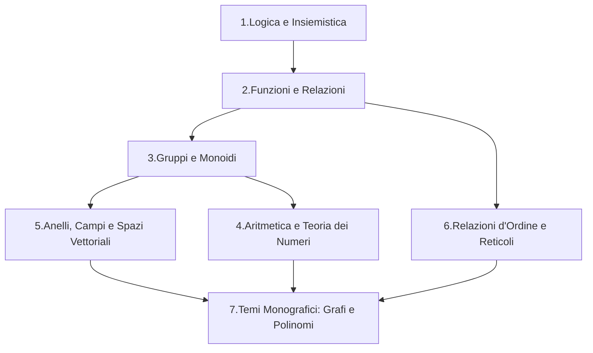
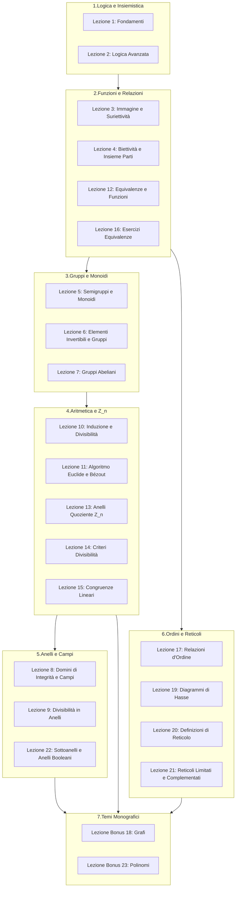
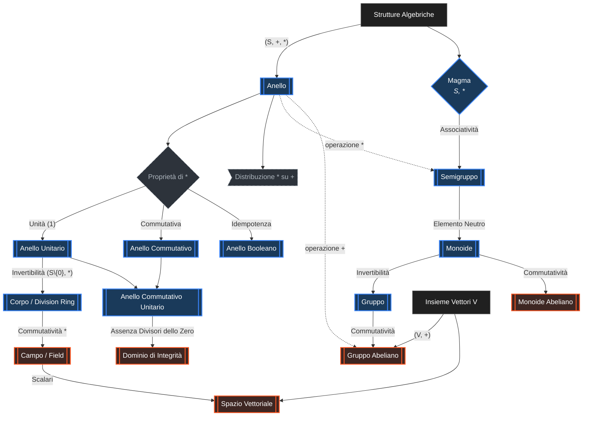

# Definizioni (checkbox)
#
### 11-03-2025
- [x] 1.1 LOGICA  
- [x] 1.2 TEORIA DEGLI INSIEMI  
- [x] 1.3 CORRISPONDENZA  
- [x] 1.4 CORRISPONDENZA OVUNQUE DEFINITA  
- [x] 1.5 CORRISPONDENZA FUNZIONALE  
- [x] 1.6 CORRISPONDENZA INIETTIVA  
- [x] 1.7 CORRISPONDENZA SURIETTIVA  

### 14-03-2025
- [x] 2.1 APPLICAZIONI  
- [x] 2.2 APPLICAZIONI IMMAGINE  
- [x] 2.3 APPLICAZIONI ANTI-IMMAGINE  
- [x] 2.4 CARATTERIZZAZIONE INIETTIVA TRAMITE APP. IMMAGINE  
- [x] 2.5 CARATTERIZZAZIONE SURIETTIVA TRAMITE APP. ANTI-IMMAGINE  
- [x] 2.6 DEFINIZIONE DI PARTIZIONE  
- [x] 2.7 PARTIZIONI BANALI  

### 18-03-2025
- [x] 3.1 APPLICAZIONI IMMAGINE E ANTI-IMMAGINE BANALI  

### 21-03-2025
- [x] 4.1 EQUIPOTENZA $\Leftrightarrow \exists f \text{ biettiva}$  
- [x] 4.2 RESTRIZIONE E PROLUNGAMENTO  
- [x] 4.3 CORRISPONDENZE E APPLICAZIONI COMPOSTE  
- [x] 4.4 COMPOSIZIONE: PROPRIETÀ (ASSOCIATIVA, NON COMMUTATIVA)  
- [x] 4.5 APPLICAZIONE IDENTITÀ  
- [x] 4.6 CORRISPONDENZA COMPLEMENTARE  
- [x] 4.7 CORRISPONDENZA INVERSA  
- [x] 4.8 FUNZIONE INVERSA  
- [x] <mark style="background:#D4AF37; color:black; padding:0 6px; border-radius:6px;">4.9 TEOREMA INVERTIBILITÀ DI FUNZIONI</mark>  
- [x] 4.10 OPERAZIONI n$\text{-arie}$  
- [x] 4.11 OPERAZIONI INTERE  
- [x] 4.12 OPERAZIONI ESTERNE  

### 25-03-2025
- [x] 5.1 FUNZIONE BIETTIVA $\mathbb{N} \to \mathbb{Z}$  
- [x] 5.2 $f: A \to B \text{ suriettiva} \Leftrightarrow f \text{ invertibile a dx ma l'inversa non è unica}$  
- [x] 5.3 $f: A \to B \text{ iniettiva} \Leftrightarrow f \text{ invertibile a sx ma l'inversa è unica}$  
- [x] 5.4 $f: A \to B \text{ biettiva} \Leftrightarrow f \text{ invertibile e inversa è unica}$  
- [x] 5.5 STRUTTURE ALGEBRICHE  
- [x] 5.6 MAGMA (CHIUSURA)  
- [x] 5.7 SEMIGRUPPO (ASSOCIATIVITÀ)  
- [x] 5.8 MONOIDE (ELEMENTO NEUTRO)  
  - [ ] ELEMENTO NEUTRO SE ESISTE È UNICO  
	  - [ ] ELEMENTO NEUTRO A DX E A SX  

### 28-03-2025
- [x] <mark style="background:#C0C0C0; color:black; padding:0 6px; border-radius:6px;">6.1 ELEMENTI SIMMETRIZZABILI: SE ESISTE SIMMETRICO È UNICO</mark>  
- [x] 6.2 $\mathcal{U}(S)$ INSIEME DEGLI ELEMENTI SIMMETRIZZABILI  
- [x] 6.3 PARTE STABILE / PARTE CHIUSA RISPETTO A UN'OPERAZIONE  
- [x] 6.4 $(S, *)$ MONOIDE, $\mathcal{U}(S)$ PARTE STABILE  
- [x] 6.5 $(S, *)$ GRUPPO SE $*$ ASSOCIATIVO, $\exists$ u NEUTRO, OGNI ELEMENTO SIMMETRIZZABILE  
- [x] 6.6 $(S, *)$ GRUPPO ABELIANO SE VALE ANCHE COMMUTATIVITÀ  

### 01-04-2025
- [x] 7.1 DEFINIZIONE ANELLO $(A, +, \cdot)$  
  - [ ] $(A, +)$ GRUPPO ABELIANO  
  - [ ] $(A, \cdot)$ SEMIGRUPPO  
  - [ ] DISTRIBUTIVA SU +  
- [x] 7.2 $1_A = 1 \Rightarrow \text{UNITÀ DI } (A, \cdot) \text{ ELEMENTO NEUTRO}$  
- [x] 7.3 $0_A = 0 \Rightarrow \text{UNITÀ DI } (A, +) \text{ ELEMENTO NEUTRO}$  
- [x] 7.4 CARATTERISTICA DI A  
- [x] 7.5 ELEMENTI CANCELLABILI (DX, SX, CANCELLABILI)  
- [x] <mark style="background:#C0C0C0; color:black; padding:0 6px; border-radius:6px;">7.6 DIVISORI DELLO 0 (DX, SX, DIVISORI DELLO 0) MAI CANCELLABILI</mark>  

### 04-04-2025
- [x] <mark style="background:#C0C0C0; color:black; padding:0 6px; border-radius:6px;">8.1 ELEMENTI SIMMETRIZZABILI $\Rightarrow$ ELEMENTI CANCELLABILI</mark>  
- [x] 8.2 DEFINIZIONE OMOMORFISMO  
- [x] 8.3 DEFINIZIONE DI INTEGRITÀ  
- [x] 8.4 DEFINIZIONE DI CORPO  
- [x] 8.5 DEFINIZIONE DI CAMPO  
- [x] 8.6 DEFINIZIONE DI $V_K$ - SPAZIO VETTORIALE  
- [x] <mark style="background:#D4AF37; color:black; padding:0 6px; border-radius:6px;">8.7 TEOREMA DI WEDDERBURN</mark>  
- [x] 8.8 DEFINIZIONE DI $\mathcal{B}(S)$  
- [x] <mark style="background:#D4AF37; color:black; padding:0 6px; border-radius:6px;">8.9 TEOREMA SCOMPOSIZIONE CANONICA DI UNA PERMUTAZIONE</mark>  
- [x] 8.10 PERMUTAZIONI INVERSE  

### 10-04-2025
- [x] 9.1 TAVOLE DI CAYLEY  
- [x] 9.2 S INSIEME FINITO  
- [x] 9.3 ELEMENTI NILPOTENTI  
- [x] 9.4 DEF. ANELLO UNITARIO  
- [x] 9.5 DEF. ELEMENTI ASSOCIATI $a \sim b$  
- [x] 9.6 DEF. DI DIVISORI BANALI  
- [x] 9.7 DEF. DIVISORI PROPRI  
- [x] 9.8 ARITMETICA IN $\mathbb{Z}$  
- [x] 9.9 DEF. MASSIMO COMUN DIVISORE (MCD)  
- [x] 9.10 DEF. MINIMO COMUNE MULTIPLO (mcm)  
- [x] 9.11 DEF. NUMERO PRIMO  
- [ ] 9.12 RELAZIONI BINARIE  
- [ ] 9.13 RELAZIONE TOTALE  
- [ ] 9.14 RELAZIONE D'IDENTITÀ  
- [ ] 9.15 RELAZIONE RIFLESSIVA (1) / ANTIRIFLESSIVA (2)  
- [ ] 9.16 RELAZIONE SIMMETRICA (3) / ASIMMETRICA (4)  
- [ ] 9.17 RELAZIONE TRANSITIVA (5)  

### 14-04-2025
- [ ] 10.1 PRINCIPIO DI INDUZIONE (PRIMA FORMA, SECONDA FORMA)  
- [ ] 10.2 INSIEME BEN ORDINATO  
- [ ] 10.3 INSIEME TOTALMENTE ORDINATO  
- [ ] 10.4 CARDINALITÀ INSIEME DELLE PARTI  
- [ ] <mark style="background:#D4AF37; color:black; padding:0 6px; border-radius:6px;">10.5 TEOREMA DELLA DIVISIONE EUCLIDEA</mark>  
- [ ] <mark style="background:#D4AF37; color:black; padding:0 6px; border-radius:6px;">10.6 TEOREMA DI BÉZOUT</mark>  
- [ ] 10.7 DEF. RELAZIONE EQUIVALENZA  
- [ ] 10.8 DEF. RELAZIONE D'ORDINE  
- [ ] 10.9 DEF. GRAFO  

### 29-04-2025
- [ ] <mark style="background:#D4AF37; color:black; padding:0 6px; border-radius:6px;">11.1 TEOREMA FONDAMENTALE SULLE RELAZIONI DI EQUIVALENZA</mark>  
- [ ] <mark style="background:#D4AF37; color:black; padding:0 6px; border-radius:6px;">11.2 TEOREMA SU RELAZIONI DI EQUIVALENZA E PARTIZIONI</mark>  
- [ ] 11.3 DEF. CONGRUENZA  
- [ ] 11.4 CONGRUENZA IN $\mathbb{Z}$  

### 06-05-2025
- [ ] <mark style="background:#D4AF37; color:black; padding:0 6px; border-radius:6px;">12.1 $\mathbb{Z}_m$ CAMPO $\Leftrightarrow m$ È PRIMO $(a, m)=1$</mark>  
- [ ] <mark style="background:#C0C0C0; color:black; padding:0 6px; border-radius:6px;">12.2 GLI ELEMENTI $\mathbb{Z}_m \neq 0$ SONO DIVISORI DELLO 0 $(a, m) \neq 1$ O INV.</mark>  
- [ ] <mark style="background:#C0C0C0; color:black; padding:0 6px; border-radius:6px;">12.3 PROPOSIZIONI CLASSI DI EQUIVALENZA NILPOTENTI</mark>  
- [ ] <mark style="background:#D4AF37; color:black; padding:0 6px; border-radius:6px;">12.4 EQUAZIONI CONGRUENZIALI</mark>  

### 09-05-2025
- [ ] 13.1 IDEMPOTENTI IN $\mathbb{Z}_m$  
- [ ] 13.2 CRITERI DI DIVISIBILITÀ  
- [ ] <mark style="background:#D4AF37; color:black; padding:0 6px; border-radius:6px;">13.3 TEOREMA ESISTENZA SOLUZIONI EQUAZIONI CONGRUENZIALI</mark>  

### 16-05-2025
- [ ] 14.1 FUNZIONE DI EULERO  
- [ ] <mark style="background:#D4AF37; color:black; padding:0 6px; border-radius:6px;">14.2 TEOREMA DI FERMAT EULERO</mark>  
- [ ] 14.3 CALCOLO COMBINATORIO  
- [ ] <mark style="background:#C0C0C0; color:black; padding:0 6px; border-radius:6px;">14.4 COEFFICIENTE BINOMIALE</mark>  
- [ ] 14.5 APPLICAZIONI INIETTIVE DA $S \to T$  
- [ ] 14.6 BINOMIO DI NEWTON  

### 20-05-2025
- [ ] 15.1 RELAZIONE D'ORDINE  
- [ ] 15.2 RELAZIONE D'ORDINE STRETTO  
- [ ] 15.3 DIAGRAMMA DI HASSE  
- [ ] 15.4 ELEMENTI MINIMALI - MASSIMALI  
- [ ] 15.5 ELEMENTI MINIMO - MASSIMO  
- [ ] 15.6 ELEMENTI MINORANTI - MAGGIORANTI  
- [ ] 15.7 ELEMENTI INFERIORI - SUPERIORI  

### 27-05-2025
- [ ] 16.1 CATENA  
- [ ] 16.2 CATENA MASSIMALE  
- [ ] 16.3 DEFINIZIONE RETICOLO $(L, \wedge, \vee)$  
  - [ ] PROP. ASSOCIATIVA  
  - [ ] PROP. COMMUTATIVA  
  - [ ] LEGGE DI ASSORBIMENTO  
  - [ ] IDEMPOTENZA $a \vee a = a \wedge a = a$  

### 30-05-2025
- [ ] 17.1 $(S, \le)$ TOTALMENTE ORDINATO $\Rightarrow$ S RETICOLO  
- [ ] 17.2 L RETICOLO FINITO $\Rightarrow$ LIMITATO  
- [ ] 17.3 RETICOLO PENTAGONALE  
- [ ] 17.4 RETICOLO TRIRETTANGOLO  
- [ ] 17.5 DEF. SOTTO RETICOLO  
- [ ] 17.6 ISOMORFISMO INSIEME ORDINATO  
- [ ] 17.7 ISOMORFISMO RETICOLARE  
- [ ] 17.8 ISOMORFISMO COMPLEMENTATO  

### 03-06-2025
- [ ] 18.1 DEF. SOTTO ANELLO  
- [ ] 18.2 PRINCIPIO DI DUALITÀ  
- [ ] <mark style="background:#D4AF37; color:black; padding:0 6px; border-radius:6px;">18.3 TEOREMA $(L, \vee, \wedge)$ DISTRIBUTIVO</mark>  
- [ ] <mark style="background:#C0C0C0; color:black; padding:0 6px; border-radius:6px;">18.4 PROPOSIZIONE</mark>  
- [ ] <mark style="background:#D4AF37; color:black; padding:0 6px; border-radius:6px;">18.5 DEF. RETICOLO BOOLEANO</mark>  
- [ ] 18.6 DEF. ALGEBRA DI BOOLE  
- [ ] <mark style="background:#D4AF37; color:black; padding:0 6px; border-radius:6px;">18.7 TEOREMA $(A, \wedge, \vee, ')$</mark>  
- [ ] 18.8 DEF. ANELLO BOOLEANO  
- [ ] <mark style="background:#D4AF37; color:black; padding:0 6px; border-radius:6px;">18.9 TEOREMA $(A, +, \cdot)$ ANELLO BOOLEANO (TEOREMA DI STONE)</mark> 
---

## Dimostrazioni (checkbox) — evidenziate

### Dimostrazioni più importanti (+) (ORO)
- [x] <mark style="background: #D4AF37; color: black; padding: 0 6px; border-radius: 6px;">4.9: Teorema Invertibilità di Funzioni</mark>
- [x] <mark style="background: #D4AF37; color: black; padding: 0 6px; border-radius: 6px;">8.7: Teorema di Wedderburn</mark>  
- [x] <mark style="background: #D4AF37; color: black; padding: 0 6px; border-radius: 6px;">8.9: Teorema di scomposizione canonica di una permutazione</mark>  
- [ ] <mark style="background: #D4AF37; color: black; padding: 0 6px; border-radius: 6px;">10.5: Teorema della divisione euclidea</mark>  
- [ ] <mark style="background: #D4AF37; color: black; padding: 0 6px; border-radius: 6px;">10.6: Teorema di Bézout</mark>  
- [ ] <mark style="background: #D4AF37; color: black; padding: 0 6px; border-radius: 6px;">11.1: Teorema fondamentale sulle relazioni di equivalenza</mark>  
- [ ] <mark style="background: #D4AF37; color: black; padding: 0 6px; border-radius: 6px;">11.2: Teorema su relazioni di equivalenza e partizioni</mark>  
- [ ] <mark style="background: #D4AF37; color: black; padding: 0 6px; border-radius: 6px;">12.1: $\mathbb{Z}_m$ campo $\Leftrightarrow m$ è primo</mark>  
- [ ] <mark style="background: #D4AF37; color: black; padding: 0 6px; border-radius: 6px;">12.4: Equazioni congruenziali</mark>  
- [ ] <mark style="background: #D4AF37; color: black; padding: 0 6px; border-radius: 6px;">13.3: Teorema di esistenza soluzioni equazioni congruenziali</mark>  
- [ ] <mark style="background: #D4AF37; color: black; padding: 0 6px; border-radius: 6px;">14.2: Teorema di Fermat-Eulero</mark>  
- [ ] <mark style="background: #D4AF37; color: black; padding: 0 6px; border-radius: 6px;">18.3: Teorema $(L, \vee, \wedge)$ distributivo</mark>  
- [ ] <mark style="background: #D4AF37; color: black; padding: 0 6px; border-radius: 6px;">18.5: Definizione reticolo Booleano</mark>  
- [ ] <mark style="background: #D4AF37; color: black; padding: 0 6px; border-radius: 6px;">18.7: Teorema $(A, \wedge, \vee, ')$</mark>  
- [ ] <mark style="background: #D4AF37; color: black; padding: 0 6px; border-radius: 6px;">18.9: Teorema di Stone (Anello Booleano)</mark>  

### Dimostrazioni meno importanti (-) (ARGENTO)
- [x] <mark style="background: #C0C0C0; color: black; padding: 0 6px; border-radius: 6px;">6.1: Elementi simmetrizzabili: se esiste il simmetrico è unico</mark>  
- [x] <mark style="background: #C0C0C0; color: black; padding: 0 6px; border-radius: 6px;">7.6: Divisioni dello zero: mai cancellabili</mark>  
- [x] <mark style="background: #C0C0C0; color: black; padding: 0 6px; border-radius: 6px;">8.1: Elementi simmetrizzabili $\Rightarrow$ elementi cancellabili</mark>  
- [ ] <mark style="background: #C0C0C0; color: black; padding: 0 6px; border-radius: 6px;">12.2: Gli elementi $\mathbb{Z}_m\neq 0$ sono divisori dello zero o invertibili</mark>  
- [ ] <mark style="background: #C0C0C0; color: black; padding: 0 6px; border-radius: 6px;">12.3: Proposizioni classi di equivalenza nilpotenti</mark>  
- [ ] <mark style="background: #C0C0C0; color: black; padding: 0 6px; border-radius: 6px;">14.4: Coefficiente binomiale</mark>  
- [ ] <mark style="background: #C0C0C0; color: black; padding: 0 6px; border-radius: 6px;">18.4: Proposizione</mark>  

# Macro aree

# Lezioni --> macroaree

# Strutture algebriche
