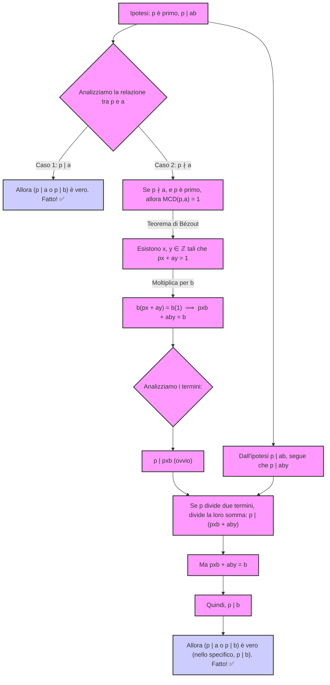

# Lezione 11: Divisione Euclidea, Bézout, FTA, Relazioni di Equivalenza

**Data:** 15/04/2025 (come da note)
**Argomenti:** Divisione Euclidea, Algoritmo Euclideo, MCD, Identità di Bézout, Algoritmo Esteso Euclideo, Teorema Fondamentale Aritmetica, Relazioni di Equivalenza, Classi di Equivalenza, Insieme Quoziente.

#tag/number-theory #tag/euclidean-algorithm #tag/bezout #tag/fta #tag/equivalence-relation #tag/equivalence-class #tag/quotient-set #tag/algebra-avanzata #tag/teorema #tag/definizione #tag/esempio

---

## 1. Aritmetica in $\mathbb{Z}$: MCD e Identità di Bézout

Approfondiamo le proprietà dei numeri interi $\mathbb{Z}$.

### 1.1 Teorema della Divisione Euclidea (Richiamo)

Questo teorema è la base per l'algoritmo di Euclide.

> [!THEOREM] Teorema della Divisione Euclidea
> Dati due interi $a, b \in \mathbb{Z}$, con $b \neq 0$, esistono **unici** due interi $q$ (quoziente) e $r$ (resto) tali che:
> $$ a = b \cdot q + r $$
> con la condizione che $0 \le r < |b|$ (il resto è non negativo e strettamente minore del valore assoluto del divisore).
> *   $r$ è anche denotato come $r = \text{rest}(a, b)$.

[[Teorema Divisione Euclidea]]

### 1.2 Algoritmo di Euclide per il MCD

Questo algoritmo permette di calcolare il Massimo Comun Divisore (MCD) tra due interi $a, b$ (non entrambi nulli) tramite divisioni successive.

**Idea:** Sfrutta la proprietà che $\text{MCD}(a, b) = \text{MCD}(b, r)$, dove $r$ è il resto della divisione di $a$ per $b$. Si continua a sostituire la coppia $(a, b)$ con $(b, r)$ finché il resto non diventa 0. L'ultimo resto **non nullo** è il MCD.

**Passaggi:**
1.  Siano $a, b \in \mathbb{Z}$ con $b \neq 0$. (Se $b=0$, $\text{MCD}(a, 0)=|a|$). Assumiamo $|a| \ge |b|$.
2.  Dividi $a$ per $b$: $a = b q_1 + r_1$, con $0 \le r_1 < |b|$.
3.  Se $r_1 = 0$, allora $b \mid a$ e $\text{MCD}(a, b) = |b|$. **STOP**.
4.  Se $r_1 \neq 0$, sostituisci $(a, b)$ con $(b, r_1)$ e ripeti dal passo 2:
    *   Dividi $b$ per $r_1$: $b = r_1 q_2 + r_2$, con $0 \le r_2 < r_1$.
5.  Se $r_2 = 0$, allora $\text{MCD}(a, b) = r_1$. **STOP**.
6.  Se $r_2 \neq 0$, sostituisci $(b, r_1)$ con $(r_1, r_2)$ e ripeti:
    *   Dividi $r_1$ per $r_2$: $r_1 = r_2 q_3 + r_3$, con $0 \le r_3 < r_2$.
7.  Continua così. Poiché i resti $r_1 > r_2 > r_3 > \dots \ge 0$ sono interi e decrescono strettamente, l'algoritmo deve terminare con un resto nullo $r_{n+1}=0$.
8.  L'ultimo resto **non nullo**, $r_n$, è $\text{MCD}(a, b)$.

[[Algoritmo di Euclide]] [[Massimo Comun Divisore]]

### 1.3 Esempio: Calcolo MCD(375, 110) (da note)

Applichiamo l'algoritmo di Euclide:
1.  $a=375, b=110$.
    $375 = 110 \cdot 3 + 45$ ($q_1=3, r_1=45$)
2.  $a=110, b=45$. ($r_1 \neq 0$)
    $110 = 45 \cdot 2 + 20$ ($q_2=2, r_2=20$)
3.  $a=45, b=20$. ($r_2 \neq 0$)
    $45 = 20 \cdot 2 + 5$ ($q_3=2, r_3=5$)
4.  $a=20, b=5$. ($r_3 \neq 0$)
    $20 = 5 \cdot 4 + 0$ ($q_4=4, r_4=0$)
5.  Il resto è 0. L'ultimo resto non nullo è $r_3 = 5$.

> [!RESULT] $\text{MCD}(375, 110) = 5$.

### 1.4 Teorema di Bézout (Identità)

Questo teorema fondamentale collega il MCD a una combinazione lineare degli interi originali.

> [!THEOREM] Teorema di Bézout
> Siano $a, b \in \mathbb{Z}$, non entrambi nulli. Allora esistono due interi $x, y \in \mathbb{Z}$ tali che:
> $$ ax + by = \text{MCD}(a, b) $$
> Questi interi $x, y$ sono detti **coefficienti di Bézout**.

*   **Dimostrazione (Idea):** Si considera l'insieme $S = \{ as + bt \mid s, t \in \mathbb{Z}, as + bt > 0 \}$. Si dimostra che $S$ non è vuoto e che il suo minimo elemento (che esiste per il principio del buon ordinamento) è proprio $d = \text{MCD}(a, b)$. Quindi esistono $x, y$ tali che $ax+by=d$.

1.  **Definizione dell'insieme $S$:**
    Consideriamo l'insieme $S$ di tutte le combinazioni lineari positive di $a$ e $b$:
    $$ S = \{ as + bt \mid s, t \in \mathbb{Z} \text{ e } as + bt > 0 \} $$

2.  **$S$ è non vuoto:**
    Poiché $a$ e $b$ non sono entrambi nulli, supponiamo senza perdita di generalità che $a \neq 0$.
    *   Se $a > 0$, allora scegliendo $s=1, t=0$, si ha $a \cdot 1 + b \cdot 0 = a > 0$. Quindi $a \in S$.
    *   Se $a < 0$, allora scegliendo $s=-1, t=0$, si ha $a \cdot (-1) + b \cdot 0 = -a > 0$. Quindi $-a \in S$.
    In entrambi i casi, $S$ contiene almeno un elemento (nello specifico, $|a| \in S$ se $a \neq 0$, e $|b| \in S$ se $b \neq 0$). Pertanto, $S \neq \emptyset$.

3.  **Esistenza di un elemento minimo in $S$:**
    $S$ è un sottoinsieme non vuoto di $\mathbb{Z}^+$ (l'insieme degli interi positivi). Per il **Principio del Buon Ordinamento**, $S$ deve contenere un elemento minimo. Sia $d$ tale elemento minimo.
    Poiché $d \in S$, per la definizione di $S$, esistono $x, y \in \mathbb{Z}$ tali che:
    $$ d = ax + by $$

4.  **Dimostriamo che $d$ divide $a$ e $d$ divide $b$:**
    *   **$d$ divide $a$**:
        Per il Teorema della Divisione Euclidea, esistono unici interi $q$ (quoziente) e $r$ (resto) tali che:
        $$ a = dq + r $$
        con $0 \le r < d$.
        Vogliamo dimostrare che $r=0$.
        Sostituendo $d = ax + by$ nell'espressione del resto:
        $$ r = a - dq = a - (ax + by)q = a - axq - byq = a(1-xq) + b(-yq) $$
        Siano $s' = 1-xq$ e $t' = -yq$. Allora $s', t' \in \mathbb{Z}$, e $r = as' + bt'$.
        Se $r > 0$, allora $r$ sarebbe un elemento di $S$ (poiché è una combinazione lineare positiva di $a$ e $b$).
        Tuttavia, $r < d$, e $d$ è l'elemento minimo di $S$. Questo è una contraddizione, poiché non può esistere un elemento in $S$ che sia positivo e strettamente minore del minimo elemento di $S$.
        Pertanto, l'ipotesi $r > 0$ deve essere falsa. Poiché $0 \le r$, ne consegue che $r=0$.
        Se $r=0$, allora $a = dq$, il che implica che $d \mid a$.

    *   **$d$ divide $b$**:
        Analogamente, applicando la Divisione Euclidea a $b$ e $d$:
        $b = dq' + r'$, con $0 \le r' < d$.
        Si ottiene $r' = b - dq' = b - (ax+by)q' = a(-xq') + b(1-yq')$.
        Se $r' > 0$, allora $r' \in S$ e $r' < d$, il che contraddice la minimalità di $d$ in $S$.
        Quindi $r'=0$, il che implica $b = dq'$, e dunque $d \mid b$.

    Abbiamo così stabilito che $d$ è un divisore comune di $a$ e $b$.

5.  **Dimostriamo che $d$ è il *massimo* comun divisore:**
    Sia $c$ un qualsiasi divisore comune di $a$ e $b$. Allora $c \mid a$ e $c \mid b$.
    Questo significa che esistono interi $k_1, k_2$ tali che $a = ck_1$ e $b = ck_2$.
    Consideriamo l'espressione di $d$:
    $$ d = ax + by $$
    Sostituendo le espressioni per $a$ e $b$:
    $$ d = (ck_1)x + (ck_2)y = c(k_1x + k_2y) $$
    Poiché $k_1, x, k_2, y$ sono interi, anche $K = k_1x + k_2y$ è un intero.
    Quindi $d = cK$, il che significa che $c \mid d$.
    Se $c$ è un divisore comune di $a$ e $b$, allora $c$ divide anche $d$.
    Per convenzione, il MCD è positivo. Poiché $d \in S$, $d > 0$. Se $c$ è un divisore comune positivo, allora $c \le d$.
    Questo dimostra che $d$ è maggiore o uguale a ogni altro divisore comune di $a$ e $b$.
    Pertanto, $d = \text{MCD}(a, b)$.

6.  **Conclusione:**
    Abbiamo dimostrato che l'elemento minimo $d$ dell'insieme $S$ è uguale a $\text{MCD}(a,b)$.
    Poiché $d = ax + by$ per alcuni $x, y \in \mathbb{Z}$ (dalla definizione di $d$ come elemento di $S$), segue che:
    $$ \text{MCD}(a, b) = ax + by $$
    Questo completa la dimostrazione dell'esistenza dei coefficienti di Bézout $x$ e $y$.

Q.E.D. (Quod Erat Demonstrandum - Ciò Che Dovevasi Dimostrare)

[[Teorema di Bézout]]

### 1.5 Algoritmo Esteso di Euclide (Trovare x, y)

Questo metodo permette di trovare i coefficienti $x, y$ dell'identità di Bézout risalendo i passaggi dell'algoritmo di Euclide.

**Passaggi:**
1.  Esegui l'algoritmo di Euclide per trovare $d = \text{MCD}(a, b)$, tenendo traccia di tutte le divisioni.
2.  Prendi l'equazione della penultima divisione, quella che ha dato $d$ come resto. Esplicita $d$ da questa equazione.
3.  Prendi l'equazione della divisione precedente. Esplicita il resto di quella divisione.
4.  Sostituisci il resto del passo 3 nell'espressione di $d$ ottenuta al passo 2. Raccogli i termini contenenti $a$ e $b$ (o i resti precedenti).
5.  Continua a risalire le equazioni dell'algoritmo di Euclide, sostituendo via via i resti precedenti e raccogliendo i termini, finché non ottieni un'espressione della forma $d = a \cdot x + b \cdot y$.

[[Algoritmo Esteso di Euclide]]

### 1.6 Esempio: Trovare x, y per MCD(375, 110) = 5 (da note)

Riprendiamo le divisioni dell'esempio 1.3:
(1) $375 = 110 \cdot 3 + 45$
(2) $110 = 45 \cdot 2 + 20$
(3) $45 = 20 \cdot 2 + 5$
(4) $20 = 5 \cdot 4 + 0$

Il MCD è 5. Partiamo dall'equazione (3) e isoliamo 5:
$5 = 45 - 20 \cdot 2$

Ora usiamo l'equazione (2) per sostituire 20. Da (2): $20 = 110 - 45 \cdot 2$.
$5 = 45 - (110 - 45 \cdot 2) \cdot 2$
$5 = 45 - 110 \cdot 2 + 45 \cdot 4$
$5 = 45 \cdot (1 + 4) - 110 \cdot 2$
$5 = 45 \cdot 5 - 110 \cdot 2$

Ora usiamo l'equazione (1) per sostituire 45. Da (1): $45 = 375 - 110 \cdot 3$.
$5 = (375 - 110 \cdot 3) \cdot 5 - 110 \cdot 2$
$5 = 375 \cdot 5 - 110 \cdot 15 - 110 \cdot 2$
$5 = 375 \cdot 5 - 110 \cdot (15 + 2)$
$5 = 375 \cdot 5 - 110 \cdot 17$
$5 = 375 \cdot (5) + 110 \cdot (-17)$

Abbiamo trovato l'identità di Bézout: $ax + by = d$ con $a=375, b=110, d=5$.
I coefficienti sono $x=5$ e $y=-17$.

> [!RESULT] $375 \cdot (5) + 110 \cdot (-17) = 5$.

### 1.7 Esempio Alternativo: MCD(100, 54) e Bézout (da lavagna)

1.  $100 = 54 \cdot 1 + 46$ ($r_1=46$)
2.  $54 = 46 \cdot 1 + 8$ ($r_2=8$)
3.  $46 = 8 \cdot 5 + 6$ ($r_3=6$)
4.  $8 = 6 \cdot 1 + 2$ ($r_4=2$)
5.  $6 = 2 \cdot 3 + 0$ ($r_5=0$)

$\text{MCD}(100, 54) = 2$.

Troviamo $x, y$ tali che $100x + 54y = 2$.
Partiamo da (4): $2 = 8 - 6 \cdot 1$
Sostituiamo 6 da (3): $6 = 46 - 8 \cdot 5$
$2 = 8 - (46 - 8 \cdot 5) \cdot 1 = 8 - 46 + 8 \cdot 5 = 8 \cdot 6 - 46 \cdot 1$
Sostituiamo 8 da (2): $8 = 54 - 46 \cdot 1$
$2 = (54 - 46 \cdot 1) \cdot 6 - 46 \cdot 1 = 54 \cdot 6 - 46 \cdot 6 - 46 \cdot 1 = 54 \cdot 6 - 46 \cdot 7$
Sostituiamo 46 da (1): $46 = 100 - 54 \cdot 1$
$2 = 54 \cdot 6 - (100 - 54 \cdot 1) \cdot 7 = 54 \cdot 6 - 100 \cdot 7 + 54 \cdot 7$
$2 = 54 \cdot (6 + 7) - 100 \cdot 7$
$2 = 54 \cdot 13 - 100 \cdot 7$
$2 = 100 \cdot (-7) + 54 \cdot (13)$

I coefficienti sono $x=-7$ e $y=13$.

> [!RESULT] $100 \cdot (-7) + 54 \cdot (13) = 2$.

### 1.8 Conseguenze e Proprietà (da note/lavagna)

Siano $a, b \in \mathbb{Z}$.
1.  $\text{MCD}(a, b)$ è definito a meno del segno (cioè, è l'insieme $\{d, -d\}$). Si prende convenzionalmente il positivo.
2.  $\text{mcm}(a, b)$ è definito a meno del segno (cioè, è l'insieme $\{m, -m\}$). Si prende convenzionalmente il positivo.
3.  $|a \cdot b| = \text{MCD}(a, b) \cdot \text{mcm}(a, b)$.
4.  Se $d \mid a$ e $d \mid b$, allora $d \mid (ax+by)$ per ogni $x, y \in \mathbb{Z}$. In particolare $d \mid \text{MCD}(a, b)$.
5.  $a, b$ sono **coprimi** (o primi tra loro) $\iff \text{MCD}(a, b) = 1$.
    *   Questo è equivalente a dire che esistono $x, y \in \mathbb{Z}$ tali che $ax+by=1$.
6.  **Lemma di Euclide:** Se $p$ è un numero primo e $p \mid (a \cdot b)$, allora $p \mid a$ oppure $p \mid b$.
    *   **Dimostrazione (Idea):** Se $p \nmid a$, allora $\text{MCD}(p, a)=1$. Per Bézout, $\exists x, y : px + ay = 1$. Moltiplichiamo per $b$: $pxb + aby = b$. Poiché $p \mid pxb$ e $p \mid aby$ (dato che $p \mid ab$), allora $p$ divide la loro somma, cioè $p \mid b$.
7.  Se $\text{MCD}(a, p)=1$ e $p$ è primo, allora $p \nmid a$.

**Cosa dice il Lemma di Euclide? (La "Regola d'Oro" dei Numeri Primi)**

Immagina i numeri primi come gli "atomi indivisibili" dei numeri interi. Il Lemma di Euclide ci dice una cosa fondamentale sul loro comportamento quando incontrano un prodotto:

> Se un numero primo $p$ divide il prodotto di due interi $a \cdot b$ (cioè $p \mid ab$),
> allora $p$ deve dividere almeno uno dei due fattori: o $p$ divide $a$ (cioè $p \mid a$) oppure $p$ divide $b$ (cioè $p \mid b$).
> (Potrebbe anche dividerli entrambi, ma ne divide *almeno uno*).

**Esempio Veloce:**
*   Sia $p=5$ (un numero primo).
*   Consideriamo il prodotto $a \cdot b = 6 \cdot 10 = 60$.
*   $5$ divide $60$ (infatti $60 = 5 \cdot 12$).
*   Il lemma ci dice che $5$ deve dividere $6$ OPPURE $5$ deve dividere $10$.
*   $5$ non divide $6$.
*   $5$ divide $10$ (infatti $10 = 5 \cdot 2$). Ecco! Il lemma è verificato.

**La Dimostrazione: Usiamo Bézout come Arma Segreta!**

Ecco come si dimostra formalmente, passo dopo passo. La strategia è considerare i due casi possibili per la relazione tra il primo $p$ e il primo fattore $a$.

**Ingredienti per la Dimostrazione:**
1.  $p$ è un numero primo.
2.  $a, b$ sono numeri interi.
3.  Sappiamo per ipotesi che $p \mid (a \cdot b)$. (Il nostro punto di partenza)
4.  Vogliamo dimostrare che: $p \mid a$ oppure $p \mid b$. (Il nostro obiettivo)
5.  **Strumento Chiave:** Il Teorema di Bézout.

**La Dimostrazione:**

Consideriamo il numero primo $p$ e l'intero $a$. Ci sono solo due possibilità per la loro relazione in termini di divisibilità (dato che $p$ è primo):

*   **Caso 1: $p$ divide $a$ (cioè $p \mid a$)**
    Se $p$ divide $a$, allora la conclusione del lemma ($p \mid a$ oppure $p \mid b$) è già soddisfatta! Non dobbiamo fare altro. Missione compiuta per questo caso.
    *Esempio:* Se $p=3$ e $ab = 6 \cdot 5 = 30$. $3 \mid 30$. Qui $3 \mid 6$, quindi siamo a posto.

*   **Caso 2: $p$ non divide $a$ (cioè $p \nmid a$)**
    Questo è il caso più interessante e dove entra in gioco la potenza di Bézout.
    Se $p$ è un numero primo e $p$ non divide $a$, qual è il loro Massimo Comun Divisore, $\text{MCD}(p, a)$?
    I divisori (positivi) di un numero primo $p$ sono solo $1$ e $p$ stesso.
    *   Se $p$ non divide $a$, allora $p$ non può essere un divisore comune di $p$ e $a$ (diverso da 1, se $a$ non è un multiplo di $p$).
    *   L'unico altro divisore positivo di $p$ è $1$. E $1$ divide qualsiasi intero, quindi $1$ divide $a$.
    *   Quindi, se $p \nmid a$, l'unico divisore comune positivo di $p$ e $a$ è $1$.
    *   Questo significa che $\text{MCD}(p, a) = 1$. Cioè, $p$ e $a$ sono **coprimi** (o primi tra loro).

    Ora che sappiamo che $\text{MCD}(p, a) = 1$, possiamo usare il **Teorema di Bézout**!
    Il Teorema di Bézout ci dice che esistono due interi $x$ e $y$ tali che:
    $$ px + ay = \text{MCD}(p, a) $$
    Sostituendo $\text{MCD}(p, a) = 1$:
    $$ px + ay = 1 $$

    Questa equazione è la nostra "arma segreta". Ora, moltiplichiamo entrambi i membri di questa equazione per $b$:
    $$ b \cdot (px + ay) = b \cdot 1 $$
    $$ pxb + aby = b $$

    Adesso analizziamo i termini a sinistra dell'uguale:
    1.  **Termine $pxb$**: Questo termine contiene $p$ come fattore. Quindi, $p$ divide $pxb$ (cioè $p \mid pxb$).
    2.  **Termine $aby$**: Ricordi l'ipotesi iniziale del lemma? Ci è stato dato che $p \mid (a \cdot b)$. Se $p$ divide $ab$, allora $p$ divide anche qualsiasi multiplo di $ab$, quindi $p$ divide $(ab)y$ (cioè $p \mid aby$).

    Abbiamo quindi che:
    *   $p$ divide il primo addendo ($pxb$).
    *   $p$ divide il secondo addendo ($aby$).

    Una proprietà fondamentale della divisibilità dice che se un numero ($p$) divide due altri numeri (nel nostro caso $pxb$ e $aby$), allora divide anche la loro somma.
    Quindi, $p$ deve dividere la somma $pxb + aby$.
    Ma abbiamo appena visto che $pxb + aby = b$.
    Dunque, concludiamo che $p \mid b$.

    Questo è esattamente ciò che volevamo dimostrare nel Caso 2! Se $p \nmid a$ (e $p \mid ab$), allora necessariamente $p \mid b$.

**Conclusione della Dimostrazione:**

Abbiamo esaminato entrambi i casi possibili:
1.  Se $p \mid a$, il lemma è vero.
2.  Se $p \nmid a$, abbiamo dimostrato (usando Bézout e l'ipotesi $p \mid ab$) che allora $p \mid b$.

In ogni situazione, se $p \mid ab$, allora $p \mid a$ oppure $p \mid b$.
Il Lemma di Euclide è dimostrato!

**Visualizziamo la Logica del Caso 2 (il più complesso):**

[[Numeri Coprimi]] [[Lemma di Euclide]]

---

## 2. Teorema Fondamentale dell'Aritmetica (FTA)

Questo teorema afferma che ogni intero (diverso da 0, 1, -1) si scompone in modo unico in fattori primi.

> [!THEOREM] Teorema Fondamentale dell'Aritmetica
> Ogni intero $a \in \mathbb{Z} \setminus \{0, 1, -1\}$ si può scrivere come prodotto di numeri primi. Tale decomposizione è **unica** a meno dell'ordine dei fattori e della sostituzione di un fattore primo $p_i$ con il suo associato $-p_i$.
> $$ a = (\pm 1) \cdot p_1^{e_1} \cdot p_2^{e_2} \cdots p_k^{e_k} $$
> dove $p_1, \dots, p_k$ sono primi positivi distinti e $e_i \ge 1$.

*   **Unicità (Osservazioni):** L'unicità significa che se abbiamo due scomposizioni in primi positivi $a = p_1 \dots p_m = q_1 \dots q_n$, allora $m=n$ e, riordinando opportunamente i $q_j$, si ha $p_i = q_i$ per ogni $i$.
*   **Ruolo del Lemma di Euclide:** Il Lemma di Euclide è cruciale per dimostrare l'unicità della fattorizzazione.

*   **Esempio:** $12 = 2 \cdot 2 \cdot 3 = 2^2 \cdot 3^1$. Le uniche altre scomposizioni (a meno dell'ordine) sono $(-2)(-2) \cdot 3$, $2 \cdot (-2) \cdot (-3)$, ecc., che usano primi associati.

[[Teorema Fondamentale dell'Aritmetica]]

---

## 3. Relazioni di Equivalenza

Un tipo speciale di relazione binaria che generalizza il concetto di "uguaglianza".

### 3.1 Definizione

Sia $\mathcal{R}$ una relazione binaria su un insieme non vuoto $S$ (cioè $G \subseteq S \times S$). $\mathcal{R}$ è una **Relazione di Equivalenza** se è contemporaneamente:
1.  **Riflessiva:** $\forall x \in S, x \mathcal{R} x$.
2.  **Simmetrica:** $\forall x, y \in S, x \mathcal{R} y \implies y \mathcal{R} x$.
3.  **Transitiva:** $\forall x, y, z \in S, (x \mathcal{R} y \land y \mathcal{R} z) \implies x \mathcal{R} z$.

[[Relazione di equivalenza]]

### 3.2 Classi di Equivalenza

Data una relazione di equivalenza $\mathcal{R}$ su $S$, per ogni elemento $a \in S$, la **classe di equivalenza** di $a$ rispetto a $\mathcal{R}$ è l'insieme di tutti gli elementi di $S$ che sono in relazione con $a$:
$$ [a]_{\mathcal{R}} = \{ x \in S \mid x \mathcal{R} a \} $$
(A volte si definisce come $\{ x \in S \mid a \mathcal{R} x \}$, ma per la simmetria le due definizioni coincidono).

[[Classe di equivalenza]]

### 3.3 Proprietà delle Classi di Equivalenza

Sia $\mathcal{R}$ una relazione di equivalenza su $S$. Valgono le seguenti proprietà fondamentali:
1.  **Non vuote:** Per ogni $a \in S$, $a \in [a]_{\mathcal{R}}$ (per riflessività), quindi $[a]_{\mathcal{R}} \neq \emptyset$.
2.  **Uguaglianza o Disgiunzione:** Per ogni $a, b \in S$, si ha:
    $$ a \mathcal{R} b \iff [a]_{\mathcal{R}} = [b]_{\mathcal{R}} $$
    Inoltre, due classi di equivalenza o sono **esattamente uguali** oppure sono **completamente disgiunte**:
    $$ [a]_{\mathcal{R}} \cap [b]_{\mathcal{R}} \neq \emptyset \implies [a]_{\mathcal{R}} = [b]_{\mathcal{R}} $$
    Equivalentemente: Se $[a]_{\mathcal{R}} \neq [b]_{\mathcal{R}}$, allora $[a]_{\mathcal{R}} \cap [b]_{\mathcal{R}} = \emptyset$.
3.  **Unione:** L'unione di tutte le classi di equivalenza distinte restituisce l'insieme originale $S$.
    $$ \bigcup_{a \in S} [a]_{\mathcal{R}} = S $$

> [!IMPORTANT] Le classi di equivalenza formano una **partizione** dell'insieme $S$. Ogni elemento di $S$ appartiene a una e una sola classe di equivalenza.

### 3.4 Insieme Quoziente

*   L'**insieme quoziente** di $S$ rispetto alla relazione di equivalenza $\mathcal{R}$, denotato $S/\mathcal{R}$, è l'insieme di **tutte** le classi di equivalenza distinte:
    $$ S/\mathcal{R} = \{ [a]_{\mathcal{R}} \mid a \in S \} $$
*   Gli elementi dell'insieme quoziente sono *insiemi* (le classi di equivalenza).

[[Insieme quoziente]]

### 3.5 Teorema: Equivalenze e Partizioni

Esiste una corrispondenza biunivoca tra le relazioni di equivalenza su $S$ e le partizioni di $S$.
1.  Ogni relazione di equivalenza $\mathcal{R}$ su $S$ **induce** una partizione di $S$ (data dall'insieme quoziente $S/\mathcal{R}$).
2.  Ogni partizione $\mathcal{F}$ di $S$ **induce** una relazione di equivalenza $\mathcal{R}_{\mathcal{F}}$ su $S$, definita da: $a \mathcal{R}_{\mathcal{F}} b \iff a \text{ e } b \text{ appartengono allo stesso blocco (elemento) } X \in \mathcal{F}$.

[[Relazioni di Equivalenza e Partizioni]]

### 3.6 Esempio: Classi di Equivalenza in P(S) (da lavagna)

Sia $S=\{a, b, c, d\}$. Consideriamo $P(S)$. Definiamo la relazione $\mathcal{R}$ su $P(S)$ come $X \mathcal{R} Y \iff X \cap \{b, c\} = Y \cap \{b, c\}$.
*   È una relazione di equivalenza? (Verifica R, S, T è lasciata come esercizio implicito). Assumiamo di sì.
*   Troviamo le classi di equivalenza. Due sottoinsiemi $X, Y$ sono nella stessa classe se hanno la stessa intersezione con $\{b, c\}$. Le possibili intersezioni sono:
    *   $\emptyset \cap \{b, c\} = \emptyset$
    *   $\{b\} \cap \{b, c\} = \{b\}$
    *   $\{c\} \cap \{b, c\} = \{c\}$
    *   $\{b, c\} \cap \{b, c\} = \{b, c\}$
*   Le classi sono determinate da queste 4 possibili intersezioni:
    *   $[\emptyset]_{\mathcal{R}} = \{ X \subseteq S \mid X \cap \{b, c\} = \emptyset \} = \{ \emptyset, \{a\}, \{d\}, \{a, d\} \}$
    *   $[\{b\}]_{\mathcal{R}} = \{ X \subseteq S \mid X \cap \{b, c\} = \{b\} \} = \{ \{b\}, \{a, b\}, \{b, d\}, \{a, b, d\} \}$
    *   $[\{c\}]_{\mathcal{R}} = \{ X \subseteq S \mid X \cap \{b, c\} = \{c\} \} = \{ \{c\}, \{a, c\}, \{c, d\}, \{a, c, d\} \}$
    *   $[\{b, c\}]_{\mathcal{R}} = \{ X \subseteq S \mid X \cap \{b, c\} = \{b, c\} \} = \{ \{b, c\}, \{a, b, c\}, \{b, c, d\}, \{a, b, c, d\}=S \}$
*   L'insieme quoziente $P(S)/\mathcal{R}$ ha 4 elementi (queste 4 classi).

---

> [!SUMMARY] Riepilogo Veloce Lezione 11
> *   Abbiamo visto l'**Algoritmo di Euclide** per calcolare il MCD e l'**Algoritmo Esteso** per trovare i coefficienti dell'**Identità di Bézout** ($ax+by=d$).
> *   Abbiamo richiamato le **conseguenze** su coprimalità e il **Lemma di Euclide**.
> *   Abbiamo enunciato il **Teorema Fondamentale dell'Aritmetica** (fattorizzazione unica in primi).
> *   Abbiamo definito le **Relazioni di Equivalenza** (Riflessiva, Simmetrica, Transitiva).
> *   Abbiamo definito le **Classi di Equivalenza** $[a]_{\mathcal{R}}$ e visto che **partizionano** l'insieme.
> *   Abbiamo definito l'**Insieme Quoziente** $S/\mathcal{R}$ come l'insieme delle classi di equivalenza.
> *   Abbiamo enunciato la corrispondenza tra relazioni di equivalenza e partizioni.

> [!TIP] Prossimi Passi
> *   Fai pratica con l'algoritmo esteso di Euclide per trovare i coefficienti di Bézout.
> *   Assicurati di aver compreso le proprietà R, S, T e come verificare se una relazione è di equivalenza.
> *   Cerca di capire bene cosa sono le classi di equivalenza e l'insieme quoziente, magari con esempi concreti (es. congruenza modulo n).