# Risposte alle Domande di Sistemi Operativi

---

## 1. GESTIONE MEMORIA E THRASHING

### Domanda: Cosa si intende per thrashing? Descrivere schematicamente la problematica.

> **Risposta:** 
> 
> Il thrashing è una situazione critica che si verifica quando il sistema operativo spende più tempo a gestire page fault e operazioni di swap su disco che a eseguire effettivamente i processi. Questo accade quando il working set totale dei processi attivi supera la memoria fisica disponibile. Di conseguenza, il sistema entra in un ciclo vizioso dove:
> 1. Un processo richiede una pagina non presente in RAM
> 2. Si verifica un page fault e il SO deve caricare la pagina dal disco
> 3. Per fare spazio, il SO deve scrivere un'altra pagina su disco (se modificata)
> 4. Le operazioni di I/O disco sono molto lente
> 5. Nel frattempo, altri processi generano altri page fault
> 6. L'utilizzo della CPU crolla drammaticamente (solo 10-20%)
> 7. Il throughput del sistema diminuisce drasticamente
> 
> Questo problema è particolarmente grave perché il SO tenta di migliorare la situazione aumentando la multiprogrammazione, ma questo peggiora ulteriormente il thrashing poiché ogni nuovo processo riduce la memoria disponibile per gli altri.

**Schema:**

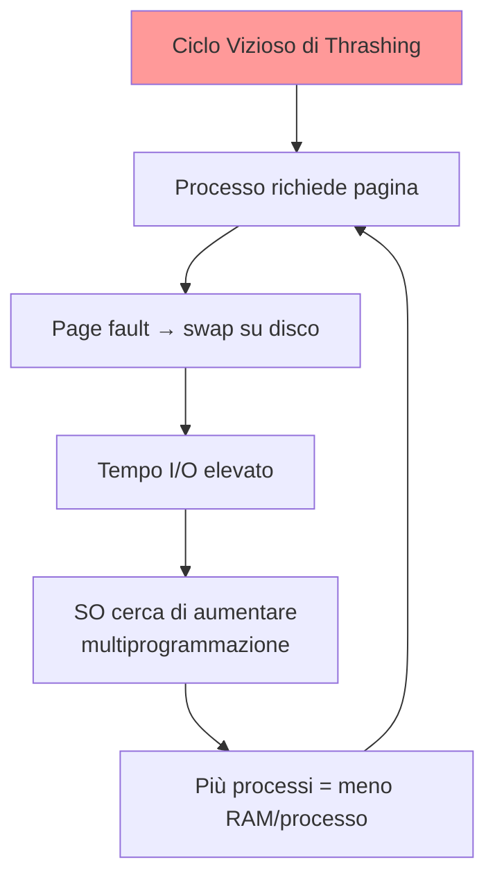

---

### Domanda: Descrivere il problema del thrashing discutendo le strategie per prevenirlo.

> **Risposta:**
>
> Il thrashing rappresenta un problema critico poiché il sistema entra in uno stato di paralisi virtuale. Per prevenirlo, il SO deve implementare diverse strategie:
>
> 1. **Monitoraggio del Working Set:** Il SO traccia continuamente l'insieme di pagine attivamente utilizzate da ogni processo. Se il working set di un processo supera lo spazio RAM disponibile, il processo viene sospeso temporaneamente.
>
> 2. **Controllo della Multiprogrammazione:** Limitare il numero di processi in memoria simultaneamente. Solo quando la memoria si libera (processo termina), un nuovo processo può essere caricato. Questo garantisce che ogni processo abbia abbastanza frame.
>
> 3. **Page Fault Frequency (PFF):** Monitorare la frequenza dei page fault per processo. Se è troppo alta, allocare più frame; se è bassa, ridurre frame allocati. Questo equilibra il carico.
>
> 4. **Preemption Intelligente:** Se il working set cresce oltre la memoria disponibile, il SO deve rimuovere selettivamente alcuni processi dalla memoria e sospenderli completamente.
>
> 5. **Algoritmi di Sostituzione Efficienti:** Usare algoritmi come LRU che mantengono in memoria le pagine più probabilmente necessarie prossimamente.

---

### Domanda: Descrivere schematicamente come viene gestito un page fault.

> **Risposta:**
>
> Quando una CPU tenta di accedere a una pagina non presente in RAM, il Memory Management Unit (MMU) genera un'eccezione di page fault. Il processo di gestione segue questi step:
>
> 1. **Trap al SO:** L'MMU interrompe l'esecuzione del processo e trasferisce il controllo al kernel del SO (context switch automatico).
>
> 2. **Identificazione della Pagina:** Il SO esamina il page fault e identifica quale pagina è stata richiesta consultando la page table.
>
> 3. **Ricerca Frame Libero:** Il SO verifica se ci sono frame disponibili in RAM.
>    - Se SÌ: procedi al caricamento diretto
>    - Se NO: applica un algoritmo di sostituzione pagina (LRU, FIFO, ecc.)
>
> 4. **Sostituzione Pagina (se necessario):** Se la pagina da rimuovere è stata modificata (dirty bit = 1), deve essere scritta su disco prima di essere scaricata.
>
> 5. **Caricamento Pagina:** Il SO emette una richiesta I/O al disco per caricare la pagina mancante. Questo è il momento più costoso (millisecondi).
>
> 6. **Aggiornamento Page Table:** Una volta caricata, la page table entry viene aggiornata (present bit = 1) e l'indirizzo del frame viene registrato.
>
> 7. **Invalidazione TLB:** Il TLB (Translation Lookaside Buffer) viene invalidato per le entry obsolete.
>
> 8. **Ripresa Processo:** Il processo viene ripreso e l'istruzione che ha causato il fault viene riexecutata.

**Schema:**

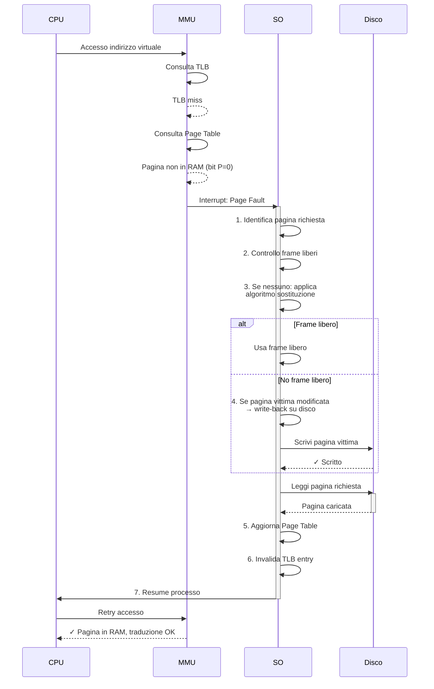

---

### Domanda: Discutere cosa si intende per località di un processo e come si può rappresentare.

> **Risposta:**
>
> La **località** di un processo è la proprietà osservata sperimentalmente secondo cui un processo tende ad accedere a un piccolo insieme di pagine (detto **working set**) in un breve intervallo di tempo. Questo fenomeno è fondamentale per la gestione della memoria virtuale.
>
> **Tipi di Località:**
>
> 1. **Località Temporale:** Se una pagina è stata accessa di recente, probabilità elevata di accedervi di nuovo a breve. Ad esempio, i cicli di codice vengono eseguiti ripetutamente.
>
> 2. **Località Spaziale:** Se si accede a una pagina P, è probabile accedere presto a pagine adiacenti (P-1, P+1). Esempio: array sequenziali, stack che cresce.
>
> **Rappresentazione: Working Set WS(t, Δ):**
>
> Il working set al tempo t con finestra Δ è l'insieme di tutte le pagine accesse negli ultimi Δ accessi ai tempi precedenti a t. Formalmente: WS(t, Δ) = {pagine accesse in [t-Δ, t]}
>
> **Proprietà del Working Set:**
> - Inizialmente cresce man mano che il processo accede a diverse pagine
> - Si stabilizza in uno steady-state durante l'esecuzione di una "fase" del programma
> - Diminuisce quando il processo cambia fase (ad esempio da input processing a output processing)
> - Se |WS| ≤ RAM disponibile → NO thrashing
> - Se |WS| > RAM disponibile → THRASHING garantito
>
> Questa rappresentazione consente al SO di predire il comportamento di accesso e di gestire proattivamente la memoria allocando frame sufficienti ai processi con working set grande.

**Schema:**

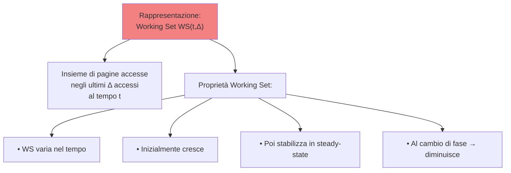

---

### Domanda: Descrivere schematicamente il layout di memoria di un processo.

> **Risposta:**
>
> Lo spazio di indirizzamento virtuale di un processo è organizzato in segmenti con layout specifico, dal basso all'alto (indirizzi crescenti):
>
> 1. **Text Segment (Code):** Contiene il codice eseguibile del programma. È read-only e non cresce. Tutte le istruzioni macchina compilate risiedono qui.
>
> 2. **Data Segment (Initialized Data):** Contiene variabili globali e static che sono esplicitamente inizializzate nel codice sorgente. Non si modifica dopo il caricamento.
>
> 3. **BSS Segment (Block Started by Symbol):** Contiene variabili globali e static NON inizializzate. È un'ottimizzazione: il SO non alloca realmente pagine, ma traccia solo la dimensione.
>
> 4. **Heap:** Cresce verso indirizzi alti. Allocato dinamicamente via malloc/new durante l'esecuzione. Il programmatore è responsabile della deallocazione.
>
> 5. **Spazio Libero:** Una grande area non utilizzata tra Heap e Stack.
>
> 6. **Stack:** Cresce verso indirizzi bassi (direzione opposta all'heap). Contiene variabili locali, parametri di funzione, indirizzi di ritorno, frame pointer. Gestito automaticamente dal SO/compilatore.
>
> Ogni segmento ha protezione della memoria (read, write, execute) gestita dall'MMU attraverso i bit di protezione nella page table.

**Schema:**

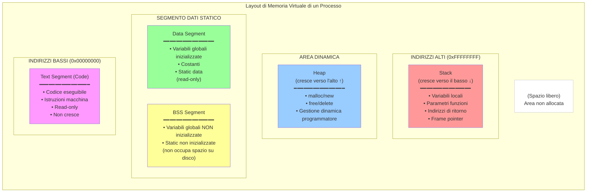

---

### Domanda: Spiegare brevemente la differenza tra indirizzo fisico ed indirizzo virtuale.

> **Risposta:**
>
> **Indirizzo Virtuale (VA):**
> - Generato dalla CPU durante l'esecuzione del programma
> - È la visione logica dello spazio di memoria dal punto di vista del processo
> - Sempre contiguo e lineare per il processo (0x00000000 a 0xFFFFFFFF su architettura 32-bit)
> - Completamente indipendente dagli altri processi in esecuzione
> - Può essere più grande della RAM fisica disponibile
> - Viene tradotto dall'MMU utilizzando la page table
>
> **Indirizzo Fisico (FA):**
> - Indirizzo reale della memoria RAM
> - Rappresenta la posizione effettiva del dato nella memoria fisica
> - Potenzialmente frammentato nello spazio fisico
> - Condiviso tra tutti i processi (il SO isola gli accessi tramite protezione memoria)
> - Limitato dalla quantità di RAM disponibile
> - Generato dall'MMU come risultato della traduzione VA → FA
>
> **Processo di Traduzione:**
> Il numero di pagina virtuale è usato come indice nella page table per trovare il numero di frame fisico. L'offset di pagina (ultimi bit) rimane identico nella traduzione. Quindi: FA = (NumeroFrame * DimensionePagina) + Offset

**Schema:**

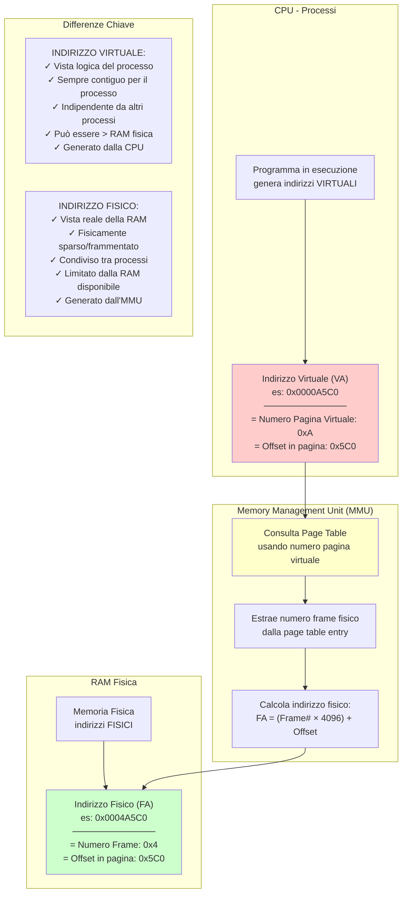

---

### Domanda: In una memoria paginata, descrivere le strategie di gestione della memoria libera, discutendo il ruolo degli algoritmi di sostituzione di pagina.

> **Risposta:**
>
> La gestione della memoria libera in un sistema paginato si basa su due componenti principali:
>
> **1. Monitoraggio della Memoria Libera:**
> - Mantenere una **Free List** di frame non allocati
> - Usare un **bitmap** dove ogni bit rappresenta uno frame (0=libero, 1=occupato)
> - Usare una **linked list** di frame liberi collegati tra loro
> - Un daemon di paging periodicamente libera frame invalidandoli
>
> **2. Quando arriva un Page Fault:**
> - Controllare se ci sono frame liberi disponibili
> - Se SÌ: allocare il frame libero senza fare nulla
> - Se NO: applicare un algoritmo di sostituzione pagina
>
> **Algoritmi di Sostituzione Pagina:**
>
> a) **FIFO (First In First Out):**
>    - Rimuove la pagina che è stata caricata per prima in memoria
>    - Semplice da implementare
>    - Problema: **Anomalia di Belady** (aumentare frame non sempre riduce page fault)
>
> b) **Optimal (Belady):**
>    - Rimuove la pagina che non sarà usata per il tempo più lungo in futuro
>    - Migliore prestazione teorica
>    - Impossibile implementare: richiede conoscenza futura
>    - Usato come benchmark per valutare altri algoritmi
>
> c) **LRU (Least Recently Used):**
>    - Rimuove la pagina non accessa da più tempo
>    - Approssima bene l'Optimal sfruttando località
>    - Costoso: richiede timestamp per ogni pagina
>    - Varianti: stack, matrice, contatore di tempo logico
>
> d) **Clock/Second-Chance:**
>    - Usa bit di riferimento (reference bit) in ogni pagina table entry
>    - Quando bit = 1: pagina è stata accessa di recente
>    - Quando bit = 0: pagina non accessa
>    - Agisce come una "lancetta d'orologio" sulla lista di pagine
>    - Azzera il bit quando passa; rimuove quando lo trova già a 0
>    - Efficiente e pratico
>
> e) **NRU (Not Recently Used):**
>    - Classifica pagine in 4 categorie usando bit R (reference) e M (modified)
>    - Classe 0: R=0, M=0 (non usata, non modificata) ← preferita da rimuovere
>    - Classe 1: R=0, M=1
>    - Classe 2: R=1, M=0
>    - Classe 3: R=1, M=1
>    - Veloce, buone prestazioni

**Schema:**

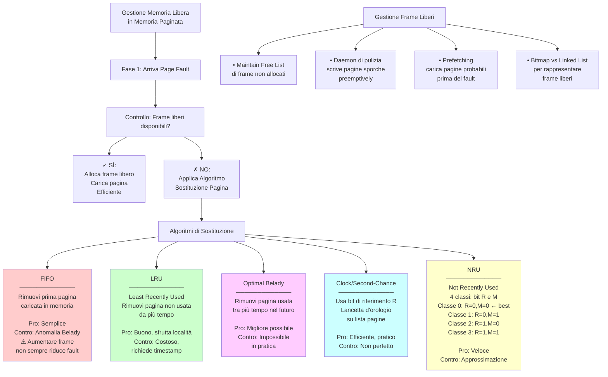

---

## 2. FILE SYSTEM

### Domanda: Spiegare brevemente quali sono i vantaggi dell'uso del journaling per il file system.

> **Risposta:**
>
> Il **journaling** nel file system è una tecnica che registra tutte le operazioni di modifica su un "journal" (log) prima di eseguirle effettivamente nel file system. Questo fornisce protezione contro la perdita di dati e corruzione in caso di crash del sistema.
>
> **Come funziona:**
> 1. Prima di modificare metadati o dati, l'operazione viene scritta nel journal
> 2. L'operazione viene eseguita sulla struttura effettiva del file system
> 3. Una volta completata con successo, l'operazione viene marcata come "committed" nel journal
> 4. Se il sistema crasha, al riavvio il SO rilegge il journal e completa le operazioni incomplete
>
> **Vantaggi del Journaling:**
>
> 1. **Recovery Veloce:** Dopo un crash, non è necessario scansionare l'intero file system. Il SO riproduce semplicemente il journal (pochi secondi vs. minuti/ore con fsck).
>
> 2. **Integrità Garantita:** Le operazioni nel journal sono atomiche dal punto di vista della consistenza. O un'operazione è completata interamente o non lo è affatto.
>
> 3. **Riduce Tempo fsck:** Elimina la necessità di effettuare verifiche complete (fsck) dopo ogni crash anomalo.
>
> 4. **Minimizza Perdita Dati:** È possibile identificare esattamente quale operazione era in corso e ripeterla.
>
> 5. **Affidabilità:** Il sistema garantisce sempre di trovarsi in uno stato coerente e noto dopo il recovery.
>
> 6. **Prestazioni Migliori:** Con journaling ordered, le escritture di dati avvengono prima di quelle di metadati, evitando inconsistenze.

**Schema:**

```mermaid
graph TD
    A["JOURNALING nel File System"] --> B["Problema SENZA Journaling:<br/>─────────────────────<br/>Crash durante operazione FS<br/>↓<br/>Inconsistenza strutture dati<br/>↓<br/>Corruzione file system<br/>↓<br/>Perdita dati"]
    
    C["Soluzione: JOURNALING"] --> C1["Step 1: BEFORE modifica<br/>─────────────────<br/>Scrivi operazione<br/>nel JOURNAL<br/><br/>Esempio: 'Delete block 512<br/>             Update inode 42'"]
    
    C --> C2["Step 2: DURING esecuzione<br/>─────────────────<br/>Esegui operazione<br/>su FS effettivo"]
    
    C --> C3["Step 3: AFTER successo<br/>─────────────────<br/>Marca operazione<br/>come COMMITTED<br/>nel JOURNAL"]
    
    D["Vantaggi del Journaling"] --> D1["✓ Recovery Veloce<br/>Dopo crash:<br/>replay journal in secondi<br/>NO necessità di fsck<br/>(che impiega ore)"]
    
    D --> D2["✓ Integrità FS Garantita<br/>Operazioni sono atomiche<br/>dal punto di vista journal<br/>NO stati intermedi corrotti"]
    
    D --> D3["✓ Riduce fsck Time<br/>Scansione intera FS<br/>NON necessaria<br/>Recupero veloce"]
    
    D --> D4["✓ Minimizza Perdita Dati<br/>Operazioni incomplete<br/>sono identificabili<br/>possono essere riapplicate"]
    
    D --> D5["✓ Affidabilità<br/>Sistema recupera sempre<br/>stato coerente noto<br/>No corruzione silenziosa"]
    
    D --> D6["✓ Prestazioni<br/>Journaling ordered:<br/>dati prima di metadati<br/>= evita inconsistenze"]
    
    style B fill:#ff9999
    style D fill:#99ff99
```

---

### Domanda: Spiegare brevemente vantaggi e svantaggi dei metodi di allocazione dei file contigua, concatenata e indicizzata.

> **Risposta:**
>
> **1. Allocazione Contigua:**
> File allocato in blocchi consecutivi sul disco.
>
> Vantaggi:
> - Accesso VELOCE: accesso random diretto al blocco i
> - Pochi accessi al disco: una sola ricerca cilindro + latenza rotatoria
> - Semplice implementazione: solo numero primo blocco e lunghezza
>
> Svantaggi:
> - **Frammentazione ESTERNA**: Nel tempo, disco ha buchi tra file
> - Espansione difficile: se file cresce, spazio contiguo potrebbe non esistere
> - Compattazione costosa: riorganizzazione periodica per ridurre frammentazione
> - Non flessibile per file di dimensione variabile
>
> **2. Allocazione Concatenata (Linked List):**
> File è una lista collegata di blocchi sparsi nel disco.
>
> Vantaggi:
> - **NO frammentazione esterna**: blocchi possono essere ovunque
> - Espansione facile: aggiungere blocco alla fine della lista
> - Utilizzo memoria efficiente: nessuno spazio sprecato
> - Flessibile per file di qualsiasi dimensione
>
> Svantaggi:
> - Accesso **SEQUENZIALE LENTO**: per raggiungere blocco 1000, serve attraversare 1000 pointer
> - Accesso random IMPOSSIBILE praticamente
> - Pointer overhead: ogni blocco contiene pointer al prossimo (es. 4 byte su 4096)
> - Affidabilità: se un pointer corrompe, resto del file è inaccessibile
> - Lettore di pointer da disco per ogni blocco = lento
>
> **3. Allocazione Indicizzata:**
> File ha un inode (o blocco indice) che contiene puntatori a tutti i blocchi dati.
>
> Vantaggi:
> - Accesso **RANDOM VELOCE**: indirizzo diretto da inode a blocco i
> - **NO frammentazione esterna**: blocchi possono essere ovunque
> - Espansione facile: aggiungere nuovo puntatore all'inode
> - Buon compromesso tra FIFO e concatenata
> - Affidabilità: corruzione di un puntatore = solo quel blocco è perso
>
> Svantaggi:
> - Overhead inode: spazio extra per memorizzare puntatori
> - Complessità implementazione: inode, indirect block, ecc.
> - Inode sparse: se file piccolo, molti puntatori inutilizzati
> - Limite blocchi per file: dipende da dimensione inode
> - Accesso indiretto: sempre due accessi a disco (inode + blocco dati)

**Schema:**

```mermaid
graph TB
    subgraph CONTIGUA["ALLOCAZIONE CONTIGUA<br/>Blocchi Consecutivi"]
        direction TB
        C1["✓ VANTAGGI:"]
        C1 --> C1A["• Accesso VELOCE random"]
        C1 --> C1B["  VA a blocco i: una ricerca"]
        C1 --> C1C["• Poche operazioni I/O"]
        C1 --> C1D["• Semplice implementazione"]
        C1 --> C1E["  Solo: primo_blocco, lunghezza"]
        
        C2["✗ SVANTAGGI:"]
        C2 --> C2A["• Frammentazione ESTERNA"]
        C2 --> C2B["  Nel tempo: buchi tra file"]
        C2 --> C2C["• Espansione difficile"]
        C2 --> C2D["• Compattazione costosa"]
    end
    
    subgraph CONCATENATA["ALLOCAZIONE CONCATENATA<br/>Lista Collegata"]
        direction TB
        CC1["✓ VANTAGGI:"]
        CC1 --> CC1A["• NO frammentazione esterna"]
        CC1 --> CC1B["  Blocchi ovunque nel disco"]
        CC1 --> CC1C["• Facile espandere file"]
        CC1 --> CC1D["• Utilizzo memoria efficiente"]
        CC1 --> CC1E["• Flessibile per qualsiasi size"]
        
        CC2["✗ SVANTAGGI:"]
        CC2 --> CC2A["• Accesso SEQUENZIALE LENTO"]
        CC2 --> CC2B["  Per blocco 1000: 1000 salti"]
        CC2 --> CC2C["• Accesso random IMPOSSIBILE"]
        CC2 --> CC2D["• Pointer overhead"]
        CC2 --> CC2E["• Affidabilità: pointer corrotto"]
        CC2 --> CC2F["  = blocchi successivi persi"]
    end
    
    subgraph INDICIZZATA["ALLOCAZIONE INDICIZZATA<br/>i-node/FAT"]
        direction TB
        CI1["✓ VANTAGGI:"]
        CI1 --> CI1A["• Accesso RANDOM VELOCE"]
        CI1 --> CI1B["  Puntatore diretto da inode"]
        CI1 --> CI1C["• NO frammentazione esterna"]
        CI1 --> CI1D["• Espansione file facile"]
        CI1 --> CI1E["• Buon compromesso"]
        CI1 --> CI1F["• Affidabilità: corruzione"]
        CI1 --> CI1G["  isolata a un blocco"]
        
        CI2["✗ SVANTAGGI:"]
        CI2 --> CI2A["• Overhead i-node"]
        CI2 --> CI2B["  Spazio per puntatori"]
        CI2 --> CI2C["• Complessità implementazione"]
        CI2 --> CI2D["• I-node sparse"]
        CI2 --> CI2E["  File piccolo = puntatori vuoti"]
        CI2 --> CI2F["• Limite blocchi per file"]
    end
    
    style C1 fill:#99ff99
    style C2 fill:#ff9999
    style CC1 fill:#99ff99
    style CC2 fill:#ff9999
    style CI1 fill:#99ff99
    style CI2 fill:#ffcc99
```

---

### Domanda: Un file di grandi dimensioni viene modificato frequentemente in più punti. Quale metodo di allocazione tra concatenata, indicizzata o contigua è più adatto e perché?

> **Risposta:**
>
> **Risposta: ALLOCAZIONE INDICIZZATA è la scelta migliore.**
>
> **Analisi dei requisiti:**
> - File di GRANDI DIMENSIONI
> - Modifiche FREQUENTI
> - In MULTIPLI PUNTI (non sequenziale)
>
> **Perché NON le altre:**
>
> 1. **Contigua:** 
>    - Non adatta perché file grande
>    - Espansione problematica (dove aggiungere blocchi?)
>    - Frammentazione dopo ripetute modifiche
>    - Compattazione costosa e frequente
>
> 2. **Concatenata:**
>    - **PROBLEMA CRITICO:** Accesso sequenziale
>    - Per modificare blocco 5000, serve accedere sequenzialmente agli 5000 blocchi precedenti
>    - Con modifiche frequenti in multipli punti: 5000 × numero_modifiche accessi sequenziali
>    - Completamente inaccettabile in performance
>
> **Perché INDICIZZATA è ideale:**
>
> - **Accesso Random Veloce:** Usando l'inode, si accede direttamente al blocco da modificare senza attraversare blocchi precedenti
> - **Modifiche in multipli punti:** Ogni punto di modifica è raggiungibile indipendentemente in O(1)
> - **Nessuna frammentazione esterna:** Blocchi sparsi non sono problema
> - **Espansione facile:** Se file cresce, aggiungere puntatori all'inode
> - **Performance consistente:** Sia che si modifichi blocco 10 che blocco 10000, tempo accesso è uguale
>
> **Concretamente:** Se file è 1GB (262144 blocchi di 4KB) e ha 100 modifiche in punti casuali:
> - Concatenata: 262144 × 100 = 26M accessi sequenziali (ore)
> - Indicizzata: 100 accessi random (millisecondi)

**Schema:**

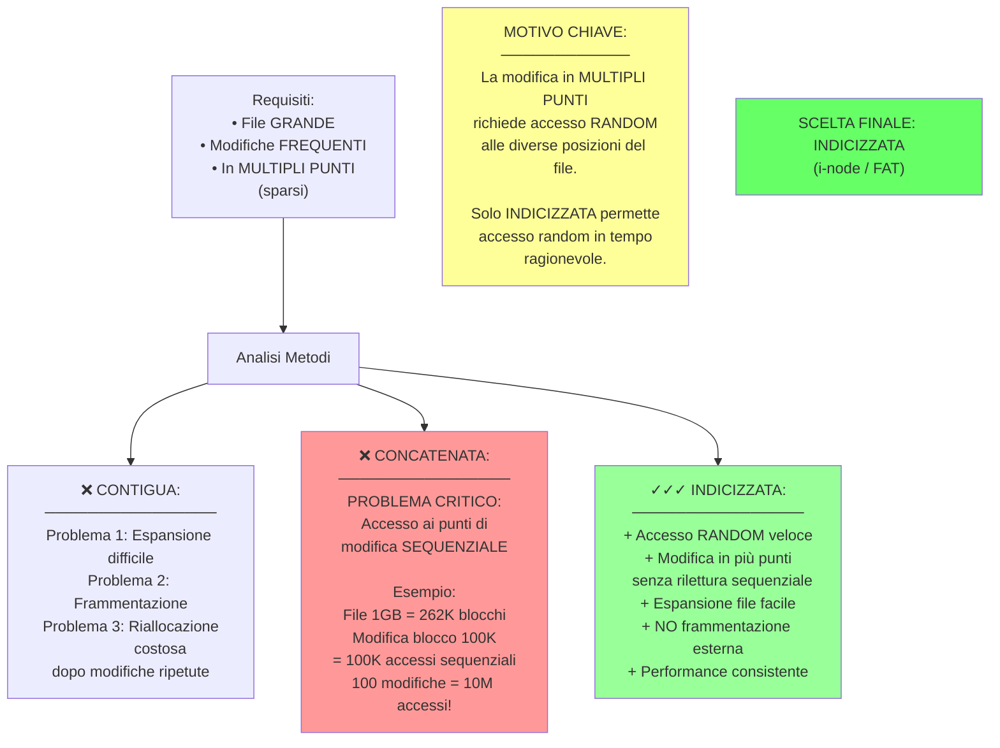

---

### Domanda: Descrivere schematicamente le strutture dati principali utilizzate dal sistema operativo per la gestione del file system.

> **Risposta:**
>
> Il file system si serve di due categorie di strutture dati: alcune risiedo su disco (persistenti), altre in RAM (volatili).
>
> **STRUTTURE SU DISCO:**
>
> 1. **Boot Block:** Primo blocco del disco, contiene il codice di bootstrap per avviare il SO e parametri fondamentali del file system.
>
> 2. **Superblock:** Contiene metadati critici del file system:
>    - Dimensione totale del file system
>    - Numero di inode totali
>    - Numero di blocchi liberi
>    - Dimensione blocco (es. 4096 byte)
>    - Dimensione inode
>    - Timestamp creazione FS
>
> 3. **Inode Array:** Uno inode per ogni file/directory. L'inode contiene:
>    - Metadati: permessi, owner, timestamp
>    - Conteggio link (hard link)
>    - Puntatori ai blocchi dati (diretti + indiretti)
>    - Tipo di file (file, directory, link)
>
> 4. **Data Blocks:** La massa dei dati (99% dello spazio disco). Contiene il contenuto effettivo di file e directory.
>
> 5. **Free Block List/Bitmap:** Traccia quale blocchi sono liberi:
>    - Bitmap: ogni bit = uno blocco (0=libero, 1=occupato)
>    - Linked List: blocchi liberi collegati tra loro
>
> **STRUTTURE IN RAM:**
>
> 1. **Inode Table (RAM):** Cache degli inode aperti. Versione in-memory degli inode da disco, con campi aggiuntivi:
>    - Contatore reference (quanti processi accedono)
>    - Dirty bit (modificato in RAM ma non scritto su disco)
>    - Lock per accesso concorrente
>
> 2. **Open File Table (per processo):** Tabella file descriptor di ogni processo:
>    - Indice file descriptor (0, 1, 2...)
>    - Puntatore all'inode aperto
>    - Offset lettura/scrittura corrente
>    - Flag di accesso (lettura, scrittura, append)
>
> 3. **Global Open File Table:** Tabella globale (SO-level) di tutti i file aperti:
>    - Conteggio riferimenti (quanti processi hanno il file aperto)
>    - Mode (lettura, scrittura, read-write)
>    - Protezione accesso (semafori)
>
> 4. **Directory Cache:** Cache delle entry di directory per accelerare lookup:
>    - Mapping nome_file → numero_inode
>    - Mantiene recenti conversioni path → inode
>
> 5. **Buffer Cache:** Cache di blocchi disco per ridurre I/O:
>    - Copia dei blocchi letti recentemente
>    - Scritto-back lazy: accumula scritture, poi flasha su disco
>    - LRU eviction quando pieno

**Schema:**

```mermaid
graph TD
    A["STRUTTURE DATI FILE SYSTEM"] --> B["STRUTTURE SU DISCO<br/>Persistenti"]
    A --> B2["STRUTTURE IN RAM<br/>Volatili (cache/temp)"]
    
    B --> B1["Boot Block<br/>─────────────<br/>• Codice bootstrap<br/>• Parametri FS<br/>• Dimensione settori"]
    
    B --> B3["Superblock<br/>─────────────<br/>• Dimensioni FS totali<br/>• Numero inode totali<br/>• Numero blocchi totali<br/>• Numero blocchi liberi<br/>• Dimensione blocco<br/>• Timestamp creazione FS<br/>• Contatore accessi"]
    
    B --> B4["Inode Array<br/>─────────────<br/>• Un inode per file<br/>• Metadati file:<br/>  - Permessi (rwx)<br/>  - Owner (uid/gid)<br/>  - Timestamp (atime,mtime,ctime)<br/>  - Conteggio link<br/>• Puntatori blocchi dati:<br/>  - Puntatori diretti<br/>  - Puntatori indiretti"]
    
    B --> B5["Data Blocks<br/>─────────────<br/>• Contenuto file<br/>• ~99% dello spazio disco<br/>• Allocati dinamicamente"]
    
    B --> B6["Free Block List/Bitmap<br/>─────────────<br/>• Bitmap: 1 bit per blocco<br/>  (0=libero, 1=occupato)<br/>• Linked List: blocchi liberi<br/>  collegati tra loro<br/>• Traccia memoria disponibile"]
    
    B2 --> C1["Inode Table RAM<br/>─────────────<br/>• Cache inode aperti<br/>• Copia volatile di inode<br/>  con fields aggiuntivi:<br/>  - Reference count<br/>  - Dirty bit<br/>  - Lock mutex<br/>  - Buffer pointer"]
    
    B2 --> C2["Open File Table<br/>Per Processo<br/>─────────────<br/>• File descriptor array<br/>  (0, 1, 2, 3...)<br/>• Per ogni FD:<br/>  - Puntatore a inode<br/>  - Offset read/write<br/>  - Flag (R/W/RW)<br/>  - Mode (blocking/non-block)"]
    
    B2 --> C3["Global Open File Table<br/>SO-level<br/>─────────────<br/>• Tutti file aperti<br/>• Per ogni entry:<br/>  - Reference count<br/>  - Mode (R/W/RW)<br/>  - Offset condiviso<br/>  - Protezione (semaforo)"]
    
    B2 --> C4["Directory Cache<br/>─────────────<br/>• Cache entry directory<br/>• Mapping nome → inode#<br/>• Accelera lookup path<br/>• LRU eviction"]
    
    B2 --> C5["Buffer Cache<br/>─────────────<br/>• Cache blocchi disco<br/>• Copia blocchi letti<br/>• Scritto-back lazy<br/>• LRU replacement<br/>• Riduce I/O disco"]
    
    style B fill:#ffcccc
    style B2 fill:#ccffcc
```

---

## 3. SINCRONIZZAZIONE E ARCHITETTURA

### Domanda: Cos'è un read-write lock? Discutere brevemente il problema dei lettori e scrittori (illustrandone una soluzione).

> **Risposta:**
>
> Un **Read-Write Lock** è un meccanismo di sincronizzazione che permette accesso CONCORRENTE ai lettori ma accesso ESCLUSIVO agli scrittori. Questo è più granulare di un semplice mutex.
>
> **Proprietà:**
> - Lettori multipli POSSONO accedere contemporaneamente alla risorsa
> - Uno scrittore DEVE accedere in esclusiva (nessun altro lettore/scrittore)
> - Lettore + scrittore = mutua esclusione (non possono contemporaneamente)
>
> **Il Problema Lettori-Scrittori:**
>
> Molte applicazioni hanno una risorsa acceduta prevalentemente in lettura (es. database, cache, configuration), con poche scritture. Un semplice mutex impedirebbe letture concorrenti, che è un collo di bottiglia.
>
> Scenario:
> - Processo P1 (lettore) acquisisce lock
> - Processo P2 (lettore) aspetta, anche se non c'è conflitto
> - Problema di performance: le letture concurrent dovrebbero essere permesse
>
> **Soluzione con Read-Write Lock:**
>
> **Dati:**
> ```
> read_count = 0       // quanti lettori stanno leggendo
> write_count = 0      // quanti scrittori in coda
> mutex = Mutex()      // proteggere read_count
> write_lock = Lock()  // proteggere accesso risorsa
> ```
>
> **Operazione Lettore:**
> ```
> lock(mutex)
>   read_count++
>   if read_count == 1:        // primo lettore
>     lock(write_lock)         // blocca scrittori
> unlock(mutex)
> 
> // LETTURA DELLA RISORSA
> read_data()
> 
> lock(mutex)
>   read_count--
>   if read_count == 0:        // ultimo lettore
>     unlock(write_lock)       // sblocca scrittori
> unlock(mutex)
> ```
>
> **Operazione Scrittore:**
> ```
> lock(write_lock)
> 
> // SCRITTURA DELLA RISORSA
> write_data()
> 
> unlock(write_lock)
> ```
>
> **Logica:**
> - Il primo lettore acquisisce write_lock, bloccando scrittori
> - Gli altri lettori non acquisiscono write_lock (non è necessario)
> - L'ultimo lettore rilascia write_lock, permettendo ai scrittori di procedere
> - Scrittori acquisiscono write_lock esclusivamente

**Schema:**

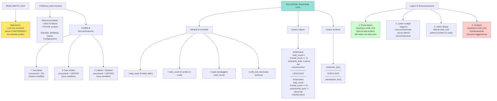

---

### Domanda: Spiegare brevemente cos'è un monitor e una variabile di condizione.

> **Risposta:**
>
> Un **Monitor** è un costrutto di sincronizzazione di alto livello che raggruppa dati condivisi e le procedure per accedervi, garantendo mutua esclusione automatica.
>
> **Caratteristiche Monitor:**
> - Incapsulamento: dati (variabili) sono PRIVATE, accesso SOLO tramite procedure public del monitor
> - Mutua esclusione automatica: il compilatore genera codice che assicura solo 1 processo dentro il monitor alla volta
> - Atomicità: operazioni all'interno sono indivisibili
> - Eliminazione di race condition: il lock è implicito, non manuale
>
> **Variabile di Condizione:**
> Una variabile di condizione (Condition Variable - CV) è un meccanismo per sospendere un processo dentro un monitor quando una certa condizione non è soddisfatta, rilasciando il lock monitor affinché altri processi possano procedere.
>
> **Operazioni su Variabile di Condizione:**
>
> 1. **wait():**
>    - Sospende il processo che la chiama
>    - Rilascia il lock del monitor (permettendo ad altri di entrare)
>    - Il processo entra in una coda di attesa sulla CV
>    - Al risveglio, il processo riacquisisce il lock prima di continuare
>
> 2. **signal():**
>    - Risveglia UN processo dalla coda di attesa della CV
>    - Se nessuno aspetta, non fa nulla
>    - Semantica Mesa: process svegliato NON ha priorità
>    - Il processo svegliato deve riacquisire il lock
>
> 3. **broadcast():**
>    - Risveglia TUTTI i processi in attesa sulla CV
>    - Utile quando la condizione interessa multipli processi
>    - Più costoso di signal(), ma garantisce correttezza
>
> **Esempio: Buffer Boundato (Problema Produttore-Consumatore):**
> 
> Un buffer di dimensione fissa:
> - Produttore inserisce elementi (wait se pieno)
> - Consumatore estrae elementi (wait se vuoto)
> - Massimo concorrenza senza race condition

**Schema:**

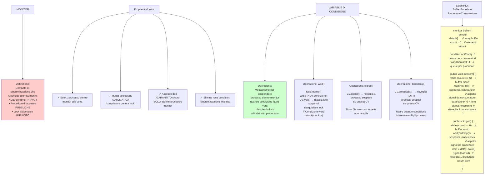

---

### Domanda: Cos'è un'istruzione compare-and-swap? Spiegarne funzionamento e funzione.

> **Risposta:**
>
> **Compare-And-Swap (CAS)** è un'istruzione assembly atomica (indivisibile) che esegue tre operazioni come se fossero una sola:
> 1. Confronta il valore in memoria con un valore atteso
> 2. Se uguali, scrive un nuovo valore in memoria
> 3. Ritorna il risultato del confronto
>
> **Sintassi Pseudo-Code:**
> ```
> bool CAS(address, expected, new):
>   if (MEM[address] == expected)
>     MEM[address] = new
>     return TRUE
>   else
>     return FALSE
> ```
>
> **Proprietà Fondamentale - ATOMICITÀ:**
> L'istruzione è ATOMICA, cioè non può essere interrotta a metà. Nessun'altra CPU può leggere/scrivere la locazione di memoria durante l'esecuzione di CAS. Questo è implementato a livello hardware (bus lock).
>
> **Differenze importanti:**
> - CAS è atomica MA non è un mutex/lock (non fa busy-wait necessariamente)
> - CAS è una primitiva più bassa di mutex/semaforo
> - CAS permette lock-free programming (dato che il confronto-and-swap è indivisibile)
>
> **Utilizzi Comuni:**
>
> 1. **Lock-Free Data Structures:** Stack, queue, hash table senza lock
> 2. **Implementare Mutex/Spin-lock:** Usando CAS per la sincronizzazione
> 3. **Memory Allocation:** Allocatori lock-free con CAS
> 4. **Atomic Counters:** Incrementi thread-safe senza lock
>
> **Esempio: Implementazione di Mutex usando CAS:**
> ```
> struct Mutex {
>   int locked = 0
> }
> 
> void lock(Mutex *m) {
>   while (!CAS(&m->locked, 0, 1)) {
>     // Se CAS ritorna FALSE: locked era 1, qualcuno l'ha già
>     // Ripeti finché CAS ritorna TRUE
>   }
> }
> 
> void unlock(Mutex *m) {
>   m->locked = 0
> }
> ```
>
> **Il Problema ABA:**
> 
> Scenario critico con CAS:
> - Thread A legge: valore = A
> - Thread B cambia: A → B → A (ritorno a A)
> - Thread A fa CAS(A) → SUCCEEDS, ma B ha fatto modifiche!
> - A pensa "niente è cambiato", ma la risorsa è stata modificata
>
> **Soluzione:** Aggiungere un version counter
> ```
> bool CAS2(address, expected_value, expected_version, 
>           new_value, new_version):
>   if (MEM[address].value == expected_value AND
>       MEM[address].version == expected_version)
>     MEM[address].value = new_value
>     MEM[address].version = new_version
>     return TRUE
>   else
>     return FALSE
> ```

**Schema:**

```mermaid
graph TD
    A["COMPARE-AND-SWAP CAS"] --> B["Definizione:<br/>Istruzione assembly ATOMICA<br/>che esegue indivisibilmente:<br/>Confronto + possibile modifica<br/>in un'unica operazione"]
    
    C["Sintassi Pseudo-Code"] --> C1["bool CAS(address, expected, new) {<br/>  // ATOMICA - non interrompibile<br/>  if (MEM[address] == expected) {<br/>    MEM[address] = new<br/>    return TRUE<br/>  } else {<br/>    return FALSE<br/>  }<br/>}"]
    
    D["Proprietà Cruciale"] --> D1["✓ ATOMICITÀ:<br/>Non può essere interrotta<br/>a metà operazione<br/>Hardware garantisce"]
    
    D --> D2["✓ Implementazione Hardware:<br/>Istruzioni CPU specifiche<br/>es. x86: CMPXCHG<br/>es. ARM: LDREX/STREX"]
    
    D --> D3["✓ Lock-Free:<br/>NON fa busy-wait necessario<br/>diverso da spin-lock<br/>Primitiva molto bassa livello"]
    
    D --> D4["✓ Atomicità a Bus Level:<br/>Bus lock previene<br/>accesso concorrente<br/>altre CPU non leggono/scrivono"]
    
    E["Utilizzi Comuni"] --> E1["1. Lock-Free Data Structures<br/>   • Stack atomico<br/>   • Queue atomica<br/>   • Hash table senza lock"]
    
    E --> E2["2. Implementare Mutex/Semafori<br/>   • Senza primitive kernel"]
    
    E --> E3["3. Atomic Counters<br/>   • Incrementi thread-safe"]
    
    E --> E4["4. Memory Allocation<br/>   • Allocatori lock-free"]
    
    F["Esempio: Mutex con CAS"] --> F1["struct Mutex { int locked=0 }<br/><br/>lock(Mutex *m) {<br/>  while (!CAS(&m->locked, 0, 1))<br/>    ; // spin: ripeti finché<br/>      // locked era 1<br/>}<br/><br/>unlock(Mutex *m) {<br/>  m->locked = 0<br/>}"]
    
    G["PROBLEMA: ABA Problem"] --> G1["Thread A: legge X = 'A'<br/>Thread B: cambia<br/>          'A' → 'B' → 'A'<br/>Thread A: CAS(A) → SUCCESS<br/><br/>⚠️ FALSO: B ha modificato!<br/>    A pensa 'niente cambiato'<br/>    ma la risorsa è stata<br/>    modificata e ripristinata<br/><br/>SOLUZIONE:<br/>Aggiungere version counter<br/>CAS(value, version)<br/>anche se valore torna = version<br/>protegge da ABA"]
    
    style C1 fill:#ffccff
    style F1 fill:#ccffff
    style G1 fill:#ffcccc
```

---

### Domanda: Cos'è un vettore delle interruzioni? Descrivere come viene utilizzato per la gestione delle interruzioni.

> **Risposta:**
>
> Un **Vettore delle Interruzioni (Interrupt Vector Table - IVT)** è una tabella in memoria che mappa ogni tipo di interruzione al suo Interrupt Service Routine (ISR) corrispondente. Quando si verifica un'interruzione, la CPU consulta questa tabella per determinare quale codice eseguire.
>
> **Posizionamento in Memoria:**
> - IVT risiede negli indirizzi BASSI della memoria RAM
> - Su x86: indirizzi 0x00000000 - 0x000003FF (primo 1KB)
> - Ogni entry è un puntatore (4 byte su 32-bit, 8 byte su 64-bit)
> - Max 256 interruzioni (0-255)
>
> **Struttura della Tabella:**
> ```
> 0x00: [Indirizzo ISR per INT 0 - Divide by Zero]
> 0x04: [Indirizzo ISR per INT 1 - Debug]
> 0x08: [Indirizzo ISR per INT 2 - NMI]
> ...
> 0x20: [Indirizzo ISR per INT 32 - Timer]
> 0x24: [Indirizzo ISR per INT 33 - Keyboard]
> ...
> 0x3FF: [Indirizzo ISR per INT 255]
> ```
>
> **Flusso di Gestione Interruzione:**
>
> 1. **CPU riceve interruzione:** Da hardware (device interrupt) o software (INT instruction)
> 2. **CPU estrae numero interruzione:** Numero identifica il tipo (es. 33 per keyboard)
> 3. **CPU consulta IVT:** indirizzoISR = IVT[numero × 4]
> 4. **CPU salva stato:** PC (program counter), flags, registri dello stack
> 5. **CPU salta a ISR:** Modifica PC = indirizzoISR
> 6. **ISR esegue:** Gestisce l'interruzione (es. legge dati keyboard, incrementa counter)
> 7. **ISR termina:** Istruzione IRET (Interrupt Return)
> 8. **CPU ripristina stato:** Ripristina PC, flags, registri dall'stack
> 9. **Riprende processo:** Processo continua da dove era stato interrotto
>
> **Vantaggi della IVT:**
>
> 1. **Flessibilità:** Gli indirizzi ISR sono modificabili, permettendo al SO di aggiornare i gestori
> 2. **Estensibilità:** Nuovo dispositivo = creare nuovo ISR e aggiornare entry IVT
> 3. **Velocità:** Lookup è O(1) - accesso diretto tramite indice
> 4. **Centralizzazione:** Tutti i gestori sono in una tabella facilmente rintracciabile
>
> **Note Importanti:**
> - Differente da Interrupt Descriptor Table (IDT) su x86 moderno (protetta in kernel)
> - IVT nel ring 0 (kernel mode) per prevenire modifiche malevoli
> - Un'interruzione può essere mascherata (disabilitata) tramite interrupt enable flag

**Schema:**

```mermaid
graph TD
    A["VETTORE DELLE INTERRUZIONI<br/>Interrupt Vector Table - IVT"] --> B["Definizione:<br/>Tabella in memoria che mappa<br/>ogni tipo di interruzione<br/>al suo Interrupt Service<br/>Routine ISR corrispondente"]
    
    C["Struttura in Memoria"] --> C1["Indirizzi BASSI in RAM:<br/>(primo 1KB su x86)"]
    C1 --> C1A["0x00 (offset 0x00):<br/>ISR per INT 0<br/>Divide by Zero<br/>└→ kernel_divide_by_zero()"]
    C1 --> C1B["0x04 (offset 0x04):<br/>ISR per INT 1<br/>Debug<br/>└→ kernel_debug()"]
    C1 --> C1C["0x08 (offset 0x08):<br/>ISR per INT 2<br/>NMI (Non-Maskable)<br/>└→ kernel_nmi()"]
    C1 --> C1D["..."]
    C1 --> C1E["0x20 (offset 0x20):<br/>ISR per INT 32<br/>Timer Interrupt<br/>└→ kernel_timer_handler()"]
    C1 --> C1F["0x24 (offset 0x24):<br/>ISR per INT 33<br/>Keyboard Interrupt<br/>└→ kernel_keyboard_handler()"]
    C1 --> C1G["0x28 (offset 0x28):<br/>ISR per INT 34<br/>COM1 Serial Port<br/>└→ kernel_serial_handler()"]
    C1 --> C1H["..."]
    C1 --> C1I["0x3FF (offset 0x3FF):<br/>ISR per INT 255<br/>└→ ..."]
    
    D["Flusso di Gestione Interruzione"] --> D1["Step 1: CPU riceve interrupt<br/>Fonte: hardware device o<br/>        software INT instruction<br/>Numero: identifica tipo"]
    
    D --> D2["Step 2: CPU estrae numero interrupt<br/>Esempio: Keyboard interrupt<br/>         = numero 33"]
    
    D --> D3["Step 3: CPU consulta IVT<br/>Calcola: offset = numero × 4<br/>Legge: indirizzoISR = IVT[33×4]"]
    
    D --> D4["Step 4: CPU salva stato<br/>Salva stack:<br/>• Program Counter PC<br/>• EFLAGS (interrupt enable)<br/>• Segmento CS<br/>• Registri generali"]
    
    D --> D5["Step 5: CPU salta a ISR<br/>Modifica PC = indirizzoISR<br/>Sposta controllo a ISR"]
    
    D --> D6["Step 6: ISR esegue<br/>Gestisce specificamente<br/>l'interruzione<br/>Esempio keyboard:<br/>• Legge scancode dalla porta"]
    
    D --> D7["Step 7: ISR termina<br/>Istruzione IRET<br/>(Interrupt Return)"]
    
    D --> D8["Step 8: CPU ripristina stato<br/>Estrae da stack:<br/>• Program Counter<br/>• EFLAGS<br/>• Registri"]
    
    D --> D9["Step 9: Processo riprende<br/>PC ripristinato<br/>Esecuzione continua<br/>da istruzione successiva<br/>come se nulla fosse accaduto"]
    
    E["Vantaggi della IVT"] --> E1["✓ Flessibilità:<br/>Indirizzi ISR modificabili<br/>SO può aggiornare gestori<br/>a runtime"]
    
    E --> E2["✓ Estensibilità:<br/>Nuovo dispositivo hardware<br/>= nuovo ISR +<br/>  aggiornare entry IVT<br/>NO modifiche kernel core"]
    
    E --> E3["✓ Velocità:<br/>Lookup O(1)<br/>Accesso diretto tramite indice<br/>VS. ricerca lineare"]
    
    E --> E4["✓ Centralizzazione:<br/>Tutti gestori in una<br/>tabella tracciabile<br/>Facile debugging"]
    
    style C1 fill:#ffcccc
    style D fill:#ccffcc
```

---

### Domanda: Nell'ambito dello scheduling dei processi spiegare brevemente il problema dell'inversione di priorità.

> **Risposta:**
>
> L'**Inversione di Priorità** è una situazione anomala in cui un processo ad ALTA priorità si ritrova ad aspettare un processo a BASSA priorità, causando una violazione della semantica dello scheduling prioritario.
>
> **Scenario Tipico:**
>
> Consideriamo tre processi: H (alta priorità), M (media), L (bassa):
>
> 1. **Tempo t=0:** Processo L acquisissce un lock su risorsa R
> 2. **Tempo t=1:** Processo H tenta di accedere a R, ma L la tiene
>    - H si blocca, entra in coda di attesa per il lock
>    - H NON può procedere finché L non rilascia
> 3. **Tempo t=2:** Processo M diventa ready (es. operazione I/O completata)
>    - M ha priorità > L (ma < H)
>    - Scheduler sceglie M, non L (L è bloccato in attesa di H)
>    - M esegue
> 4. **PROBLEMA:** Ora abbiamo:
>    - H non avanza (aspetta L)
>    - L non avanza (bloccato, M ha priorità più alta)
>    - M avanza (non dovrebbe!)
>    - Risultato: M è effettivamente "prioritario" di H!
>
> **Conseguenze Critiche:**
>
> 1. **Violazione Semantica:** La proprietà fondamentale "job alta priorità prima di bassa priorità" è violata
> 2. **Deadline Miss:** Se H ha un deadline critico, probabilmente lo mancherà
> 3. **Impredicibilità:** Comportamento del sistema diventa difficile da predicere
> 4. **Sistemi Real-Time:** Particolarmente problematico (es. controllo automobilistico)
>
> **Soluzioni:**
>
> **1. Priority Inheritance (Ereditarietà Priorità):**
> Quando un processo L blocca un processo H, L eredita temporaneamente la priorità di H.
> ```
> Quando H si blocca su lock tenuto da L:
> - Priorità di L → max(priorità_L, priorità_H)
> - Scheduler sceglie L (ha ora priorità alta)
> - L completarapidamente, rilascia lock
> - H acquisisce lock
> - Priorità di L → priorità originale
> ```
> Vantaggi: Previene inversion, l'algoritmo L avanza veloce
> Svantaggi: Aumento priorità transitorio
>
> **2. Priority Ceiling (Soffitto Prioritario):**
> Ogni risorsa ha una "priority ceiling" = massima priorità tra i processi che la usano.
> Quando un processo acquisisce la risorsa, la sua priorità sale al ceiling.
> ```
> Esempio: Risorsa R usata da processi con priorità [10, 20, 30]
> Ceiling di R = 30
> 
> Quando processo P (priorità 15) acquisisce R:
> - Priorità di P → 30
> - Nessun processo > 30 può eseguire
> - Nessun processo > 30 attenderà R
> - NO inversion possibile
> ```
> Vantaggi: Previene completamente inversion
> Svantaggi: Overhead computazionale, potenziale overkill
>
> **3. Disable Preemption (Disabilitare Preemption):**
> Durante una sezione critica, disabilitare gli interrupt/preemption.
> ```
> lock(risorsa):
>   disable_preemption()
> 
> // sezione critica
> 
> unlock(risorsa):
>   enable_preemption()
> ```
> Vantaggi: Semplice da implementare
> Svantaggi: Riduce responsiveness, non scalabile su multicore

**Schema:**

```mermaid
graph TD
    A["INVERSIONE DI PRIORITÀ<br/>Priority Inversion"] --> B["Definizione:<br/>Situazione in cui un processo<br/>ad ALTA priorità aspetta<br/>un processo a BASSA priorità<br/><br/>Viola semantica scheduling"]
    
    C["Scenario Classico"] --> C1["Tempo t=0:<br/>Processo BASSO L<br/>acquisisce lock su<br/>risorsa R<br/><br/>Stato: L=exec,  M=ready, H=ready"]
    
    C --> C2["Tempo t=1:<br/>Processo ALTO H<br/>tenta accedere a R<br/>ma L la tiene<br/>→ H si blocca<br/><br/>Stato: L=exec,  M=ready, H=blocked(R)"]
    
    C --> C3["Tempo t=2:<br/>Processo MEDIO M<br/>diventa ready<br/>Scheduler:<br/>non sceglie L (bloccato)<br/>→ sceglie M<br/>(priorità > L)<br/><br/>Stato: M=exec,  L=wait,   H=blocked(R)"]
    
    C --> C4["⚠️ PROBLEMA:<br/>H non avanza (aspetta L)<br/>L non avanza (M lo blocca)<br/>M avanza (non dovrebbe!)<br/><br/>M è effettivamente prioritario di H!"]
    
    D["Conseguenze"] --> D1["✗ Violazione Semantica<br/>Proprietà 'alta priorità prima'<br/>è VIOLATA"]
    
    D --> D2["✗ Deadline Miss<br/>Se H ha deadline critico<br/>probabilmente fallisce"]
    
    D --> D3["✗ Impredicibilità<br/>Comportamento sistema<br/>non prevedibile<br/>difficile fare timing analysis"]
    
    D --> D4["✗ Critico Real-Time<br/>Sistemi embedded<br/>controllo auto, medico"]
    
    E["SOLUZIONI"] --> E1["1. Priority Inheritance<br/>─────────────────<br/>Quando L blocca H:<br/>Priorità(L) = max(pri(L), pri(H))<br/><br/>Effetto:<br/>Scheduler sceglie L subito<br/>L completa veloce<br/>Rilascia lock → H procede<br/>Priorità(L) = priorità orig.<br/><br/>+ Efficace<br/>- Overhead">]
    
    E --> E2["2. Priority Ceiling<br/>─────────────────<br/>Risorsa R ha soffitto<br/>= max priorità che usa R<br/><br/>Quando processo P<br/>acquisisce R:<br/>Priorità(P) = ceiling(R)<br/><br/>Effetto:<br/>Nessun processo > ceiling<br/>esegue → NO inversion<br/><br/>+ Previene completamente<br/>- Overkill, overhead"]
    
    E --> E3["3. Disable Preemption<br/>─────────────────<br/>Durante sezione critica:<br/>disable_preemption()<br/><br/>Effetto:<br/>Nessuno può preemptare<br/>NO inversion<br/><br/>+ Semplice<br/>- Riduce responsiveness<br/>- Non scalabile multicore"]
    
    style B fill:#ff9999
    style C4 fill:#ffcccc
    style E1 fill:#99ff99
    style E2 fill:#99ff99
```

---

## 4. DOMANDE A RISPOSTA MULTIPLA

### Quiz 1: Sincronizzazione

> **Domanda:** Quale tra queste affermazioni sui meccanismi di sincronizzazione è vera?

**Schema:**

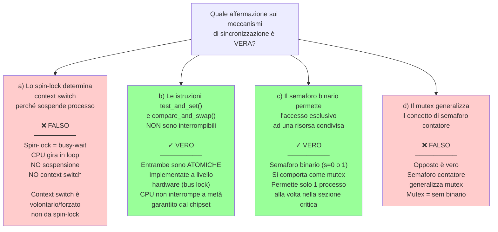

---

### Quiz 2: Thread e Processi

> **Domanda:** Quale tra queste affermazioni su thread e processi è vera?

**Schema:**

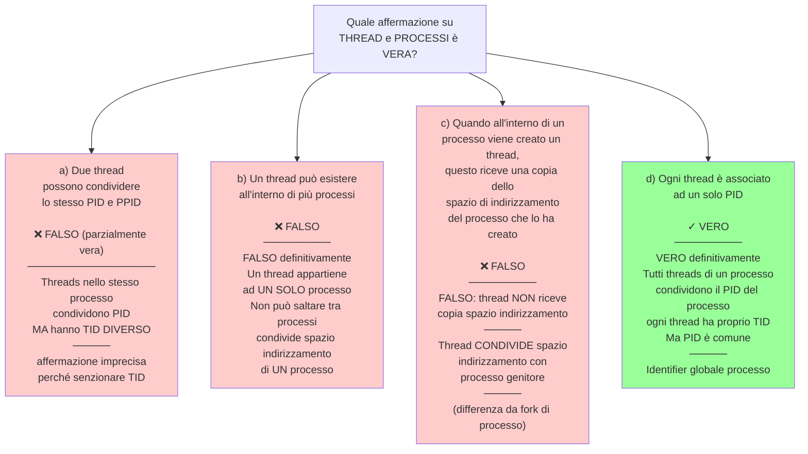

---

### Quiz 3: Allocazione File

> **Domanda:** Quale tra queste affermazioni sull'allocazione dei file è vera?

**Schema:**

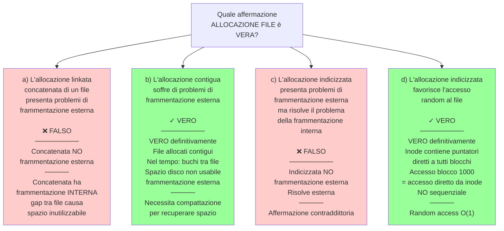

---

### Quiz 4: Scheduling

> **Domanda:** Quale tra queste affermazioni sullo scheduling dei processi è vera?

**Schema:**

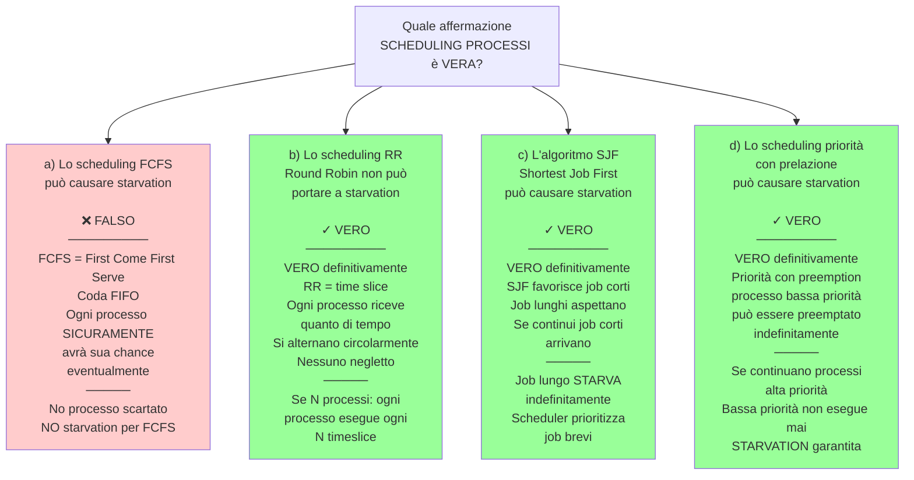

---

### Quiz 5: Struttura SO

> **Domanda:** Quale delle seguenti affermazioni sulla struttura SO è vera?

**Schema:**

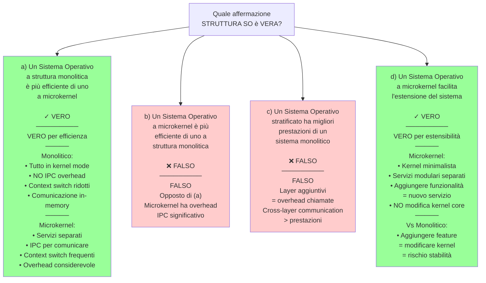

---

### Quiz 6: Copy-on-Write

> **Domanda:** Quale delle seguenti affermazioni sul copy_on_write è vera?

**Schema:**

```mermaid
graph TB
    Q["Quale affermazione<br/>COPY-ON-WRITE è VERA?"]
    
    A["a) È una tecnica per<br/>la sincronizzazione tra<br/>processi evitando<br/>corse critiche<br/><br/>❌ FALSO<br/>─────────<br/>FALSO<br/>COW NON è per<br/>sincronizzazione<br/>─────<br/>COW è tecnica<br/>ALLOCAZIONE MEMORIA<br/>per ottimizzare fork"]
    
    B["b) È un metodo che<br/>permette al processo<br/>figlio di condividere<br/>inizialmente le stesse<br/>pagine del processo padre<br/><br/>✓ VERO<br/>─────────<br/>VERO definitivamente<br/>─────<br/>COW: Copy-On-Write<br/>Processo figlio<br/>condivide pagine padre<br/>mark come read-only<br/>─────<br/>Al primo write:\br/>• Trap (page fault)\br/>• SO copia pagina\br/>• Modifica copia del figlio"]
    
    C["c) È un metodo per<br/>velocizzare la creazione<br/>dei processi<br/><br/>✓ VERO<br/>─────────<br/>VERO definitivamente<br/>─────<br/>fork() tradizionale:\br/>copia SUBITO tutto\br/>spazio indirizzamento<br/>= lento<br/>─────<br/>COW fork():\br/>Condividi subito\br/>Copia solo se modifiche\br/>= veloce"]
    
    D["d) È una tecnica che<br/>consente di minimizzare<br/>il numero di pagine<br/>allocate per un nuovo<br/>processo<br/><br/>✓ VERO<br/>─────────<br/>VERO definitivamente<br/>─────<br/>Molti processi mai<br/>modificano memoria padre<br/>Con COW: condividono<br/>indefinitamente<br/>─────<br/>Allocazione minima"]
    
    Q --> A
    Q --> B
    Q --> C
    Q --> D
    
    style B fill:#99ff99
    style C fill:#99ff99
    style D fill:#99ff99
    style A fill:#ffcccc
```

---

## TABELLA RIASSUNTIVA RISPOSTE CORRETTE

```mermaid
graph LR
    QUIZ["QUIZ CORRETTI<br/>RISPOSTE MULTIPLE"]
    
    QUIZ --> Q1["<b>Quiz 1</b><br/>SINCRONIZZAZIONE<br/>─────────────<br/>✓ b) test_and_set/CAS<br/>   NON interrompibili<br/>✓ c) Semaforo binario<br/>   accesso esclusivo"]
    
    QUIZ --> Q2["<b>Quiz 2</b><br/>THREAD-PROCESSI<br/>─────────────<br/>✓ d) Ogni thread<br/>   associato a 1 PID"]
    
    QUIZ --> Q3["<b>Quiz 3</b><br/>ALLOCAZIONE FILE<br/>─────────────<br/>✓ b) Contigua<br/>   frammentazione esterna<br/>✓ d) Indicizzata<br/>   accesso random veloce"]
    
    QUIZ --> Q4["<b>Quiz 4</b><br/>SCHEDULING<br/>─────────────<br/>✓ b) RR = NO starvation<br/>✓ c) SJF = starvation<br/>✓ d) Priorità preempt<br/>   = starvation"]
    
    QUIZ --> Q5["<b>Quiz 5</b><br/>STRUTTURA SO<br/>─────────────<br/>✓ a) Monolitico<br/>   più efficiente<br/>✓ d) Microkernel<br/>   estendibile"]
    
    QUIZ --> Q6["<b>Quiz 6</b><br/>COPY-ON-WRITE<br/>─────────────<br/>✓ b) Condivisione pagine<br/>✓ c) Velocizza creazione<br/>✓ d) Minimizza allocazione"]
    
    style QUIZ fill:#ffe66d
    style Q1 fill:#ffcccc
    style Q2 fill:#ccffcc
    style Q3 fill:#ccffff
    style Q4 fill:#ffccff
    style Q5 fill:#ffffcc
    style Q6 fill:#ffccee
```

---

**Tutte le risposte sono completate con testo esplicativo e schemi Mermaid. Le risposte possono essere copiate direttamente in Obsidian usando la sintassi ` ```mermaid `.**
